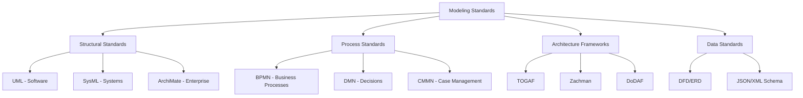
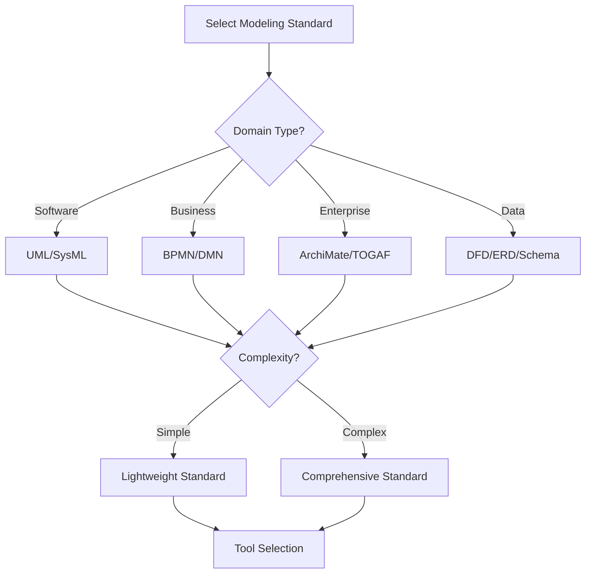
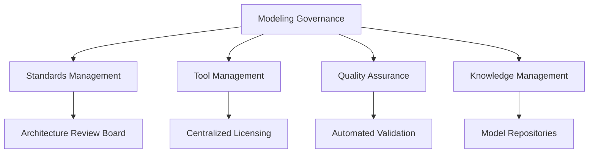
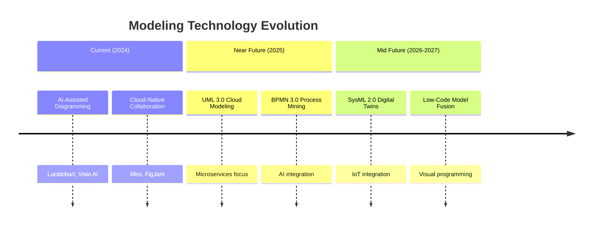
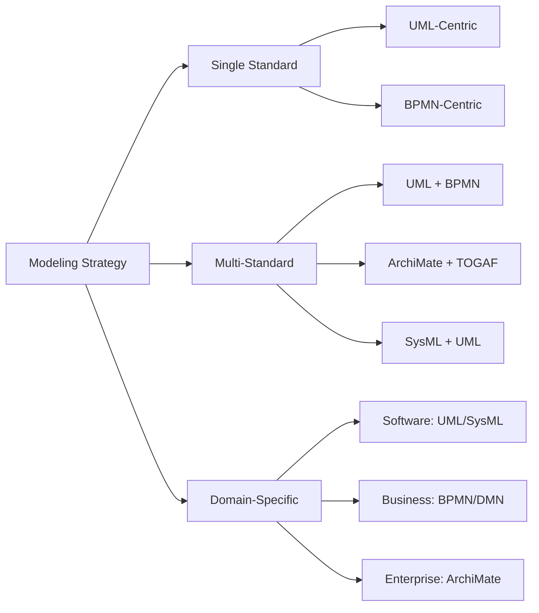
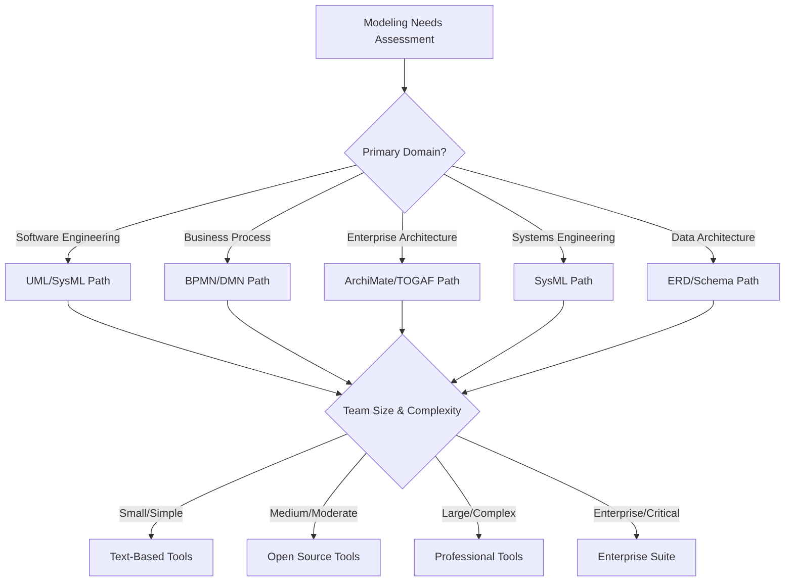
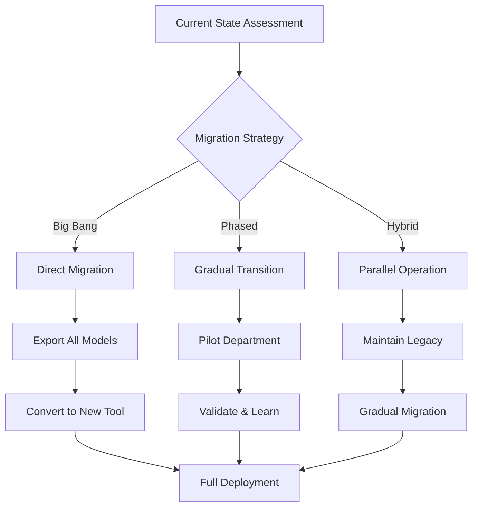
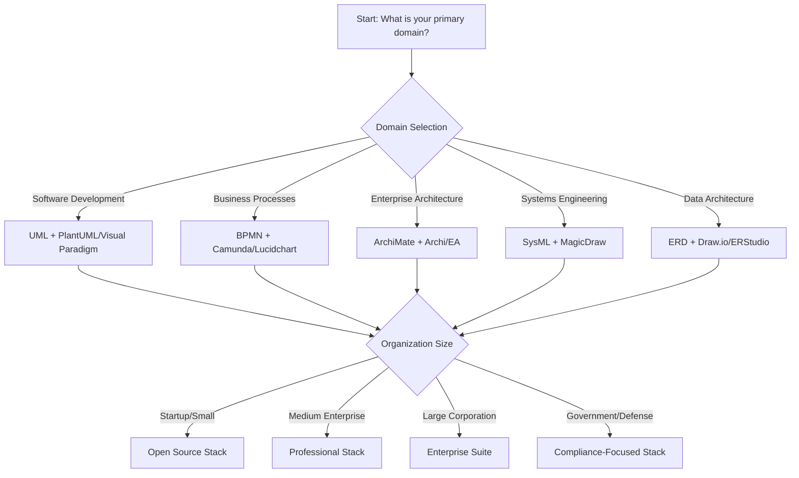

# Modeling Standards and Tools Guide

## Overview

This guide provides a comprehensive framework for understanding and selecting modeling standards and tools across software development, enterprise architecture, and business process domains. It follows MECE principles to ensure complete, non-overlapping coverage of essential concepts.

## Modeling Standards Classification

### Structural Modeling Standards

| Standard | Domain | Primary Use | Version | Governing Body |
|----------|--------|-------------|---------|----------------|
| **UML** | Software Engineering | System structure & behavior | 2.5.1 | OMG |
| **SysML** | Systems Engineering | Complex system design | 1.6 | OMG |
| **ArchiMate** | Enterprise Architecture | Multi-layer architecture | 3.2 | The Open Group |

### Process Modeling Standards

| Standard | Domain | Primary Use | Version | Governing Body |
|----------|--------|-------------|---------|----------------|
| **BPMN** | Business Processes | Process flow modeling | 2.0.2 | OMG |
| **DMN** | Decision Management | Decision rules & logic | 1.4 | OMG |
| **CMMN** | Case Management | Adaptive case handling | 1.1 | OMG |

### Architecture Frameworks

| Framework | Scope | Industry Focus | Complexity |
|-----------|-------|----------------|------------|
| **TOGAF** | Enterprise Architecture | Cross-industry | High |
| **Zachman** | Enterprise Architecture | Government/Large Enterprise | High |
| **DoDAF** | Defense Architecture | Military/Defense | Very High |

### Data Modeling Standards

| Standard | Type | Use Case | Format |
|----------|------|----------|--------|
| **DFD** | Process Flow | System data movement | Visual |
| **ERD** | Relational | Database design | Visual |
| **JSON Schema** | Validation | API/data contracts | Text |
| **XML Schema** | Validation | Document structure | Text |

## Tools Ecosystem

### Tool Selection Matrix

| Tool Type | Cost | Learning Curve | Collaboration | Standards Support |
|-----------|------|----------------|--------------|-------------------|
| **Graphics Tools** | Variable | Low-Medium | High | Limited |
| **Professional Tools** | High | High | High | Comprehensive |
| **Open Source Tools** | Free | Medium | Medium | Good |
| **Text-Based Tools** | Free | Low | High (Git) | Excellent |

### Graphics-Based Tools

#### General Graphics Tools
| Tool | Primary Use | Platforms | Collaboration |
|------|-------------|-----------|--------------|
| **Microsoft Visio** | General diagramming | Windows | SharePoint Integration |
| **Draw.io (diagrams.net)** | General diagramming | Web, Desktop | Real-time (cloud) |
| **Lucidchart** | Collaborative diagramming | Web-based | Real-time collaboration |
| **OmniGraffle** | Visual design | macOS | iCloud sync |
| **yEd Graph Editor** | Graph layouts | Cross-platform | Export-focused |

#### Professional Modeling Tools
| Tool | Standards | Domain | Target Users |
|------|-----------|--------|--------------|
| **Enterprise Architect** | UML, SysML, BPMN | Enterprise Architecture | Architects, Analysts |
| **Visual Paradigm** | UML, SysML, BPMN | Software Development | Developers, Designers |
| **MagicDraw** | UML, SysML | Systems Engineering | Engineers, Modelers |
| **IBM Rational Rhapsody** | UML, SysML | Embedded Systems | Systems Engineers |
| **StarUML** | UML | Software Development | Developers |

#### Open Source Modeling Tools
| Tool | Standards | Language | Integration |
|------|-----------|----------|------------|
| **Archi** | ArchiMate | Java | Model exchange |
| **Modelio** | UML, BPMN | Java | Plugin ecosystem |
| **ArgoUML** | UML | Java | Standards compliant |

### Text-Based Diagramming

| Language | Primary Use | Rendering | Ecosystem |
|----------|-------------|-----------|-----------|
| **PlantUML** | UML, BPMN | Java-based | IDE integrations |
| **Mermaid** | General diagrams | JavaScript | Web-native |
| **Graphviz (DOT)** | Graph layouts | C library | Extensive |
| **TikZ** | Publication quality | LaTeX | Academic |

### Markup Languages for Documentation

| Language | Strength | Use Case | Tooling |
|----------|----------|----------|--------|
| **Markdown** | Simplicity | Technical docs | Universal |
| **AsciiDoc** | Features | Books/manuals | Antora, Asciidoctor |
| **reStructuredText** | Extensibility | Python docs | Sphinx |

## Standards vs Tools: Key Distinctions

| Aspect | Standards | Tools |
|--------|-----------|-------|
| **Nature** | Specifications & guidelines | Implementations & applications |
| **Purpose** | Define syntax & semantics | Provide functionality & interfaces |
| **Maintenance** | Standardization bodies | Commercial/OS communities |
| **Lifecycle** | Version-controlled evolution | Feature-driven development |
| **Interoperability** | Ensured by specification | Varies by implementation |

## Decision Framework

### Standard Selection Criteria

### Tool Selection Matrix

| Decision Factor | Weight | Evaluation Criteria |
|-----------------|--------|-------------------|
| **Team Skills** | High | Learning curve, training needs |
| **Project Scale** | High | Feature requirements, scalability |
| **Budget** | Medium | License costs, maintenance |
| **Integration** | Medium | API support, format compatibility |
| **Collaboration** | Medium | Multi-user, version control |
| **Standards Compliance** | High | Specification adherence |

## Application Mapping

### Domain-Specific Recommendations

| Domain | Primary Standards | Recommended Tools | Use Cases |
|--------|------------------|------------------|-----------|
| **Software Development** | UML, SysML | Visual Paradigm, StarUML, PlantUML | System design, API documentation |
| **Business Process** | BPMN, DMN | Camunda, Bizagi, Lucidchart | Workflow automation, decision modeling |
| **Enterprise Architecture** | ArchiMate, TOGAF | Archi, Enterprise Architect | IT strategy, business alignment |
| **Systems Engineering** | SysML | MagicDraw, IBM Rhapsody | Embedded systems, hardware-software |
| **Data Architecture** | ERD, Schema | Draw.io, ER/Studio | Database design, API contracts |

### Project Size Guidelines

| Project Size | Team | Duration | Recommended Approach |
|--------------|------|----------|---------------------|
| **Small** | 1-5 people | < 3 months | Text-based tools (PlantUML, Mermaid) |
| **Medium** | 5-20 people | 3-12 months | Open source tools (Archi, Modelio) |
| **Large** | 20+ people | > 1 year | Professional tools (EA, Visual Paradigm) |
| **Enterprise** | Multiple teams | Ongoing | Integrated suite (TOGAF + tools) |

## Implementation Best Practices

### Modeling Governance Framework

| Governance Area | Key Practices | Implementation Metrics |
|------------------|---------------|------------------------|
| **Standards Compliance** | Define before tool selection | 100% specification adherence |
| **Tool Consistency** | Standardized toolset across teams | < 3 different tools per domain |
| **Version Control** | Git-based model tracking | All models under version control |
| **Quality Assurance** | Automated validation checks | Zero critical compliance errors |
| **Knowledge Sharing** | Centralized pattern repositories | 80% model reuse rate |

### Integration Ecosystem

| Integration Type | Tools & Platforms | Benefits |
|------------------|-------------------|----------|
| **Development IDE** | VS Code, IntelliJ plugins | Seamless developer workflow |
| **Documentation** | Confluence, GitBook, MkDocs | Living documentation |
| **CI/CD Pipeline** | Jenkins, GitLab CI | Automated model validation |
| **Collaboration** | Slack, Teams integration | Real-time notifications |
| **Code Generation** | Model-to-code frameworks | Reduced development time |

## Emerging Trends & Future Outlook

### Technology Evolution Timeline

### Standards Roadmap

| Standard | Current Version | Next Release | Key Focus Areas |
|----------|-----------------|--------------|-----------------|
| **UML** | 2.5.1 (2017) | 3.0 (TBD) | Cloud modeling, microservices, DevOps |
| **BPMN** | 2.0.2 (2014) | 3.0 (TBD) | Process mining, AI automation, case handling |
| **SysML** | 1.6 (2019) | 2.0 (TBD) | Digital twins, IoT, model simulation |
| **ArchiMate** | 3.2 (2021) | 3.x (TBD) | Cloud architecture, DevOps, agile EA |
| **DMN** | 1.4 (2021) | 1.x (TBD) | Machine learning integration, explainable AI |

### Market Disruptors

| Trend | Impact Level | Timeline | Tools Adapting |
|-------|--------------|----------|----------------|
| **AI-Generated Models** | High | 1-2 years | Lucidchart AI, Visio CoPilot |
| **Real-Time Collaboration** | Medium | Current | Miro, FigJam, Lucidchart |
| **Model-Driven Code Generation** | High | Established | MagicDraw, Enterprise Architect |
| **Low-Code/No-Code Integration** | Medium | Growing | OutSystems, Appian, Mendix |
| **Blockchain-Based Model Storage** | Low | Experimental | Emerging research projects |

## Strategic Implementation Framework

### Hybrid Modeling Strategies

### Tool Combination Patterns

| Pattern | Standards | Tools | Use Case |
|---------|-----------|-------|----------|
| **Design + Documentation** | UML, BPMN | PlantUML + GitBook | Technical specification |
| **Modeling + Development** | UML, SysML | MagicDraw + IDE plugins | Code generation |
| **Standard + Custom** | ArchiMate + Custom | Archi + Internal tools | Enterprise-specific needs |
| **Process + Analytics** | BPMN, DMN | Camunda + Power BI | Process optimization |

### Migration & Transition Planning

| Migration Phase | Duration | Key Activities | Success Metrics |
|-----------------|----------|----------------|-----------------|
| **Assessment** | 2-4 weeks | Current state analysis, requirements gathering | Complete inventory |
| **Pilot** | 4-8 weeks | Small team testing, validation | 90% user satisfaction |
| **Phased Rollout** | 8-16 weeks | Department by department deployment | 80% adoption per phase |
| **Full Migration** | 4-8 weeks | Organization-wide transition | 100% operational |
| **Optimization** | Ongoing | Continuous improvement | Efficiency gains |

## Decision Support System

### Comprehensive Selection Framework

### Risk-Based Decision Matrix

| Risk Factor | Low Risk Approach | Medium Risk Approach | High Risk Approach |
|-------------|-------------------|---------------------|-------------------|
| **Budget Constraints** | Open source (PlantUML, Archi) | Mixed (Free + Limited paid) | Full commercial suite |
| **Timeline Pressure** | Familiar tools only | Quick learning curve | Comprehensive training |
| **Integration Needs** | Standalone tools | API-connected tools | Fully integrated platform |
| **Compliance Requirements** | Basic standards compliance | Industry-specific compliance | Regulatory-grade compliance |

### Cost-Benefit Analysis Framework

| Investment Level | Tool Cost | Training Cost | ROI Timeline | Total Value |
|------------------|-----------|--------------|--------------|------------|
| **Starter** | $0-5K | $1-2K | 3-6 months | Quick wins, limited scale |
| **Professional** | $10-50K | $5-15K | 6-12 months | Balanced investment, good ROI |
| **Enterprise** | $100K+ | $25K+ | 12-24 months | Long-term value, high impact |

## Quick Reference Guide

### Standard Selection Cheat Sheet

| Need | Standard | Why |
|------|----------|-----|
| **Object-oriented design** | UML | Industry standard for software structure |
| **Business process mapping** | BPMN | Visual process flow notation |
| **System engineering** | SysML | Hardware-software integration |
| **Enterprise architecture** | ArchiMate | Multi-layer business-IT alignment |
| **Decision logic** | DMN | Executable decision rules |
| **Database design** | ERD | Relational data modeling |

### Tool Selection Cheat Sheet

| Scenario | Recommended Tool(s) | Cost | Learning Curve | Key Benefit |
|----------|-------------------|------|----------------|-------------|
| **Quick diagrams** | Draw.io, Mermaid | Free | Low | Immediate productivity |
| **Team collaboration** | Lucidchart, Miro | $$ | Low | Real-time editing |
| **Professional UML** | Visual Paradigm, MagicDraw | $$$ | Medium | Advanced features |
| **Text-based diagrams** | PlantUML, GraphViz | Free | Medium | Version control friendly |
| **Enterprise architecture** | Archi, Enterprise Architect | Free-$$$ | Medium | Standards compliance |
| **Systems engineering** | MagicDraw, IBM Rhapsody | $$$$ | High | Domain-specific features |
| **Business process** | Camunda, Bizagi | $$-$$$ | Medium | Executable processes |
| **Documentation integration** | PlantUML + GitBook | Free | Low | Living documentation |

## Migration & Transition Strategies

### Tool Migration Path

### Risk Mitigation Framework

| Risk Category | Specific Risks | Mitigation Strategies | Success Metrics |
|----------------|---------------|---------------------|-----------------|
| **Technical Risks** | Data loss, format incompatibility | Multiple export formats, validation tools | 100% model preservation |
| **Organizational Risks** | Team resistance, skill gaps | Gradual rollout, comprehensive training | 90% adoption rate |
| **Financial Risks** | Cost overruns, ROI delays | Phased implementation, pilot testing | Within budget, 6-month ROI |
| **Operational Risks** | Productivity loss, downtime | Parallel operation, rollback plans | < 5% productivity impact |
| **Compliance Risks** | Standards violations, audit failures | Automated validation, regular reviews | Zero critical violations |

## Executive Summary & Strategic Recommendations

### Decision Tree for Modeling Approach

### Critical Success Factors

| Success Factor | Description | Measurement | Target |
|----------------|-------------|-------------|--------|
| **Standards Alignment** | Match standards to domain requirements | Compliance score | 100% specification adherence |
| **Tool Ecosystem Fit** | Integration with existing workflow | Integration metrics | < 3 tools per domain |
| **Team Capability** | Skills and training effectiveness | Skill assessment | 80% team proficiency |
| **Scalability Planning** | Future growth accommodation | Growth capacity | 3-5 year scalability |
| **Interoperability** | Cross-tool and partner compatibility | Exchange success rate | 95% successful exchanges |

### Organization-Specific Recommendations

| Organization Type | Recommended Stack | Investment | Timeline | Expected ROI |
|------------------|-------------------|------------|----------|--------------|
| **Startup/Small Team** | PlantUML + Mermaid + Draw.io | $0-5K | 1-2 months | Quick wins, high productivity |
| **Medium Enterprise** | Archi + Visual Paradigm + Camunda | $25-50K | 3-6 months | Standardized processes, good ROI |
| **Large Corporation** | Enterprise Architect + MagicDraw + TOGAF | $100-250K | 6-12 months | Enterprise-wide consistency, high ROI |
| **Government/Defense** | DoDAF + IBM Rhapsody + Custom Tools | $250K+ | 12-24 months | Regulatory compliance, long-term value |
| **Consulting/Professional Services** | Lucidchart + Visio + Multiple Standards | $50-100K | 3-6 months | Client flexibility, tool diversity |

## Reference Sections

### Glossary, Terminology & Acronyms

**Core Modeling Standards:**
- **UML**: Unified Modeling Language - software system structure and behavior modeling
- **BPMN**: Business Process Model and Notation - business process flow representation
- **SysML**: Systems Modeling Language - complex systems engineering modeling
- **ArchiMate**: Enterprise Architecture Modeling - multi-layer business-IT alignment
- **DMN**: Decision Model and Notation - decision requirements and rules modeling
- **CMMN**: Case Management Model and Notation - adaptive case process modeling

**Architecture Frameworks:**
- **TOGAF**: The Open Group Architecture Framework - enterprise architecture methodology
- **DoDAF**: Department of Defense Architecture Framework - US military architecture standard
- **Zachman Framework**: Enterprise architecture ontology for classification

**Technical Concepts:**
- **MDA**: Model-Driven Architecture - OMG approach using models as primary artifacts
- **MDE**: Model-Driven Engineering - software development paradigm focused on models
- **DSL**: Domain-Specific Language - specialized language for particular domains
- **Metamodel**: Model describing structure and constraints of other models

### Codebase & Library References

**Open Source Modeling Platforms:**
- **PlantUML**: Text-based UML/BPMN diagramming
  - Repository: https://github.com/plantuml/plantuml
  - Documentation: https://plantuml.com/
- **Archi**: ArchiMate modeling tool
  - Repository: https://github.com/archimatetool/archi
  - Website: https://www.archimatetool.com/
- **Modelio**: Multi-standard modeling environment
  - Repository: https://github.com/modelioextensions/modelio
  - Website: https://www.modelio.org/

**Diagramming Libraries:**
- **Mermaid**: JavaScript-based diagramming
  - Repository: https://github.com/mermaid-js/mermaid
  - Documentation: https://mermaid.js.org/
- **Graphviz**: Graph visualization software
  - Repository: https://github.com/graphviz/graphviz
  - Documentation: https://graphviz.org/documentation/

**Process Automation Platforms:**
- **Camunda**: BPMN workflow engine
  - Repository: https://github.com/camunda/camunda-bpm-platform
  - Documentation: https://docs.camunda.org/
- **Flowable**: Business process engine
  - Repository: https://github.com/flowable/flowable-engine
  - Documentation: https://www.flowable.org/docs/

### Authoritative Literature & Standards

**Standards Organizations:**
- **Object Management Group (OMG)**: https://www.omg.org/
  - Specifications: UML 2.5.1, BPMN 2.0.2, SysML 1.6, DMN 1.4
- **The Open Group**: https://www.opengroup.org/
  - Standards: TOGAF 9.2, ArchiMate 3.2
- **IEEE Computer Society**: https://www.computer.org/
  - Standards: IEEE 1471 (Architecture Description), IEEE 828 (Configuration Management)

**Essential Publications:**
- **"UML Distilled"** (Fowler, 2004) - Applied UML guide
- **"SysML for Systems Engineering"** (Friedenthal et al., 2014) - Comprehensive SysML reference
- **"Enterprise Architecture Using TOGAF"** (The Open Group, 2018) - Official TOGAF guide
- **"Business Process Model and Notation"** (OMG, 2011) - BPMN specification

**Online Resources:**
- **UML Diagramming Guide**: https://www.uml-diagrams.org/
- **BPMN 2.0 Tutorial**: https://www.bpmn.org/
- **SysML Resources**: https://sysml.org/
- **ArchiMate Specification**: https://publications.opengroup.org/standards/archimate

### APA Style Citations

**Standards Specifications:**
- Object Management Group. (2017). *OMG Unified Modeling Language (OMG UML) Version 2.5.1*. https://www.omg.org/spec/UML/2.5.1/
- Object Management Group. (2014). *Business Process Model and Notation (BPMN) Version 2.0.2*. https://www.omg.org/spec/BPMN/2.0.2/
- Object Management Group. (2019). *Systems Modeling Language (SysML) Version 1.6*. https://www.omg.org/spec/SysML/1.6/
- Object Management Group. (2021). *Decision Model and Notation (DMN) Version 1.4*. https://www.omg.org/spec/DMN/1.4/

**Framework Citations:**
- The Open Group. (2018). *TOGAF® Version 9.2*. https://publications.opengroup.org/togaf
- The Open Group. (2021). *ArchiMate® 3.2 Specification*. https://publications.opengroup.org/archimate

**Academic References:**
- Fowler, M. (2004). *UML distilled: A brief guide to the standard object modeling language* (3rd ed.). Addison-Wesley.
- Friedenthal, S., Moore, A., & Steiner, R. (2014). *A practical guide to SysML: The systems modeling language* (3rd ed.). Morgan Kaufmann.
- Schmidt, D. C. (2006). Model-driven engineering. *Computer*, *39*(2), 25-31. https://doi.org/10.1109/MC.2006.58
- Mellor, S. J., Clark, A. N., & Futagami, T. (2003). *Model-driven architecture: A MDA perspective*. IEEE Computer Society.

**Tool Documentation:**
- PlantUML Team. (2023). *PlantUML Language Reference Guide*. https://plantuml.com/
- Camunda BPM. (2023). *Camunda BPMN 2.0 Modeling Reference*. https://docs.camunda.org/manual/latest/user-guide/process-engine/bpmn/
- Archi Team. (2023). *Archi User Guide*. https://www.archimatetool.com/help/