# Modeling Standards and Tools Guide

## Overview

This guide provides a comprehensive framework for understanding and selecting modeling standards and tools across software development, enterprise architecture, and business process domains. It follows MECE principles to ensure complete, non-overlapping coverage of essential concepts.

### Table of Contents

1. **Modeling Standards Classification**
   - Structural Standards (UML, SysML, ArchiMate)
   - Process Standards (BPMN, DMN, CMMN)
   - Architecture Frameworks (TOGAF, Zachman, DoDAF)
   - Data Standards (DFD, ERD, Schema)

2. **Diagram Types by Standard**
   - UML Diagrams (14 types: structural + behavioral)
   - BPMN Diagrams (4 types + swim lanes)
   - SysML Diagrams (9 types)
   - ArchiMate Viewpoints (7 core)
   - DMN Diagrams (3 types)
   - Data Modeling Diagrams (4 types)
   - Complete Taxonomy (visual map)
   - Selection Guide (decision flowchart)
   - Practical Examples (scenarios, anti-patterns, patterns)

3. **Tools Ecosystem**
   - Tool Selection Matrix
   - Graphics-Based Tools (General, Professional, Open Source)
   - Text-Based Diagramming (PlantUML, Mermaid, Graphviz, TikZ)
   - Markup Languages (Markdown, AsciiDoc, reStructuredText)
   - Mathematical Notation & Formulas (LaTeX, MathML, AsciiMath, Unicode)
   - Tool Support Matrix (diagram capabilities)
   - Rendering & Integration (platform support, syntax examples)

4. **Decision Framework**
   - Standards vs Tools Distinctions
   - Selection Criteria (Mermaid flowchart)
   - Application Mapping (domain-specific, project size)
   - Implementation Best Practices (governance, integration)

5. **Strategic Implementation**
   - Emerging Trends & Future Outlook (timeline, roadmap)
   - Hybrid Modeling Strategies (combinations, patterns)
   - Decision Support System (comprehensive framework)
   - Migration & Transition Strategies (phases, risks, paths)

6. **Quick Reference**
   - Standard & Diagram Type Cheat Sheet
   - Tool Selection Cheat Sheet
   - Executive Summary & Strategic Recommendations

7. **Reference Sections**
   - Glossary, Terminology & Acronyms
   - Codebase & Library References
   - Authoritative Literature & Standards
   - APA Style Citations

## Modeling Standards Classification

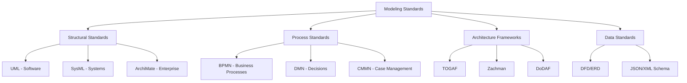

### Structural Modeling Standards

| Standard | Domain | Primary Use | Version | Governing Body |
|----------|--------|-------------|---------|----------------|
| **UML** | Software Engineering | System structure & behavior | 2.5.1 | OMG |
| **SysML** | Systems Engineering | Complex system design | 1.6 | OMG |
| **ArchiMate** | Enterprise Architecture | Multi-layer architecture | 3.2 | The Open Group |

### Process Modeling Standards

| Standard | Domain | Primary Use | Version | Governing Body |
|----------|--------|-------------|---------|----------------|
| **BPMN** | Business Processes | Process flow modeling | 2.0.2 | OMG |
| **DMN** | Decision Management | Decision rules & logic | 1.4 | OMG |
| **CMMN** | Case Management | Adaptive case handling | 1.1 | OMG |

### Architecture Frameworks

| Framework | Scope | Industry Focus | Complexity |
|-----------|-------|----------------|------------|
| **TOGAF** | Enterprise Architecture | Cross-industry | High |
| **Zachman** | Enterprise Architecture | Government/Large Enterprise | High |
| **DoDAF** | Defense Architecture | Military/Defense | Very High |

### Data Modeling Standards

| Standard | Type | Use Case | Format |
|----------|------|----------|--------|
| **DFD** | Process Flow | System data movement | Visual |
| **ERD** | Relational | Database design | Visual |
| **JSON Schema** | Validation | API/data contracts | Text |
| **XML Schema** | Validation | Document structure | Text |

## Diagram Types by Standard

### UML Diagram Types

UML 2.5.1 provides 14 diagram types organized into structural and behavioral categories.

#### UML Structural Diagrams

| Diagram Type | Purpose (Why) | Use When | Common Applications |
|--------------|---------------|----------|---------------------|
| **Class Diagram** | Define system structure, relationships, attributes | Designing object-oriented systems | Database schema, API design, domain modeling |
| **Object Diagram** | Show instances at specific time | Need concrete examples of class relationships | Testing scenarios, configuration snapshots |
| **Component Diagram** | Model software components and dependencies | Architecting modular systems | Microservices architecture, plugin systems |
| **Composite Structure Diagram** | Show internal structure of classes | Complex class internals needed | Design patterns, container relationships |
| **Package Diagram** | Organize model elements into groups | Managing large-scale systems | Module organization, dependency management |
| **Deployment Diagram** | Model physical deployment architecture | Planning infrastructure | Cloud deployment, hardware mapping |
| **Profile Diagram** | Extend UML with domain-specific concepts | Customizing UML for specialized domains | Embedded systems, real-time systems |

#### UML Behavioral Diagrams

| Diagram Type | Purpose (Why) | Use When | Common Applications |
|--------------|---------------|----------|---------------------|
| **Use Case Diagram** | Capture functional requirements | Gathering stakeholder requirements | Feature planning, user story mapping |
| **Activity Diagram** | Model workflows and processes | Documenting business logic | Algorithm design, workflow automation |
| **State Machine Diagram** | Define object lifecycle and state transitions | Modeling stateful behavior | UI states, protocol design, game logic |
| **Sequence Diagram** | Show time-ordered message exchanges | Designing interactions between objects | API call sequences, authentication flows |
| **Communication Diagram** | Emphasize object relationships in interactions | Focus on structural organization | Distributed system design |
| **Timing Diagram** | Show timing constraints and behavior | Real-time or time-critical systems | Hardware interfaces, protocol timing |
| **Interaction Overview Diagram** | Combine activity and sequence diagrams | Complex interaction scenarios | Multi-step business processes |

### BPMN Diagram Types

BPMN 2.0.2 focuses on business process modeling with different perspectives.

| Diagram Type | Purpose (Why) | Use When | Common Applications |
|--------------|---------------|----------|---------------------|
| **Process Diagram** | Model end-to-end business processes | Documenting workflows | Order fulfillment, approval processes |
| **Collaboration Diagram** | Show interactions between participants | Multi-party processes | B2B integration, supply chain |
| **Choreography Diagram** | Define message exchanges without central control | Peer-to-peer interactions | Microservices orchestration |
| **Conversation Diagram** | High-level view of message flows | Initial process design | Stakeholder communication |

**BPMN Swim Lanes:**
- **Pool**: Represents participant/organization
- **Lane**: Represents role/department within pool

### SysML Diagram Types

SysML 1.6 extends UML for systems engineering with 9 diagram types.

| Diagram Type | Purpose (Why) | Use When | Common Applications |
|--------------|---------------|----------|---------------------|
| **Requirement Diagram** | Capture and trace requirements | Managing system requirements | Requirements engineering, traceability |
| **Block Definition Diagram (BDD)** | Define system structure and components | Architecting hardware-software systems | IoT systems, embedded design |
| **Internal Block Diagram (IBD)** | Show internal structure and connections | Detailed component design | Interface design, signal flow |
| **Parametric Diagram** | Model constraints and performance | Engineering analysis, optimization | Performance modeling, constraint solving |
| **Activity Diagram** | Model system behavior and flows | Process modeling | Control algorithms, data processing |
| **Sequence Diagram** | Show time-based interactions | Timing-critical scenarios | Protocol design, hardware-software interaction |
| **State Machine Diagram** | Model system modes and transitions | State-dependent behavior | Device states, operational modes |
| **Use Case Diagram** | Capture system functionality | Requirements capture | System capabilities, stakeholder needs |
| **Package Diagram** | Organize model elements | Large system organization | Model management, reusable libraries |

### ArchiMate Diagram Types

ArchiMate 3.2 provides viewpoints across business, application, technology, and strategy layers.

#### Core Viewpoints

| Viewpoint | Purpose (Why) | Use When | Common Applications |
|-----------|---------------|----------|---------------------|
| **Organization Viewpoint** | Show organizational structure | Modeling business roles and actors | Org charts, responsibility mapping |
| **Business Process Viewpoint** | Document business processes | Process optimization | Value stream mapping, process improvement |
| **Application Structure Viewpoint** | Model application components | IT landscape documentation | Application portfolio, integration architecture |
| **Technology Viewpoint** | Show infrastructure and platforms | Infrastructure planning | Cloud architecture, data center design |
| **Layered Viewpoint** | Multiple layers in single view | Holistic architecture view | Enterprise architecture overview |
| **Strategy Viewpoint** | Link strategy to execution | Strategic planning | Digital transformation, capability planning |
| **Migration Viewpoint** | Show transition states | Planning architecture changes | Roadmap planning, modernization |

### DMN Diagram Types

DMN 1.4 provides two main diagram types for decision modeling.

| Diagram Type | Purpose (Why) | Use When | Common Applications |
|--------------|---------------|----------|---------------------|
| **Decision Requirements Diagram (DRD)** | Show decision dependencies | Modeling decision logic | Business rules, approval workflows |
| **Decision Table** | Define decision logic with rules | Implementing executable decisions | Pricing rules, eligibility checks |
| **Literal Expression** | Express decisions in code/formulas | Complex calculations | Financial calculations, scoring models |

### Data Modeling Diagrams

| Diagram Type | Purpose (Why) | Use When | Common Applications |
|--------------|---------------|----------|---------------------|
| **Entity-Relationship Diagram (ERD)** | Model data entities and relationships | Database design | Relational database schema, data warehousing |
| **Data Flow Diagram (DFD)** | Show data movement through system | Analyzing data processing | ETL pipelines, data integration |
| **Logical Data Model** | Technology-independent data structure | Conceptual database design | Enterprise data modeling |
| **Physical Data Model** | Database-specific implementation | Database implementation | SQL schema generation, optimization |

### Complete Diagram Type Taxonomy

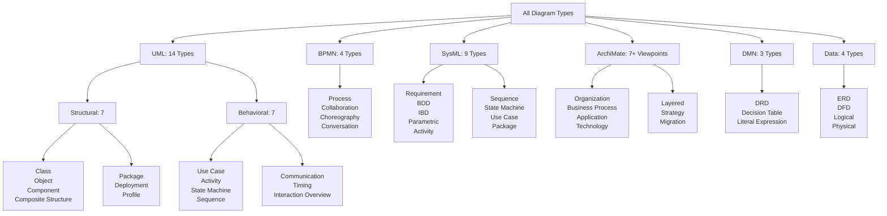

### Diagram Selection Guide

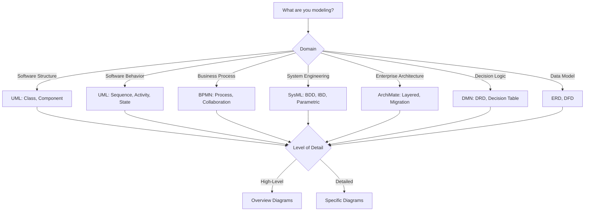

### Practical Diagram Usage Examples

#### Scenario-Based Diagram Selection

| Scenario | Primary Diagram | Supporting Diagrams | Why This Combination |
|----------|----------------|---------------------|----------------------|
| **Designing REST API** | UML Class Diagram | Sequence Diagram, Component Diagram | Class for data models, Sequence for request/response flow, Component for service architecture |
| **Documenting Login Flow** | UML Sequence Diagram | Activity Diagram, State Machine | Sequence for step-by-step interaction, Activity for business logic, State for session states |
| **Order Processing System** | BPMN Process Diagram | ERD, DMN Decision Table | BPMN for workflow, ERD for order data, DMN for approval rules |
| **IoT Device Design** | SysML Block Definition | Internal Block Diagram, Sequence Diagram | BDD for components, IBD for connections, Sequence for communication protocol |
| **Cloud Migration Planning** | ArchiMate Migration Viewpoint | Layered Viewpoint, Technology Viewpoint | Migration for roadmap, Layered for current/target state, Technology for infrastructure |
| **E-commerce Checkout** | BPMN Collaboration | UML Sequence, DMN Decision Table | BPMN for multi-party process, Sequence for payment API, DMN for discount rules |
| **Microservices Architecture** | UML Component Diagram | Deployment Diagram, Sequence Diagram | Component for services, Deployment for containers, Sequence for inter-service calls |
| **Mobile App UI Flow** | UML State Machine | Activity Diagram, Use Case Diagram | State Machine for screen transitions, Activity for user journeys, Use Case for features |

#### Common Anti-Patterns to Avoid

| Anti-Pattern | Problem | Correct Approach |
|--------------|---------|------------------|
| Using Class Diagram for behavior | Static structure doesn't show runtime behavior | Use Sequence or Activity diagrams for behavior |
| BPMN for software flow | BPMN is business-focused, not code-level | Use UML Activity diagrams for software algorithms |
| Single diagram for everything | Overwhelming complexity | Use multiple focused diagrams with clear purpose |
| Too much detail in overview | Cluttered, hard to understand | Separate high-level and detailed diagrams |
| Mixing abstraction levels | Conceptual and implementation details mixed | Use Logical/Physical separation |

#### Diagram Combination Patterns

**Pattern 1: Full System Documentation**
1. **Requirements**: Use Case Diagram (UML) or Requirement Diagram (SysML)
2. **Structure**: Class Diagram (UML) or BDD (SysML)
3. **Behavior**: Sequence + Activity Diagrams
4. **Deployment**: Deployment Diagram (UML) or Technology Viewpoint (ArchiMate)

**Pattern 2: Business Process Automation**
1. **Process Flow**: BPMN Process Diagram
2. **Decision Rules**: DMN Decision Table
3. **Data Model**: ERD
4. **System Integration**: BPMN Collaboration Diagram

**Pattern 3: Enterprise Architecture**
1. **Strategy**: ArchiMate Strategy Viewpoint
2. **Current State**: ArchiMate Layered Viewpoint
3. **Target State**: ArchiMate Layered Viewpoint
4. **Transition**: ArchiMate Migration Viewpoint

## Tools Ecosystem

### Tool Selection Matrix

| Tool Type | Cost | Learning Curve | Collaboration | Standards Support |
|-----------|------|----------------|--------------|-------------------|
| **Graphics Tools** | Variable | Low-Medium | High | Limited |
| **Professional Tools** | High | High | High | Comprehensive |
| **Open Source Tools** | Free | Medium | Medium | Good |
| **Text-Based Tools** | Free | Low | High (Git) | Excellent |

### Graphics-Based Tools

#### General Graphics Tools
| Tool | Primary Use | Platforms | Collaboration |
|------|-------------|-----------|--------------|
| **Microsoft Visio** | General diagramming | Windows | SharePoint Integration |
| **Draw.io (diagrams.net)** | General diagramming | Web, Desktop | Real-time (cloud) |
| **Lucidchart** | Collaborative diagramming | Web-based | Real-time collaboration |
| **OmniGraffle** | Visual design | macOS | iCloud sync |
| **yEd Graph Editor** | Graph layouts | Cross-platform | Export-focused |

#### Professional Modeling Tools
| Tool | Standards | Domain | Target Users |
|------|-----------|--------|--------------|
| **Enterprise Architect** | UML, SysML, BPMN | Enterprise Architecture | Architects, Analysts |
| **Visual Paradigm** | UML, SysML, BPMN | Software Development | Developers, Designers |
| **MagicDraw** | UML, SysML | Systems Engineering | Engineers, Modelers |
| **IBM Rational Rhapsody** | UML, SysML | Embedded Systems | Systems Engineers |
| **StarUML** | UML | Software Development | Developers |

#### Open Source Modeling Tools
| Tool | Standards | Language | Integration |
|------|-----------|----------|------------|
| **Archi** | ArchiMate | Java | Model exchange |
| **Modelio** | UML, BPMN | Java | Plugin ecosystem |
| **ArgoUML** | UML | Java | Standards compliant |

### Text-Based Diagramming

| Language | Primary Use | Rendering | Ecosystem |
|----------|-------------|-----------|-----------|
| **PlantUML** | UML, BPMN | Java-based | IDE integrations |
| **Mermaid** | General diagrams | JavaScript | Web-native |
| **Graphviz (DOT)** | Graph layouts | C library | Extensive |
| **TikZ** | Publication quality | LaTeX | Academic |

### Markup Languages for Documentation

| Language | Strength | Use Case | Tooling |
|----------|----------|----------|--------|
| **Markdown** | Simplicity | Technical docs | Universal |
| **AsciiDoc** | Features | Books/manuals | Antora, Asciidoctor |
| **reStructuredText** | Extensibility | Python docs | Sphinx |

### Mathematical Notation & Formula Languages

Mathematical expressions are specialized modeling languages used in parametric diagrams, decision logic, and engineering constraints.

| Notation | Syntax Style | Use Case | Rendering |
|----------|--------------|----------|-----------|
| **LaTeX Math** | `$ E = mc^2 $` | Scientific, engineering formulas | KaTeX, MathJax |
| **MathML** | XML-based | Accessible math on web | Native browser |
| **AsciiMath** | `` `E = mc^2` `` | Simplified math notation | MathJax converter |
| **Unicode Math** | Native symbols (∑, ∫, ≈) | Simple inline expressions | Direct rendering |

#### Math in Modeling Standards

| Standard | Where Math Appears | Purpose | Notation Type |
|----------|-------------------|---------|---------------|
| **SysML Parametric Diagrams** | Constraint blocks | Engineering constraints, performance | LaTeX, OCL |
| **DMN Literal Expressions** | Decision logic | Calculations, scoring formulas | FEEL, custom |
| **UML OCL** | Constraints | Invariants, pre/post conditions | OCL language |
| **ArchiMate** | Goal/Requirement elements | KPIs, metrics | Text description |

### Tool Support for Diagram Types

| Tool | UML Diagrams | BPMN | SysML | ArchiMate | Data Models | Best For |
|------|--------------|------|-------|-----------|-------------|----------|
| **PlantUML** | All 14 types | Process, Activity | Limited | No | ERD, Schema | Text-based, version control, automation |
| **Mermaid** | Class, Sequence, State, ER | Basic flowcharts | No | No | ERD | Web integration, documentation, Markdown |
| **Visual Paradigm** | All 14 types | All types | All 9 types | No | All types | Professional UML/SysML modeling |
| **Enterprise Architect** | All 14 types | All types | All 9 types | Limited | All types | Enterprise-scale, comprehensive |
| **MagicDraw** | All 14 types | Process | All 9 types | No | All types | Systems engineering, SysML focus |
| **Archi** | Limited | No | No | All viewpoints | Limited | Enterprise architecture, ArchiMate |
| **Camunda Modeler** | Sequence, Activity | All types | No | No | Limited | Executable BPMN, process automation |
| **Draw.io** | Basic UML | Basic BPMN | No | Basic | ERD | Quick diagrams, lightweight |
| **Lucidchart** | Most UML | Process, Collaboration | Limited | Limited | ERD, DFD | Team collaboration, cloud-based |

### Diagram Rendering & Integration Capabilities

#### Direct Rendering Support

| Tool/Language | Rendering Method | Where It Renders | Live Preview | Export Formats |
|---------------|------------------|------------------|--------------|----------------|
| **Mermaid** | Native Markdown | GitHub, GitLab, Notion, Obsidian, MkDocs | Yes | SVG, PNG, PDF |
| **PlantUML** | Server/Plugin | IDE, CI/CD, Confluence, GitLab (plugin) | Yes (with plugin) | SVG, PNG, PDF, ASCII |
| **Graphviz (DOT)** | CLI/Library | Server-side, Jupyter, Sphinx | Partial | SVG, PNG, PDF, PS |
| **Draw.io** | Embedded viewer | Confluence, VS Code (plugin), GitHub (viewer) | Yes | SVG, PNG, PDF, XML |
| **TikZ** | LaTeX compilation | PDF documents, academic papers | No | PDF only |

#### Markdown Integration Comparison

| Feature | Mermaid | PlantUML | Graphviz | Draw.io |
|---------|---------|----------|----------|---------|
| **Inline Markdown Syntax** | ✅ Native `\`\`\`mermaid` | ❌ Needs plugin/server | ❌ Needs plugin | ❌ Embed only |
| **GitHub Rendering** | ✅ Native | ✅ With GitHub Actions | ❌ | ✅ With viewer |
| **GitLab Rendering** | ✅ Native | ✅ With integration | ❌ | ✅ With plugin |
| **Jupyter Notebooks** | ✅ With extension | ✅ With magic command | ✅ Native library | ❌ |
| **VS Code Preview** | ✅ Built-in | ✅ With extension | ✅ With extension | ✅ With extension |
| **Confluence** | ❌ | ✅ With macro | ❌ | ✅ Native |
| **Notion** | ✅ Native | ❌ | ❌ | ❌ Embed only |

#### Platform-Specific Rendering

**Documentation Platforms:**
```markdown
# Mermaid (Native Rendering)
Supported: GitHub, GitLab, Notion, Obsidian, MkDocs, Docusaurus, VuePress, Docsify

# PlantUML (Plugin/Server Required)
Supported: Confluence, GitLab, Asciidoctor, Sphinx, MkDocs (with plugin)

# Draw.io (Viewer/Embed)
Supported: Confluence (native), GitHub (viewer), VS Code (extension)
```

**IDE Integration:**
| IDE | Mermaid | PlantUML | Graphviz | Draw.io |
|-----|---------|----------|----------|---------|
| **VS Code** | Preview extension | Preview extension | Preview extension | Edit extension |
| **IntelliJ IDEA** | Plugin | Plugin | Plugin | Plugin |
| **Sublime Text** | Plugin | Plugin | Plugin | Limited |
| **Vim/Neovim** | Plugin | Plugin | Plugin | External |

#### Code Block Syntax Examples

**Mermaid (Native Markdown):**
````markdown
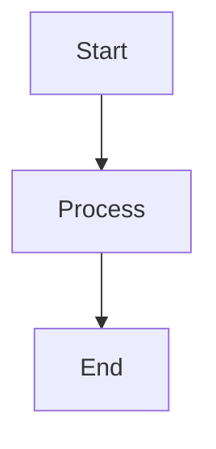
````

**PlantUML (Requires Plugin/Server):**
````markdown
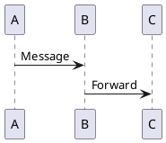
````

**Graphviz (Requires Plugin):**
````markdown
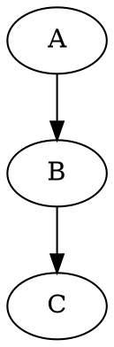
````

#### Rendering Performance

| Tool | Initial Load | Update Speed | Large Diagrams | Browser Resource |
|------|--------------|--------------|----------------|------------------|
| **Mermaid** | Fast | Instant | Medium (100+ nodes) | Low-Medium |
| **PlantUML** | Medium | Medium | High (1000+ nodes) | Low (server-side) |
| **Graphviz** | Fast | Fast | Very High | Low (server-side) |
| **Draw.io** | Medium | Instant | High | Medium |

#### Best Practices by Use Case

| Use Case | Recommended Tool | Why | Rendering Method |
|----------|-----------------|-----|------------------|
| **GitHub README** | Mermaid | Native rendering, no setup | Inline markdown |
| **Technical documentation** | PlantUML + MkDocs | Comprehensive diagrams | Plugin + static site |
| **Team wiki (Confluence)** | Draw.io | Native integration | Embedded editor |
| **API documentation** | Mermaid | Fast, simple, version control | Inline markdown |
| **Academic papers** | TikZ | Publication quality | LaTeX compilation |
| **Complex architecture** | PlantUML | Detailed diagrams, flexible | Server rendering |
| **Real-time collaboration** | Lucidchart | Cloud-based, live editing | Web application |

### Mathematical Formula Rendering

#### Math Rendering Engines

| Engine | Rendering Method | Platforms | Syntax Support | Quality |
|--------|------------------|-----------|----------------|---------|
| **KaTeX** | Client-side JavaScript | Web, Markdown docs | LaTeX subset | Fast, high-quality |
| **MathJax** | Client/Server JavaScript | Web, Jupyter, Sphinx | LaTeX, MathML, AsciiMath | Comprehensive, slower |
| **Native MathML** | Browser native | Modern browsers | MathML only | Accessible, limited |
| **LaTeX** | Compilation | PDF documents | Full LaTeX | Publication quality |

#### Markdown Math Integration

| Platform | Inline Math | Block Math | Rendering Engine | Syntax |
|----------|-------------|------------|------------------|--------|
| **GitHub** | ✅ | ✅ | MathJax | `$...$` or `$$...$$` |
| **GitLab** | ✅ | ✅ | KaTeX | `$...$` or `$$...$$` |
| **Jupyter Notebook** | ✅ | ✅ | MathJax | `$...$` or `$$...$$` |
| **Obsidian** | ✅ | ✅ | MathJax | `$...$` or `$$...$$` |
| **Notion** | ✅ | ✅ | KaTeX | `$$...$$` (inline/block) |
| **MkDocs** | ✅ (plugin) | ✅ (plugin) | MathJax/KaTeX | `$...$` or `$$...$$` |
| **Confluence** | ❌ | ❌ (use macro) | LaTeX macro | Macro syntax |

#### Math Syntax Examples

**Inline Math (renders in GitHub/GitLab):**
```markdown
The equation $E = mc^2$ shows energy-mass equivalence.
```

**Block Math:**
```markdown
$$
\frac{-b \pm \sqrt{b^2 - 4ac}}{2a}
$$
```

**SysML Parametric Example:**
```
Constraint: Power = Voltage × Current
Mathematical: P = V \times I
Performance: \eta = \frac{P_{out}}{P_{in}} \times 100\%
```

**DMN Literal Expression Example:**
```
// Discount calculation
if (orderAmount > 1000) then
    orderAmount * 0.9
else if (orderAmount > 500) then
    orderAmount * 0.95
else
    orderAmount
```

#### Common Math Symbols in Modeling

| Symbol | LaTeX | Unicode | Use in Modeling |
|--------|-------|---------|-----------------|
| **Summation** | `\sum` | ∑ | Aggregate calculations |
| **Product** | `\prod` | ∏ | Combined constraints |
| **Integral** | `\int` | ∫ | Continuous systems |
| **Partial derivative** | `\partial` | ∂ | Rate of change |
| **Approximately** | `\approx` | ≈ | Tolerance modeling |
| **Less/Greater than** | `\leq`, `\geq` | ≤, ≥ | Constraint bounds |
| **Not equal** | `\neq` | ≠ | Invariant conditions |
| **For all** | `\forall` | ∀ | Universal constraints |
| **Exists** | `\exists` | ∃ | Existential constraints |

#### Tool Support for Mathematical Modeling

| Tool | Math Input | Rendering | Export | Use Case |
|------|------------|-----------|--------|----------|
| **MagicDraw/SysML** | Constraint language | Native | PDF, Word | Engineering analysis |
| **Camunda/DMN** | FEEL expressions | Text | BPMN/DMN XML | Decision logic |
| **Jupyter Notebook** | LaTeX in markdown | MathJax | HTML, PDF | Scientific computing |
| **Modelica** | Mathematical DSL | Simulation | Plots, data | Physical systems |
| **Maple/Mathematica** | Symbolic math | Native | Various | Symbolic analysis |
| **MATLAB/Simulink** | MATLAB syntax | Plots | Code, models | Numerical simulation |

## Standards vs Tools: Key Distinctions

| Aspect | Standards | Tools |
|--------|-----------|-------|
| **Nature** | Specifications & guidelines | Implementations & applications |
| **Purpose** | Define syntax & semantics | Provide functionality & interfaces |
| **Maintenance** | Standardization bodies | Commercial/OS communities |
| **Lifecycle** | Version-controlled evolution | Feature-driven development |
| **Interoperability** | Ensured by specification | Varies by implementation |

## Decision Framework

### Standard Selection Criteria

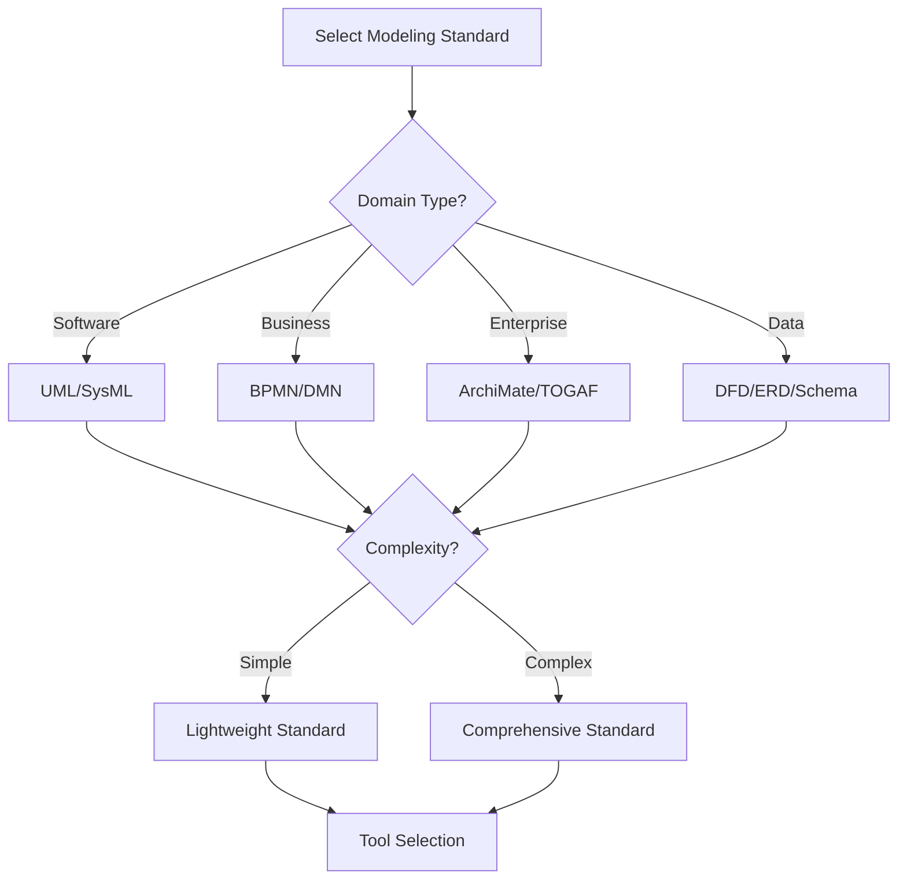

### Tool Selection Matrix

| Decision Factor | Weight | Evaluation Criteria |
|-----------------|--------|-------------------|
| **Team Skills** | High | Learning curve, training needs |
| **Project Scale** | High | Feature requirements, scalability |
| **Budget** | Medium | License costs, maintenance |
| **Integration** | Medium | API support, format compatibility |
| **Collaboration** | Medium | Multi-user, version control |
| **Standards Compliance** | High | Specification adherence |

## Application Mapping

### Domain-Specific Recommendations

| Domain | Primary Standards | Key Diagram Types | Recommended Tools | Common Use Cases |
|--------|------------------|-------------------|-------------------|------------------|
| **Software Development** | UML, SysML | Class, Sequence, Component, Deployment | Visual Paradigm, StarUML, PlantUML | API design, microservices, object-oriented design |
| **Business Process** | BPMN, DMN | Process, Collaboration, Decision Table | Camunda, Bizagi, Lucidchart | Workflow automation, approval processes, business rules |
| **Enterprise Architecture** | ArchiMate, TOGAF | Layered, Migration, Strategy Viewpoints | Archi, Enterprise Architect | Digital transformation, IT strategy, capability planning |
| **Systems Engineering** | SysML | BDD, IBD, Requirement, Parametric | MagicDraw, IBM Rhapsody | IoT devices, embedded systems, hardware-software integration |
| **Data Architecture** | ERD, DFD, Schema | ERD, Logical/Physical Data Model | Draw.io, ER/Studio, ERwin | Database design, data warehousing, ETL pipelines |

### Project Size Guidelines

| Project Size | Team | Duration | Recommended Approach |
|--------------|------|----------|---------------------|
| **Small** | 1-5 people | < 3 months | Text-based tools (PlantUML, Mermaid) |
| **Medium** | 5-20 people | 3-12 months | Open source tools (Archi, Modelio) |
| **Large** | 20+ people | > 1 year | Professional tools (EA, Visual Paradigm) |
| **Enterprise** | Multiple teams | Ongoing | Integrated suite (TOGAF + tools) |

## Implementation Best Practices

### Modeling Governance Framework

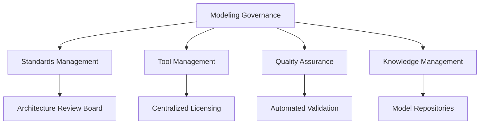

| Governance Area | Key Practices | Implementation Metrics |
|------------------|---------------|------------------------|
| **Standards Compliance** | Define before tool selection | 100% specification adherence |
| **Tool Consistency** | Standardized toolset across teams | < 3 different tools per domain |
| **Version Control** | Git-based model tracking | All models under version control |
| **Quality Assurance** | Automated validation checks | Zero critical compliance errors |
| **Knowledge Sharing** | Centralized pattern repositories | 80% model reuse rate |

### Integration Ecosystem

| Integration Type | Tools & Platforms | Benefits |
|------------------|-------------------|----------|
| **Development IDE** | VS Code, IntelliJ plugins | Seamless developer workflow |
| **Documentation** | Confluence, GitBook, MkDocs | Living documentation |
| **CI/CD Pipeline** | Jenkins, GitLab CI | Automated model validation |
| **Collaboration** | Slack, Teams integration | Real-time notifications |
| **Code Generation** | Model-to-code frameworks | Reduced development time |

## Emerging Trends & Future Outlook

### Technology Evolution Timeline

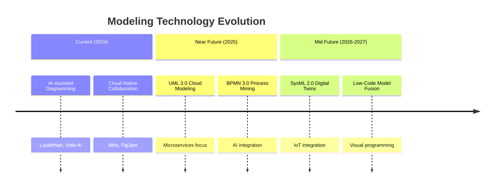

### Standards Roadmap

| Standard | Current Version | Next Release | Key Focus Areas |
|----------|-----------------|--------------|-----------------|
| **UML** | 2.5.1 (2017) | 3.0 (TBD) | Cloud modeling, microservices, DevOps |
| **BPMN** | 2.0.2 (2014) | 3.0 (TBD) | Process mining, AI automation, case handling |
| **SysML** | 1.6 (2019) | 2.0 (TBD) | Digital twins, IoT, model simulation |
| **ArchiMate** | 3.2 (2021) | 3.x (TBD) | Cloud architecture, DevOps, agile EA |
| **DMN** | 1.4 (2021) | 1.x (TBD) | Machine learning integration, explainable AI |

### Market Disruptors

| Trend | Impact Level | Timeline | Tools Adapting |
|-------|--------------|----------|----------------|
| **AI-Generated Models** | High | 1-2 years | Lucidchart AI, Visio CoPilot |
| **Real-Time Collaboration** | Medium | Current | Miro, FigJam, Lucidchart |
| **Model-Driven Code Generation** | High | Established | MagicDraw, Enterprise Architect |
| **Low-Code/No-Code Integration** | Medium | Growing | OutSystems, Appian, Mendix |
| **Blockchain-Based Model Storage** | Low | Experimental | Emerging research projects |

## Strategic Implementation Framework

### Hybrid Modeling Strategies

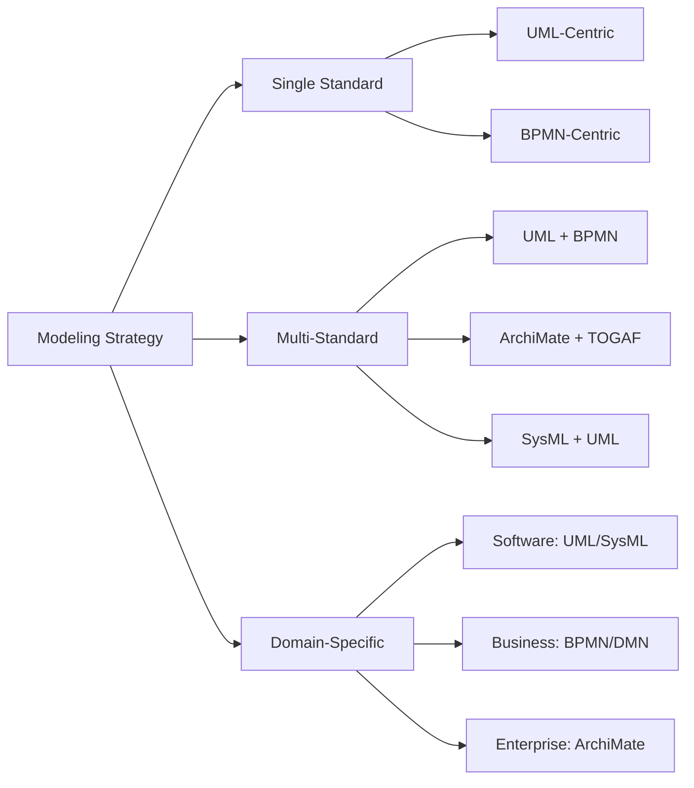

### Tool Combination Patterns

| Pattern | Standards | Tools | Use Case |
|---------|-----------|-------|----------|
| **Design + Documentation** | UML, BPMN | PlantUML + GitBook | Technical specification |
| **Modeling + Development** | UML, SysML | MagicDraw + IDE plugins | Code generation |
| **Standard + Custom** | ArchiMate + Custom | Archi + Internal tools | Enterprise-specific needs |
| **Process + Analytics** | BPMN, DMN | Camunda + Power BI | Process optimization |

## Decision Support System

### Comprehensive Selection Framework

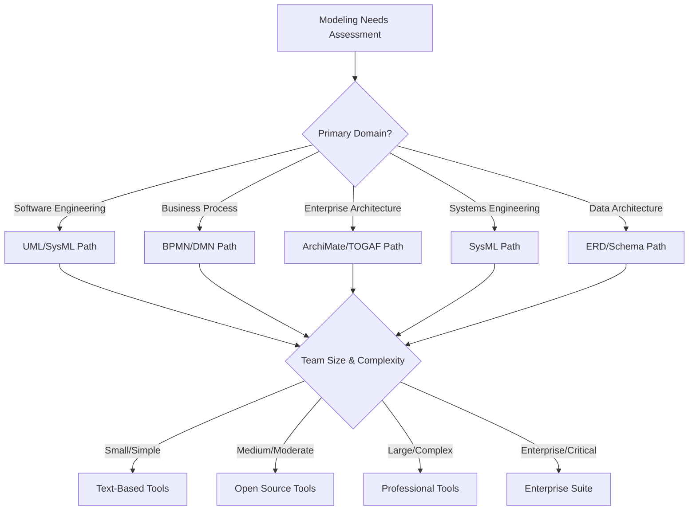

### Risk-Based Decision Matrix

| Risk Factor | Low Risk Approach | Medium Risk Approach | High Risk Approach |
|-------------|-------------------|---------------------|-------------------|
| **Budget Constraints** | Open source (PlantUML, Archi) | Mixed (Free + Limited paid) | Full commercial suite |
| **Timeline Pressure** | Familiar tools only | Quick learning curve | Comprehensive training |
| **Integration Needs** | Standalone tools | API-connected tools | Fully integrated platform |
| **Compliance Requirements** | Basic standards compliance | Industry-specific compliance | Regulatory-grade compliance |

### Cost-Benefit Analysis Framework

| Investment Level | Tool Cost | Training Cost | ROI Timeline | Total Value |
|------------------|-----------|--------------|--------------|------------|
| **Starter** | $0-5K | $1-2K | 3-6 months | Quick wins, limited scale |
| **Professional** | $10-50K | $5-15K | 6-12 months | Balanced investment, good ROI |
| **Enterprise** | $100K+ | $25K+ | 12-24 months | Long-term value, high impact |

## Quick Reference Guide

### Standard & Diagram Type Cheat Sheet

| Need | Standard | Specific Diagram Type | Why |
|------|----------|----------------------|-----|
| **API design** | UML | Class Diagram + Sequence Diagram | Structure data models and interaction flows |
| **Object-oriented design** | UML | Class Diagram, Object Diagram | Define classes, relationships, instances |
| **User requirements** | UML/SysML | Use Case Diagram | Capture functional requirements |
| **Message flows** | UML | Sequence Diagram, Communication Diagram | Time-ordered interactions |
| **Workflow logic** | UML/BPMN | Activity Diagram (UML) or Process Diagram (BPMN) | Algorithm or business process flows |
| **State transitions** | UML/SysML | State Machine Diagram | Lifecycle and state-dependent behavior |
| **Component architecture** | UML | Component Diagram, Deployment Diagram | Modular structure and infrastructure |
| **Business process mapping** | BPMN | Process Diagram, Collaboration Diagram | Visual process flow with roles |
| **Multi-party processes** | BPMN | Collaboration Diagram with Pools/Lanes | Cross-organizational workflows |
| **Decision logic** | DMN | Decision Requirements Diagram, Decision Table | Executable business rules |
| **System engineering** | SysML | Block Definition Diagram, Internal Block Diagram | Hardware-software integration |
| **Requirements tracing** | SysML | Requirement Diagram | Requirements management |
| **Performance analysis** | SysML | Parametric Diagram | Engineering constraints |
| **Enterprise architecture** | ArchiMate | Layered Viewpoint, Migration Viewpoint | Multi-layer business-IT alignment |
| **Digital transformation** | ArchiMate | Strategy Viewpoint, Migration Viewpoint | Strategic planning and transition |
| **Database design** | ERD/DFD | ERD, Logical/Physical Data Model | Relational data modeling |
| **Data pipelines** | DFD | Data Flow Diagram | ETL and data integration |

### Tool Selection Cheat Sheet

| Scenario | Recommended Tool(s) | Cost | Learning Curve | Key Benefit |
|----------|-------------------|------|----------------|-------------|
| **Quick diagrams** | Draw.io, Mermaid | Free | Low | Immediate productivity |
| **Team collaboration** | Lucidchart, Miro | $$ | Low | Real-time editing |
| **Professional UML** | Visual Paradigm, MagicDraw | $$$ | Medium | Advanced features |
| **Text-based diagrams** | PlantUML, Graphviz | Free | Medium | Version control friendly |
| **Enterprise architecture** | Archi, Enterprise Architect | Free-$$$ | Medium | Standards compliance |
| **Systems engineering** | MagicDraw, IBM Rhapsody | $$$$ | High | Domain-specific features |
| **Business process** | Camunda, Bizagi | $$-$$$ | Medium | Executable processes |
| **Documentation integration** | PlantUML + GitBook | Free | Low | Living documentation |

## Migration & Transition Strategies

### Migration Planning Phases

| Migration Phase | Duration | Key Activities | Success Metrics |
|-----------------|----------|----------------|-----------------|
| **Assessment** | 2-4 weeks | Current state analysis, requirements gathering | Complete inventory |
| **Pilot** | 4-8 weeks | Small team testing, validation | 90% user satisfaction |
| **Phased Rollout** | 8-16 weeks | Department by department deployment | 80% adoption per phase |
| **Full Migration** | 4-8 weeks | Organization-wide transition | 100% operational |
| **Optimization** | Ongoing | Continuous improvement | Efficiency gains |

### Tool Migration Path

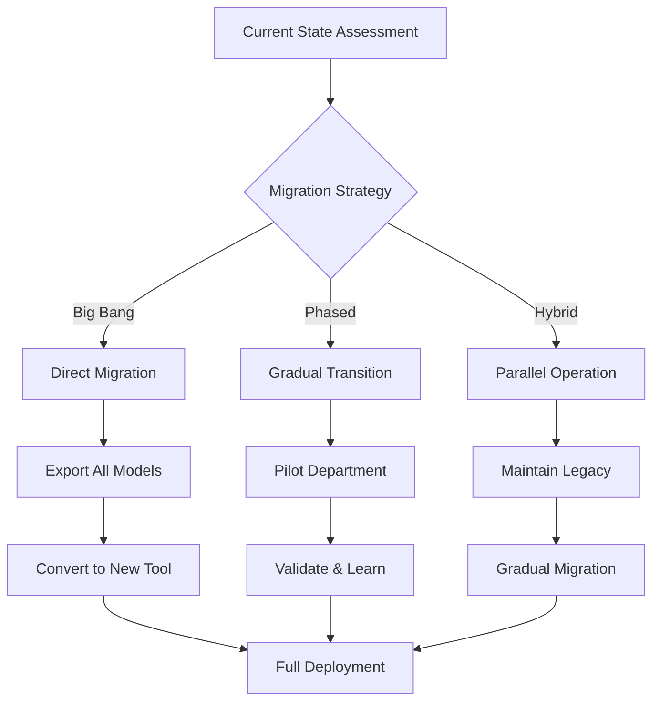

### Risk Mitigation Framework

| Risk Category | Specific Risks | Mitigation Strategies | Success Metrics |
|----------------|---------------|---------------------|-----------------|
| **Technical Risks** | Data loss, format incompatibility | Multiple export formats, validation tools | 100% model preservation |
| **Organizational Risks** | Team resistance, skill gaps | Gradual rollout, comprehensive training | 90% adoption rate |
| **Financial Risks** | Cost overruns, ROI delays | Phased implementation, pilot testing | Within budget, 6-month ROI |
| **Operational Risks** | Productivity loss, downtime | Parallel operation, rollback plans | < 5% productivity impact |
| **Compliance Risks** | Standards violations, audit failures | Automated validation, regular reviews | Zero critical violations |

## Executive Summary & Strategic Recommendations

### Decision Tree for Modeling Approach

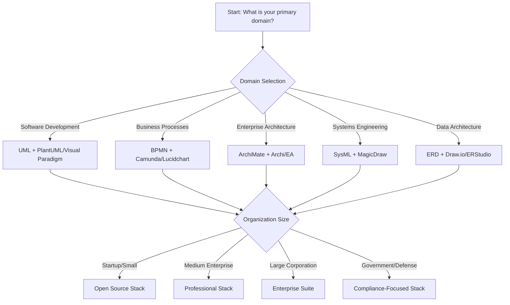

### Critical Success Factors

| Success Factor | Description | Measurement | Target |
|----------------|-------------|-------------|--------|
| **Standards Alignment** | Match standards to domain requirements | Compliance score | 100% specification adherence |
| **Tool Ecosystem Fit** | Integration with existing workflow | Integration metrics | < 3 tools per domain |
| **Team Capability** | Skills and training effectiveness | Skill assessment | 80% team proficiency |
| **Scalability Planning** | Future growth accommodation | Growth capacity | 3-5 year scalability |
| **Interoperability** | Cross-tool and partner compatibility | Exchange success rate | 95% successful exchanges |

### Organization-Specific Recommendations

| Organization Type | Recommended Stack | Investment | Timeline | Expected ROI |
|------------------|-------------------|------------|----------|--------------|
| **Startup/Small Team** | PlantUML + Mermaid + Draw.io | $0-5K | 1-2 months | Quick wins, high productivity |
| **Medium Enterprise** | Archi + Visual Paradigm + Camunda | $25-50K | 3-6 months | Standardized processes, good ROI |
| **Large Corporation** | Enterprise Architect + MagicDraw + TOGAF | $100-250K | 6-12 months | Enterprise-wide consistency, high ROI |
| **Government/Defense** | DoDAF + IBM Rhapsody + Custom Tools | $250K+ | 12-24 months | Regulatory compliance, long-term value |
| **Consulting/Professional Services** | Lucidchart + Visio + Multiple Standards | $50-100K | 3-6 months | Client flexibility, tool diversity |

## Reference Sections

### Glossary, Terminology & Acronyms

**Core Modeling Standards:**
- **UML**: Unified Modeling Language - software system structure and behavior modeling
- **BPMN**: Business Process Model and Notation - business process flow representation
- **SysML**: Systems Modeling Language - complex systems engineering modeling
- **ArchiMate**: Enterprise Architecture Modeling - multi-layer business-IT alignment
- **DMN**: Decision Model and Notation - decision requirements and rules modeling
- **CMMN**: Case Management Model and Notation - adaptive case process modeling

**Architecture Frameworks:**
- **TOGAF**: The Open Group Architecture Framework - enterprise architecture methodology
- **DoDAF**: Department of Defense Architecture Framework - US military architecture standard
- **Zachman Framework**: Enterprise architecture ontology for classification

**Technical Concepts:**
- **MDA**: Model-Driven Architecture - OMG approach using models as primary artifacts
- **MDE**: Model-Driven Engineering - software development paradigm focused on models
- **DSL**: Domain-Specific Language - specialized language for particular domains
- **Metamodel**: Model describing structure and constraints of other models
- **OCL**: Object Constraint Language - formal language for UML/SysML constraints
- **FEEL**: Friendly Enough Expression Language - DMN expression language for decisions

**Mathematical Modeling Languages:**
- **LaTeX Math**: Mathematical notation used in scientific and engineering documentation
- **KaTeX**: Fast math rendering engine for web platforms
- **MathJax**: Comprehensive JavaScript display engine for LaTeX, MathML, and AsciiMath
- **Constraint Language**: Mathematical expressions in SysML Parametric Diagrams
- **Literal Expression**: DMN term for executable formulas and calculations

### Codebase & Library References

**Open Source Modeling Platforms:**
- **PlantUML**: Text-based UML/BPMN diagramming
  - Repository: https://github.com/plantuml/plantuml
  - Documentation: https://plantuml.com/
- **Archi**: ArchiMate modeling tool
  - Repository: https://github.com/archimatetool/archi
  - Website: https://www.archimatetool.com/
- **Modelio**: Multi-standard modeling environment
  - Repository: https://github.com/modelioextensions/modelio
  - Website: https://www.modelio.org/

**Diagramming Libraries:**
- **Mermaid**: JavaScript-based diagramming
  - Repository: https://github.com/mermaid-js/mermaid
  - Documentation: https://mermaid.js.org/
- **Graphviz**: Graph visualization software
  - Repository: https://github.com/graphviz/graphviz
  - Documentation: https://graphviz.org/documentation/

**Process Automation Platforms:**
- **Camunda**: BPMN workflow engine
  - Repository: https://github.com/camunda/camunda-bpm-platform
  - Documentation: https://docs.camunda.org/
- **Flowable**: Business process engine
  - Repository: https://github.com/flowable/flowable-engine
  - Documentation: https://www.flowable.org/docs/

**Mathematical Rendering Libraries:**
- **KaTeX**: Fast math typesetting for the web
  - Repository: https://github.com/KaTeX/KaTeX
  - Documentation: https://katex.org/
- **MathJax**: Beautiful and accessible math in all browsers
  - Repository: https://github.com/mathjax/MathJax
  - Documentation: https://www.mathjax.org/
- **AsciiMath**: Easy-to-write markup for mathematics
  - Website: http://asciimath.org/

### Authoritative Literature & Standards

**Standards Organizations:**
- **Object Management Group (OMG)**: https://www.omg.org/
  - Specifications: UML 2.5.1, BPMN 2.0.2, SysML 1.6, DMN 1.4
- **The Open Group**: https://www.opengroup.org/
  - Standards: TOGAF 9.2, ArchiMate 3.2
- **IEEE Computer Society**: https://www.computer.org/
  - Standards: IEEE 1471 (Architecture Description), IEEE 828 (Configuration Management)

**Essential Publications:**
- **"UML Distilled"** (Fowler, 2004) - Applied UML guide
- **"SysML for Systems Engineering"** (Friedenthal et al., 2014) - Comprehensive SysML reference
- **"Enterprise Architecture Using TOGAF"** (The Open Group, 2018) - Official TOGAF guide
- **"Business Process Model and Notation"** (OMG, 2011) - BPMN specification

**Online Resources:**
- **UML Diagramming Guide**: https://www.uml-diagrams.org/
- **BPMN 2.0 Tutorial**: https://www.bpmn.org/
- **SysML Resources**: https://sysml.org/
- **ArchiMate Specification**: https://publications.opengroup.org/standards/archimate

### APA Style Citations

**Standards Specifications:**
- Object Management Group. (2017). *OMG Unified Modeling Language (OMG UML) Version 2.5.1*. https://www.omg.org/spec/UML/2.5.1/
- Object Management Group. (2014). *Business Process Model and Notation (BPMN) Version 2.0.2*. https://www.omg.org/spec/BPMN/2.0.2/
- Object Management Group. (2019). *Systems Modeling Language (SysML) Version 1.6*. https://www.omg.org/spec/SysML/1.6/
- Object Management Group. (2021). *Decision Model and Notation (DMN) Version 1.4*. https://www.omg.org/spec/DMN/1.4/

**Framework Citations:**
- The Open Group. (2018). *TOGAF® Version 9.2*. https://publications.opengroup.org/togaf
- The Open Group. (2021). *ArchiMate® 3.2 Specification*. https://publications.opengroup.org/archimate

**Academic References:**
- Fowler, M. (2004). *UML distilled: A brief guide to the standard object modeling language* (3rd ed.). Addison-Wesley.
- Friedenthal, S., Moore, A., & Steiner, R. (2014). *A practical guide to SysML: The systems modeling language* (3rd ed.). Morgan Kaufmann.
- Schmidt, D. C. (2006). Model-driven engineering. *Computer*, *39*(2), 25-31. https://doi.org/10.1109/MC.2006.58
- Mellor, S. J., Clark, A. N., & Futagami, T. (2003). *Model-driven architecture: A MDA perspective*. IEEE Computer Society.

**Tool Documentation:**
- PlantUML Team. (2023). *PlantUML Language Reference Guide*. https://plantuml.com/
- Camunda BPM. (2023). *Camunda BPMN 2.0 Modeling Reference*. https://docs.camunda.org/manual/latest/user-guide/process-engine/bpmn/
- Archi Team. (2023). *Archi User Guide*. https://www.archimatetool.com/help/