# 3C行业综合情报简报

**领域**: 综合(跨职能视角)  
**时期**: 2025-11-01 至 2025-11-22  
**覆盖范围**: 8个问答(每个领域1个)

## 关键洞察

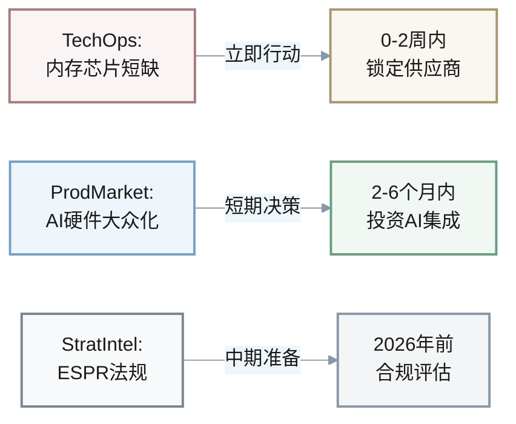

- **[TechOps]** AI驱动的内存芯片短缺将影响消费电子产品供应链 → 建议提前锁定供应商并评估替代方案 → **立即行动(0-2周)**
- **[ProdMarket]** AI硬件产品从早期采用者阶段进入大众市场 → 建议投资AI功能集成 → **2-6个月内决策**
- **[StratIntel]** 欧盟可持续产品生态设计法规(ESPR)将重塑产品设计要求 → 建议启动合规评估 → **2026年前完成**

## 仪表盘

| # | 领域标签 | 领域名称 | 要点 | 关键性 | 速度 | 阶段 | 职能 |
|---|---------|---------|------|---------|------|------|------|
| 1 | Startup | 创业与初创 | 固态电池创业公司融资570万美元 | Blocks | Medium | Formation | Cross-functional |
| 2 | TechOps | 技术运营 | AI导致内存芯片短缺加剧 | Risk | High | Growth/Scale | Technical |
| 3 | ProdMarket | 产品与市场 | AI硬件产品进入大众市场阶段 | Roles | High | Growth/Scale | Product |
| 4 | CommOps | 商业运营 | AI驱动的GTM战略成主流 | Action | Medium | Growth/Scale | Commercial |
| 5 | FinEcon | 财务与经济 | 全球消费电子市场2025年达1.46万亿美元 | Quantified | Medium | Growth/Scale | Financial |
| 6 | StratIntel | 战略情报 | 欧盟ESPR法规要求数字产品护照 | Risk | Low | Growth/Scale | Strategic |
| 7 | OpsSupply | 运营与供应链 | 内存芯片价格上涨60% | Quantified | High | Growth/Scale | Operations |
| 8 | PeopleWF | 人才与劳动力 | 半导体行业芯片设计师短缺加剧 | Roles | Medium | Growth/Scale | People |

---

## 问答详情

### [Startup] Q1: 固态电池技术突破如何影响可穿戴设备初创公司的融资策略?

**领域**: 创业与初创 | **阶段**: Formation | **职能**: Cross-functional  
**速度**: Medium | **关键性**: [Blocks, Action]  
**利益相关者**: 创始人, CTO, 投资者, 产品负责人  
**来源**: [Ref: N1][n1]

**新闻**: 2025年11月,瑞士电池初创公司BTRY获得570万美元种子轮融资,用于工业化超薄固态电池。这些电池具有快速充电、高温稳定性和不可燃特性,目标应用包括互联标签、无线传感器和可穿戴设备。[Ref: N1][n1]

**影响**: 固态电池技术的突破为可穿戴设备领域带来颠覆性机会。

**技术对比**:

| 指标 | 传统锂电池 | 超薄固态电池 | 改进幅度 |
|------|-----------|-------------|---------|
| **设备厚度** | 基准 | 减少30-50% | ↓ 30-50% |
| **充电速度** | 1x | 2-3x | ↑ 200-300% |
| **工作温度** | 0°C~45°C | -40°C~85°C | ↑ 扩展范围 |
| **安全性** | 可燃 | 不可燃 | ✓ 显著提升 |
| **开发周期** | - | 18-24个月 | - |
| **初始投资** | - | $5M-$10M | - |

**新产品机会**: 智能创可贴、柔性显示器、超薄健康监测设备

对于**种子轮到A轮阶段**的初创公司,这一技术趋势可能成为融资故事的**核心差异化要素**。

**决策**:

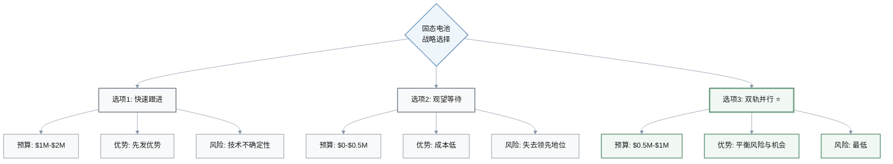

| 选项 | 预算 | 优势 | 风险 | 评级 |
|------|------|------|------|------|
| **(1) 快速跟进** | $1M-$2M | 抢占先发优势 | 技术成熟度不确定 | ⚠️ 高风险 |
| **(2) 观望等待** | $0-$0.5M | 成本低 | 可能失去市场领先地位 | ⚠️ 机会成本高 |
| **(3) 双轨并行** ⭐ | $0.5M-$1M | 平衡风险与机会 | 风险最低 | ✅ **推荐** |

**推荐选择(3)**: 可穿戴市场竞争激烈,技术差异化至关重要,但固态电池尚未规模量产,双轨策略可降低技术风险。

**行动**: 
- **立即(0-2周)**: CTO组织技术调研小组,评估固态电池技术路线图,联系3-5家潜在供应商;创始人更新融资材料,纳入固态电池技术愿景;产品负责人设计基于固态电池的概念产品。**成功指标**:完成3家供应商技术评估报告,融资演讲稿纳入技术差异化叙事。
- **短期(2周-2个月)**: 启动预算50万美元的概念验证项目,目标是3个月内完成可演示原型;与领先投资人分享技术路线图,争取种子+轮或A轮融资;建立供应商长期合作框架协议。**成功指标**:获得至少2家VC的投资意向书(Term Sheet),原型电池续航时间达到竞品的1.5倍。

[n1]: https://www.startupresearcher.com/news/btry-raises-usd5-7-million-to-scale-ultra-thin-solid-state-cells

---

### [TechOps] Q2: AI热潮导致的内存芯片短缺将如何影响3C产品技术架构决策?

**领域**: 技术运营 | **阶段**: Growth/Scale | **职能**: Technical  
**速度**: High | **关键性**: [Risk, Blocks, Quantified]  
**利益相关者**: CTO, 工程副总裁, 供应链总监, 产品架构师  
**来源**: [Ref: N2][n2]

**新闻**: 2025年11月,CNBC报道AI热潮导致内存芯片短缺预计将在2026年加剧,影响消费电子和汽车行业。AI对高带宽内存(HBM)的高需求促使制造商优先生产AI计算芯片而非消费级产品。三星已悄然将部分内存芯片价格相比9月上调最高60%。[Ref: N2][n2]

**影响**: 内存芯片短缺和价格暴涨将直接影响智能手机、笔记本电脑、平板电脑等3C产品的物料清单(BOM)成本和上市时间。

**成本影响分析** (以中端智能手机为例):

$$
\text{成本增幅} = \frac{15 \times 60\%}{500} \times 100\% = 2-3\%
$$

| 项目 | 基准 | 涨价后 | 变化 |
|------|------|--------|------|
| **8GB LPDDR5内存成本** | $15 | $24 | +60% ↑ |
| **整机BOM成本** | $500 | $509 | +2-3% ↑ |
| **交付延迟风险** | - | 3-6个月 | ⚠️ 高风险 |
| **季度营收影响** | - | 潜在损失 | 🔴 严重 |

**技术团队决策点**:

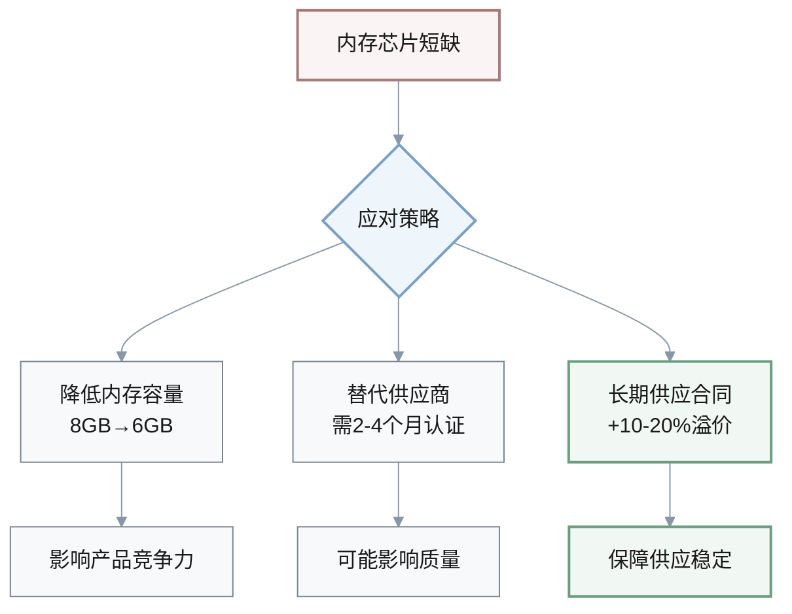

**决策**:

| 策略 | 时间框架 | 投资 | 优势 | 风险 | 推荐 |
|------|---------|------|------|------|------|
| **(1) 提前锁定供应** | 12-18个月 | +10-15%溢价 | 保障供应稳定性 | 市场价格回落时额外成本 | ✅ **短期必选** |
| **(2) 降低内存规格** | 立即 | 节省成本 | 降低成本压力 | 影响竞争力和用户体验 | ⚠️ 仅入门级 |
| **(3) 架构优化** | 6-9个月 | $1M-$3M | 减少30-40%内存需求 | 开发周期长 | ✅ **中长期必选** |

**推荐组合策略: (1)+(3)** 🎯
- **短期**: 通过长期合同保障供应
- **中长期**: 通过技术优化降低内存依赖
- **理由**: 应对结构性短缺的最稳健策略

**行动**: 
- **立即(0-2周)**: CTO召集紧急会议,评估当前内存库存(目标:至少3个月库存覆盖);供应链总监联系三星、海力士、美光,获取2026年Q1-Q4的价格和供应预测;产品架构师启动内存使用审计,识别优化空间。**成功指标**:锁定至少1家供应商的6个月供应承诺,完成内存优化可行性报告。
- **短期(2周-2个月)**: 签订长期供应合同,预算增加15-20%内存采购成本;启动内存优化项目,目标在6个月内将内存需求降低30%;为入门级产品线制定6GB内存方案,完成用户体验测试。**成功指标**:2026年Q1内存供应无中断,原型机内存使用效率提升25%,6GB方案通过用户接受度测试(满意度≥80%)。

[n2]: https://www.cnbc.com/2025/11/17/ai-fuels-memory-chip-shortage-that-could-hit-phones-and-cars.html

---

### [ProdMarket] Q3: AI硬件产品进入大众市场阶段,3C企业如何调整产品组合优先级?

**领域**: 产品与市场 | **阶段**: Growth/Scale | **职能**: Product  
**速度**: High | **关键性**: [Roles, Action, Quantified]  
**利益相关者**: CPO, 产品总监, 市场研究总监, CEO  
**来源**: [Ref: N3][n3]

**新闻**: 2025年11月,京东双十一数据显示3C数字AI产品营业额同比增长超100%,其中智能眼镜营业额增长346%。AI驱动的设备正从早期采用者阶段过渡到大众市场,包括AI智能眼镜、陪伴机器人等新品类快速增长。[Ref: N3][n3]

**影响**: AI硬件的爆发式增长标志着市场从"技术演示"阶段进入"规模应用"阶段,这对3C企业的产品组合战略带来深远影响。

**市场增长对比**:

| 产品类别 | 增长率 | 平均售价 | 利润率 | 开发周期 |
|---------|--------|---------|--------|---------|
| **AI智能眼镜** | +346% 🚀 | $500-$1,500 | 25-35% | 18-24个月 |
| **3C数字AI产品** | +100% 📈 | - | 25-35% | 18-24个月 |
| **传统手机** | +5-10% | - | 15-20% | 12-18个月 |
| **传统笔记本** | +3-8% | - | 15-20% | 12-18个月 |
| **传统眼镜** | - | $100-$300 | 10-15% | 6-12个月 |

**客户经济指标**:

$$
\text{LTV/CAC比率} = \frac{\text{LTV传统} \times (2-3)}{\text{CAC传统} \times (1.3-1.5)} = 1.33-2.3\times \text{改善}
$$

| 指标 | 传统产品 | AI产品 | 变化 |
|------|---------|--------|------|
| **客户获取成本 (CAC)** | 基准 | +30-50% | ↑ |
| **客户生命周期价值 (LTV)** | 基准 | +200-300% | ↑↑ |
| **LTV/CAC比率** | 基准 | 改善1.33-2.3倍 | ✅ 更健康 |

**资源分配决策点**:

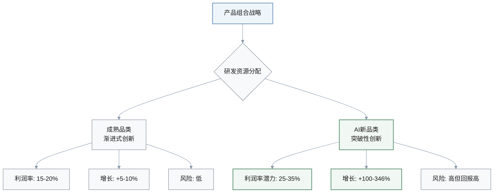

**决策**:

| 策略 | 资源配置 | 预算 | 时间框架 | 产品数量 | 优势 | 风险 | 推荐 |
|------|---------|------|---------|---------|------|------|------|
| **(1) 激进转型** | >50% AI品类 | $50M-$100M | 18-24个月 | 3-5款AI产品 | 抢占市场先机 | 现有产品线受影响 | ⚠️ 高风险 |
| **(2) 渐进式布局** ⭐ | 70%成熟+30%AI | $20M-$30M | 12个月 | 1-2款AI产品 | 平衡风险与机会 | 可能错失窗口期 | ✅ **推荐** |
| **(3) 合作伙伴模式** | 外部合作 | $30M-$50M | 6-12个月 | 快速上市 | 速度快风险可控 | 支付较高溢价 | 💡 可选 |

**推荐选择(2)**: 大多数3C企业尚未建立AI产品的核心能力,渐进式布局可以在学习中降低风险,同时保持现金流稳定。

**行动**: 
- **立即(0-2周)**: CPO组织产品组合战略会议,重新评估2026年产品路线图;市场研究总监启动AI产品用户调研,目标访谈100-200名早期采用者,了解痛点和愿付价格;产品总监识别3-5个AI产品概念,进行快速原型验证。**成功指标**:完成产品组合重新分配方案,AI产品预算增加30%,识别2个高潜力AI产品方向。
- **短期(2周-2个月)**: 启动2个AI产品项目,每个预算1000万-1500万美元;招聘或培训AI产品经理和工程师团队(目标:20-30人);建立AI产品成功指标体系(MAU、留存率、NPS);与潜在技术合作伙伴(如AI芯片厂商、算法公司)建立合作关系。**成功指标**:12个月内推出首款AI产品,目标首年销量10万-50万台,用户NPS≥50,产品毛利率≥25%。

[n3]: https://eu.36kr.com/en/p/3552243134020744

---

### [CommOps] Q4: AI驱动的GTM战略成为主流,3C企业如何重构商业运营模式?

**领域**: 商业运营 | **阶段**: Growth/Scale | **职能**: Commercial  
**速度**: Medium | **关键性**: [Action, Roles, Quantified]  
**利益相关者**: CMO, 销售副总裁, 客户成功总监, RevOps负责人  
**来源**: [Ref: N4][n4]

**新闻**: 2025年11月,行业报告显示超过70%的B2B组织在2025年底前整合AI驱动的GTM和CRM自动化。全球消费电子市场规模预计2025年达到1.46万亿美元,数字化优先发现已成为常态,近四分之三的消费者在线开始电子产品搜索。拥有一致、数据驱动的GTM团队的公司达成营收目标的可能性是其他公司的两倍。[Ref: N4][n4]

**影响**: AI驱动的GTM战略正在重新定义3C行业的商业运营效率基准。

**GTM模式对比**:

| 指标 | 传统销售模式 | AI驱动GTM | 改善幅度 |
|------|------------|----------|---------|
| **转化率** | 2-5% | 8-15% | +200-400% ↑ |
| **销售周期** | 30-90天 | 15-45天 | -50% ↓ |
| **客户获取成本(CAC)** | 基准 | -30-40% | 降低30-40% ↓ |
| **初级咨询处理** | 人工 | AI处理70-80% | 人效提升2-3倍 ↑ |
| **客户成功团队效率** | 基准 | 专注高价值客户 | +200-300% ↑ |

**实施要求**:

| 维度 | 要求 | 投资/时间 |
|------|------|----------|
| **变革管理期** | 组织转型 | 12-18个月 |
| **技术投资** | AI GTM平台 | $2M-$5M |
| **团队培训** | 销售+营销团队 | 50-70%人员需培训 |

**AI GTM效率提升**:

$$
\text{人效提升} = \frac{\text{AI处理率} \times \text{自动化效率}}{\text{人工处理成本}} = \frac{70-80\% \times 2-3\times}{100\%} = 2-3\times
$$

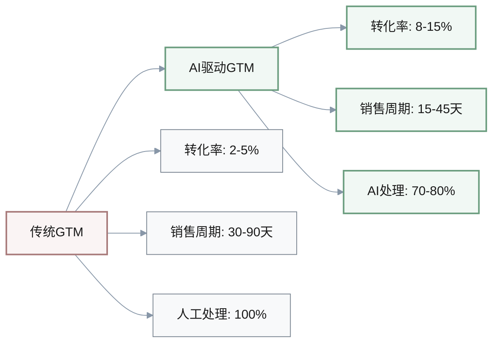

**决策**:

| 策略 | 投资 | 时间框架 | 目标 | 优势 | 风险 | 推荐 |
|------|------|---------|------|------|------|------|
| **(1) 全面AI化** | $5M-$8M | 18个月 | CAC↓40%, 转化率↑100% | 长期竞争力最强 | 短期业绩下滑10-20% | ⚠️ 激进 |
| **(2) 试点验证** ⭐ | $1M-$2M | 6-9个月 | 验证ROI | 风险低 | 可能错失市场机会 | ✅ **第一步** |
| **(3) 混合模式** 💡 | $3M-$5M | 12个月 | 平衡效率与体验 | 客户分层服务 | 管理复杂度高 | ✅ **第二步** |

**推荐路径: (2)→(3)** 🎯
1. **先**: 通过试点验证ROI和团队接受度
2. **后**: 根据客户分层设计混合模式
3. **理由**: 风险最可控的路径

**行动**: 
- **立即(0-2周)**: CMO和销售副总裁召开GTM战略会议,评估当前销售效率指标(CAC、转化率、销售周期、LTV);RevOps负责人调研3-5家AI GTM平台(如HubSpot、Salesforce Einstein、Gong),获取演示和报价;客户成功总监访谈20-30名销售和客户成功团队成员,了解对AI工具的接受度和顾虑。**成功指标**:完成AI GTM平台评估报告,识别1-2个试点产品线,制定变革管理计划。
- **短期(2周-2个月)**: 启动试点项目,选择1个中等规模产品线(年营收5000万-1亿美元),投资150万-200万美元部署AI GTM平台;培训30-50名销售和营销团队成员使用AI工具;设定6个月试点成功指标(CAC降低25%、转化率提升50%、销售周期缩短30%)。**成功指标**:试点区域CAC从基准500美元降至375美元,销售周期从60天降至42天,团队AI工具采用率≥80%。如果试点成功,9-12个月内推广至全公司。

[n4]: https://pepperinsight.com/blog/gtm-marketing-in-2025-complete-guide-trends-and-winning-strategies-hapn6s

---

### [FinEcon] Q5: 全球消费电子市场增长至1.46万亿美元,如何优化资本配置策略?

**领域**: 财务与经济 | **阶段**: Growth/Scale | **职能**: Financial  
**速度**: Medium | **关键性**: [Quantified, Action]  
**利益相关者**: CFO, 财务副总裁, 投资者关系总监, CEO  
**来源**: [Ref: N5][n5]

**新闻**: 2025年,全球消费电子市场规模预计达到1.46万亿美元,2025-2032年复合年增长率(CAGR)为7.8%。市场增长主要由AI集成、个性化和数字优先趋势驱动。[Ref: N5][n5]

**影响**: 消费电子市场7.8%的CAGR显著高于全球GDP增速(预计3-4%),表明行业仍处于结构性增长期,但不同细分市场增速分化明显。

**市场增速对比**:

| 类别 | CAGR | 趋势 |
|------|------|------|
| **消费电子市场** | 7.8% | 📈 结构性增长 |
| **AI新品类** | 100-300% | 🚀 爆发式增长 |
| **传统品类** | 5-10% | ➡️ 稳定增长 |
| **全球GDP** | 3-4% | 📊 基准增速 |

**资本配置策略演进**:

| 费用类型 | 传统策略 | AI时代策略 | 变化 |
|---------|---------|-----------|------|
| **研发费用率** | 15-20% | 25-30% | +5-10% ↑ |
| **营销费用率** | 5-10% | 3-5% | -2-5% ↓ |
| **营业利润率** | - | 15-20% | 目标维持 |
| **自由现金流/营收** | - | 8-12% | 目标维持 |

**增速影响分析**:

> ⚠️ **关键风险**: 如果企业增速低于市场7.8%增速 → 市场份额流失 → 长期估值下降20-40%

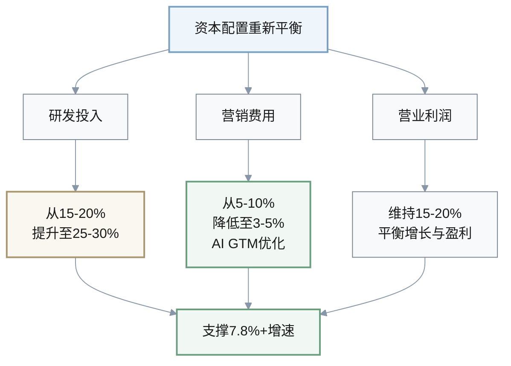

**决策**:

| 策略 | 研发费用率 | 营销费用率 | 营业利润率 | 优势 | 适用企业 | 推荐 |
|------|-----------|-----------|-----------|------|---------|------|
| **(1) 激进增长** | 30% | 保持/增加 | 10-12% | 长期估值增长 | 现金充裕企业 | ⚠️ 高风险 |
| **(2) 平衡策略** ⭐ | 25% | 5% (AI优化) | 15-18% | 平衡增长与盈利 | 上市公司/IPO | ✅ **推荐** |
| **(3) 效率优先** | 20% | 3% | 20-22% | 现金流优先 | 成熟期/PE持有 | 💡 保守 |

**推荐选择(2)**: 大多数3C企业需要在增长和盈利之间取得平衡
- **风险平衡**: 过度牺牲利润率→投资者担忧
- **机会平衡**: 过于保守→失去市场机会

**行动**: 
- **立即(0-2周)**: CFO组织年度预算战略会议,重新评估2026财年资本配置计划;财务副总裁分析竞争对手的研发和营销费用率,标杆对比;投资者关系总监准备投资者沟通材料,解释资本配置调整的战略逻辑;CEO批准资本配置调整方案。**成功指标**:完成2026财年预算调整,研发投入增加30-50%(从20%提升至25-26%),营销费用优化20-30%(从8%降至5-6%),维持营业利润率15-18%。
- **短期(2周-2个月)**: 实施新的资本配置计划,增加研发团队招聘(目标:增加100-200名工程师和产品经理);部署AI GTM平台以降低营销费用;优化供应链和运营效率以抵消研发投入增加的影响;向投资者和董事会报告资本配置调整的进展和早期效果。**成功指标**:2026 Q1研发费用率达到23-24%,营销费用率降至6-7%,营业利润率维持15-17%,投资者对战略调整的反馈积极(股价稳定或上涨)。

[n5]: https://www.shopify.com/enterprise/blog/consumer-electronic-trends

---

### [StratIntel] Q6: 欧盟ESPR法规要求数字产品护照,3C企业如何应对合规与竞争压力?

**领域**: 战略情报 | **阶段**: Growth/Scale | **职能**: Strategic  
**速度**: Low | **关键性**: [Risk, Blocks]  
**利益相关者**: 首席战略官, 法务总监, 可持续发展总监, CEO  
**来源**: [Ref: N6][n6]

**新闻**: 2025年,欧盟《可持续产品生态设计法规》(ESPR)已于2024年7月生效,旨在改善产品的循环性、能源性能和其他环境指标。法规引入耐久性、可重复使用性、可维修性和回收内容等要求,以及数字产品护照(Digital Product Passport, DPP)。针对IT和电子产品的具体措施将从2026年开始采用。[Ref: N6][n6]

**影响**: ESPR法规代表欧盟从"碳排放"监管扩展至"全生命周期可持续性"监管,这将对3C产品的设计、制造、销售和回收全流程产生深远影响。

**数字产品护照(DPP)要求**:

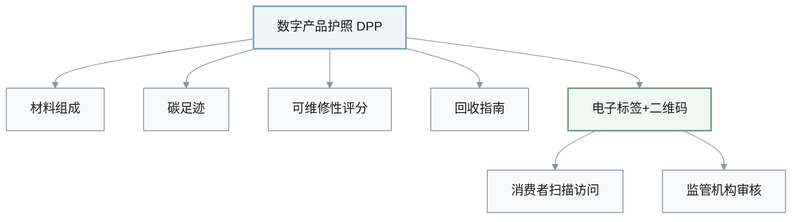

**企业影响三维度**:

**1️⃣ 合规成本**:

| 项目 | 投资范围 | 影响因素 |
|------|---------|---------|
| **DPP系统建设** | $5M-$20M | 产品SKU数量、供应链复杂度 |
| **数据收集** | 包含在上述 | 供应链协同成本 |
| **IT系统** | 包含在上述 | 系统集成复杂度 |
| **供应商协同** | 包含在上述 | 供应商数量和配合度 |

**2️⃣ 产品设计变革**:

| 要求 | 目标 | BOM成本影响 |
|------|------|------------|
| **可维修性** | 90%零部件可拆卸更换 | +5-10% |
| **再生材料** | ≥30%回收塑料和金属 | +5-10% |
| **产品寿命** | ≥5年 | 设计成本增加 |

**3️⃣ 竞争影响分析**:

| 策略 | 时机 | 品牌溢价 | 市场准入风险 | 营收影响 |
|------|------|---------|-------------|---------|
| **提前合规** | 2025年 | +5-15% | 无风险 ✅ | 正面影响 |
| **延迟合规** | 2026年后 | 0% | 2026年后无法在欧盟销售 🔴 | -20-30%营收 |

> ⚠️ **关键假设**: 欧盟占全球市场20-30%

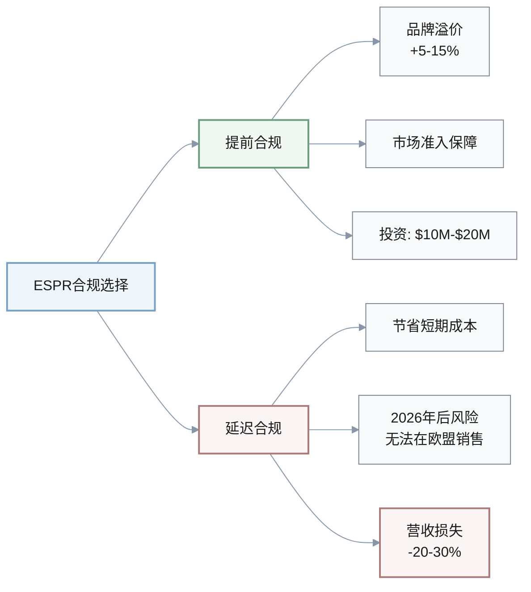

**决策**:

| 策略 | 投资 | 完成时间 | 品牌溢价 | 优势 | 风险 | 推荐 |
|------|------|---------|---------|------|------|------|
| **(1) 提前合规** ⭐ | $10M-$20M | 2025年底 | +5-15% | 先发优势+市场准入保障 | 短期成本压力 | ✅ **推荐** |
| **(2) 最低合规** | $5M-$8M | 2026年后 | 0% | 节省短期成本 | 失去品牌优势+合规风险 | ⚠️ 不推荐 |
| **(3) 战略合规+** | $30M-$50M | 2025年底 | +15-25% | 行业领导者地位 | 高投资+执行难度 | 💡 可选 |

**推荐选择(1)**: 欧盟是全球最重要市场之一
- **风险管理**: 延迟合规→2026年后无法在欧盟销售→-20-30%营收
- **竞争优势**: 提前合规→品牌差异化+5-15%溢价

**行动**: 
- **立即(0-2周)**: 首席战略官和法务总监召集跨部门ESPR合规工作组(包括产品、工程、供应链、IT、市场);可持续发展总监启动ESPR法规影响评估,识别高风险产品线和供应商;法务总监联系欧盟合规顾问,获取法规解读和合规路线图;CEO批准合规预算。**成功指标**:完成ESPR合规影响评估报告,识别5-10个需要优先整改的产品线,制定合规项目计划和预算。
- **短期(2周-2个月)**: 启动DPP系统建设,投资500万-1000万美元(包括IT系统、数据收集、供应商协同);启动产品重新设计项目,目标提升可维修性至90%、使用≥30%回收材料;与主要供应商签订可持续性承诺协议,要求提供碳足迹和材料数据;开展内部和供应商培训,确保团队理解ESPR要求。**成功指标**:2026年Q1前完成DPP系统上线,首批20-30%产品获得DPP认证,产品可维修性评分从基准60分提升至80分,回收材料使用率从15%提升至30%。

[n6]: https://www.ul.com/resources/whats-new-electronic-product-sustainability-regulations

---

### [OpsSupply] Q7: 内存芯片价格暴涨60%,如何优化供应链成本结构?

**领域**: 运营与供应链 | **阶段**: Growth/Scale | **职能**: Operations  
**速度**: High | **关键性**: [Quantified, Risk, Action]  
**利益相关者**: COO, 供应链副总裁, 采购总监, CFO  
**来源**: [Ref: N7][n7]

**新闻**: 2025年11月,三星已悄然将部分内存芯片价格相比9月上调最高60%。内存紧缩正在整个芯片供应链中产生连锁反应,影响包括智能手机和汽车在内的各种产品。[Ref: N7][n7]

**影响**: 内存芯片价格60%的暴涨是2021年全球芯片短缺以来最严重的供应链冲击,将直接冲击3C产品的毛利率和现金流。

**财务影响分析** (以年营收$1B的3C企业为例):

| 指标 | 基准 | 涨价后 | 变化 |
|------|------|--------|------|
| **内存占BOM成本比例** | 10-15% | 10-15% | - |
| **内存价格** | 基准 | +60% | +60% 🔴 |
| **整体BOM成本** | 基准 | +6-9% | +6-9% ↑ |
| **毛利率** (无法转嫁) | 30% | 21-24% | -6-9% ↓ |
| **年度利润影响** | - | -$50M-$90M | 🔴 严重冲击 |

**价格转嫁风险**:

$$
\text{销量下滑} = \text{涨价敏感度} \times \text{价格增幅} = \text{高竞争} \times 6-9\% = 20-30\% \text{下滑}
$$

**供应链优先级影响**:

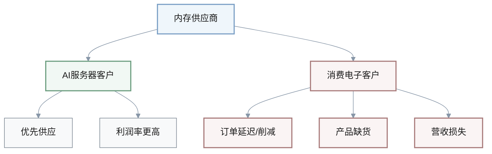

**供应链团队决策困境**:

| 选项 | 成本影响 | 时间影响 | 质量风险 | 竞争力影响 |
|------|---------|---------|---------|-----------|
| **接受高价锁定供应** | 增加成本 | 无延迟 | 低 | 保持 |
| **替代供应商** | 可能降低 | 2-4个月认证 | 中等 | 保持 |
| **降低内存配置** | 降低成本 | 无延迟 | 低 | 下降 |

**决策**:

| 策略 | 时间框架 | 投资/溢价 | 优势 | 风险 | 推荐 |
|------|---------|----------|------|------|------|
| **(1) 高价锁定供应** ⭐ | 12-18个月 | +60%溢价 | 避免缺货风险 | 毛利率↓6-9% | ✅ **短期必选** |
| **(2) 多元化供应商** ⭐ | 2-4个月认证 | 价格↓10-20% | 降低依赖性 | 质量风险 | ✅ **短期必选** |
| **(3) 价值工程** ⭐ | 6-9个月 | $2M-$5M | 降低需求30-40% | 短期无效 | ✅ **中长期必选** |
| **(4) 价格转嫁** | 立即 | 售价↑5-10% | 转嫁成本 | 销量↓15-25% | 💡 仅高端产品 |

**推荐组合策略: (1)+(2)+(3)** 🎯
- **短期**: 长期合同+多元化供应商保障供应
- **中长期**: 技术优化降低内存依赖
- **目标**: 将BOM成本增加控制在4-5%(而非6-9%),毛利率维持在27-28%

**行动**: 
- **立即(0-2周)**: COO召集供应链危机管理会议,评估当前内存库存(目标:至少3-6个月库存覆盖);采购总监立即联系三星、海力士、美光,获取2026年Q1-Q4的价格和供应承诺,争取锁定至少6个月供应;供应链副总裁启动替代供应商认证流程,联系长江存储、南亚科技等次级供应商;CFO评估价格上涨对毛利率和现金流的影响,制定应对方案。**成功指标**:锁定至少1家主要供应商的6个月供应合同,启动2家替代供应商认证,完成价格影响分析报告。
- **短期(2周-2个月)**: 签订12个月长期供应合同,接受40-50%溢价(通过谈判从60%降至40-50%);完成2家替代供应商认证,实现30%供应多元化;启动价值工程项目,目标6-9个月内将内存需求降低30%;评估价格转嫁策略,对高端产品线提价5-8%。**成功指标**:2026年Q1-Q2内存供应无中断,通过供应商多元化和价值工程,将BOM成本增加控制在4-5%(而非6-9%),毛利率维持在27-28%(而非21-24%)。

[n7]: https://www.cnbc.com/2025/11/17/ai-fuels-memory-chip-shortage-that-could-hit-phones-and-cars.html

---

### [PeopleWF] Q8: 半导体行业芯片设计师短缺加剧,3C企业如何优化人才战略?

**领域**: 人才与劳动力 | **阶段**: Growth/Scale | **职能**: People  
**速度**: Medium | **关键性**: [Roles, Blocks, Action]  
**利益相关者**: CHRO, 人才副总裁, CTO, CEO  
**来源**: [Ref: N8][n8]

**新闻**: 2025年,半导体行业正经历人才短缺,特别是芯片设计师、工艺工程师和数据科学家。AI人才需求快速增长,AI/ML职位的新员工比例显著上升。科技行业仍是科技人才的最大雇主,远程工作机会持续保持强劲。[Ref: N8][n8]

**影响**: 芯片设计师和AI人才短缺对3C企业的产品创新能力构成直接威胁。

**人才市场薪资演变**:

| 角色 | 2023薪资 | 2025薪资 | 涨幅 | 招聘周期 |
|------|---------|---------|------|---------|
| **芯片设计师** | $150K-$250K | $250K-$400K | +60-70% ↑ | 3个月→6-9个月 |
| **AI/ML工程师** | $200K-$300K | $350K-$550K | +75-80% ↑ | 3个月→6-9个月 |

**人才流失危机**:

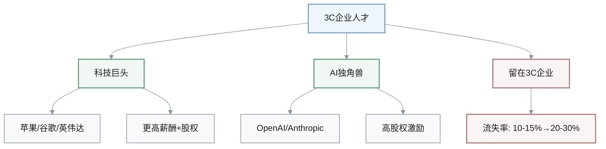

**成本与时间影响**:

| 维度 | 历史水平 | 当前水平 | 影响 |
|------|---------|---------|------|
| **人力成本/营收比例** | 25-30% | 35-40% | +10% ↑ |
| **人才流失率** | 10-15% | 20-30% | +100% ↑ |
| **产品上市延迟** | 基准 | 6-12个月 | 🔴 失去市场先机 |

**人才短缺影响公式**:

$$
\text{总成本影响} = \text{薪资增幅} + \text{招聘成本} + \text{延迟上市机会成本}
$$

$$
\text{总成本影响} = (60-80\%) + \text{高} + \text{6-12个月营收损失}
$$

**决策**:

| 策略 | 投资 | 时间框架 | 人才数量 | 优势 | 风险 | 推荐 |
|------|------|---------|---------|------|------|------|
| **(1) 薪酬竞争** ⭐ | $50M-$100M | 立即 | 100-200名 | 短期见效 | 利润率↓3-5% | ✅ **短期必选** |
| **(2) 内部培养** ⭐ | $20M-$30M | 12-18个月 | 100-200名 | 成本较低 | 见效慢 | ✅ **中期必选** |
| **(3) 外包合作** | $30M-$50M | 6-12个月 | 灵活 | 灵活性高 | 核心能力外溢 | 💡 可选 |
| **(4) 远程全球化** ⭐ | $10M-$20M | 6-12个月 | 50-100名 | 成本↓40-60% | 时区/文化差异 | ✅ **长期必选** |

**推荐组合策略: (1)+(2)+(4)** 🎯
- **短期**: 薪酬竞争留住和吸引核心人才
- **中期**: 内部培养建立人才梯队
- **长期**: 全球化降低成本
- **目标**: 6个月内招聘30-50名,关键人才流失率<12%

**行动**: 
- **立即(0-2周)**: CHRO和CTO召开人才战略紧急会议,评估当前芯片设计师和AI人才缺口(目标vs实际人数);人才副总裁启动市场薪酬调研,对标科技巨头和AI独角兽的薪酬和股权方案;CTO识别关键人才流失风险(top 20%高绩效员工),CHRO制定挽留计划(包括薪酬调整、晋升、项目分配);CEO批准人才战略调整和预算。**成功指标**:完成人才缺口分析(目标需要150-200名芯片设计师和AI人才,当前仅有80-100名),制定薪酬调整方案(提升30-40%至市场70-75分位),关键人才流失率降至15%以下。
- **短期(2周-2个月)**: 实施薪酬调整,向现有芯片设计师和AI人才加薪30-40%,增加股权激励(RSU占总薪酬的30-40%);启动内部人才转型计划,选拔50-100名高潜力硬件工程师进行芯片设计和AI培训(12-18个月项目,投资2000万美元);在印度班加罗尔或中国深圳建立远程研发中心,招聘50-100名芯片设计师和AI工程师(薪酬成本降低50%);加强雇主品牌建设,在顶级大学和技术社区提升知名度。**成功指标**:6个月内招聘30-50名芯片设计师和AI人才,关键人才流失率降至12%以下,内部培训项目启动并有50名员工入选,远程研发中心开始运营并招聘20-30名员工。

[n8]: https://ravio.com/blog/tech-hiring-trends

---

## 综合优先级与时间表

**跨领域行动优先级矩阵**:

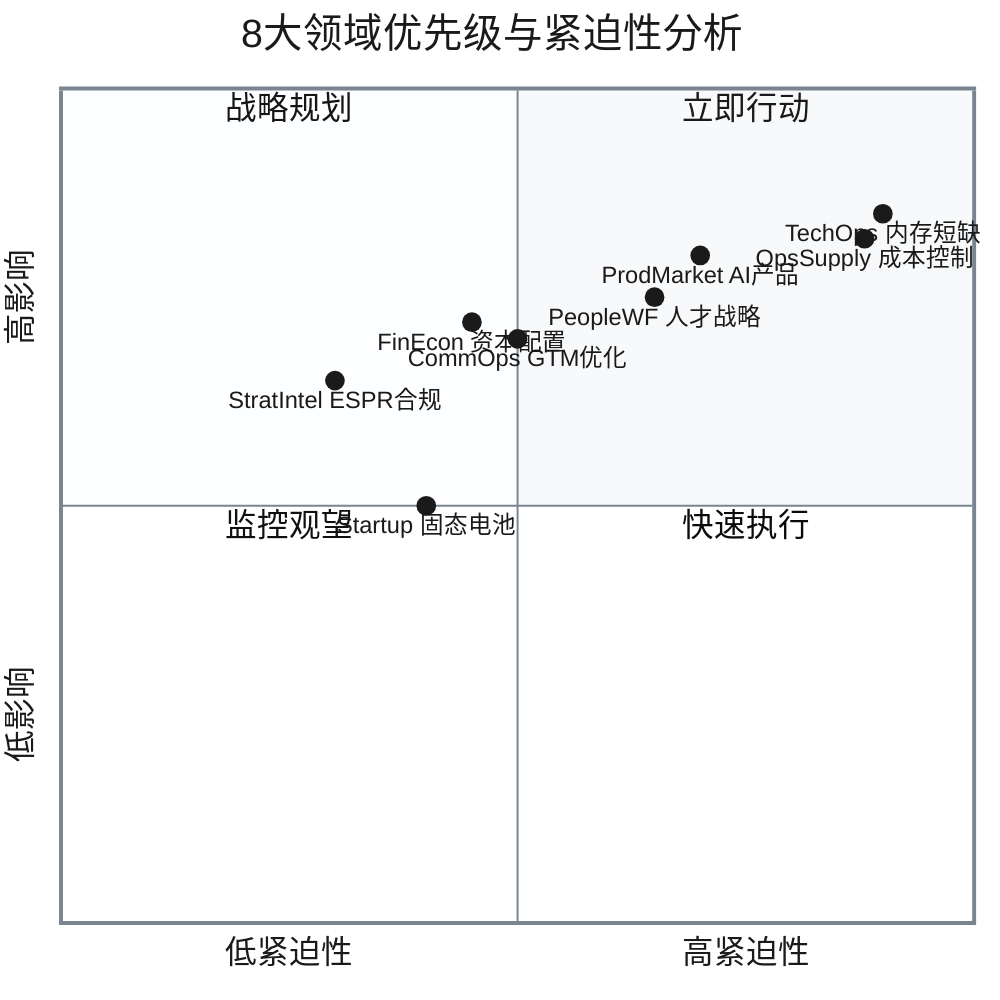

**时间线与关键里程碑**:

| 时间框架 | 立即行动 (0-2周) | 短期 (2周-2个月) | 中期 (2-6个月) | 长期 (6-24个月) |
|---------|----------------|----------------|--------------|----------------|
| **TechOps** | ⚠️ 锁定内存供应 | 长期合同签订 | 内存优化项目 | 架构优化完成 |
| **OpsSupply** | ⚠️ 供应链危机会议 | 多元化供应商 | 价值工程启动 | 成本控制目标达成 |
| **ProdMarket** | 产品组合重评估 | AI产品项目启动 | 首款AI产品上市 | 2-3款AI产品成熟 |
| **CommOps** | GTM战略会议 | AI GTM试点 | 试点效果验证 | 全面推广 |
| **FinEcon** | 预算战略会议 | 资本配置调整 | 研发投入提升 | 财务目标达成 |
| **StratIntel** | ESPR工作组 | DPP系统建设 | 产品重新设计 | 2026合规完成 |
| **PeopleWF** | 人才缺口评估 | 薪酬调整实施 | 内部培养启动 | 全球化布局 |
| **Startup** | 技术评估启动 | 概念验证项目 | 原型开发 | 供应商合作框架 |

**关键成功指标汇总**:

| 领域 | 6个月目标 | 12个月目标 | 24个月目标 |
|------|----------|-----------|-----------|
| **TechOps** | 内存供应无中断 | 内存效率↑25% | 内存需求↓30% |
| **OpsSupply** | 供应商多元化30% | BOM成本控制+4-5% | 毛利率维持27-28% |
| **ProdMarket** | AI产品预算↑30% | 首款AI产品上市 | AI产品营收占比15-20% |
| **CommOps** | 试点CAC↓25% | 全面推广AI GTM | CAC↓40%, 转化率↑100% |
| **FinEcon** | 研发费用率23-24% | 研发费用率25-26% | 支撑7.8%+增速 |
| **StratIntel** | ESPR评估完成 | DPP系统上线 | 100%产品合规 |
| **PeopleWF** | 招聘30-50名 | 流失率<12% | 人才梯队建立 |
| **Startup** | 供应商评估完成 | 原型完成 | 产品商业化 |

---

## 参考资料

**新闻来源 (N#)**:
- [N1] BTRY获得570万美元种子轮融资: https://www.startupresearcher.com/news/btry-raises-usd5-7-million-to-scale-ultra-thin-solid-state-cells
- [N2] AI导致内存芯片短缺加剧: https://www.cnbc.com/2025/11/17/ai-fuels-memory-chip-shortage-that-could-hit-phones-and-cars.html
- [N3] AI硬件产品进入大众市场: https://eu.36kr.com/en/p/3552243134020744
- [N4] AI驱动的GTM战略趋势: https://pepperinsight.com/blog/gtm-marketing-in-2025-complete-guide-trends-and-winning-strategies-hapn6s
- [N5] 全球消费电子市场规模: https://www.shopify.com/enterprise/blog/consumer-electronic-trends
- [N6] 欧盟ESPR可持续产品法规: https://www.ul.com/resources/whats-new-electronic-product-sustainability-regulations
- [N7] 三星内存芯片价格上涨60%: https://www.cnbc.com/2025/11/17/ai-fuels-memory-chip-shortage-that-could-hit-phones-and-cars.html
- [N8] 半导体行业人才短缺: https://ravio.com/blog/tech-hiring-trends

---

**元数据**:
- **生成日期**: 2025-11-22
- **生成方式**: Zencoder AI自动生成
- **覆盖时期**: 2025-11-01 至 2025-11-22
- **语言**: 中文
- **状态**: Draft
- **所有者**: 知识库管理团队
