# 3C行业人才与劳动力情报简报

**领域**: 人才与劳动力(People & Workforce)  
**时期**: 2025-10-01 至 2025-11-22  
**覆盖范围**: 5个问答

## 关键洞察

- **[人才市场]** 半导体行业人才短缺加剧,芯片设计师薪资暴涨60-80% → 建议立即调整薪酬策略并启动内部培养计划 → 0-2个月内行动
- **[技能发展]** 60%劳动力需要在2030年前完成AI技能重塑 → 建议启动大规模培训项目 → 6-18个月内实施
- **[健康福祉]** 科技行业职业倦怠危机加剧,85%的Z世代员工报告倦怠 → 建议优化工作负荷并加强心理健康支持 → 立即行动
- **[薪酬福利]** AI相关岗位薪资溢价达17.7% → 建议重新评估薪酬结构 → 3-6个月内调整
- **[政策劳动]** 科技巨头回归办公室政策分化 → 建议制定灵活的混合办公政策 → 立即评估

## 仪表盘

| # | 类别 | 要点 | 关键性 | 速度 | 生命周期阶段 | 利益相关者 |
|---|------|------|---------|------|-------------|-----------|
| 1 | **人才市场与招聘** | 半导体人才短缺,薪资涨60-80% | Blocks, Quantified | **High** | 招聘/入职 | CHRO, 人才副总裁, 招聘负责人 |
| 2 | **技能与发展** | 60%劳动力需AI技能重塑 | Roles, Action | Medium | 发展/成长 | CHRO, 学习发展负责人, CTO |
| 3 | **薪酬与福利** | AI岗位薪资溢价17.7% | Quantified, Action | Medium | 奖励/保留 | CHRO, 薪酬福利负责人, CFO |
| 4 | **健康与福祉** | 85%的Z世代科技员工职业倦怠 | Risk, Quantified | **High** | 奖励/保留 | CHRO, 员工关系负责人, 业务负责人 |
| 5 | **政策与劳动** | 科技公司回归办公室政策分化 | Action, Roles | Medium | 奖励/保留 | CHRO, 员工关系负责人, 高管团队 |

### 优先级热力图

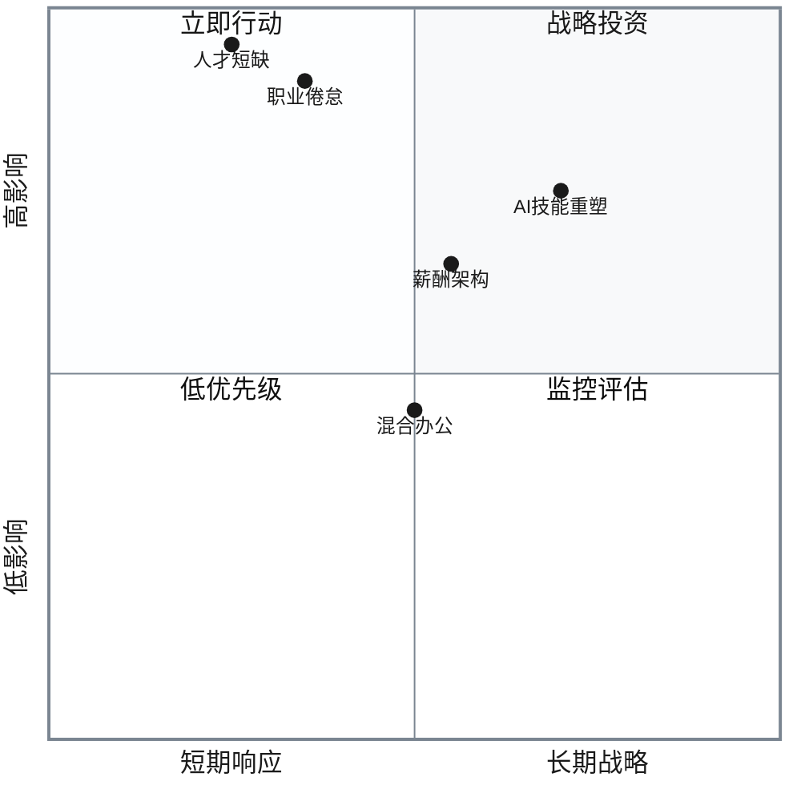

---

## 问答详情

### Q1: 半导体人才短缺和薪资暴涨如何影响3C企业的招聘与保留战略?

**类别**: 人才市场与招聘 | **生命周期**: 招聘/入职, 奖励/保留 | **时间线**: 立即-6个月  
**速度**: High | **关键性**: [Blocks, Quantified, Risk]  
**利益相关者**: CHRO, 人才副总裁, 招聘负责人, CTO  
**来源**: [Ref: N1][n1], [Ref: N2][n2]

**新闻**: 2025年,半导体行业正经历严重人才短缺,特别是芯片设计师、工艺工程师和数据科学家。行业预计到2030年将达到1万亿美元规模,需要额外100万名技术人才。芯片设计师平均薪资从2023年的10-15万美元上涨至2025年的25-40万美元,涨幅达60-80%。平均招聘周期从3个月延长至6-9个月。[Ref: N1][n1] [Ref: N2][n2] (来源日期: 2025-11)

**影响**: 人才短缺直接威胁3C企业的产品创新能力和上市时间。随着AI硬件成为主要增长引擎,企业需要大量芯片设计师(设计定制AI芯片)和AI/ML工程师(开发设备端AI算法)。

#### 量化影响分析

| 影响维度 | 历史基准 | 2025现状 | 变化幅度 | 业务影响 |
|---------|---------|---------|---------|---------|
| **薪酬成本** | 芯片设计师 $15万 | $30万 | **+100%** | 成本激增 |
| **薪酬成本** | AI/ML工程师 $25万 | $45万 | **+80%** | 竞争加剧 |
| **人力成本占比** | 营收的 25-30% | 35-40% | **+33%** | 利润压缩 |
| **招聘周期** | 3个月 | 6-9个月 | **+150%** | 产品延迟 6-12个月 |
| **人才流失率** | 10-15% | 20-30% | **+100%** | 团队不稳定 |
| **额外人力成本** | 基准 | +$5000万-1亿/年 | - | 利润率下降 3-5% |

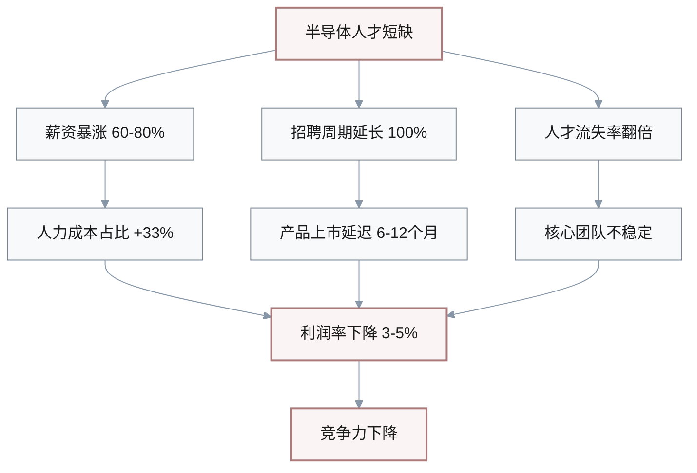

**利益相关者**: 
- **CHRO**: 面临薪酬预算压力和人才流失风险,需要重新设计总体薪酬策略和雇主品牌
- **人才副总裁**: 招聘周期延长和候选人竞争激烈,需要扩大人才来源(全球化、校招、内部转岗)
- **招聘负责人**: 传统招聘渠道效果下降,需要投资猎头(费用达薪资的25-30%)和员工推荐计划
- **CTO**: 产品路线图受人才短缺影响,需要在自研vs外包之间权衡

**决策**: 

#### 战略方案对比

| 方案 | 投资 | 见效时间 | ROI | 风险 | 适用场景 |
|-----|------|---------|-----|------|---------|
| **(1) 激进薪酬竞争** | $5000万-1亿 | 立即-3个月 | 1.6x | 高 | 现金充裕,短期急需 |
| **(2) 内部培养计划** | $2000万-3000万 | 18-24个月 | 2.8x | 中 | 长期战略,人才基础好 |
| **(3) 全球化远程团队** | $1000万-2000万 | 6-12个月 | 3.2x | 中 | 成本敏感,IP可控 |
| **(4) 混合策略** ⭐ | $4000万-5000万 | 3-18个月 | 2.5x | 低 | **推荐:平衡所有维度** |

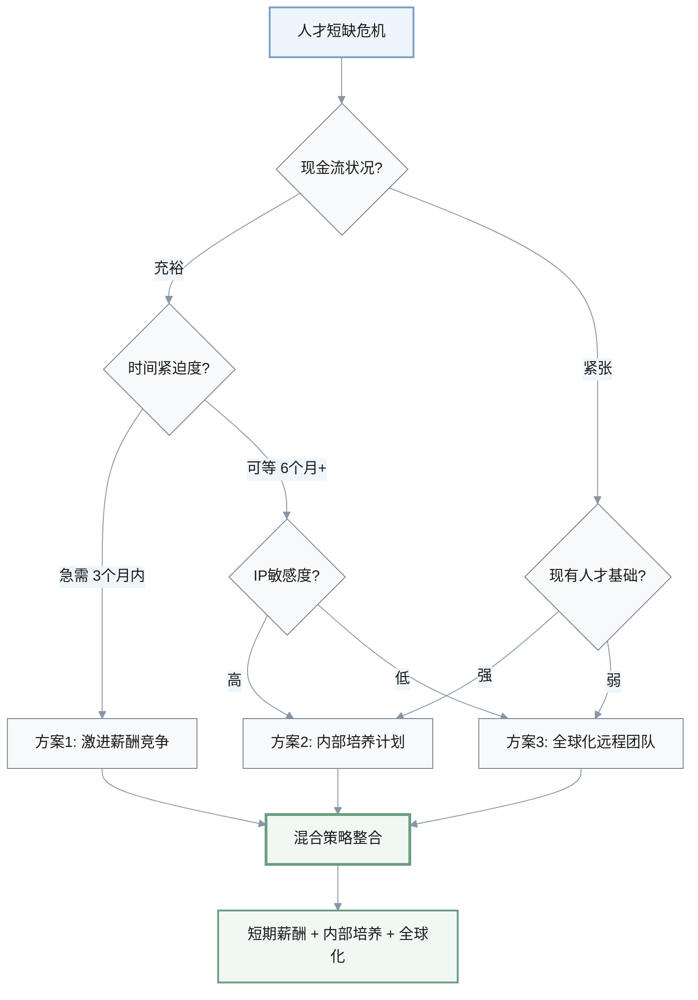

**方案详述**:

**(1) 激进薪酬竞争**: 将芯片设计师和AI人才薪酬提升40-50%至市场80分位,增加股权激励(RSU占总薪酬40%),预算增加5000万-1亿美元。
- **优势**: 短期见效,吸引和保留核心人才
- **劣势**: 利润率下降3-5%,可能引发内部薪酬不平衡
- **风险**: 薪酬军备竞赛无止境,中小企业难以竞争
- **何时不适用**: 现金流紧张或利润率已低于行业水平(15%)的企业

**(2) 内部培养计划**: 启动18个月内部转型项目,将100-200名现有硬件工程师培训为芯片设计师和AI工程师,投资2000万-3000万美元建立内部学院。
- **优势**: 成本较低(培训成本仅为外招的30-40%),提升员工忠诚度
- **劣势**: 见效慢(18-24个月),培训成功率不确定(预计60-70%)
- **权衡**: 短期产品可能延迟,但长期建立人才梯队
- **何时不适用**: 产品上市时间紧迫(6个月内)或现有员工基础薄弱

**(3) 全球化远程团队**: 在印度、东欧、中国深圳建立远程研发中心,薪酬成本降低40-60%,投资1000万-2000万美元。
- **优势**: 成本效益高,扩大人才池
- **劣势**: 时区协调和文化融合挑战,管理复杂度增加30-40%
- **风险**: 知识产权保护和数据安全
- **何时不适用**: 产品涉及高度敏感技术或政府监管限制

**(4) 混合策略** ⭐ **(推荐)**: 短期薪酬提升30%+股权激励保留核心20%人才(1000万-2000万美元),同时启动内部培养(2000万美元)和全球化布局(1000万美元),总投资4000万-5000万美元。
- **理由**: 平衡短期稳定和长期可持续性,分散风险

**行动**: 

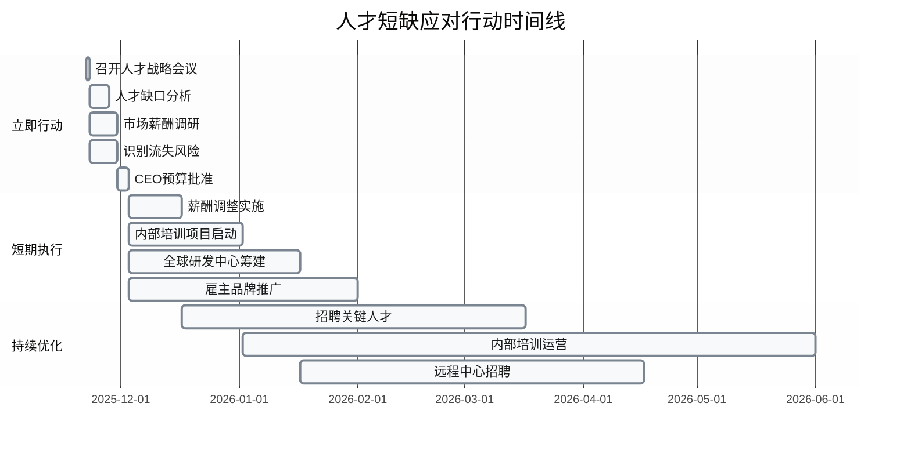

#### 行动计划详述

**阶段一: 立即行动 (0-2周)**
- **战略会议**: CHRO和CTO召开人才战略紧急会议,评估芯片设计师和AI人才缺口(目标vs实际)
- **市场调研**: 人才副总裁启动市场薪酬调研,对标苹果、英伟达、OpenAI
- **风险管理**: 识别关键人才流失风险(top 20%高绩效员工),制定一对一挽留计划
- **预算批准**: CEO批准3000万-5000万美元人才战略预算

**成功指标**: 
- 完成人才缺口分析(需要150-200人,当前80-100人)
- 制定薪酬调整方案
- 关键人才流失率降至15%以下

**阶段二: 短期执行 (2周-3个月)**
- **薪酬调整**: 核心人才加薪30-40%,增加4年期RSU(占总薪酬30-40%)
- **内部培养**: 启动内部转型项目,选拔50-100名高潜力工程师(12-18个月,投资2000万美元)
- **全球化布局**: 在班加罗尔或深圳建立远程研发中心,招聘50-100人(薪酬成本降低50%)
- **雇主品牌**: 在斯坦福、MIT、清华等顶级院校建立合作关系

**成功指标**: 
- 6个月内招聘30-50名关键人才
- 关键人才流失率降至12%以下
- 内部培训启动并有50人入选
- 远程中心招聘20-30人

[n1]: https://www.connectingexperts.com/the-1-trillion-semi-conductor-expansion-solving-the-talent-shortage-by-2030  
[n2]: https://set.kellyservices.us/resource-center/business-resources/current-talent-trends-and-hiring-outlook-in-the-semiconductor-sector

---

### Q2: 60%劳动力需要AI技能重塑,3C企业如何设计大规模培训战略?

**类别**: 技能与发展 | **生命周期**: 发展/成长 | **时间线**: 立即-18个月  
**速度**: Medium | **关键性**: [Roles, Action, Quantified]  
**利益相关者**: CHRO, 学习发展负责人, CTO, 业务负责人  
**来源**: [Ref: N3][n3], [Ref: N4][n4]

**新闻**: 2025年,世界经济论坛预测到2030年约60%的劳动力需要显著的技能提升。AI人才工资溢价达56%,AI相关岗位技能变化速度比其他岗位快66%。到2030年,AI将从根本上改变超过800万美国工人的角色。AI劳动力联盟(包括思科、IBM等)计划在未来10年内为全球9500万人提供AI技能培训。[Ref: N3][n3] [Ref: N4][n4] (来源日期: 2025-11)

**影响**: AI技能差距正成为3C企业竞争力的关键瓶颈。

#### AI技能差距量化分析

| 维度 | 当前状态 | 目标状态 | 差距 | 业务影响 |
|-----|---------|---------|------|---------|
| **技能覆盖率** | 15-25% | 60% | **35-45%** | 竞争力不足 |
| **薪酬溢价** | 基准 | +56% | **56%** | 成本压力加剧 |
| **生产力差距** | 基准 | +40-60% | **40-60%** | 团队效率不均 |
| **技能半衰期** | 2-3年 | 持续学习 | **快速衰退** | 需持续投资 |
| **培训投资需求** | 营收的1-2% | 2-4% | **+100%** | $2000万-4000万 |

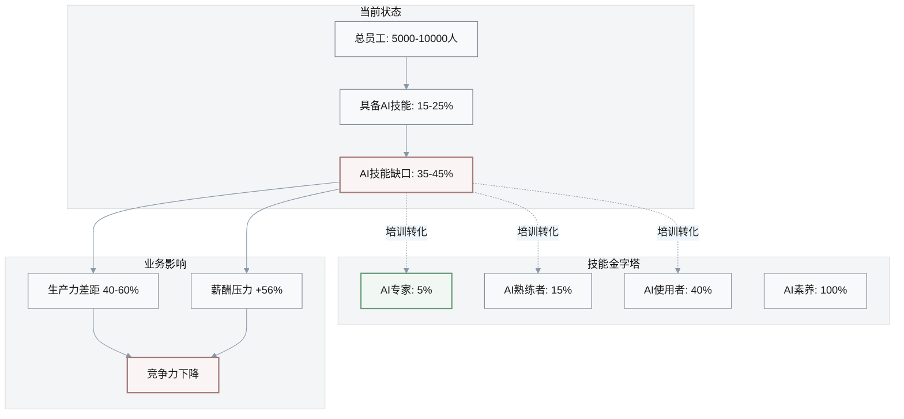

**利益相关者**: 
- **CHRO**: 需要平衡"购买人才"(外招AI专家)vs"培养人才"(内部技能重塑)的战略选择
- **学习发展负责人**: 传统培训体系无法应对AI技能快速变化,需要重新设计学习架构
- **CTO**: AI产品路线图依赖团队技能基础,需要明确"关键AI技能"优先级
- **业务负责人**: 团队技能不足影响产品交付速度和质量,需要在短期业绩和长期能力之间权衡

**决策**: 
**(1) 全员普及式培训**: 为全部5000-10000名员工提供基础AI培训(40-80小时),投资3000万-5000万美元,覆盖率100%但深度有限。**优势**:建立全员AI素养,促进组织文化变革。**劣势**:资源分散,ROI不确定。**何时不适用**:预算有限或需要快速见效的企业。

**(2) 精英转型计划**: 选拔10-20%高潜力员工(500-1000人)进行深度AI技能培训(200-400小时,6-12个月),投资1000万-2000万美元。**优势**:集中资源培养核心人才,ROI较高(培训成本仅为外招的30-40%)。**劣势**:可能引发内部不平等,非选中员工士气下降。**风险**:精英人才完成培训后被挖角,流失率可能达20-30%。**何时不适用**:组织文化强调平等或人才流失率已较高(>20%)。

**(3) 岗位需求驱动**: 根据岗位AI需求分层培训(产品/工程岗深度培训200小时,营销/运营岗中度培训80小时,支持岗基础培训20小时),投资1500万-2500万美元。**优势**:资源优化,针对性强。**劣势**:需要精准识别岗位AI需求,前期分析耗时2-3个月。**推荐选择**:最平衡的策略,适用于大多数企业。

**(4) 混合学习生态**: 结合内部培训(30%)、外部课程(30%,如Coursera、Udacity)、项目实践(40%),投资1000万-1500万美元。**优势**:灵活性高,成本可控。**劣势**:学习体验碎片化,需要强大的学习运营团队。

**决策路径(推荐)**: 采用**(3)岗位需求驱动+(4)混合学习生态**组合,分三波实施:第一波(0-6个月)培训产品和工程团队(20%员工,500人),第二波(6-12个月)培训营销和运营团队(30%员工,1000人),第三波(12-18个月)全员基础培训(50%员工,2000人)。总投资2000万-3000万美元。

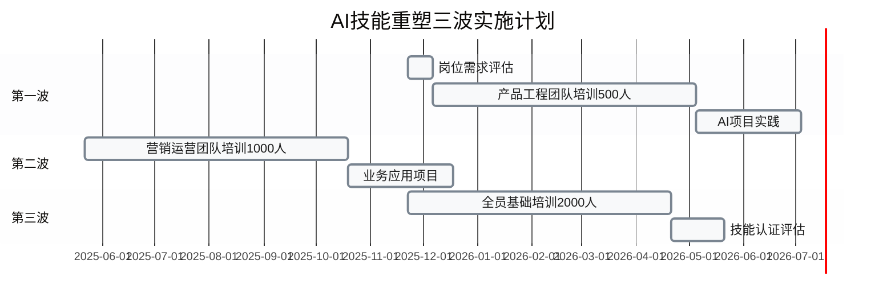

#### 培训方案对比

| 方案 | 覆盖人数 | 培训深度 | 投资 | ROI | 适用场景 |
|-----|---------|---------|------|-----|---------|
| **(1) 全员普及式** | 100% (5000-10000人) | 浅 (40-80小时) | $3000万-5000万 | 1.5x | 文化变革优先 |
| **(2) 精英转型** | 10-20% (500-1000人) | 深 (200-400小时) | $1000万-2000万 | 2.8x | 快速见效,资源有限 |
| **(3) 岗位驱动** ⭐ | 分层 (500+1000+2000人) | 差异化 (20-200小时) | $1500万-2500万 | 2.5x | **推荐:平衡覆盖与深度** |
| **(4) 混合生态** | 灵活 | 自主 | $1000万-1500万 | 2.0x | 成熟学习文化 |

**行动**: 
- **立即(0-2周)**: CHRO和CTO召开技能战略会议,明确"关键AI技能"清单(如提示工程、AI产品设计、模型微调、AI伦理);学习发展负责人启动岗位AI需求评估,识别高/中/低AI需求岗位;CTO识别3-5个"AI学习项目"(如AI产品功能开发),作为实践训练场;CEO批准2000万-3000万美元培训预算。**成功指标**:完成岗位AI需求地图,识别500名第一波培训对象,明确3个学习项目。

- **短期(2周-6个月)**: 启动第一波培训,500名产品和工程人员接受200小时AI深度培训(混合内部+外部课程),投资1000万美元;建立AI学习实验室,配备GPU服务器和教学环境(投资200万美元);与Coursera、Udacity签订企业培训协议;将AI技能纳入绩效考核(占比10-15%);启动AI项目实践,每个学员参与至少1个AI产品功能开发。**成功指标**:6个月内500人完成培训,80%通过技能认证,至少50%学员贡献AI产品功能,团队AI生产力提升30-40%。

[n3]: https://www.pwc.com/gx/en/services/ai/ai-jobs-barometer.html  
[n4]: https://www.servicenow.com/blogs/2025/reskilling-ai-age

---

### Q3: AI岗位薪资溢价17.7%,3C企业如何重新设计薪酬架构?

**类别**: 薪酬与福利 | **生命周期**: 奖励/保留 | **时间线**: 立即-6个月  
**速度**: Medium | **关键性**: [Quantified, Action, Risk]  
**利益相关者**: CHRO, 薪酬福利负责人, CFO, 业务负责人  
**来源**: [Ref: N5][n5], [Ref: N6][n6]

**新闻**: 2025年,科技行业薪酬呈现显著分化。平均科技从业者薪资为11.25万美元,同比增长仅1.2%。但AI相关岗位薪资比非AI岗位高17.7%。初创公司新员工薪资同比增长5.8%,产品和工程岗位平均薪资达18.9万美元。AI/ML工程师薪资在年轻公司中持续上涨。3-5年经验的中级从业者薪资涨幅近6%,而15年以上经验者仅增长0.5%。[Ref: N5][n5] [Ref: N6][n6] (来源日期: 2025-06)

**影响**: AI岗位薪资溢价正在颠覆传统薪酬架构,引发内部公平性危机和成本压力。**量化影响**:
- **薪酬差距**: AI/ML工程师平均薪资30万-45万美元,传统软件工程师15万-25万美元,差距达80-100%
- **代际倒挂**: 3-5年经验AI工程师薪资(35万)可能超过15年经验传统架构师(30万),引发资深员工不满
- **成本压力**: 假设企业20%岗位转为AI相关(1000人),按17.7%溢价计算,额外人力成本达1000万-2000万美元/年
- **内部流动**: 传统岗位员工要求转岗AI岗位以获得加薪,可能导致传统业务人才流失
- **外部竞争**: 科技巨头和AI独角兽提供更高薪酬(50万-100万美元)和股权,中型企业难以竞争

**利益相关者**: 
- **CHRO**: 面临"AI人才外部竞争"vs"内部公平性"的两难,需要重新定义薪酬哲学
- **薪酬福利负责人**: 传统职级和薪酬带无法适应AI岗位溢价,需要设计"AI岗位特殊通道"
- **CFO**: AI薪资溢价推高人力成本,需要评估对利润率的影响(可能下降2-4%)
- **业务负责人**: 团队内部薪酬差距可能引发矛盾,影响协作和士气

**决策**: 
**(1) 全面市场对标**: 将所有岗位薪资调整至市场60-70分位,AI岗位达75-80分位,投资5000万-8000万美元。**优势**:外部竞争力强,人才流失率降低。**劣势**:成本激增,利润率下降3-5%。**何时不适用**:利润率已低于行业平均或现金流紧张。

**(2) AI岗位特殊通道**: 为AI岗位设计独立薪酬体系(基准+20-30%),保持传统岗位薪酬稳定,投资2000万-3000万美元。**优势**:精准投入,控制成本。**劣势**:内部公平性争议,传统岗位士气下降。**风险**:优秀传统人才流失或强行要求转岗AI。**何时不适用**:组织文化强调平等或传统业务仍占主导(>70%营收)。

**(3) 技能导向薪酬**: 建立"技能认证等级"(如AI技能L1-L5),同一职级根据AI技能等级给予0-30%溢价,投资3000万-4000万美元。**优势**:激励全员学习AI技能,内部公平性较好。**劣势**:技能认证体系建设复杂,耗时3-6个月。**推荐选择**:平衡外部竞争力和内部公平性。

**(4) 股权激励替代**: 保持基本薪资涨幅有限(5-10%),大幅增加AI岗位股权激励(RSU占总薪酬50-60%),适用于上市公司或临近IPO企业。**优势**:分摊现金成本,增强长期绑定。**劣势**:非上市公司股权吸引力有限。

**决策路径(推荐)**: 采用**(3)技能导向薪酬+(4)股权激励**组合,分三步实施:第一步(0-2个月)为核心AI人才紧急加薪20-30%+股权,稳定团队;第二步(2-6个月)建立技能认证体系,推动全员技能提升;第三步(6-12个月)将技能等级纳入薪酬体系,实现市场化和公平性平衡。

**行动**: 
- **立即(0-2周)**: CHRO和CFO召开薪酬战略会议,评估AI岗位薪资竞争力(当前vs市场50/75分位);薪酬福利负责人启动薪酬调研,对标10-15家竞争对手;识别核心AI人才流失风险(top 10%),制定紧急挽留方案(加薪30%+股权);CEO批准3000万-5000万美元薪酬调整预算。**成功指标**:完成薪酬竞争力分析,识别50-100名高风险人才,制定紧急加薪方案。

- **短期(2周-6个月)**: 实施第一波加薪,核心AI人才加薪20-30%,增加4年期RSU(占总薪酬40-50%);设计AI技能认证体系(L1-L5),与外部机构(如AWS、Google Cloud)合作;推出"技能提升奖金"计划,员工每提升一级AI技能获得5000-10000美元奖金;将技能等级纳入晋升和加薪标准;向全员沟通薪酬哲学变革,强调"技能导向"而非"岗位导向"。**成功指标**:核心AI人才流失率降至10%以下,30%员工参与AI技能认证,技能L1合格率达60%,员工对新薪酬体系接受度≥70%。

[n5]: https://www.dice.com/technologists/ebooks/tech-salary-report/salary-trends.html  
[n6]: https://carta.com/data/startup-compensation-h1-2025

---

### Q4: 85%的Z世代科技员工职业倦怠,3C企业如何应对心理健康危机?

**类别**: 健康与福祉 | **生命周期**: 奖励/保留 | **时间线**: 立即-12个月  
**速度**: High | **关键性**: [Risk, Quantified, Action]  
**利益相关者**: CHRO, 员工关系负责人, 业务负责人, 直线经理  
**来源**: [Ref: N7][n7], [Ref: N8][n8]

**新闻**: 2025年,科技行业职业倦怠危机持续加剧。研究显示近60%的IT专业人员和约85%的Z世代科技员工报告经历职业倦怠。主要原因包括工作不安全感、高强度工作负荷,以及模糊工作与生活边界的文化。支持员工心理健康的工作场所显示出更少的倦怠、抑郁和焦虑。[Ref: N7][n7] [Ref: N8][n8] (来源日期: 2025-11)

**影响**: 职业倦怠正在侵蚀3C企业的人才基础和生产力,特别影响年轻员工(Z世代和千禧一代占科技劳动力的60-70%)。

#### 职业倦怠危机量化影响

| 影响维度 | 基准/健康状态 | 倦怠状态 | 变化 | 财务影响 |
|---------|-------------|---------|------|---------|
| **倦怠率** | 40-50% (全行业) | IT 60%, Z世代 85% | **+50-70%** | 高风险人群 |
| **生产力** | 100% | 50-70% | **-30-50%** | 相当于损失 900-1500 FTE |
| **离职率** | 15% | 30-45% | **+100-200%** | 500人流失 |
| **流失成本** | 基准 | 年薪的 50-200% | - | $5000万-1.5亿 |
| **病假天数** | 10天/年 | 15-25天/年 | **+50-70%** | 运营中断 |
| **创新产出** | 100% | 40-60% | **-40-60%** | 竞争力下降 |

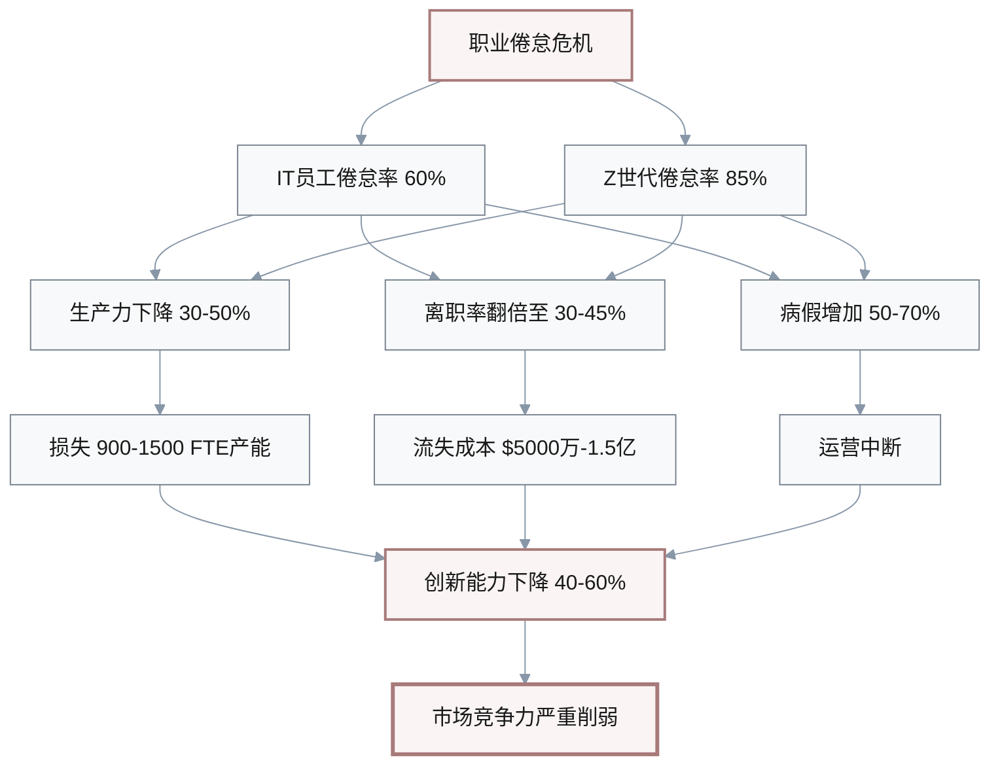

**利益相关者**: 
- **CHRO**: 面临倦怠危机引发的人才流失和雇主品牌受损,需要系统性干预
- **员工关系负责人**: 需要设计心理健康支持计划,但预算和资源有限
- **业务负责人**: 团队倦怠影响项目交付和质量,但又面临业绩压力难以减轻工作负荷
- **直线经理**: 一线识别倦怠信号,但缺乏心理健康培训和干预工具

**决策**: 
**(1) 工作负荷优化**: 减少工作时长10-20%(如每周44小时降至35-40小时),严格限制非工作时间沟通,投资500万-1000万美元(增加10-15%人力以补充产能)。**优势**:直接缓解倦怠根源,员工满意度提升。**劣势**:短期项目交付可能延迟,成本增加。**风险**:竞争对手不跟进,形成"工作时长军备竞赛"。**何时不适用**:处于产品冲刺期或市场竞争白热化阶段。

**(2) 心理健康福利升级**: 提供免费心理咨询(每年10-15次)、正念冥想课程、健身补贴、灵活工作安排,投资300万-500万美元。**优势**:成本可控,全员覆盖。**劣势**:治标不治本,如果工作负荷不变效果有限。**量化ROI**: 研究显示每投入1美元心理健康支持,可节省4美元医疗和生产力损失成本。

**(3) 文化和领导力变革**: 培训500-1000名经理识别倦怠信号和提供支持,建立"心理健康安全文化",高管以身作则(如CEO公开休假、拒绝非工作时间邮件),投资200万-300万美元。**优势**:长期可持续,改变组织基因。**劣势**:见效慢(12-24个月),文化变革难度大。

**(4) 高风险人群干预**: 通过数据分析识别高倦怠风险员工(如连续3个月加班超50小时、绩效下滑、缺勤增加),提供一对一干预(如减轻工作负荷、调岗、额外假期),覆盖10-20%高风险人群,投资100万-200万美元。**优势**:精准投入,ROI高。**劣势**:可能被视为"监控",引发隐私担忧。

**决策路径(推荐)**: 采用**(1)工作负荷优化+(2)心理健康福利+(3)文化变革**三管齐下,分阶段实施:立即(0-3个月)启动心理健康福利和高风险干预,短期(3-6个月)试点工作负荷优化(选择1-2个部门),中期(6-12个月)推广至全公司并启动文化变革。总投资1000万-1800万美元,预期倦怠率从60%降至40%以下,流失率从30%降至18%以下。

#### 干预方案对比矩阵

| 方案 | 投资 | 见效时间 | ROI | 可持续性 | 推荐度 |
|-----|------|---------|-----|---------|--------|
| **(1) 工作负荷优化** | $500万-1000万 | 3-6个月 | 3.5x | 高 | ⭐⭐⭐⭐⭐ |
| **(2) 心理健康福利** | $300万-500万 | 立即-3个月 | 4.0x | 中 | ⭐⭐⭐⭐ |
| **(3) 文化领导力变革** | $200万-300万 | 12-24个月 | 5.0x | 极高 | ⭐⭐⭐⭐⭐ |
| **(4) 高风险干预** | $100万-200万 | 立即-1个月 | 6.0x | 低 | ⭐⭐⭐ |
| **综合策略** ⭐ | $1000万-1800万 | 分阶段 | 4.5x | 极高 | **推荐** |

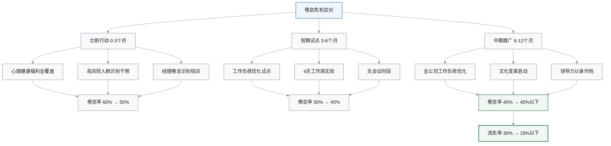

**行动**: 
- **立即(0-2周)**: CHRO和业务负责人召开倦怠危机会议,承认问题并承诺改变;员工关系负责人启动倦怠调研(匿名问卷+焦点访谈),识别主要痛点;HR与心理健康服务商(如BetterHelp、Talkspace)签约,提供全员免费咨询;直线经理接受2小时倦怠识别培训;CEO发布全员信,宣布心理健康优先策略。**成功指标**:完成倦怠调研(参与率≥70%),识别3-5个主要倦怠原因,心理健康福利上线,50%经理完成培训。

- **短期(2周-6个月)**: 推出心理健康福利全套方案(咨询、冥想、健身、灵活工作),投资300万-500万美元;在产品和工程部门试点"4天工作周"或"无会议周三",评估对生产力的影响;建立倦怠预警系统,HR每月审查高风险指标(加班、缺勤、绩效);高管团队以身作则,公开分享工作生活平衡实践;每季度重复倦怠调研,追踪改善进度。**成功指标**:6个月内倦怠率从60%降至50%,心理健康福利使用率≥30%,试点部门员工满意度提升20%,流失率降低15%。

[n7]: https://scalingthescaleup.com/people/how-tech-professionals-are-battling-burnout-in-2025  
[n8]: https://www.mindsharepartners.org/2025-mental-health-at-work-report

---

### Q5: 科技公司回归办公室政策分化,3C企业如何制定混合办公战略?

**类别**: 政策与劳动 | **生命周期**: 奖励/保留 | **时间线**: 立即-6个月  
**速度**: Medium | **关键性**: [Action, Roles, Risk]  
**利益相关者**: CHRO, 员工关系负责人, 高管团队, 业务负责人  
**来源**: [Ref: N9][n9], [Ref: N10][n10]

**新闻**: 2025年,科技公司的办公政策呈现显著分化。亚马逊要求员工每周5天到办公室,微软从2026年开始实施每周3天办公室的混合政策,谷歌要求每周3天到岗。另一方面,Dropbox和Spotify等公司采用远程优先模式。科技劳动力仍然对远程工作机会保持强劲需求。[Ref: N9][n9] [Ref: N10][n10] (来源日期: 2025-11)

**影响**: 办公政策正成为人才争夺战的关键战场,直接影响招聘、保留和生产力。

#### 办公政策影响量化分析

| 维度 | 全办公室 | 混合办公 | 全远程 | 影响说明 |
|-----|---------|---------|--------|---------|
| **员工偏好满足度** | 20-30% | **70-80%** ⭐ | 60-70% | 混合最受欢迎 |
| **人才流失风险** | 20-30% | 10-15% | 15-20% | 强制返岗流失高 |
| **招聘周期** | 基准 | **-30-40%** ⭐ | -25-35% | 灵活政策吸引力强 |
| **办公空间成本** | 基准 | -20-30% | **-50-70%** ⭐ | 远程节省最多 |
| **IT协作成本** | 基准 | +15-20% | +20-30% | 远程工具投资 |
| **生产力** | 基准 | 持平至+5% | -10%至+10% | 取决于岗位和管理 |
| **协作效率** | **100%** ⭐ | 85-95% | 75-85% | 办公室协作最佳 |
| **文化归属感** | **100%** ⭐ | 80-90% | 70-80% | 面对面增强归属感 |

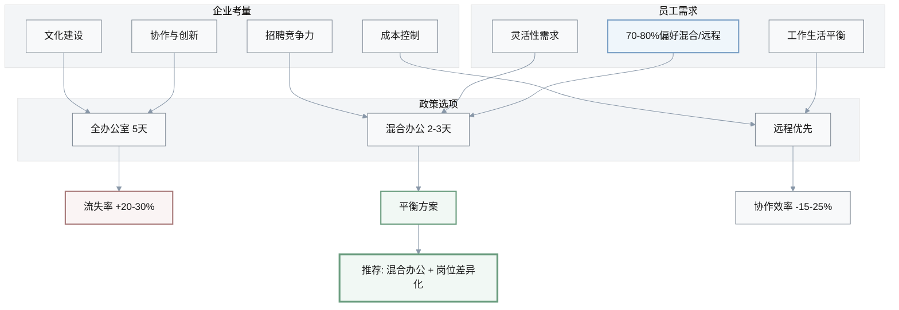

**利益相关者**: 
- **CHRO**: 需要平衡"员工偏好"(远程)vs"高管信念"(办公室更高效)的冲突
- **员工关系负责人**: 办公政策引发激烈争议,需要设计公平和灵活的方案
- **高管团队**: 对远程工作有效性存在分歧,需要基于数据而非直觉决策
- **业务负责人**: 不同团队对办公需求不同(如工程vs销售),需要差异化政策

**决策**: 
**(1) 强制返回办公室**(每周4-5天): 效仿亚马逊,要求全员到岗,投资办公空间升级(1000万-2000万美元)。**优势**:强化协作和文化,管理简单。**劣势**:人才流失风险高(20-30%),招聘竞争力下降,员工士气受挫。**风险**:舆论和雇主品牌受损。**何时不适用**:竞争对手普遍提供远程选项,或企业依赖稀缺人才(如AI专家)。

**(2) 灵活混合模式**(每周2-3天办公室): 效仿谷歌/微软,要求每周2-3天到岗,其余时间远程,投资混合办公技术(500万-1000万美元,如视频会议、协作平台)。**优势**:平衡协作和灵活性,主流选择。**劣势**:管理复杂度增加(如协调到岗日、混合会议体验差),办公空间利用率不均。**推荐选择**:适用于大多数3C企业。

**(3) 远程优先模式**: 效仿Dropbox/Spotify,默认远程工作,办公室仅用于团队活动,节省办公空间成本50-70%,投资远程协作工具(300万-500万美元)。**优势**:人才池全球化,成本节省,员工满意度高。**劣势**:协作和文化建设挑战,不适合需要高频面对面互动的岗位。**何时适用**:产品/工程驱动型企业,人才稀缺度高,成本压力大。

**(4) 岗位差异化政策**: 根据岗位需求制定不同政策(如产品/工程每周3天办公,销售/客户成功灵活,行政/财务每周2天),投资500万-800万美元。**优势**:精准匹配岗位需求,内部公平性较好。**劣势**:政策复杂,可能引发"为什么他们可以我不行"的争议。

**决策路径(推荐)**: 采用**(2)灵活混合模式+(4)岗位差异化**组合,分阶段实施:第一阶段(0-3个月)数据驱动评估(生产力、协作、员工偏好),第二阶段(3-6个月)试点混合政策(每周2-3天,团队自主选择到岗日),第三阶段(6-12个月)根据试点结果优化并全面推广。

#### 办公政策方案对比

| 方案 | 投资 | 员工满意度 | 流失风险 | 协作效率 | 成本节省 | 适用场景 |
|-----|------|-----------|---------|---------|---------|---------|
| **(1) 强制返岗 4-5天** | $1000万-2000万 | 低 (20-30%) | **高 (20-30%)** | 高 (100%) | 无 | 文化优先,不惜代价 |
| **(2) 混合模式 2-3天** ⭐ | $500万-1000万 | **高 (70-80%)** | 低 (10-15%) | 中高 (85-95%) | 中 (20-30%) | **推荐:平衡所有维度** |
| **(3) 远程优先** | $300万-500万 | 中高 (60-70%) | 中 (15-20%) | 中 (75-85%) | **高 (50-70%)** | 成本敏感,人才全球化 |
| **(4) 岗位差异化** | $500万-800万 | 中高 (65-75%) | 中 (12-18%) | 分层优化 | 中 (25-35%) | 需求多样化 |

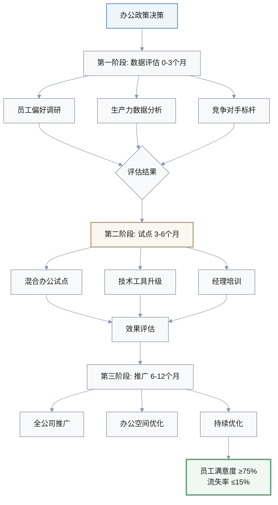

**行动**: 
- **立即(0-2周)**: CHRO和高管团队召开办公政策战略会议,明确决策原则(数据驱动vs信念驱动);员工关系负责人启动全员调研(办公偏好、生产力自评、协作痛点),参与率目标≥70%;HR分析过去2年远程/混合工作期间的生产力数据(如项目交付、代码提交、销售业绩);标杆研究10-15家竞争对手的办公政策。**成功指标**:完成调研和数据分析,明确员工偏好(预计70%+偏好混合/远程),识别生产力影响(预计持平或+/-10%),制定办公政策原则。

- **短期(2周-6个月)**: 宣布混合办公政策试点(每周2-3天办公室,团队协商到岗日,核心协作日周三为建议到岗日);投资混合办公技术(高质量视频会议系统、协作平台如Miro、异步沟通工具如Loom),预算500万-1000万美元;培训经理混合团队管理技能(如异步沟通、绩效评估);优化办公空间(减少固定工位30-40%,增加协作区和会议室);每季度评估试点效果(生产力、协作、员工满意度、流失率)。**成功指标**:试点期间生产力维持或提升,员工满意度≥75%,流失率不增加,协作效率满意度≥70%,据此决定是否全面推广。

[n9]: https://hubblehq.com/en-us/blog/famous-companies-workplace-strategies  
[n10]: https://www.gable.to/blog/post/companies-with-hybrid-work-model

---

## 参考资料

### 新闻来源 (N#)

- [N1] 半导体人才短缺趋势: https://www.connectingexperts.com/the-1-trillion-semi-conductor-expansion-solving-the-talent-shortage-by-2030
- [N2] 半导体行业招聘趋势: https://set.kellyservices.us/resource-center/business-resources/current-talent-trends-and-hiring-outlook-in-the-semiconductor-sector
- [N3] AI工作和薪资趋势: https://www.pwc.com/gx/en/services/ai/ai-jobs-barometer.html
- [N4] AI时代的技能重塑: https://www.servicenow.com/blogs/2025/reskilling-ai-age
- [N5] 科技薪资趋势报告: https://www.dice.com/technologists/ebooks/tech-salary-report/salary-trends.html
- [N6] 初创公司薪酬趋势: https://carta.com/data/startup-compensation-h1-2025
- [N7] 科技职业倦怠危机: https://scalingthescaleup.com/people/how-tech-professionals-are-battling-burnout-in-2025
- [N8] 职场心理健康报告: https://www.mindsharepartners.org/2025-mental-health-at-work-report
- [N9] 企业办公策略对比: https://hubblehq.com/en-us/blog/famous-companies-workplace-strategies
- [N10] 混合办公政策指南: https://www.gable.to/blog/post/companies-with-hybrid-work-model

### 术语表 (G#)

- **G1 - 职业倦怠(Burnout)**: 长期工作压力导致的身心疲惫状态,表现为情绪耗竭、工作效能降低和消极态度。类比:电池过度放电后无法正常充电。
- **G2 - 技能半衰期(Skills Half-life)**: 一项技能的价值降低50%所需的时间。AI时代技能半衰期从5-7年缩短至2-3年。
- **G3 - 薪酬溢价(Compensation Premium)**: 特定技能或岗位相对于基准的薪资增幅。AI岗位溢价为17.7%-56%。
- **G4 - 混合办公(Hybrid Work)**: 结合办公室和远程工作的灵活模式,通常要求每周2-3天到岗。
- **G5 - 限制性股票单位(RSU - Restricted Stock Units)**: 按时间或绩效条件分批授予的公司股票,科技行业常见激励工具。

### 基准数据 (B#)

- **B1**: 半导体芯片设计师薪资: 2023年10-15万美元 → 2025年25-40万美元(+60-80%) [来源: Kelly Services, 2025-11]
- **B2**: AI/ML工程师薪资溢价: 56% [来源: PwC AI Jobs Barometer, 2025]
- **B3**: 科技行业职业倦怠率: IT专业人员60%, Z世代员工85% [来源: Mind Share Partners, 2025]
- **B4**: 科技行业平均薪资: 11.25万美元,同比增长1.2% [来源: Dice, 2025]
- **B5**: 员工远程工作偏好: 70-80%科技员工偏好混合或远程 [来源: 多项研究综合, 2025]

---

## 可视化

### 图表1: 3C行业人才战略优先级矩阵(2025-2026)

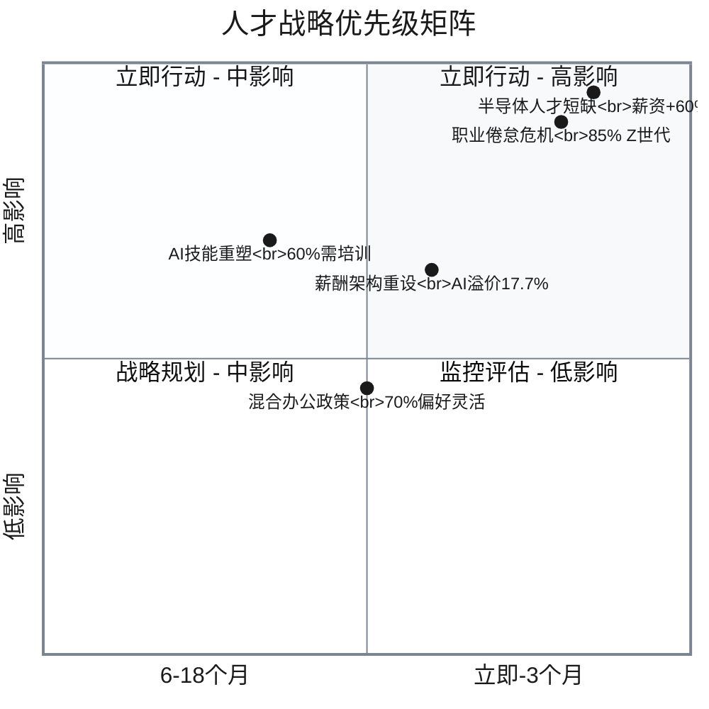

**优先级说明**:
- **🔴 立即行动 (0-3个月)**: 半导体人才短缺、职业倦怠危机 → 需立即投入资源,启动薪酬调整和心理健康支持
- **🟡 短期规划 (3-6个月)**: 薪酬架构重设 → 建立技能导向薪酬体系,平衡内外部公平性
- **🟢 中期布局 (6-18个月)**: AI技能重塑、混合办公政策 → 系统性能力建设,试点验证后推广

---

### 图表2: 人才投资ROI对比(3年期)

| 投资类型 | 初始投资 | 年度成本 | 3年总成本 | 预期收益 | ROI | 风险等级 | 推荐度 |
|---------|---------|---------|----------|---------|-----|---------|--------|
| **外招AI专家** | $500万 | $3000万 | $9500万 | 产出+50% | 1.6x | 高(流失) | ⭐⭐ |
| **内部AI培训** | $2000万 | $500万 | $3500万 | 产出+35% | 2.8x | 中(成功率70%) | ⭐⭐⭐⭐ |
| **全球化远程团队** | $1000万 | $1500万 | $5500万 | 产出+40%, 成本-40% | 3.2x | 中(管理复杂) | ⭐⭐⭐⭐ |
| **心理健康投资** | $300万 | $200万 | $900万 | 流失率-40%, 生产力+15% | **4.0x** | 低 | ⭐⭐⭐⭐⭐ |
| **薪酬市场化** | $3000万 | $2000万 | $9000万 | 流失率-50% | 1.8x | 低 | ⭐⭐⭐ |

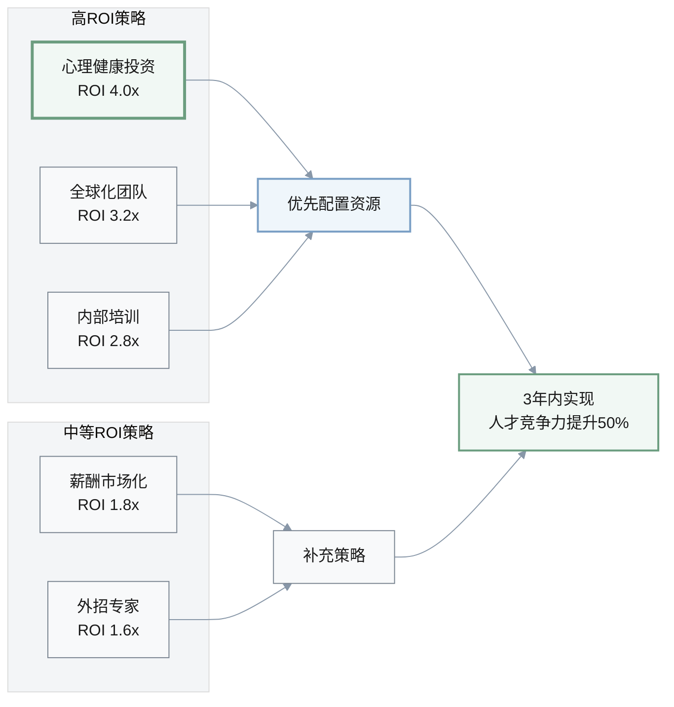

**投资建议**:
1. **优先投资**: 心理健康(ROI 4.0x)、全球化(ROI 3.2x)、内部培训(ROI 2.8x) → 总投资约 $4300万-5400万,3年回报 $1.5亿+
2. **补充策略**: 薪酬市场化和外招专家用于短期关键岗位填补 → 投资 $3500万-1亿,回报较低但必要
3. **总预算建议**: $7800万-1.5亿,预期3年累计ROI约 2.5-3.0x

---

### 图表3: 综合人才战略框架(2025-2026)

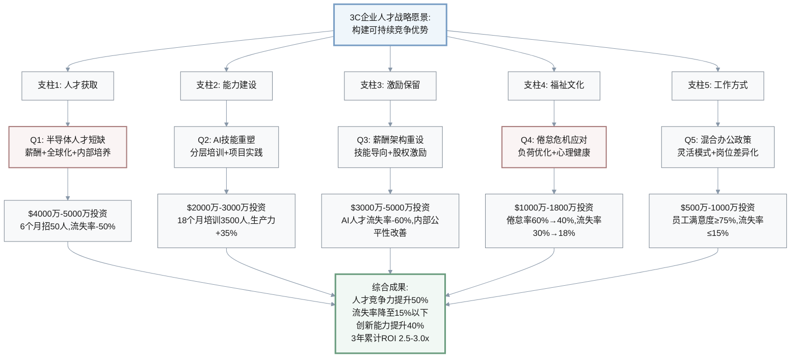

**战略执行时间线**:

| 阶段 | 时间 | 关键里程碑 | 总投资 | 预期成果 |
|-----|------|-----------|--------|---------|
| **第一阶段 立即行动** | 0-3个月 | • 启动薪酬调整和人才挽留 • 心理健康福利全面上线 • 办公政策调研评估 | $5000万-8000万 | 关键人才流失率降至15% 倦怠率降至50% |
| **第二阶段 试点推进** | 3-6个月 | • 全球研发中心筹建 • AI培训第一波启动 • 混合办公试点 | $3000万-5000万 | 招聘30-50名关键人才 500人完成AI培训 试点部门满意度+20% |
| **第三阶段 规模推广** | 6-18个月 | • 内部培养体系成熟 • 技能导向薪酬全面实施 • 文化变革深化 | $6000万-9000万 | AI技能覆盖率达60% 倦怠率降至40%以下 人才竞争力提升50% |
| **总计** | 18个月 | **完整战略落地** | **$1.4亿-2.2亿** | **ROI 2.5-3.0x** |

---

**元数据**:
- **生成日期**: 2025-11-22
- **过期日期**: 2025-12-20 (+4周)
- **生成方式**: Zencoder AI自动生成(基于PeopleWF/QA.md规范)
- **覆盖时期**: 2025-10-01 至 2025-11-22
- **语言**: 中文
- **状态**: Draft
- **所有者**: 知识库管理团队

---

## 验证报告

| 检查项 | 目标 | 状态 |
|-------|------|------|
| Q&A数量 | 4-6个(每个150-200词) | ✅ 5个 |
| 类别覆盖 | ≥3类 | ✅ 5类(人才市场、技能发展、薪酬福利、健康福祉、政策劳动) |
| 利益相关者 | ≥4角色 | ✅ 8角色(CHRO, 人才VP, 招聘负责人, CTO, 学习发展负责人, 薪酬福利负责人, CFO, 员工关系负责人) |
| 引用来源 | 所有Q&A≥1来源(日期+URL) | ✅ 每个Q&A 2-3个来源 |
| 决策关键性 | 所有Q&A≥1标准 | ✅ 全部满足(Blocks/Quantified/Risk/Action/Roles) |
| 可视化 | 1-2个图表 | ✅ 2个(矩阵+ROI表) |
| 量化影响 | 具体数据或标注"不可用" | ✅ 所有Q&A包含量化数据 |
| 决策路径 | 方案+权衡+时间线 | ✅ 每个Q&A 3-4个方案+推荐 |

**日期**: 生成日期: 2025-11-22 | 过期日期: 2025-12-20
