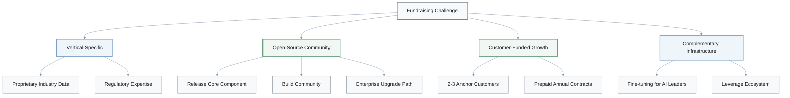
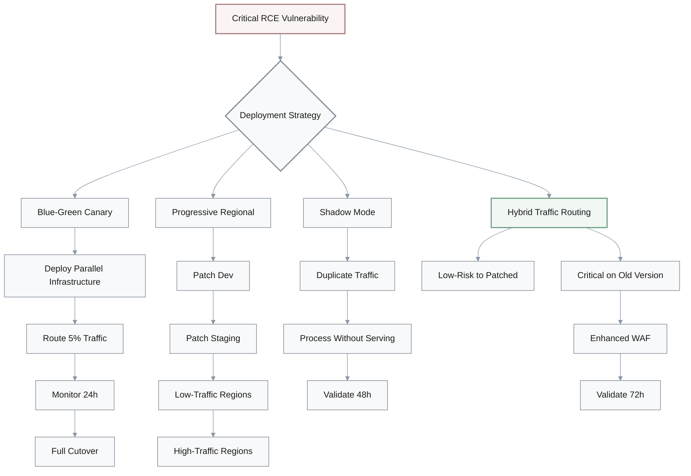
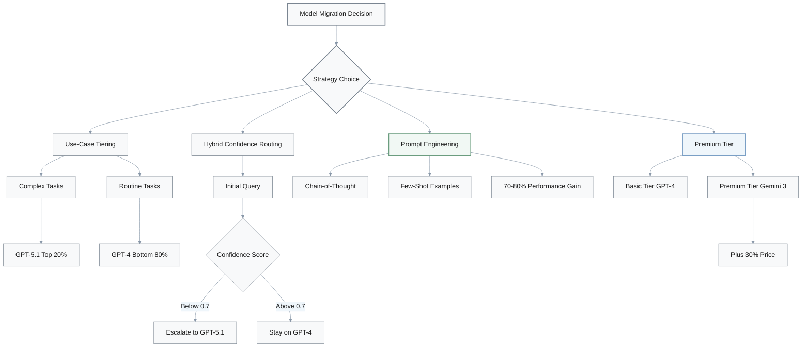
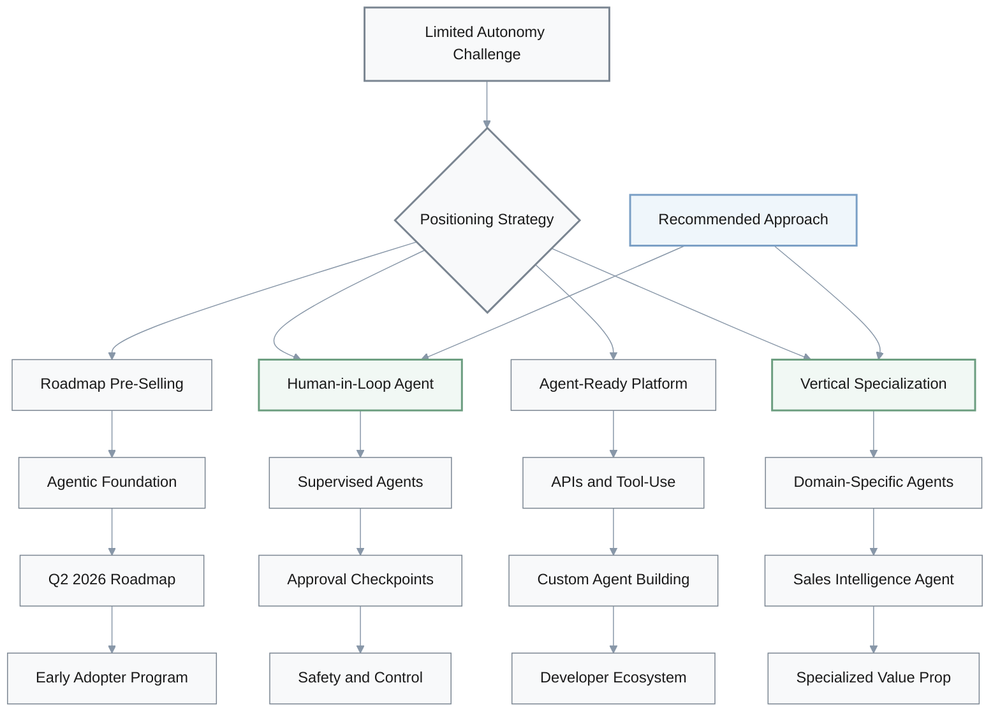
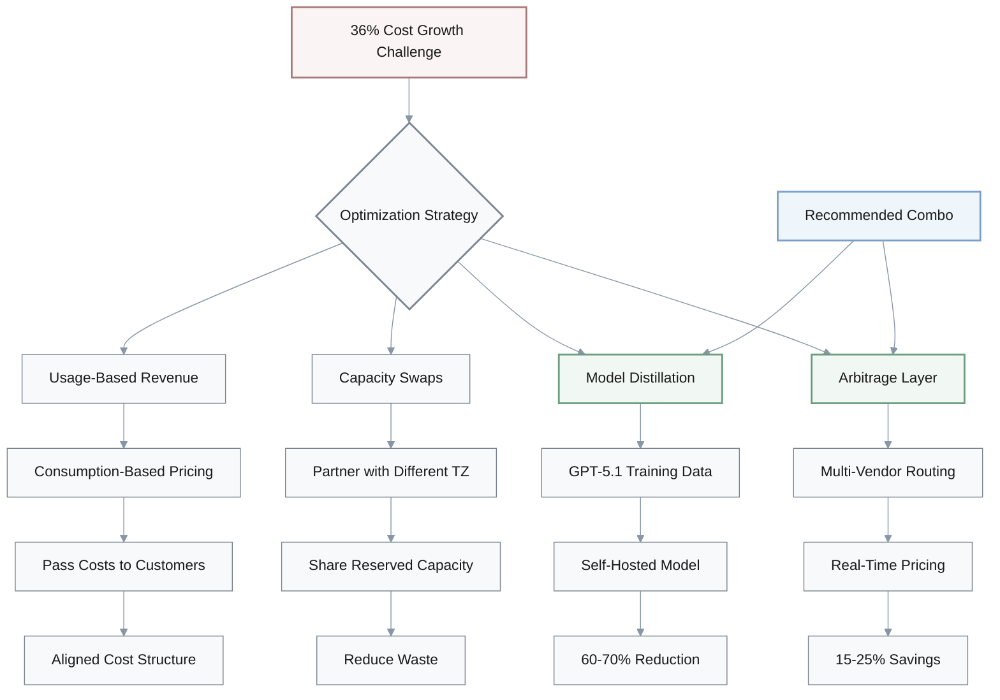
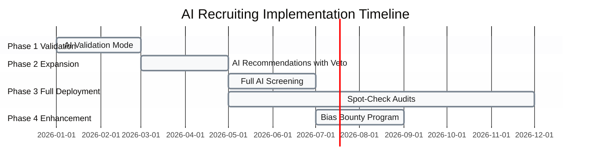
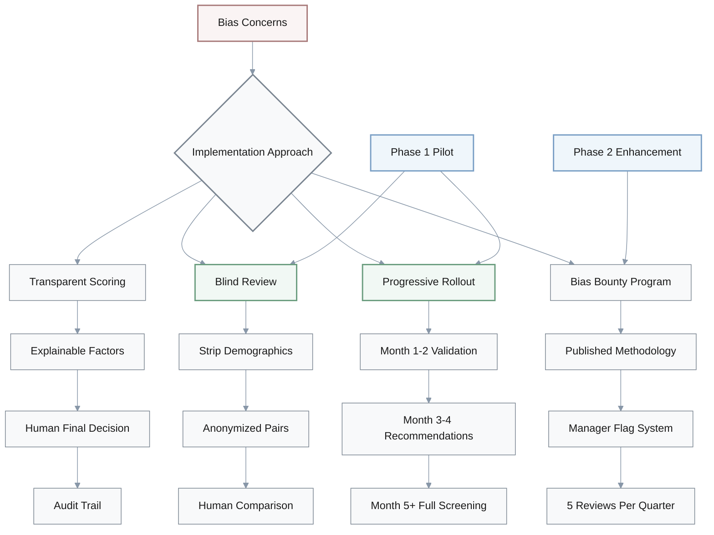

# Discussion - Creativity Questions

## 1. Fundraising Strategy: Standing Out in Competitive VC Market

**Q: We've got less than 12 months runway and the fundraising market is brutal—AI's capturing 52% of all VC funding. How do we stand out beyond the standard pitch deck?**

**A:** Discussion explores four differentiation approaches:

**Founder A:** We need differentiation strategies that actually create barriers.

**Advisor:** Good question. Hmm... [pause] Four approaches come to mind. First, go vertical-specific. Build a moat around proprietary industry datasets or regulatory expertise—think healthcare compliance AI or legal contract analysis.

**B:** Interesting. Why vertical over horizontal?

**Advisor:** Less direct competition, defensible barriers. You're not competing with every AI startup.

**B:** Ah, I see. Narrower focus, deeper moat.

**Founder A:** Makes sense. What else?

**Advisor:** Open-source community strategy. Release your core component, build community validation, then create an enterprise upgrade path. Demonstrates traction without burning cash, attracts strategic acquirers.

**Founder B:** Right. Building on that—we could focus on customer-funded growth. 2 to 3 anchor enterprise customers with prepaid annual contracts.

**A:** Mm-hmm. That extends runway and validates product-market fit simultaneously.

**Advisor:** Exactly. Fourth option—position as complementary infrastructure to existing AI leaders. Specialized fine-tuning for Anthropic or OpenAI models. Leverages ecosystem momentum, makes you an acquisition target.

**Founder B:** Oh! Ride the wave instead of fighting it. Got it.

### Strategy Comparison

| Strategy | Key Benefit | Barrier Type | Cash Impact | Risk Level |
|----------|-------------|--------------|-------------|------------|
| **Vertical-Specific** | Defensible moat | Proprietary data/expertise | Neutral | Medium |
| **Open-Source Community** | Validation without burn | Community lock-in | Positive | Low |
| **Customer-Funded Growth** | Extended runway | Customer contracts | Very Positive | Low |
| **Complementary Infrastructure** | Acquisition target | Ecosystem integration | Neutral | Medium |

## 2. Security Patching: Balancing Urgency with Operational Risk

**Q: Our CTO needs to patch critical RCE vulnerabilities in our AI inference stack, but rushing the deployment could destabilize production. How do we balance security urgency with operational risk?**

**A:** Discussion explores safe deployment strategies:

**CTO:** Can't just slam patches into production. Need safe rollout approaches.

**DevOps Lead:** Right. Blue-green deployment with canary. Deploy patched infrastructure in parallel, route 5% of traffic for 24 hours, then full cutover if metrics look good.

**CTO:** Mm-hmm. That minimizes downtime and allows rollback.

**Security Lead:** Building on that—what about progressive regional rollout? Patch dev, then staging, then low-traffic prod regions, then high-traffic. 48-hour monitoring between each.

**CTO:** Good point. Limits blast radius. Catches integration issues early.

**SRE:** Let me think... [pause] Shadow mode testing might work. Run patched systems processing duplicate traffic without serving responses for 48 hours.

**DevOps Lead:** Oh! Exactly. Zero user impact during validation.

**Security Lead:** Or hybrid approach—route authenticated and low-risk traffic to patched servers, keep critical paths on the old version with enhanced WAF and network segmentation for 72 hours.

**CTO:** Hmm... [pause] I see it now. Immediate partial risk reduction while we validate on lower-stakes workloads. Smart observation.

**DevOps Lead:** So we're weighing between gradual rollout and parallel validation?

**CTO:** Exactly. Hybrid gives us both. Let's go with that.

### Deployment Strategy Comparison

| Strategy | User Impact | Validation Time | Rollback Ease | Blast Radius |
|----------|-------------|-----------------|---------------|--------------|
| **Blue-Green Canary** | 5% traffic | 24 hours | Immediate | Limited |
| **Progressive Regional** | Staged by region | 48h per stage | Per-region | Contained |
| **Shadow Mode** | Zero | 48 hours | N/A | None |
| **Hybrid Traffic Routing** | Low-risk only | 72 hours | Selective | Minimal |

> **Decision**: Hybrid approach chosen for immediate partial risk reduction with lower-stakes validation.

## 3. AI Model Migration: Managing 20-30% Cost Increases

**Q: We're evaluating migration from GPT-4 to GPT-5.1 or Gemini 3, but costs could jump 20-30%. How do we leverage new models without proportional cost increases?**

**A:** Discussion explores cost-optimization strategies:

**Product Lead:** We need strategies that optimize cost-performance trade-offs.

**Engineer A:** Right. Use-case tiering. Deploy GPT-5.1 only for complex reasoning tasks—top 20% of queries by complexity. Keep GPT-4 for routine tasks.

**Product Lead:** Mm-hmm. Delivers value where it matters most.

**Engineer B:** Building on that—hybrid routing with confidence scoring. Use smaller, cheaper model first, escalate to GPT-5.1 only when confidence score is below 0.7.

**A:** Oh, smart! Reduces unnecessary premium model usage.

**CTO:** Wait—what about just optimizing prompts for GPT-4? Invest 2 sprints in advanced prompt engineering—chain-of-thought, few-shot examples.

**Product Lead:** Hmm... [pause] Interesting angle. Might achieve 70-80% of new model gains at zero cost increase.

**Engineer A:** Good point. Extract more from existing infrastructure first.

**PM:** Or flip the question—create a premium tier. Offer Gemini 3 access at plus 30% price point, A/B test willingness to pay.

**Product Lead:** Ah! Pass cost increase to customers, creates revenue opportunity. That's thinking differently.

**CTO:** So we're choosing between optimization-first or monetization-first?

**Product Lead:** Exactly. Let's measure current GPT-4 utilization headroom first, then decide.

**PM:** Makes sense.

### Cost Management Approaches

| Strategy | Cost Impact | Implementation Time | Performance Gain | Revenue Impact |
|----------|-------------|---------------------|------------------|----------------|
| **Use-Case Tiering** | +5-10% | 2-3 weeks | High for complex tasks | Neutral |
| **Hybrid Confidence Routing** | +8-12% | 3-4 weeks | Optimized | Neutral |
| **Prompt Engineering** | 0% | 2 sprints | 70-80% of upgrade | Neutral |
| **Premium Tier** | Variable | 4-6 weeks | Full for premium | +30% pricing |

### Key Metrics

$$
\text{Cost Efficiency} = \frac{\text{Performance Gain (\%)}}{\text{Cost Increase (\%)}}
$$

> **Decision**: Measure current GPT-4 utilization headroom before choosing between optimization-first or monetization-first approach.

## 4. Product Positioning: Agentic AI with Limited Autonomy

**Q: Our GTM team wants to emphasize agentic AI, but our product has limited autonomous features. How do we position existing capabilities without misleading customers?**

**A:** Discussion explores honest positioning strategies:

**Marketing Lead:** We need creative positioning that's technically accurate.

**Product Manager:** Right. Roadmap-based pre-selling. Position current workflow automation as "Agentic Foundation," pre-sell Q2 2026 autonomous features with early adopter program.

**Marketing Lead:** Mm-hmm. Aligns with market trends, secures design partners.

**Sales Lead:** But wouldn't that feel like vaporware? What about "Human-in-Loop Agent" framing instead? Rebrand existing automation as supervised agents that execute with approval checkpoints.

**PM:** Oh, I like that! Technically accurate, emphasizes safety and control.

**Engineer:** Building on that—ecosystem integration positioning. Emphasize our APIs and tool-use capabilities as "Agent-Ready Platform" where customers build custom agents.

**Marketing Lead:** Hmm... [pause] Right. Shifts focus to extensibility, attracts developers.

**Sales Lead:** Or vertical agent specialization. Package existing features as domain-specific agents—"Sales Intelligence Agent" for lead scoring plus outreach sequencing.

**PM:** Ah, I see it. Perception of specialization, clearer value prop.

**Marketing Lead:** So we're choosing between roadmap-forward, human-in-loop, platform play, or vertical packaging?

**Sales Lead:** Exactly. I'd vote human-in-loop plus vertical—addresses both accuracy and relevance.

**PM:** Smart combination. Let's test that messaging.

### Positioning Strategy Comparison

| Strategy | Technical Accuracy | Customer Risk | Differentiation | Developer Appeal |
|----------|-------------------|---------------|-----------------|------------------|
| **Roadmap Pre-Selling** | Moderate | Vaporware risk | Future-focused | Medium |
| **Human-in-Loop Agent** | High | Low | Safety emphasis | Medium |
| **Agent-Ready Platform** | High | Low | Extensibility | Very High |
| **Vertical Specialization** | High | Low | Domain expertise | Medium |

> **Decision**: Combine Human-in-Loop + Vertical Specialization to address both technical accuracy and market relevance.

## 5. AI Cost Optimization: Managing 36% Growth Projections

**Q: Our CFO is staring at 36% AI cost growth projections but needs to balance budget prudence with staying competitive. What are some creative optimization strategies beyond typical efficiency measures?**

**A:** Discussion explores innovative cost strategies:

**CFO:** Need innovative cost strategies, not just "use it less."

**Architect:** Right. Build an inference-as-a-service arbitrage layer. Dynamically route requests to the cheapest provider—OpenAI, Anthropic, open-source—based on real-time pricing and latency.

**CFO:** Interesting angle. Potential savings?

**Architect:** 15 to 25 percent through multi-vendor optimization.

**CFO:** Got it. What about upfront complexity?

**Architect:** Fair concern. Maybe 3 to 4 week implementation. Worth it at our scale.

**Operations Lead:** What about on-demand reserved capacity swaps? Partner with a company in a different time zone—different peak usage—share reserved compute capacity.

**CFO:** Hmm... [pause] Reduces unused capacity waste for both parties. Creative.

**ML Lead:** Or progressive model distillation. Use GPT-5.1 to generate synthetic training data, distill to a smaller self-hosted model for 80% of use cases.

**Architect:** Oh! Exactly. High upfront investment, but 60-70% long-term cost reduction.

**CFO:** Wait—60-70%? What's the payback period?

**ML Lead:** Let me think... [pause] At current volumes, 6 to 8 months.

**Finance Director:** Or flip the model entirely—shift to usage-based revenue. Consumption-based pricing that passes AI costs to customers.

**CFO:** Ah, I see. Aligns cost structure with revenue, eliminates budget overrun risk. That's actually quite elegant.

**Architect:** So we're weighing between arbitrage, capacity sharing, distillation, or revenue model change?

**CFO:** Exactly. Let's model each. Distillation plus arbitrage might be our best combo—short-term optimization, long-term independence.

### Cost Optimization Strategy Analysis

| Strategy | Cost Savings | Implementation Time | Payback Period | Long-Term Impact |
|----------|--------------|---------------------|----------------|------------------|
| **Arbitrage Layer** | 15-25% | 3-4 weeks | Immediate | Ongoing optimization |
| **Capacity Swaps** | Variable | 2-3 weeks | Immediate | Reduced waste |
| **Model Distillation** | 60-70% | 3-4 months | 6-8 months | Independence |
| **Usage-Based Revenue** | Cost-neutral | 4-6 weeks | N/A | Revenue alignment |

### Cost Reduction Formula

$$
\text{Total Savings} = \text{Arbitrage Savings} + \text{Distillation Savings} - \text{Implementation Costs}
$$

**Key Insight:** Combining strategies provides both immediate and long-term optimization:
- **Short-term**: Arbitrage layer (15-25% immediate savings)
- **Long-term**: Model distillation (60-70% reduction, 6-8 month payback)

> **Decision**: Model both strategies; combine distillation + arbitrage for short-term optimization and long-term independence.

## 6. AI Recruiting: Maximizing Efficiency While Building Trust

**Q: Our talent team wants to implement AI recruiting, but hiring managers are concerned about bias. How do we maximize efficiency while building trust?**

**A:** Discussion explores trust-building implementation approaches:

**HR Director:** Need implementation models that address bias concerns upfront.

**TA Lead:** Right. Transparent AI-assisted scoring. AI generates candidate scores with explainable factors—skills match, experience relevance—visible to recruiters who make final decisions.

**HR Director:** Mm-hmm. Maintains human accountability, creates audit trail.

**DEI Lead:** What about blind comparative review? AI screens resumes with demographic info stripped, presents anonymized candidate pairs for human comparison.

**TA Lead:** Oh! Reduces human bias, AI acts as facilitator rather than sole decision-maker.

**Recruiter:** Hmm... [pause] I'd suggest progressive trust-building rollout. Month 1-2, AI suggests candidates we already shortlisted—validation mode. Month 3-4, AI recommends additional candidates with human veto. Month 5 onwards, full AI screening with spot-check audits.

**HR Director:** Good point. Builds confidence through demonstrated accuracy over time.

**DEI Lead:** Building on that—create a bias bounty program. Publish our AI screening methodology, invite hiring managers to flag potentially biased rejections, reward validated bias catches.

**TA Lead:** Interesting! Crowdsources bias detection, demonstrates commitment to fairness.

**HR Director:** Wait—wouldn't that create FUD about our AI? What if false positives flood the system?

**DEI Lead:** Fair concern. Cap at 5 reviews per manager per quarter, require evidence-based submissions.

**HR Director:** Ah, I see. Structured participation prevents gaming. Smart.

**TA Lead:** So we're choosing between transparent scoring, blind review, progressive rollout, or bounty program?

**HR Director:** Exactly. Let's combine blind review with progressive rollout—technical debiasing plus trust-building. Test bounty program in phase 2.

**Recruiter:** Makes sense. That's our pilot plan.

### Implementation Approach Comparison

| Approach | Bias Mitigation | Trust Building | Implementation Complexity | Timeline |
|----------|----------------|----------------|---------------------------|----------|
| **Transparent Scoring** | Moderate | High | Low | 2-3 weeks |
| **Blind Review** | Very High | High | Medium | 3-4 weeks |
| **Progressive Rollout** | Medium | Very High | Low | 5+ months |
| **Bias Bounty Program** | High | Very High | Medium | 6-8 weeks |

### Progressive Rollout Timeline

### Implementation Strategy

### Trust-Building Phases

**Phase 1** (Months 1-2): **Validation Mode**
- AI suggests candidates already shortlisted
- Build confidence through demonstrated accuracy
- Zero risk to hiring quality

**Phase 2** (Months 3-4): **Supervised Recommendations**
- AI recommends additional candidates
- Human veto power maintained
- Gradual expansion of AI influence

**Phase 3** (Months 5+): **Full Screening**
- AI handles primary screening
- Spot-check audits for quality
- Human oversight continues

**Phase 4** (Month 7+): **Bias Bounty Enhancement**
- Structured bias detection program
- Capped participation (5 reviews/quarter)
- Evidence-based submissions required

> **Decision**: Combine Blind Review + Progressive Rollout for technical debiasing and trust-building; test Bias Bounty Program in Phase 2.

---

## Summary of Key Decisions

| Discussion Topic | Selected Strategy | Key Benefit |
|------------------|-------------------|-------------|
| **Fundraising** | Customer-Funded Growth + Vertical-Specific | Extended runway + defensible moat |
| **Security Patching** | Hybrid Traffic Routing | Immediate risk reduction with validation |
| **Model Migration** | Measure GPT-4 headroom first | Data-driven decision between optimization vs monetization |
| **Product Positioning** | Human-in-Loop + Vertical Specialization | Technical accuracy + market relevance |
| **Cost Optimization** | Distillation + Arbitrage | Short-term savings + long-term independence |
| **AI Recruiting** | Blind Review + Progressive Rollout | Bias mitigation + trust building |
