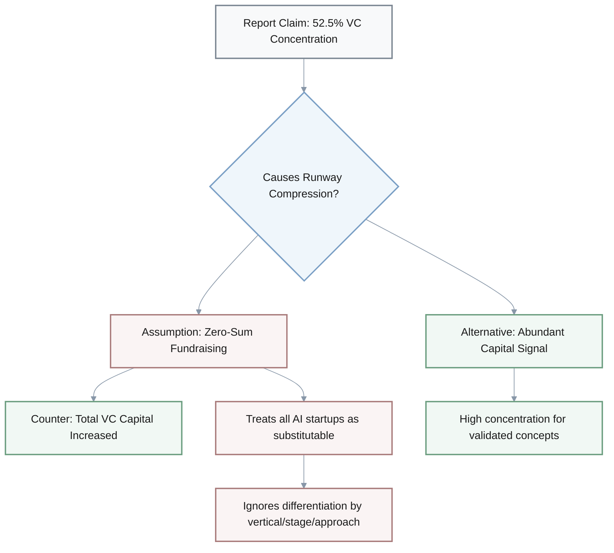
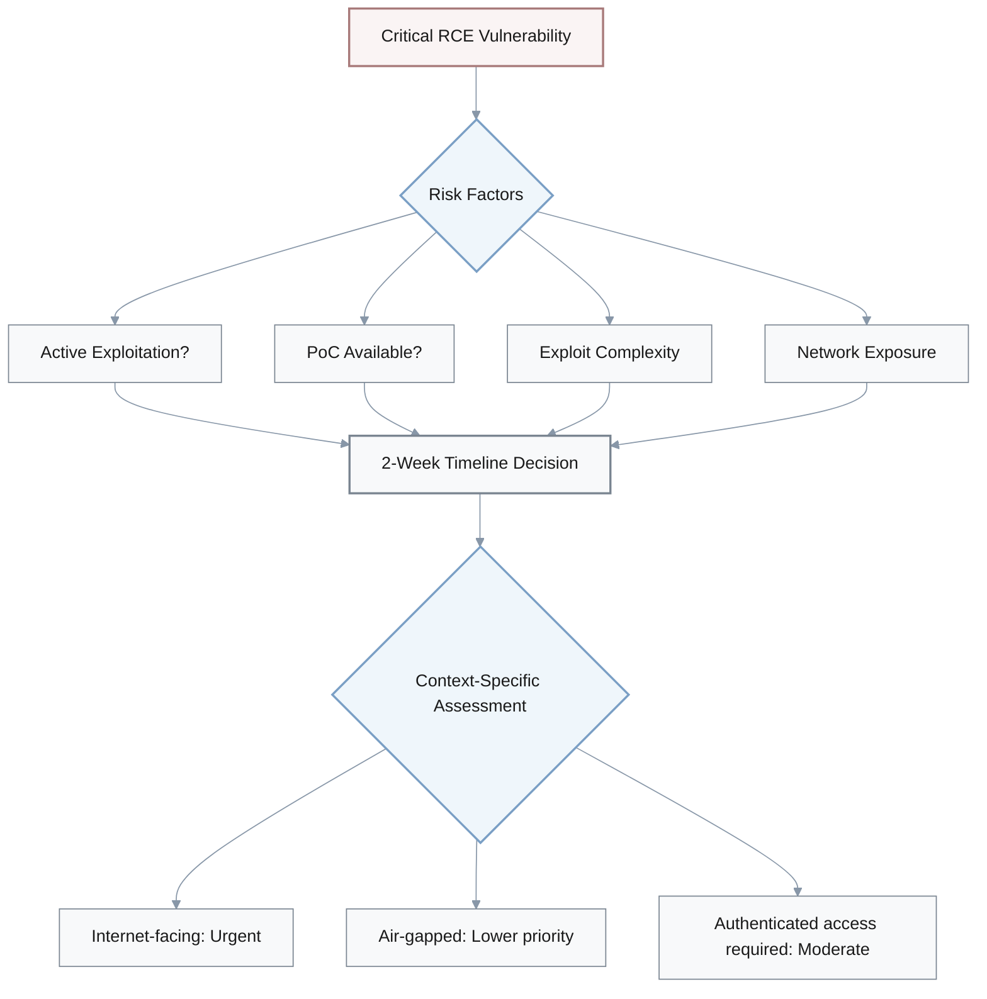
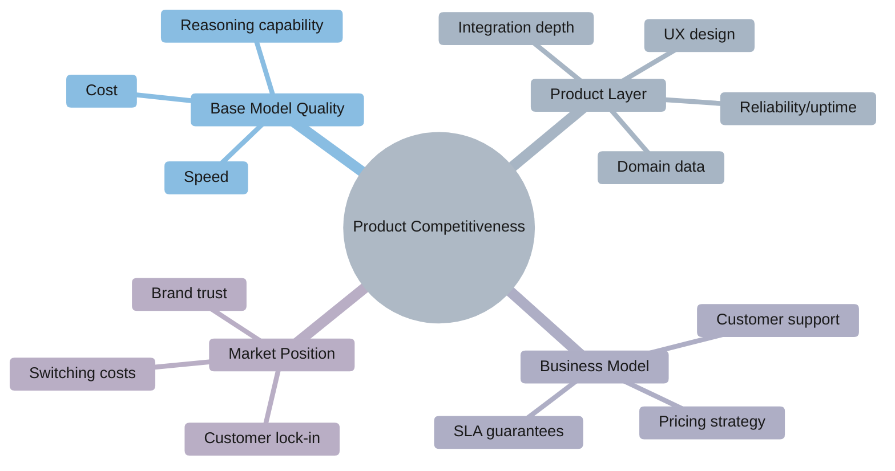
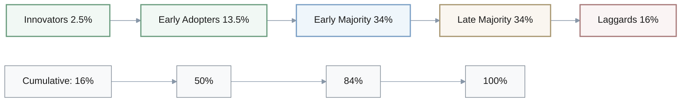
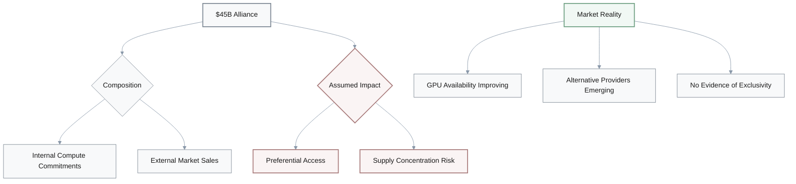
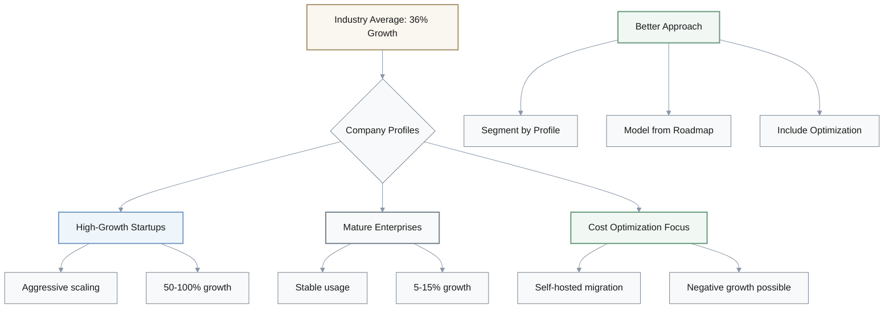
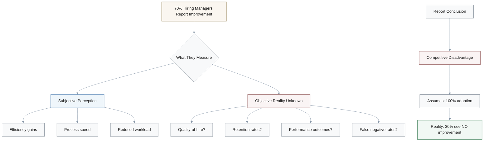

# Discussion - Critical Thinking Questions

---

## 1. VC Funding Concentration & Runway Compression Risk

**Question:** The report claims AI startups capturing 52.5% of VC funding creates "runway compression risk" for new companies that can't differentiate. Does high VC concentration actually cause fundraising difficulty?

### Dialogue Analysis

**Conversation:**

- **Analyst A:** Good question. That's assuming zero-sum fundraising, but overall VC capital deployed increased.
- **Strategist:** Right. High concentration could signal abundant capital for validated AI concepts, not scarcity.
- **A:** Exactly. Plus they're treating all AI startups as substitutable. Ignoring differentiation by vertical, stage, or technical approach.
- **Strategist:** Hmm. What evidence would actually support the claim?
- **A:** [pause] Let me think... Need data on seed round success rates 2024 versus 2025, time-to-close metrics, maybe valuation compression evidence.
- **Strategist:** Exactly. Just showing percentage share doesn't tell us if absolute dollars available actually decreased.
- **A:** Right. Without that, it's correlation without causation.

### Evidence Required

| Evidence Type | Purpose | Metric |
|--------------|---------|--------|
| **Seed round success rates** | Measure fundraising difficulty | 2024 vs 2025 comparison |
| **Time-to-close metrics** | Measure fundraising friction | Days to funding completion |
| **Valuation compression** | Measure pricing power shift | Deal terms analysis |
| **Absolute dollar deployment** | Test zero-sum assumption | Total VC capital deployed |

### Logical Flaws Identified

- **Zero-sum fallacy**: Assumes fixed capital pool when total VC deployed increased
- **Substitutability assumption**: Ignores vertical, stage, and technical differentiation
- **Correlation vs causation**: Percentage share ≠ absolute dollar scarcity

---

## 2. RCE Vulnerability Patching Timeline

**Question:** The report recommends patching critical RCE vulnerabilities within 2 weeks, calling it "immediate production compromise risk." Is 2 weeks the right threshold?

### Risk Assessment Framework

**Conversation:**

- **Security Lead:** The recommendation assumes high probability of exploit development after disclosure.
- **Engineer:** Right. But there's no evidence of active exploitation mentioned. Or proof-of-concept availability.
- **Security Lead:** Fair point. "Immediate compromise risk" might overstate urgency.
- **Architect:** Mm-hmm. Depends on exploit complexity, right? If these require sophisticated exploit chains or authenticated access, 2 weeks might be conservative.
- **Security Lead:** Exactly. And the recommendation doesn't quantify downtime risk or regression risk from rushed patching. Only emphasizes security upside.
- **Engineer:** Good catch. For air-gapped AI infrastructure, the risk profile is completely different than internet-facing services.
- **Architect:** Right. Would help to see CVSS severity scores, exploit complexity assessment, known exploitation timeline data.
- **Security Lead:** Agreed. Context matters a lot here.

### Missing Context for Decision

| Factor | What's Missing | Why It Matters |
|--------|----------------|----------------|
| **CVSS Severity Score** | Numeric risk rating | Quantifies actual threat level |
| **Active Exploitation** | Evidence of real-world attacks | Distinguishes theoretical vs actual risk |
| **PoC Availability** | Public exploit code status | Predicts exploit timeline |
| **Exploit Complexity** | Sophistication required | Affects attacker capability threshold |
| **Network Exposure** | Infrastructure deployment model | Air-gapped vs internet-facing changes risk profile |
| **Downtime/Regression Risk** | Patching operational costs | Balance security vs availability |

### Recommendation Weaknesses

- **One-size-fits-all timeline**: Ignores context-dependent risk profiles
- **Incomplete risk analysis**: Only considers security upside, not operational downside
- **Overstated urgency**: "Immediate compromise risk" without exploitation evidence
- **Missing tradeoff analysis**: Rushed patching vs thorough testing balance

---

## 3. Model Superiority & Competitive Disadvantage

**Question:** The report argues products on older models "face competitive disadvantage in reasoning-heavy use cases" after GPT-5.1 and Gemini 3 launch. Does model superiority directly translate to competitive disadvantage?

### Competitive Advantage Factors

**Conversation:**

- **Product Lead:** That oversimplifies. Reasoning quality isn't the only differentiation factor.
- **Designer:** Right. UX, domain data, integration depth, pricing, reliability—lots of competitive advantages are orthogonal to base model.
- **Product Lead:** Exactly. And there's a temporal assumption. B2B customers have 6 to 12 month evaluation cycles. Competitive impact is delayed.
- **Analyst:** Mm-hmm. The report cites no customer churn data, win-loss analysis, NPS shifts correlated with model launches.
- **Engineer:** Plus GPT-5.1 launched only 10 days before report date. Way too soon to measure market impact.
- **Product Lead:** Exactly. Would need historical analysis of competitive shifts after previous model launches, customer survey data on model version as buying criteria.
- **Analyst:** Right. Without that, we're guessing.

### Competitive Differentiation Beyond Model Quality

| Factor | Impact on Competitiveness | Orthogonal to Base Model? |
|--------|---------------------------|---------------------------|
| **UX Design** | High - affects usability | ✓ Yes |
| **Domain Data** | High - drives accuracy | ✓ Yes |
| **Integration Depth** | Medium - reduces friction | ✓ Yes |
| **Pricing** | High - affects ROI | ✓ Yes |
| **Reliability** | High - affects trust | ✓ Yes |
| **Base Model Reasoning** | Medium - one of many factors | ✗ No |

### Temporal Reality Check

**B2B Evaluation Cycle**: 6-12 months
**GPT-5.1 Launch to Report**: 10 days

$$
\text{Observation Window} = 10 \text{ days} \ll \text{B2B Cycle} = 180-360 \text{ days}
$$

> **Critical Gap**: Report issued before any meaningful market impact could be measured

### Missing Evidence

- **Customer churn data**: No evidence of customer loss correlated with model launches
- **Win-loss analysis**: No data on deal outcomes linked to model versions
- **NPS shifts**: No customer satisfaction changes tied to competitor model updates
- **Historical precedent**: No analysis of previous model launch impacts (GPT-4 → GPT-4.5, etc.)
- **Buying criteria surveys**: No data on model version importance in purchasing decisions

### Logical Errors

- **Reductionism**: Treats base model as sole competitive factor
- **Temporal impossibility**: Claims market impact 10 days post-launch
- **Evidence-free assertion**: No empirical support for competitive disadvantage claim

---

## 4. AI Adoption Curve Interpretation

**Question:** The report says 78% AI adoption in at least one business function indicates "late-stage adoption curve" with laggards now evaluating. Is that interpretation valid?

### Rogers' Adoption Curve Framework

**Conversation:**

- **Strategist:** "At least one function" is extremely broad. Could mean experimental pilot or production-critical deployment.
- **Researcher:** Right. 78% might represent early-stage pilots, not mature adoption.
- **Strategist:** Exactly. Rogers' adoption curve late-stage typically refers to 70%+ achieving mature, organization-wide deployment. This measures breadth, not depth.
- **Analyst:** Mm-hmm. And even if 78% is late-stage, doesn't automatically mean laggards are evaluating now. Could mean market saturation with limited new buyer opportunity.
- **Researcher:** Good point. No comparison to 6-12 months prior. If it was 75%, that's near-plateau, not acceleration.
- **Strategist:** Right. Need adoption maturity segmentation—pilot versus production. Plus year-over-year growth rates, intent-to-purchase data from the 22% non-adopters.
- **Analyst:** Agreed. The metrics tell different stories depending on depth.

### Breadth vs Depth Problem

| Metric Type | Report Claim | Reality Check |
|-------------|--------------|---------------|
| **Breadth** | 78% "at least one function" | Could be experimental pilots |
| **Depth** | Not measured | Mature, org-wide deployment vs trial |
| **Growth Rate** | Not provided | 78% today vs 75% last year = plateau |
| **Maturity** | Assumed late-stage | Early pilots ≠ production deployment |

### What 78% Could Actually Mean

**Scenario A - Early Stage (Pilot-heavy):**
- 78% have AI pilots in at least one function
- Most still evaluating, not in production
- Actual interpretation: **Early Majority phase**

**Scenario B - Late Stage (Production-heavy):**
- 78% have mature, org-wide AI deployment
- Most in production across multiple functions
- Actual interpretation: **Late Majority phase**

> The metric "at least one function" cannot distinguish between these scenarios

### Missing Data for Valid Interpretation

1. **Adoption maturity segmentation**: Pilot vs production vs org-wide
2. **Year-over-year comparison**: 78% today vs X% 6-12 months ago
3. **Growth rate trend**: Accelerating, plateauing, or decelerating
4. **Non-adopter intent**: Are the 22% evaluating or declining?
5. **Function count distribution**: 1 function vs 5+ functions

### Logical Flaws

- **Breadth-depth confusion**: Measures adoption breadth, infers adoption depth
- **Missing baseline**: No temporal comparison to determine trajectory
- **False dichotomy**: Late-stage doesn't automatically mean "laggards evaluating"
  - Could mean: Market saturation, limited new buyers
- **Metric ambiguity**: "At least one" is too broad for stage classification

---

## 5. Microsoft-NVIDIA-Anthropic Alliance Impact

**Question:** The report claims the $45B Microsoft-NVIDIA-Anthropic alliance creates "preferential access patterns" and "supply concentration risk" for non-aligned organizations. Is this reasoning sound?

### Alliance Structure Analysis

**Conversation:**

- **Analyst A:** The argument assumes exclusivity, but there's no evidence of exclusivity clauses or capacity restrictions.
- **Strategist:** Right. And it treats AI infrastructure as supply-constrained. Recent evidence shows GPU availability improving, alternative providers emerging.
- **A:** Exactly. The $45B includes internal compute commitments, not just market-affecting external sales. Overstates market impact.
- **Engineer:** Mm-hmm. Could be that the alliance signals partnership efficiency gains, not competitive restriction. Vertical integration might lower costs for all Azure-NVIDIA customers.
- **Strategist:** Good point. What would actually prove the claim?
- **A:** [pause] Evidence of preferential pricing or access terms, capacity allocation data showing non-partner disadvantage, competitive response from AWS or GCP indicating perceived threat.
- **Strategist:** Exactly. Without that, it's speculative.

### Claim vs Reality Assessment

| Claim Element | Evidence Required | What's Missing |
|---------------|-------------------|----------------|
| **Preferential Access** | Exclusivity clauses, capacity allocation data | No evidence of restricted access |
| **Supply Concentration Risk** | GPU scarcity metrics, non-partner waitlists | Market shows improving availability |
| **Non-aligned Disadvantage** | Pricing differentials, service tier gaps | No comparative data provided |
| **Market Impact** | External sales breakdown | $45B includes internal commitments |

### Alternative Interpretations

**Partnership Efficiency Model:**
- Vertical integration reduces costs
- Benefits extend to all Azure-NVIDIA customers
- Alliance signals efficiency gains, not competitive restriction

**Market Context:**
- GPU availability improving (contrary to scarcity assumption)
- Alternative providers emerging (AWS, GCP, specialized clouds)
- No evidence of supply constraint

### Evidence That Would Validate Claims

1. **Preferential pricing documentation**: Public vs partner pricing tiers
2. **Capacity allocation data**: Wait times or quotas for non-partners
3. **Competitive response**: AWS/GCP actions indicating perceived threat
4. **External vs internal breakdown**: How much of $45B affects market supply
5. **Customer testimony**: Non-partner complaints about access or pricing

### Logical Weaknesses

- **Assumption of exclusivity**: No evidence provided
- **Supply constraint assumption**: Contradicted by market trends
- **Market impact overstatement**: Conflates internal commitments with external supply
- **Missing competitive analysis**: No AWS/GCP comparison or response data

---

## 6. AI Budget Growth Recommendations

**Question:** The report recommends increasing FY2026 AI budgets by 30-40% based on industry average cost growth of 36%. Should individual organizations budget based on industry averages?

### Budget Growth Analysis

**Conversation:**

- **CFO:** That's an aggregation fallacy. Industry average includes vastly different AI usage patterns.
- **Finance Lead:** Right. Inference-heavy versus training-heavy, production versus R&D. Our cost drivers might differ significantly.
- **Analyst:** Plus survivorship bias. Average may be inflated by high-growth companies aggressively scaling. Mature companies with stable usage might see under 10% growth.
- **CFO:** Exactly. And the recommendation treats cost growth as inevitable. Doesn't address whether efficiency gains could offset usage increases.
- **CTO:** Good point. Doesn't account for company-specific strategies like migrating to self-hosted models or architectural optimization.
- **Finance Lead:** Better approach would segment by company profile, model cost based on planned feature roadmap, include optimization opportunities.
- **CFO:** Agreed. One-size-fits-all doesn't work here.

### Industry Average Breakdown

| Company Type | AI Usage Pattern | Expected Growth | Weight in Average |
|--------------|------------------|-----------------|-------------------|
| **High-Growth Startups** | Aggressive scaling, new features | 50-100% | ~20% |
| **Scale-ups** | Rapid expansion, market capture | 30-60% | ~25% |
| **Mature Enterprises** | Stable, optimization-focused | 5-15% | ~40% |
| **Cost-Optimizing** | Migration to self-hosted, efficiency | 0-10% or negative | ~15% |

**Industry Average**: 36%
**Your Company**: *Depends on profile*

### Cost Growth Drivers (Often Ignored)

**Factors Increasing Costs:**
- Feature expansion (new AI capabilities)
- User growth (more inference volume)
- Model upgrades (newer, more expensive models)

**Factors Decreasing Costs:**
- Model efficiency improvements (GPT-5 vs GPT-4 cost-per-token)
- Architectural optimization (caching, prompt engineering)
- Self-hosted migration (API → on-prem)
- Competitive pricing pressure (OpenAI vs Anthropic vs open-source)

$$
\text{Net Cost Growth} = \text{Usage Growth} - \text{Efficiency Gains} - \text{Optimization Savings}
$$

### Better Budgeting Framework

**Step 1 - Profile Classification:**
- High-growth startup vs mature enterprise
- Inference-heavy vs training-heavy
- Production-critical vs R&D-focused

**Step 2 - Roadmap-Based Modeling:**
- Planned feature launches
- Expected user growth
- New model adoptions

**Step 3 - Optimization Opportunities:**
- Prompt engineering savings
- Caching strategies
- Self-hosted feasibility
- Provider negotiation leverage

**Step 4 - Risk Adjustment:**
- Upside scenarios (viral growth)
- Downside scenarios (efficiency gains)
- Contingency buffer

### Logical Flaws in Report Recommendation

- **Aggregation fallacy**: Averages across vastly different company profiles
- **Survivorship bias**: High-growth companies inflate average
- **Treats growth as inevitable**: Ignores optimization strategies
- **Missing cost-reduction opportunities**: Self-hosting, efficiency gains, competitive pricing
- **One-size-fits-all**: Individual cost drivers differ significantly

---

## 7. AI Recruiting Effectiveness

**Question:** The report says 70% of hiring managers report AI improves hiring decisions, then recommends implementing AI recruiting to avoid "competitive disadvantage." How strong is this argument?

### Subjective vs Objective Metrics

**Conversation:**

- **HR Lead:** "Hiring managers report" is subjective perception, not objective quality-of-hire data.
- **Analyst:** Right. They might perceive efficiency gains as quality improvements without evidence.
- **Data Lead:** Mm-hmm. No control group comparison. AI adopters may have other factors driving improved outcomes—better HR processes, higher budgets.
- **HR Lead:** Exactly. And the report acknowledges concerns about AI rejecting qualified candidates but doesn't weigh false-negative risk against reported benefits.
- **Recruiter:** Good point. The competitive disadvantage logic assumes all competitors are adopting, but 30% of managers don't see improvements. That's significant.
- **Data Lead:** Would need objective quality-of-hire metrics—retention, performance reviews. Controlled studies comparing AI-screened versus human-screened candidates, long-term bias litigation rates.
- **HR Lead:** Right. Perception isn't proof.

### Perception vs Reality Gap

| What Managers Perceive | Potential Reality | Why The Gap Matters |
|------------------------|-------------------|---------------------|
| **"Improved decisions"** | Faster processing time | Speed ≠ quality |
| **"Better candidates"** | Reduced resume screening workload | Efficiency ≠ accuracy |
| **"More efficient"** | Lower cost-per-hire | Cost savings ≠ better hires |
| **Unknown:** | False negative rate (rejected qualified candidates) | Hidden costs not measured |

### Missing Objective Evidence

**Quality-of-Hire Metrics (Needed):**
1. **Retention rates**: 1-year, 2-year retention of AI-screened vs human-screened
2. **Performance outcomes**: Performance review scores, promotion rates
3. **False negative analysis**: Qualified candidates incorrectly rejected
4. **Controlled studies**: A/B testing AI vs human screening
5. **Long-term bias metrics**: Discrimination litigation rates, diversity outcomes

**Confounding Factors (Not Controlled):**
- AI adopters may have better HR processes overall
- Higher budgets enabling better candidate pools
- More sophisticated recruiting teams
- Superior employer branding

### Competitive Disadvantage Logic Flaws

**Report's Assumption:**
- 70% see improvements → adopt AI or face disadvantage

**Reality Check:**
- 30% see NO improvement (significant minority)
- No market share data showing AI adopters winning talent wars
- Perception-based, not outcome-based

**Alternative Interpretation:**
- 30% failure rate suggests caution, not urgency
- Competitive advantage may lie in avoiding false negatives
- Quality beats speed in talent acquisition

### Risk-Benefit Analysis (Missing from Report)

**Reported Benefits (Subjective):**
- 70% perceive improved decisions
- Efficiency gains

**Unweighted Risks (Acknowledged but not quantified):**
- Rejecting qualified candidates (false negatives)
- Bias amplification
- Legal/reputational risks
- Candidate experience degradation

> The report acknowledges false-negative risk but provides no framework for weighing it against perceived benefits

### Evidence Required for Strong Recommendation

1. **Objective quality-of-hire data**: Retention, performance, productivity
2. **Controlled comparisons**: AI-screened vs human-screened outcomes
3. **False negative quantification**: How many qualified candidates rejected?
4. **Market outcome data**: Do AI-adopting companies actually win talent wars?
5. **Risk quantification**: Bias litigation costs, reputational damage
6. **Longitudinal studies**: Long-term career outcomes of AI-screened hires

### Conclusion

**Argument Strength**: Weak

**Why:**
- Relies on subjective perception, not objective outcomes
- No control group or confounding factor analysis
- Ignores 30% who see no improvement
- Fails to quantify false-negative risk
- Competitive disadvantage claim lacks market evidence

**Better Approach:**
- Pilot AI recruiting with A/B testing
- Measure objective quality-of-hire metrics
- Quantify false negative rates
- Compare outcomes before making organization-wide decision
