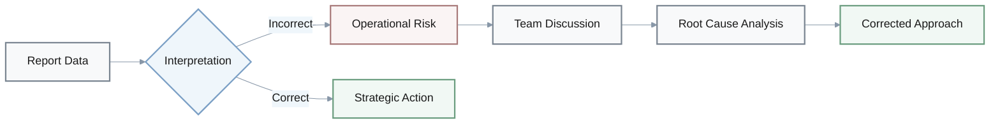
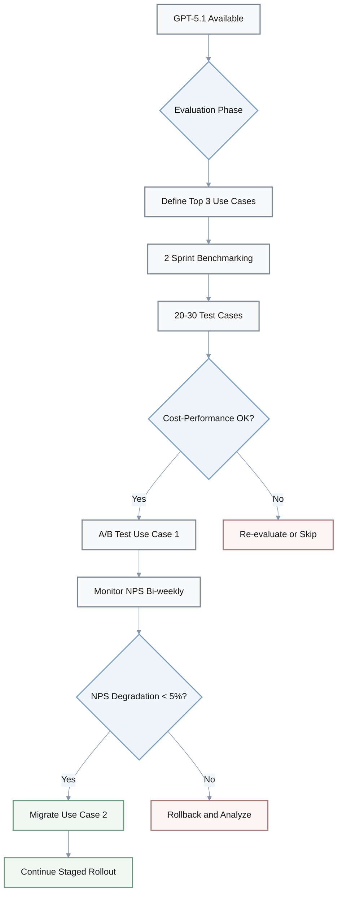
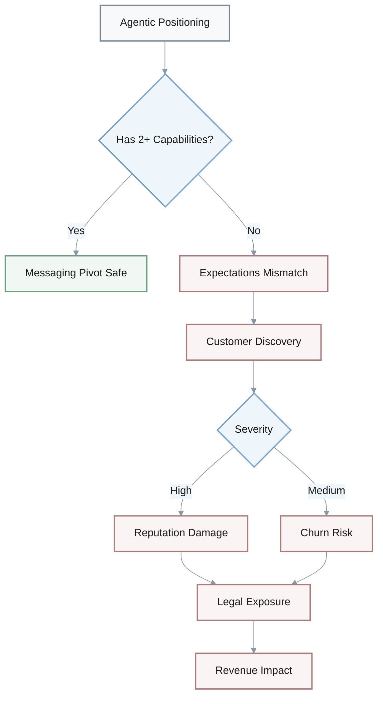
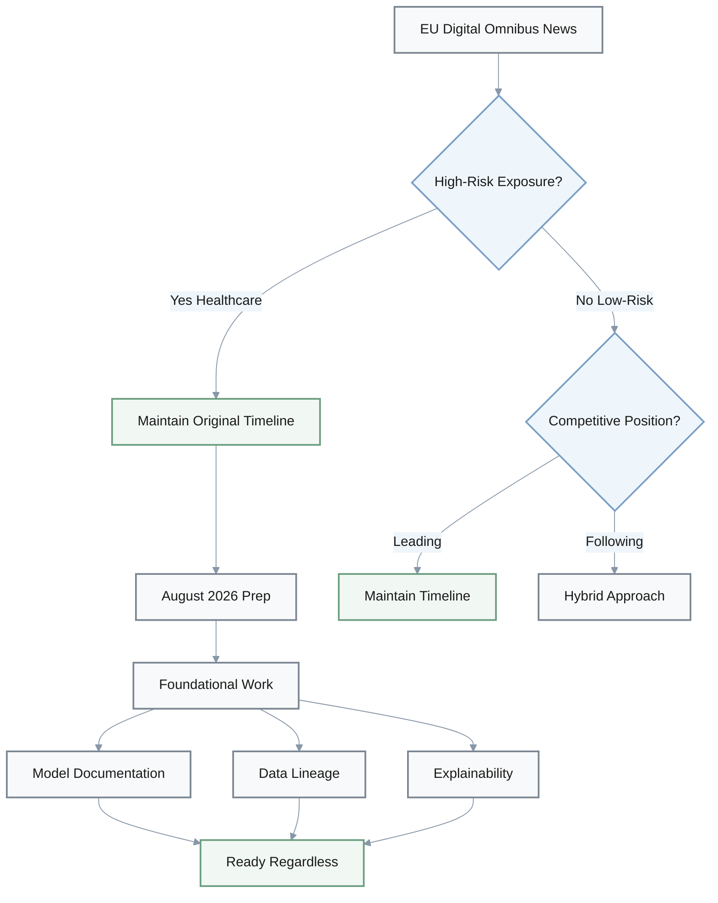
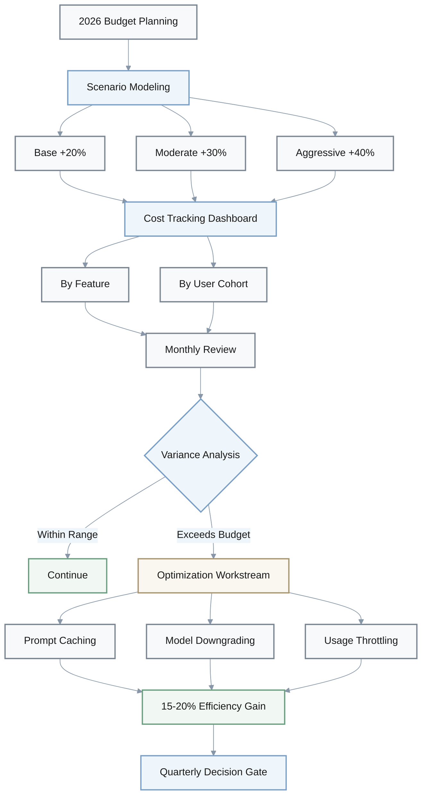

# Discussion - Debug Cards

## Overview

These cards illustrate common misinterpretations of AI industry reports and their operational implications.

### Scenario Summary

| # | Domain | Core Issue | Key Metric Gap | Impact |
|---|--------|------------|----------------|--------|
| 1 | Finance | CAC underestimation | 10-15% vs 20-40% | 2-4 months runway miscalculation |
| 2 | Security | Patch timeline extension | 20 days vs 14 days | 43% longer exploitation window |
| 3 | Product | Premature migration | 1 sprint vs 2+ sprints | Cost surge, NPS risk |
| 4 | Marketing | Feature misrepresentation | 0 vs 2+ agentic capabilities | Legal exposure, reputation damage |
| 5 | Compliance | Canceled prep work | 0 months vs 16 months runway | Regulatory debt accumulation |
| 6 | Budget | Single-point estimate | 1 scenario vs 3 scenarios | No adaptation mechanism |

---

## Scenario 1: CAC Underestimation Risk

**Q:** Our CFO is modeling 12-month runway with CAC increasing 10-15% due to AI startup competition. The market report says AI startups captured 52.5% of VC funding with competitors outspending on acquisition. What's wrong with this assumption?

**A:**

**Finance Lead:** Wait, where's the 10-15% coming from?

**Analyst:** The report explicitly states CAC may increase 20-40%, not 10-15%.

**CFO:** So we're underestimating by half?

**Analyst:** Exactly. That could miscalculate runway by 2 to 4 months. Could trigger emergency fundraising or layoffs.

**Finance Lead:** Right. How do we fix this?

**Analyst:** Model three scenarios—20%, 30%, 40% CAC increase. Include sensitivity analysis showing cash exhaustion dates at each level. For Formation-stage startups with under 12 months runway, use 40% for conservative planning.

**Finance Lead:** Makes sense. Conservative is safer here.

### Key Metrics

| Metric | Assumed | Actual Report | Error Magnitude |
|--------|---------|---------------|-----------------|
| CAC Increase Range | 10-15% | 20-40% | 50% underestimation |
| Runway Miscalculation | 0 months | 2-4 months | Critical gap |
| Market Context | - | 52.5% VC funding to AI | High competition |

### Impact Formula

$$
\text{Runway Error (months)} = \frac{\text{Actual CAC Increase} - \text{Assumed CAC Increase}}{\text{Monthly Burn Rate}} \times \text{Total Runway}
$$

### Corrective Actions

- **Immediate**: Model three scenarios (20%, 30%, 40% CAC increase)
- **Analysis**: Include sensitivity analysis with cash exhaustion dates
- **Policy**: For Formation-stage startups (<12 months runway), use 40% conservative estimate
- **Monitoring**: Quarterly reforecast with actual CAC data

---

## Scenario 2: Critical Patch Timeline Extension

**Q:** Our engineering team planned a staged rollout for critical RCE patches: dev on Day 1, staging Day 5, low-priority prod Day 12, high-priority prod Day 20. What's wrong with this timeline?

**A:**

**Security Lead:** Wait, 20 days total? The report recommends patching within 2 weeks—that's 14 days.

**Engineer:** We wanted thorough testing between stages.

**Security Lead:** I get that. But critical RCE vulnerabilities expose production to immediate compromise. Extending to 20 days increases exploitation window by 43%.

**CTO:** And high-priority production gets patched last?

**Security Lead:** Exactly. That's the highest-risk approach. Potential data exfiltration, service disruption, regulatory penalties.

**Engineer:** Got it. How should we compress this?

**Security Lead:** Hmm... [pause] Dev Day 1, staging Day 3-4, low-priority prod Day 7-8, high-priority prod Day 12-14. 24-hour monitoring between stages. For mission-critical systems, consider temporary workarounds—network segmentation, WAF rules—immediately while testing patches in parallel.

**CTO:** Right. Aggressive but necessary.

### Timeline Comparison

| Stage | Original Plan | Recommended | Risk Level |
|-------|---------------|-------------|------------|
| Dev | Day 1 | Day 1 | Low |
| Staging | Day 5 | Day 3-4 | Medium |
| Low-Priority Prod | Day 12 | Day 7-8 | Medium-High |
| High-Priority Prod | Day 20 | Day 12-14 | Critical |
| **Total Duration** | **20 days** | **14 days max** | - |

### Risk Calculation

$$
\text{Exploitation Window Increase (\%)} = \frac{\text{Actual Timeline} - \text{Recommended Timeline}}{\text{Recommended Timeline}} \times 100 = \frac{20 - 14}{14} \times 100 = 43\%
$$

```mermaid
%%{init: {
  "theme": "base",
  "themeVariables": {
    "primaryColor": "#f8f9fa",
    "primaryTextColor": "#1a1a1a",
    "primaryBorderColor": "#7a8591",
    "lineColor": "#8897a8",
    "secondaryColor": "#eff6fb",
    "tertiaryColor": "#f3f5f7"
  }
}}%%
gantt
    title Critical RCE Patch Rollout Timeline
    dateFormat D
    axisFormat Day %d
    
    section Original
    Dev           :done, 1, 1d
    Staging       :done, 5, 1d
    Low-Prio Prod :crit, 12, 1d
    High-Prio Prod:crit, 20, 1d
    
    section Recommended
    Dev           :done, 1, 1d
    Staging       :active, 3, 2d
    Low-Prio Prod :8, 2d
    High-Prio Prod:12, 3d
```

### Risks of Extended Timeline

- **Data exfiltration**: Exposed production environment for 6 additional days
- **Service disruption**: Active RCE exploitation during delay period
- **Regulatory penalties**: Non-compliance with security patching SLAs
- **Reputation damage**: Public disclosure of unpatched critical vulnerabilities

### Corrective Actions

- **Immediate workarounds**: Network segmentation, WAF rules
- **Parallel testing**: Test patches simultaneously with temporary mitigations
- **Monitoring**: 24-hour security monitoring between stages
- **Priority inversion**: Patch high-priority production before low-priority

---

## Scenario 3: Premature Model Migration

**Q:** Our product team read GPT-5.1 "significantly outperforms" GPT-4 in reasoning, so they're migrating all features immediately. They allocated 1 sprint for full migration, plan to deploy to production without A/B testing. What's wrong here?

**A:**

**PM:** One sprint, no testing? That seems fast.

**Engineer A:** Right. The report recommends 2 sprints for evaluation plus testing, not immediate full migration. They skipped benchmarking entirely.

**PM:** Mm-hmm. And no A/B testing?

**Engineer B:** Exactly. Report explicitly recommends monitoring customer NPS and satisfaction scores bi-weekly during migration with success metric of no more than 5% NPS degradation.

**CTO:** What about cost?

**Engineer A:** Good question. GPT-5.1 is 20-30% more expensive. Migrating all features means potentially 20-30% increase in inference costs. They didn't evaluate cost-performance trade-offs.

**CTO:** Ouch. That's significant.

**PM:** So what's the right approach?

**Engineer B:** Let me think... [pause] Define top 3 reasoning-critical use cases, allocate 2 sprints for parallel benchmarks with 20-30 test cases from production data. Migrate highest-value use case first with A/B testing, monitor NPS bi-weekly, stage additional migrations only if success criteria are met.

**PM:** Makes sense. Staged and measured.

### Migration Comparison

| Dimension | Original Plan | Recommended Approach | Risk Mitigation |
|-----------|---------------|----------------------|-----------------|
| Timeline | 1 sprint | 2+ sprints | Adequate evaluation |
| Scope | All features | Top 3 use cases first | Staged rollout |
| Testing | None | A/B testing | Real-world validation |
| Benchmarking | Skipped | 20-30 test cases | Data-driven decisions |
| NPS Monitoring | None | Bi-weekly tracking | Customer satisfaction |
| Cost Analysis | None | Trade-off evaluation | Budget control |

### Cost Impact

$$
\text{Inference Cost Increase} = \text{Current Monthly Cost} \times (1.20 \text{ to } 1.30)
$$

**Example**: If current monthly inference cost is $10,000:
- Low estimate: $10,000 × 1.20 = $12,000 (+$2,000/month)
- High estimate: $10,000 × 1.30 = $13,000 (+$3,000/month)
- Annual impact: $24,000 to $36,000 additional spend

### Success Criteria

- **NPS threshold**: No more than 5% degradation from baseline
- **Cost efficiency**: Cost increase justified by measurable performance gains
- **Rollout velocity**: One use case every 2-3 weeks after validation
- **Rollback readiness**: Ability to revert within 24 hours if issues arise

### Corrective Actions

- **Phase 1**: Define top 3 reasoning-critical use cases
- **Phase 2**: Allocate 2 sprints for parallel benchmarks
- **Phase 3**: Use 20-30 production-derived test cases
- **Phase 4**: Migrate highest-value use case with A/B testing
- **Phase 5**: Monitor NPS bi-weekly, stage additional migrations only upon success

---

## Scenario 4: Feature Misrepresentation in Positioning

**Q:** Marketing wants to reposition our product as "autonomous AI agents" despite having only basic workflow automation and API integrations. They claim this aligns with 78% enterprise adoption. What's problematic?

**A:**

**Product Lead:** Wait, do we actually have autonomous capabilities?

**Engineer:** Basic workflow automation, yes. Autonomous task execution? No.

**Product Lead:** Right. The report defines agentic AI as "autonomous task execution, tool use, workflow orchestration" and recommends messaging pivot "if product already has 2+ agentic capabilities."

**Marketing Lead:** We have workflow automation and integrations.

**Product Lead:** True, but not autonomy. Report recommends "Product-First Approach" for products where "features non-existent"—build features before repositioning.

**Counsel:** What's the risk here?

**Product Lead:** Creates customer expectations mismatch. Reputation damage when buyers discover limited autonomy. Plus potential false advertising concerns.

**Counsel:** Ah, I see. Legal exposure.

**Engineer:** What should we do instead?

**Product Lead:** Hmm... [pause] Follow the report's Gradual Messaging Evolution. A/B test agentic messaging in new campaigns while maintaining legacy positioning, or invest 3-6 months building genuine agentic capabilities. Alternatively, use "Human-in-Loop Agent" framing to accurately describe supervised automation without overpromising.

**Marketing Lead:** Got it. Honest positioning first.

### Capability Assessment

| Agentic AI Requirement | Current Status | Gap Analysis |
|------------------------|----------------|--------------|
| Autonomous task execution | ❌ Not present | Critical gap |
| Tool use | ✅ API integrations | Partial |
| Workflow orchestration | ✅ Basic automation | Partial |
| **Minimum threshold** | **2+ capabilities** | **1.5/3 capabilities** |

### Risk Analysis

### Positioning Strategy Options

| Strategy | Timeline | Risk Level | Market Context |
|----------|----------|------------|----------------|
| Product-First | 3-6 months | Low | Build before claiming (78% adoption creates pressure) |
| Gradual Messaging | 2-3 months | Medium | A/B test while maintaining legacy positioning |
| Human-in-Loop Framing | Immediate | Low | Accurate description of supervised automation |
| Aggressive Pivot | Immediate | **High** | **Original plan - NOT RECOMMENDED** |

### Corrective Actions

- **Option 1**: Product-First Approach—invest 3-6 months building genuine autonomy before repositioning
- **Option 2**: Gradual Messaging Evolution—A/B test agentic messaging in new campaigns while maintaining legacy positioning
- **Option 3**: Honest Positioning—use "Human-in-Loop Agent" framing to accurately describe current capabilities
- **Legal review**: Consult counsel on advertising claims before any public messaging changes

---

## Scenario 5: Premature Compliance Cancellation

**Q:** Our CTO read the EU Digital Omnibus may delay high-risk AI system rules by 16 months and immediately canceled all AI Act compliance work for 2026. We operate healthcare AI tools in the EU. What's wrong with this decision?

**A:**

**Regulatory Lead:** Healthcare AI is high-risk under AI Act Annex III, right?

**Counsel:** Correct. And the report explicitly recommends "Maintain Original Timeline" for high-risk exposure, specifically for regulated industries including healthcare.

**CTO:** But the delay gives us 16 extra months.

**Regulatory Lead:** "May delay"—not guaranteed. Canceling compliance creates massive debt if delay doesn't materialize.

**Counsel:** Exactly. Plus healthcare has GDPR and sector-specific regulations that apply regardless of AI Act timeline.

**Product Lead:** What's the recommended approach?

**Regulatory Lead:** Continue August 2026 compliance prep despite potential delay. Rationale from report: "Readiness regardless of final timeline, competitive advantage if standards tighten." For healthcare, maintain foundational work—model documentation, data lineage, explainability—that applies regardless of final timeline.

**CTO:** Got it. Staying prepared.

### Regulatory Risk Assessment

| Risk Factor | Analysis | Impact |
|-------------|----------|--------|
| Delay certainty | "May delay" (not guaranteed) | Could materialize or not |
| Industry classification | Healthcare = High-risk (Annex III) | Mandatory compliance |
| Parallel regulations | GDPR + sector-specific rules | Apply regardless of AI Act |
| Compliance debt | 16 months of work canceled | Massive catch-up if delay fails |
| Competitive positioning | Early compliance = advantage | Market differentiation |

### Decision Framework

### Timeline Strategy

| Scenario | Action | Rationale |
|----------|--------|-----------|
| Delay materializes | Continue prep | Competitive advantage, no time wasted |
| Delay fails | Continue prep | Compliance readiness, avoid penalties |
| Standards tighten | Continue prep | Already ahead of curve |
| **Recommended** | **Maintain Aug 2026 timeline** | **Risk mitigation + opportunity** |

### Foundational Work (Independent of Timeline)

- **Model documentation**: Technical specifications, training data, performance metrics
- **Data lineage**: Source tracking, processing history, quality assurance
- **Explainability**: Model interpretability, decision rationale, audit trails
- **Risk management**: Bias assessment, failure mode analysis, monitoring systems

> **Note**: These capabilities strengthen GDPR compliance and healthcare-specific regulations regardless of AI Act timeline.

### Corrective Actions

- **Reinstate compliance work**: Resume August 2026 prep immediately
- **Prioritize foundational work**: Focus on documentation, lineage, explainability
- **Quarterly reviews**: Assess regulatory landscape changes every 3 months
- **Competitive positioning**: Market readiness as differentiator to healthcare customers

---

## Scenario 6: Single-Point Budget Estimate

**Q:** Our CFO allocated exactly $68K per month for AI infrastructure in 2026 based on the report's projection from $50K. Current spend could increase to $68K with 36% growth. They present this as "data-driven" budgeting. What's insufficient?

**A:**

**Finance Lead:** Hmm... That's a single-point estimate based on industry average.

**Analyst:** Right. Report recommends "Hybrid Model: Reforecast +20%, initiate optimization workstream" or modeling three scenarios—plus 20%, plus 30%, plus 40%—with trade-offs. Single estimate ignores uncertainty.

**Engineer:** And 36% is industry average. Report warns this includes "organizations with vastly different AI usage patterns" and that "individual company's cost drivers may differ significantly."

**Finance Lead:** Mm-hmm. No quarterly review gates? No optimization plan?

**Analyst:** Exactly. Report recommends quarterly review gates and identifying top 3 optimization opportunities to achieve 15-20% cost efficiency gain.

**CFO:** I see. So what's the fix?

**Finance Lead:** Let me think... [pause] Model three scenarios tied to feature roadmap—base case plus 20%, moderate plus 30%, aggressive plus 40%. Implement cost tracking dashboard by feature and user cohort. Prioritize top 3 optimizations—prompt caching, model downgrading for low-value requests, usage-based throttling. Establish monthly AI cost review with Engineering, quarterly decision gates to reallocate based on actual burn rate.

**CFO:** Makes sense. More adaptive budgeting.

### Budget Scenario Modeling

| Scenario | Growth Rate | Monthly Cost | Annual Cost | Notes |
|----------|-------------|--------------|-------------|-------|
| Current (2025) | - | $50,000 | $600,000 | Baseline |
| Single-Point (Original) | +36% | $68,000 | $816,000 | Industry average |
| **Base Case** | **+20%** | **$60,000** | **$720,000** | Conservative |
| **Moderate Case** | **+30%** | **$65,000** | **$780,000** | Balanced |
| **Aggressive Case** | **+40%** | **$70,000** | **$840,000** | High growth |

### Cost Increase Formula

$$
\text{Monthly Cost (2026)} = \text{Current Monthly Cost} \times (1 + \text{Growth Rate})
$$

**Example calculations:**
- Base: $50,000 × 1.20 = $60,000
- Moderate: $50,000 × 1.30 = $65,000
- Aggressive: $50,000 × 1.40 = $70,000

### Budget vs Actual Variance Analysis

### Problems with Single-Point Estimate

| Issue | Impact | Consequence |
|-------|--------|-------------|
| Industry average dependency | Ignores company-specific usage patterns | Misaligned budget |
| No uncertainty modeling | Rigid allocation without flexibility | Cannot adapt to reality |
| Missing optimization plan | No cost efficiency roadmap | Waste accumulation |
| No review gates | Budget set-and-forget approach | Missed reallocation opportunities |

### Optimization Opportunities (15-20% Efficiency Target)

- **Prompt caching**: Cache frequently used prompts to reduce API calls
- **Model downgrading**: Use smaller/cheaper models for low-value requests
- **Usage-based throttling**: Limit high-cost operations per user cohort
- **Batch processing**: Group requests to reduce per-call overhead
- **Smart routing**: Route requests to most cost-effective model variant

### Corrective Actions

- **Scenario planning**: Model three scenarios (base +20%, moderate +30%, aggressive +40%) tied to feature roadmap
- **Cost tracking**: Implement dashboard with breakdown by feature and user cohort
- **Optimization priorities**: Identify and implement top 3 optimizations for 15-20% efficiency gain
- **Review cadence**: Monthly AI cost review with Engineering, quarterly decision gates for budget reallocation
- **Adaptive budgeting**: Reallocate based on actual burn rate, not static forecast

---
