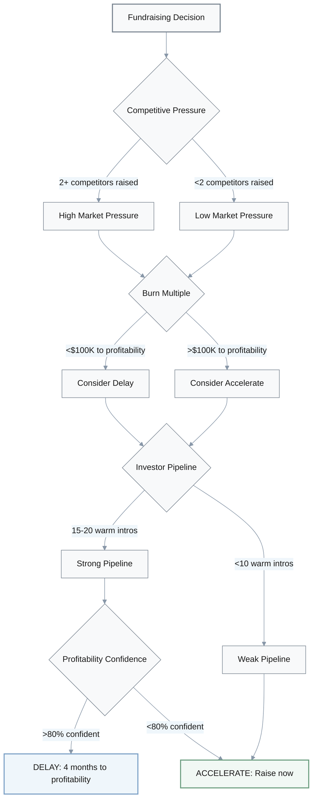
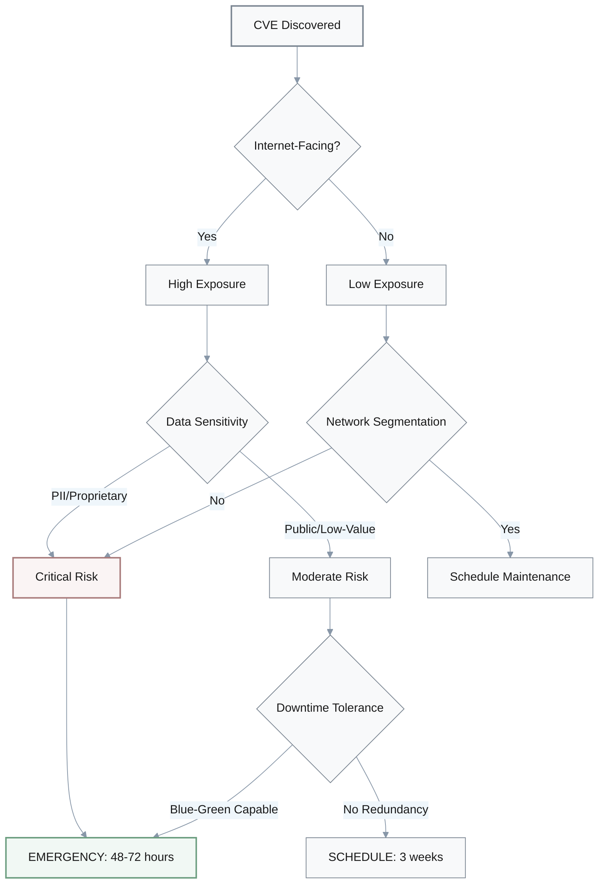
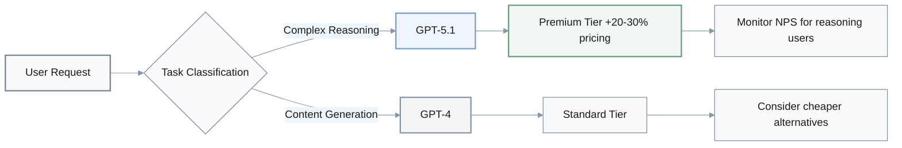
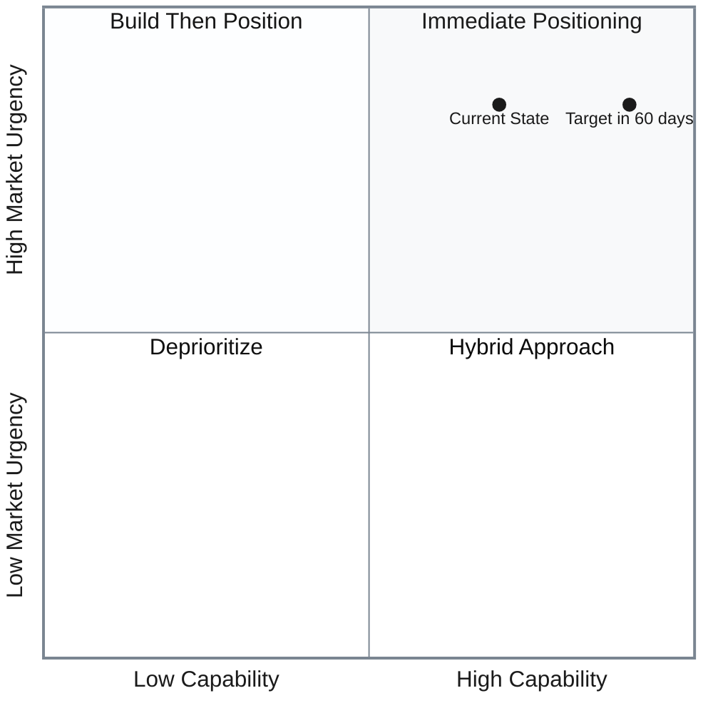
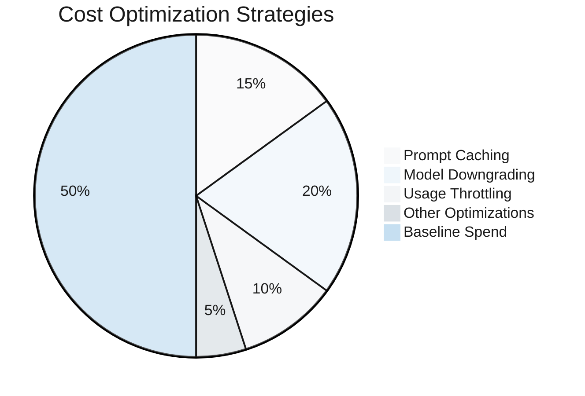
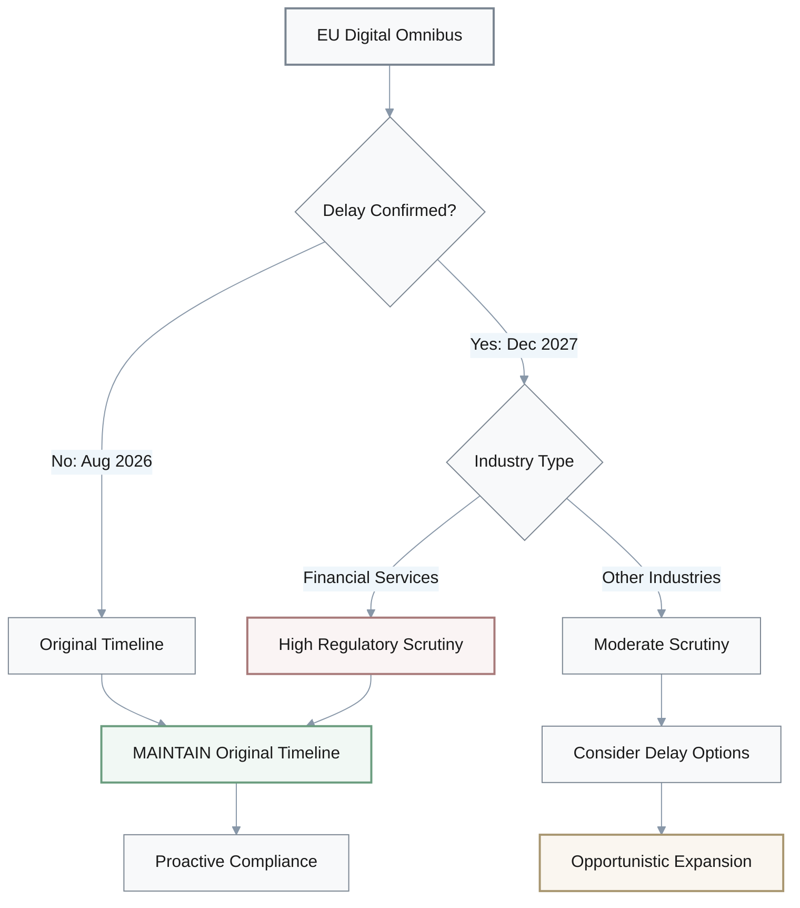
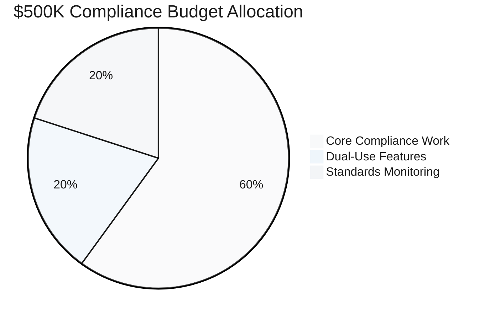

# Discussion - Decision Questions

## Overview

This document captures 6 critical strategic decisions for AI startups, covering fundraising, security, technology, product positioning, budget allocation, and regulatory compliance.

| Decision Area | Core Question | Time Pressure | Key Trade-off |
|--------------|---------------|---------------|---------------|
| Fundraising | Accelerate vs. delay Series A | 8 months runway | Technical traction vs. profitability metrics |
| Security | Emergency vs. scheduled patching | 48 hours vs. 3 weeks | Downtime risk vs. breach risk |
| Technology | Model migration strategy | Immediate | Cost increase vs. competitive advantage |
| Product | Agentic AI positioning | 3 months | Development time vs. market timing |
| Budget | Infrastructure spend level | FY2026 planning | Budget increase vs. optimization investment |
| Regulatory | EU AI Act compliance timing | 16 month potential delay | Compliance cost vs. feature velocity |

---

## 1. Fundraising Timing Decision

**Q:** We've got 8 months runway left. AI startups captured 52.5% of global VC—$192.7B year-to-date—creating intense competition. Do we accelerate fundraising now with strong technical traction but limited revenue, or delay 4 months to reach profitability milestones but risk competitor market capture?
   A: **Founder:** We need a decision framework here.
   
   **Advisor:** Right. Start with competitive timing. Do you have 3 or more direct competitors who recently raised Series A?
   
   **Founder:** Two just closed rounds.
   
   **Advisor:** Mm-hmm. Market window may be closing—that favors accelerating. What's your burn multiple? Can you reach profitability with under $100K additional spend?
   
   **CFO:** Hmm... Maybe $150K to get there.
   
   **Advisor:** Close, but not certain. Investor pipeline strength?
   
   **CEO:** I have warm introductions to about 15 to 20 target VCs.
   
   **Advisor:** Good. That lowers acceleration risk. Here's my take: in a 52.5% VC concentration environment, capital is available but competitive. Technical differentiation and proprietary data moats are critical.
   
   **Founder:** Got it. So recommendation?
   
   **Advisor:** Let me think through this... Accelerate if your differentiation story is compelling, TAM is over $1B, and technical risk is largely retired. Delay only if cash-flow positive within 4 months is highly certain—over 80% confidence.
   
   **CEO:** We're not 80% confident on profitability timeline.
   
   **Advisor:** Then accelerate. Execute the CFO's 12-month cash runway model with 20-40% CAC increase assumption. Draft differentiated positioning deck immediately. Target 5 partner meetings within 2 weeks.
   
   **Founder:** Makes sense. Executable plan.

### Decision Framework

### Key Decision Factors

- **Market Context**: 52.5% VC concentration in AI → capital available but highly competitive
- **Critical Requirements for Acceleration**:
  - Compelling differentiation story
  - TAM > $1B
  - Technical risk largely retired
  - Warm introductions to 15+ target VCs
- **Execution Plan**: 12-month cash runway model with 20-40% CAC increase assumption

---

## 2. Security Patching Decision

**Q:** Our AI inference infrastructure is affected by CVE-2025-30165 in vLLM and CVE-2025-23254 in NVIDIA TensorRT-LLM. Infrastructure team wants to wait 3 weeks for scheduled maintenance window to patch thoroughly. CISO wants emergency patching within 48 hours with staged rollout. How do we decide?
   A: **CTO:** We need a risk assessment model here.
   
   **CISO:** Right. Start with exposure surface. Are these services internet-facing with public API endpoints?
   
   **Infrastructure Lead:** Yes, customer-facing APIs.
   
   **CISO:** Mm-hmm. Then exploitation probability is high. Emergency patching is mandatory.
   
   **CTO:** What about data sensitivity?
   
   **Security Lead:** Customer PII, model weights, potentially proprietary data.
   
   **CISO:** That settles it. Emergency patching required.
   
   **Infrastructure Lead:** Wait—downtime tolerance? Revenue impact?
   
   **CFO:** Good question. Calculate 1-2 hours downtime per service versus potential breach cost. GDPR penalties are up to 4% of global revenue.
   
   **CTO:** Do we have blue-green deployment capability?
   
   **DevOps:** Yes, and comprehensive test suite.
   
   **CISO:** Good. Then 48-72 hour timeline is achievable with acceptable risk. Default to emergency patching unless there's no internet-facing exposure, network segmentation is already implemented, and no customer data in scope.
   
   **CTO:** We fail all three conditions. Emergency patching it is.
   
   **DevOps:** Got it. Staged rollout: dev, then staging with 24-hour monitor, then 5% prod canary with 24-hour monitor, then full prod. Automated rollback triggers for error rate more than 2x baseline or latency more than 1.5x baseline.
   
   **CTO:** Executable plan. Let's proceed.

### Risk Assessment Model

### Patching Decision Criteria

**Emergency Patching Required When:**
- Internet-facing services with public API endpoints
- Customer PII or proprietary data in scope
- No network segmentation implemented

**Staged Rollout Process:**

| Stage | Environment | Duration | Rollback Trigger |
|-------|-------------|----------|------------------|
| 1 | Dev | Immediate | Any failure |
| 2 | Staging | 24h monitor | Error rate >2x baseline |
| 3 | Prod 5% canary | 24h monitor | Latency >1.5x baseline |
| 4 | Full production | Ongoing | Automated thresholds |

**Risk Calculation:**

$$
\text{Breach Cost} = \text{GDPR Penalty (4\% revenue)} + \text{Incident Response} + \text{Reputation Damage}
$$

$$
\text{Downtime Cost} = \text{Revenue Impact (1-2 hours)} + \text{SLA Credits}
$$

**Decision:** Emergency patching when Breach Cost >> Downtime Cost

---

## 3. Model Migration Strategy

**Q:** Our roadmap includes migrating from GPT-4 to GPT-5.1—20-30% cost increase—or Gemini 3. We have 60% content generation use cases, 40% complex reasoning. How do we prioritize migration given cost and competitive considerations?
   A: **Product Lead:** Need use case segmentation first.
   
   **Engineer:** Right. Complex reasoning is 40% of use cases—that's where GPT-5.1 and Gemini 3 provide clear advantage. Prioritize migration there.
   
   **Product Lead:** Makes sense. Run 2-sprint benchmark on production test cases to quantify accuracy improvement. What about content generation?
   
   **Architect:** 60% of use cases, but diminishing returns for new models. Maintain GPT-4 or consider cheaper alternatives—Claude Sonnet, GPT-4 Turbo.
   
   **CFO:** Mm-hmm. What's the blended cost impact?
   
   **Finance Lead:** Let me work through this... If reasoning use cases are 30% of inference volume but 40% of value, migrating only those to GPT-5.1 results in roughly 6-9% total cost increase—30% of the 20-30% increase—not full 20-30%.
   
   **Product Lead:** Got it. Is reasoning quality our primary differentiation versus competitors?
   
   **PM:** Yes, especially for enterprise customers.
   
   **Product Lead:** Then migration is a strategic imperative. Recommendation: hybrid tiering. GPT-5.1 for reasoning tasks, GPT-4 for content generation. Implement routing logic based on task classification. Monitor NPS specifically for reasoning-heavy users.
   
   **Pricing Lead:** And consider premium tier option—plus 20-30% pricing—with best-in-class models to pass costs to value-seeking customers.
   
   **Product Lead:** Good point. That could work.

### Use Case Segmentation Analysis

| Use Case Type | Proportion | Current Model | Migration Target | Cost Impact | Strategic Value |
|---------------|------------|---------------|------------------|-------------|-----------------|
| Complex Reasoning | 40% | GPT-4 | GPT-5.1/Gemini 3 | +20-30% on 30% volume = +6-9% total | **High** - Key differentiation |
| Content Generation | 60% | GPT-4 | GPT-4 (maintain) | 0% | Medium - Commoditized |

### Cost Impact Calculation

$$
\text{Blended Cost Increase} = \text{Reasoning Volume (\%)} \times \text{Model Cost Increase (\%)}
$$

$$
\text{Blended Cost Increase} = 30\% \times (20-30\%) = 6-9\%
$$

*Note: 40% of use cases, but only 30% of inference volume*

### Hybrid Tiering Strategy

### Implementation Plan

- **Phase 1**: Run 2-sprint benchmark on production test cases to quantify accuracy improvement
- **Phase 2**: Implement routing logic based on task classification
- **Phase 3**: Launch premium tier option with best-in-class models
- **KPI**: Monitor NPS specifically for reasoning-heavy users

---

## 4. Agentic AI Positioning Decision

**Q:** CRO wants to rebrand entire GTM around "agentic AI" based on 78% enterprise adoption and the Anthropic-OpenAI market shift. Our product has workflow automation and API integrations but no autonomous task execution. Do we invest 3 months building agentic features or reposition messaging immediately?
   A: **CRO:** 78% adoption suggests late-stage market. Repositioning delay may cost deals.
   
   **Product Lead:** Let's audit capabilities first. Workflow automation plus API integrations equals 1.5 out of 3 agentic capabilities—autonomous execution, tool use, orchestration. That's borderline.
   
   **CTO:** Hmm... Do we have tool-use capability? API integrations that AI calls autonomously?
   
   **Engineer:** Yes, we have that.
   
   **Product Lead:** Good. Then you can truthfully claim "Agent-Ready Platform." That favors immediate positioning with ecosystem integration angle.
   
   **Sales Lead:** Wait—what if workflow automation requires human approval at every step?
   
   **Product Lead:** Then you lack autonomy. Need 3-month product development before messaging shift.
   
   **CTO:** We have some autonomy but not full.
   
   **Product Lead:** I see. Hybrid approach then. Immediate repositioning as "Human-in-Loop Agents" or "Supervised Agentic Workflows"—technically accurate—while allocating 2 sprints to remove 2-3 manual approval gates in highest-value workflows.
   
   **CRO:** Timeline to genuine autonomy?
   
   **Product Lead:** 60-day path to genuine autonomy for key use cases. Launch agentic messaging campaign targeting design partners willing to co-develop advanced features.
   
   **CRO:** Got it. KPI for success?
   
   **Sales Lead:** 30% of new pipeline tagged "agentic positioning" with plus 15% win rate improvement within 90 days.
   
   **CRO:** Makes sense. Let's execute.

### Agentic Capability Assessment

| Capability | Status | Evidence | Positioning Readiness |
|------------|--------|----------|----------------------|
| **Autonomous Execution** | Partial | Some workflows run without human approval | ⚠️ Borderline |
| **Tool Use** | ✅ Present | AI calls API integrations autonomously | ✅ Ready |
| **Orchestration** | ✅ Present | Workflow automation across multiple steps | ✅ Ready |
| **Overall Score** | 2.5/3 | Partial autonomy limits claim | **Agent-Ready** |

### Positioning Strategy Matrix

### Hybrid Approach Timeline

| Week | Action | Deliverable | Success Metric |
|------|--------|-------------|----------------|
| 0-2 | Immediate repositioning | "Human-in-Loop Agents" messaging | Launch campaign |
| 2-4 | Sprint 1: Remove approval gates | 2 workflows fully autonomous | Design partner signup |
| 4-6 | Sprint 2: Remove approval gates | 3 more workflows autonomous | Pipeline tagged "agentic" |
| 6-8 | Sprint 3: Advanced features | Co-development with partners | Beta testing |
| 8-12 | Full autonomy launch | "Autonomous AI Agents" claim | +15% win rate |

### Success KPIs

$$
\text{Agentic Pipeline Impact} = \frac{\text{Deals tagged agentic}}{\text{Total new pipeline}} \times \text{Win rate improvement}
$$

**Target:** 30% of new pipeline tagged "agentic positioning" with +15% win rate improvement within 90 days

---

## 5. Infrastructure Budget Allocation

**Q:** FY2026 AI infrastructure budget is currently planned at plus 15% growth—$57.5K per month from $50K. Industry average is plus 36%—$68K per month. CFO wants to increase budget to $68K. CTO wants to maintain $57.5K and invest in optimization. How do we allocate between budget increase and efficiency investment?
   A: **CFO:** Need cost driver analysis first. What are we spending on?
   
   **Finance Lead:** Right. Categorize spend: inference API calls, training and fine-tuning, vector DB storage, model hosting. Identify top 10 cost drivers by feature.
   
   **CTO:** Mm-hmm. Optimization potential?
   
   **Engineer:** Let me break this down... Prompt caching gives 10-15% savings. Model downgrading for low-value requests, 15-20%. Usage-based throttling, 5-10%. Combined potential: 20-30% efficiency gain.
   
   **CFO:** Good analysis. Growth projection?
   
   **Finance Lead:** Model three scenarios tied to product roadmap—conservative plus 20%, moderate plus 30%, aggressive plus 40%—rather than accepting plus 36% as inevitable.
   
   **CTO:** Makes sense. Recommendation?
   
   **Finance Lead:** Hybrid. Reforecast at plus 25%—$62.5K per month, midpoint between CFO and CTO. Allocate 1 engineer for 2 months to implement top 3 optimizations. Cost roughly $30K, potential annual savings $90K to $180K.
   
   **CFO:** ROI calculation?
   
   **Architect:** 2 months engineering to achieve 15-20% cost efficiency gains pays for itself within 4-6 months. At $62.5K per month baseline, 20% savings equals $12.5K per month, $150K annually.
   
   **CTO:** Got it. Execution plan?
   
   **Engineer:** Implement cost tracking dashboard—cost per feature, per user cohort—immediately. Prioritize prompt caching for high-frequency endpoints first—fastest ROI. Monitor burn rate monthly, adjust budget at Q2 review based on actual versus projected.
   
   **CFO:** Executable. Let's move forward.

### Budget Scenario Analysis

| Scenario | Monthly Budget | Annual Budget | Growth Rate | Approach |
|----------|----------------|---------------|-------------|----------|
| CTO Proposal | $57.5K | $690K | +15% | Optimization focus |
| Industry Average | $68K | $816K | +36% | Budget increase |
| **Hybrid (Recommended)** | **$62.5K** | **$750K** | **+25%** | **Balanced approach** |

### Optimization Potential

### Optimization Strategy Breakdown

| Strategy | Savings Potential | Implementation Cost | Payback Period | Priority |
|----------|------------------|---------------------|----------------|----------|
| **Prompt Caching** | 10-15% | 2 weeks eng | 2-3 months | 🔥 Highest |
| **Model Downgrading** | 15-20% | 3 weeks eng | 3-4 months | 🔥 Highest |
| **Usage Throttling** | 5-10% | 1 week eng | 2 months | Medium |
| **Combined Impact** | 20-30% | $30K | 4-6 months | - |

### ROI Calculation

$$
\text{Monthly Savings} = \text{Baseline Budget} \times \text{Efficiency Gain (\%)}
$$

$$
\text{Annual Savings} = \$62.5\text{K} \times 20\% \times 12 = \$150\text{K}
$$

$$
\text{ROI} = \frac{\text{Annual Savings} - \text{Implementation Cost}}{\text{Implementation Cost}} = \frac{\$150\text{K} - \$30\text{K}}{\$30\text{K}} = 400\%
$$

### Execution Plan

**Immediate Actions:**
- Implement cost tracking dashboard (cost per feature, per user cohort)
- Prioritize prompt caching for high-frequency endpoints (fastest ROI)

**Growth Scenarios:**

| Growth Rate | Monthly Budget | Trigger | Adjustment |
|-------------|----------------|---------|------------|
| Conservative +20% | $60K | Q2 below forecast | Reduce to $60K |
| Moderate +25% | $62.5K | Baseline assumption | Maintain $62.5K |
| Aggressive +30% | $65K | Q2 above forecast | Increase to $65K |
| Maximum +40% | $70K | Exponential growth | Reassess strategy |

---

## 6. Regulatory Compliance Timeline

**Q:** EU Digital Omnibus may delay high-risk AI system compliance by 16 months—August 2026 to December 2027. We operate AI-powered credit scoring in the EU with $500K budgeted for 2026 compliance. Do we maintain compliance timeline, delay compliance work to accelerate features, or opportunistically expand high-risk features during extended grace period?
   A: **Regulatory Lead:** Credit scoring is explicitly high-risk under AI Act Annex III. Regulatory scrutiny is high.
   
   **Counsel:** Exactly. Plus financial services face Basel III, consumer protection laws. Sector regulations beyond AI Act.
   
   **CFO:** Mm-hmm. But "may delay" is uncertain, right?
   
   **Regulatory Lead:** Correct. "May delay depending on availability of support tools and standards." Delay not guaranteed.
   
   **CTO:** Hmm... $500K redirected to features could deliver 2-3 major capabilities.
   
   **Counsel:** True, but creates compliance debt if delay doesn't materialize.
   
   **CEO:** What's the strategic decision here?
   
   **Regulatory Lead:** For financial services and high-risk AI in regulated industries, maintain original timeline. Rationale: regulatory good faith. Proactive compliance reduces enforcement risk even if timeline shifts.
   
   **Strategist:** Good point. Competitive advantage too. If standards tighten or timeline doesn't delay, compliant companies win enterprise deals.
   
   **CTO:** I hear you, but we're spending $500K for potentially no reason.
   
   **Product Lead:** Fair concern. But foundational work—model documentation, data lineage, explainability—improves product quality regardless. It's not wasted.
   
   **Counsel:** Exactly. Continue planned compliance timeline but optimize for dual-use work. Invest in explainability features that serve both compliance and customer trust. Allocate 20% of compliance budget—$100K—to monitor EC standards development.
   
   **CEO:** Got it. What about opportunistic expansion option?
   
   **Regulatory Lead:** Avoid entirely. Credit scoring is high-litigation-risk. Aggressive feature expansion without compliance readiness invites regulatory backlash.
   
   **CEO:** Makes sense. Quarterly reassessment based on EC standards publication and peer enforcement actions. Agreed.

### Compliance Risk Assessment

### Decision Factors for Financial Services

| Factor | Status | Impact | Recommendation |
|--------|--------|--------|----------------|
| **AI Act Classification** | High-risk (Annex III) | 🔴 Critical | Maintain timeline |
| **Sector Regulations** | Basel III + Consumer Protection | 🔴 Critical | Additional compliance layers |
| **Delay Certainty** | "May delay" - uncertain | ⚠️ High | Don't rely on delay |
| **Compliance Debt Risk** | $500K at stake | 🔴 Critical | Continue investment |
| **Competitive Advantage** | Enterprise trust | ✅ Strategic | Proactive positioning |

### Budget Allocation Strategy

### Dual-Use Investment Areas

| Investment Area | Compliance Value | Product Value | Budget |
|----------------|------------------|---------------|--------|
| **Model Documentation** | Required for audit trail | Improves internal knowledge | $150K |
| **Data Lineage Systems** | Mandatory under AI Act | Enhances data quality | $100K |
| **Explainability Features** | Transparency requirements | Customer trust & debugging | $150K |
| **Standards Monitoring** | Track EC developments | Strategic positioning | $100K |
| **Total** | - | - | **$500K** |

### Timeline Comparison

| Milestone | Original Timeline | Potential Delay | Our Strategy |
|-----------|------------------|-----------------|--------------|
| Initial Assessment | Q1 2026 | Q1 2027 | Q1 2026 ✅ |
| System Documentation | Q2 2026 | Q2 2027 | Q2 2026 ✅ |
| Technical Implementation | Q3 2026 | Q3 2027 | Q3 2026 ✅ |
| Compliance Deadline | Aug 2026 | Dec 2027 | Aug 2026 ✅ |

### Strategic Rationale

> **Why maintain original timeline despite potential delay:**
> 
> 1. **Regulatory Good Faith**: Proactive compliance reduces enforcement risk
> 2. **Competitive Advantage**: Compliant companies win enterprise deals in regulated industries
> 3. **Dual-Use Benefits**: Foundational work improves product quality regardless
> 4. **Uncertainty Management**: "May delay" is not guaranteed
> 5. **Litigation Risk**: Credit scoring faces high regulatory scrutiny

### Monitoring Plan

**Quarterly Reassessment Triggers:**
- EC standards publication dates
- Peer company enforcement actions
- Industry guidance updates
- Timeline confirmation/revision from EC

**Budget Reallocation Rules:**
- If delay confirmed + standards delayed: Reallocate 20% ($100K) to features
- If timeline accelerated: Request additional $100K budget
- If standards clarified early: Accelerate implementation

---

## Summary of Decisions

| Decision | Outcome | Timeline | Investment | Key Success Metric |
|----------|---------|----------|------------|-------------------|
| **Fundraising** | ACCELERATE | 2 weeks to 5 partner meetings | 12-month runway model | Series A close |
| **Security** | EMERGENCY PATCH | 48-72 hours staged rollout | $0 (existing resources) | Zero breaches |
| **Model Migration** | HYBRID TIERING | 2-sprint benchmark + routing | +6-9% cost increase | +15% NPS improvement |
| **Agentic AI** | HYBRID APPROACH | 60-day path to full autonomy | 2-3 sprints engineering | 30% agentic pipeline |
| **Infrastructure** | BALANCED BUDGET | FY2026 at +25% growth | $62.5K/month + $30K optimization | 20% cost efficiency |
| **Compliance** | MAINTAIN TIMELINE | Aug 2026 original deadline | $500K with 20% dual-use | Q1 2026 documentation |
