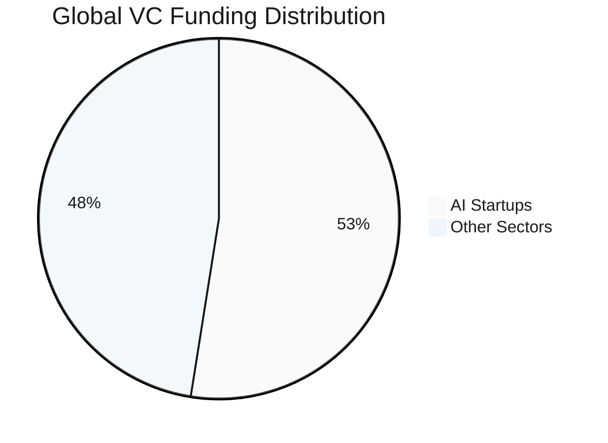
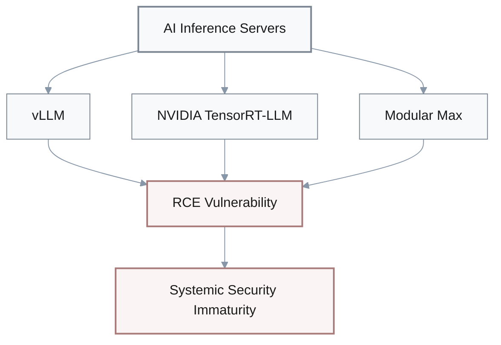
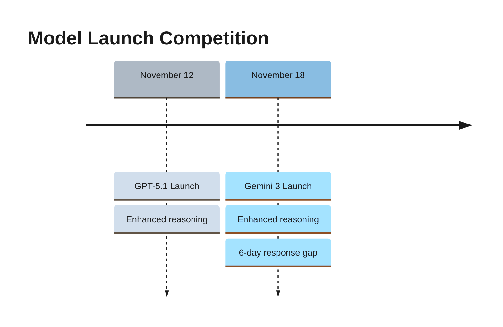
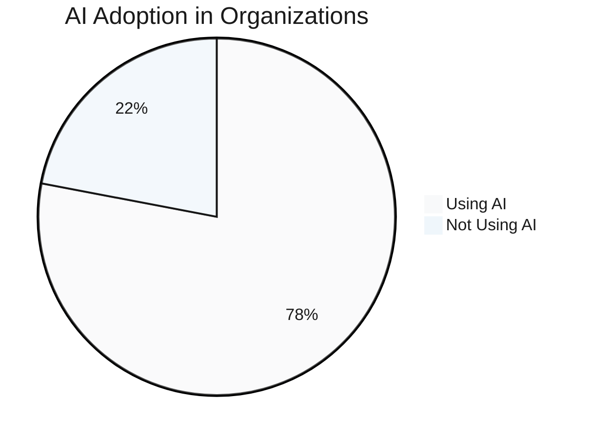
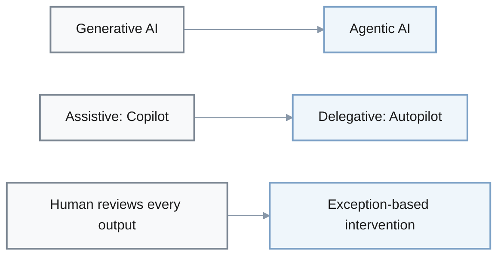
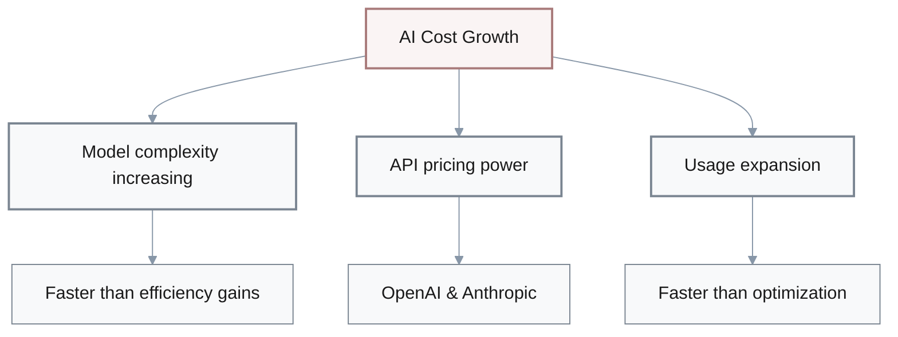
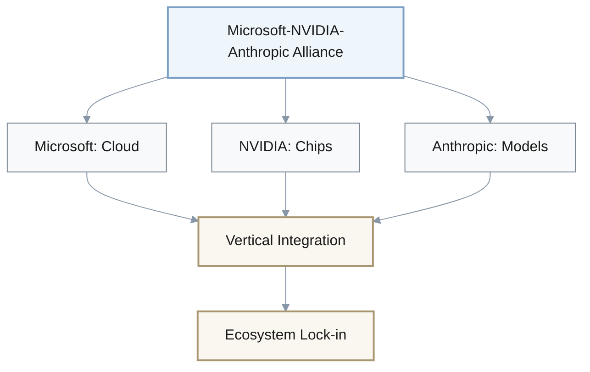

# Discussion - Reflection Questions

---

## 1. VC Funding Concentration & Competitive Dynamics

**Question:** AI startups captured 52.5% of global VC funding—$192.7B year-to-date—with U.S. AI startups at 63% of VC investments. How does this concentration challenge our assumptions about capital availability and competitive dynamics?

### Funding Distribution

| Metric | Value |
|--------|-------|
| Global AI VC Funding | $192.7B (YTD) |
| AI Share of Total VC | 52.5% |
| U.S. AI Share | 63% |
| Market Concentration | Winner-take-most |

### Dialogue

**Founder A:** I assumed VC capital was diversified across sectors.
   
   **Advisor:** Mm-hmm, common assumption. But this reveals capital is heavily momentum-driven, clustering around perceived winners.
   
   **A:** Wait, so the market isn't meritocracy-plus-capital?
   
   **Advisor:** Not quite. It's narrative-driven with extreme winner-take-most dynamics. Differentiation storytelling becomes as critical as technical innovation.
   
   **Founder B:** Hmm... what does this mean for our pitch?
   
   **Advisor:** Good question. Ask yourself: does our pitch clearly articulate why we're different from the thousand-plus other AI startups? Generic "AI-powered X" positioning is insufficient. Need proprietary data moats, unique vertical expertise, or architectural innovations.
   
   **B:** Right, so specificity matters.
   
   **A:** Broader implication?
   
   **Advisor:** Let me think... [pause] This pattern historically precedes market corrections. 52.5% concentration suggests potential bubble dynamics. Risk-adjusted strategy might involve bootstrapping or securing longer-term strategic partnerships rather than pure VC dependence.
   
   **B:** Oh, so diversify funding sources?
   
   **Advisor:** Exactly.

### Key Insights

- **Capital concentration**: 52.5% shows extreme momentum-driven investing
- **Differentiation imperative**: "AI-powered X" positioning insufficient
- **Moat requirements**: Proprietary data, vertical expertise, architectural innovation
- **Risk mitigation**: Diversify funding sources; consider bootstrapping or strategic partnerships
- **Market dynamics**: Pattern suggests potential bubble; concentration historically precedes corrections

---

## 2. AI Infrastructure Security Vulnerabilities

**Question:** Critical RCE vulnerabilities were disclosed simultaneously across major AI inference servers—vLLM, NVIDIA TensorRT-LLM, Modular Max. What does this pattern suggest about AI infrastructure security maturity?

### Vulnerability Pattern

| Vendor | Product | Vulnerability Type |
|--------|---------|-------------------|
| vLLM | Inference Server | RCE (Remote Code Execution) |
| NVIDIA | TensorRT-LLM | RCE |
| Modular | Max | RCE |
| **Pattern** | **Simultaneous disclosure** | **Systemic immaturity** |

### Dialogue

**Security Lead:** Simultaneous disclosure across different vendors—that's a pattern we need to examine.
   
   **Engineer:** Suggests systemic security immaturity?
   
   **Security Lead:** Exactly. AI inference servers are newer infrastructure with less security review than traditional web servers like Apache or nginx.
   
   **Architect:** Right, many treat AI infrastructure as "just another API."
   
   **Security Lead:** True, but these systems handle proprietary model weights and sensitive user queries. Attack surface isn't well-understood yet.
   
   **CTO:** Hmm... so how should we update our risk assessment?
   
   **Security Lead:** Treat AI infrastructure as high-risk, early-maturity technology requiring proactive security posture, not reactive patching. Traditional quarterly patch windows are insufficient.
   
   **Engineer:** Got it. Implications for our operations?
   
   **Security Lead:** Good question. Classify AI infrastructure as Tier 1 critical. Implement defense-in-depth—network segmentation, WAF, anomaly detection—rather than relying on vendor patches. Plus establish 24-hour CVE monitoring for AI and ML dependencies. Budget for 2-4 emergency patch cycles per year.
   
   **CTO:** Makes sense.
   
   **Architect:** And this mirrors early cloud security evolution 2010 to 2015. Expect continued vulnerability discoveries in AI infrastructure over next 2-3 years.
   
   **Engineer:** Oh, so we're still in that early phase.
   
   **Architect:** Correct.

### Security Response Strategy

**Risk Classification:**
- **Tier**: 1 (Critical)
- **Patch window**: 24 hours (not quarterly)
- **Emergency cycles**: 2-4 per year

**Defense-in-depth requirements:**
1. **Network segmentation**: Isolate AI infrastructure
2. **WAF**: Web Application Firewall protection
3. **Anomaly detection**: Real-time monitoring
4. **CVE monitoring**: 24-hour response for AI/ML dependencies

> **Historical parallel:** Mirrors early cloud security evolution (2010-2015). Expect continued vulnerability discoveries in AI infrastructure for next 2-3 years.

---

## 3. Model Release Competition & Strategic Moats

**Question:** GPT-5.1 and Gemini 3 launched within 6 days—November 12 and 18—both emphasizing enhanced reasoning. How does this rapid competitive response challenge our mental model of AI development timelines and strategic moats?

### Launch Timeline

| Model | Vendor | Launch Date | Gap | Focus |
|-------|--------|-------------|-----|-------|
| GPT-5.1 | OpenAI | Nov 12 | - | Enhanced reasoning |
| Gemini 3 | Google | Nov 18 | **6 days** | Enhanced reasoning |

### Dialogue

**Strategist:** 6-day gap—that suggests intense competitive intelligence and strategic timing.
   
   **PM:** You think Google accelerated Gemini 3 to minimize OpenAI's market advantage window?
   
   **Strategist:** Likely. Model releases are becoming product launches, not research publications. Competitors time releases to neutralize each other's advantages.
   
   **Engineer:** Hmm... so first-mover advantage in model capabilities is shrinking?
   
   **Strategist:** Exactly. Measured in days or weeks, not months or quarters.
   
   **PM:** Wait, what does this mean for our product strategy?
   
   **Strategist:** Good question. Building differentiation on base model capabilities alone is increasingly fragile. Moat must come from proprietary fine-tuning data, domain-specific architectures, UX and integration depth, workflow orchestration, enterprise trust and compliance.
   
   **Product Lead:** Oh! So the assumption that "we'll have 6-month advantage if we adopt latest model first" is false.
   
   **Strategist:** Correct. Competitors can match within weeks. This parallels cloud infrastructure commoditization—AWS, Azure, GCP feature parity. AI application layer must focus on customer-specific value, not generic model access.
   
   **Engineer:** I see.
   
   **PM:** Right. So consider: what value do we deliver that persists regardless of which model is "best" this month?
   
   **Product Lead:** Makes sense. Durable advantages only.

### Strategic Implications

**First-mover advantage timeline:**
- **Days to weeks** (not months/quarters)
- Competitors match capabilities rapidly

**Durable moats require:**
1. **Proprietary fine-tuning data**: Domain-specific training sets
2. **Domain architectures**: Specialized model designs
3. **UX & integration depth**: Seamless workflow embedding
4. **Workflow orchestration**: Multi-step task automation
5. **Enterprise trust**: Compliance, security, reliability

> **Key question:** What value do we deliver that persists regardless of which model is "best" this month?

**Historical parallel:** Cloud infrastructure commoditization (AWS/Azure/GCP feature parity) → AI application layer must focus on customer-specific value, not generic model access.

---

## 4. AI Adoption Curve & Transformation Cycle

**Question:** 78% of organizations using AI in at least one business function, with emphasis shifting from content generation to autonomous task execution. How does this adoption curve update our understanding of where we are in the AI transformation cycle?

### Adoption Metrics

| Metric | Value | Interpretation |
|--------|-------|----------------|
| Organizations using AI | 78% | Broad experimentation |
| Adoption depth | Shallow | Pilot/PoC phase |
| Market stage | **Early majority** | Not late majority |
| Strategic shift | Generative → **Agentic** | Assistive → Delegative |

### Dialogue

**Analyst:** 78% using AI in "at least one function"—that suggests broad experimentation.
   
   **Strategist:** Mm-hmm, but likely shallow depth. Most organizations are still in pilot or proof-of-concept phase, not production-scale deployment.
   
   **Analyst:** So early majority, not late majority?
   
   **Strategist:** Right. The market shift from generative to agentic is significant though.
   
   **Product Lead:** What's the parallel?
   
   **Strategist:** AI transitioning from assistive technology—copilot—to delegative technology—autopilot. Like software evolution: mainframes to PCs to internet to mobile. Each shift required new mental models of human-computer interaction.
   
   **Engineer:** Got it. Implications for product design?
   
   **Strategist:** Products designed for "human reviews every AI output" will face obsolescence. Next generation requires autonomous execution with exception-based human intervention, self-correction mechanisms, multi-step task planning, tool use and API integration.
   
   **Product Lead:** Hmm... so are we building AI features that reduce work, or AI agents that autonomously complete work?
   
   **Strategist:** Good question. The latter is where market value is concentrating. This challenges comfort zones around control and determinism. Success requires embracing probabilistic autonomy.
   
   **Engineer:** Oh, paradigm shift then.
   
   **Strategist:** Exactly.

### Paradigm Shift: Assistive → Delegative Technology

### Next-Gen Product Requirements

1. **Autonomous execution**: Exception-based human intervention
2. **Self-correction**: Error recovery mechanisms
3. **Multi-step planning**: Complex task orchestration
4. **Tool integration**: API use and external system access

> **Critical question:** Are we building AI features that reduce work, or AI agents that autonomously complete work?

**Historical parallel:** Software evolution (mainframes → PCs → internet → mobile) — each shift required new mental models of human-computer interaction.

---

## 5. AI Infrastructure Cost Trajectory

**Question:** Average AI infrastructure costs projected to surge 36% to $85.5K per month in 2025, with organizations planning over $100K monthly doubling from 20% to 45%. How does this cost trajectory challenge assumptions about AI ROI and long-term viability of current architectures?

### Cost Projections

| Metric | 2024 | 2025 | Change |
|--------|------|------|--------|
| Average monthly cost | $62.9K | $85.5K | **+36%** |
| Orgs spending >$100K/mo | 20% | 45% | **+125%** |
| 5-year projection | - | **5x increase** | If compounded |

$$
\text{Cost Growth Rate} = \frac{\$85.5K - \$62.9K}{\$62.9K} \times 100 = 36\%
$$

$$
\text{5-Year Projection} = \$62.9K \times (1.36)^5 \approx \$314K
$$

### Dialogue

**CFO:** 36% year-over-year cost growth—that's unsustainable long-term.
   
   **Finance Lead:** Mm-hmm. Would lead to 5x cost increase over 5 years if compounded.
   
   **CFO:** Right, this suggests current architectures are inefficient, and the market is willing to overpay during land-grab phase.
   
   **CTO:** Hmm... I assumed AI costs would follow typical cloud economics—declining per-unit costs over time due to scale.
   
   **Architect:** Instead costs are rising. Model complexity increasing faster than efficiency gains, plus API pricing power of OpenAI and Anthropic, and usage expanding faster than optimization.
   
   **CFO:** So how should we treat AI infrastructure costs strategically?
   
   **Finance Lead:** Strategic investment with definitive ROI requirements, not open-ended R&D. Establish hard efficiency targets—cost per transaction, cost per user, cost per dollar revenue.
   
   **CTO:** Got it. Long-term implication?
   
   **Architect:** Let me think... [pause] Cost pressure will drive three strategic responses. Migration to self-hosted open-source models—Llama 3, Mistral—for cost-sensitive use cases. Aggressive prompt optimization and caching. And hybrid architectures—small models for 80% of tasks, premium models for 20%.
   
   **Finance Lead:** Makes sense.
   
   **CFO:** So ask: at what monthly AI spend do our unit economics break? What's our plan if costs increase another 36% next year? This forces architectural decisions now—edge deployment, model distillation, usage-based pricing—rather than reactive cost-cutting later.
   
   **CTO:** Good point. We need to model that out.
   
   **Architect:** Agreed.

### Cost Drivers

### Strategic Response Framework

**Efficiency targets (mandatory):**
- **Cost per transaction**: Track and optimize
- **Cost per user**: Monitor unit economics
- **Cost per dollar revenue**: ROI requirement

**Three strategic responses:**
1. **Migration to open-source**: Llama 3, Mistral for cost-sensitive use cases
2. **Optimization**: Aggressive prompt optimization, caching strategies
3. **Hybrid architecture**: Small models (80% of tasks) + Premium models (20%)

> **Critical questions:**
> - At what monthly AI spend do our unit economics break?
> - What's our plan if costs increase another 36% next year?

**Architectural decisions to make now:**
- Edge deployment
- Model distillation
- Usage-based pricing

---

## 6. Vertical Integration & Ecosystem Lock-in

**Question:** Microsoft-NVIDIA-Anthropic alliance involves $45B in compute commitments and investments, representing 26% of 2025 total AI VC funding. How does this vertical integration challenge assumptions about infrastructure competition and vendor neutrality?

### Alliance Structure

| Metric | Value | Significance |
|--------|-------|--------------|
| Alliance commitment | **$45B** | Massive strategic bet |
| % of 2025 AI VC | **26%** | Dominant market position |
| Integration level | Chip → Cloud → Model | Full vertical stack |
| Market structure | Winner-take-most | Consolidation phase |

### Dialogue

**Strategist:** $45B alliance—that signals end of commoditized, vendor-neutral AI infrastructure.
   
   **Architect:** Right, moving toward vertically integrated ecosystems—chip to cloud to model.
   
   **CTO:** Similar to what?
   
   **Strategist:** Apple's hardware-software integration or AWS's compute-storage-services stack.
   
   **Engineer:** Wait, I assumed AI infrastructure would remain modular and interoperable. Mix-and-match chips, clouds, models.
   
   **Strategist:** Hmm, this alliance suggests winner-take-most consolidation with ecosystem lock-in instead.
   
   **CTO:** Oh. Strategic implication?
   
   **Architect:** Architectural decisions made today—Azure versus AWS, OpenAI versus Anthropic, NVIDIA versus AMD—carry long-term supply chain and pricing implications. Multi-cloud strategy becomes risk mitigation requirement, not just best practice.
   
   **Engineer:** Got it.
   
   **Product Lead:** Good question for competitive dynamics: do we align with dominant ecosystem for preferential access and pricing, maintain independence through multi-vendor architecture, or wait for AWS-GCP competitive response before committing?
   
   **Strategist:** Hmm, let me think... [pause] This mirrors smartphone era consolidation—iOS versus Android. Developers who bet early on winning platforms gained advantages, but platform-agnostic strategies proved more durable.
   
   **CTO:** So consider: what's our platform dependency risk tolerance? How much vendor lock-in is acceptable for 15-25% cost savings?
   
   **Strategist:** Exactly. This trade-off will define infrastructure strategy for next 3-5 years. Treat infrastructure choices as strategic commitments with multi-year implications, not tactical procurement decisions.
   
   **Architect:** Makes sense. Long-term thinking required.
   
   **Product Lead:** Agreed.

### Strategic Implications

**Market shift:**
- From: Modular, vendor-neutral infrastructure (mix-and-match)
- To: **Vertically integrated ecosystems** with lock-in

**Historical parallels:**
1. **Apple**: Hardware-software integration
2. **AWS**: Compute-storage-services stack
3. **Smartphone era**: iOS vs Android consolidation

### Multi-Cloud Strategy Framework

**Three strategic options:**

1. **Align with dominant ecosystem**
   - **Pros**: Preferential access, cost savings (15-25%)
   - **Cons**: Vendor lock-in, dependency risk

2. **Maintain independence**
   - **Pros**: Platform agnostic, flexibility
   - **Cons**: Higher costs, complexity

3. **Wait for competitive response**
   - **Pros**: More options emerge (AWS-GCP)
   - **Cons**: Delayed market entry

> **Critical questions:**
> - What's our platform dependency risk tolerance?
> - How much vendor lock-in is acceptable for 15-25% cost savings?
> - What are multi-year supply chain implications?

**Key insight:** Architectural decisions made today carry **3-5 year strategic implications**. Treat infrastructure choices as strategic commitments, not tactical procurement.

**Lesson from smartphone era:** Developers who bet early on winning platforms gained advantages, but platform-agnostic strategies proved more durable.

---

## Summary: Meta-Insights Across All Questions

### Common Patterns

1. **Concentration dynamics**: Capital, capabilities, and infrastructure consolidating rapidly
2. **Shrinking advantage windows**: Days/weeks instead of months/quarters
3. **Cost pressures**: Unsustainable growth requiring architectural innovation
4. **Maturity gaps**: Security, economics, and operational practices still evolving
5. **Paradigm shifts**: From assistive to autonomous, from modular to integrated

### Strategic Imperatives

- **Differentiation**: Beyond base model capabilities
- **Risk management**: Multi-vendor, defense-in-depth, cost modeling
- **Autonomous design**: Exception-based intervention, not copilot patterns
- **Long-term thinking**: Infrastructure decisions have 3-5 year implications
- **Efficiency discipline**: Hard ROI targets, hybrid architectures, optimization

**Overarching theme:** The AI transformation is accelerating while simultaneously becoming more complex, costly, and concentrated — requiring both speed and strategic discipline.
