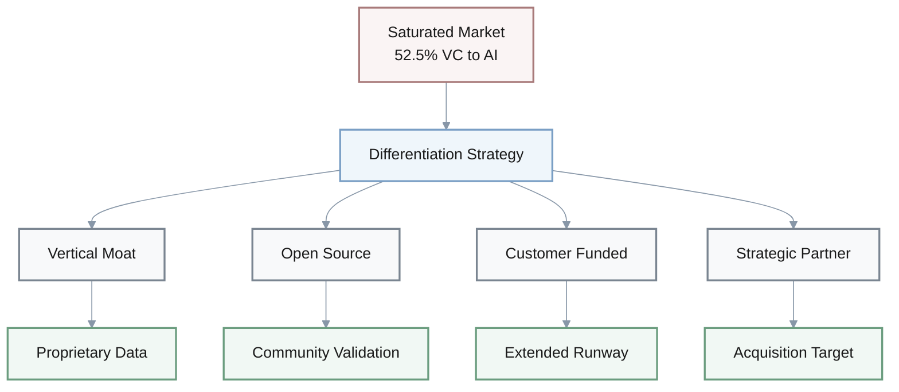
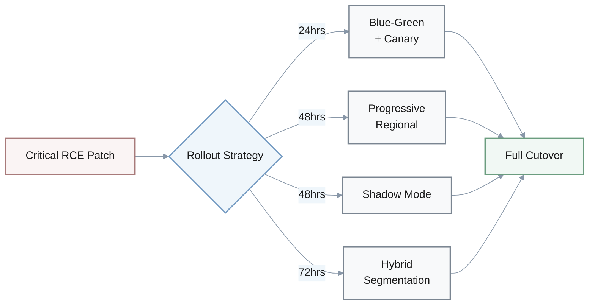
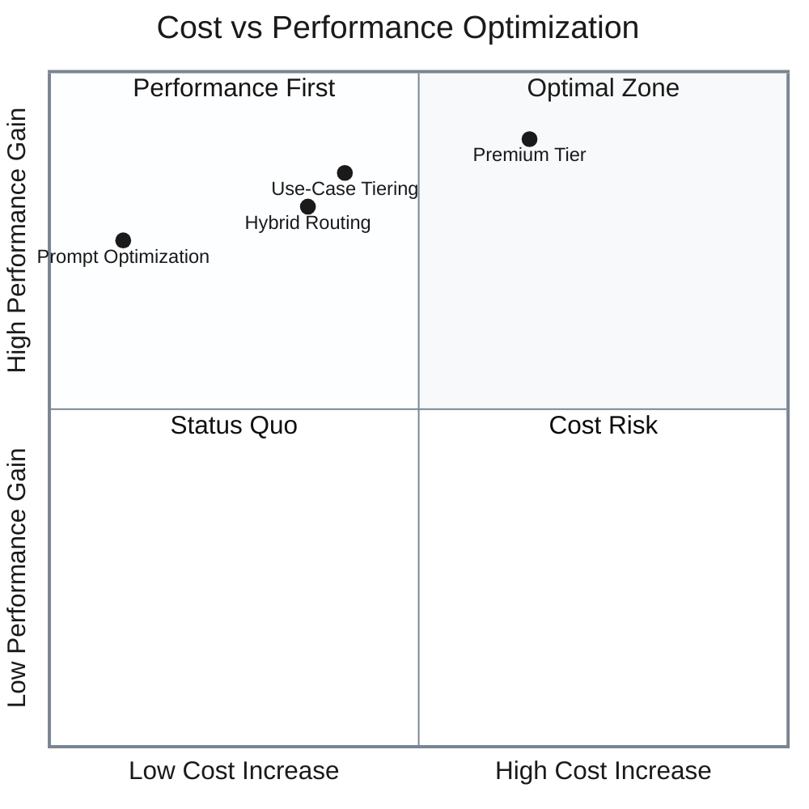
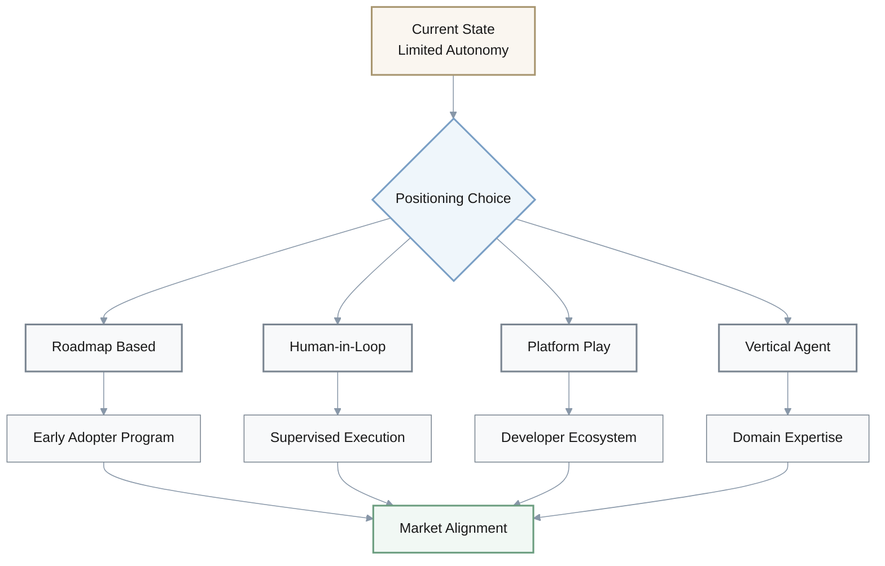
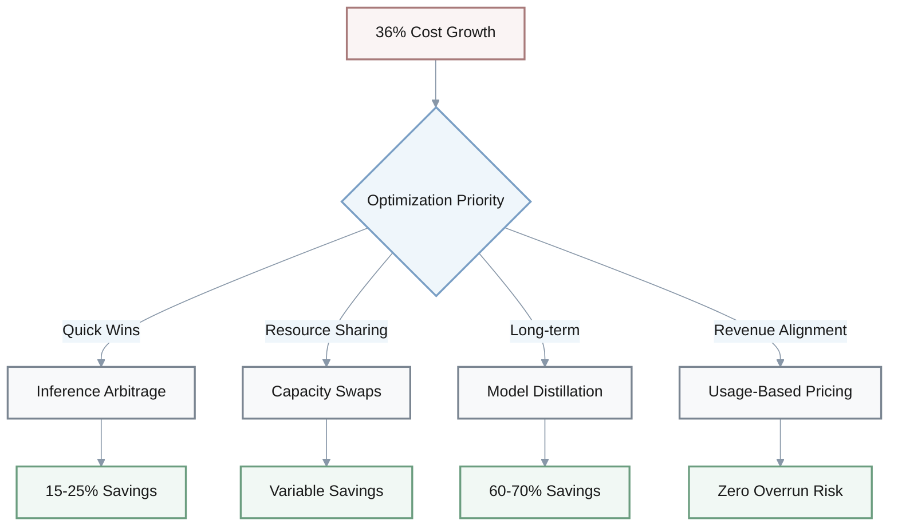
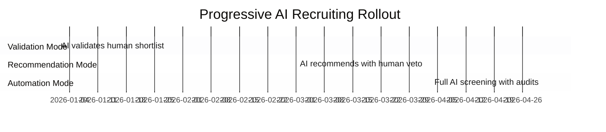

# Extract Creativity Questions

## 1. AI Startup Differentiation in Saturated Fundraising Market

**Context**: AI startup with `<12 months runway` faces crowded fundraising conditions where AI captures **52.5%** of VC funding.

**Question**: Generate 4 alternative differentiation strategies beyond standard investor pitches to stand out in this saturated market.

**Strategic Options**:

| Strategy | Approach | Key Rationale | Impact |
|----------|----------|---------------|--------|
| **Vertical-Specific Moat** | Focus on proprietary datasets/regulatory expertise in underserved verticals (healthcare compliance, legal) | Reduces competition, creates defensible barriers | Lower competition |
| **Open-Source Community** | Release core component as OSS to build community + enterprise upgrade path | Demonstrates traction without funding, attracts acquirers | Community validation |
| **Customer-Funded Growth** | Secure 2-3 anchor customers with prepaid annual contracts | Validates PMF, reduces dilution, improves valuation | Extended runway |
| **Strategic Partnership** | Position as complementary to AI leaders (fine-tuning for Anthropic/OpenAI) | Leverages ecosystem, acquisition target potential | Ecosystem momentum |

---

## 2. Critical Security Patch Deployment with Production Risk

**Context**: CTO must patch critical RCE vulnerabilities in AI inference infrastructure but faces production stability concerns.

**Question**: Generate 4 alternative rollout approaches that balance security urgency with operational risk.

**Deployment Strategies**:

| Strategy | Implementation | Timeline | Risk Mitigation |
|----------|----------------|----------|-----------------|
| **Blue-Green + Canary** | Parallel environment, 5% traffic routing | 24hrs | Minimizes downtime, allows rollback |
| **Progressive Regional** | Dev → Staging → Low-traffic → High-traffic | 48hr intervals | Limits blast radius, early issue detection |
| **Shadow Mode Testing** | Duplicate traffic processing without serving | 48hrs | Zero user impact, comprehensive profiling |
| **Hybrid Segmentation** | Patched servers for low-risk traffic, WAF on old version | 72hrs | Immediate partial protection, validates stability |

---

## 3. Model Migration Cost Optimization

**Context**: Product team evaluates migrating from GPT-4 to GPT-5.1/Gemini 3 with **20-30% cost increases** and uncertain performance gains.

**Question**: Generate 4 alternative strategies to leverage new models without proportional cost increases.

**Cost Optimization Approaches**:

| Strategy | Method | Performance Impact | Cost Impact |
|----------|--------|-------------------|-------------|
| **Use-Case Tiering** | GPT-5.1 for complex tasks (top 20%), GPT-4 for routine | Optimized where needed | Controlled increase |
| **Hybrid Routing** | Cheap model first, escalate when confidence `<0.7` | Quality maintained | Reduced premium usage |
| **Prompt Optimization** | 2 sprints on advanced engineering (CoT, few-shot) for GPT-4 | 70-80% of gains | Zero increase |
| **Premium Tier** | Gemini 3 for premium customers at +30% price | Revenue opportunity | Cost passed through |

**Cost-Performance Trade-off**:

$$
\text{Cost Efficiency} = \frac{\text{Performance Gain (\%)}}{\text{Cost Increase (\%)}} \times 100
$$

---

## 4. Agentic AI Messaging Pivot with Limited Features

**Context**: GTM team needs to emphasize agentic AI capabilities but current product has limited autonomous features.

**Question**: Generate 4 creative approaches to position existing capabilities as agentic without misleading customers.

**Positioning Strategies**:

| Strategy | Positioning | Customer Perception | Technical Accuracy |
|----------|-------------|---------------------|-------------------|
| **Roadmap Pre-Selling** | "Agentic Foundation" + Q2 2026 features early access | Future-focused | Honest timeline |
| **Human-in-Loop Agent** | Supervised agents with approval checkpoints | Safety-conscious | Technically accurate |
| **Agent-Ready Platform** | Emphasize integrations for custom agent building | Developer-friendly | Focus on extensibility |
| **Vertical Specialization** | Domain-specific agents (Sales Intelligence Agent) | Specialized value | Clear boundaries |

**Messaging Evolution**:

---

## 5. AI Cost Growth Management

**Context**: CFO faces **36% AI cost growth** projections but must balance budget prudence with competitive velocity.

**Question**: Generate 4 creative cost optimization strategies beyond standard efficiency measures.

**Cost Optimization Framework**:

| Strategy | Mechanism | Savings Potential | Implementation Complexity |
|----------|-----------|-------------------|--------------------------|
| **Inference Arbitrage** | Dynamic routing to cheapest provider API | 15-25% | Medium |
| **Capacity Swaps** | Share reserved compute with complementary company | Variable | Low |
| **Model Distillation** | GPT-5.1 generates training data → self-hosted small model | 60-70% | High |
| **Usage-Based Pricing** | Pass AI costs to customers via consumption model | Eliminates overrun | Medium |

**Cost Optimization Decision Tree**:

**Savings Calculation**:

$$
\text{Total Savings (\%)} = \frac{\text{Baseline Cost} - \text{Optimized Cost}}{\text{Baseline Cost}} \times 100
$$

---

## 6. AI Recruiting Tools with Bias Risk Mitigation

**Context**: Talent acquisition team must implement AI recruiting tools but faces bias risk concerns from hiring managers.

**Question**: Generate 4 alternative implementation models that maximize efficiency gains while building trust in AI screening.

**Trust-Building Implementation Models**:

| Strategy | Approach | Trust Mechanism | Efficiency vs Risk Balance |
|----------|----------|-----------------|---------------------------|
| **Transparent Scoring** | AI scores with explainable factors, human final decision | Audit trail + human control | High trust, moderate efficiency |
| **Blind Comparative** | Anonymized A/B candidate comparisons | Reduces human bias | Moderate trust, high efficiency |
| **Progressive Rollout** | 3-phase validation → recommendation → automation | Demonstrated accuracy | Builds trust over time |
| **Bias Bounty** | Public methodology + reward bias detection | Crowdsourced oversight | Continuous improvement |

**Progressive Rollout Timeline**:

**Bias Risk Matrix**:

| Implementation | Bias Detection | Accountability | Transparency | Trust Level |
|----------------|----------------|----------------|--------------|-------------|
| Transparent Scoring | Medium | High | High | ⭐⭐⭐⭐ |
| Blind Comparative | High | Medium | Medium | ⭐⭐⭐ |
| Progressive Rollout | High | High | High | ⭐⭐⭐⭐⭐ |
| Bias Bounty | Very High | High | Very High | ⭐⭐⭐⭐⭐ |
