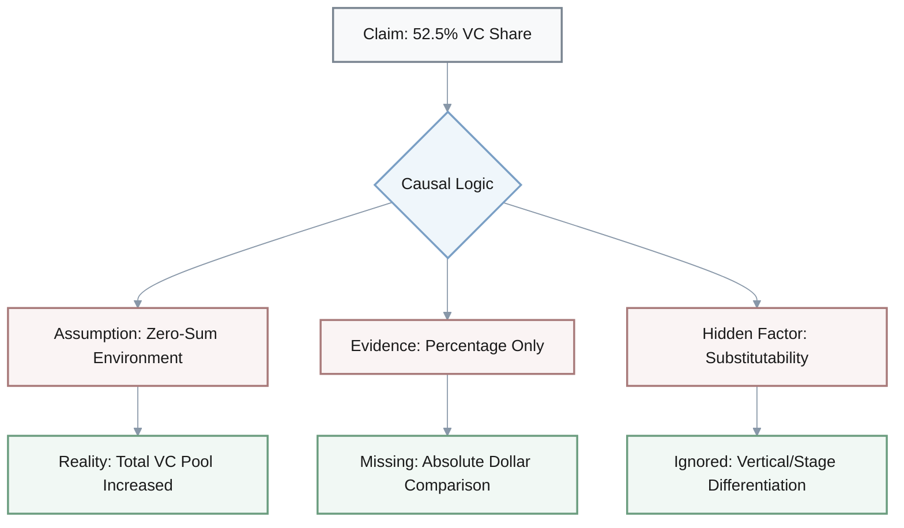
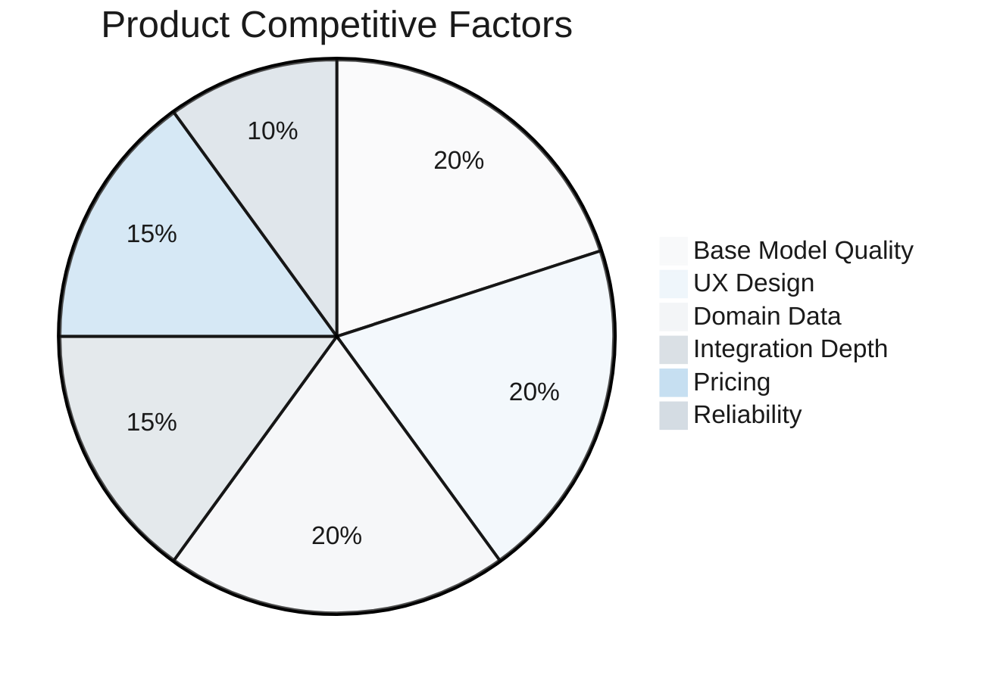
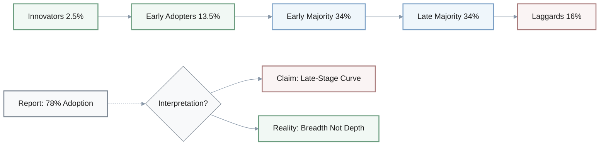
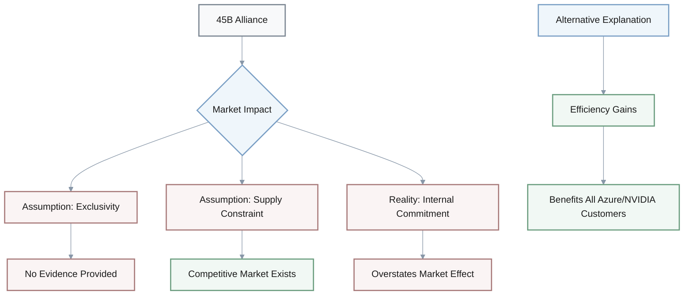
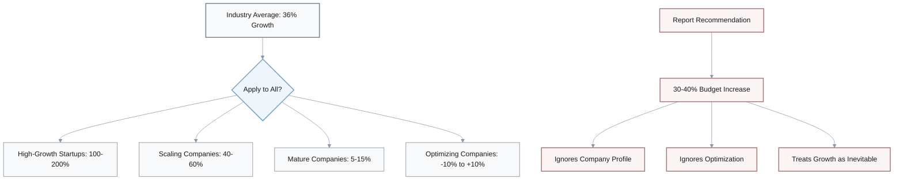
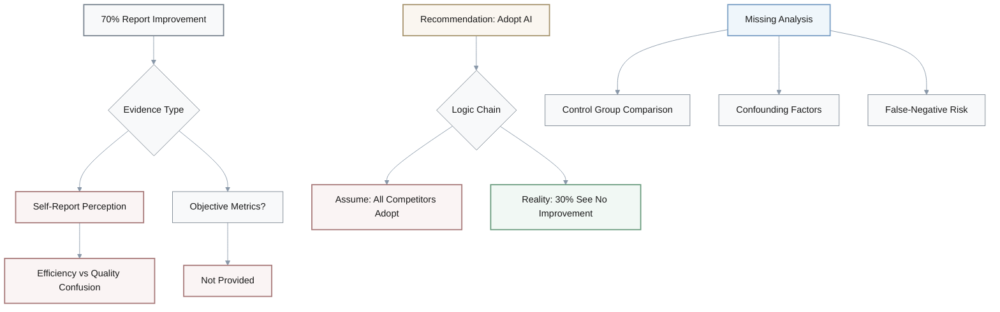

# Extract Critical Thinking Questions

---

## 1. VC Funding Concentration Risk

**Question**: The report claims that AI startups capturing 52.5% of global VC funding creates "runway compression risk" for Formation-stage companies unable to differentiate. Evaluate this causal argument: Does high VC concentration in AI necessarily cause fundraising difficulty for new entrants?

### Analysis Framework

### Critical Analysis

| Issue Type | Problem Identified | Counter-Argument |
|------------|-------------------|------------------|
| **Logical Issue** | Assumes zero-sum fundraising environment | VC capital deployed increased overall—not just AI's share of static pool. High concentration could signal abundant capital for validated AI concepts. |
| **Evidence Gap** | No absolute dollar comparison provided | Percentage share alone doesn't indicate fundraising difficulty. Need 2024 vs 2025 dollar availability data. |
| **Hidden Assumption** | Treats all AI startups as substitutable | Ignores differentiation by vertical, stage, or technical approach in VC evaluation. |

### Strengthening Requirements

To validate this claim, provide:
1. **Success rate** of seed rounds: 2024 vs 2025 comparison
2. **Time-to-close metrics**: Evidence of delayed fundraising
3. **Valuation compression**: Data showing pricing pressure

---

## 2. RCE Vulnerability Patching Timeline

**Question**: The report recommends patching critical RCE vulnerabilities within 2 weeks, calling it an "immediate production compromise risk." Assess the reasoning: Is 2 weeks the appropriate threshold given that vulnerabilities were just disclosed and no active exploits are mentioned?

### Risk Assessment Matrix

| Risk Factor | Report's Position | Counter-Analysis |
|-------------|-------------------|------------------|
| **Assumption** | High exploit development probability post-disclosure | No evidence of active exploitation or proof-of-concept availability provided |
| **Risk Framing** | "Immediate compromise risk" | May overstate urgency if exploits require sophisticated chains or authenticated access (not specified) |
| **Trade-off Analysis** | Emphasizes security upside only | Doesn't quantify downtime risk or regression risk from rushed patching |
| **Context Sensitivity** | Universal 2-week recommendation | Internet-facing vs air-gapped AI infrastructure have different risk profiles |

### Missing Evidence

To justify the 2-week timeline, provide:
1. **CVSS severity scores**: Quantitative risk measurement
2. **Exploit complexity assessment**: Technical difficulty and prerequisites
3. **Historical data**: Exploitation timelines for similar CVEs
4. **Attack surface analysis**: Public-facing vs internal systems

> **Alternative Interpretation**: 2-week timeline may be reasonable *best practice* for internet-facing services, but individual risk profiles should drive actual timelines.

---

## 3. Model Superiority and Competitive Disadvantage

**Question**: The report argues that products built on older models "face competitive disadvantage in reasoning-heavy use cases" after GPT-5.1/Gemini 3 launches. Evaluate this claim: Does model superiority directly translate to competitive disadvantage?

### Competitive Differentiation Factors

### Critical Weaknesses

| Issue Type | Problem | Impact on Claim Validity |
|-----------|---------|-------------------------|
| **Oversimplification** | Assumes reasoning quality is primary differentiator | Ignores UX, domain data, integration depth, pricing, and reliability—factors orthogonal to base model |
| **Temporal Assumption** | Assumes immediate market switching | B2B customers typically have 6-12 month evaluation cycles, delaying competitive impact |
| **Evidence Quality** | No empirical data provided | Missing: customer churn data, win/loss analysis, NPS shifts correlated with model launches |
| **Confounding Variables** | GPT-5.1 launched 10 days before report | Insufficient time to measure actual market impact |

### Validation Requirements

Historical analysis needed:
1. **Past model launches**: Competitive shifts after previous GPT/Gemini releases
2. **Customer surveys**: Model version importance as buying criteria
3. **Pricing elasticity**: Willingness to pay for reasoning quality improvements
4. **Switching costs**: Time and resources required for model migration

---

## 4. AI Adoption Curve Interpretation

**Question**: The report claims that 78% AI adoption in at least one business function indicates "late-stage adoption curve" with laggards now evaluating vendors. Assess this interpretation of the 78% statistic.

### Rogers' Adoption Curve vs Report's Interpretation

### Analytical Errors

| Error Type | Description | Impact |
|-----------|-------------|--------|
| **Classification Error** | "At least one function" is extremely broad | Could mean experimental pilot OR production-critical deployment—78% may represent early-stage testing |
| **Curve Misapplication** | Late-stage = 70%+ *mature* deployment | Statistic measures breadth (one function) not depth (maturity level) |
| **Causal Reasoning Flaw** | 78% doesn't prove laggards are evaluating | Could indicate market saturation with limited new buyer opportunity |
| **Missing Context** | No historical comparison | If previous rate was 75%, this indicates plateau, not acceleration |

### Adoption Maturity Spectrum

| Maturity Stage | Description | Likely % of 78% |
|----------------|-------------|----------------|
| **Pilot/POC** | Experimental, non-critical | ~40-50% |
| **Limited Production** | 1-2 functions, non-core | ~25-30% |
| **Integrated** | Multiple functions, some core | ~15-20% |
| **Enterprise-wide** | Organization-wide, mission-critical | ~5-10% |

### Strengthening Requirements

1. **Adoption maturity segmentation**: Pilot vs production deployment rates
2. **Year-over-year growth**: Historical trend data (e.g., 6-12 months prior)
3. **Intent-to-purchase**: Data from the 22% non-adopters
4. **Depth metrics**: Average number of functions using AI per organization

---

## 5. Strategic Alliance Supply Risk

**Question**: The report argues that a $45B Microsoft-NVIDIA-Anthropic alliance creates "preferential access patterns" and "supply concentration risk" for non-aligned organizations. Evaluate this reasoning and its implicit assumptions.

### Alliance Impact Flow

### Assumption Analysis

| Assumption Type | Report's Position | Counter-Evidence |
|----------------|-------------------|------------------|
| **Exclusivity** | Alliance restricts non-partner access | No evidence of exclusivity clauses or capacity restrictions provided |
| **Market Structure** | AI infrastructure is supply-constrained | Recent GPU availability improvements and alternative providers (AMD, Google TPU) suggest competitive market |
| **Financial Impact** | $45B affects external market | Figure includes internal compute commitments—not just market-affecting external sales |

### Alternative Interpretation

The alliance may signal:
- **Vertical integration efficiency**: Reduced coordination costs
- **Economies of scale**: Lower per-unit costs
- **Broad market benefit**: All Azure/NVIDIA customers gain from infrastructure improvements

$$
\text{Market Impact} = \text{External Sales} \times \text{Exclusivity Factor} \neq \$45\text{B Total}
$$

### Evidence Requirements

To validate "preferential access" and "supply risk" claims:
1. **Preferential terms**: Documentation of pricing/access advantages
2. **Capacity allocation**: Data showing non-partner disadvantage
3. **Historical precedent**: Similar infrastructure alliances and outcomes
4. **Competitive response**: AWS/GCP reactions indicating perceived threat

> **Key Question**: Is this anti-competitive restriction or pro-competitive efficiency?

---

## 6. AI Budget Planning Methodology

**Question**: The report recommends increasing FY2026 AI budgets by 30-40% based on industry average cost growth of 36%. Evaluate the logic: Should individual organizations budget based on industry averages?

### Industry Average Fallacy

### Statistical Reasoning Errors

| Error Type | Description | Impact |
|-----------|-------------|--------|
| **Aggregation Fallacy** | Industry average masks vastly different usage patterns | Inference-heavy vs training-heavy, production vs R&D have different cost drivers |
| **Survivorship Bias** | Average inflated by high-growth companies | Mature companies with stable usage may see <10% growth, not 36% |
| **Optimization Ignored** | Treats cost growth as inevitable | Efficiency gains could offset usage increases—not considered |
| **Strategic Mismatch** | One-size-fits-all recommendation | Doesn't account for self-hosting, architectural optimization, or usage reduction strategies |

### Cost Growth by Company Profile

| Company Profile | Typical AI Usage | Expected Cost Growth | Budget Strategy |
|----------------|------------------|---------------------|----------------|
| **Early-Stage Startup** | Aggressive feature expansion | 80-150% | Growth-focused |
| **Scaling Company** | Production deployment | 40-70% | Balanced |
| **Mature Enterprise** | Stable production workload | 10-20% | Efficiency-focused |
| **Cost-Optimizing** | Architecture refactoring | -10% to +15% | Optimization-first |

### Better Budgeting Approach

$$
\text{Budget} = \text{Baseline} + (\text{Feature Roadmap} \times \text{Unit Cost}) - \text{Optimization Savings}
$$

**Components:**
1. **Baseline**: Current production costs
2. **Feature Roadmap**: Planned new capabilities with estimated usage
3. **Unit Cost**: Model pricing, compute costs (may decrease over time)
4. **Optimization Savings**: Caching, prompt engineering, model selection improvements

### Validation Requirements

Replace industry average with company-specific analysis:
1. **Usage pattern segmentation**: Profile by workload type
2. **Feature roadmap modeling**: Bottom-up cost projection
3. **Optimization opportunities**: Architectural improvements, provider switching
4. **Scenario planning**: Best/base/worst case with elasticity assumptions

---

## 7. AI Recruiting Tool Effectiveness

**Question**: The report states that 70% of hiring managers report AI improves hiring decisions, then recommends implementing AI recruiting tools to avoid "competitive disadvantage." Assess the strength of this argument.

### Evidence Quality Analysis

### Analytical Weaknesses

| Issue Type | Problem | Why It Matters |
|-----------|---------|----------------|
| **Self-Report Bias** | "Hiring managers report" = subjective perception | Not objective quality-of-hire data. Managers may conflate efficiency gains with quality improvements. |
| **Correlation vs Causation** | No control group comparison | AI adopters may have better HR processes, higher budgets, or other factors driving outcomes. |
| **Counter-Evidence Ignored** | Acknowledges candidate rejection concerns | Doesn't quantify false-negative risk against reported benefits. |
| **Competitive Logic Flaw** | Assumes universal adoption | 30% of managers see no improvement—potential negative selection for non-adopters. |

### Perception vs Reality Gap

| What Report Measures | What Actually Matters |
|---------------------|---------------------|
| Hiring manager perception | Actual hire quality (retention, performance) |
| Efficiency improvements | Quality-adjusted efficiency |
| 70% adoption sentiment | Objective hiring outcomes |
| Competitive pressure | ROI and risk-adjusted returns |

### Missing Evidence for Strong Claim

To justify AI recruiting adoption:

**Objective Outcome Metrics:**
1. **Quality-of-hire**: 12-month retention rates, performance review scores
2. **Controlled studies**: AI-screened vs human-screened candidate outcomes
3. **Bias analysis**: Long-term discrimination/litigation rates
4. **Market performance**: Company growth correlated with AI recruiting adoption

**Cost-Benefit Analysis:**
$$
\text{Net Benefit} = \text{Quality Gain} + \text{Efficiency Gain} - \text{False Negative Cost} - \text{Implementation Cost}
$$

**Risk Factors to Quantify:**
- False negative rate (qualified candidates rejected)
- Legal/reputation risk from algorithmic bias
- Integration complexity with existing HR systems

> **Critical Gap**: Report conflates *perceived improvement* with *actual improvement* without objective validation.

### Alternative Interpretation

The 70% statistic may indicate:
- **Efficiency gains** (faster screening) misperceived as quality gains
- **Selection bias**: Early adopters may already have superior HR practices
- **Confirmation bias**: Managers justifying investment decisions

**Better recommendation**: Pilot AI recruiting with A/B testing and objective metrics before full adoption.

---
