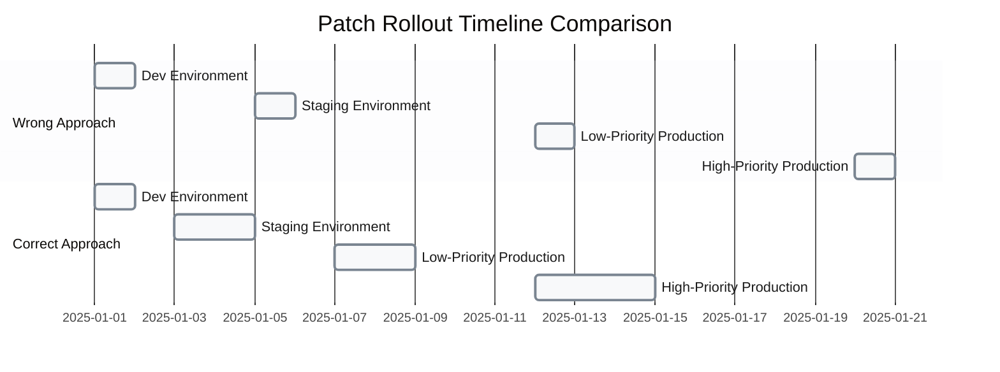
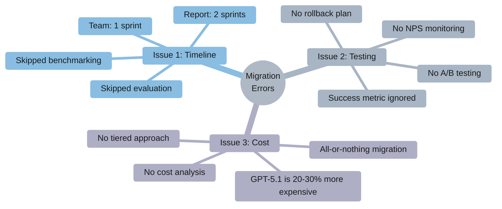
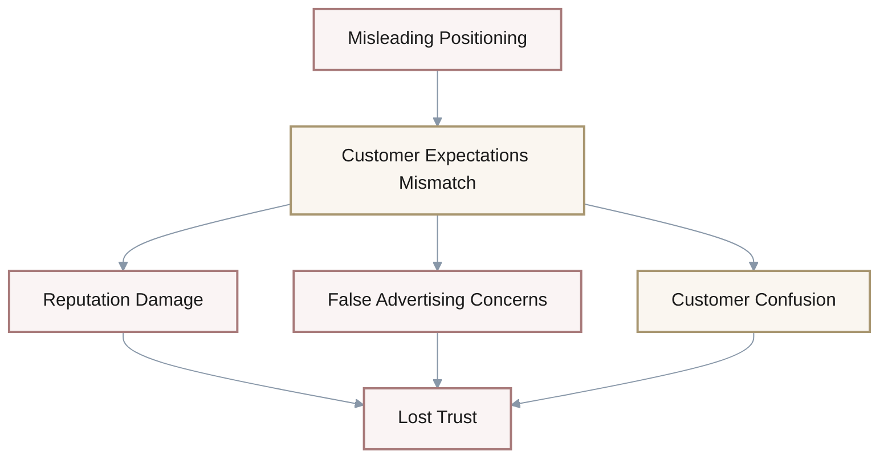
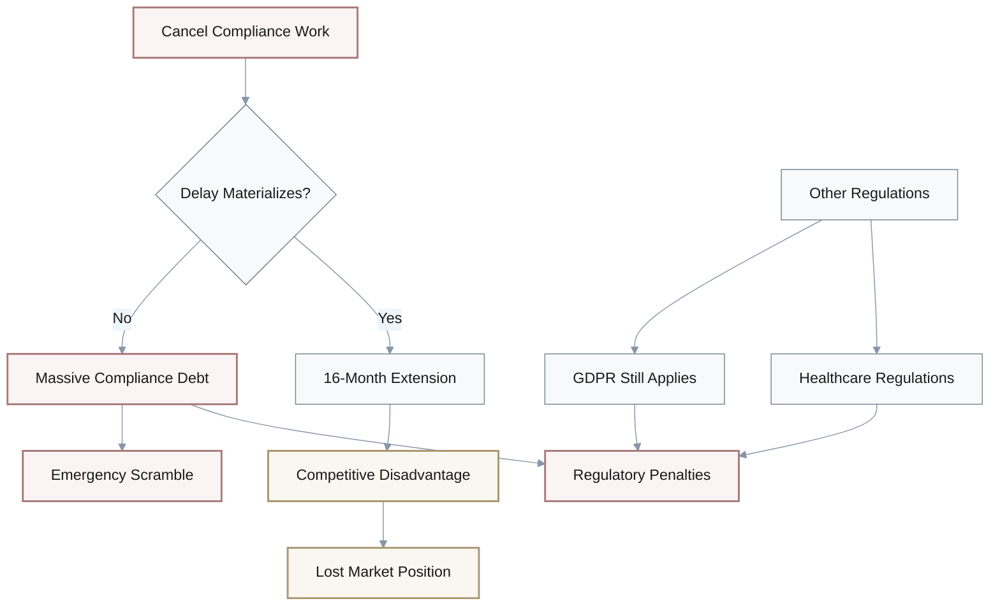
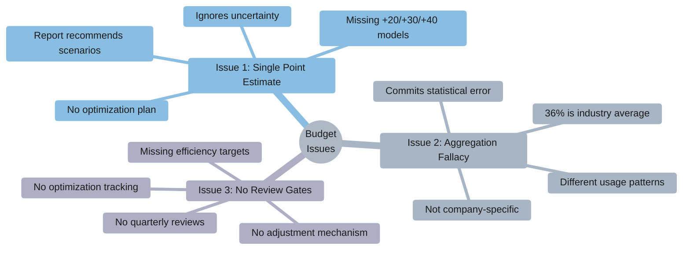
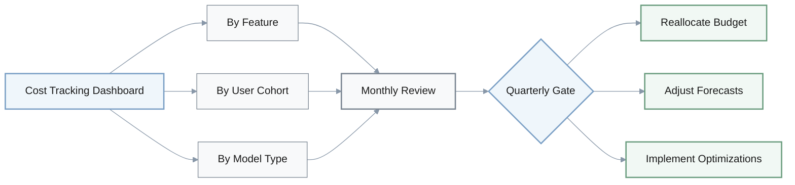

# Extract Debug Cards

## Card 1: CAC Increase Underestimation

**Scenario**: A CFO models 12-month runway assuming CAC will increase 10-15% due to AI startup competition. The report states AI startups captured 52.5% of VC funding with competitors likely to outspend on customer acquisition.

### Issue
- **10-15% assumption significantly underestimates competitive pressure**
- Report explicitly states CAC may increase **20-40%**, not 10-15%
- Underestimating by half the actual projected increase

### Impact
$$\text{Runway Miscalculation} = 2\text{ to }4\text{ months shortfall}$$

| Risk | Consequence |
|------|-------------|
| Cash exhaustion earlier than planned | Emergency fundraising |
| Insufficient buffer | Potential layoffs |
| Operational disruption | Business continuity risk |

### Correction Approach

| Aspect | Wrong Approach | Correct Approach |
|--------|----------------|------------------|
| **Assumption** | Single 10-15% estimate | 20-40% range or three scenarios |
| **Modeling** | Point estimate | Scenario analysis (20%, 30%, 40%) |
| **Analysis** | Basic projection | Sensitivity analysis with cash exhaustion dates |
| **Conservative Planning** | Use midpoint (12.5%) | Use 40% for Formation-stage (<12mo runway) |

**Recommended Action**: Model three scenarios with clear decision triggers at each CAC threshold level.

---

## Card 2: Vulnerability Patch Timeline Violation

**Scenario**: An engineering team plans staged rollout of critical RCE vulnerability patches across environments over 20 days.

### Timeline Comparison

### Issue
- **20-day timeline violates report's "within 2 weeks" (14 days) recommendation**
- Critical RCE vulnerabilities expose production systems to immediate compromise
- High-priority systems patched last, extending exposure window

### Impact
$$\text{Increased Exploitation Window} = 43\% = \frac{20 - 14}{14} \times 100$$

**Risks**:
- Data exfiltration during extended exposure
- Service disruption from active exploitation
- Regulatory penalties for delayed patching
- Reputational damage

### Correction

**Compressed Timeline**:
1. **Dev** (Day 1)
2. **Staging** (Day 3-4) + 24hr monitoring
3. **Low-Priority Prod** (Day 7-8) + 24hr monitoring
4. **High-Priority Prod** (Day 12-14) + continuous monitoring

**Alternative for Mission-Critical Systems** (Option 3 from report):
- Implement temporary workarounds **immediately**:
  - Network segmentation
  - WAF rules
- Test patches in parallel
- Deploy when validated

---

## Card 3: Hasty GPT-5.1 Migration

**Scenario**: Product team decides to migrate all features to GPT-5.1 immediately after reading it "significantly outperforms" GPT-4, allocating 1 sprint for full migration without A/B testing.

### Issues Breakdown

### Impact Analysis

| Risk Category | Consequence |
|---------------|-------------|
| **Technical** | Integration bugs, system instability |
| **User Experience** | Potential UX degradation without validation |
| **Financial** | 20-30% unexpected cost increase |
| **Operational** | No rollback strategy if issues arise |

### Correction: Five-Phase Approach

**Proper Migration Process**:

1. **Define Scope** (Week 1)
   - Identify top 3 reasoning-critical use cases
   - Prioritize by business value

2. **Benchmark** (Weeks 2-3)
   - Allocate 2 sprints for evaluation
   - Test 20-30 cases from production data
   - Run parallel GPT-4 vs GPT-5.1 comparison

3. **Pilot Migration** (Week 4)
   - Migrate highest-value use case only
   - Implement A/B testing
   - Set success threshold: **no >5% NPS degradation**

4. **Monitor** (Weeks 5-8)
   - Bi-weekly NPS/satisfaction tracking
   - Cost analysis per use case
   - Performance metrics dashboard

5. **Stage Rollout** (Week 9+)
   - Migrate additional features only if criteria met
   - Continue cost-performance monitoring

**Success Metrics**:
- NPS degradation < 5%
- Cost increase justified by value
- Technical stability maintained

---

## Card 4: Misleading Agentic AI Positioning

**Scenario**: Marketing team repositions product as "autonomous AI agents" despite having only basic workflow automation, citing 78% enterprise adoption finding.

### Capability Gap Analysis

| Dimension | Report Definition | Current Product | Gap |
|-----------|-------------------|-----------------|-----|
| **Autonomy** | Autonomous task execution | Manual triggers | ❌ Missing |
| **Tool Use** | External tool integration | Basic APIs only | ⚠️ Limited |
| **Orchestration** | Complex workflow coordination | Simple automation | ❌ Missing |
| **Minimum Threshold** | 2+ agentic capabilities | 0-1 capabilities | ❌ Below threshold |

### Issue
- **Product doesn't meet report's agentic AI definition**
- Report recommends **"Option 3 - Product-First Approach"** when features non-existent
- Messaging pivot only recommended if product has **2+ agentic capabilities**

### Impact

### Correction Options

| Option | Timeline | Approach | Best For |
|--------|----------|----------|----------|
| **Option 2: Gradual Evolution** | Immediate | A/B test agentic messaging in new campaigns only | Risk-averse organizations |
| **Option 3: Product-First** | 3-6 months | Build genuine capabilities before repositioning | Quality-focused brands |
| **Alternative Framing** | Immediate | Use "Human-in-Loop Agent" messaging | Honest communication |

**Recommended**: Option 3 or Alternative Framing to maintain credibility and avoid overpromising.

---

## Card 5: AI Act Compliance Cancellation

**Scenario**: CTO reads about potential 16-month EU Digital Omnibus delay and cancels all AI Act compliance work for 2026, redirecting resources to product development. Company operates healthcare AI tools in EU market.

### Regulatory Context

**Healthcare AI Classification**:
- Qualifies as **high-risk** under AI Act Annex III
- Subject to stricter requirements regardless of timeline
- GDPR and sector-specific regulations still apply

### Issue
- **Decision contradicts report's explicit guidance**
- Report recommends **"Option 1 - Maintain Original Timeline"** for high-risk exposure
- Healthcare specifically listed as regulated industry requiring continued compliance

### Impact Analysis

### Correction: Maintain Compliance Timeline

**Follow Report's Option 1**:

**Core Activities to Continue**:
- Model documentation and lineage tracking
- Data governance frameworks
- Explainability mechanisms
- Risk assessment procedures

**Benefits**:
- ✅ Readiness regardless of final timeline
- ✅ Competitive advantage if standards tighten
- ✅ Demonstrates regulatory good faith
- ✅ Foundational work applies to other regulations

**Target**: August 2026 compliance readiness (original timeline)

---

## Card 6: Naive AI Infrastructure Budgeting

**Scenario**: CFO allocates exactly $68K/month for AI infrastructure in 2026 based on report's projection from current $50K/month (+36% growth), presenting this as "data-driven" budget.

### Budget Projection Analysis

$$\text{Projected Budget} = \$50\text{K} \times 1.36 = \$68\text{K/month}$$

### Three Critical Issues

### Impact

| Problem | Consequence |
|---------|-------------|
| **Budget too high** | Wasted capital allocation |
| **Budget too low** | Mid-year scramble for funds |
| **No flexibility** | Cannot adapt to changing patterns |
| **Missed optimization** | Forgo 15-20% potential savings |

### Correction: Scenario-Based Budget

**Step 1: Model Three Scenarios**

| Scenario | Monthly Cost | Annual Cost | Assumptions |
|----------|-------------|-------------|-------------|
| **Base Case** | $60K (+20%) | $720K | Moderate growth, optimizations applied |
| **Moderate** | $65K (+30%) | $780K | Current trajectory, some optimization |
| **Aggressive** | $70K (+40%) | $840K | High adoption, limited optimization |

**Step 2: Implement Cost Tracking**

**Step 3: Prioritize Top 3 Optimization Opportunities**

1. **Prompt Caching**: Reduce redundant API calls
2. **Model Downgrading**: Use cheaper models for low-value requests
3. **Usage-Based Throttling**: Implement rate limits per user tier

**Expected Efficiency Gain**: 15-20% cost reduction

**Step 4: Governance Structure**
- **Monthly**: AI cost review with Engineering
- **Quarterly**: Decision gates to reallocate based on actual burn rate
- **Success Metric**: Stay within scenario range while maximizing feature delivery
