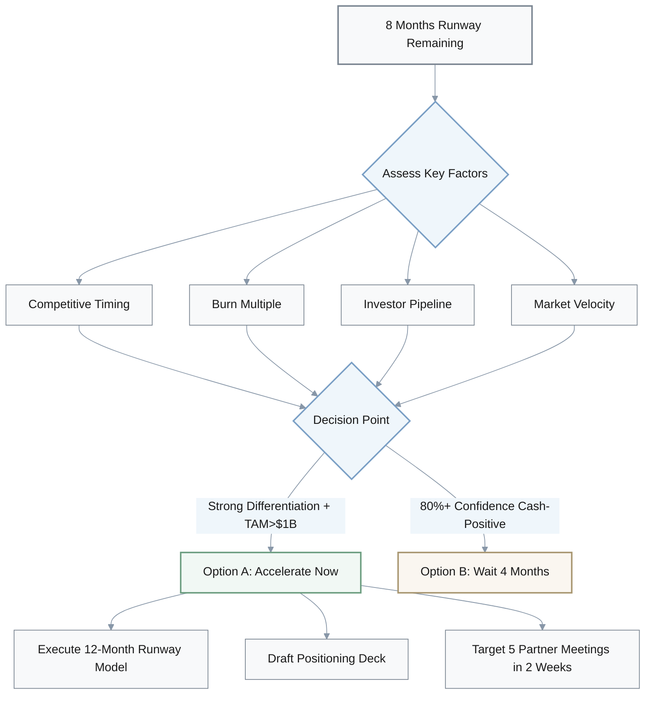
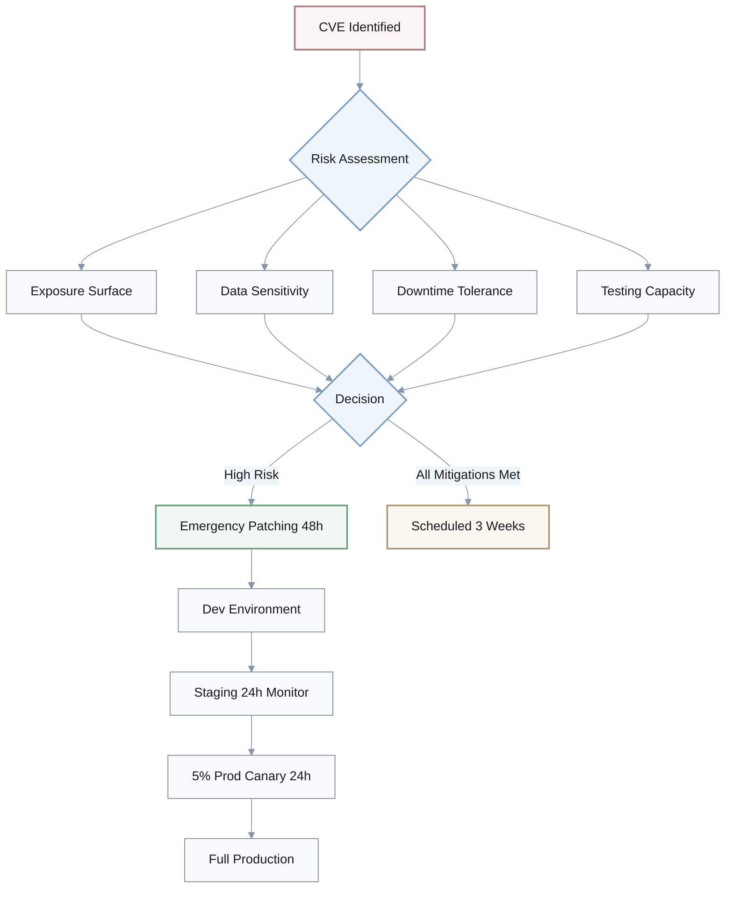
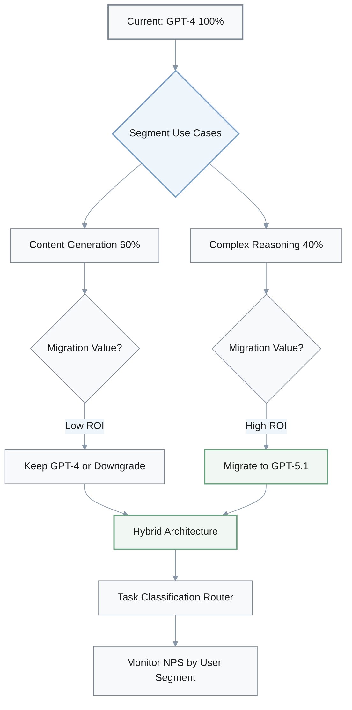
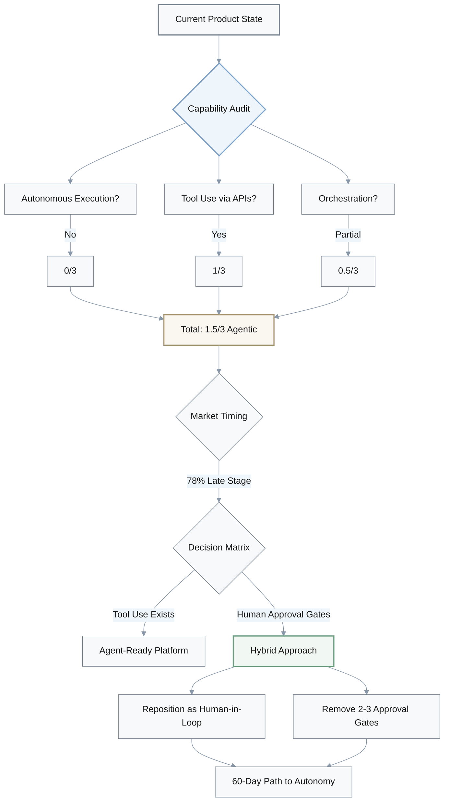
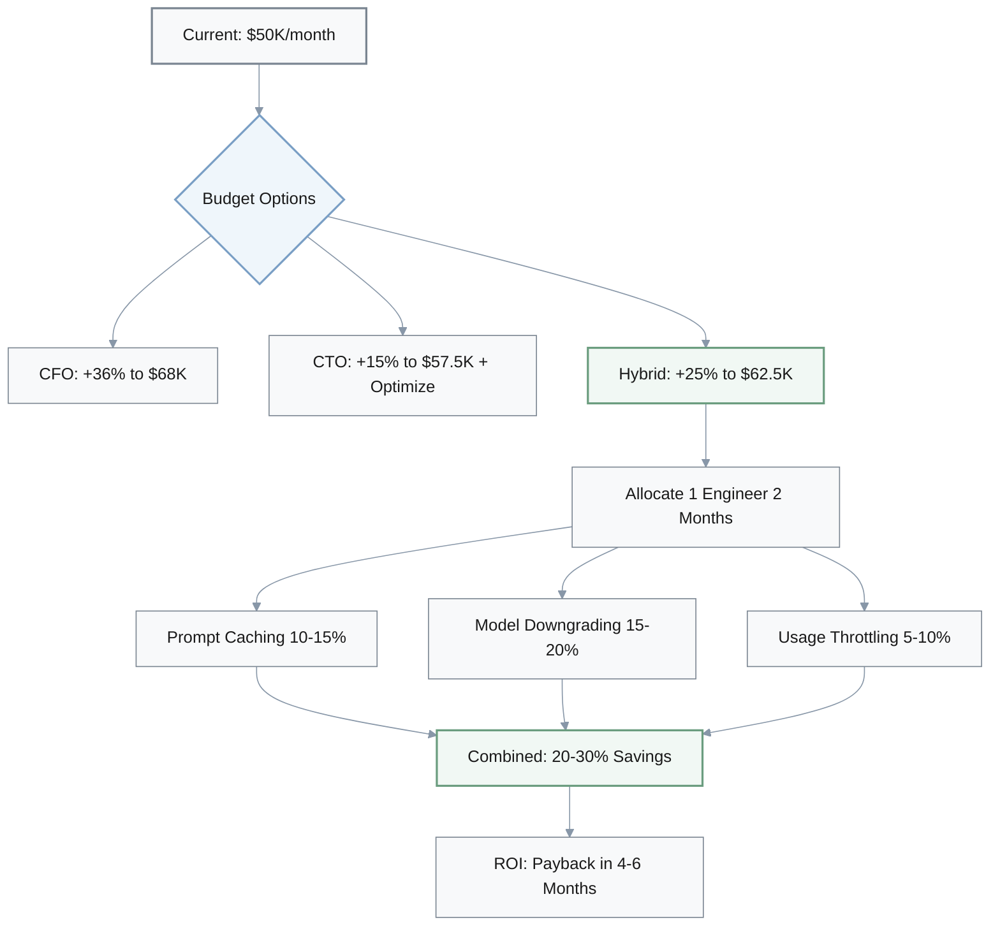
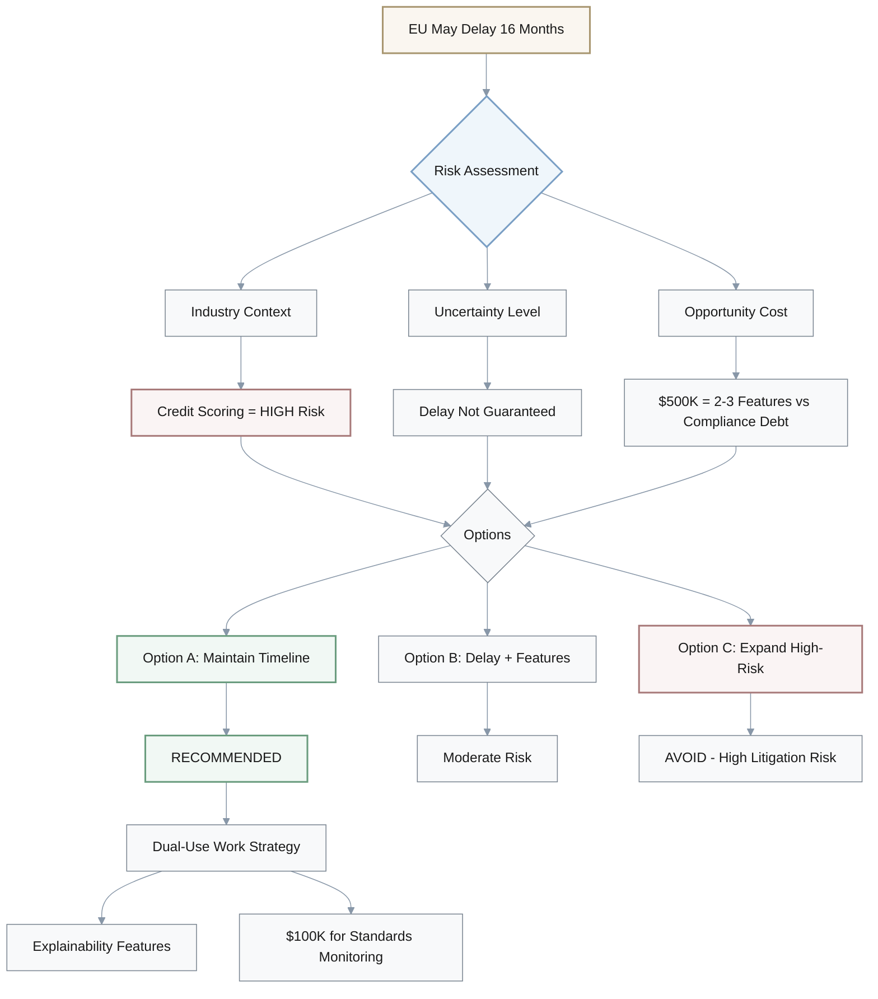

# Extract Decision Questions

## 1. Fundraising Timing: Accelerate Now vs. Wait for Profitability

**Q:** Your AI startup has 8 months of runway remaining. AI startups captured 52.5% of global VC ($192.7B YTD), creating intense competition. You can either (A) accelerate fundraising now with strong technical traction but limited revenue, or (B) delay 4 months to reach profitability milestones but risk competitor market capture. What would you do and why?

**A: Decision Framework**

### Assessment Criteria

| Factor | Favor Option A (Accelerate) | Favor Option B (Delay) |
|--------|----------------------------|------------------------|
| **Competitive Timing** | 3+ direct competitors raised Series A | Market window still open |
| **Burn Multiple** | Any level | <$100K to profitability |
| **Investor Pipeline** | 15-20 warm VC introductions | Cold outreach required |
| **Market Position** | Strong technical differentiation | Need revenue validation |

### Decision Criteria

**Choose Option A if:**
- ✅ Differentiation story is compelling
- ✅ TAM >$1B
- ✅ Technical risk is largely retired

**Choose Option B only if:**
- ⚠️ Cash-flow positive within 4 months is **highly certain** (>80% confidence)

### Action Plan (Option A)

1. **Financial Modeling**: Execute CFO's 12-month cash runway model with 20-40% CAC increase
2. **Positioning**: Draft differentiated positioning deck immediately
3. **Execution**: Target 5 partner meetings within 2 weeks

**Key Context:** In 52.5% VC concentration environment, capital is available but competitive—technical differentiation + proprietary data moats are critical.

---

## 2. Security Patching: Emergency vs. Scheduled Maintenance

**Q:** You operate AI inference infrastructure affected by CVE-2025-30165 (vLLM) and CVE-2025-23254 (NVIDIA TensorRT-LLM). Your infrastructure team proposes waiting 3 weeks for the next scheduled maintenance window to patch thoroughly. Your CISO wants emergency patching within 48 hours with staged rollout. How do you decide between stability and security urgency?

**A: Risk Assessment Model**

### Risk Assessment Criteria

| Factor | Emergency Patching (48h) | Scheduled Maintenance (3 weeks) |
|--------|-------------------------|--------------------------------|
| **Exposure Surface** | Internet-facing public APIs | Air-gapped or internal-only |
| **Data Sensitivity** | Customer PII / Model weights / Proprietary data | No sensitive data in scope |
| **Downtime Impact** | Acceptable (1-2h) vs breach cost | Revenue-critical services |
| **Testing Capacity** | Blue-green deployment + test suite | Limited testing infrastructure |

### Cost-Benefit Analysis

$$
\text{Breach Cost} = \text{GDPR Penalties (up to 4\% global revenue)} + \text{Data Loss} + \text{Reputation Damage}
$$

$$
\text{Downtime Cost} = \text{Revenue per Hour} \times \text{Downtime Hours (1-2)}
$$

**Decision Rule:** Emergency patching if `Breach Cost >> Downtime Cost`

### Recommendation

**Default to Emergency Patching** unless **ALL** conditions met:
- ✅ No internet-facing exposure
- ✅ Network segmentation already implemented
- ✅ No customer data in scope

### Staged Rollout Execution

1. **Dev** → Test patches
2. **Staging** → 24hr monitoring
3. **5% Prod Canary** → 24hr monitoring
4. **Full Production** → Complete rollout

**Automated Rollback Triggers:**
- Error rate >2× baseline
- Latency >1.5× baseline

---

## 3. Model Migration: GPT-5.1 vs. Gemini 3 Strategy

**Q:** Your product roadmap includes migrating from GPT-4 to GPT-5.1 (20-30% cost increase) or Gemini 3 (pricing TBD). Your product has 60% content generation use cases and 40% complex reasoning use cases. How do you prioritize migration investment given cost and competitive considerations?

**A: Use Case Segmentation**

### Use Case Analysis

| Use Case Type | % of Product | Migration Priority | Model Recommendation | Cost Impact |
|--------------|-------------|-------------------|---------------------|-------------|
| **Complex Reasoning** | 40% | **High** | GPT-5.1 / Gemini 3 | Primary upgrade |
| **Content Generation** | 60% | **Low** | Keep GPT-4 or cheaper alternatives | Maintain/reduce cost |

### Cost-Performance Analysis

**Blended Cost Calculation:**

If reasoning use cases are 30% of inference volume but 40% of value:

$$
\text{Total Cost Increase} = \text{Reasoning Volume \%} \times \text{Model Cost Increase} = 30\% \times (20-30\%) = 6-9\%
$$

**Not** the full 20-30% increase!

### Migration Strategy Decision Matrix

| Factor | Migrate Reasoning to GPT-5.1 | Keep All on GPT-4 |
|--------|----------------------------|------------------|
| **Competitive Moat** | Reasoning quality is primary differentiation | UX/integration is moat |
| **Customer Value** | 40% of value from reasoning tasks | Distributed value |
| **Cost Management** | 6-9% blended increase acceptable | Cost-sensitive business model |
| **Market Position** | Need best-in-class performance | Good-enough performance |

### Recommendation: Hybrid Tiering Approach

**Architecture:**
1. **GPT-5.1** → Complex reasoning tasks (40% use cases, ~30% volume)
2. **GPT-4** → Content generation (60% use cases)
3. **Task Classification Router** → Automatic routing based on task type

**Implementation Steps:**
1. Run 2-sprint benchmark on production test cases to quantify accuracy improvement
2. Implement routing logic based on task classification
3. Monitor NPS specifically for reasoning-heavy users
4. Consider premium tier option (+20-30% pricing) with best-in-class models to pass costs to value-seeking customers

**Alternative Models:**
- Claude Sonnet
- GPT-4 Turbo (content generation fallback)

---

## 4. Agentic AI Messaging: Build First vs. Position Now

**Q:** Your CRO wants to rebrand entire GTM messaging around "agentic AI" based on 78% enterprise adoption and the Anthropic/OpenAI market shift. Your product has workflow automation and API integrations but no autonomous task execution. You can invest 3 months building agentic features or reposition messaging immediately. What's your decision and rationale?

**A: Capability Audit**

### Agentic Capability Assessment

| Capability | Required for "Agentic" | Current State | Score |
|-----------|----------------------|---------------|-------|
| **Autonomous Execution** | No human approval required | ❌ Not present | 0/3 |
| **Tool Use** | AI calls APIs autonomously | ✅ API integrations | 1/3 |
| **Orchestration** | Multi-step task coordination | ⚠️ Workflow automation (manual gates) | 0.5/3 |
| **Total** | - | - | **1.5/3** |

**Verdict:** Borderline agentic capability

### Decision Matrix

| Scenario | Product Capability | Messaging Strategy | Timeline |
|----------|-------------------|-------------------|----------|
| **Scenario A** | Tool-use exists (autonomous API calls) | "Agent-Ready Platform" | Immediate |
| **Scenario B** | Human approval at every step | Build first, message later | 3 months |
| **Recommended** | Partial autonomy (1.5/3) | Hybrid approach | 60 days |

### Risk Assessment

**Market Timing Risk:**
- 78% adoption = **late-stage** market
- Repositioning delay may cost deals
- ⚠️ High urgency to capture market share

**Execution Risk:**
- Messaging without substance = customer disappointment
- Sales credibility damage
- ⚠️ High risk of brand damage

### Recommendation: Hybrid Approach

**Immediate Actions (Week 1-2):**
1. **Reposition messaging** as:
   - "Human-in-Loop Agents" (technically accurate)
   - "Supervised Agentic Workflows" (honest positioning)
2. **Launch campaign** targeting design partners willing to co-develop

**Product Development (Sprint 1-2, 60 days):**
1. Remove 2-3 manual approval gates in highest-value workflows
2. Create genuine autonomy for key use cases
3. Achieve full agentic capability for core features

**Success Metrics:**
- 30% of new pipeline tagged "agentic positioning"
- +15% win rate improvement within 90 days
- Design partner co-development agreements signed

---

## 5. AI Infrastructure Budget: Increase vs. Optimize

**Q:** Your FY2026 AI infrastructure budget is currently planned at +15% growth ($57.5K/month from $50K). Industry average is +36% ($68K/month). Your CFO wants to increase budget to $68K. Your CTO wants to maintain $57.5K and invest in optimization. How do you allocate resources between budget increase and efficiency investment?

**A: Cost Driver Analysis**

### Budget Options Comparison

| Approach | Monthly Budget | Annual Cost | Growth % | Optimization Investment |
|----------|---------------|-------------|----------|------------------------|
| **CFO Proposal** | $68K | $816K | +36% | None |
| **CTO Proposal** | $57.5K | $690K | +15% | 2 months engineer time |
| **Hybrid (Recommended)** | $62.5K | $750K | +25% | ~$30K (2 months) |
| **Current** | $50K | $600K | Baseline | - |

### Cost Categories & Optimization Potential

| Category | Current Priority | Optimization Strategy | Savings Potential |
|----------|-----------------|---------------------|------------------|
| **Inference API Calls** | High | Prompt caching | 10-15% |
| **Training/Fine-tuning** | Medium | Model downgrading (low-value requests) | 15-20% |
| **Vector DB Storage** | Low | Usage-based throttling | 5-10% |
| **Model Hosting** | Medium | Right-sizing instances | 5-10% |
| **Total Combined** | - | - | **20-30%** |

### Growth Projection Scenarios

Rather than accepting +36% as inevitable, model three scenarios:

| Scenario | Growth % | Monthly Budget | Driver |
|----------|----------|----------------|--------|
| **Conservative** | +20% | $60K | Organic growth |
| **Moderate** | +30% | $65K | New feature launches |
| **Aggressive** | +40% | $70K | Market expansion |

### Decision Framework: Hybrid Approach

**Recommendation:** Reforecast at **+25% ($62.5K/month)** — midpoint between CFO and CTO

### ROI Calculation

**Investment:**
- 1 engineer × 2 months = ~$30K cost

**Returns:**
- 20% efficiency gain on $62.5K baseline = $12.5K/month savings
- Annual savings: $150K
- Payback period: **4-6 months**

$$
\text{Payback Period} = \frac{\text{Engineering Cost}}{\text{Monthly Savings}} = \frac{\$30K}{\$12.5K} = 2.4 \text{ months}
$$

However, considering implementation risk and ramp-up time: **4-6 months realistic payback**

### Execution Plan

**Immediate (Month 1):**
1. **Implement cost tracking dashboard**
   - Cost per feature
   - Cost per user cohort
   - Real-time burn rate monitoring

**Priority 1 (Month 1-2):**
2. **Prompt caching** for high-frequency endpoints (fastest ROI)

**Priority 2 (Month 2-3):**
3. **Model downgrading** for low-value requests

**Priority 3 (Month 3-4):**
4. **Usage-based throttling** for non-critical features

**Governance:**
- Monthly cost review with Engineering
- Quarterly decision gates to adjust budget
- Q2 review based on actual vs projected

---

## 6. EU AI Act Compliance: Maintain Timeline vs. Delay

**Q:** The EU Digital Omnibus may delay high-risk AI system compliance by 16 months (Aug 2026 → Dec 2027). Your company operates AI-powered credit scoring in the EU with compliance budgeted at $500K for 2026. You can (A) maintain compliance timeline, (B) delay compliance work and accelerate feature development, or (C) opportunistically expand high-risk features during extended grace period. What's your strategic decision?

**A: Risk Assessment**

### Regulatory Context

**Industry Classification:**
- Credit scoring = **Explicitly high-risk** under AI Act Annex III
- Regulatory scrutiny: **HIGH**
- Additional regulations: Basel III, consumer protection laws

**Delay Status:**
- "May delay... depending on availability of support tools and standards"
- **Uncertainty level: HIGH** — Delay not guaranteed

### Options Analysis

| Option | Approach | Budget Allocation | Risk Level | Recommendation |
|--------|----------|------------------|-----------|----------------|
| **A** | Maintain compliance timeline | $500K to compliance | Low | ✅ **RECOMMENDED** |
| **B** | Delay compliance, accelerate features | $500K to features | Medium | ⚠️ Moderate risk |
| **C** | Expand high-risk features | $500K to expansion | **Very High** | ❌ **AVOID** |

### Decision Framework

**For financial services / high-risk AI:** Option A (Maintain Timeline) is **strongly recommended**

**Rationale:**

1. **Regulatory Good Faith**
   - Demonstrating proactive compliance reduces enforcement risk
   - Protection even if timeline shifts

2. **Competitive Advantage**
   - If standards tighten or timeline doesn't delay → compliant companies win enterprise deals
   - Early compliance = market differentiation

3. **Product Quality**
   - Foundational work improves product regardless:
     - Model documentation
     - Data lineage
     - Explainability features

### Opportunity Cost Analysis

**$500K redirected to features:**
- Could deliver: 2-3 major capabilities
- **But:** Creates compliance debt if delay doesn't materialize
- **Risk:** Regulatory backlash, litigation exposure

**$500K invested in compliance:**
- Builds: Trust, transparency, competitive moat
- **Benefit:** Dual-use work serves both compliance and customer needs

### Execution Strategy: Dual-Use Work

**Primary Investment (80% = $400K):**
- Continue planned compliance timeline
- Focus on **dual-use work**:
  - Explainability features → Serve both compliance AND customer trust
  - Model documentation → Internal quality + regulatory readiness
  - Data lineage → Auditability + debugging

**Monitoring Investment (20% = $100K):**
- Monitor EC standards development
- Participate in industry consultation
- Track peer enforcement actions
- Quarterly reassessment

### Why Avoid Option C

**Credit scoring = High-litigation-risk domain**
- Aggressive feature expansion without compliance readiness invites regulatory backlash
- Financial services face heightened scrutiny
- Potential penalties: Enforcement actions, fines, reputation damage

### Governance

**Monitoring Cadence:**
- **Quarterly reassessment** based on:
  - EC standards publication
  - Peer enforcement actions
  - Industry guidance updates
