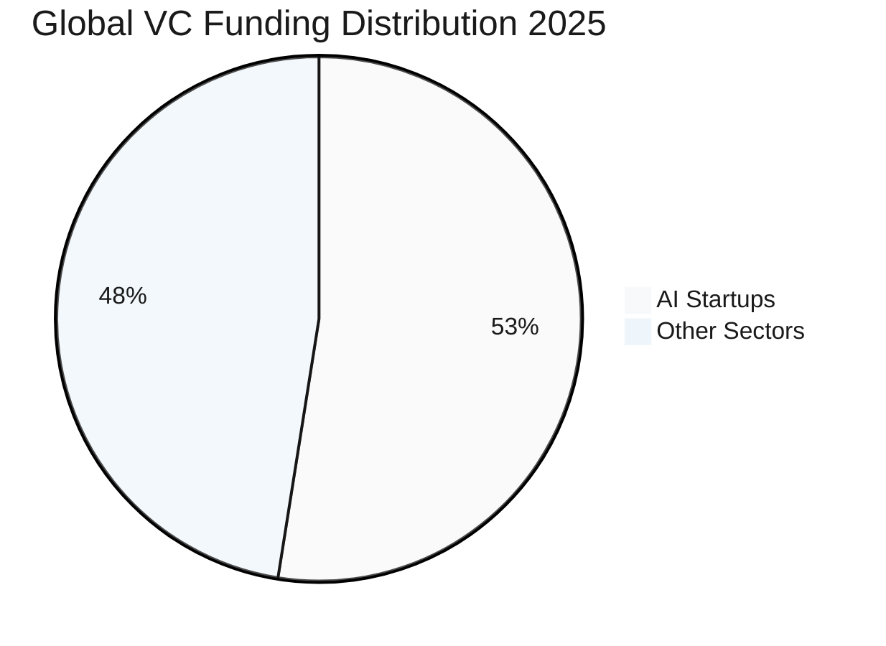
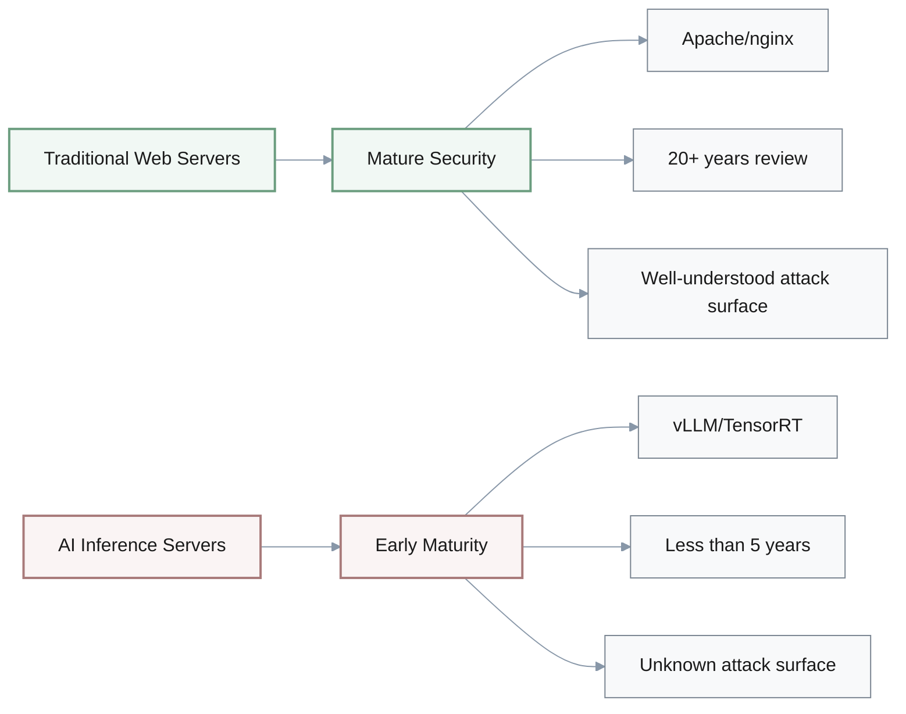
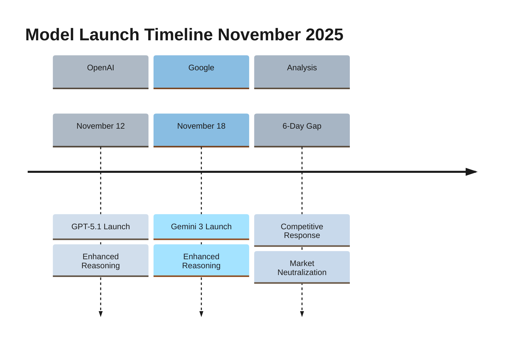
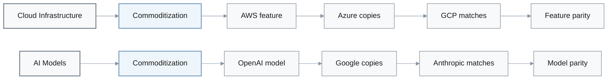
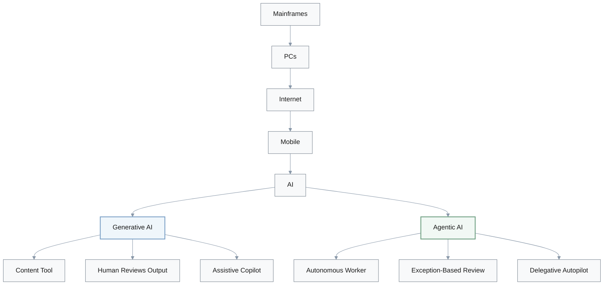
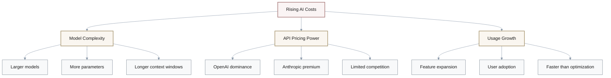
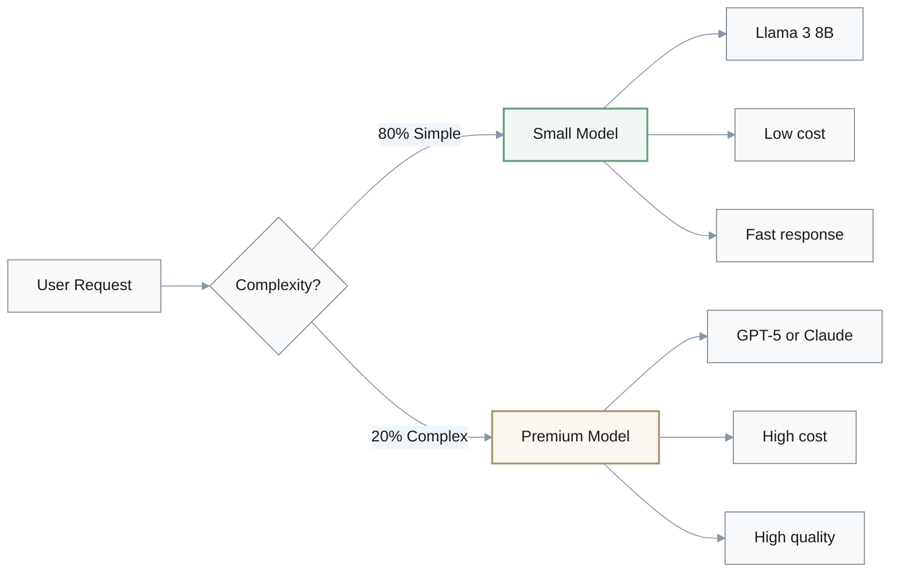
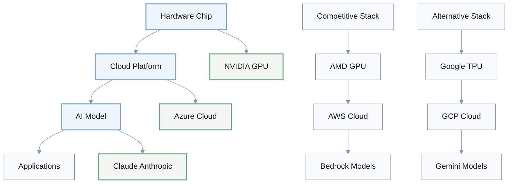
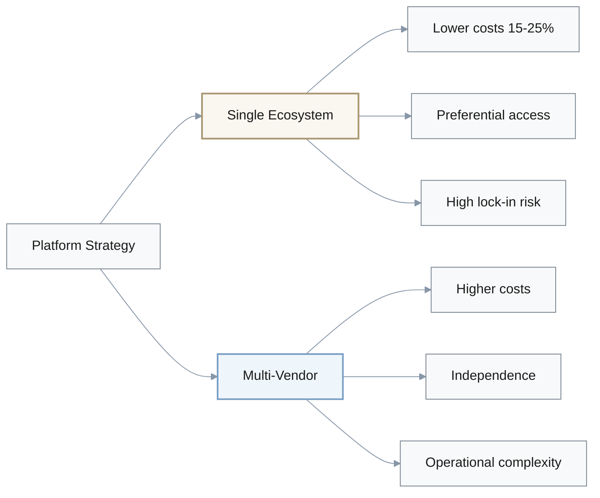

# Extract Reflection Questions

## 1. VC Funding Concentration Dynamics

**Q**: The report reveals that AI startups captured 52.5% of global VC funding ($192.7B YTD), with U.S. AI startups at 63% of VC investments. How does this concentration challenge your assumptions about capital availability and competitive dynamics in the AI startup ecosystem?

### Funding Distribution

| Metric | Value | Percentage |
|--------|-------|------------|
| Total Global VC Funding (YTD) | $192.7B | 100% |
| AI Startup Funding | $101.2B | 52.5% |
| U.S. AI Startups | $121.4B* | 63% of VC |

*Based on U.S. VC investment allocation

### A: Key Insights

**Assumption Challenged**: Many assume VC capital is diversified across sectors—this concentration reveals capital is heavily momentum-driven, clustering around perceived winners. 

**Mental Model Shift**: Market is not meritocracy-plus-capital, but rather narrative-driven with extreme winner-take-most dynamics. Differentiation storytelling becomes as critical as technical innovation.

**Critical Questions for Founders**:
- **Differentiation**: Does our pitch clearly articulate why we're different from the 1000+ other AI startups?
- **Positioning**: Is "AI-powered X" sufficient, or do we need stronger moats?
- **Moat Requirements**:
  - Proprietary data moats
  - Unique vertical expertise
  - Architectural innovations

**Implication for Action**: Generic "AI-powered X" positioning is insufficient. Need proprietary data moats, unique vertical expertise, or architectural innovations.

**Broader Reflection**: This pattern historically precedes market corrections—52.5% concentration suggests potential bubble dynamics.

**Risk-Adjusted Strategies**:
1. **Bootstrapping**: Build sustainable revenue model independent of VC timing
2. **Strategic Partnerships**: Secure longer-term alliances with corporate partners
3. **Capital Efficiency**: Focus on unit economics over growth-at-all-costs

---

## 2. AI Infrastructure Security Maturity

**Q**: The report details critical RCE vulnerabilities across major AI inference servers (vLLM, NVIDIA TensorRT-LLM, Modular Max) disclosed simultaneously. What does this pattern suggest about the security maturity of the AI infrastructure ecosystem, and how should this update your risk assessment framework?

### Affected Systems

| Platform | Vendor | Vulnerability Type | Status |
|----------|--------|-------------------|---------|
| vLLM | Independent | RCE (Remote Code Execution) | Disclosed |
| TensorRT-LLM | NVIDIA | RCE | Disclosed |
| Modular Max | Modular | RCE | Disclosed |

### Security Maturity Comparison

### A: Key Insights

**Pattern Recognition**: Simultaneous disclosure of multiple critical vulnerabilities across different vendors suggests systemic security immaturity—AI inference servers are newer infrastructure with less security review than traditional web servers (Apache, nginx).

**Assumption Challenged**: Many treat AI infrastructure as "just another API"—but these systems handle:
- **Proprietary model weights**: High-value intellectual property
- **Sensitive user queries**: Privacy-critical data
- **Unknown attack surface**: Not yet well-understood security boundaries

**Mental Model Update**: AI infrastructure should be treated as high-risk, early-maturity technology requiring proactive security posture, not reactive patching. Traditional "patch quarterly" maintenance windows are insufficient.

**Required Actions for Organizations**:

1. **Classification**: Treat AI infrastructure as Tier 1 critical
2. **Defense-in-Depth**: Implement multiple security layers:
   - Network segmentation
   - Web Application Firewall (WAF)
   - Anomaly detection
   - Zero-trust architecture
3. **Monitoring**: Establish 24-hour CVE monitoring for AI/ML dependencies
4. **Budget Planning**: Allocate resources for 2-4 emergency patch cycles per year

**Historical Parallel**: This mirrors early cloud security evolution (2010-2015)—expect continued vulnerability discoveries in AI infrastructure over next **2-3 years**.

> **Warning**: Organizations relying solely on vendor patches for AI infrastructure security are operating with insufficient risk mitigation.

---

## 3. AI Model Launch Competitive Dynamics

**Q**: GPT-5.1 and Gemini 3 launched within 6 days of each other (November 12 and 18, 2025), both emphasizing enhanced reasoning. How does this rapid competitive response challenge your mental model of AI model development timelines and strategic moats?

### Launch Timeline

### First-Mover Advantage Evolution

| Era | Advantage Window | Example | Strategic Implication |
|-----|-----------------|---------|---------------------|
| Research (2017-2020) | 6-12 months | GPT-2 → GPT-3 | Publish and dominate |
| Product (2021-2023) | 2-6 months | ChatGPT launch | Build moat quickly |
| Commodity (2024-2025) | Days to weeks | GPT-5.1 ↔ Gemini 3 | Differentiate beyond model |

### A: Key Insights

**Competitive Dynamics**: 6-day gap suggests intense competitive intelligence and strategic timing—not coincidence. Google likely accelerated Gemini 3 launch to minimize OpenAI's market advantage window.

**Mental Model Shift**: Model releases are becoming product launches (not research publications), with competitors timing releases to neutralize each other's advantages. First-mover advantage in model capabilities is shrinking—measured in **days/weeks**, not months/quarters.

**Sustainable Moat Sources** (Ranked by Durability):

1. **Proprietary fine-tuning data**: Customer-specific training datasets
2. **Domain-specific architectures**: Specialized models for vertical use cases
3. **UX/integration depth**: Seamless workflow integration
4. **Workflow orchestration**: Multi-step task automation
5. **Enterprise trust/compliance**: Security certifications, SOC 2, HIPAA

**Assumption Challenged**: *"We'll have 6-month advantage if we adopt latest model first"* is likely **false**. Competitors can match within weeks.

**Historical Parallel**:

**Reflection**: AI application layer must focus on customer-specific value, not generic model access. 

> **Critical Question**: What value do we deliver that persists regardless of which model is "best" this month?

---

## 4. AI Adoption Maturity & Paradigm Shift

**Q**: The report shows 78% of organizations using AI in at least one business function, with agentic AI emphasis shifting from content generation to autonomous task execution. How does this adoption curve update your understanding of where we are in the AI transformation cycle?

### Current Adoption Status

| Metric | Value | Interpretation |
|--------|-------|---------------|
| Organizations using AI | 78% | Broad experimentation |
| Deployment depth | Low | Pilot/POC phase |
| Adoption stage | Early majority | Not late majority |

### Technology Paradigm Evolution

### AI Technology Transition

| Dimension | Generative AI (2022-2024) | Agentic AI (2025+) |
|-----------|---------------------------|-------------------|
| **Role** | Content tool | Autonomous worker |
| **Human interaction** | Review every output | Exception-based intervention |
| **Control model** | Assistive (copilot) | Delegative (autopilot) |
| **Task scope** | Single-step | Multi-step planning |
| **Integration** | Standalone features | Tool use + API orchestration |

### A: Key Insights

**Adoption Stage Assessment**: 78% using AI in "at least one function" suggests broad experimentation but likely shallow depth—most organizations are still in pilot/proof-of-concept phase, not production-scale deployment. This is **early majority**, not late majority.

**Shift from Generative to Agentic**: The market is moving from "AI as content tool" to "AI as autonomous worker." This parallels software evolution: mainframes → PCs → internet → mobile—each shift required new mental models of human-computer interaction.

**Mental Model Update**: AI is transitioning from **assistive technology** (copilot) to **delegative technology** (autopilot). This requires rethinking:
- **Trust**: How much autonomy to grant
- **Accountability**: Who's responsible for AI decisions
- **Error handling**: Self-correction vs. human intervention
- **Oversight**: Continuous monitoring vs. exception-based review

**Requirements for Next-Generation AI Products**:

1. **Autonomous execution**: Exception-based human intervention (not review-every-output)
2. **Self-correction mechanisms**: Detect and fix errors without human guidance
3. **Multi-step task planning**: Break complex goals into executable steps
4. **Tool use and API integration**: Interact with external systems autonomously

**Obsolescence Risk**: Products designed for "human reviews every AI output" will face obsolescence.

**Critical Self-Assessment Questions**:
- Are we building AI **features** that reduce work?
- Or are we building AI **agents** that autonomously complete work?

> **Insight**: Market value is concentrating in the latter. This challenges comfort zones around control and determinism—success requires embracing **probabilistic autonomy**.

---

## 5. AI Infrastructure Cost Trajectory & Economics

**Q**: Average AI infrastructure costs are projected to surge 36% to $85.5K/month in 2025, with organizations planning >$100K/month doubling from 20% to 45%. How does this cost trajectory challenge assumptions about AI ROI and long-term viability of current architectures?

### Cost Growth Projection

$$
\text{5-Year Cost Multiplier} = (1 + 0.36)^5 \approx 5.0x
$$

| Year | Average Monthly Cost | YoY Growth | Organizations >$100K/month |
|------|---------------------|------------|---------------------------|
| 2024 | $62.9K | baseline | 20% |
| 2025 | $85.5K | +36% | 45% |
| 2026* | $116.3K | +36% | 60%* |
| 2027* | $158.2K | +36% | 75%* |

*Projected if current trend continues

### Cost Drivers

### A: Key Insights

**Economics Reality Check**: 36% year-over-year cost growth is unsustainable long-term—would lead to **5x cost increase** over 5 years if compounded. This suggests:
- Current architectures are inefficient
- Market is willing to overpay during land-grab phase
- Architectural optimization is deferred, not prioritized

**Assumption Challenged**: Many assumed AI costs would follow typical cloud economics (declining per-unit costs over time due to scale). Instead, costs are rising due to:

1. **Model complexity**: Increasing faster than efficiency gains
2. **API pricing power**: OpenAI/Anthropic have limited competition
3. **Usage expansion**: Growing faster than optimization efforts

**Mental Model Shift**: AI infrastructure costs should be treated as **strategic investment with definitive ROI requirements**, not open-ended R&D. Organizations must establish hard efficiency targets:

$$
\text{Efficiency Metrics} = 
\begin{cases}
\text{Cost per transaction} \\
\text{Cost per active user} \\
\text{Cost per dollar revenue}
\end{cases}
$$

### Strategic Responses to Cost Pressure

| Strategy | Use Case | Cost Savings | Implementation Complexity |
|----------|----------|--------------|--------------------------|
| **Self-hosted OSS models** | Cost-sensitive workloads | 60-80% | High (infrastructure) |
| **Prompt optimization** | All workloads | 15-30% | Medium (engineering) |
| **Aggressive caching** | Repeated queries | 40-60% | Low (configuration) |
| **Hybrid architecture** | Mixed workload | 30-50% | Medium (routing logic) |

**Hybrid Architecture Pattern** (80/20 Rule):

### Long-Term Implications

**Three Strategic Paths**:

1. **Migration to self-hosted open-source models**: Llama 3, Mistral for cost-sensitive use cases
2. **Aggressive prompt optimization and caching**: Reduce API calls by 40-60%
3. **Hybrid architectures**: Small models for 80% of tasks, premium models for 20%

**Critical Planning Questions**:
- At what monthly AI spend does our unit economics break?
- What's our plan if costs increase another 36% next year?
- What's our cost per $ revenue threshold?

> **Warning**: This forces architectural decisions NOW (edge deployment, model distillation, usage-based pricing) rather than reactive cost-cutting later.

---

## 6. Vertical Integration & Infrastructure Consolidation

**Q**: The Microsoft-NVIDIA-Anthropic alliance involves $45B in compute commitments and investments, representing 26% of 2025 total AI VC funding. How does this vertical integration challenge your assumptions about infrastructure competition and vendor neutrality?

### Alliance Scale

| Metric | Value | Context |
|--------|-------|---------|
| Alliance Investment | $45B | Compute commitments + investments |
| % of 2025 AI VC Funding | 26% | Significant market concentration |
| Total AI VC Funding | $173B | Based on $45B = 26% |

### Vertical Integration Structure

### Historical Parallels

| Era | Integration Pattern | Winner | Lock-in Strategy |
|-----|-------------------|--------|------------------|
| **Smartphones** | Hardware + OS + App Store | iOS, Android | Ecosystem lock-in |
| **Cloud** | Compute + Storage + Services | AWS, Azure, GCP | Service integration |
| **AI Stack** | Chip + Cloud + Model | MSFT-NVIDIA-Anthropic | Vertical integration |

### A: Key Insights

**Market Structure Shift**: $45B alliance signals end of commoditized, vendor-neutral AI infrastructure. Moving toward **vertically integrated ecosystems** (chip → cloud → model), similar to:
- **Apple's hardware-software integration**: iPhone + iOS + App Store
- **AWS's compute-storage-services stack**: EC2 + S3 + Lambda

**Assumption Challenged**: Many assumed AI infrastructure would remain modular and interoperable (mix-and-match chips, clouds, models). This alliance suggests:
- **Winner-take-most consolidation**
- **Ecosystem lock-in**
- **End of vendor neutrality**

**Strategic Implications for Infrastructure Decisions**:

Architectural decisions made today carry **long-term supply chain and pricing implications**:

| Decision Layer | Options | Lock-in Risk |
|----------------|---------|--------------|
| **Cloud** | Azure vs AWS vs GCP | High |
| **Model** | OpenAI vs Anthropic vs Open Source | Medium-High |
| **Chip** | NVIDIA vs AMD vs Google TPU | High |

**Multi-cloud strategy** transitions from best practice to **risk mitigation requirement**.

### Critical Questions for AI Builders

1. **Alignment**: Do we align with dominant ecosystem for preferential access/pricing?
2. **Independence**: Do we maintain independence through multi-vendor architecture?
3. **Timing**: Do we wait for AWS/GCP competitive response before committing?

### Strategic Trade-offs

### Reflection: Smartphone Era Lessons

**iOS vs Android Consolidation Parallel**:
- **Early platform alignment**: Gained advantages through preferential access
- **Platform-agnostic strategies**: Proved more durable long-term
- **Developer lesson**: Balance optimization with flexibility

**Critical Planning Questions**:
- What's our **platform dependency risk tolerance**?
- How much **vendor lock-in** is acceptable for **15-25% cost savings**?
- What's our **exit strategy** if our chosen platform loses market share?

**Mental Model Update**: Treat infrastructure choices as **strategic commitments with multi-year implications**, not tactical procurement decisions.

> **Decision Framework**: This trade-off will define infrastructure strategy for next **3-5 years**. Choose deliberately based on risk tolerance, cost sensitivity, and strategic flexibility requirements.
