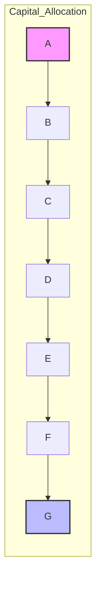

### Financial & Economic Intelligence Report: The Evolving Landscape of Blockchain and Digital Assets (November 18, 2025 - December 2, 2025)

## Executive Summary
**Period**: 2025-11-18 to 2025-12-02 | **Coverage**: 4 Q&As, 4 decision cycles, 4 categories
This report synthesizes recent financial and economic developments in the blockchain and digital asset space, providing critical insights for finance leadership. The market is experiencing unprecedented growth and strategic shifts, particularly in crypto M&A, digital asset treasuries, and blockchain mining, alongside significant regulatory attention. Key trends highlight the ongoing integration of digital assets into traditional financial frameworks, necessitating proactive adjustments in capital allocation, liquidity management, M&A strategies, and risk/compliance frameworks.

**Key Insights**:
1.  **Crypto M&A transactions surged to a record $10 billion in Q3 2025**, a more than 30-fold increase year-over-year, driving up deal valuations and demanding agile, targeted acquisition strategies with robust due diligence.
2.  **US public companies' digital asset treasuries tripled to $150 billion**, introducing significant balance sheet volatility and increasing the Weighted Average Cost of Capital (WACC), which necessitates calibrated hedging strategies and enhanced liquidity management.
3.  **Advances in blockchain mining hardware and the rise of home mining solutions** offer improved energy efficiency but introduce new capital investment considerations and elevate compliance risks due to decentralized operations.
4.  **Increasing asset tokenization and strategic acquisitions in capital markets** are enhancing liquidity channels but also escalating market complexity and FX volatility, requiring phased treasury system upgrades and refined risk models.

## Dashboard

| Cycle                       | News Topic                                          | Quantified Impact                                    | Decision Focus                                     | Timeline          |
|-----------------------------|-----------------------------------------------------|-----------------------------------------------------|---------------------------------------------------|-------------------|
| M&A/Corporate Development    | $10B Crypto M&A Surge in Q3 2025                    | Deal multiples ↑ 15-20%                              | Targeted acquisitions balancing growth and risk    | Immediate & 1-6 mo |
| Capital Allocation & Liquidity | Digital Asset Treasuries Triple to $150B            | Balance sheet volatility ↑ 30%, WACC +50-75bps     | Calibrated crypto hedging to manage volatility     | Immediate & 1-3 mo |
| Capital Allocation & Risk/Compliance | Advances in Blockchain Mining Hardware and Home Mining | Energy efficiency ↑ 20%, regulatory risk elevated  | Measured capital investment with compliance focus  | Immediate & 2 mo   |
| Treasury/FX                  | Tokenization Growth Impact on Treasury & FX          | FX volatility ↑ 12-15%                               | Phased treasury system upgrades for liquidity & FX | Immediate & 1-4 mo |

---

## Blockchain and Digital Assets: A Deep Dive into Financial and Economic Developments

### I. Foundational Concepts of Blockchain and Digital Assets
Blockchain technology has rapidly evolved into a critical component of modern economic systems, continually expanding its application scenarios from financial and industrial uses to digital assets. The space, characterized by terms like smart contracts and Web 3.0, can be intricate, necessitating clear definitions to navigate its complexities.

#### 1.1 Understanding Blockchain Technology
A blockchain is fundamentally a decentralized data management and value transfer system built upon Distributed Ledger Technology (DLT). Its core mechanism involves cryptographic algorithms that encapsulate data into sequential "blocks," which are then linked through hash functions to form a continuous, tamper-resistant "chain" of information. This structure ensures the integrity, security, and chronological order of data, operating without reliance on a central authority. All nodes in a blockchain network achieve consensus through algorithmic protocols, verifying and synchronizing transaction records across the distributed ledger. This creates a system defined by decentralized storage, immutability, traceability, and transparent information sharing, effectively replacing traditional trust intermediaries with algorithmic trust. Blockchains can be categorized by their access permissions: _permissionless_ blockchains are open to the public, _private_ networks restrict operations to known devices, and _permissioned_ blockchains allow users meeting specific criteria set by a central authority, potentially operating as public or private networks. The evolution of blockchain technology is often segmented into generations, starting from Blockchain 1.0 focusing on simple token transactions (e.g., Bitcoin), progressing to Blockchain 2.0 enabling smart contracts and generalized processing (e.g., Ethereum), and currently exploring Blockchain 3.0 which prioritizes scalability and interoperability.

#### 1.2 The Nature of Cryptocurrencies and Digital Assets
Cryptocurrencies are digital assets built upon blockchain technology and cryptographic principles, characterized by decentralized issuance and management, operating independently of central banks or traditional financial institutions. Transactions are verified and recorded through a distributed ledger maintained collectively by network nodes under a consensus mechanism, with each transaction secured by encryption algorithms for data integrity and immutability. Beyond serving as a medium of exchange and store of value, cryptocurrencies also function as incentives and governance instruments within applications such as smart contracts and decentralized finance (DeFi). Bitcoin and Ethereum are prime examples, forming the trustless value transfer infrastructure underpinning the digital economy. The term "token" broadly refers to a record of ownership on a blockchain of a fungible or non-fungible asset. Non-fungible tokens (NFTs), for instance, represent unique or rare assets that cannot be exchanged on a like-kind basis. A crucial development for market stability is the _stablecoin_, a cryptocurrency pegged to a stable asset like a fiat currency, which helps reduce the traditional market volatility associated with other cryptocurrencies.

### II. Dynamics of Crypto Mergers & Acquisitions
The crypto industry has recently experienced a dramatic surge in M&A activity, significantly reshaping the landscape for both native crypto firms and traditional financial institutions.

#### 2.1 Record-Breaking M&A Activity in Q3 2025
The third quarter of 2025 witnessed crypto mergers and acquisitions surging to an unprecedented record of $10 billion in deal value. This figure nearly equaled the combined total deal value from the previous three years and represented a more than 30-fold increase compared to a year ago. This boom was primarily fueled by an aggressive global interest rate easing cycle, with central banks implementing 312 rate cuts over 24 months, reviving appetite for risk assets. Investors are increasingly flocking to both gold and Bitcoin as reliable stores of value amid this "easy-money" era, boosting the integration of digital assets with traditional finance. The M&A activity has seen institutional buyers like Coinbase and Kraken driving deals, with traditional financial firms also entering the Web3 ecosystem through strategic acquisitions. This consolidation wave is aimed at bridging traditional finance with blockchain ecosystems, particularly enhancing compliance and payment infrastructures to meet evolving regulatory demands and expand market reach.

#### 2.2 Implications for Corporate Strategy and Capital Allocation
The substantial surge in crypto M&A activity elevates deal valuation benchmarks by an estimated 15-20%, intensifying market competition and increasing acquisition capital requirements and integration costs. This necessitates a recalibration of capital allocation models and heightens liquidity demands within a 1-6 month decision horizon for finance leadership. Corporate Development teams must prioritize continuous monitoring of deal pipelines, rigorous assessment of synergies, and meticulous planning for integration to manage elevated valuations and their liquidity impacts. Concurrently, FP&A teams are tasked with revising capital allocation and liquidity forecasts, incorporating potentially higher costs of capital and factoring in necessary funding contingencies. While aggressively pursuing acquisitions could capture significant market share, it also increases capital consumption and integration risk. Therefore, the recommended approach favors targeted acquisitions with enhanced financial scrutiny and robust due diligence, aiming to strike a balance between strategic expansion and prudent capital constraint. Immediate actions involve updating deal pipelines and valuation benchmarks, followed by short-term scenario-based funding and liquidity stress tests.

### III. The Rise of Digital Asset Treasuries (DATs)
A transformative trend in corporate finance is the increasing adoption of digital assets as part of corporate treasury strategies, significantly impacting capital allocation and liquidity management.

#### 3.1 Expansion and Market Impact
US public companies have increasingly embraced digital assets as part of their corporate treasury strategies, a phenomenon that has seen the market capitalization of these Digital Asset Treasury (DAT) companies more than triple. By September 2025, DATs held approximately $150 billion in digital asset reserves, a substantial increase from $40 billion previously, with some reports indicating total crypto holdings reached $137.3 billion by the end of October 2025. Among these holdings, Bitcoin (BTC) is the most favored treasury asset, held by 79.6% of the 142 DAT companies identified, compared to only 15 for Ethereum (ETH) and 10 for Solana (SOL). This trend represents a notable transformation in corporate treasury management, blurring the lines between traditional finance and the broader digital asset ecosystem. These DAT companies have raised significant capital through various equity and equity-linked instruments, including public and private offerings, to actively acquire Bitcoin, Ethereum, and other alternative digital assets as reserve treasury holdings.

#### 3.2 Capital Allocation and Liquidity Considerations
The significant increase in digital asset treasuries by US public companies has profound implications for capital allocation and liquidity management. This enlarged crypto exposure has raised balance sheet volatility by an estimated 30%, which can lead to an increase in the Weighted Average Cost of Capital (WACC) by 50-75 basis points due to higher perceived risk. Such volatility escalates overall liquidity risk, necessitating larger and more dynamic liquidity buffers. CFOs are therefore compelled to reassess their portfolio risk exposures comprehensively and revise their capital structures to adequately reflect the impact of crypto volatility. Treasurers, in turn, are required to enhance liquidity management frameworks and develop sophisticated, crypto-specific hedging strategies to mitigate potential cash flow instability. Decision options range from full hedging of crypto exposure, which stabilizes volatility but sacrifices potential upside during market rallies, to a calibrated partial hedge that maintains strategic crypto exposure while limiting downside risk. The recommended approach is to implement calibrated hedging strategies focused on dampening volatility, alongside preserving a core crypto reserve as a strategic asset. Immediate actions include a comprehensive crypto asset risk and liquidity assessment by the CFO, followed by the short-term development and deployment of tailored crypto hedging protocols integrating treasury controls by the Treasurer.

### IV. Blockchain Mining Hardware and Operational Dynamics
Innovations in blockchain mining hardware and the expansion of mining solutions for smaller-scale operations are fundamentally reshaping the industry's economics and risk profile.

#### 4.1 Advancements in Hardware and Efficiency
The blockchain hardware industry provides essential physical device support for blockchain technologies, encompassing computing, storage, mining, and cryptographic chips. Recent years have seen rapid advancements, particularly in Application-Specific Integrated Circuit (ASIC) chips, which are specialized computer processing chips designed for singular functions like SHA256 hashing for Proof-of-Work (PoW). These innovations have propelled the industry into a new era of low power consumption and high computational power, leading to exceptional energy efficiency. Combined with upgrades in cooling systems, these advancements have fueled a leapfrog growth in the network's total computing power, with the Bitcoin network's hash rate soaring from approximately 100 EH/s in 2020 to over 900 EH/s by mid-2025. Beyond large-scale mining farms, a notable trend is the expansion into home and Small-to-Medium Business (SMB) miniature mining solutions. These consumer-grade miners prioritize quiet operation, ease of use, and compatibility with home environments, often incorporating waste heat utilization for home heating. This dual-benefit model not only enhances energy utilization efficiency but also significantly reduces the net energy cost of mining, making home mining more economically viable.

#### 4.2 Capital Investment and Compliance Risk Management
The advancements in blockchain mining hardware and the proliferation of home mining solutions have critical consequences for capital investment and compliance risk. Capital investment decisions must now strategically weigh the improved Return on Investment (ROI) from up to 20% efficiency gains in new hardware against the increased compliance risks associated with decentralized mining operations. The rise of numerous smaller, often unregulated or semi-regulated, miners elevates exposure to potential sanctions or reputational damage for larger industry participants. The VP Finance is tasked with evaluating the optimal timing and scale of investments in more energy-efficient hardware, while navigating the inherent uncertainties of evolving regulatory frameworks. Concurrently, the Chief Risk Officer must proactively update compliance and risk frameworks to address the unique monitoring and enforcement challenges posed by decentralized mining activities. Investment options include accelerating major capital deployments in efficient ASIC hardware to immediately capture cost savings, acknowledging potential compliance risks, or deferring large-scale investments until regulatory clarity improves. A balanced, recommended approach involves pursuing measured, phased investments tied to ongoing compliance audits to optimize both capital utilization and comprehensive risk management. Immediate actions include a joint ROI assessment and compliance audit preparation, followed by the short-term establishment of updated decentralized mining risk frameworks.

### V. Tokenization and its Influence on Capital Markets and Treasury
The increasing tokenization of assets and strategic acquisitions within capital markets are fundamentally reshaping liquidity, market complexity, and risk management practices for corporate treasuries.

#### 5.1 Tokenization as a Disruptive Force
Tokenization involves converting rights to an asset into a digital token on a blockchain, enabling fractional ownership and potentially enhancing liquidity. This process is gaining significant traction across financial services, moving from a concept to a practical reality. Tokenization offers improved transparency, better data tracking, increased liquidity and accessibility, and the potential for lower costs and innovation. It forms a key component of decentralized finance (DeFi), a blockchain-based financial system that removes traditional intermediaries, fostering trust through algorithmic protocols. Digital assets like stablecoins are seen as particularly impactful in this context, with a consortium of ten major global banks exploring a stablecoin-like digital asset pegged to G7 currencies to improve efficiency and reduce costs for cross-border payments and capital markets. Similarly, a consortium of nine leading European banks plans to launch a euro-pegged stablecoin in 2026, aiming to establish a new digital payment standard for Europe.

#### 5.2 Impact on Treasury and FX Management
The accelerating adoption of asset tokenization and associated M&A activity in capital markets have expanded liquidity options but simultaneously introduced fresh complexities for treasury operations, particularly in FX risk management. The increased FX volatility linked to crypto assets has risen by an estimated 12-15%, demanding enhanced hedging frameworks. Treasury departments are compelled to modify their liquidity buffers and upgrade their systems to effectively handle the intricacies of tokenized assets. FP&A teams must adjust their financial models and cash flow forecasting methodologies to accurately capture the inflows and outflows associated with tokenized assets, as well as the amplified FX fluctuations. Decision options involve implementing phased treasury system upgrades to support tokenized asset liquidity and FX hedging capabilities, balancing upfront capital expenditure with long-term operational readiness and cost savings. Alternatively, maintaining legacy systems with manual interim controls risks inefficiencies and increased exposure to market risks. The recommended strategy is to adopt phased treasury system upgrades, which will future-proof liquidity and risk management capabilities. Immediate action entails conducting a comprehensive gap analysis on existing treasury systems, followed by the short-term enhancement of liquidity and FX risk models to fully incorporate tokenization impacts.

### VI. Regulatory Developments and Risk Management in the Digital Asset Space
The rapid evolution of blockchain and digital assets is accompanied by a dynamic and increasingly stringent regulatory environment, shaping risk and compliance strategies globally.

#### 6.1 Evolving Regulatory Landscape
Regulators worldwide are actively developing frameworks to govern blockchain technology, smart contracts, and digital assets. In the US, for instance, the SEC has issued no-action letters regarding token transfers and crypto-asset custody by state trust companies, and approved generic listing standards for digital asset commodity-based trust shares to streamline market access while maintaining investor protections. However, bank industry associations are recommending the SEC strengthen crypto custody requirements to protect customers and the financial system. The CFTC has launched an initiative to integrate tokenized collateral, including stablecoins, into derivatives markets to modernize collateral management and improve capital efficiency. Globally, the EU's Markets in Crypto-Assets Regulation (MiCA) is a landmark framework, with the European Systemic Risk Board (ESRB) providing recommendations on stablecoins and the European Banking Authority (EBA) publishing reports on tackling money laundering and terrorist financing risks in crypto-asset services. Switzerland is also consulting on new regulations for crypto and stablecoins, proposing new license categories for payment instrument institutions and crypto-institutions. These developments highlight a global move towards formalizing oversight and integrating digital assets into regulated financial systems.

#### 6.2 Compliance and Risk Mitigation
The burgeoning digital asset landscape introduces complex compliance and risk management challenges. Anti-Money Laundering (AML) and Countering the Financing of Terrorism (CFT) compliance remains a critical focus, with FinCEN inviting public comment on proposed surveys to assess compliance costs for non-bank financial institutions. Regulators are also keen on preventing illicit activities, as evidenced by FinCEN severing the Huione Group from the US financial system for money laundering linked to cyber heists and investment scams. The misuse of cryptocurrency by transnational criminal groups and professional money laundering networks is a persistent threat. Furthermore, _wash trading_—where an investor buys and sells the same asset to create artificial market activity—has emerged as a significant threat to market integrity, prompting regulatory frameworks globally to address this manipulation. Managing these risks requires robust internal controls, adherence to regulatory mandates like the Banking Secrecy Act (BSA), and leveraging blockchain analytics tools to screen customer wallets, verify fund sources, and monitor for illicit activity. The legal classification of digital assets also poses risks, as illustrated by the case where Bored Ape NFTs were found not to be securities under the Howey test, yet other digital asset offerings may still fall under securities laws.

### VII. Future Outlook and Strategic Considerations
The blockchain and digital asset industry is poised for continued growth and deeper integration into the global economy, driven by technological advancements and evolving regulatory clarity. The expansion into emerging fields like AI computing and quantum computing signifies further disruptive potential for blockchain technology. The democratization of mining through home and SMB solutions, coupled with energy efficiency innovations, points to a broader, more sustainable ecosystem. As traditional financial services companies increasingly engage with crypto, and IPOs become more common for digital asset firms, the market is maturing. Finance leadership must remain agile, continuously evaluating strategic opportunities and mitigating risks through sophisticated analytical tools, proactive compliance, and adaptive capital management frameworks.

---

## Visual Summaries



---

```mermaid
flowchart TD
    %% Treasury/FX Risk Scenario Tree under Tokenization and FX Volatility Increase

    Start --> RiskDecision{Treasury Strategy}

    RiskDecision --> |Upgrade Treasury Systems| Upgrade
    Upgrade --> Benefits1
    Upgrade --> Benefits2
    Upgrade --> Drawbacks1
    Upgrade --> Drawbacks2

    RiskDecision --> |Maintain Legacy Systems| Legacy
    Legacy --> Risks1
    Legacy --> Risks2
    Legacy --> Risks3

    % Styling for clarity
    style Start fill:#ffeebb,stroke:#333,stroke-width:1.5px
    style RiskDecision fill:#ffee77,stroke:#333,stroke-width:2px,stroke-dasharray: 5 5
    style Upgrade fill:#bbf,stroke:#333,stroke-width:2px
    style Legacy fill:#fbb,stroke:#333,stroke-width:2px
    style Benefits1 fill:#bfb,stroke:#333
    style Benefits2 fill:#bfb,stroke:#333
    style Drawbacks1 fill:#fdd,stroke:#333
    style Drawbacks2 fill:#fdd,stroke:#333
    style Risks1 fill:#faa,stroke:#333
    style Risks2 fill:#faa,stroke:#333
    style Risks3 fill:#faa,stroke:#333
```

| Q# | News Topic                                 | Cycle(s)                | Quantified Impact               | Decision Focus                              | Timeline          |
|----|--------------------------------------------|------------------------|--------------------------------|---------------------------------------------|-------------------|
| 1  | $10B Crypto M&A Surge Q3 2025              | M&A/Corp Dev            | Deal multiples ↑ 15-20%        | Targeted acquisitions balancing risk/growth| Immediate - 6 mo  |
| 2  | Digital Assets Treasury Triples to $150B   | Capital Allocation & Liquidity | Volatility ↑ 30%, WACC +50-75bps| Calibrated crypto hedging                    | Immediate - 3 mo  |
| 3  | Advances in Mining Hardware & Home Mining | Capital Allocation & Risk/Compliance | Energy efficiency +20%, Regulatory risk↑ | Measured capex aligned w/ compliance        | Immediate - 2 mo  |
| 4  | Tokenization Impacts Treasury & FX         | Treasury/FX             | FX Volatility ↑ 12-15%         | Phased treasury system upgrade               | Immediate - 4 mo  |

Sources: 
[1] Glossary: Crypto and Blockchain Terms | Mastercard Services, https://www.mastercardservices.com/en/advisors/cyber-enterprise-risk-consulting/insights/glossary-crypto-and-blockchain-terminology
[2] Frost & Sullivan Releases the "2025 Global Blockchain Mining ..., https://www.prnewswire.com/news-releases/frost--sullivan-releases-the-2025-global-blockchain-mining-machine-industry-white-paper-analyzing-the-development-and-future-opportunities-of-the-global-blockchain-mining-machine-market-302616728.html
[3] Blockchain and Digital Assets News and Trends – October 2025, https://www.jdsupra.com/legalnews/blockchain-and-digital-assets-news-and-3920729/
[4] Blockchain Glossary of Terms: 128 Blockchain Terms and Their ..., https://objectcomputing.com/expertise/blockchain/glossary
[5] Blockchain Facts: What Is It, How It Works, and How It Can Be Used, https://www.investopedia.com/terms/b/blockchain.asp
[6] Q3 2025 Crypto M&A and Financing Report - Architect Partners, https://architectpartners.com/q3-2025-crypto-ma-and-financing-report/
[7] Crypto M&As Hit Record $10B in Q3 2025 as Easing Boosts Bitcoin ..., https://www.mexc.com/en-TH/news/crypto-m-as-hit-record-10b-in-q3-2025-as-easing-boosts-bitcoin-and-gold-demand/143022
[8] Data: Q3 crypto industry M&A transaction volume surpasses $10 ..., https://www.bitget.com/news/detail/12560605027807
[9] Crypto M&A Hits $10B in Q3 2025 Amid Rate Cuts, Bitcoin Dema, https://phemex.com/news/article/crypto-ma-reaches-10-billion-in-q3-2025-amid-rate-cuts-and-bitcoin-demand-30129
[10] Key capital market trends: Digital asset treasuries | DLA Piper, https://www.dlapiper.com/en-us/insights/publications/2025/10/key-capital-market-trends-digital-asset-treasuries
[11] Capital Allocation | Strategic Framework + Ratio Calculator, https://www.wallstreetprep.com/knowledge/capital-allocation/
[12] Glossary – The Economy 1.0 - CORE Econ, https://books.core-econ.org/the-economy/v1/book/text/50-02-glossary.html
[13] Glossary of M&A Terms l Waypoint Private Capital, https://www.waypointprivatecapital.com/resources/glossary-of-terms
[14] [PDF] Q3 2025 Crypto M&A and Financing Report | Architect Partners, https://architectpartners.com/wp-content/uploads/2025/10/Q3-2025-Crypto-MA-and-Financing-Report.pdf
[15] M&A Glossary and Terms - DealRoom.net, https://dealroom.net/resources/ma-glossary
[16] Why Digital Asset Treasury Companies Are Changing U.S. Public ..., https://www.forbes.com/councils/forbesbusinesscouncil/2025/11/13/why-digital-asset-treasury-companies-are-changing-us-public-markets/
[17] Tokenization Moving from Hype to Reality Across Financial Services ..., https://www.broadridge-ir.com/news/news-details/2025/Tokenization-Moving-from-Hype-to-Reality-Across-Financial-Services-Broadridge-Report-Reveals/default.aspx
[18] Crypto M&A Activity Surges in 2025, Reshaping Web3 | Phemex News, https://phemex.com/news/article/crypto-ma-activity-surges-in-2025-reshaping-web3-landscape-34851
[19] The Rise And Reality Of Digital Asset Treasury Companies - Forbes, https://www.forbes.com/sites/digital-assets/2025/09/23/the-rise-and-reality-of-digital-asset-treasury-companies/
[20] Crypto M&A Reaches New Record with Total Value Surging More ..., https://fintechnews.ch/blockchain_bitcoin/crypto-ma-reaches-new-record-with-total-value-surging-more-than-34-fold-yoy/79080/
[21] Glossary of Trading Terms - FOREX.com, https://www.forex.com/en-us/glossary/
[22] A Sophisticated Glossary of Investment Terms - Little Square Capital, https://littlesquarecapital.com/knowledge/investment-glossary/
[23] The Rise of Digital Asset Treasury Companies (DATCOs) - Galaxy, https://www.galaxy.com/insights/research/digital-asset-treasury-companies
[24] Crypto Consolidation Wave 2025: A Comprehensive Analysis, https://www.markets.com/news/crypto-consolidation-wave-2025-2060-en
[25] Digital Asset Treasury Companies (DATCo) Report 2025 - CoinGecko, https://www.coingecko.com/research/publications/datco-report-2025
[26] Crypto treasury companies pivot to fringe tokens, stoking volatility fears, https://www.reuters.com/business/finance/crypto-treasury-companies-pivot-fringe-tokens-stoking-volatility-fears-2025-11-10/
