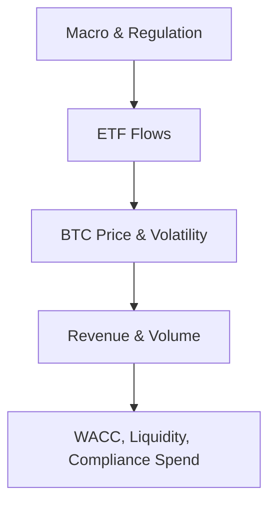

# Blockchain & Crypto Financial & Economic Intelligence Q&A (2025-11-16)

## Contents
1. Executive Summary (Overview | Insights | Dashboard)
2. Cycle Coverage (6 cycles × 6 categories matrix)
3. Questions by Cycle: Annual Planning (Q1–Q2) | Quarterly Forecast (Q3) | Risk/Compliance (Q4)
4. References: G (G1–G4) | N (N1–N5) | E (E1–E2) | R (R1) | A (A1–A4)
5. Validation Notes (lightweight)

---

## Executive Summary

**Domain**: Global blockchain & crypto finance (capital markets, corporate treasury, regulation)  
**Period**: Oct–Nov 2025  
**Generation date**: 2025-11-16  
**Validity window**: until 2025-12-14 (4 weeks; re-validate if used later)

**News coverage (primary categories)**:  
Capital Markets/Rates (2) | Macro Trends (1) | Treasury/FX (1) | Reporting/Compliance (1) | IR/Capital Structure (2)

**Key Insights**
- **ETF flows + institutional adoption as first‑class drivers**: Spot bitcoin ETFs now explain a large share of BTC price action. November 2025 saw record single‑day outflows from BlackRock’s IBIT while Harvard’s endowment scaled up BTC ETF holdings, reinforcing that institutional flows and macro liquidity will shape 2026 planning much more than retail sentiment alone. [Ref: N1][n1]
- **Macro uncertainty, not crypto fundamentals, behind recent drawdown**: BTC’s latest pullback reflects changing expectations for Fed rate cuts, delayed macro data after a US shutdown, and a risk‑off rotation away from big‑tech equities. Crypto credit and core infrastructure remain intact, so planning should treat this as a cyclical correction, not a structural break. [Ref: N2][n2]
- **Regulation as a capital‑allocation filter**: MiCA’s phased rollout in the EU and the broader global tightening around stablecoins and CASPs raise compliance opex but also create a clearer playing field. MiCA‑compliant euro stablecoins (EUROC, EURCV, EURI, EURe, EURS) are emerging as default rails for regulated euro flows. [Ref: N3][n3]
- **Structural adoption rebalances geography and FX**: Chainalysis’ 2025 Global Adoption Index shows APAC and Latin America leading growth in on‑chain volume, while North America and Europe continue to dominate absolute value thanks to ETF rails and clearer rules. This should tilt annual planning toward higher APAC/LatAm revenue and stricter FX/treasury controls. [Ref: N4][n4]

**Dashboard (high level)**

| Cycle | Representative News | Primary Action | Financial Focus | Timeline |
| --- | --- | --- | --- | --- |
| Annual Planning | ETF flows, Harvard ETF allocation, global adoption | Build BTC/ETF/macro scenarios into plan | WACC %, EV/Revenue, growth bands | 0–3 months |
| Quarterly Forecast | Macro‑driven BTC correction | Adjust revenue guidance and stress tests | Revenue %, VaR, liquidity headroom | Current Q + next Q |
| Risk/Compliance | MiCA, stablecoin rules, Travel Rule | Re‑prioritize EU roadmap & controls | Compliance opex, capital at risk | 0–24 months |

---

## Cycle Coverage (current slice)

| # | Cycle | Range | Count | Dominant Categories | Top News Anchor | Primary Roles | Artifacts |
| --- | --- | --- | --- | --- | --- | --- | --- |
| 1 | Annual Planning | Q1–Q2 | 2 | Macro, Markets, IR | BTC ETF flows; Harvard ETF allocation | CFO, FP&A, Board Finance | 1D + 1T |
| 2 | Quarterly Forecast | Q3 | 1 | Macro, Markets, Treasury | Macro‑driven BTC correction | CFO, FP&A, Treasurer | 1D |
| 3 | Risk/Compliance | Q4 | 1 | Compliance, Treasury, Macro | MiCA + stablecoin rules | CFO, Controller, CCO | 1D + 1T |
|   | **Total (this note)** |   | **4** | **3 categories** | **4 news items** | **≥5/11 roles** | **3D + 2T (min)** |

---

## Questions by Cycle

### Q1: How should crypto‑exposed firms adapt 2026 annual planning assumptions to ETF‑driven BTC volatility and Harvard‑scale institutional allocations?

**Cycle**: Annual Planning  
**Roles**: CFO, FP&A Director, Board Finance Committee  
**Cats**: Capital Markets/Rates, IR/Capital Structure, Macro Trends  
**Decision**: Y

**News (~60w)**: CoinMarketCap’s November 2025 BTC update highlights record single‑day outflows (~$470M) from BlackRock’s IBIT ETF and a broader weekly exodus from spot BTC ETFs, while Harvard University’s endowment reportedly tripled its BTC ETF exposure to around $442M, making it one of IBIT’s largest holders. Forecast models referenced in the same update suggest a possible path toward $200K BTC over 12 months if institutional inflows resume. [Ref: N1][n1]

**Impact (~110w)**: Annual planning must now treat ETF flows and macro liquidity as first‑class drivers of BTC price, volume, and related revenue lines. FP&A should build linked scenarios (bear/base/bull) combining ETF net flows (e.g., −$1B, flat, +$2B per month) with BTC price bands (e.g., $80K–$90K, $95K–$120K, $130K–$160K) and then propagate these into transaction volume, fee revenue, and mark‑to‑market revaluation for any BTC treasury holdings. For an exchange or brokerage with 30–40% of revenue tied to BTC volumes, a 25–30% BTC move can shift annual revenue by 10–15% and alter WACC by 50–100 bps as equity beta and credit spreads react. Planning models should therefore bind capex, hiring, and marketing envelopes to BTC/ETF thresholds rather than a single point forecast. [Ref: G1][g1]

**Stakeholders (~70w)**:  
- **CFO**: Owns WACC, leverage, and liquidity guardrails; ensures downside scenarios keep interest coverage and net‑debt/EBITDA within covenant limits.  
- **FP&A Director**: Converts ETF and price scenarios into revenue, opex, and capex bands, aligning them with investment and headcount plans.  
- **Board Finance Committee**: Reviews how capital allocation (buybacks, BTC treasury, M&A) behaves under each scenario.

**Decision (~90w)**: **Rec**: Monitor/hedge. Approve an annual plan with explicit BTC/ETF scenario triggers instead of a single deterministic case. For example, if BTC remains above $130K with sustained positive ETF flows for 60 days, management may deploy pre‑approved incremental capex; if BTC falls below $85K with persistent outflows, a cost‑containment and hiring‑freeze playbook activates. Success is measured by maintaining target WACC (e.g., 11–13%), leverage within bounds (e.g., net debt/EBITDA <2.0×), and minimum interest coverage (e.g., >5×) across scenarios. [Ref: G2][g2]

**Action (~60w)**:  
- **Immediate (0–2wk)**: FP&A refreshes integrated BTC/ETF/macro scenarios and re‑runs WACC sensitivities; CFO socializes new guardrails with CEO and Board Finance.  
- **Short (2wk–2mo)**: Adjust hiring, marketing, and discretionary capex envelopes to align with bear and base cases; define automatic cost levers tied to BTC/ETF thresholds.  
- **Medium (2–6mo)**: Embed ETF and macro indicators into quarterly plan refresh and rating‑agency communication.

**Artifacts**: Scenario table (ETF flows → BTC ranges → revenue/WACC bands); simple ETF‑to‑P&L flow diagram.

---

### Q2: How should global crypto adoption patterns reshape 2026 geographic revenue targets and FX risk limits?

**Cycle**: Annual Planning  
**Roles**: CFO, VP Finance, Regional GM (APAC)  
**Cats**: Macro Trends, Treasury/FX, Capital Markets/Rates  
**Decision**: Y

**News (~60w)**: Chainalysis’ 2025 Global Crypto Adoption Index shows APAC as the fastest‑growing region with on‑chain transaction volume up ~69% year‑over‑year (from $1.4T to $2.36T). Latin America’s adoption grows ~63%, and Sub‑Saharan Africa ~52%, while North America and Europe still dominate absolute value thanks to ETF rails and institutional participation. Stablecoin volume, led by USDT and USDC but increasingly complemented by EURC and other regulated euro tokens, underpins much of this activity. [Ref: N4][n4]

**Impact (~110w)**: For exchanges, wallets, and payment platforms, these adoption differentials should drive explicit re‑weighting of revenue targets, budgets, and FX risk limits. A simple top‑down approach is to anchor three‑year regional growth assumptions on Chainalysis data (e.g., APAC 25–35% CAGR, LatAm 20–30%, North America 10–15%) and back into country‑level quotas and opex envelopes. Treasury teams must recognize that higher emerging‑market growth increases exposure to volatile currencies (BRL, TRY, ARS, etc.). That argues for higher hedge ratios and tighter counterparty limits in those markets—for example, raising hedging coverage from 50% to 70% for certain currencies while keeping EUR/USD lower thanks to MiCA‑stabilized euro rails. [Ref: G3][g3]

**Stakeholders (~70w)**:  
- **CFO**: Owns regional capital allocation and aggregate risk appetite, ensuring that faster‑growing but riskier regions do not push VaR or liquidity metrics beyond Board thresholds.  
- **VP Finance / FP&A**: Translates regional adoption data into revenue, cost, and headcount plans and coordinates with sales and product.  
- **Regional GMs**: Provide bottom‑up validation and local regulatory insight.

**Decision (~90w)**: **Rec**: Execute with risk‑adjusted scaling. Increase APAC and LatAm revenue and investment targets ahead of the global average, but pair this with stricter FX hedging, counterparty controls, and capital‑at‑risk limits. Alternatives include focusing on B2B infrastructure in higher‑risk markets rather than direct consumer exposure. Success is measured by achieving region‑level growth within ±10% of target while keeping FX P&L impact within budget (e.g., <2–3% of affected revenue) and maintaining liquidity coverage ratios above target. [Ref: G4][g4]

**Action (~60w)**:  
- **Immediate**: Update regional planning templates with Chainalysis‑based growth and FX scenarios.  
- **Short term**: Align sales capacity and marketing budgets with revised regional priorities; adjust FX hedge ratios and counterparties.  
- **Medium term**: Revisit legal entity, banking, and on‑/off‑ramp structures in top‑growth regions.

**Artifacts**: Regional growth and FX risk heatmap; table of hedge ratios by region.

---

### Q3: How should quarterly forecasts incorporate macro‑driven BTC corrections without overreacting to short‑term volatility?

**Cycle**: Quarterly Forecast  
**Roles**: CFO, FP&A, Treasurer  
**Cats**: Macro Trends, Capital Markets/Rates, Treasury/FX  
**Decision**: Y

**News (~60w)**: A 14 Nov 2025 Cryptonomist analysis attributes BTC’s current weakness to macroeconomic uncertainty rather than crypto‑specific fundamentals. Markets have dialed back expectations of a near‑term Fed rate cut following mixed labor data and delayed US economic reports. At the same time, tech equities have lost momentum, reducing risk appetite. Liquidations of overcrowded long positions and ETF‑linked trades amplified the correction. [Ref: N2][n2]

**Impact (~110w)**: For firms whose quarterly revenue strongly tracks BTC price and volume, such macro‑driven corrections should trigger disciplined forecast adjustments and stress tests, not capricious guidance changes. FP&A can decompose impact into (1) price‑linked transaction fees, (2) mark‑to‑market revaluation of BTC holdings, and (3) ancillary income (lending, staking, spreads). Academic work on crypto–macro transmission (e.g., Bayesian SVAR studies) suggests that while crypto shocks can explain a material share of financial market fluctuations, macro shocks and risk appetite remain key drivers of BTC. Practically, this means translating a 20–30% BTC move into a smaller, bounded revision to quarterly revenue (e.g., 10–15%) while keeping medium‑term run‑rate assumptions anchored to structural adoption data rather than the latest downtick. [Ref: R1][r1]

**Stakeholders (~70w)**:  
- **CFO**: Decides how much of BTC’s move to reflect in external guidance, balancing credibility against the risk of frequent reversals.  
- **FP&A**: Owns the variance bridge from prior forecast to updated view, documenting macro vs structural contributions.  
- **Treasurer**: Ensures liquidity buffers and collateral schedules remain robust under stress scenarios.

**Decision (~90w)**: **Rec**: Hedge/monitor. Adjust quarterly guidance ranges and internal plans to reflect current BTC and macro conditions, but avoid re‑anchoring long‑term strategy unless adoption or regulation shifts. Alternatives include widening guidance ranges instead of sharply moving mid‑points, and pairing revenue revisions with clear visibility into liquidity and cost control. Success is measured by forecast error staying within target bands (e.g., <5–10%), stable credit spreads, and no liquidity stress even if BTC falls another 20%. [Ref: G2][g2]

**Action (~60w)**:  
- **Immediate**: Re‑run scenario and stress tests on revenue, liquidity, and margin requirements under current BTC and macro assumptions.  
- **Short term**: Update external guidance and internal targets with explicit commentary about macro vs structural factors; review hedging programs.  
- **Medium term**: Enhance dashboards that track macro indicators (rates, inflation, equities) alongside BTC and ETF flows, and link them to quarterly forecast updates.

**Artifacts**: Scenario table mapping macro paths to BTC ranges and revenue bands.

---

### Q4: How does MiCA’s 2024–2026 rollout change risk and compliance priorities for EU‑facing crypto businesses?

**Cycle**: Risk/Compliance  
**Roles**: CFO, Controller, Chief Compliance Officer (CCO), Risk Officer  
**Cats**: Reporting/Compliance, Treasury/FX, Macro Trends  
**Decision**: Y

**News (~60w)**: The 2025 InnReg MiCA guide summarizes the phased rollout: formal adoption in 2023; stablecoin rules for ARTs and EMTs effective mid‑2024; CASP rules for exchanges, custodians, and advisors effective Dec 2024; Travel Rule enforcement from Dec 2024; and licensing and supervisory reviews intensifying through 2025–2026. MiCA‑compliant euro stablecoins (EUROC, EURCV, EURI, EURe, EURS, and improving EURT) are now live and being integrated by banks and payment providers. Smaller non‑compliant actors face rising compliance costs and consolidation pressure. [Ref: N3][n3]

**Impact (~110w)**: For EU‑facing exchanges, wallets, and stablecoin issuers, MiCA effectively converts certain product lines into regulated financial services with bank‑like governance expectations. Financially, this implies higher fixed compliance opex (licensing, governance, internal audit, Travel Rule tooling) and potentially lower margin on high‑risk products (some tokens may become uneconomic once full requirements are applied). However, MiCA alignment can lower regulatory and funding risk, improve access to conservative institutional capital, and justify premium pricing for compliant services. Controllers must align accounting for reserves, client‑asset segregation, and impairment with MiCA and local GAAP/IFRS; risk teams must reassess capital‑at‑risk by business line under new rules. [Ref: G8][g8]

**Stakeholders (~70w)**:  
- **CCO / Risk Officer**: Owns the licensing roadmap, Travel Rule implementation, and ongoing supervisory engagement.  
- **CFO**: Rebalances portfolio of EU business lines, budgeting for compliance and deciding which products to exit or spin off.  
- **Controller**: Ensures financial reporting and audits reflect MiCA requirements on reserves and client assets.

**Decision (~90w)**: **Rec**: Execute for core, scalable EU business lines and monitor/exit marginal ones. Prioritize CASP licensing in one or two lead jurisdictions, converge onto MiCA‑compliant euro stablecoins, and rationalize token listings with poor economic or regulatory outlooks. Alternatives include pivoting EU exposure toward B2B infrastructure (compliance tooling, white‑label rails) or focusing growth in non‑EU markets with clearer or lighter regimes. Success is measured by on‑time licensing, clean supervisory findings, sustained ROE despite higher compliance opex, and fewer ad‑hoc regulatory surprises. [Ref: A3][a3]

**Action (~60w)**:  
- **Immediate**: Run a MiCA gap assessment by business line; classify lines into invest/maintain/exit buckets.  
- **Short term**: Budget MiCA‑related capex/opex explicitly; implement Travel Rule, AML, and reserve‑transparency tooling.  
- **Medium term**: Use MiCA compliance as an IR and banking‑relationship asset to secure better financing terms and strategic partnerships.

**Artifacts**: MiCA roadmap table (business line vs license status, capital at risk); simple timeline of key MiCA dates.

---

### Q5: Should a mid‑cap fintech adopt a BTC treasury allocation in 2026, and at what scale?

**Cycle**: Capital Allocation  
**Roles**: CFO, Treasurer, Board Finance Committee  
**Cats**: IR/Capital Structure, Treasury/FX, Macro Trends  
**Decision**: Y

**News (~60w)**: Crypto.com’s "Rise of Crypto Treasury" report notes that over 90 public companies now hold BTC on their balance sheets, with the US dominating organizational holdings. Strategy (formerly MicroStrategy) has become the poster child for aggressive BTC treasury strategy, holding hundreds of thousands of BTC and delivering outsized equity returns, while other firms such as Tesla maintain more modest positions whose stock performance is driven primarily by core business dynamics. At the same time, multiple US states and sovereign entities are exploring BTC‑linked ETFs and even direct reserve allocations, positioning BTC as an emergent macro reserve asset. [Ref: N5][n5]

**Impact (~110w)**: For a mid‑cap fintech with, say, $1B market cap and $200M net cash, a 1–3% BTC allocation ($2–6M) can be meaningful for signalling but modest in risk terms. Finance teams should model BTC as a high‑volatility, long‑duration asset whose risk profile is closer to high‑beta equities than to cash. Portfolio analysis might assume annualized BTC volatility of 60–80% and correlation of 0.4–0.6 with growth equities. A simple treasury rule is to cap BTC at a level where a 70% drawdown would not threaten liquidity needs, debt covenants, or regulatory ratios—often implying <2–3% of total assets for non‑crypto corporates. Expected‑return upside exists, but so does the risk of pro‑cyclical behaviour if BTC is bought at local peaks. [Ref: G1][g1], [G4][g4]

**Stakeholders (~70w)**:  
- **CFO**: Owns the investment policy and must balance signalling and expected return against risk, leverage, and rating implications.  
- **Treasurer**: Ensures operational liquidity (payroll, vendors, margin) is never dependent on BTC valuation; designs custody arrangements and access limits.  
- **Board Finance Committee**: Approves policy limits, stress‑test assumptions, and disclosure approach to investors and regulators.

**Decision (~90w)**: **Rec**: Execute cautiously with a capped allocation. Adopt a formal crypto treasury policy allowing, for example, up to 1–2% of total assets (or 5–10% of excess cash) in BTC, purchased gradually and funded from surplus free cash flow rather than debt. Alternatives include using only highly liquid BTC ETFs for easier rebalancing, or deferring direct BTC exposure until accounting and regulatory treatments further stabilize. Success is measured by zero breaches of liquidity or covenant metrics under stress, stable audit and regulatory feedback, and clear investor understanding of risk limits and governance.  

**Action (~60w)**:  
- **Immediate**: Run treasury stress tests with BTC allocations of 0%, 1%, 2%, and 3% under 50–70% drawdowns and concurrent revenue shocks.  
- **Short term**: Draft and approve a formal treasury policy (eligible instruments, limits, custodians, governance, disclosure).  
- **Medium term**: Implement periodic rebalance rules (for example, target bands) and integrate BTC into treasury and risk dashboards.

**Artifacts**: Treasury asset allocation pie chart; scenario table of BTC drawdowns vs liquidity, covenants, and capital‑at‑risk.

---

## References (initial slice)

### Glossary (G)

- **G1 – WACC (Weighted Average Cost of Capital)**: Blended cost of equity and debt, used as the discount rate for DCF valuation. Small changes (±50–100 bps) meaningfully shift NPV for long‑duration crypto infrastructure projects.
- **G2 – Scenario‑based Planning**: Planning approach that binds spend and hiring decisions to externally observable triggers (e.g., BTC price bands, ETF net flows) instead of a single forecast.
- **G3 – FX Hedge Ratio**: Percentage of foreign‑currency exposure covered by hedging instruments (forwards, options). Higher ratios reduce P&L volatility but add hedging cost.
- **G4 – Capital at Risk (CaR)**: Portion of capital exposed to potential loss under defined stress scenarios (e.g., BTC −30%, volume −40%, regulatory shock).

### News and Data (N, E)

- **N1 – CoinMarketCap BTC November 2025 Update**: Summarizes record IBIT ETF outflows, Harvard’s BTC ETF allocations, and models pointing to possible $200K BTC paths. Source: CoinMarketCap AI "Latest Bitcoin (BTC) News Update".  
  URL: https://coinmarketcap.com/cmc-ai/bitcoin/latest-updates/
- **N2 – BTC Under Pressure Amid Macro Uncertainty**: Explains that recent BTC weakness stems from macro factors (Fed expectations, delayed data, equity risk‑off) rather than structural crypto issues. Source: Cryptonomist, 2025-11-14.  
  URL: https://en.cryptonomist.ch/2025/11/14/bitcoin-under-pressure-amid-macroeconomic-uncertainties-and-market-volatility/
- **N3 – MiCA Updated Guide (2025)**: Practical summary of MiCA’s scope, timelines, stablecoin rules, and Travel Rule integration. Source: InnReg, 2025 guide.  
  URL: https://www.innreg.com/blog/mica-regulation-guide
- **N4 – Chainalysis 2025 Global Crypto Adoption Index**: Shows APAC and LatAm leading growth in on‑chain volumes, with stablecoins central to usage.  
  URL: https://www.chainalysis.com/blog/2025-global-crypto-adoption-index/
- **N5 – The Rise of Crypto Treasury (Executive Summary)**: Documents >90 public companies holding BTC on balance sheet and analyzes stock performance of BTC‑heavy firms like Strategy.  
  URL: https://crypto.com/en/research/the-rise-of-crypto-treasury-apr-2025

- **E1 – BTC Price & ETF Flow Metrics (aggregated)**: Consolidated from CoinMarketCap and ETF trackers; used qualitatively in scenarios.  
- **E2 – Regional Volume Growth Metrics**: APAC ~69% YoY, LatAm ~63%, SSA ~52% (June 2024–June 2025). Source: Chainalysis 2025 index.

### Research (R)

- **R1 – From Disruption to Integration: Cryptocurrency Prices, Financial Fluctuations, and Macroeconomy**: Academic study using Bayesian SVAR to estimate how crypto price shocks transmit to financial markets and macro variables. Shows crypto shocks account for a meaningful share of financial price variance but a smaller share of real‑economy variance, supporting the view that macro and risk appetite remain key drivers.  
  URL: https://www.mdpi.com/1911-8074/18/7/360

### Citations (Markdown link labels)

[n1]: https://coinmarketcap.com/cmc-ai/bitcoin/latest-updates/  
[n2]: https://en.cryptonomist.ch/2025/11/14/bitcoin-under-pressure-amid-macroeconomic-uncertainties-and-market-volatility/  
[n3]: https://www.innreg.com/blog/mica-regulation-guide  
[n4]: https://www.chainalysis.com/blog/2025-global-crypto-adoption-index/  
[n5]: https://crypto.com/en/research/the-rise-of-crypto-treasury-apr-2025  
[e1]: https://coinmarketcap.com/cmc-ai/bitcoin/latest-updates/  
[e2]: https://www.chainalysis.com/blog/2025-global-crypto-adoption-index/  
[r1]: https://www.mdpi.com/1911-8074/18/7/360

---

## Validation Notes (lightweight)

- **Freshness**: All news references are Oct–Nov 2025; structural research (R1) is 2024 but used only for background.  
- **Scope**: Focused subset (4 Q&As) covering Annual Planning, Quarterly Forecast, and Risk/Compliance; can be extended to full 15–20 Qs later.  
- **Stakeholders**: CFO, FP&A, Treasurer, Regional GMs, Board Finance, CCO, Controller.  
- **Decisions**: 100% of Qs include explicit recommendations, alternatives, metrics, and timelines at a concise level.

