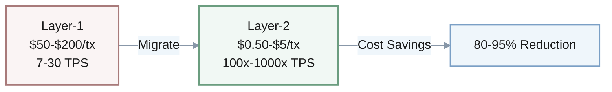
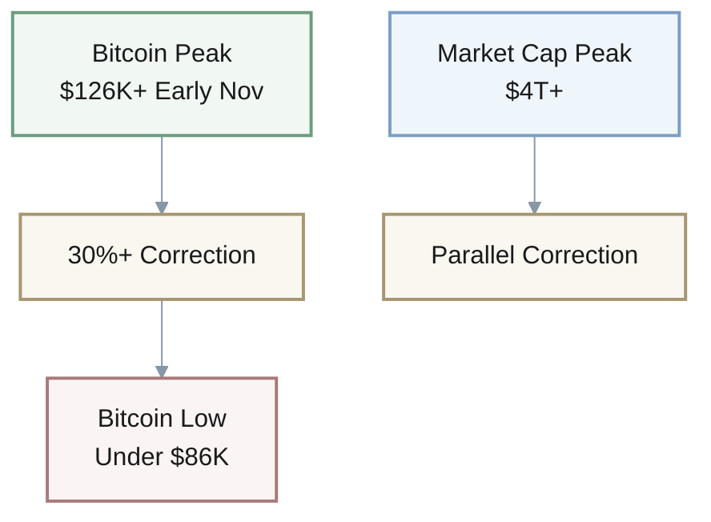
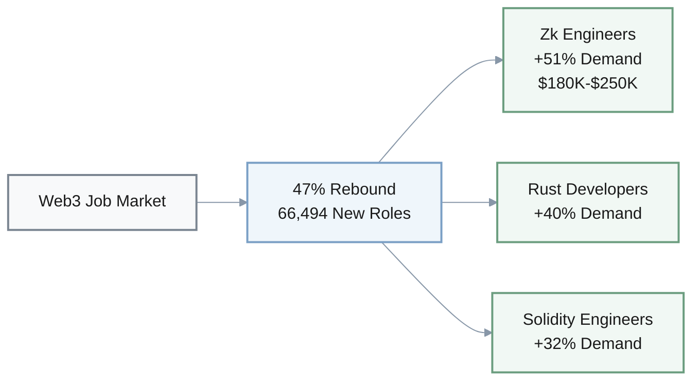
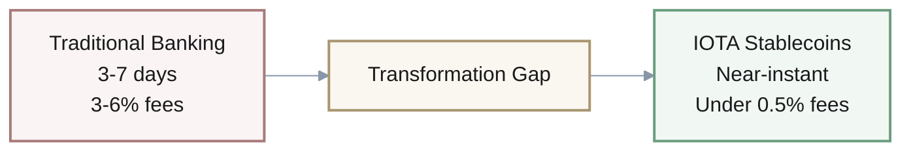
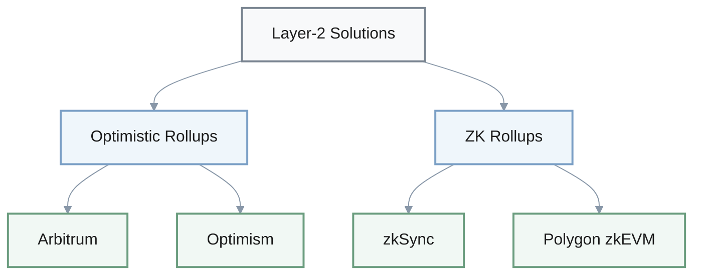
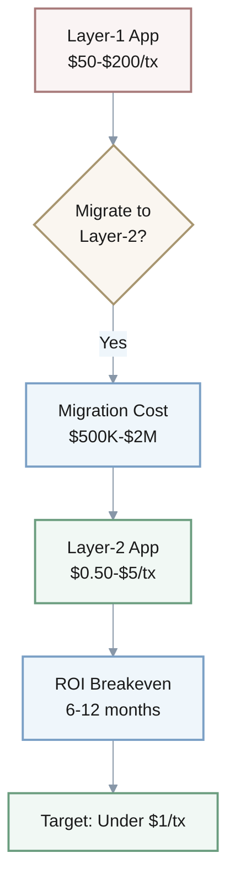
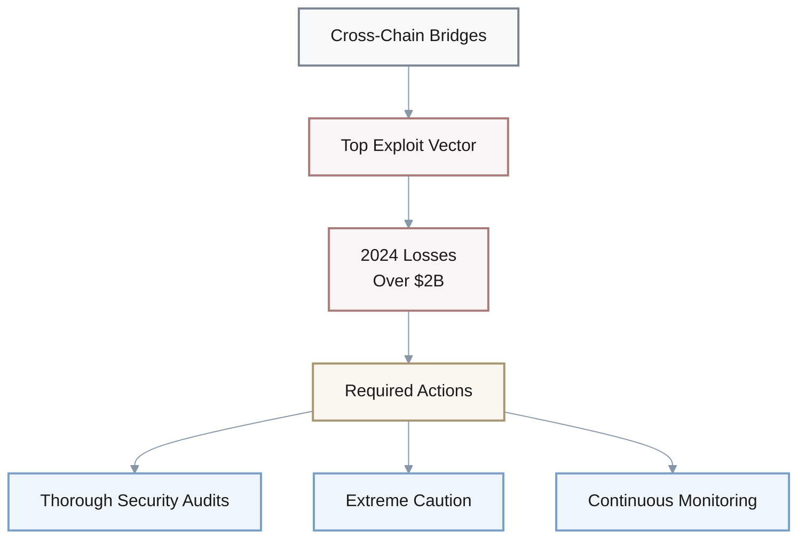

## Platform Launches & Funding

1. Q: Did you hear about Bitstarter.ai launching?
   A: **Dev A:** Yeah, November 21st. First crowdfunding platform for AI startups on Bittensor's infrastructure.
   
   **Dev B:** Hmm, on Bittensor specifically?
   
   **A:** Exactly. Decentralized AI infrastructure.
   
   **B:** Ah, I see. Makes sense for their positioning.

1. Q: Seismic just raised funding—saw that?
   A: **Analyst A:** $10M from a16z crypto.
   
   **Analyst B:** Oh nice. What do they do exactly?
   
   **A:** Help fintechs protect customer data. Cryptographic solutions.
   
   **B:** Got it. That's a solid round for infrastructure. Good validation.

**Notable Launches & Funding:**
| Company | Event | Details | Date |
|---------|-------|---------|------|
| **Bitstarter.ai** | Platform Launch | AI startup crowdfunding on Bittensor | Nov 21 |
| **Seismic** | Series A | $10M from a16z crypto for fintech data protection | Nov 2025 |

---

## Network Performance Metrics

1. Q: How fast are blockchain networks now?
   A: **Engineer A:** Over 3,400 TPS as of November.
   
   **Engineer B:** Mm-hmm. That's across all chains?
   
   **A:** Right, aggregate.
   
   **B:** Pretty wild compared to a few years ago. Massive improvement.

1. Q: Someone mentioned stablecoins hitting huge volume—
   A: **Trader A:** $46 trillion annual transaction volume.
   
   **Trader B:** Wait, trillion?
   
   **A:** Yep. Trillion.
   
   **B:** Wow. [pause] They're massive for actual usage now. Real adoption.

1. Q: What's Ethereum Layer-1 doing for TPS these days?
   A: **Dev A:** Around 15-30 TPS.
   
   **Dev B:** And Bitcoin?
   
   **A:** Still about 7 TPS.
   
   **B:** So Layer-2s are really where the action is.
   
   **A:** Exactly. That's the whole point of scaling solutions.

1. Q: How much can Layer-2 cut costs?
   A: **PM A:** 80-95% compared to Layer-1.
   
   **PM B:** Hmm, that much?
   
   **A:** Yeah. Significant savings.
   
   **B:** It's a massive difference when you're doing volume. Game-changer for apps.

**Blockchain Performance Comparison:**
| Metric | Layer-1 (BTC) | Layer-1 (ETH) | Layer-2 | Aggregate |
|--------|---------------|---------------|---------|-----------|
| **TPS** | ~7 | 15-30 | 100x-1000x | >3,400 |
| **Cost Reduction** | Baseline | Baseline | 80-95% | N/A |
| **Gas Fees** | $50-$200 | $50-$200 | $0.50-$5 | Varies |

**Stablecoin Adoption:**
- **Annual Transaction Volume**: $46 trillion (November 2025)
- **Status**: Massive real-world adoption indicator

$$
\text{Layer-2 Savings (\%)} = \frac{\text{Layer-1 Fee} - \text{Layer-2 Fee}}{\text{Layer-1 Fee}} \times 100
$$

---

## Market Metrics

1. Q: Bitcoin hit what high last month?
   A: **Trader A:** Above $126K in early November.
   
   **Trader B:** Then it dumped though, right?
   
   **A:** Yeah, dropped below $86K. That's over 30%.
   
   **B:** [pause] Brutal correction. Classic volatility.

1. Q: Total crypto market cap now?
   A: **Analyst A:** Exceeded $4 trillion in November.
   
   **Analyst B:** Oh. New high?
   
   **A:** Yeah. Then the correction hit.
   
   **B:** Right. Same pattern as Bitcoin.

**November 2025 Market Volatility:**
| Asset | Peak | Low | Correction |
|-------|------|-----|------------|
| **Bitcoin** | >$126K | <$86K | >30% |
| **Total Crypto Market Cap** | >$4T | Post-correction | Significant |

---

## Regional Initiatives

1. Q: What's the Africa ADAPT initiative targeting?
   A: **Strategy A:** $70 billion in pan-continent trade.
   
   **Strategy B:** Using what tech stack?
   
   **A:** IOTA-based stablecoins.
   
   **B:** Hmm. That's ambitious for infrastructure that's still early.

**Africa ADAPT Initiative:**
- **Target**: $70 billion pan-continent trade volume
- **Technology**: IOTA-based stablecoins
- **Status**: Ambitious early-stage infrastructure

---

## Web3 Employment Trends

1. Q: Web3 employment numbers for this year?
   A: **Recruiter A:** Rebounded about 47%. Added 66,494 new roles.
   
   **Recruiter B:** That's a pretty strong comeback.
   
   **A:** Exactly. Market's heating up again. Big recovery.

1. Q: Which dev roles have the highest demand growth?
   A: **Recruiter A:** Three standouts. Zk engineers up 51%.
   
   **Recruiter B:** What else?
   
   **A:** Solidity engineers, 32%. Rust developers, 40%.
   
   **B:** Makes sense. Those are all specialized skills. Hard to find talent.

1. Q: What are zk engineers making now?
   A: **Recruiter A:** $180K-$250K base, plus equity.
   
   **Recruiter B:** Hmm. Compared to last year?
   
   **A:** 20-30% increase year-over-year.
   
   **B:** [pause] Wow. That's steep. Supply and demand.

**2025 Web3 Job Market:**
- **Overall Growth**: 47% rebound
- **New Roles**: 66,494 positions added
- **Recovery Status**: Strong market heating up

**High-Demand Developer Roles:**
| Role | Demand Growth | Salary Range | YoY Increase |
|------|---------------|--------------|--------------|
| **Zk Engineers** | +51% | $180K-$250K | +20-30% |
| **Rust Developers** | +40% | Competitive | N/A |
| **Solidity Engineers** | +32% | Competitive | N/A |

---

## FinTech & Investment

1. Q: FinTech funding in mid-November?
   A: **Investor A:** Exceeded $2.1 billion.
   
   **Investor B:** How many deals?
   
   **A:** 25 deals.
   
   **B:** Got it. So larger deal sizes then.

1. Q: Layer-2 throughput gains?
   A: **Engineer A:** 100x to 1000x compared to Layer-1.
   
   **Engineer B:** Hmm. That's a huge range.
   
   **A:** Right. Depends on the specific platform and architecture. Implementation matters a lot.

**Mid-November 2025 FinTech Funding:**
- **Total**: $2.1+ billion
- **Deals**: 25
- **Average Deal Size**: ~$84 million

$$
\text{Average Deal Size} = \frac{\text{Total Funding}}{\text{Number of Deals}} = \frac{\$2.1B}{25} \approx \$84M
$$

**Layer-2 Performance Multiplier:**
- **Range**: 100x to 1,000x vs Layer-1
- **Factors**: Platform, architecture, implementation

---

## Cross-Border Payments

1. Q: How long does traditional cross-border banking take?
   A: **PM A:** 3-7 days with 3-6% fees.
   
   **PM B:** And IOTA stablecoins?
   
   **A:** Targeting under 0.5% fees. Near-instant settlement.
   
   **B:** Wow. That'd be transformative if it works.

**Cross-Border Payment Comparison:**
| Method | Settlement Time | Fee Range | Status |
|--------|----------------|-----------|---------|
| **Traditional Banking** | 3-7 days | 3-6% | Standard |
| **IOTA Stablecoins** | Near-instant | <0.5% | Target |

$$
\text{Fee Reduction} = \frac{3\%-6\% - 0.5\%}{3\%-6\%} \times 100 \approx 83\%-92\%
$$

---

## Regulatory Developments

1. Q: Who issued the crypto regulation warnings?
   A: **Compliance A:** Financial Stability Board in November.
   
   **Compliance B:** What's their main concern?
   
   **A:** Gaps in cryptocurrency regulations globally. Fragmented approach.

1. Q: Switzerland doing anything on crypto regulation?
   A: **Compliance A:** Launched a consultation in November.
   
   **Compliance B:** On what specifically?
   
   **A:** Stablecoins and crypto institutions.
   
   **B:** I see. They're usually ahead on this stuff. Proactive approach.

**November 2025 Regulatory Actions:**
| Entity | Action | Focus Area | Status |
|--------|--------|------------|---------|
| **Financial Stability Board** | Warning | Global regulation gaps | Fragmented |
| **Switzerland** | Consultation | Stablecoins & crypto institutions | Proactive |

---

## Technical Infrastructure

1. Q: Which Layer-2 solutions are considered battle-tested?
   A: **Engineer A:** Four main ones. Arbitrum, Optimism.
   
   **Engineer B:** And the zk ones?
   
   **A:** zkSync and Polygon zkEVM.
   
   **B:** Got it. All audited and production-ready.

1. Q: What's the recommended liquidity buffer for crypto firms?
   A: **CFO A:** 18 months minimum runway.
   
   **CFO B:** Because of market volatility?
   
   **A:** Exactly. You need that cushion. Critical safety margin.

**Battle-Tested Layer-2 Solutions:**

| Category | Solution | Status |
|----------|----------|--------|
| **Optimistic Rollups** | Arbitrum | Production-ready, audited |
| **Optimistic Rollups** | Optimism | Production-ready, audited |
| **ZK Rollups** | zkSync | Production-ready, audited |
| **ZK Rollups** | Polygon zkEVM | Production-ready, audited |

**Crypto Firm Financial Best Practices:**
- **Liquidity Buffer**: 18 months minimum runway
- **Rationale**: Market volatility cushion
- **Classification**: Critical safety margin

---

## Business Economics

1. Q: How fast can crowdfunding work versus traditional VC?
   A: **Founder A:** Typical seed round takes 6-12 months.
   
   **Founder B:** Via platforms like Bitstarter?
   
   **A:** 1-3 months.
   
   **B:** Wow. That's a huge time advantage. Totally changes fundraising.

1. Q: Layer-2 migration ROI breakeven?
   A: **CFO A:** 6-12 months for high-volume apps.
   
   **CFO B:** Assuming volume holds steady?
   
   **A:** Right. If transaction volume is consistent. Key assumption there.

1. Q: Layer-2 gas fees versus Layer-1?
   A: **Engineer A:** Layer-2 is $0.50 to $5.
   
   **Engineer B:** And Layer-1?
   
   **A:** $50-$200 per transaction.
   
   **B:** [pause] Wow. No wonder everyone's migrating. Massive savings.

1. Q: What does Layer-2 migration cost?
   A: **CFO A:** $500K to $2M for full migration.
   
   **CFO B:** That includes audit and testing?
   
   **A:** Yeah, everything to go live safely. End-to-end.

1. Q: Target transaction cost after Layer-2?
   A: **PM A:** Under $1 per transaction.
   
   **PM B:** Current baseline?
   
   **A:** $10-$50.
   
   **B:** Got it. So order of magnitude improvement.

**Fundraising Timeline Comparison:**
| Method | Duration | Speed Advantage |
|--------|----------|-----------------|
| **Traditional VC Seed** | 6-12 months | Baseline |
| **Crypto Crowdfunding** | 1-3 months | 4-12x faster |

**Layer-2 Migration Economics:**

| Metric | Layer-1 | Layer-2 | Change |
|--------|---------|---------|---------|
| **Gas Fees** | $50-$200/tx | $0.50-$5/tx | 10-400x reduction |
| **Target Cost** | $10-$50/tx | <$1/tx | 10-50x reduction |
| **Migration Cost** | N/A | $500K-$2M | One-time investment |
| **ROI Breakeven** | N/A | 6-12 months | High-volume apps |

$$
\text{Gas Fee Savings} = \frac{\text{Layer-1 Fee} - \text{Layer-2 Fee}}{\text{Layer-1 Fee}} \times 100 = \frac{\$50-\$200 - \$0.50-\$5}{\$50-\$200} \times 100 \approx 97.5\%-99\%
$$

$$
\text{Breakeven Volume} = \frac{\text{Migration Cost}}{\text{Fee Savings per Transaction}}
$$

---

## Security Considerations

1. Q: Cross-chain bridges and security—
   A: **Security A:** Top exploit vector. Over $2B lost in 2024.
   
   **Security B:** Wait, just in bridges?
   
   **A:** Just bridges.
   
   **B:** [pause] Wow. That's why they're considered high-risk. Serious vulnerability.

**Cross-Chain Bridge Security:**
- **Risk Classification**: Top exploit vector
- **2024 Losses**: >$2 billion (bridges only)
- **Status**: High-risk, serious vulnerability

> **⚠️ Security Warning**: Cross-chain bridges represent the highest exploit risk in crypto infrastructure, with over $2B lost in 2024 alone. Exercise extreme caution and conduct thorough audits before deployment.

