## 1. Creative Funding Strategies Beyond Traditional VC

**Q: We're looking at funding options beyond just crowdfunding or traditional VC. What creative approaches could we take?**

### Funding Strategy Comparison

| Strategy | Capital Range | Dilution | Key Benefits | Key Drawbacks | Timeline |
|----------|--------------|----------|--------------|---------------|----------|
| **Hybrid Crowdfunding-VC** | $500K-$1M → VC | Moderate | Validation + better VC terms | Two-stage process | 6-12 months |
| **Revenue-Based Financing** | Scales with MRR | Zero equity | No dilution, flexible repayment | Requires $20K-50K MRR first | 3-6 months |
| **Strategic Corporate** | Varies | Moderate-High | Distribution + capital + expertise | Less flexibility | 6-18 months |
| **Grants + DAOs** | $200K-$500K | Zero | Non-dilutive, community support | Technical credibility required | 3-12 months |

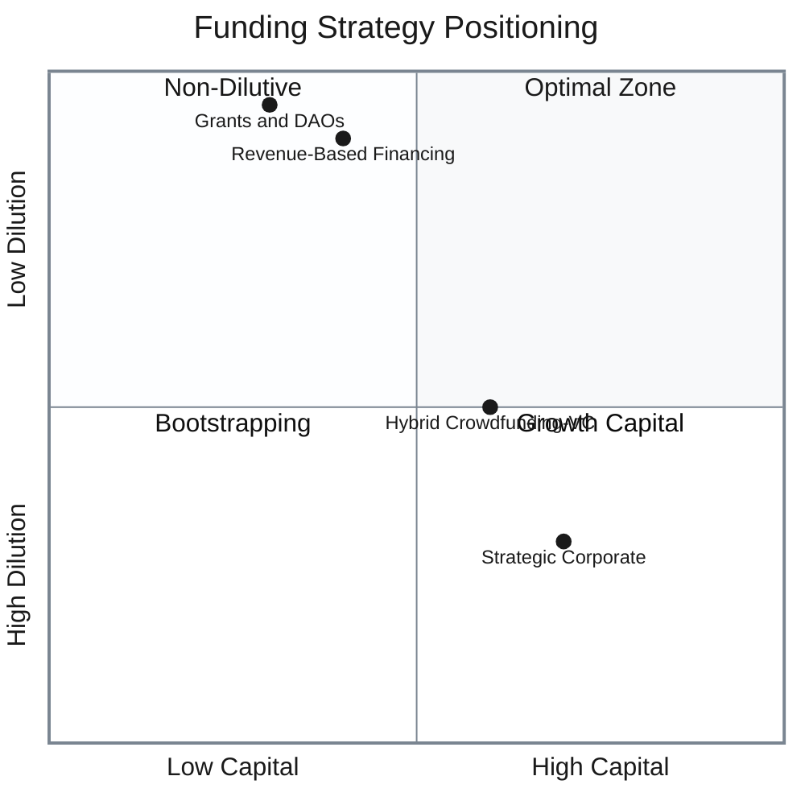

### Strategy Details

**1. Hybrid Crowdfunding-VC**
- Raise $500K-$1M via crowdfunding platforms for validation
- Leverage traction to negotiate better VC terms
- **Benefit**: Reduced time-to-capital while maintaining institutional access
- **Trade-off**: Two-stage fundraising complexity

**2. Revenue-Based Financing (RBF)**
- Deploy minimal viable product first
- Target $20K-$50K MRR before approaching RBF platforms
- **Benefit**: Zero equity dilution
- **Trade-off**: Requires proven traction first

**3. Strategic Corporate Investors**
- Partners like Coinbase Ventures, Binance Labs, Polygon Ventures
- **Benefit**: Distribution channels + capital + industry expertise
- **Trade-off**: Reduced portfolio company flexibility

**4. Grants + Community Treasuries**
- Sources: Ethereum Foundation, Polkadot Treasury, ecosystem DAOs
- Typical range: $200K-$500K combined
- **Benefit**: Zero dilution + community alignment
- **Trade-off**: Strong technical credentials required + governance participation overhead

---

## 2. Layer-2 Migration Architecture Patterns

**Q: For Layer-2 migration, everyone talks about "migrate everything." What other architectures make sense?**

### Architecture Comparison

| Architecture | Use Case Distribution | Cost Optimization | Complexity | Risk Profile |
|--------------|----------------------|-------------------|------------|--------------|
| **Intelligent Routing** | Dynamic by transaction | High | Medium-High | Medium |
| **Dual-Chain Hybrid** | Settlement vs Operations | Medium-High | Medium | Low-Medium |
| **Multi-Layer-2** | By application type | High | High | Low |

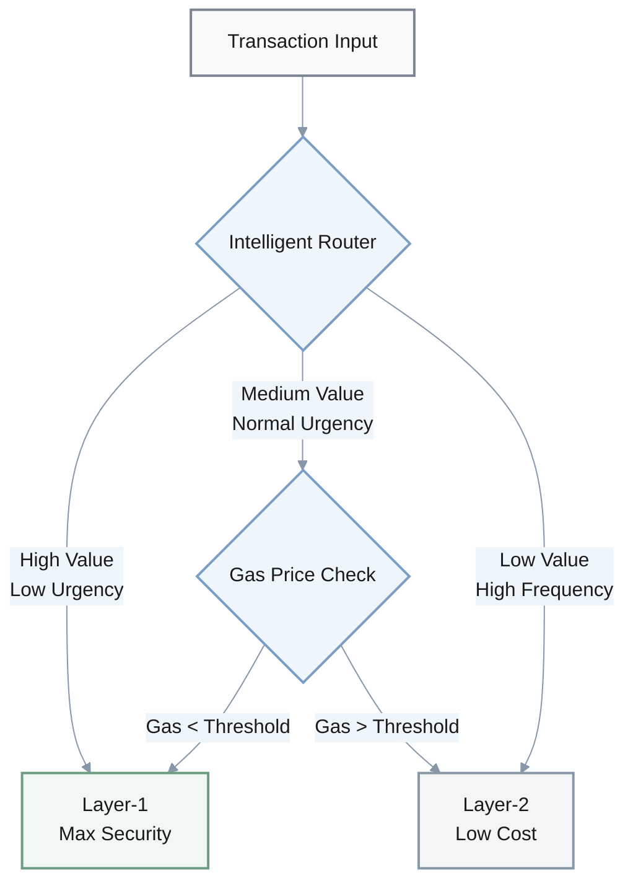

### Architecture Patterns

**1. Intelligent Routing**
- **Mechanism**: Route transactions dynamically based on value, urgency, and gas prices
- **Routing Logic**: 
  - Layer-1: High-value transactions, critical settlements
  - Layer-2: High-frequency operations, low-value transfers
- **Benefits**: Optimizes cost vs security trade-off automatically
- **Trade-offs**: Adds routing complexity + monitoring overhead

**2. Dual-Chain Hybrid**
- **Layer-1 Role**: Settlement layer + high-value transactions
- **Layer-2 Role**: High-frequency operations + user interactions
- **Benefits**: Preserves security where critical, saves costs elsewhere
- **Trade-offs**: Requires bridge infrastructure + state synchronization

**3. Multi-Layer-2 Strategy**
- **Arbitrum**: DeFi protocols (low latency, EVM compatible)
- **zkSync**: Payment processing (low fees, fast finality)
- **Polygon**: Gaming/NFTs (high throughput, low cost)
- **Benefits**: Avoids single-platform risk + optimizes per use case
- **Trade-offs**: Multiplies integration work + liquidity fragmentation

### Progressive Rollout Strategy

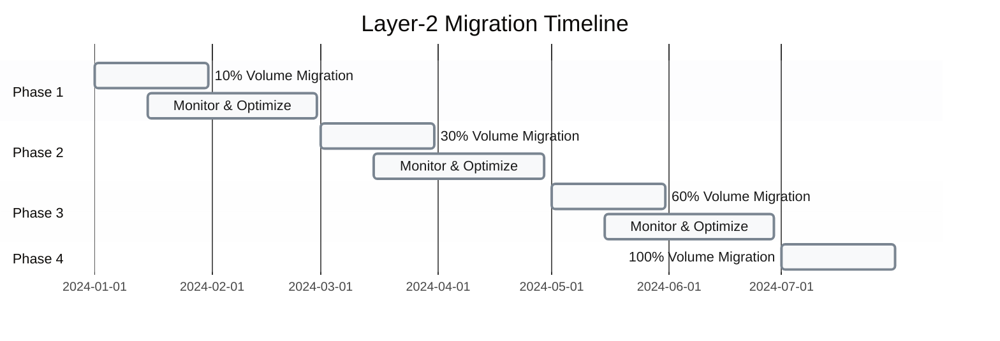

**Rollback Triggers:**
- **Latency**: Exceeds 200ms average
- **Error Rate**: Above 0.5% of transactions
- **Gas Cost**: 50%+ increase from baseline

**Implementation Requirements:**
- Sophisticated real-time monitoring dashboard
- Automated rollback mechanisms
- Cross-chain state verification tools

---

## 3. Feature Prioritization Frameworks

**Q: We need to prioritize between Layer-2 features and cross-chain. How should we think about prioritization frameworks?**

### Framework Comparison

| Framework | Decision Basis | Timeline | Risk Level | Resource Needs | Best For |
|-----------|---------------|----------|------------|----------------|----------|
| **User Pain Analysis** | Survey top 1,000 users | 2-3 weeks | Low | Low | User-centric products |
| **Competitive Gap Analysis** | Benchmark vs top 3 competitors | 1-2 weeks | Medium | Low | Fast-moving markets |
| **Partnership-Driven** | 2-3 institutional commitments | 4-8 weeks | Low | Medium | B2B/Enterprise |
| **Parallel Development** | Market feedback during beta | 3-4 months | Medium-High | High | Resource-rich teams |

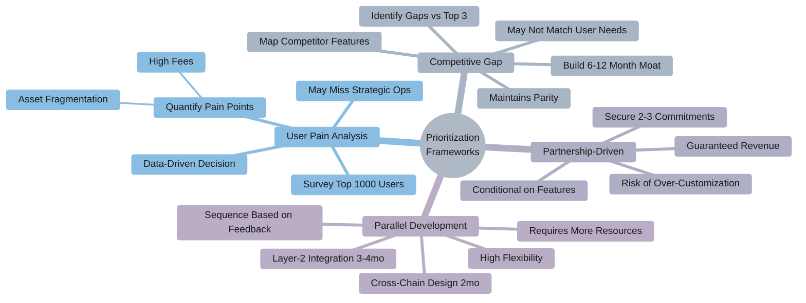

### Framework Details

**1. User Pain-Based Analysis**
- **Method**: Survey top 1,000 users on pain points
- **Key Question**: High fees vs asset fragmentation—which hurts more?
- **Decision**: Prioritize highest-impact feature based on user feedback
- **Strengths**: Data-driven, user-centric
- **Weaknesses**: May miss strategic market opportunities

**2. Competitive Gap Analysis**
- **Method**: Map competitor features and identify gaps vs top 3 players
- **Goal**: Build features that create 6-12 month competitive moat
- **Strengths**: Maintains market parity, addresses competitive threats
- **Weaknesses**: May not align with actual user needs

**3. Partnership-Driven Prioritization**
- **Method**: Secure partnership commitments from 2-3 institutional clients
- **Requirement**: Commitments conditional on specific feature delivery
- **Strengths**: Guarantees revenue, reduces market uncertainty
- **Weaknesses**: Risk of over-customization for few clients, may limit broader appeal

**4. Parallel Modular Development**
- **Approach**: 
  - Layer-2 integration: 3-4 months
  - Cross-chain design: 2 months (concurrent)
  - Sequence rollout based on Layer-2 beta feedback
- **Strengths**: Maximizes flexibility, hedges technical bets
- **Weaknesses**: Requires higher upfront resources, complex coordination

### Decision Matrix Example

$$
\text{Priority Score} = (0.4 \times \text{User Impact}) + (0.3 \times \text{Competitive Value}) + (0.2 \times \text{Revenue Potential}) + (0.1 \times \text{Technical Feasibility})
$$

**Scoring Scale**: 1-10 for each dimension

---

## 4. Go-to-Market Strategies Against TradFi Giants

**Q: TradFi giants are entering our space. Beyond direct partnerships or pure differentiation, what creative GTM strategies exist?**

**Context**: Visa, BlackRock, JPMorgan launching crypto products

### GTM Strategy Matrix

| Strategy | Market Position | TAM Size | Competitive Moat | Time to Market | Technical Complexity |
|----------|----------------|----------|------------------|----------------|---------------------|
| **B2B2C Infrastructure** | Behind-the-scenes enabler | Very Large | Medium | 6-9 months | Medium |
| **Vertical Specialization** | Niche leader | Medium | High | 3-6 months | Low-Medium |
| **Hybrid Custody** | Bridge positioning | Large | High | 9-12 months | High |
| **Education Funnel** | Thought leader | Large (long-term) | Medium-High | 12-18 months | Low |

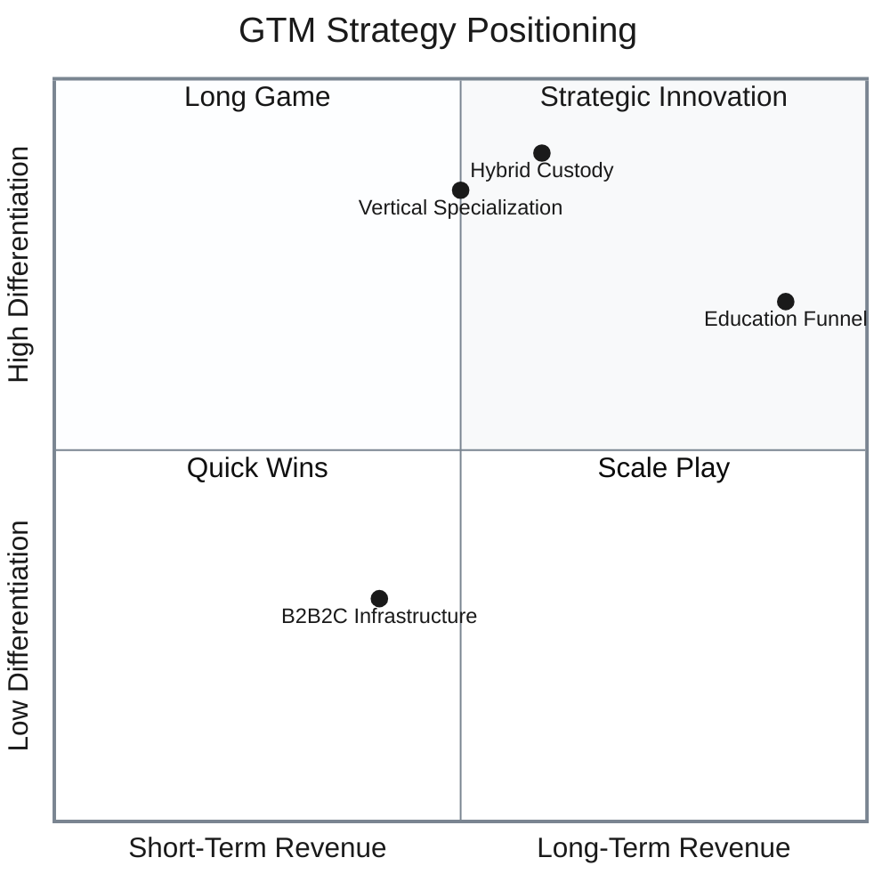

### Strategy Breakdown

**1. B2B2C Infrastructure Provider**

**Model**: White-label crypto infrastructure powering TradFi products

- **Approach**: 
  - Power TradFi crypto products with your technology stack
  - Build separate retail brand for direct consumer access
- **Benefits**: 
  - Captures scale without direct competition
  - Dual revenue streams (B2B + B2C)
- **Trade-offs**: 
  - Commoditizes core IP
  - Risk of becoming "picks and shovels" player

**Example Flow**:
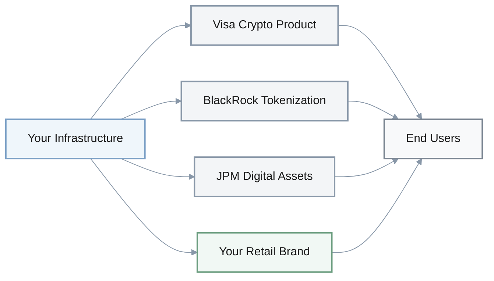

---

**2. Vertical Specialization**

**Target Verticals**: Gaming crypto payments, creator tokens, DAO treasury management

- **Rationale**: TradFi won't prioritize these for 2-3 years
- **Benefits**: 
  - Creates defensible niche position
  - Deep domain expertise
  - Community-driven growth
- **Trade-offs**: 
  - Limits total addressable market
  - May miss broader market expansion

**Vertical Priority Matrix**:
- **Gaming**: $200B market, high transaction volume
- **Creator Economy**: $100B+ market, growing 25% YoY
- **DAO Treasury**: $20B TVL, high margin

---

**3. Hybrid Custody Model**

**Positioning**: Bridge between TradFi safety and crypto sovereignty

- **Architecture**: Institutional-grade self-custody with bank-like UX
- **Value Proposition**: 
  - Non-custodial backend (user controls keys)
  - Bank-level UI/UX and compliance
  - Multi-sig, MPC, hardware security modules
- **Target Segments**: 
  - TradFi-curious institutions
  - Crypto-native users seeking compliance
- **Benefits**: Appeals to both traditional and crypto-native users
- **Trade-offs**: Complex technical architecture, regulatory complexity

---

**4. Education Funnel Strategy**

**Long-term play**: Thought leadership → trust → conversion

- **Initiative**: Free crypto literacy programs for enterprises
- **Funnel**: 
  1. Free certification programs (3-month courses)
  2. Community engagement (workshops, webinars)
  3. Pilot programs (discounted enterprise trials)
  4. Full conversion to paying customers
- **Timeline**: 12-18 month sales cycle
- **Benefits**: 
  - Builds trust and brand authority
  - Creates qualified pipeline
  - Network effects from alumni
- **Trade-offs**: 
  - Not a quick revenue win
  - Requires content + community investment

**Conversion Funnel**:

$$
\text{Customer LTV} = \text{Program Graduates} \times \text{Conversion Rate} \times \text{Annual Contract Value}
$$

**Typical Metrics**:
- Conversion rate: 15-25% of graduates
- Average contract: $50K-$200K/year
- Payback period: 18-24 months

---

## 5. Financial Risk Management Strategies (30%+ Volatility)

**Q: With 30%+ Bitcoin volatility, how can CFOs manage financial risk beyond basic hedging?**

### Risk Management Approaches

| Strategy | Risk Reduction | Implementation Cost | Timeline | Organizational Impact |
|----------|----------------|---------------------|----------|----------------------|
| **AI-Driven Hedging** | 40-60% exposure | High (quant team) | 3-6 months | Low |
| **Product Diversification** | 30-50% revenue | Medium-High | 12-18 months | High |
| **Crypto-Native Financing** | 20-40% volatility buffer | Medium | 6-9 months | Medium |
| **Flexible OpEx Model** | Margin preservation | Low | 3 months | Very High |

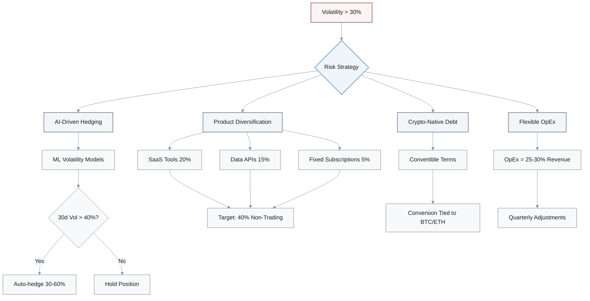

### Strategy Details

**1. AI-Driven Dynamic Hedging**

**Mechanism**: ML models predict volatility regimes and trigger automated hedging

- **Model Input**: Historical price, order flow, macro indicators, on-chain metrics
- **Trigger Threshold**: Auto-hedge 30-60% of BTC exposure when predicted 30-day volatility > 40%
- **Benefits**: Data-driven, automated, reduces emotional decision-making
- **Trade-offs**: Requires quant infrastructure, model risk, false signals

**Hedging Formula**:

$$
\text{Hedge Ratio} = \min\left(0.6, \frac{\text{Predicted Volatility} - 0.4}{0.3}\right)
$$

Where predicted volatility > 40% triggers hedging

---

**2. Product Mix Diversification**

**Goal**: Natural hedging through revenue stream diversification

**Target Mix by End-2026**:
- Trading revenue: 60%
- SaaS tools: 20%
- Data APIs: 15%
- Fixed subscriptions: 5%

**Revenue Diversification Path**:

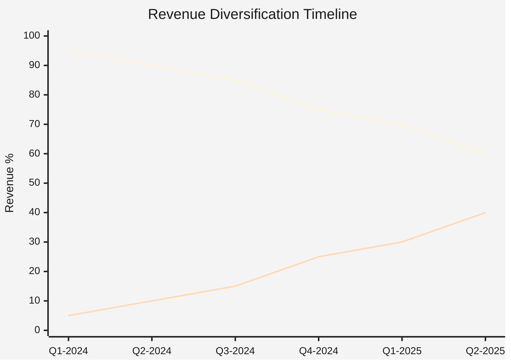

- **Benefits**: Structural risk reduction, predictable revenue streams
- **Trade-offs**: Requires new product development, 12-18 month timeline

---

**3. Crypto-Native Financing**

**Innovation**: Convertible debt with crypto-indexed conversion terms

**Structure**:
- Debt amount: $5M-$20M
- Interest rate: 5-7% (below market due to conversion optionality)
- Conversion price tied to **BTC/ETH performance** instead of equity milestones
- Example: Convert at $0.50/share if BTC drops >30%, $1.00/share if BTC stable

**Benefits**:
- Preserves liquidity during crypto downturns
- Aligns investor incentives with market conditions

**Trade-offs**:
- Complex to structure and explain
- Limited investor pool familiar with crypto-native terms

---

**4. Revenue-Linked OpEx Budget**

**Model**: Quarterly operating expenses as fixed percentage of trailing 90-day revenue

**Target Ratio**: 25-30% of revenue

**Implementation**:

$$
\text{Quarterly OpEx} = 0.25 \times \left(\frac{\sum_{i=1}^{90} \text{Daily Revenue}_i}{90}\right) \times 90
$$

**Example Scenario**:
- Bull market (revenue $10M/quarter): OpEx = $2.5M-$3M
- Bear market (revenue $4M/quarter): OpEx = $1M-$1.2M

**Benefits**:
- Preserves margins across market cycles
- Automatic cost adjustment

**Trade-offs**:
- Creates organizational uncertainty
- Difficult for long-term hiring and planning
- May require variable compensation models
- Risk of death spiral in prolonged downturn

**Operational Constraints**:
- Core team (30-40%): Fixed compensation
- Variable team (60-70%): Bonus/commission tied to revenue

---

## 6. Talent Acquisition & Retention Strategies

**Q: The talent market's incredibly tight for blockchain engineers. What creative acquisition and retention strategies can we use?**

### Strategy Comparison Matrix

| Strategy | Time to Impact | Cost Efficiency | Quality Control | Best Use Case |
|----------|---------------|-----------------|-----------------|---------------|
| **Academic Partnerships** | 3-5 years | Very High | Excellent | Long-term pipeline |
| **Bounty-Based Hiring** | 1-3 months | High | Good | Urgent specialized needs |
| **Internal Upskilling** | 6-9 months | High | Medium | Building team loyalty |
| **Equity Refresh Program** | Immediate | Medium | N/A | Retention of stars |
| **Geographic Arbitrage** | 1-3 months | Very High | Good | Budget constraints |

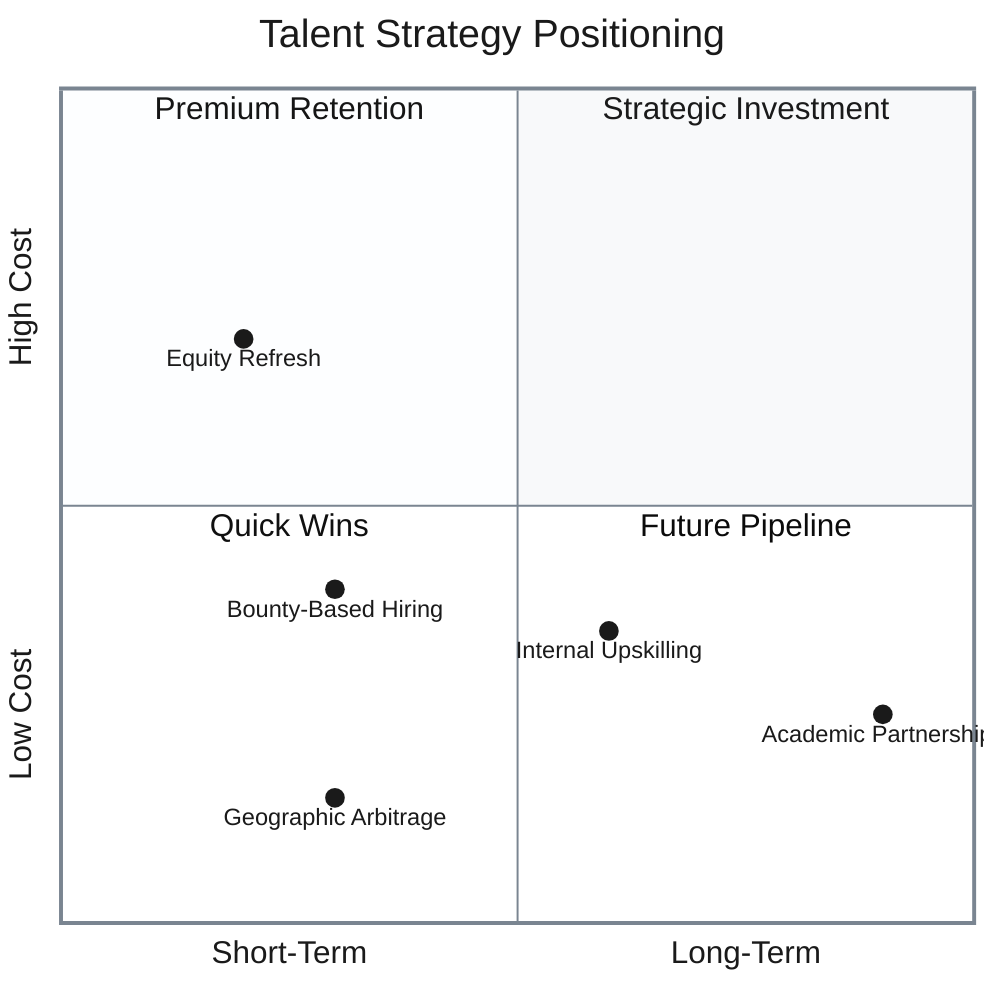

### Acquisition Strategies

**1. Academic Research Partnerships**

**Model**: Co-fund PhD research in exchange for talent pipeline

- **Investment**: $50K-$100K per PhD student annually
- **Target Areas**: ZK cryptography, consensus mechanisms, scalability research
- **Structure**:
  - Co-fund 3-5 PhD students
  - Summer internships (8-12 weeks)
  - First-look hiring rights upon graduation
  - Joint publications for credibility

**Benefits**:
- Access to cutting-edge research talent
- Brand building in academic circles
- Publications boost company credibility

**Trade-offs**:
- 3-5 year timeline to hire
- No guarantee students join post-graduation
- Requires technical advisory commitment

**ROI Calculation**:

$$
\text{Cost per Hire} = \frac{\text{Total Investment}}{\text{Conversion Rate} \times \text{Number of Students}} = \frac{\$400K}{0.4 \times 5} = \$200K
$$

vs. $150K-$250K typical recruiting costs for senior engineers

---

**2. Bounty-Based Skills Evaluation**

**Model**: Real engineering challenges as pre-screening

- **Bounty Range**: $10K-$50K per challenge
- **Challenge Types**:
  - ZK circuit optimization
  - Smart contract security audit
  - Scaling protocol design
  - MEV mitigation strategies

**Process**:
1. Post public challenges on GitHub/community forums
2. Accept submissions over 2-4 weeks
3. Fast-track top 10% performers to interviews
4. Award bounties even if not hired

**Benefits**:
- Evaluates real skills pre-hire
- Generates public relations buzz
- May get useful solutions even from non-hires
- Global reach

**Trade-offs**:
- May miss culture fit
- Risk of solution copy without attribution
- Requires clear IP agreements

**Success Metrics**:
- 100-500 submissions per challenge
- 5-10% interview conversion
- 30-50% hire rate from interviews

---

**3. Internal Upskilling Programs**

**Model**: Hire strong generalists, train into specialists

**Program Structure**:

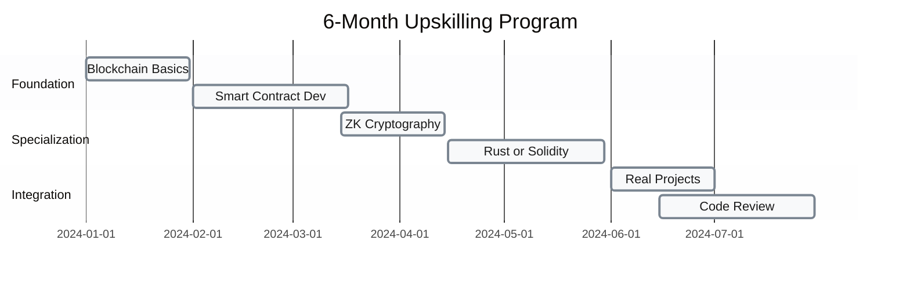

**Investment per Engineer**:
- Salary: 70% of specialist rate ($100K-$140K vs $150K-$200K)
- Training materials: $5K-$10K
- Mentor time: 10 hrs/week × $150/hr × 26 weeks = $39K
- **Total**: $145K-$190K vs $150K-$200K + recruiting costs

**Retention Mechanism**:
- Sign 2-year retention bonus ($30K-$50K)
- Vests quarterly over 24 months
- Clawed back if leaves early

**Benefits**:
- Builds loyalty (training investment)
- Cultural fit pre-screened
- Cost-competitive with direct specialist hire

**Trade-offs**:
- 6-9 month time-to-productivity
- Risk of trained talent leaving
- Requires strong internal mentorship capacity

---

### Retention Strategies

**4. Equity Refresh Program**

**Model**: Annual equity grants to retain top performers

**Structure**:
- **Eligibility**: Top 20% performers (peer + manager review)
- **Grant Size**: 0.1-0.3% additional equity per year
- **Vesting**: 2-year vest (50% after year 1, 50% after year 2)

**Fast-Track Promotion**:
- L6 → L7 in 18 months (vs typical 30-36 months)
- Clear milestone-based criteria
- Guaranteed if milestones achieved

**Financial Impact**:

$$
\text{Annual Dilution} = \text{Team Size} \times 0.2 \times 0.2\% = 100 \times 0.2 \times 0.002 = 0.4\%
$$

Per year for 100-person team

**Benefits**:
- Strong retention signal for top talent
- Performance-driven culture
- Competitive with big tech equity packages

**Trade-offs**:
- Cap table dilution (0.3-0.5% annually)
- Risk of "golden handcuffs" culture
- May create resentment among bottom 80%

---

**5. Geographic Arbitrage**

**Model**: Remote-first hiring from lower-cost regions

**Target Regions**:
- **Eastern Europe**: Poland, Ukraine, Czech Republic ($60K-$100K)
- **Latin America**: Argentina, Brazil, Mexico ($50K-$90K)
- **Southeast Asia**: Vietnam, Philippines, Indonesia ($40K-$80K)

**Compensation Philosophy**:
- Pay 50-70% of US Bay Area rates
- Target top 10% of local market (competitive locally)
- Offer equity on par with US employees

**Infrastructure Requirements**:
- Strong async communication culture (Notion, Linear, Slack)
- 4-6 hour overlap windows for real-time collaboration
- Quarterly in-person gatherings ($3K-$5K per person)

**Cost Comparison** (Senior Engineer):

| Location | Annual Comp | Benefits | Total Cost | Savings vs US |
|----------|-------------|----------|------------|---------------|
| **US (SF Bay)** | $180K | $45K | $225K | Baseline |
| **Eastern Europe** | $90K | $15K | $105K | 53% |
| **Latin America** | $75K | $12K | $87K | 61% |
| **Southeast Asia** | $65K | $10K | $75K | 67% |

**Benefits**:
- Massive cost savings (50-67%)
- Access to underutilized talent pools
- Timezone coverage (24/5 operations possible)

**Trade-offs**:
- Requires strong async culture (not all teams adapt well)
- Timezone coordination challenges
- Potential cultural/language barriers
- Visa complexities for gatherings

---

### Hybrid Strategy Recommendation

**Combine multiple approaches for balanced pipeline**:

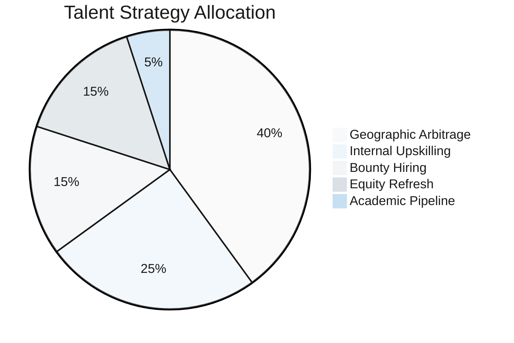

**Rationale**: Geographic arbitrage provides immediate cost relief, upskilling builds loyalty, bounties address urgent needs, equity refreshes retain stars, and academic partnerships seed long-term pipeline.
