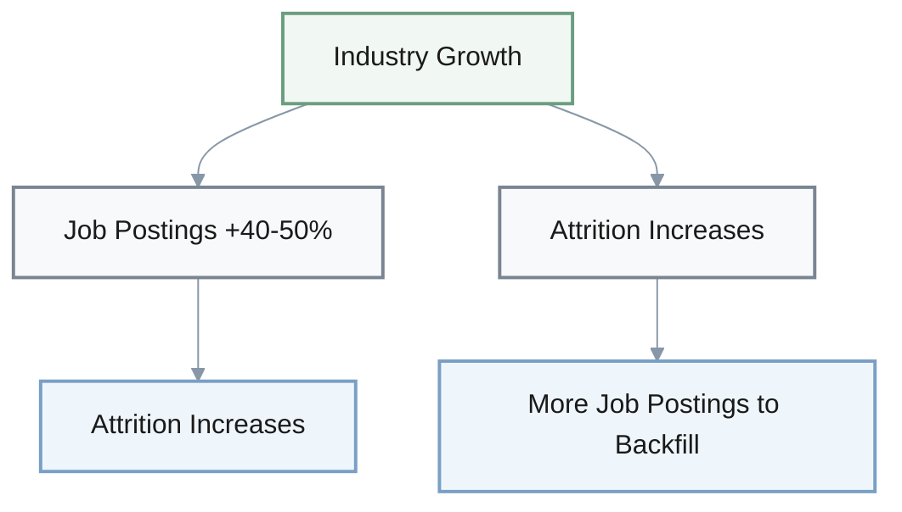

## 1. Bitstarter Crowdfunding Time-to-Capital Analysis

**Q:** This claim says crowdfunding via Bitstarter reduces time-to-capital from 6-12 months to 1-3 months but limits dilution control and investor quality. Does that logic hold up?

### Claim Summary

| Aspect | Claimed Benefit | Claimed Drawback |
|--------|----------------|------------------|
| **Time-to-capital** | 1-3 months vs. 6-12 months | None mentioned |
| **Dilution control** | Not addressed | Limited control |
| **Investor quality** | Community building | Potentially lower |

### Critical Analysis Discussion

**Analyst A:** Let's break down the assumptions first.

**Analyst B:** Mm-hmm. The 6-12 month VC timeline—is that universal?

**A:** Good catch. That varies a lot. Hot deals close in 2-3 months depending on traction and network.

**Analyst C:** Right. What about the dilution control claim?

#### Examining the Logic

**B:** They say crowdfunding "limits dilution control," but how?

**A:** [pause] Let me think... That's not explained. Actually, if founders set the terms to a crowd, they might have MORE control versus negotiating with a lead VC.

**C:** Oh interesting. VCs demand board seats, preferences, protective provisions.

**B:** Exactly. So the framing is backwards there.

**A:** Good catch.

#### Missing Trade-offs

**Issues identified:**

- **Rapid community formation risks**: Could create governance challenges or attract speculators rather than engaged members
- **Pricing pressure**: 1-3 month urgency might force suboptimal pricing
- **Hidden dilution costs**: Potentially costing more in dilution than time saved

**A:** The claim links faster capital to community building as pure benefit.

**C:** But rapid community formation without vetting?

**B:** Could create governance challenges. Or attract speculators rather than engaged members.

**A:** Also no consideration that 1-3 month urgency might force suboptimal pricing.

**C:** Potentially costing more in dilution than time saved.

#### Evidence Requirements

**What would strengthen this:**

- Actual Bitstarter deal timelines (empirical data)
- Valuation comparisons versus VC funding
- Long-term investor engagement rates
- Dilution control metrics comparison

**B:** We'd need actual Bitstarter deal timelines.

**A:** Valuation comparisons versus VC.

**C:** And long-term investor engagement rates.

**A:** Without that data, the claim is speculative.

---

## 2. Layer-2 Migration ROI Analysis

**Q:** The document claims Layer-2 migration breaks even in 6-12 months for high-volume apps, based on $450M Layer-1 costs versus $25M Layer-2 costs for 10M transactions yearly. Is this quantitative argument valid?

### Cost Comparison (10M transactions/year)

| Layer | Annual Cost | Migration Cost | Claimed Breakeven |
|-------|-------------|----------------|-------------------|
| **Layer-1** | $450M | N/A | N/A |
| **Layer-2** | $25M | $500K-$2M | 6-12 months |
| **Savings** | $425M/year | One-time | Claims validated |

### Critical Analysis Discussion

**CFO A:** Let's assess the evidence quality first.

**CFO B:** The breakeven assumes constant transaction volume.

**A:** But crypto volume swings 30-50% quarterly.

**CFO C:** So during bear markets?

**B:** ROI could extend to 18-24 months, not 6-12.

#### Hidden Costs

**Cost components excluded:**

- **Ongoing maintenance**: Infrastructure monitoring and updates
- **Monitoring infrastructure**: Real-time performance tracking
- **Rollback costs**: Contingency planning and execution
- **TCO adjustment**: Realistic total cost is 20-30% higher

**A:** The $500K-$2M migration cost quoted—does that include everything?

**C:** Good question. It excludes ongoing maintenance, monitoring infrastructure, potential rollback costs.

**B:** Realistic TCO is probably 20-30% higher.

#### Sampling Problems

**A:** They use a single 10M transaction example.

**B:** But breakeven isn't linear. At 1M transactions yearly?

**C:** Hmm... Breakeven extends to 5+ years.

**A:** So the blanket "6-12 month" claim is misleading for many businesses.

| Annual Volume | Estimated Breakeven |
|---------------|---------------------|
| **10M transactions** | 6-12 months (claimed) |
| **1M transactions** | 5+ years (actual) |
| **Variable volume** | 18-24 months (bear market) |

#### Fee Stability Assumption

**Risk factors:**

- **Current assumption**: Layer-2 fees stay at $0.50-$5
- **Adoption impact**: Congestion could raise fees 2-5x
- **ROI degradation**: Significantly extends breakeven period

**C:** It assumes Layer-2 fees stay at $0.50-$5.

**B:** As adoption increases, Layer-2 congestion could raise fees 2-5x.

**A:** Degrading the ROI significantly.

#### Evidence Requirements

**Strengthening the argument:**

1. **Sensitivity analysis** across 3-5 volume scenarios
2. **Full TCO inclusion**, not just migration cost
3. **Layer-2 fee volatility** assumptions and scenarios
4. **Non-linear breakeven** modeling for different scales

**B:** We'd need sensitivity analysis across 3-5 volume scenarios.

**C:** Inclusion of full TCO, not just migration cost.

**A:** And Layer-2 fee volatility assumptions.

**B:** Without those, the quantitative claim is too optimistic.

---

## 3. Bitcoin 30% Correction Causal Attribution

**Q:** The source attributes Bitcoin's 30% correction to macro factors rather than crypto-structural issues, suggesting intact long-term fundamentals. Is this causal attribution justified?

### Attribution Framework

| Factor Type | Claimed Cause | Alternative Explanations |
|-------------|---------------|--------------------------|
| **Macro factors** | Fed policy, equity risk-off | Primary attribution |
| **Crypto-specific** | Not mentioned | Exchange liquidations, whale selling, regulatory announcements, derivatives dynamics |
| **Evidence** | None quantified | Correlation strength not analyzed |

### Critical Analysis Discussion

**Analyst A:** Let's examine correlation versus causation.

**Analyst B:** They attribute the decline to macro factors—Fed policy, equity risk-off.

**A:** But where's the quantitative analysis? Correlation strength between Fed announcements and BTC price?

**Analyst C:** Could be coincidental.

#### Alternative Explanations

**Crypto-specific factors not considered:**

- **Exchange liquidations**: Forced selling cascades
- **Whale selling**: Large holder distribution events
- **Regulatory announcements**: Policy uncertainty impacts
- **Derivatives market dynamics**: Leverage unwinding

**B:** What about crypto-specific factors?

**C:** Exchange liquidations, whale selling, regulatory announcements.

**A:** Derivatives market dynamics.

**C:** Right.

**B:** Any of those could equally explain the drawdown.

**C:** But they're not considered in the analysis.

#### Survivorship Bias

**Flawed assumption:**

- **Claim**: "Market structure is stronger than prior cycles"
- **Assumption**: Institutional adoption prevents crashes
- **Reality**: Institutions can amplify volatility through coordinated risk-off
- **Historical precedent**: March 2020 institutional panic selling

**A:** The claim that "market structure is stronger than prior cycles"—

**B:** Assumes institutional adoption prevents crashes.

**C:** But institutions can amplify volatility through coordinated risk-off.

**A:** We saw that in March 2020.

#### Unfalsifiable Claims

**B:** "Intact long-term fundamentals"—that's subjective.

**C:** Good point. What evidence would disprove it?

**A:** Exactly. No clear metrics provided. It's not falsifiable.

**Methodological issues:**

- **Vague terminology**: "Intact long-term fundamentals" lacks clear definition
- **No falsification criteria**: What evidence would disprove this claim?
- **Subjective assessment**: No objective metrics provided

#### Evidence Requirements

**Better approach needed:**

1. **Regression or event studies**: Quantify causal relationships
2. **Variance decomposition**: Isolate macro versus crypto-specific variance
3. **Falsifiable criteria**: Define "structural" versus "cyclical" with clear metrics
4. **Address contradictions**: Acknowledge macro correlation challenges "uncorrelated asset" narrative

**B:** We'd need regression or event studies.

**C:** Isolating macro versus crypto-specific variance.

**A:** Define falsifiable criteria for "structural" versus "cyclical."

**B:** And acknowledge that macro correlation itself challenges the "uncorrelated asset" narrative many assumed.

---

## 4. TradFi Entry Impact on Crypto Firms

**Q:** The document says TradFi entry represents both validation and threat to crypto firms. Does this framing appropriately represent the relationship?

### Framing Analysis

| Perspective | Impact Assessment | Weighting Issue |
|-------------|-------------------|-----------------|
| **Validation** | Market legitimacy | Assumed equal |
| **Threat** | Competition pressure | Assumed equal |
| **Reality** | Not equal weights | For most startups: overwhelmingly threat |

### Critical Analysis Discussion

**Strategy A:** "Both validation and threat"—sounds balanced.

**Strategy B:** But are they equal weights?

**A:** That's the framing bias. For most crypto startups, it's overwhelmingly a threat.

**Strategy C:** They lack resources to compete.

#### Hidden Assumption

**Validation assumption flaws:**

- **Assumption**: "Validation" matters to crypto firms' customers
- **Counter-argument**: Crypto-native users might view TradFi entry as co-option
- **Alternative view**: Dilution of crypto values
- **Net effect**: Could reduce legitimacy rather than increase it

**B:** The claim assumes "validation" matters to crypto firms' customers.

**C:** But crypto-native users might view TradFi entry as co-option.

**A:** Or dilution of crypto values.

**C:** Exactly.

**B:** Reducing legitimacy rather than increasing it.

#### False Dichotomy

**C:** The framing implies only two effects—validation and threat.

**A:** Smart observation. But there are other impacts. Talent war intensification.

**B:** Regulatory acceleration.

**C:** Potential M&A opportunities, technology licensing deals.

**A:** None of that is captured in the binary framing.

**Additional impacts not considered:**

- **Talent war intensification**: Competition for skilled professionals
- **Regulatory acceleration**: Faster policy development
- **M&A opportunities**: Acquisition targets and partnerships
- **Technology licensing**: IP sharing and collaboration
- **Market segmentation**: New niche opportunities

#### Survivorship Bias

**Temporal assumption flaw:**

- **Implicit assumption**: Crypto firms survive to experience "validation"
- **Reality**: Many may be acquired or fail during transition
- **Outcome**: Validation becomes irrelevant for failed firms

**B:** The argument assumes crypto firms survive to experience "validation."

**C:** Many may be acquired or fail during transition.

**A:** Making validation moot.

#### Improved Analysis Framework

**Better analysis needed:**

1. **Segment by firm type**: Infrastructure providers vs. retail platforms vs. DeFi protocols
2. **Quantify magnitude**: Relative impact for each segment
3. **Time dimension**: Short-term vs. long-term effects
4. **Avoid overgeneralization**: Context-specific analysis

**C:** Segment impact by firm type.

**B:** Infrastructure providers versus retail platforms versus DeFi protocols.

**A:** Quantify relative magnitude for each segment.

**C:** Rather than generalizing across all crypto firms.

---

## 5. Regulatory Infrastructure Investment (12-15% Opex)

**Q:** The source recommends 12-15% of opex for regulatory infrastructure in 2026. Is the evidence and logic sufficient to support this recommendation?

### Recommendation Summary

| Metric | Recommendation | Missing Analysis |
|--------|---------------|------------------|
| **Investment level** | 12-15% of opex | Cost-benefit analysis |
| **Target jurisdictions** | 2-3 core jurisdictions | Selection criteria |
| **Applicability** | All crypto firms | Business model segmentation |

### Critical Analysis Discussion

**Compliance A:** Where's the cost-benefit analysis?

**Compliance B:** What's the expected cost of non-compliance?

**A:** Fines, shutdowns, lost partnerships.

**Compliance C:** Without that comparison, we can't assess if 12-15% is optimal.

#### Missing Criteria

**Jurisdiction selection issues:**

- **Question**: Which 2-3 core jurisdictions?
- **Possible criteria**: User concentration? Revenue? Regulatory friendliness?
- **Problem**: Different criteria yield different choices with different costs
- **Gap**: No decision framework provided

**B:** "2-3 core jurisdictions"—which ones?

**A:** Based on user concentration? Revenue? Regulatory friendliness?

**C:** Hmm... Different criteria yield different choices with different costs.

**B:** No decision framework provided.

#### Opportunity Cost Ignored

**Trade-offs not quantified:**

$$
\text{Opportunity Cost} = \text{Growth Foregone} + \text{Competitive Disadvantage}
$$

**Resource allocation impact:**

- **Direct impact**: 12-15% on compliance reduces funds for:
  - Product development
  - Marketing initiatives
  - Talent acquisition
- **Indirect impact**: Growth velocity reduction
- **Competitive effect**: Positioning disadvantage
- **Analysis gap**: Trade-offs not quantified

**C:** Spending 12-15% on compliance reduces funds for product, marketing, talent.

**A:** Good point. What's the trade-off in growth foregone?

**B:** Or competitive positioning impact?

**C:** The analysis doesn't quantify that.

#### Overgeneralization

**A:** This blanket recommendation applies to all crypto firms.

**B:** But optimal strategy varies by business model.

**C:** Custodial versus non-custodial. Stablecoin issuer versus DEX aggregator.

**A:** Very different regulatory needs.

| Business Model | Regulatory Intensity | Optimal Investment |
|----------------|---------------------|-------------------|
| **Custodial platforms** | High | 15-20% opex |
| **Non-custodial protocols** | Low | 5-8% opex |
| **Stablecoin issuers** | Very high | 20-25% opex |
| **DEX aggregators** | Medium | 8-12% opex |

#### Strengthening Requirements

**How to strengthen:**

1. **Segment by firm type**: Custodial vs. non-custodial, issuer vs. aggregator
2. **Expected value analysis**: Proactive vs. reactive compliance costs
3. **Opportunity cost quantification**: Growth impact modeling
4. **Context-dependent framework**: Not one-size-fits-all approach

**B:** Segment recommendations by firm type.

**C:** Provide expected value analysis—proactive versus reactive compliance costs.

**A:** Acknowledge optimal compliance spend is context-dependent.

**B:** Not one-size-fits-all.

---

## 6. Africa ADAPT Integration Break-Even Analysis

**Q:** The Africa ADAPT analysis claims break-even at $50-100M annual volume given $200K-$500K integration costs. Critique this reasoning.

### Claimed Economics

| Component | Claimed Value | Reality Check |
|-----------|---------------|---------------|
| **Integration cost** | $200K-$500K | Covers API, compliance, testing only |
| **Break-even volume** | $50-100M annually | Assumes linear cost savings |
| **Realistic total cost** | Not stated | $400K-$1.5M (2-3x estimate) |
| **Realistic break-even** | Not calculated | $150M-$200M |

### Critical Analysis Discussion

**Strategy A:** That integration cost estimate—what does it cover?

**Strategy B:** Says API, compliance, testing.

**A:** But excludes legal review across multiple African jurisdictions.

**Strategy C:** That's another $100K-$300K easily.

#### Incomplete Cost Accounting

**Missing cost components:**

- **Legal review**: Multi-jurisdiction analysis ($100K-$300K)
- **Liquidity provision**: Capital locked for market-making
- **FX hedging infrastructure**: Currency risk management systems
- **Operational overhead**: Local banking relationships, customer support
- **Reality**: Realistic cost is 2-3x the estimate → $400K-$1.5M

**B:** What about liquidity provision costs?

**A:** FX hedging infrastructure.

**C:** Ongoing operational overhead—local banking relationships, customer support.

**A:** Right.

**B:** Realistic cost is 2-3x the estimate.

**A:** So $400K-$1.5M, not $200K-$500K.

#### Oversimplified Break-Even Model

**Linear assumption flaw:**

- **Claimed assumption**: Linear cost savings per transaction
- **Reality**: Early-stage volume faces worse FX spreads
- **Consequence**: Higher per-transaction operational costs until scale
- **Actual break-even**: $150M-$200M, not $50-100M

**C:** They assume linear cost savings per transaction.

**A:** But early-stage volume faces worse FX spreads.

**B:** Exactly. Higher per-transaction operational costs until scale.

**C:** Actual breakeven could be $150M-$200M.

#### Unexamined Risk

**A:** It mentions regulatory uncertainty and liquidity constraints as risks.

**B:** But doesn't quantify probability or downside.

**A:** True.

**C:** If ADAPT regulatory framework fails?

**A:** Or if IOTA ecosystem remains illiquid?

**B:** The entire $500K investment is at risk regardless of volume.

**Risk assessment gaps:**

| Risk Factor | Mentioned? | Quantified? | Downside Impact |
|-------------|------------|-------------|-----------------|
| **Regulatory uncertainty** | Yes | No | Total investment loss |
| **Liquidity constraints** | Yes | No | Total investment loss |
| **ADAPT framework failure** | No | No | Total investment loss |
| **IOTA illiquidity** | No | No | Total investment loss |

#### Geographic Overgeneralization

**C:** "Africa" encompasses 54 countries.

**A:** Good point. Vastly different regulatory regimes, currency stability, banking infrastructure.

**B:** Nigeria-Kenya corridor has different economics than South Africa-Ghana.

**Heterogeneity issues:**

- **Scale**: 54 countries with vastly different contexts
- **Regulatory diversity**: Different legal frameworks per country
- **Currency stability**: Varies dramatically across regions
- **Banking infrastructure**: Maturity levels differ significantly
- **Example**: Nigeria-Kenya corridor ≠ South Africa-Ghana corridor

#### Improved Methodology

**Better approach:**

1. **Corridor-specific modeling**: Break-even analysis per remittance corridor
2. **Realistic cost ranges**: Include all cost components (2-3x quoted)
3. **Stress testing**: Model regulatory and liquidity failure scenarios
4. **Probabilistic framework**: Acknowledge uncertainty in frontier markets

**C:** Model breakeven per corridor with realistic cost ranges.

**A:** Stress-test against regulatory and liquidity failure scenarios.

**B:** Acknowledge breakeven is probabilistic, not deterministic in frontier markets.

---

## 7. Talent Attrition and Job Availability Causality

**Q:** The talent section claims "with 40-50% more roles available, attrition risk rises." Is this causal relationship logically valid?

### Claimed Relationship

| Variable | Change | Claimed Effect |
|----------|--------|----------------|
| **Job availability** | +40-50% increase | Causes attrition rise |
| **Attrition risk** | Increases | Effect (magnitude unstated) |
| **Causal direction** | Assumed unidirectional | Not validated |

### Critical Analysis Discussion

**HR A:** Let's look at confounding variables first.

**HR B:** Higher job availability linked to higher attrition.

**A:** But attrition is multi-causal. Compensation, culture, growth opportunities.

**HR C:** Management quality, remote work policies.

**B:** Increased external opportunities is ONE factor.

**A:** Not necessarily dominant.

#### Confounding Variables

**Multiple attrition drivers:**

- **Compensation**: Pay and benefits competitiveness
- **Culture**: Work environment and values alignment
- **Growth opportunities**: Career advancement paths
- **Management quality**: Leadership effectiveness
- **Remote work policies**: Flexibility and work-life balance
- **External opportunities**: One factor among many, not necessarily dominant

#### Directionality Unclear

**C:** The statement implies more roles cause attrition.

**B:** But could it be reverse causation?

**A:** Oh interesting. Rising attrition drove companies to post more roles to backfill.

**C:** Or both driven by a third factor—industry growth.

**Possible causal relationships:**

**Three competing hypotheses:**
1. **Direct causation**: More roles → higher attrition
2. **Reverse causation**: Higher attrition → more roles (backfilling)
3. **Common cause**: Industry growth → both more roles AND higher attrition

#### Magnitude Missing

**B:** "Attrition risk rises" is qualitative.

**A:** Does 40-50% more roles translate to 5% higher attrition? 20%?

**C:** Without magnitude, the claim doesn't inform decisions.

**Quantification gap:**

- **Job posting change**: 40-50% increase (quantified)
- **Attrition change**: "Rises" (not quantified)
- **Decision utility**: Cannot assess impact without magnitude

#### Segment Differences

**B:** The claim generalizes across all roles.

**A:** But attrition sensitivity varies dramatically.

**C:** True. Commodity skills like junior Solidity devs have high elasticity.

**B:** Specialized skills like zk cryptography leads?

**A:** Low elasticity. Limited external opportunities, high switching costs.

| Role Type | Attrition Elasticity | External Opportunities | Switching Costs |
|-----------|---------------------|------------------------|-----------------|
| **Junior Solidity devs** | High | Many alternatives | Low |
| **Senior protocol engineers** | Medium | Moderate alternatives | Medium |
| **ZK cryptography leads** | Low | Limited alternatives | High |
| **Blockchain researchers** | Very low | Highly specialized | Very high |

#### Evidence Requirements

**Strengthening the claim:**

1. **Empirical correlation**: Job posting growth vs. attrition rates in Web3
2. **Role segmentation**: Analyze by skill type and seniority
3. **Magnitude quantification**: Specific attrition increase percentage
4. **Retention program impact**: Strong programs can decouple external opportunities from internal attrition

**C:** We'd need empirical data correlating job posting growth with attrition rates in Web3.

**B:** Right. Segmentation by role type.

**A:** And acknowledgment that strong retention programs can decouple external opportunity growth from internal attrition.

**C:** Without that, the causal claim is weak.

---
