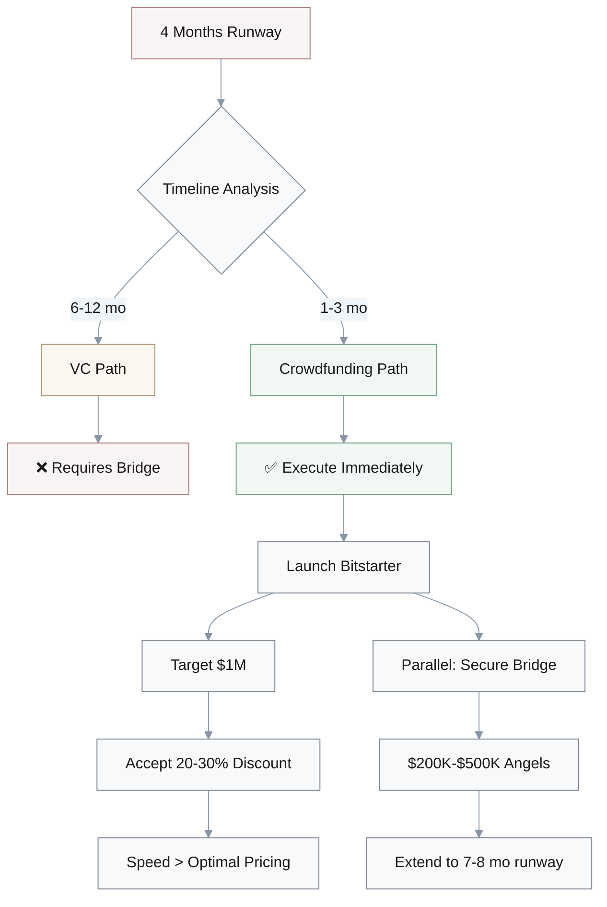
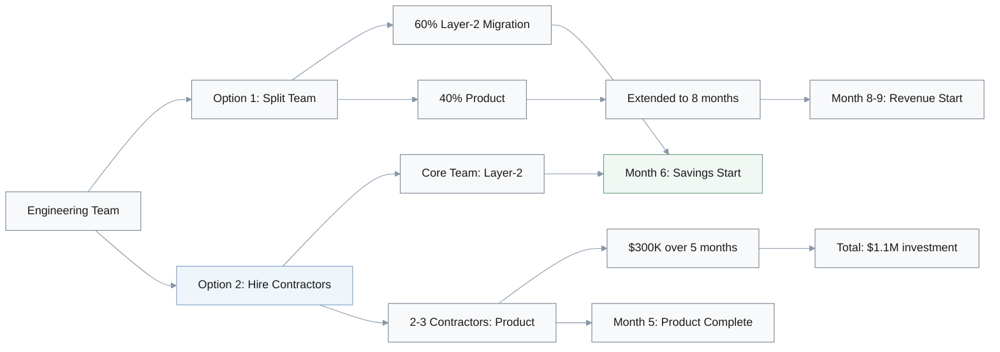
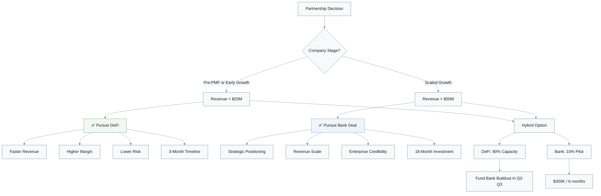
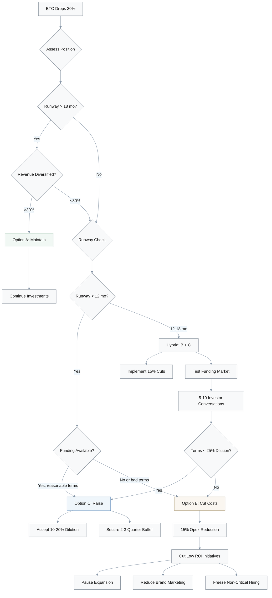
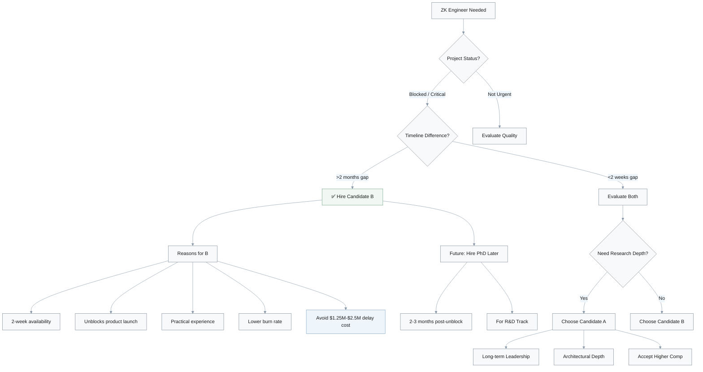
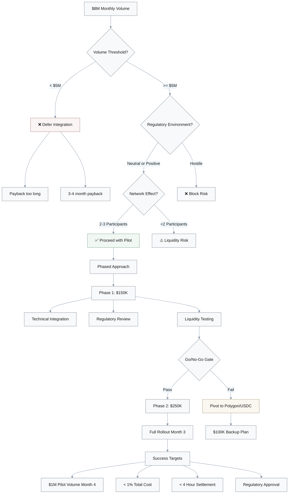
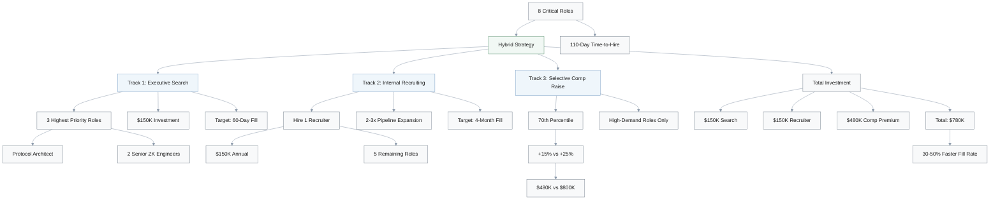

# Strategic Decision Analysis

---

## 1. Funding Strategy: Crowdfunding vs VC

**Q: We've got 4 months of runway left. Should we pursue Bitstarter crowdfunding or traditional VC?**

### Decision Timeline Analysis

| Funding Method | Timeline | Feasibility |
|---|---|---|
| Traditional VC | 6-12 months | ❌ Infeasible (exceeds runway) |
| Crowdfunding (Bitstarter) | 1-3 months | ✅ Viable |
| Bridge Funding (Angels) | 2-4 weeks | ✅ Backup option |

### Decision Flow

### Dialogue

**Founder A:** Hmm, let's map this out. Cash-out date is 4 months away.

**Founder B:** Right. VC timeline is 6-12 months.

**Founder C:** So VC is infeasible without a bridge.

**A:** Exactly. Crowdfunding is 1-3 months. That's viable.

**B:** Got it.

**The action plan:**

**B:** Execute crowdfunding immediately with a fallback.

**C:** Makes sense. Launch Bitstarter campaign targeting $1M.

**A:** Right. Accept valuation 20-30% below VC comps. Speed over optimal pricing.

**C:** Mm-hmm.

**B:** Parallel track—secure $200K-$500K bridge from angels or existing investors.

**C:** To extend runway to 7-8 months if crowdfunding stalls.

**A:** Exactly.

**Future optionality:**

**A:** Plus, we can use crowdfunding traction as leverage for VC conversations.

**B:** Right. 3-6 months post-raise.

**C:** Good point. The trade-offs?

**A:** We sacrifice optimal valuation but preserve company survival.

**B:** And also get validation for a later institutional round.

**C:** True.

### Success Metrics

| Milestone | Timeline | Target |
|---|---|---|
| Campaign live | Week 2 | ✅ Platform ready |
| Minimum commitment | Week 6 | $500K secured |
| Close round | Week 10 | $1M total |
| **Trigger**: Bridge activation | Week 4 | If <50% of target |

**Success metrics:**

**C:** Campaign live within 2 weeks.

**A:** $500K minimum commitment within 6 weeks.

**B:** Close within 10 weeks.

**C:** And if we're not tracking to target by week 4—

**A:** Activate bridge discussions immediately.

**B:** Agreed.

---

## 2. Technical Migration: Layer-2 Cost Optimization vs Product Launch

**Q: We're spending $36M annually on Layer-1 gas. Should we migrate to Layer-2 or focus on our new product launch?**

### Financial Analysis

**Annual Gas Cost (Current):**
$$
\text{Annual Gas Cost} = \$36M
$$

**Layer-2 Migration Economics:**
$$
\text{Annual Savings} = \$36M \times 93.3\% = \$33.6M
$$

$$
\text{ROI} = \frac{\$33.6M}{\$800K} = 42x
$$

$$
\text{Payback Period} = \frac{\$800K}{\$33.6M/365} = 8.7 \text{ days}
$$

**Product Opportunity Cost:**
$$
\text{NPV Loss from 5-month Delay} = \frac{\$10M}{12} \times 5 = \$4.2M
$$

### Cost-Benefit Comparison

| Option | Revenue/Savings | Cost | Timeline | NPV Impact |
|---|---|---|---|---|
| **Layer-2 Migration** | $33.6M/year | $800K | 5 months | +$29.4M Year 1 |
| **New Product** | $10M/year | Team time | 5 months | +$6M Year 1 |
| **Opportunity Cost** | - | - | 5-mo delay | -$4.2M |
| **Net Decision** | Layer-2 Priority | - | - | **+$25.2M net** |

### Resource Allocation Strategy

### Dialogue

**CFO A:** Let's run the numbers first.

**CFO B:** Right. Layer-2 saves $33.6M annually with $800K upfront cost.

**Engineer A:** Wow. That's a 42x ROI. 9-day payback period.

**CFO A:** Exactly.

**But there's opportunity cost:**

**PM A:** Hmm. New product could generate $10M additional annual revenue.

**PM B:** True, but requires 5 months engineering though.

**CFO A:** Right. If delayed 5 months, NPV loss is around $4M.

**Engineer B:** Got it, but $33.6M savings dwarfs $4M opportunity cost.

**CFO B:** Exactly.

**Decision path:**

**CFO B:** So pursue parallel execution with split team.

**Engineer A:** Makes sense. 60% of senior engineers on Layer-2 migration.

**Engineer B:** And 40% on new product with extended timeline—8 months instead of 5.

**PM A:** Right. Migration has immediate compounding benefit.

**PM B:** Mm-hmm. Savings start month 6, product revenue starts month 8-9.

**CFO A:** Got it.

**Alternative approach:**

**CFO A:** Or we could hire 2-3 contract engineers for $300K over 5 months.

**Engineer A:** To backfill new product work.

**CFO B:** Right. Increases cost to $1.1M but captures both opportunities.

**PM A:** Smart.

### Success Metrics

| Milestone | Timeline | Target |
|---|---|---|
| Layer-2 pilot live | Month 4 | ✅ Testing complete |
| Full migration | Month 6 | 100% traffic migrated |
| Product beta | Month 7-8 | User testing |
| Gas cost reduction | Month 7 | >80% savings achieved |

**Success metrics:**

**Engineer B:** Layer-2 pilot live month 4.

**PM A:** Full migration month 6.

**PM B:** Product beta month 7-8.

**CFO A:** And gas costs reduced over 80% by month 7.

**Engineer A:** Agreed.

---

## 3. Partnership Strategy: Bank Deal vs DeFi Integration

**Q: We have two partnership opportunities—a $15M bank deal or a $4M DeFi integration. Which should we pursue?**

### Partnership Comparison Matrix

| Factor | Bank Deal | DeFi Integration |
|---|---|---|
| **Annual Revenue** | $15M | $4M |
| **Gross Margin** | 25% | 60% |
| **Net Profit** | $3.75M | $2.4M |
| **Sales Cycle** | 18 months | 3 months |
| **Upfront Investment** | $3M (compliance) | Minimal (existing stack) |
| **Risk Level** | High (no guarantee) | Low (proven tech) |
| **Payback Period** | 9.6 months | Immediate |
| **Strategic Value** | Enterprise positioning | Fast revenue |

### Profit Calculations

**Bank Deal:**
$$
\text{Net Profit} = \$15M \times 0.25 = \$3.75M
$$

**DeFi Integration:**
$$
\text{Net Profit} = \$4M \times 0.60 = \$2.4M
$$

### Decision Framework by Company Stage

### Dialogue

**Commercial A:** Let's break down the factors.

**Commercial B:** Right. Bank deal: $15M annual revenue, 25% margins.

**Commercial C:** So that's $3.75M net profit.

**A:** Mm-hmm. DeFi: $4M revenue, 60% margins.

**B:** Which is $2.4M net profit.

**C:** Got it.

**Timeline and risk:**

**C:** Bank deal has 18-month sales cycle.

**A:** Right. Requires $3M investment in bank-grade compliance infrastructure.

**B:** Whereas DeFi is 3-month timeline, leverages existing tech stack.

**A:** Exactly.

**Strategic considerations:**

**C:** Good question—what's our current stage?

**A:** Hmm. If we're pre-PMF or early-growth, revenue under $20M annually—

**B:** Then pursue DeFi partnership.

**C:** Makes sense. Faster revenue, higher margin, lower risk, shorter payback.

**A:** Right. Bank deal burns cash and team focus for 18 months without guaranteed outcome.

**B:** True.

**For scaled companies:**

**B:** But if we're at scaled growth stage, revenue over $50M, strong balance sheet—

**C:** Then pursue bank deal for strategic positioning and revenue scale.

**A:** Exactly. Despite longer timeline.

**C:** Got it.

**Hybrid option:**

**B:** Or, soft-commit to bank partnership with 6-month pilot scoping.

**C:** Right. 10% team capacity, $300K investment.

**A:** While executing DeFi integration fully—90% capacity.

**B:** And use DeFi success and revenue to fund bank compliance buildout in quarters 2-3.

**C:** Smart approach.

### Success Metrics Timeline

| Milestone | Timeline | Target |
|---|---|---|
| DeFi integration live | Month 3 | Platform operational |
| DeFi revenue milestone | Month 6 | $1M cumulative |
| Bank pilot scope agreed | Month 6 | Terms finalized |
| Full bank deal signed | Month 12-18 | Contract executed |

**Success metrics:**

**C:** DeFi integration live month 3, $1M revenue by month 6.

**A:** Bank pilot scope agreed month 6.

**B:** Full bank deal signed month 12-18.

**A:** Agreed.

---

## 4. Market Downturn Response: BTC Price Drop Strategy

**Q: Bitcoin just dropped 30% from our Q4 forecast of $100K average. Should we maintain investments, cut costs, or raise defensive funding?**

### Market Scenario Planning

| Scenario | BTC Price Range | Duration | Probability | Strategy |
|---|---|---|---|---|
| **Bear Case** | $60K-$80K | 2-3 quarters | 30% | Cost cuts |
| **Base Case** | $90K-$110K | Normalizes Q1 | 50% | Selective cuts |
| **Bull Case** | $120K-$150K | FOMO returns | 20% | Maintain |

### Decision Matrix by Company Position

| Factor | Option A: Maintain | Option B: Cut Costs | Option C: Raise Funding |
|---|---|---|---|
| **Runway requirement** | >18 months | <12 months | <12 months |
| **Revenue diversification** | >30% non-BTC | <30% non-BTC | Any |
| **Market correlation** | Low (<50%) | High (>70%) | High |
| **Market outlook** | Base/Bull (>60%) | Bear likely | Any |
| **Dilution tolerance** | N/A | N/A | 10-20% acceptable |
| **Action** | Continue investing | 15% opex reduction | Secure capital |

### Response Strategy Flow

### Dialogue

**Board Member A:** We need to scenario plan first.

**Board Member B:** Good point. What BTC scenarios are most likely?

**CFO A:** Let me think... Bear case: $60K-$80K for 2-3 quarters.

**CFO B:** Base case: $90K-$110K, normalizes Q1.

**CFO A:** Bull case: $120K-$150K, FOMO returns.

**Board B:** Got it.

**Option A—Maintain investments:**

**Board B:** When would we choose this?

**CFO A:** Hmm. If current runway exceeds 18 months.

**CFO B:** And revenue diversification over 30% non-BTC-correlated.

**Board A:** Plus confidence in Base or Bull scenario over 60%.

**CFO A:** Right. Market timing is hard. Cutting talent and marketing creates long-term competitive harm.

**Board B:** True.

**Option B—Cut costs:**

**Board B:** When does this make sense?

**CFO B:** Runway under 12 months.

**CFO A:** Or high BTC correlation—over 70% revenue from trading fees.

**Board A:** And Bear scenario seems likely.

**CFO B:** Exactly. Preserve 12-18 months runway. Cut lowest-ROI initiatives first.

**CFO A:** Like pause geographic expansion, reduce brand marketing, freeze non-critical hiring.

**Board A:** Mm-hmm.

**Option C—Raise funding:**

**Board B:** Criteria for this?

**CFO A:** Runway under 12 months and financing environment still open.

**Board A:** Right. Investors willing to deploy at reasonable terms.

**CFO B:** Accept 10-20% dilution to ensure survival through 2-3 quarter downturn.

**Board B:** Makes sense.

**My recommendation:**

**CFO A:** So default to Option B with preparation for Option C.

**CFO B:** Agreed. Implement 15% opex reduction targeting 18-month runway.

**Board A:** And simultaneously test funding market with 5-10 investor conversations.

**CFO A:** Right. If term sheets materialize at under 25% dilution, take capital.

**CFO B:** If not, rely on extended runway from cuts.

**Board B:** Got it. Avoid Option A unless runway exceeds 24 months.

**CFO A:** Exactly.

---

## 5. Hiring Decision: Senior vs Junior ZK Engineer

**Q: We're hiring a senior zk engineer. Candidate A: PhD, $280K + 0.4% equity, available in 3 months. Candidate B: 2 years industry experience, $200K + 0.25% equity, available in 2 weeks. Who do we hire?**

### Candidate Comparison

| Factor | Candidate A (PhD) | Candidate B (Industry) |
|---|---|---|
| **Education** | PhD (Research) | 2 years production |
| **Base Salary** | $280K | $200K |
| **Equity** | 0.4% | 0.25% |
| **Availability** | 3 months | 2 weeks |
| **Cost Difference** | +$80K/year + 0.15% | Baseline |
| **Strength** | Theoretical depth | Practical implementation |
| **Risk** | Academic → Production gap | Proven track record |

### Opportunity Cost Analysis

**Product Revenue Impact:**
$$
\text{3-Month Delay Cost} = \frac{\$5M \text{ to } \$10M}{12} \times 3 = \$1.25M \text{ to } \$2.5M
$$

**Compensation Savings:**
$$
\text{Annual Savings (B vs A)} = \$280K - \$200K = \$80K
$$

**Decision:**
$$
\text{Delay Cost} (\$1.25M+) >> \text{Savings} (\$80K)
$$

### Decision Tree

### Dialogue

**Recruiter A:** Let's assess decision criteria.

**Recruiter B:** Right. Immediate impact versus long-term capability.

**Engineer A:** Cost difference is $80K per year plus 0.15% equity.

**Engineer B:** And timeline urgency—2 weeks versus 3 months.

**Recruiter A:** Mm-hmm.

**Project impact:**

**Recruiter A:** Our zk project is blocked. Delaying a major product launch.

**Engineer A:** Right. 3-month delay in unblocking costs us.

**CFO A:** If product generates $5M-$10M annual revenue—

**CFO B:** Then 3-month delay equals $1.25M-$2.5M opportunity cost.

**Engineer B:** Wow. Far exceeding the $80K salary savings.

**Recruiter B:** Exactly.

**Recommendation:**

**Recruiter B:** So hire Candidate B immediately.

**Engineer A:** Makes sense. 2 years industry experience demonstrates practical implementation ability.

**Engineer B:** Versus academic research that may not translate to production.

**CFO A:** Plus lower comp reduces burn rate too.

**Recruiter A:** True.

**Future planning:**

**Recruiter A:** After Candidate B unblocks project—target 2-3 months—

**Recruiter B:** We can reassess team needs.

**Engineer A:** Right. If additional zk depth is required for next-phase R&D—

**Engineer B:** Recruit a second zk engineer, potentially at PhD level, for research track.

**CFO A:** Good approach.

**Alternative scenario:**

**Recruiter A:** But if both candidates are available in similar timelines—

**Recruiter B:** Within 2-4 weeks of each other—

**Engineer A:** Then choose Candidate A for long-term technical leadership.

**Engineer B:** And architectural depth.

**CFO B:** Agreed. Accept higher comp as investment in team capability.

### Success Metrics

| Milestone | Timeline | Target |
|---|---|---|
| Project unblocked | 4-6 weeks post-hire | Critical path cleared |
| Product launch | 3-4 months | Go-to-market |
| Security audit | Pre-launch | Zero critical findings |
| Future hire assessment | 2-3 months post-hire | R&D needs evaluation |

**Success metrics:**

**Recruiter A:** Project unblocked within 4-6 weeks of hire.

**Engineer A:** Product launch within 3-4 months.

**Engineer B:** zk implementation passes security audit with zero critical findings.

**Recruiter B:** Got it.

---

## 6. Fintech Integration: IOTA Stablecoin Rails (ADAPT) Evaluation

**Q: We run a payment platform for Nigeria-Kenya corridor processing $8M monthly at 4% fees. Should we integrate ADAPT's IOTA stablecoin rails?**

### Financial Analysis

**Current State:**
$$
\text{Monthly Volume} = \$8M
$$

$$
\text{Current Fee Rate} = 4\%
$$

$$
\text{Annual Cost} = \$8M \times 12 \times 0.04 = \$3.84M
$$

**ADAPT Integration:**
$$
\text{Integration Cost} = \$400K
$$

$$
\text{Target Savings} = 70\%
$$

$$
\text{Annual Savings} = \$3.84M \times 0.70 = \$2.69M
$$

$$
\text{Payback Period} = \frac{\$400K}{\$2.69M/12} \approx 1.8 \text{ months}
$$

$$
\text{ROI} = \frac{\$2.69M}{\$400K} = 6.7x \text{ (Year 1)}
$$

### Risk Assessment Matrix

| Risk Type | Scenario | Impact | Mitigation |
|---|---|---|---|
| **Regulatory** | Central banks block stablecoins | $400K sunk | Phase 1: Legal review |
| **Liquidity** | IOTA/USDT insufficient depth | Savings drop to 40-50% | Phase 1: Liquidity testing |
| **FX Slippage** | Illiquid on/off-ramps | 2-4% slippage | Pilot with $1M volume |
| **Network Effect** | Low adoption | Poor liquidity | Verify 2-3 participants |
| **Technical** | Integration complexity | Timeline extension | Phased rollout |

### Decision Framework

### Phased Investment Strategy

| Phase | Investment | Timeline | Deliverables | Gate Criteria |
|---|---|---|---|---|
| **Phase 1** | $150K | Months 1-2 | Tech integration, regulatory review, liquidity test | Legal clarity + liquidity validation |
| **Go/No-Go** | - | Month 2 | Decision point | Pass all gates |
| **Phase 2** | $250K | Month 3 | Full rollout | - |
| **Backup** | $100K | Parallel | Polygon/USDC alternative | If ADAPT fails |
| **Total** | $400K + $100K | 4 months | Production system | - |

### Dialogue

**CFO A:** Let's analyze break-even first.

**CFO B:** Right. $400K integration cost.

**CFO A:** Current annual cost: $8M times 12 times 4%—that's $3.84M.

**Strategy A:** Times 70% savings equals $2.69M annual savings.

**CFO B:** Wow. 1.8-month payback if it achieves target performance.

**CFO A:** Exactly.

**Risk assessment:**

**Strategy B:** But three major risks.

**Compliance A:** Regulatory risk—if African central banks block stablecoins?

**CFO A:** Right. $400K is sunk cost.

**Strategy A:** Liquidity risk—if IOTA/USDT liquidity insufficient?

**CFO B:** Mm-hmm. Transaction costs increase. 70% target drops to 40-50%.

**Strategy B:** And FX risk—if local currency on/off-ramps are illiquid?

**CFO A:** Users face 2-4% slippage, eroding cost advantage.

**Compliance A:** Got it.

**Decision framework:**

**Strategy A:** Proceed if $8M monthly volume is stable and growing.

**Compliance A:** And regulatory signals are neutral-to-positive in Nigeria and Kenya.

**Strategy B:** Plus ADAPT has 2-3 other credible participants to ensure network effect.

**CFO A:** Right.

**When to defer:**

**CFO B:** If volume under $5M monthly—

**CFO A:** Then payback extends to 3-4 months. Insufficient buffer for risks.

**Compliance A:** Or if regulatory environment turns hostile.

**Strategy A:** Exactly.

**Recommended approach:**

**Strategy A:** So execute pilot with risk controls.

**Strategy B:** Agreed. Commit $400K but structure in phases.

**CFO A:** Phase 1: $150K for technical integration and regulatory review. Months 1-2.

**Compliance A:** Then go/no-go decision at month 2 based on regulatory clarity and liquidity testing.

**Strategy B:** Phase 2: $250K for full rollout if phase 1 validates. Month 3.

**CFO B:** Makes sense.

**Backup plan:**

**CFO B:** And simultaneously allocate $100K to Polygon/USDC integration as backup.

**Strategy A:** Right. If ADAPT stalls, pivot to proven alternative.

**Compliance A:** Smart.

### Success Metrics

| Metric | Target | Baseline Comparison |
|---|---|---|
| Pilot volume processed | $1M by Month 4 | 12.5% of monthly volume |
| Total transaction cost | <1% | vs 4% current |
| Settlement time | <4 hours | vs 3-5 days current |
| Regulatory status | Approved or clear path | Both Nigeria & Kenya |
| Cost savings realized | >70% | $2.69M annually |

**Success metrics:**

**Strategy B:** Pilot processes $1M volume within month 4.

**CFO A:** With under 1% total cost versus 4% baseline.

**Strategy A:** Settlement time under 4 hours versus 3-5 days.

**Compliance A:** And regulatory approval or clear path in both countries.

**CFO B:** Agreed.

---

## 7. Talent Acquisition: Scaling Hiring Velocity

**Q: We have 8 critical open roles and time-to-hire stretched to 110 days. Should we raise compensation, hire more recruiters, engage executive search, or run upskilling programs?**

### Option Analysis

| Option | Annual Cost | Timeline Impact | Pipeline Effect | Quality Impact | Scalability |
|---|---|---|---|---|---|
| **A: Raise Comp to 75th %ile** | +$800K | ⚠️ Minimal | ❌ No change | ✅ Better acceptance (70-80%) | ❌ Doesn't fix pipeline |
| **B: Hire 2 Recruiters** | $300K | ⚠️ 3-4 months | ✅ 2-3x pipeline | ⚠️ Still need comp | ✅ Builds capacity |
| **C: Executive Search** | $200K (3 roles) | ✅ 60-90 days | ✅ Targeted | ✅ Senior roles | ❌ Expensive per role |
| **D: Upskill Internally** | $250K | ❌ 6 months lag | N/A | ✅ Builds loyalty | ⚠️ Delayed productivity |

### Cost-Benefit Analysis

**Option A Effectiveness:**
$$
\text{Acceptance Rate Improvement} = 50\% \rightarrow 70\text{-}80\%
$$

**Problem:** Pipeline bottleneck remains if only 1 candidate per role interviewed

**Option B ROI:**
$$
\text{Pipeline Expansion} = 2\text{-}3x \text{ over 3-4 months}
$$

**Problem:** Doesn't fix offer rejection rate

**Option C Unit Economics:**
$$
\text{Cost per Senior Role} = \frac{\$200K}{3} \approx \$67K
$$

**Problem:** Non-scalable, no internal capability building

**Option D Cost Efficiency:**
$$
\text{Cost per Filled Role} = \frac{\$250K}{5} = \$50K
$$

**Problem:** 6-month productivity lag

### Recommended Strategy

### Investment Breakdown

**Recommended Approach (B + C + Selective A):**
- **Executive Search**: $150K for 3 critical roles (Protocol Architect, 2 Senior ZK)
- **Internal Recruiter**: $150K annual for 5 remaining roles
- **Selective Comp Raise**: $480K (70th percentile for high-demand roles only, not 75th for all)
- **Total**: $780K

**Budget-Constrained Alternative (C + D):**
- **Executive Search**: $75K for 2 most critical roles
- **Internal Upskilling**: $250K for 5 engineers
- **Defer**: 3-4 months for other roles
- **Total**: $325K

### Dialogue

**HR A:** Let's define our target first.

**HR B:** Right. Fill 8 roles within 4-6 months.

**HR A:** Constraints: budget, time-to-productivity, quality.

**HR C:** Got it.

**Analyzing each option:**

**HR C:** Option A—raise comp to 75th percentile. Plus 25% cost, $800K additional annual spend.

**HR A:** Improves offer acceptance from 50% to 70-80%.

**HR B:** But doesn't address pipeline problem. If we're only interviewing 1 candidate per role, acceptance improvement isn't enough.

**HR A:** True.

**HR C:** Option B—hire 2 specialized recruiters for $300K annually.

**HR A:** Expands pipeline 2-3x over 3-4 months.

**HR B:** Right, but doesn't address comp competitiveness. Larger pipeline still fails if offers are rejected.

**HR C:** Mm-hmm. Option C—executive search firm for $200K.

**HR A:** 20% of filled role salaries with 90-day guarantee.

**HR B:** Fastest for senior or rare roles. Protocol architect, senior zk.

**HR C:** But expensive per-role. Doesn't build internal capability.

**HR A:** Right. Option D—internal upskilling. Train 5 generalist engineers over 6 months for $250K.

**HR B:** Lowest cost per filled role—$50K.

**HR C:** Builds loyalty but 6-month lag before productivity.

**HR B:** Exactly.

**Recommended combination:**

**HR A:** So Options B plus C in parallel.

**HR B:** Makes sense. Engage search firm for 3 highest-priority hardest roles. $150K.

**HR C:** Protocol architect, 2 senior zk engineers. Target 60-day fill.

**HR A:** And hire 1 additional recruiter—$150K annually—to expand pipeline for remaining 5 roles.

**HR B:** Execute over 4 months.

**HR C:** Plus selectively raise comp to 70th percentile for high-demand roles only.

**HR A:** Right. Plus 15% cost equals $480K, not $800K.

**HR B:** Got it.

**Cost summary:**

**HR B:** Total cost: $150K search plus $150K recruiter plus $480K comp premium.

**HR C:** Equals $780K versus $800K Option A alone.

**HR A:** But fills roles 30-50% faster.

**HR C:** Smart.

**Budget-constrained alternative:**

**HR B:** Or execute Option D upskilling plus targeted Option C search for 2 critical roles.

**HR C:** Defer other roles by 3-4 months.

**HR A:** Total cost: $250K plus $75K equals $325K.

**HR B:** Mm-hmm.

### Success Metrics

| Track | Milestone | Timeline | Target |
|---|---|---|---|
| **Executive Search** | 3 senior roles filled | 75 days | Protocol + 2 ZK engineers |
| **Internal Recruiting** | 3-5 roles filled | 120 days | Mid-level positions |
| **Upskilling** | Engineers productive | Month 6-7 | Specialized capability |
| **Overall** | 8 roles filled | 4-6 months | Team complete |

**Success metrics:**

**HR B:** 3 search firm roles filled within 75 days.

**HR C:** 3-5 recruiter-sourced roles filled within 120 days.

**HR A:** And upskilled engineers productive in specialized roles by month 6-7.

**HR B:** Agreed.
