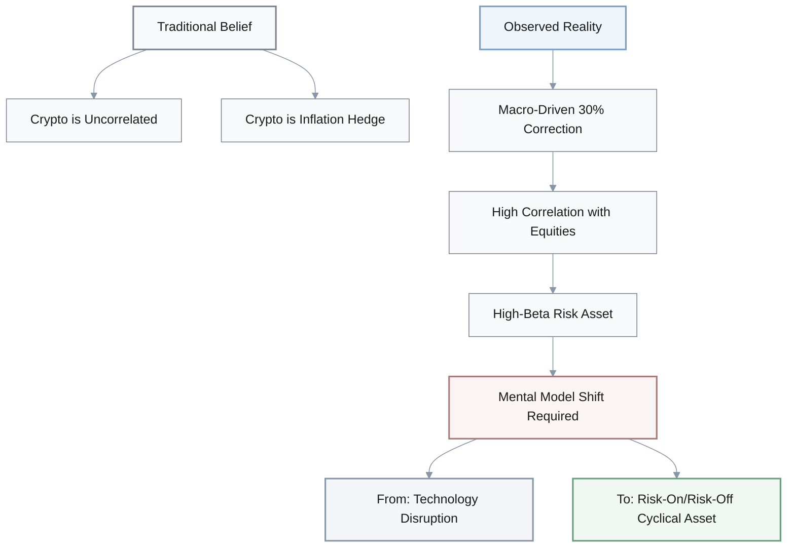
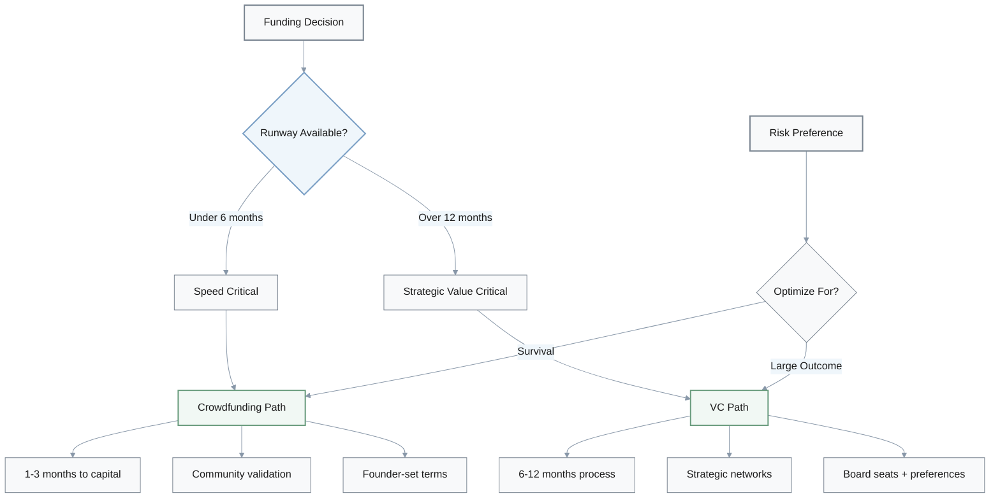
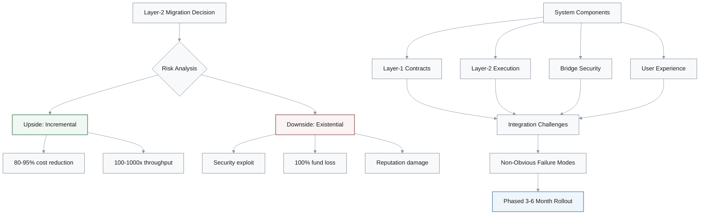
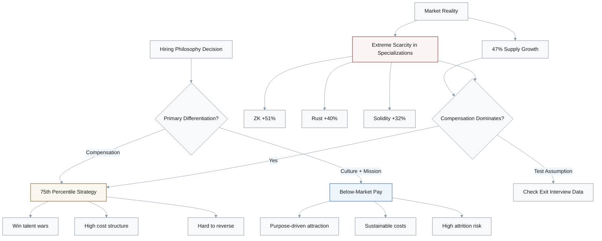
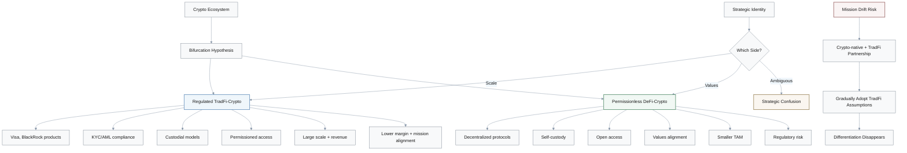
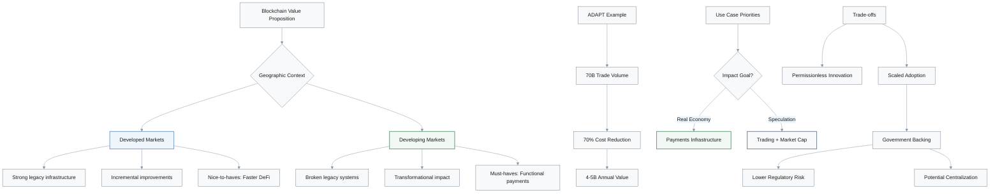
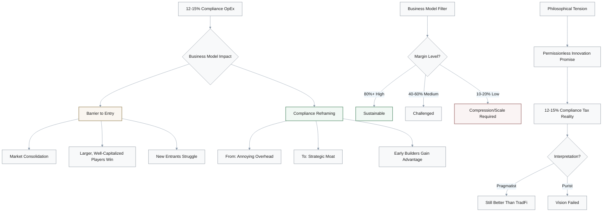

## 1. Bitcoin Correction: Macro-Driven vs Structural

**Q:** Bitcoin corrected 30% from $126K to under $86K, but the analysis calls it "macro-driven" rather than "structural" and maintains fundamentals are intact. How does that framing challenge your view of crypto as an asset class?

### Price Movement Analysis

| Metric | Value | Implication |
|--------|-------|-------------|
| Peak Price | $126K | All-time high |
| Current Price | <$86K | -30% correction |
| Driver Type | Macro | Not structural weakness |
| Fundamentals | Intact | Disconnect from price |

### Discussion

**Initial assumptions challenged:**

- **Investor A:** I always thought crypto was supposed to be uncorrelated.
- **Investor B:** Right, like an inflation hedge.
- **Investor C:** Hmm... but if it's macro-driven, it's trading like a high-beta risk asset.

**Unpacking the assumption:**

- **A:** Exactly. Correlated with equities and rate expectations.
- **B:** That challenges the diversification thesis completely.
- **C:** So maybe we need a mental model shift—from "technology disruption" to "risk-on/risk-off cyclical asset."

**The fundamental question:**

- **C:** They claim fundamentals are "intact" despite 30% moves.
- **A:** Right, but that implies separating price from value.
- **B:** Good point. If market structure allows 30% moves on macro noise, maybe fundamentals don't anchor price as strongly as we believed.
- **A:** Questions long-term predictability.

**Implications for decisions:**

| Strategy Component | Traditional View | Updated View |
|-------------------|------------------|--------------|
| Diversification | Within crypto only | Across asset classes |
| Holding Period | Pure long-term | Active management needed |
| Risk Management | Buy and hold | Timing + volatility control |
| Correlation | Independent | Tied to macro/equities |

---

## 2. Crowdfunding vs VC: Time-to-Capital Trade-offs

**Q:** Crowdfunding platforms reduce time-to-capital to 1-3 months but potentially sacrifice "investor quality." What assumptions about funding strategy does this reveal?

### Funding Path Comparison

| Dimension | Crowdfunding | Tier-1 VC |
|-----------|--------------|-----------|
| **Time-to-Capital** | 1-3 months | 6-12 months |
| **Investor Quality** | Distributed community | Strategic partners |
| **Control** | Founder-set terms | VC-negotiated terms |
| **Best For** | Pre-product, survival mode | Post-traction, scaling |

### Discussion

**Core assumption challenged:**

- **Founder A:** The statement assumes tier-1 VCs are always worth 6-12 months of time.
- **Founder B:** Right, but that's luxury thinking if you have under 6 months runway.
- **Founder C:** Exactly. It privileges patient capital access over survival.

**Stage-dependent thinking:**

- **Pre-product founders:** Value speed and community validation
- **Post-traction founders:** Value strategic VC networks over speed
- **Key insight:** Optimal funding path is context-dependent, not universal

**The dilution control paradox:**

- **B:** Wait—crowdfunding is framed as limiting "dilution control."
- **C:** But setting your own terms to a distributed crowd may offer more control than negotiating with a lead VC.
- **A:** Who demands board seats, preferences, protective provisions.
- **Insight:** Institutional funding ≠ founder control

**Risk preference revelation:**

Your funding choice reveals optimization target:

- **Probability of survival** → Crowdfunding (speed matters)
- **Probability of large outcome** → VC (strategic value matters)

> Many founders don't explicitly articulate this trade-off before choosing a funding path.

---

## 3. Layer-2 Migration: Execution Risk vs Economic Benefits

**Q:** Layer-2 migration reduces costs 80-95% with 100x-1000x throughput, yet the analysis recommends a phased 3-6 month approach. What does this reveal about execution risk versus economic benefits?

### Cost-Benefit Analysis

| Metric | Layer-1 | Layer-2 | Improvement |
|--------|---------|---------|-------------|
| **Cost** | Baseline | -80% to -95% | Massive savings |
| **Throughput** | 1x | 100x-1000x | Revolutionary |
| **Migration Time** | N/A | 3-6 months | Phased approach |
| **Risk Level** | Known | Unknown edges | Existential if wrong |

### Risk Asymmetry Framework

$$
\text{Risk Assessment} = \frac{\text{Downside (Existential)}}{\text{Upside (Incremental)}}
$$

When downside is existential (100% fund loss) and upside is incremental (cost savings), **slow de-risked execution > fast execution**.

### Discussion

**Initial perspective:**

- **Engineer A:** The ROI is obvious. Why not move fast?
- **Engineer B:** That's the false dichotomy the recommendation challenges.
- **Engineer C:** Even correct strategic directions have execution risk.

**Understanding risk asymmetry:**

- **Upside:** 80-95% cost savings (incremental improvement)
- **Downside:** Security exploit losing 100% of user funds (existential risk)
- **Conclusion:** When downside is existential and upside is incremental, slow de-risked execution beats fast execution

**Systems thinking:**

Technology decisions aren't just math problems—they're **integration challenges**:

- Layer-1 contracts
- Layer-2 execution
- Bridge security
- User experience

Interactions between components create non-obvious failure modes.

**Broader application:**

This caution applies to any major operational change:

- Moving jurisdictions
- Replacing core systems
- Restructuring teams

All benefit from piloting and staged rollout, even when end-state is clearly superior.

**Critical question:**

> "What could go catastrophically wrong if we're 95% right but miss a critical edge case?"

---

## 4. Web3 Employment: Compensation vs Culture

**Q:** Web3 employment rebounded 47% with specialized roles commanding 75th percentile compensation. How does this shift your understanding of competitive advantage in hiring?

### Demand Growth by Specialization

| Skill | Demand Growth | Premium vs Baseline |
|-------|--------------|---------------------|
| **ZK Engineers** | +51% | +4% above baseline |
| **Rust Developers** | +40% | -7% below baseline |
| **Solidity Developers** | +32% | -15% below baseline |
| **Baseline (All Web3)** | +47% | Reference point |

### Key Insight

**Generalist "blockchain developer" roles are commoditizing**, while cutting-edge specialization (ZK, advanced cryptography) commands increasing premiums.

### Discussion

**Challenging assumptions:**

- **HR A:** Many assume culture or mission attract talent.
- **HR B:** Right, but 47% supply increase with 51% demand surge in ZK engineers suggests extreme scarcity where compensation dominates.
- **HR C:** That challenges the romanticized view that purpose compensates for below-market pay.

**The specialization premium:**

- **ZK:** +51% (highest demand)
- **Rust:** +40%
- **Solidity:** +32%
- **Baseline:** +47%

**Insight:** Generalist roles are commoditizing; cutting-edge specialization commands increasing premiums.

**Employee implications:**

- Stay at technical frontier to maintain negotiating leverage
- Build depth in specialized skills rather than breadth

**Wage stickiness risk:**

| Strategy | Upside | Downside |
|----------|--------|----------|
| **75th percentile now** | Win talent wars | High fixed costs, hard to reverse |
| **Sustainable comp + culture** | Flexible cost structure | Lose talent to competitors |

**Testing your beliefs:**

If you believe culture matters more than compensation:

- **Evidence to watch:** Exit interview data
- **Update trigger:** If 70% of departures cite compensation, would you update your model?

**Key reflection:**

> Do you optimize for "win talent wars at any cost" or "build sustainable cost structure and bet on non-comp differentiation"?

---

## 5. TradFi Institutional Adoption: Validation or Co-option?

**Q:** Major TradFi institutions are launching crypto products, framed as both "validation" and "threat." How does institutional adoption challenge your beliefs about crypto's purpose and trajectory?

### The Ideological Tension

| Perspective | Interpretation | Emotion |
|-------------|----------------|---------|
| **Success** | Mainstream adoption achieved | Validation |
| **Co-option** | Centralized systems on crypto rails | Cognitive dissonance |

### Discussion

**Initial reaction:**

- **Founder A:** I got into crypto for decentralization principles.
- **Founder B:** Right, so TradFi adoption creates cognitive dissonance.
- **Founder C:** Exactly. Is this success or co-option?

**The ideological tension:**

- **Success interpretation:** Mainstream adoption achieved
- **Co-option interpretation:** Recreating centralized systems on crypto rails
- **Key question:** What does success actually mean?

**Mission drift risk:**

As crypto-native firms partner with TradFi:

1. Gradually adopt TradFi assumptions
2. Implement KYC/AML, custodial models, permissioned access
3. Differentiation disappears

**Defining boundaries:**

> Reflect on non-negotiable principles versus pragmatic concessions. What are you unwilling to compromise?

### Two Crypto Worlds Hypothesis

| Dimension | Regulated TradFi-Crypto | Permissionless DeFi-Crypto |
|-----------|-------------------------|----------------------------|
| **Examples** | Visa, BlackRock products | DeFi protocols |
| **Access** | Permissioned, KYC/AML | Open, self-custody |
| **Scale** | Large TAM | Smaller TAM |
| **Revenue** | High revenue potential | Variable |
| **Margin** | Potentially lower | Potentially higher |
| **Mission Alignment** | Lower | Higher |
| **Regulatory Risk** | Lower | Higher |

**Key insight:** "Crypto" is not unified with a shared trajectory—it's bifurcating into different ecosystems serving different users with different values.

**Strategic identity question:**

As a founder, employee, or investor—which side do you want to be on?

- **Institutional integration:** Scale and revenue, but potentially lower margin and mission alignment
- **DeFi path:** Differentiation and values alignment, but smaller TAM and regulatory risk

> Many avoid explicitly choosing, leading to strategic ambiguity.

---

## 6. Africa ADAPT: Where Blockchain Creates Most Value

**Q:** The Africa ADAPT initiative uses IOTA stablecoins for $70B trade with 70% cost reduction. What does this reveal about where blockchain creates most value?

### ADAPT Impact Analysis

| Metric | Value | Implication |
|--------|-------|-------------|
| **Trade Volume** | $70B | Massive scale |
| **Cost Reduction** | 70% | $4-5B annual value creation |
| **Target Market** | Africa | Broken legacy systems |
| **Use Case** | Cross-border payments | Utility, not speculation |

### Value Creation Calculation

$$
\text{Annual Value Created} = \$70B \times 70\% = \$49B \times \frac{1}{10} = \$4-5B
$$

**Insight:** Real-economy impact from infrastructure replacement, not speculative trading.

### Discussion

**Shifting perspective:**

- **Product A:** If you associate crypto primarily with trading, ADAPT highlights something different.
- **Product B:** Highest-impact use case may be payments infrastructure.
- **Product C:** Challenges the assumption that crypto's value is primarily store-of-value or speculative vehicle.

**Geographic insight:**

| Region | Infrastructure Quality | Blockchain Comparative Advantage |
|--------|----------------------|----------------------------------|
| **Developed Markets** | Strong | Low (incremental improvements) |
| **Developing Markets** | Weak/Broken | High (transformational impact) |

**Pain points addressed:** Correspondent banking delays, high fees, lack of trust

**Self-reflection needed:**

Are you focusing innovation efforts on:

- **Developed market "nice-to-haves":** Faster DeFi trades, trading optimization
- **Developing market "must-haves":** Functional cross-border payments, financial inclusion

**Measuring impact:**

| Impact Type | Example | Value Creation |
|-------------|---------|----------------|
| **Real Economy** | $70B trade with 70% cost reduction | $4-5B annual value |
| **Market Cap** | Crypto price movements | No direct transaction improvement |

**Key question:**

> If impact matters to you, are you prioritizing applications with measurable real-economy value or speculative/entertainment use cases?

**Trade-offs for stakeholders:**

| Factor | Benefit | Risk |
|--------|---------|------|
| **Government backing** | Reduced regulatory risk | Potential centralization |
| **Institutional support** | Scaled adoption | Less permissionless innovation |

> Which do you prioritize, and why?

---

## 7. FSB Regulatory Compliance: Sustainable Business Models

**Q:** The FSB's regulatory warnings recommend budgeting 12-15% of opex for compliance. How does rising compliance cost change which crypto business models are sustainable?

### Compliance Cost Impact

| Business Type | Gross Margin | Can Absorb 12-15% Opex? | Outlook |
|--------------|--------------|-------------------------|---------|
| **High-margin** (Software, Data) | 80%+ | ✅ Yes | Sustainable |
| **Medium-margin** (Some DeFi) | 40-60% | ⚠️ Challenged | Need optimization |
| **Low-margin** (Exchanges, Payments) | 10-20% | ❌ No | Compression or scale needed |

### Margin Sustainability Formula

$$
\text{Net Margin} = \text{Gross Margin} - \text{OpEx} - \text{Compliance (12-15\%)}
$$

**Viability threshold:** Gross margin must exceed 25-30% to remain sustainable after compliance costs.

### Discussion

**Core realization:**

- **Strategy A:** 12-15% opex for compliance means only companies with strong unit economics can afford that overhead.
- **Strategy B:** Challenges the assumption that crypto enables permissionless entrepreneurship.

**Barrier to entry implications:**

- **Market consolidation:** Toward larger, well-capitalized players
- **Competitive advantage:** Companies that build compliance infrastructure early create moats
- **New entrant challenge:** Face same cost without revenue to fund it

**Reframing compliance:**

| Old Framing | New Framing |
|-------------|-------------|
| Annoying overhead | Strategic investment |
| Cost-minimization problem | Moat-building opportunity |

**Business model filter:**

- **High-margin (80%+):** Software, data → Can absorb 12-15% opex
- **Low-margin (10-20%):** Exchanges, payment processors → Face compression or need massive scale

**Personal reflection questions:**

1. Does your business model generate enough margin to sustainably fund compliance at scale?
2. If not, is there a pivot to higher-margin adjacencies?

**Philosophical tension:**

| Vision | Reality | Interpretation |
|--------|---------|----------------|
| **Permissionless innovation** | 12-15% compliance tax | Has vision failed? |
| **Alternative view** | Still lower than TradFi costs | Pragmatic progress |

**Key insight:**

> Your answer reveals whether you're a pragmatist (regulated crypto > TradFi) or purist (compliance = failure of original vision).

---
