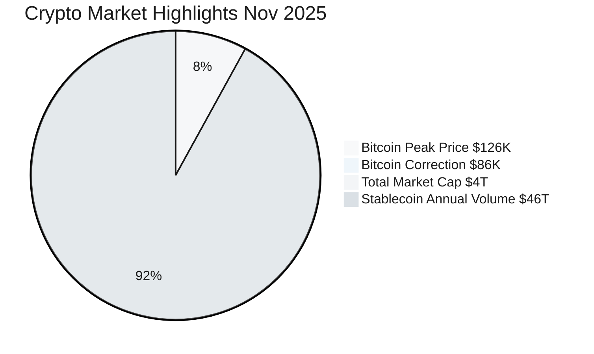
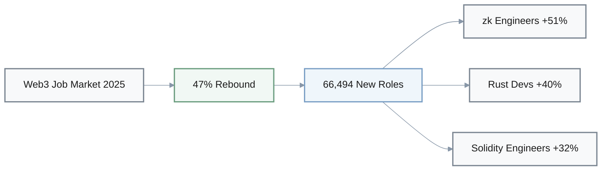
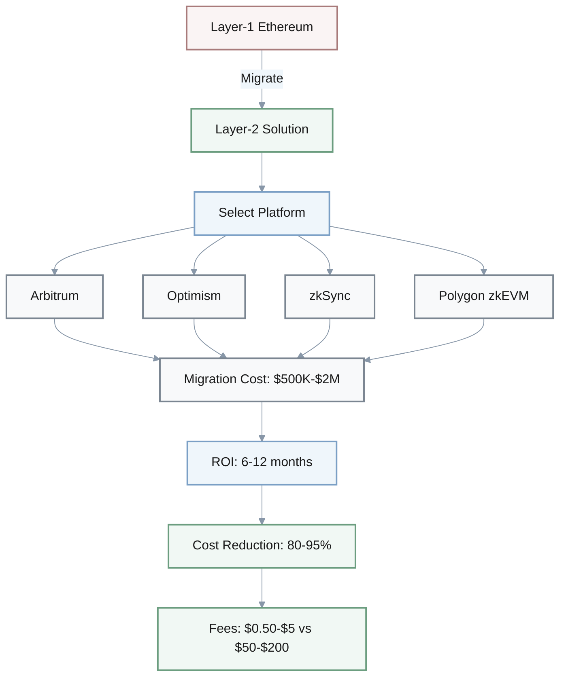

# Blockchain & Crypto Cloze Questions - November 2025

## Platform Launches & Funding

1. Q: Bitstarter.ai launched on ___ as the first crowdfunding platform for AI startups building on ___ infrastructure.
   A: **November 21, 2025**; **Bittensor's decentralized**

2. Q: Seismic secured $___ M in funding from ___ to help fintechs protect customer data through cryptographic solutions.
   A: **$10M**; **a16z crypto**

3. Q: FinTech funding exceeded $___ B across ___ deals in mid-November 2025.
   A: **$2.1B**; **25 deals**

---

## Network Performance & Scalability

### Blockchain Transaction Throughput Comparison

| **Network Type** | **TPS (Transactions Per Second)** | **Performance Level** |
|------------------|-----------------------------------|----------------------|
| Bitcoin (Layer-1) | ~7 TPS | Legacy baseline |
| Ethereum (Layer-1) | 15-30 TPS | Legacy improved |
| All blockchain networks | >3,400 TPS | November 2025 aggregate |
| Layer-2 platforms | 100x-1000x Layer-1 | High-performance |

4. Q: Blockchain networks now process over ___ transactions per second (TPS) as of November 2025.
   A: **3,400**

5. Q: Legacy Layer-1 Ethereum mainnet achieves approximately ___-___ TPS, while Bitcoin achieves approximately ___ TPS.
   A: **15-30 TPS**; **~7 TPS**

6. Q: Layer-2 platforms offer throughput improvements of ___x-___x compared to Layer-1 architectures.
   A: **100x-1000x**

### Layer-2 Cost Reduction Formula

$$
\text{Cost Reduction (\%)} = \frac{\text{Layer-1 fees} - \text{Layer-2 fees}}{\text{Layer-1 fees}} \times 100
$$

7. Q: Layer-2 migration can reduce transaction costs by ___-___% compared to Layer-1.
   A: **80-95%**

---

## Market Metrics & Stablecoins

8. Q: Bitcoin reached a historic high above $___ K in early November 2025, then corrected to below $___ K—a >___% drawdown.
   A: **$126K**; **$86K**; **30%**

9. Q: The total crypto market capitalization exceeded $___ trillion in November 2025.
   A: **$4 trillion**

10. Q: Stablecoins support $___ T annual transaction volume.
    A: **$46T**

---

## Regional Initiatives

11. Q: The Africa ADAPT initiative targets $___ B in pan-continent trade facilitation using IOTA-based stablecoins.
    A: **$70B**

### Cross-Border Payment Comparison

| **Payment Method** | **Processing Time** | **Fee Range** |
|-------------------|-------------------|---------------|
| Traditional correspondent banking | 3-7 days | 3-6% |
| IOTA stablecoins | Near-instant | <0.5% |

15. Q: Traditional correspondent banking for cross-border payments takes ___-___ days with fees of ___-___%, compared to IOTA stablecoins targeting <___% fees.
    A: **3-7 days**; **3-6%**; **0.5%**

---

## Web3 Employment & Developer Market

12. Q: Web3 employment rebounded approximately ___% in 2025, with ___ new roles added.
    A: **47%**; **66,494**

### Top Blockchain Developer Roles by Demand Growth (2025)

| **Role** | **Demand Growth** | **Median Salary Range** | **YoY Increase** |
|---------|------------------|----------------------|-----------------|
| Zero-knowledge proof (zk) engineers | +51% | $180K-$250K | 20-30% |
| Rust developers | +40% | N/A | N/A |
| Solidity engineers | +32% | N/A | N/A |

13. Q: List the three specialized blockchain developer roles with highest demand growth in 2025.
    A: **Zero-knowledge proof (zk) engineers (+51%)**, **Solidity engineers (+32%)**, **Rust developers (+40%)**

14. Q: Median zk engineer salaries range from $___ K-$___ K base plus equity, representing a ___-___% YoY increase.
    A: **$180K-$250K**; **20-30%**

---

## Regulatory Developments

16. Q: The ___ (FSB) issued November 2025 warnings about gaps in cryptocurrency regulations globally.
    A: **Financial Stability Board**

17. Q: Switzerland launched a formal consultation on ___ and ___ institutions in November 2025.
    A: **stablecoins**; **crypto**

---

## Layer-2 Solutions & Migration

### Battle-Tested Layer-2 Solutions

- **Arbitrum**: Optimistic rollup with high compatibility
- **Optimism**: Optimistic rollup with developer-friendly tools
- **zkSync**: Zero-knowledge rollup for enhanced privacy
- **Polygon zkEVM**: Ethereum-compatible zk-rollup

18. Q: List the four top Layer-2 solutions mentioned as audited and battle-tested.
    A: **Arbitrum, Optimism, zkSync, Polygon zkEVM**

### Layer-2 Migration Economics

| **Metric** | **Layer-1** | **Layer-2** | **Improvement** |
|-----------|------------|------------|----------------|
| Gas fees per transaction | $50-$200 | $0.50-$5 | 80-95% reduction |
| Full migration cost | N/A | $500K-$2M | One-time investment |
| ROI break-even period | N/A | 6-12 months | High-volume apps |
| Post-migration target cost | $10-$50 baseline | <$1 | >90% reduction |

22. Q: Layer-2 gas fees range from $___.50-$___ compared to Layer-1 fees of $___-$___ per transaction.
    A: **$0.50-$5**; **$50-$200**

23. Q: Migration to Layer-2 typically costs $___K-$___M for full migration including audit and testing.
    A: **$500K-$2M**

21. Q: For Layer-2 migration, ROI typically breaks even in ___-___ months for high-volume applications.
    A: **6-12 months**

24. Q: Post-Layer-2 launch target: average transaction cost <$___ (baseline $___-$___).
    A: **<$1**; **$10-$50**

---

## Risk Management & Operations

19. Q: The recommended liquidity buffer for crypto firms under volatility is ___ months minimum runway.
    A: **18 months**

20. Q: Crowdfunding via platforms like Bitstarter.ai may reduce time-to-capital from ___-___ months (typical seed round) to ___-___ months.
    A: **6-12 months**; **1-3 months**

### Fundraising Timeline Comparison

$$
\text{Time Saved} = \text{Traditional Seed Round (6-12 months)} - \text{Crowdfunding (1-3 months)} = 3-11 \text{ months}
$$

25. Q: Cross-chain bridges are a top exploit vector, with >$___ B+ lost in 2024.
    A: **$2B+**

> **Security Warning**: Cross-chain bridges represent the highest risk vector in DeFi, accounting for >$2B+ in losses during 2024. Implement multi-signature validation and time-locked withdrawals.
