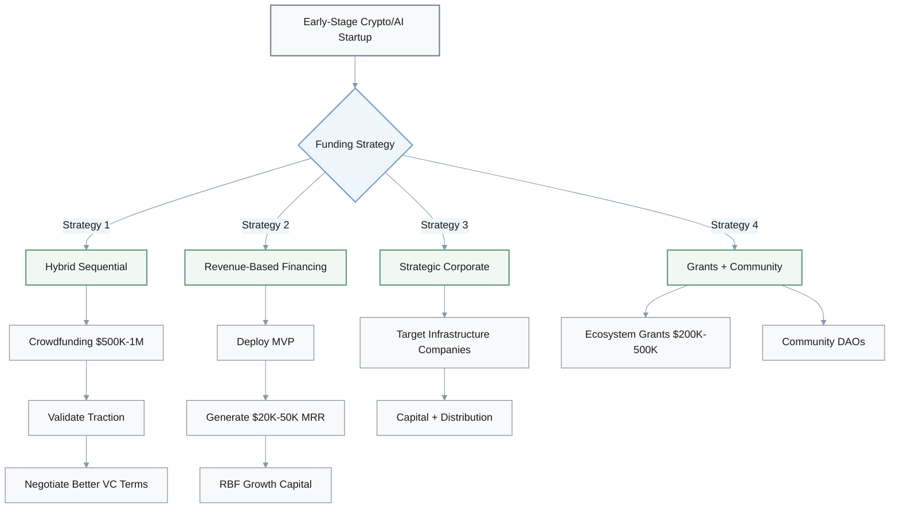
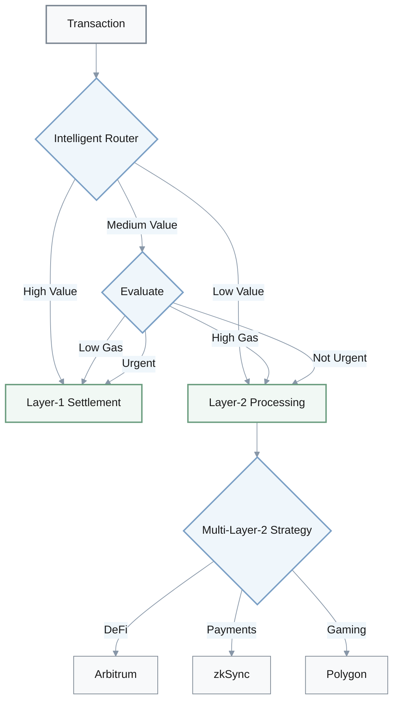
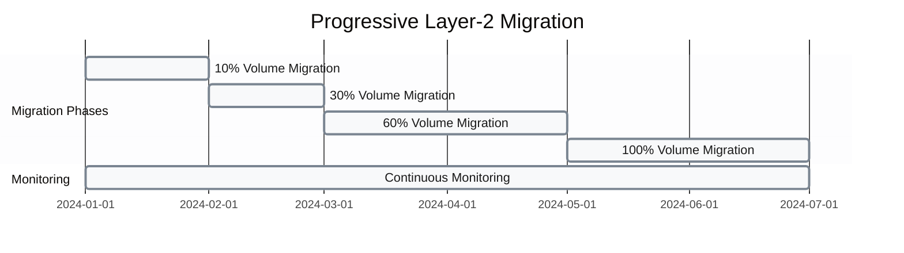
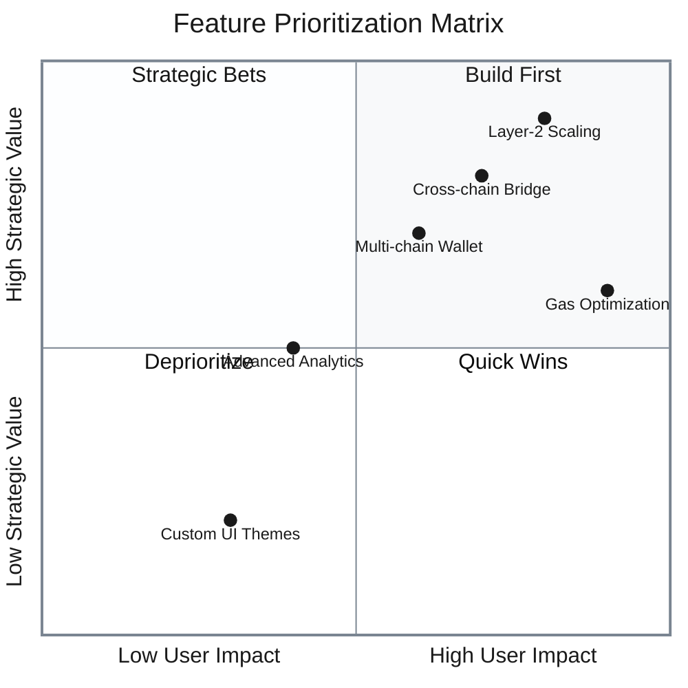
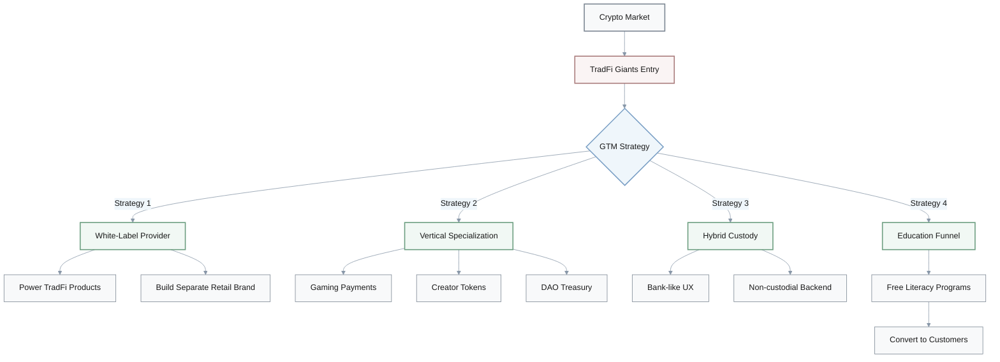
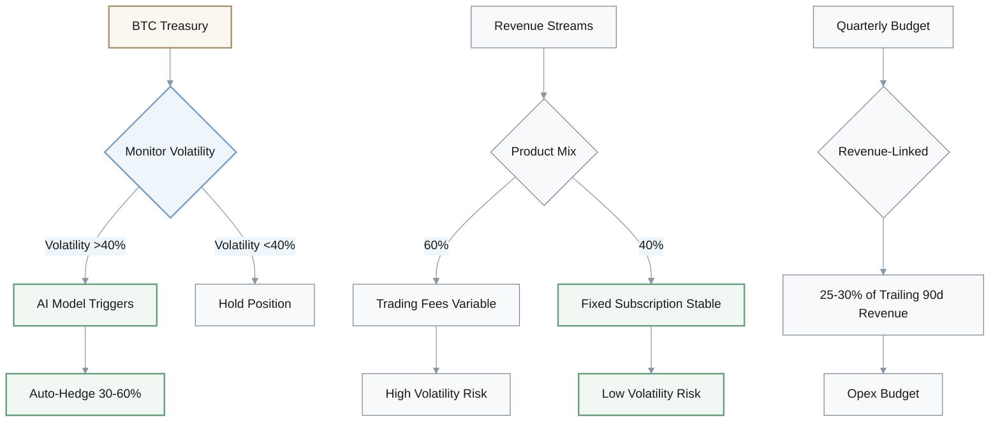
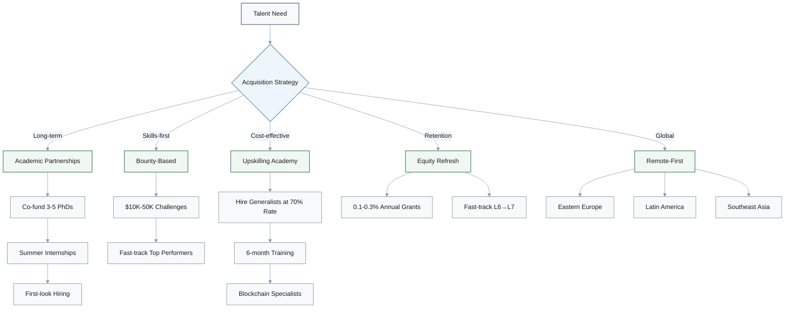

## 1. Alternative Funding Strategies for Crypto/AI Startups

**Q:** Early-stage crypto/AI startups typically choose between crowdfunding platforms and traditional VC routes. Generate 4 alternative funding strategies that combine or extend these approaches.

**A:** Four alternative funding strategies:

| Strategy | Approach | Target Capital | Pros | Cons |
|----------|----------|----------------|------|------|
| **Hybrid Sequential** | Crowdfunding → VC | $500K-$1M initial | Reduces time-to-first-capital, preserves institutional access | Requires two fundraising campaigns |
| **Revenue-Based Financing** | MVP → Revenue → RBF | $20K-50K MRR | Zero dilution, preserves equity | Requires early traction |
| **Strategic Corporate** | Infrastructure partnerships | Varies | Strategic value + capital + distribution | Limits flexibility |
| **Grants + Community** | Ecosystem grants + DAOs | $200K-$500K | Zero dilution | Requires technical credibility, governance overhead |

### Detailed Breakdown

- **Hybrid sequential approach**: Secure $500K-$1M via crowdfunding as validation signal, then use traction data to negotiate better VC terms
  - Reduces time-to-first-capital while preserving institutional access

- **Revenue-based financing**: Deploy minimal product, generate $20K-50K MRR, then use RBF platforms for growth capital without dilution
  - Preserves equity but requires early traction

- **Strategic corporate investors**: Target crypto infrastructure companies (Coinbase Ventures, Binance Labs) that provide both capital and distribution partnerships
  - Offers strategic value beyond capital but limits portfolio company flexibility

- **Grants + community treasury**: Secure $200K-$500K via ecosystem grants (Ethereum Foundation, Polkadot Treasury) plus community-governed funding DAOs
  - Zero dilution but requires strong technical credibility and governance participation overhead

---

## 2. Layer-2 Migration Architecture Variations

**Q:** Engineering teams face Layer-2 migration decisions for blockchain infrastructure. Generate 4 variations of migration architecture beyond simple "migrate all to Layer-2."

**A:** Four migration architecture approaches:

| Architecture | Description | Use Case | Pros | Cons |
|--------------|-------------|----------|------|------|
| **Intelligent Routing** | Middleware dynamically routes based on value/urgency/gas | All transaction types | Optimizes cost vs security | Adds routing complexity |
| **Dual-Chain Hybrid** | Layer-1 for settlement, Layer-2 for high-frequency | Mixed value transactions | Preserves security where critical | Dual infrastructure management |
| **Multi-Layer-2** | 2-3 Layer-2s per use case | Specialized workloads | Maximizes resilience, optimizes per-use-case | Multiplies integration complexity |
| **Progressive Migration** | 10% → 30% → 60% → 100% over 6 months | Risk-averse teams | De-risks migration | Extended timeline, requires monitoring |

### Detailed Breakdown

- **Intelligent routing layer**: Build middleware that dynamically routes transactions to Layer-1 or Layer-2 based on value, urgency, and gas prices
  - Optimizes cost vs security trade-off but adds routing complexity

- **Dual-chain hybrid**: Maintain Layer-1 for settlement/high-value transactions, Layer-2 for high-frequency trading/microtransactions
  - Preserves security where critical, saves costs elsewhere

- **Multi-Layer-2 strategy**: Distribute across 2-3 Layer-2s (Arbitrum for DeFi, zkSync for payments, Polygon for gaming)
  - Avoids single-platform risk and optimizes per-use-case
  - Maximizes resilience but multiplies integration complexity

- **Progressive migration with rollback**: Migrate 10% → 30% → 60% → 100% of volume over 6 months
  - Automatic rollback triggers: latency >200ms or error rate >0.5%
  - De-risks migration but extends timeline and requires sophisticated monitoring

### Progressive Migration Timeline

---

## 3. Feature Prioritization Frameworks

**Q:** Product teams must prioritize between Layer-2 features and cross-chain interoperability. Generate 3 alternative prioritization frameworks.

**A:** Four prioritization frameworks:

| Framework | Methodology | Timeline | Pros | Cons |
|-----------|-------------|----------|------|------|
| **User Pain-Based** | Survey 1K users, rank pain points | 2-4 weeks survey | Data-driven decisions | May miss strategic opportunities |
| **Competitive Gap** | Map competitor matrix vs top 3 | 1-2 weeks analysis | Creates 6-12 month moat | May not align with user needs |
| **Partnership-Driven** | Build features for 2-3 institutional clients | Varies by client | Guaranteed revenue | Over-customization risk |
| **Modular Parallel** | Build L2 (3-4M) + cross-chain (2M) concurrently | 3-4 months | Maximizes flexibility | Requires more resources |

### Detailed Breakdown

- **User pain-based prioritization**: Survey top 1,000 users to rank pain points (high fees vs asset fragmentation)
  - Prioritize highest-impact feature first
  - Data-driven but may miss strategic positioning opportunities

- **Competitive gap analysis**: Map competitor feature matrix, identify biggest gaps vs top 3 competitors
  - Prioritize features that create 6-12 month competitive moat
  - Maintains competitive parity but may not align with user needs

- **Strategic partnership-driven**: Secure partnership commitments from 2-3 institutional clients conditional on specific features
  - Build those features first
  - Guarantees revenue but risks over-customization for few clients

- **Modular parallel development**: Build Layer-2 integration (3-4 months) and cross-chain design (2 months) concurrently
  - Sequence rollout based on market feedback during Layer-2 beta
  - Maximizes flexibility but requires more upfront engineering resources

---

## 4. GTM Strategies Against TradFi Competition

**Q:** Commercial teams respond to TradFi giants entering crypto. Generate 4 creative GTM strategies beyond direct partnerships or differentiation.

**A:** Four creative GTM strategies:

| Strategy | Approach | Target Market | Pros | Cons |
|----------|----------|---------------|------|------|
| **White-Label Provider** | B2B2C model for TradFi | TradFi institutions | Captures scale without competition | Commoditizes core IP |
| **Vertical Specialization** | Dominate 2-3 underserved verticals | Gaming, creator economy, DAOs | Creates defensible niche | Limits TAM |
| **Hybrid Custody** | Bank-like UX + non-custodial backend | Both TradFi and crypto users | Appeals to both segments | Complex architecture |
| **Education-to-Conversion** | Free crypto literacy programs | Enterprise/institutions | Builds trust and pipeline | Long sales cycle (12-18M) |

### Detailed Breakdown

- **White-label infrastructure provider**: Pivot to B2B2C model—power TradFi crypto products with proprietary tech while building retail brand separately
  - Captures TradFi scale without direct competition but commoditizes core IP

- **Vertical market specialization**: Dominate 2-3 underserved verticals that TradFi won't prioritize for 2-3 years
  - Focus areas: gaming crypto payments, creator economy tokens, DAO treasury management
  - Creates defensible niche but limits TAM

- **Hybrid custody model**: Offer "institutional-grade self-custody"—bank-like UX with non-custodial backend
  - Positioning as bridge between TradFi safety and crypto sovereignty
  - Appeals to both segments but requires complex technical architecture

- **Education-to-conversion funnel**: Launch free crypto literacy programs for enterprise/institutions
  - Convert graduates into customers
  - Builds trust and pipeline but long sales cycle—12-18 months

---

## 5. Financial Risk Management for Bitcoin Volatility

**Q:** CFOs must adjust financial planning for 30%+ Bitcoin volatility. Generate 3 alternative financial risk management approaches.

**A:** Four financial risk management approaches:

| Approach | Mechanism | Target Metric | Pros | Cons |
|----------|-----------|---------------|------|------|
| **AI-Driven Hedging** | ML models auto-hedge on volatility signals | 30-60% BTC hedge when >40% volatility | Data-driven risk management | Requires quant infrastructure |
| **Natural Hedging** | Expand fixed-fee products (SaaS, APIs) | 40% non-trading revenue by 2026 | Structural diversification | Requires new product dev |
| **Crypto-Native Debt** | Convertible notes tied to BTC/ETH price | Varies by raise | Preserves liquidity in downturns | Complex structuring |
| **Revenue-Linked Budgets** | Opex as % of trailing 90-day revenue | 25-30% of revenue | Preserves margins | Organizational uncertainty |

### Detailed Breakdown

- **Dynamic hedging with AI triggers**: Deploy ML models that predict volatility regimes
  - Auto-hedge 30-60% of BTC exposure when predicted 30-day volatility >40%
  - Data-driven risk management but requires quant infrastructure and backtesting

- **Natural hedging via product mix**: Expand fixed-fee subscription products (SaaS tools, data APIs)
  - Balance transaction-fee volatility
  - Target 40% revenue from non-trading sources by end-2026
  - Structural diversification but requires new product development

- **Convertible debt with crypto-native terms**: Raise convertible notes with conversion price tied to BTC/ETH instead of equity valuation milestones
  - Preserves liquidity during downturns
  - Complex to structure and explain to investors

- **Revenue-linked expense budgets**: Set quarterly opex budgets as % of trailing 90-day revenue (25-30%) rather than fixed dollars
  - Enables automatic cost flexing
  - Preserves margins but creates organizational uncertainty and limits long-term hiring

### Volatility Management Formula

$$
\text{Hedge Ratio (\%)} = \frac{\text{Predicted 30-day Volatility} - 40\%}{60\%} \times 100
$$

Where:
- **Predicted 30-day Volatility**: ML model output
- **Threshold**: 40% volatility triggers hedging
- **Max Hedge**: 60% of BTC exposure

---

## 6. Talent Acquisition and Retention Strategies

**Q:** Talent teams compete for specialized blockchain engineers in a tight market. Generate 4 creative talent acquisition and retention strategies.

**A:** Five creative talent strategies:

| Strategy | Investment | Timeline | Pros | Cons |
|----------|------------|----------|------|------|
| **Academic Partnerships** | Co-fund 3-5 PhD students | 3-5 years | Cutting-edge talent pipeline | Long timeline |
| **Bounty-Based Hiring** | $10K-$50K bounties | 2-4 weeks | Pre-evaluates skills | May miss culture fit |
| **Upskilling Academy** | 6-month training program | 6-9 months productivity | Builds loyalty, reduces cost | Delayed productivity |
| **Equity Refresh + Fast-Track** | 0.1-0.3% annual grants | 18-month promotion cycle | Strong retention | Cap table dilution |
| **Remote-First Global** | 50-70% US salary | Immediate | Geographic arbitrage | Timezone/async challenges |

### Detailed Breakdown

- **Academic research partnerships**: Co-fund 3-5 PhD students in zk cryptography or blockchain scaling
  - Offer summer internships and first-look hiring rights
  - Builds pipeline of cutting-edge talent but 3-5 year timeline

- **Bounty-based hiring**: Post real engineering challenges as $10K-$50K bounties
  - Fast-track top performers into interview process
  - Evaluates skill pre-hire and attracts mercenary talent, but may miss culture fit

- **Internal upskilling academy**: Hire strong generalist engineers at 70% of specialist market rate
  - Fund 6-month intensive zk/Solidity/Rust training with retention bonuses
  - Builds loyalty and reduces cost but 6-9 month time-to-productivity

- **Equity refresh + promotion fast-track**: Offer annual equity refreshers (0.1-0.3% additional grants) for top 20% performers
  - Guaranteed L6→L7 promotion within 18 months if milestones met
  - Strong retention but dilutes cap table and creates "golden handcuff" culture risk

- **Remote-first global talent**: Hire from Eastern Europe, Latin America, Southeast Asia
  - Pay 50-70% of US salaries but offer top-10% local market comp
  - Arbitrages geography but requires strong async culture and may face timezone/communication challenges

### Cost Comparison

| Strategy | Cost per Hire | Time to Productivity | Retention Rate |
|----------|---------------|---------------------|----------------|
| **Traditional US Hire** | $200K-$300K/year | Immediate | 60-70% at 2 years |
| **Bounty-Based** | $50K + $150K-$250K/year | Immediate | 50-60% at 2 years |
| **Upskilling** | $140K-$210K/year (70% rate) | 6-9 months | 75-85% at 2 years |
| **Global Remote** | $100K-$210K/year (50-70% rate) | Immediate | 65-75% at 2 years |
| **Academic** | $80K-$120K/year (PhD stipend) | 3-5 years | 80-90% at 2 years |

