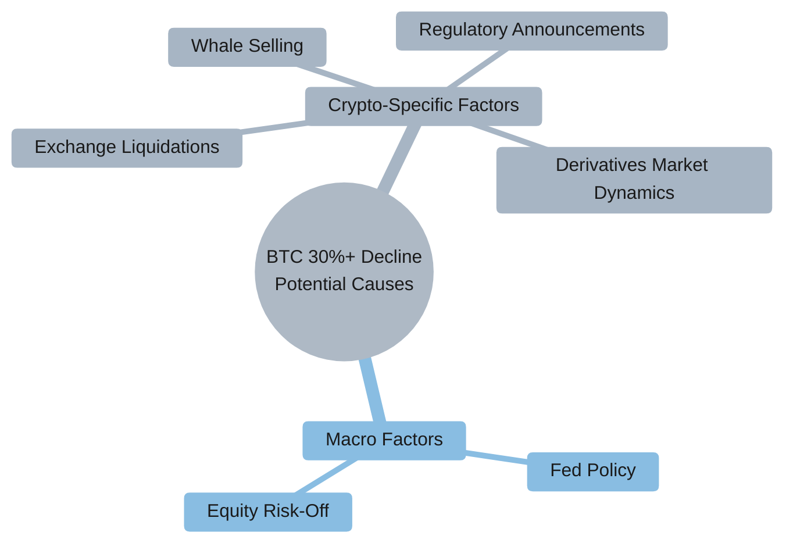
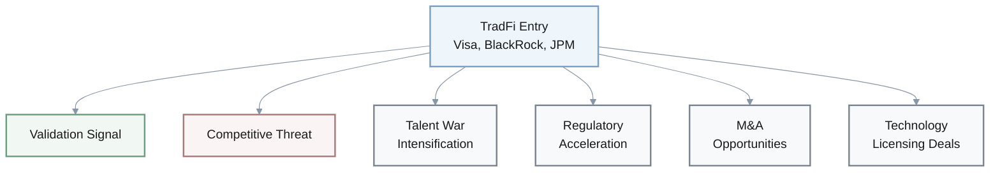
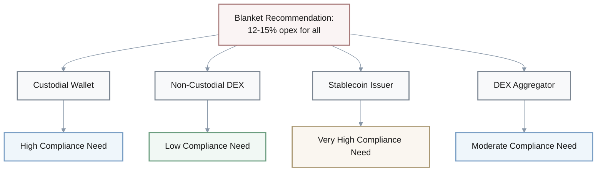
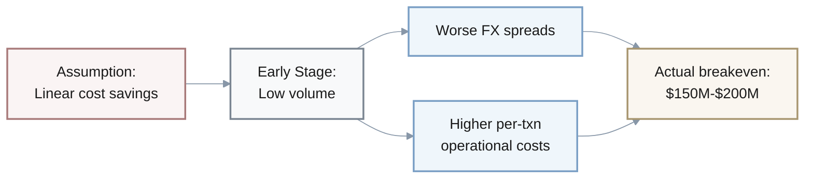
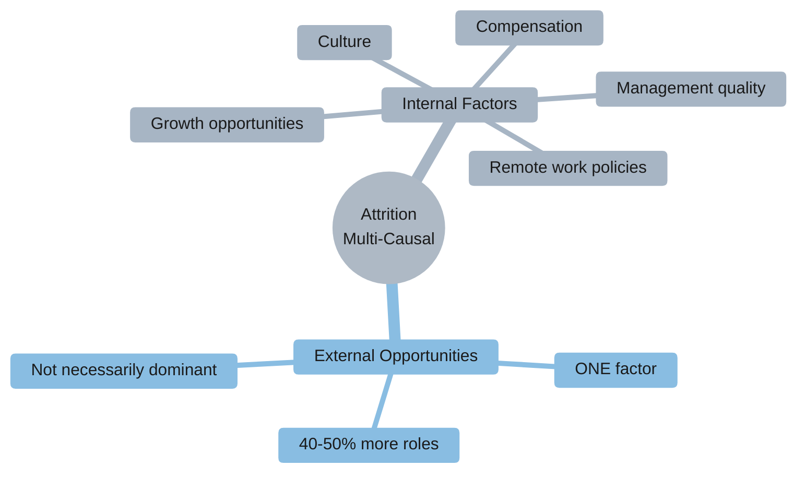

## Q1: Bitstarter.ai Crowdfunding Time-to-Capital Analysis

**Claim**: "Crowdfunding via Bitstarter.ai may reduce time-to-capital from 6-12 months (typical seed round) to 1-3 months while building early community, but limits dilution control and investor quality screening."

### Critical Analysis

**Assumption Analysis:**
- **Timeline universality**: Assumes traditional VC rounds take 6-12 months universally
  - Reality: Varies by market conditions, founder network, and traction
  - Hot deals close in 2-3 months
- **Dilution control mechanism**: Claims crowdfunding "limits dilution control" without explaining how
  - Counterpoint: Crowdfunding can offer **MORE** control if founders set terms vs negotiating with lead VCs

**Causal Reasoning Issues:**
- **Community building benefit**: Links faster capital to community building as pure benefit
  - Risk: Rapid community formation without vetting → governance challenges
  - Risk: Attracts speculative rather than engaged members

**Missing Trade-offs:**

| Factor | VC Route (6-12 months) | Crowdfunding (1-3 months) |
|--------|------------------------|---------------------------|
| Timeline | Longer, flexible | Compressed, urgent |
| Pricing pressure | Time to optimize | May force suboptimal pricing |
| Dilution risk | Negotiable | Potentially higher due to urgency |
| Investor quality | Screened | Less controlled |

**Strengthening Evidence Needed:**
- [ ] Actual Bitstarter.ai deal timelines
- [ ] Valuation comparison: crowdfunding vs VC
- [ ] Long-term investor engagement rates
- [ ] Case studies of dilution outcomes

---

## Q2: Layer-2 Migration ROI Analysis

**Claim**: "For high-volume applications, ROI on migration breaks even in 6-12 months" based on comparing $450M Layer-1 costs vs $25M Layer-2 costs for 10M transactions/year.

### Quantitative Validity Assessment

**Cost Comparison (Claimed):**

| Metric | Layer-1 | Layer-2 | Annual Savings |
|--------|---------|---------|----------------|
| Annual cost (10M txns/year) | $450M | $25M | $425M |
| Migration cost | - | $500K-$2M | - |
| **Breakeven period** | - | - | **6-12 months** |

**Evidence Quality Issues:**

1. **Volume volatility ignored**:
   - Assumption: Constant transaction volume
   - Reality: Crypto volume is highly cyclical (30-50% swings quarterly)
   - Impact: During bear markets, ROI period extends to **18-24 months**

2. **Hidden costs** (20-30% TCO increase):
   - ✅ Included: Initial migration ($500K-$2M)
   - ❌ Excluded: Ongoing maintenance
   - ❌ Excluded: Monitoring infrastructure
   - ❌ Excluded: Potential rollback costs

3. **Sampling issue** - Non-linear breakeven:

   | Transaction Volume | Breakeven Period |
   |-------------------|------------------|
   | 10M txns/year | 6-12 months |
   | 1M txns/year | **5+ years** |

   → Blanket "6-12 month" claim misleads businesses with lower volumes

4. **Fee stability assumption**:
   - Claimed: Layer-2 fees at $0.50-$5 per transaction remain stable
   - Risk: As adoption increases → Layer-2 congestion → fees could rise **2-5x**
   - Impact: Degraded ROI

**Strengthening Recommendations:**
- [ ] Sensitivity analysis across 3-5 volume scenarios
- [ ] Full TCO inclusion (maintenance, monitoring, rollback)
- [ ] Layer-2 fee volatility modeling
- [ ] Bear market scenario stress testing

---

## Q3: Bitcoin 30%+ Correction Causality Analysis

**Claim**: Bitcoin's 30%+ correction is "macro-driven (Fed policy, equity risk-off), not crypto-structural, suggesting short-to-medium term cyclical pressure but intact long-term fundamentals."

### Causal Attribution Evaluation

**Correlation vs Causation:**
- ⚠️ **Missing**: Quantitative analysis of correlation strength between Fed announcements/equity indices and BTC price movement
- Risk: Correlation could be coincidental without statistical validation

**Alternative Explanations (Ignored):**

**Logical Flaws:**

1. **Survivorship bias**:
   - Claim: "Market structure is stronger than prior cycles"
   - Assumption: Institutional adoption prevents crashes
   - Counterpoint: Institutions can **amplify** volatility through coordinated risk-off (March 2020 example)

2. **Unfalsifiable claim**:
   - Statement: "Intact long-term fundamentals"
   - Problem: Subjective and unfalsifiable
   - Missing: Clear falsification criteria and metrics

| Claim Type | Statement | Evidence Provided | Falsifiability |
|------------|-----------|-------------------|----------------|
| Causal | Macro-driven decline | None (no correlation analysis) | Low |
| Predictive | Short-to-medium term pressure | None (no timeline/metrics) | Low |
| Fundamental | Intact long-term fundamentals | None (no metrics defined) | **None** |

**Strengthening Requirements:**
- [ ] Quantitative analysis: Regression or event studies isolating macro vs crypto-specific variance
- [ ] Define falsifiable criteria for "structural" vs "cyclical"
- [ ] Acknowledge that macro correlation may indicate BTC is **not** the "uncorrelated asset" assumed
- [ ] Provide specific metrics for "fundamentals" (e.g., hash rate, adoption, network growth)

---

## Q4: TradFi Entry - Validation vs Threat Framing

**Claim**: "For crypto-native firms, the entry of Visa, BlackRock, and JPMorgan represents both a validation signal and a competitive threat."

### Logical Relationship Analysis

**Framing Bias:**

> ⚠️ The "both validation and threat" formulation presents balanced view but obscures **unequal weights**

**Reality for most crypto startups:**

| Impact Type | Weight | Reason |
|-------------|--------|--------|
| Competitive Threat | **Overwhelming** | Lack resources to compete with TradFi giants |
| Validation Benefit | Minimal | Institutional adoption already evident |

**Hidden Assumption:**
- Assumes "validation" matters to crypto firms' target customers
- **Counterpoint**: Crypto-native users may view TradFi entry as:
  - Co-option of crypto values
  - Dilution of decentralization ethos
  - → *Reduces* rather than increases legitimacy

**False Dichotomy - Ignored Impacts:**

**Survivorship Selection Bias:**
- Implicitly assumes crypto firms **survive** to experience "validation"
- Reality: Many may be acquired or fail during transition
- → Validation becomes moot for failed/acquired firms

**Better Analysis Approach:**

**Segment by Firm Type:**

| Firm Type | Validation Benefit | Competitive Pressure | Net Impact |
|-----------|-------------------|---------------------|------------|
| Infrastructure Providers | Moderate | Low-Moderate | Likely positive |
| Retail Platforms | Low | High | Likely negative |
| DeFi Protocols | Minimal | Moderate | Mixed |

**Requirements:**
- [ ] Quantify relative magnitude of validation vs competitive pressure per segment
- [ ] Consider full spectrum of impacts beyond binary framing
- [ ] Account for survivorship and acquisition scenarios

---

## Q5: Proactive Compliance Recommendation Evaluation

**Recommendation**: "Adopt proactive compliance posture—accelerate licensing in 2-3 core jurisdictions... Budget 12-15% of opex for regulatory infrastructure in 2026."

### Evidence Sufficiency & Logical Structure

**Cost-Benefit Analysis Missing:**

| Factor | Provided | Missing |
|--------|----------|---------|
| Proactive compliance cost | ✅ 12-15% of opex | |
| Non-compliance cost | ❌ | Fines, shutdowns, lost partnerships |
| Net benefit | ❌ | Cannot assess if 12-15% is optimal/excessive/insufficient |

**Jurisdiction Selection Criteria Absent:**

**Recommendation**: "2-3 core jurisdictions"

**Missing Decision Framework:**

| Criterion | Impact | Cost Profile |
|-----------|--------|--------------|
| User concentration | High reach | Variable |
| Revenue generation | ROI-focused | High |
| Regulatory friendliness | Lower risk | Lower |
| Strategic access | Market expansion | Variable |

→ Different criteria → Different choices → Different costs

**Opportunity Cost Analysis:**

$$
\text{Opportunity Cost} = \text{Compliance Spend (12-15\% opex)} - \text{Foregone Investment (product, marketing, talent)}
$$

**Impact not quantified:**
- Growth foregone
- Competitive positioning impact

**Overgeneralization Problem:**

**Optimal strategy varies dramatically by business model**

**Strengthening Requirements:**

1. **Segment by firm type** - provide context-specific recommendations:

   | Business Model | Suggested Opex Allocation | Priority Jurisdictions |
   |----------------|---------------------------|------------------------|
   | Custodial services | 15-20% | 3-4 major markets |
   | Non-custodial protocols | 5-8% | 1-2 strategic |
   | Stablecoin issuers | 20-25% | 4-5 global |
   | DEX aggregators | 8-12% | 2-3 key markets |

2. **Expected value analysis**: Compare proactive vs reactive compliance costs
3. **Acknowledge context-dependency**: Optimal compliance spend varies by stage, model, and market

---

## Q6: Africa ADAPT Breakeven Analysis Critique

**Claim**: "Break-even typically occurs at $50-100M annual volume given integration costs ($200K-$500K for API, compliance, testing)."

### Logical Reasoning & Evidence Base

**Incomplete Cost Accounting:**

**Stated costs:**

| Cost Category | Amount |
|---------------|--------|
| Technical integration (API) | $200K-$500K |
| Compliance | Included above |
| Testing | Included above |

**Missing costs** (realistic 2-3x multiplier):

| Missing Cost Category | Estimated Amount |
|----------------------|------------------|
| Legal/regulatory review (multiple African jurisdictions) | $100K-$300K |
| Liquidity provision costs | Not estimated |
| FX hedging infrastructure | Not estimated |
| Local banking relationships | Not estimated |
| Customer support operations | Not estimated |

→ **Realistic total cost: $600K-$1.5M** (2-3x stated)

**Oversimplified Breakeven Logic:**

**Breakeven comparison:**

| Scenario | Volume Required | Notes |
|----------|----------------|-------|
| Claimed | $50M-$100M | Assumes linear savings, complete cost accounting |
| Realistic | **$150M-$200M** | Accounts for scale effects, hidden costs |

**Unexamined Risk:**

- **Stated**: Regulatory uncertainty and liquidity constraints
- **Missing**: Probability quantification and downside analysis

**Failure scenarios:**

| Risk Event | Probability | Impact | Investment at Risk |
|------------|-------------|--------|-------------------|
| ADAPT regulatory framework fails | ? | High | **$500K-$1.5M (100%)** |
| IOTA ecosystem remains illiquid | ? | High | **$500K-$1.5M (100%)** |

→ Total loss regardless of volume achieved

**Geographic Overgeneralization:**

> ⚠️ "Africa" encompasses **54 countries** with vastly different characteristics

**Reality check:**

| Corridor | Regulatory Complexity | Currency Stability | Banking Infrastructure | Economic Profile |
|----------|----------------------|-------------------|----------------------|------------------|
| Nigeria-Kenya | Moderate | Low-Moderate | Developing | Different from below |
| South Africa-Ghana | Higher | Moderate-High | More developed | Very different economics |

**Better Approach Requirements:**

1. **Model breakeven per corridor** with realistic cost ranges
2. **Stress-test** against regulatory/liquidity failure scenarios
3. **Acknowledge probabilistic nature**: Breakeven is **not deterministic** in frontier markets
4. **Segment by region**: Provide corridor-specific analysis

---

## Q7: Talent Market - Job Availability & Attrition Relationship

**Claim**: "With 40-50% more roles available, attrition risk rises."

### Causal Relationship Validity Assessment

**Confounding Variables:**

**Directionality Unclear:**

| Direction | Interpretation | Plausibility |
|-----------|---------------|--------------|
| **Claimed**: More roles → Higher attrition | External opportunities drive departures | Possible |
| **Reverse**: Higher attrition → More roles | Companies post roles to backfill | Possible |
| **Bidirectional**: Industry growth → Both | Third factor drives both simultaneously | Likely |

**Magnitude Unstated:**

> ⚠️ "Attrition risk rises" is qualitative - lacks decision-making utility

**Critical questions:**

| Job Growth | Attrition Impact | Actionable? |
|------------|------------------|-------------|
| 40-50% more roles | 5% higher attrition? | Low urgency |
| 40-50% more roles | 20% higher attrition? | High urgency |
| 40-50% more roles | **Unstated** | ❌ Cannot inform decisions |

**Segment Differences Ignored:**

**Attrition elasticity by role type:**

| Role Type | Example | External Opportunity Sensitivity | Switching Cost | Attrition Elasticity |
|-----------|---------|----------------------------------|----------------|---------------------|
| **Commodity skills** | Junior Solidity devs | High (many options) | Low | **High** |
| **Specialized skills** | ZK cryptography leads | Low (limited options) | High | **Low** |

→ Blanket claim fails to account for dramatic variation

**Causal Model Comparison:**

$$
\text{Simplified Claim: Attrition} = f(\text{external roles})
$$

$$
\text{Realistic Model: Attrition} = f(\text{external roles, compensation, culture, growth, management, policies})
$$

**Supporting Evidence Needed:**

1. **Empirical correlation**: Job posting growth vs attrition rates in Web3
   - [ ] Statistical significance testing
   - [ ] Control for confounding variables

2. **Segmentation**: Role type analysis
   - [ ] Commodity vs specialized skills
   - [ ] Attrition elasticity by segment

3. **Moderating factors**: Retention program effectiveness
   - [ ] Strong retention programs can **decouple** external opportunity growth from internal attrition
   - [ ] Evidence that organizational factors can override market dynamics

**Conclusion**: Causal claim oversimplifies complex, multi-factor phenomenon. Lacks magnitude quantification and segment differentiation needed for actionable insights.
