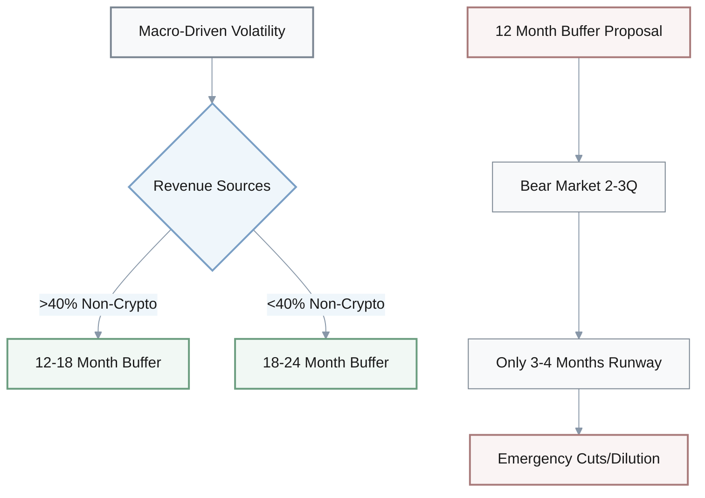
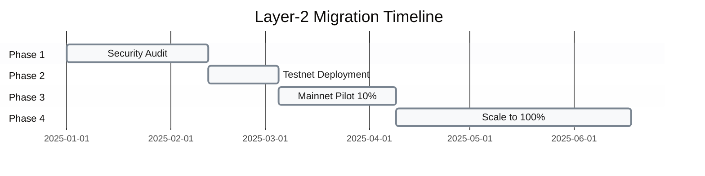
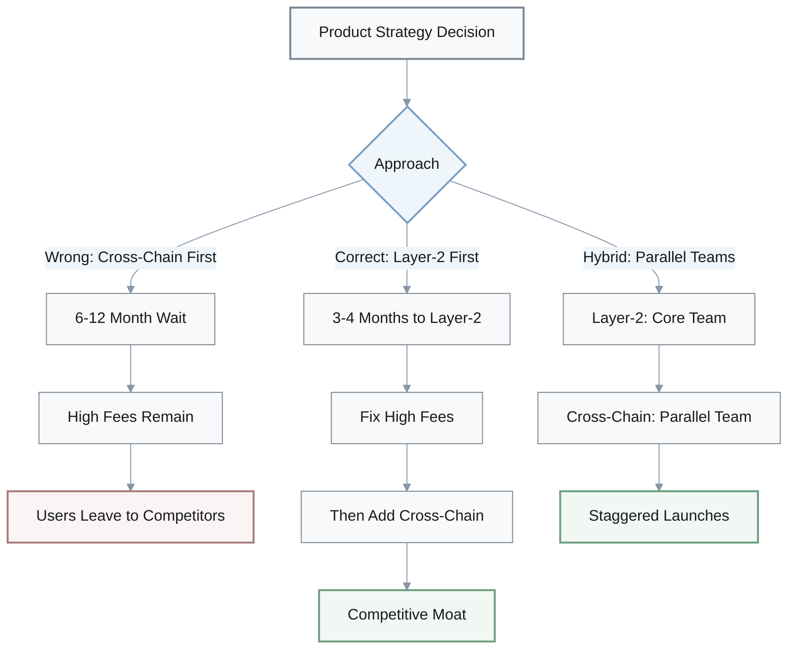
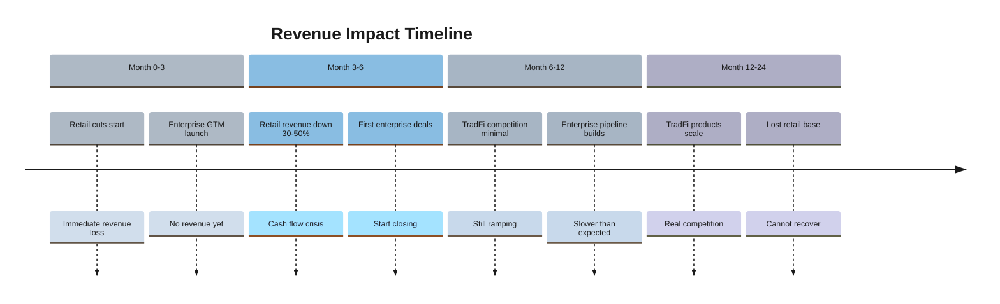
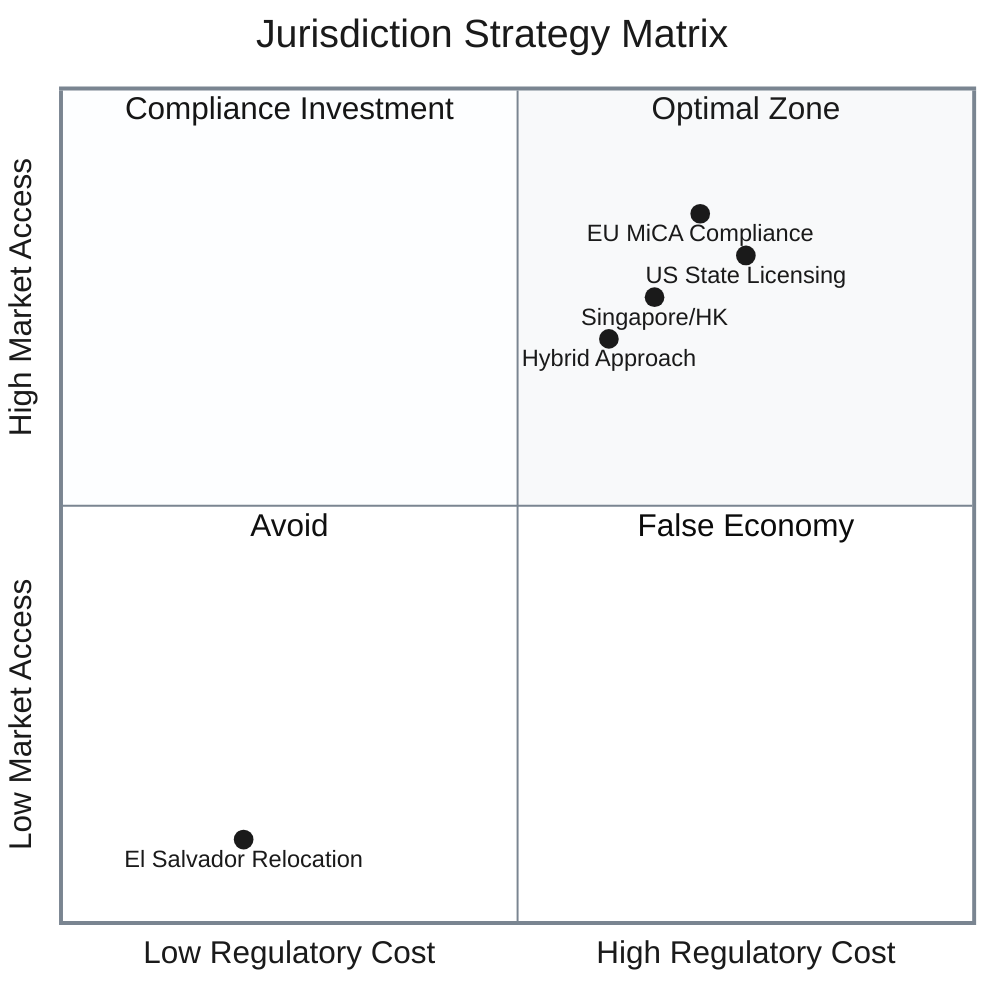
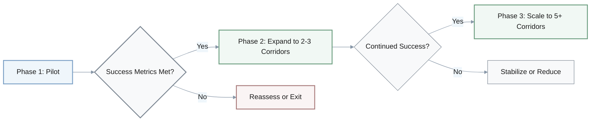
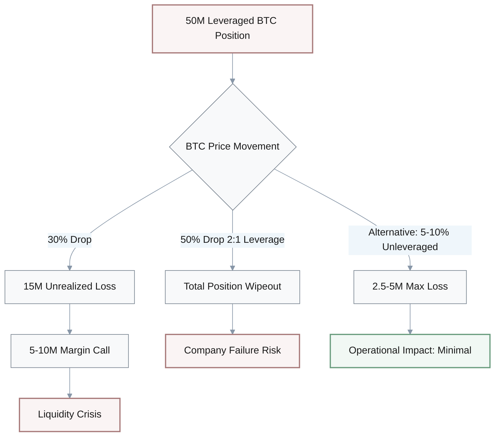

## 1. Liquidity Buffer Management

**Q: A CFO states: "Since Bitcoin volatility is macro-driven rather than crypto-structural, we should reduce our liquidity buffer from 18 months to 12 months and invest the savings in growth initiatives." What is wrong and how to fix it?**

### Analysis

**Issue**: Misinterprets "macro-driven" volatility as lower risk when it actually means crypto is now correlated with broader market downturns—liquidity needs may be **HIGHER**, not lower, since revenue and external funding will both contract simultaneously during macro stress.

**Impact**: A 12-month buffer during a prolonged bear market (2-3 quarters as modeled) leaves only 3-4 months of runway at drawdown trough, forcing emergency cost cuts or dilutive financing.

**Correction**: Maintain or increase liquidity buffer to 18-24 months precisely BECAUSE macro correlation makes crypto and TradFi funding sources move together, eliminating diversification benefit. Only reduce buffer if revenue diversification away from crypto-correlated sources exceeds 40%.

### Decision Framework

| Scenario | Buffer Recommendation | Rationale |
|----------|----------------------|-----------|
| Macro-correlated volatility | 18-24 months | Revenue + funding contract together |
| Diversified revenue (>40% non-crypto) | 12-18 months | Some hedging benefit |
| Current proposal | 12 months | **INSUFFICIENT** - only 3-4 months at trough |

---

## 2. Smart Contract Layer-2 Migration

**Q: An engineering lead proposes: "We'll migrate all smart contracts to Layer-2 within 3 months to maximize cost savings. Testing can be done in production since Layer-2s are battle-tested." What is wrong and how to fix it?**

### Analysis

**Issue**: Conflates "battle-tested platforms exist" with "our specific contracts are production-ready on Layer-2." Smart contract redeployment requires full security audit, state migration testing, and gradual rollout—rushing to production without audits exposes users to exploits and state inconsistencies.

**Impact**: Critical security vulnerability risk—even minor contract differences between Layer-1 and Layer-2 execution environments can create exploit vectors. Bridge hacks caused **$2B+ losses in 2024**. Production testing means users lose funds if issues emerge.

**Correction**: Execute 3-6 month phased migration with proper validation at each stage. Never test financial infrastructure directly in production.

### Phased Migration Timeline

| Phase | Duration | Activities | Success Criteria |
|-------|----------|------------|-----------------|
| 1. Security Audit | 4-6 weeks | Full Layer-2 contract audit | Zero critical vulnerabilities |
| 2. Testnet | 2-3 weeks | Simulated volume testing | Match Layer-1 behavior |
| 3. Mainnet Pilot | 4-6 weeks | 10% volume with rollback | No exploits, <1% error rate |
| 4. Gradual Scaling | 8-12 weeks | Scale to 100% with monitoring | Sustained performance |

> **Critical Risk**: Bridge hacks caused $2B+ losses in 2024. Production testing of financial infrastructure exposes users to unacceptable loss risk.

---

## 3. Feature Prioritization - Layer-2 vs Cross-Chain

**Q: A product manager argues: "Layer-2 integration will take 3-4 months and cross-chain will take 6-12 months. Since we need to ship fast, let's do cross-chain first because it creates a bigger competitive moat." What is wrong and how to fix it?**

### Analysis

**Issue**: Inverts prioritization logic by choosing **LONGER** timeline despite urgency, and ignores that Layer-2 is prerequisite for competitive parity (table stakes) while cross-chain is differentiation. Shipping cross-chain without Layer-2 means users still face high fees, reducing cross-chain feature utility.

**Impact**: Delays addressing primary user pain point (high fees) by 6-12 months, during which competitors ship Layer-2 and gain users. Cross-chain moat is eroded if built on slow, expensive Layer-1 foundation.

**Correction**: Ship Layer-2 first (3-4 months) to achieve cost/speed parity with competitors, THEN layer cross-chain capabilities (additional 6-12 months) on the improved infrastructure. If strategic moat is urgent, pursue hybrid approach.

### Strategic Comparison

| Feature | Timeline | Type | User Impact | Competitive Effect |
|---------|----------|------|-------------|-------------------|
| **Layer-2** | 3-4 months | Table stakes | Solves high fees (primary pain) | Prevents user loss |
| **Cross-chain** | 6-12 months | Differentiation | Limited on expensive Layer-1 | Creates moat |
| **Proposed (wrong)** | 6-12 months | Moat-first | High fees remain | Lose users while building |
| **Correct: Sequential** | 3-4mo + 6-12mo | Parity then moat | Fix fees, then add cross-chain | Defend then differentiate |
| **Hybrid approach** | Parallel teams | Both | Stagger launches | Balanced if resources allow |

---

## 4. Go-to-Market Strategy - Retail vs Enterprise

**Q: A commercial leader states: "Major TradFi institutions are entering crypto, so we should immediately cut our retail marketing budget by 50% and reallocate entirely to enterprise sales to chase bigger deals." What is wrong and how to fix it?**

### Analysis

**Issue**: Assumes TradFi entry makes retail segment uncompetitive overnight, but TradFi products will take **12-24 months** to scale, and crypto-native features (DeFi, non-custodial, advanced trading) remain differentiated for power users. Abandoning retail eliminates brand awareness and community that are prerequisites for enterprise trust.

**Impact**: Loses established retail revenue immediately (3-6 month lag before enterprise deals close) creating cash flow crisis. Enterprise buyers evaluate vendors partly on market presence and user base—cutting retail undermines enterprise credibility.

**Correction**: Execute dual strategy with balanced allocation—maintain 70-80% of current retail budget to defend base, add incremental 20-30% for enterprise GTM (increase total commercial budget, don't reallocate). Alternatively, segment retail efforts.

### Budget Allocation Comparison

| Strategy | Retail Budget | Enterprise Budget | Cash Flow Impact | Enterprise Credibility |
|----------|---------------|-------------------|------------------|----------------------|
| **Current** | 100% | 0% | Stable | Limited |
| **Proposed (wrong)** | 50% | 50% reallocated | **Crisis in 3-6mo** | Undermined by retail cuts |
| **Correct: Dual strategy** | 70-80% | +20-30% incremental | Stable | Enhanced by retail base |
| **Alternative: Segmented** | 60-70% (power users) | +30-40% incremental | Moderate impact | Strong proof points |

### Revenue Timeline

**Key Differentiators**:
- **Crypto-native features**: DeFi integration, non-custodial wallets, advanced trading
- **Power user community**: Drive word-of-mouth and enterprise proof points
- **Market presence**: Enterprise buyers evaluate vendor stability and user base

---

## 5. Compensation Strategy - Market Demand vs Salary Adjustment

**Q: A talent leader proposes: "Web3 employment is up 47% and zk engineer demand is up 51%, so we should immediately raise all technical salaries by 50% across the board to stay competitive." What is wrong and how to fix it?**

### Analysis

**Issue**: Confuses market demand growth (% increase in job postings) with required salary adjustment. **51% demand increase ≠ 51% salary increase**—actual market salary data shows 20-30% YoY increase for zk engineers. Across-the-board raises waste budget on roles without supply constraints (e.g., web developers, data analysts).

**Impact**: Inflates compensation budget by ~40-50% (if broad 50% raises) when targeted 20-30% raises for high-demand roles would cost only 8-12% total budget increase. Overshooting market creates unsustainable cost structure and difficult downward adjustments if market cools.

**Correction**: Conduct role-specific market analysis—identify high-demand roles (zk, Solidity, Rust) and raise to 75th percentile (typically 20-30% above current median). Leave other roles at market rate (50th-60th percentile).

### Compensation Strategy Comparison

| Approach | High-Demand Roles | Other Roles | Total Budget Impact | Sustainability |
|----------|-------------------|-------------|---------------------|----------------|
| **Proposed (wrong)** | +50% | +50% | +40-50% | Unsustainable |
| **Correct: Targeted** | +20-30% (75th %ile) | Market rate | +10-15% | Sustainable |
| **Market benchmark** | 20-30% YoY increase | 5-10% YoY | Varies by mix | Competitive |

### Role-Specific Approach

**High-demand roles** (raise to 75th percentile):
- **ZK engineers**: +20-30% above current median
- **Solidity developers**: +20-30% above current median
- **Rust engineers**: +20-30% above current median

**Standard roles** (maintain market rate at 50th-60th percentile):
- Web developers
- Data analysts
- General backend engineers
- Product managers

### Budget Impact Formula

$$
\text{Budget Impact (\%)} = \frac{\text{high-demand roles} \times 25\% + \text{other roles} \times 0\%}{\text{total headcount}}
$$

**Example calculation**:
- 20% high-demand roles × 25% raise = 5% total impact
- 80% other roles × 0% raise = 0% total impact
- **Total: ~5% + inefficiency = 10-15% vs 50% proposed**

---

## 6. Regulatory Strategy - Jurisdiction Selection

**Q: A strategy officer recommends: "The FSB issued regulatory warnings, so we should immediately relocate the company to a crypto-friendly jurisdiction like El Salvador to avoid compliance costs." What is wrong and how to fix it?**

### Analysis

**Issue**: Treats jurisdiction as binary (regulated vs friendly) when FSB warnings signal **GLOBAL regulatory coordination**—relocating to light-touch jurisdictions won't exempt a company from regulations in markets where customers reside. Moving to non-mainstream jurisdictions can trigger loss of banking partners and institutional customers.

**Impact**: Relocating to El Salvador (or similar) may save initial licensing costs but blocks access to US/EU/Asia institutional customers who require vendors to be licensed in their jurisdictions. Loss of USD banking rails (banks de-risk crypto companies in frontier jurisdictions) could be existential. Reputational damage from "regulatory arbitrage" perception.

**Correction**: Adopt proactive compliance in major markets (EU MiCA, US state-by-state, Singapore/HK) where customers and revenue are concentrated. Use light-touch jurisdictions only for experimental product lines or as backup entities, not primary operations. Accept regulatory cost (10-15% opex) as cost of market access.

### Jurisdiction Strategy Comparison

| Jurisdiction Type | Initial Cost | Market Access | Banking Access | Institutional Trust | Recommended Use |
|-------------------|--------------|---------------|----------------|---------------------|-----------------|
| **Major markets** (EU/US/SG/HK) | 10-15% opex | 80% of TAM | Full USD rails | High | **Primary operations** |
| **Light-touch** (El Salvador, etc.) | Low | <5% of TAM | Limited/None | Low | Experimental only |
| **Proposed (wrong)** | Save 10-15% | Lose 80% TAM | **Existential risk** | Damaged | Regulatory arbitrage |

### Market Access Trade-off

> **Critical Trade-off**: Saving 10-15% in compliance costs sacrifices 80% of addressable market. This is a false economy that prioritizes short-term savings over long-term viability.

**Key Risks of Light-Touch Jurisdictions**:
- Loss of USD banking rails (existential)
- Blocked from institutional customers
- Reputational damage ("regulatory arbitrage")
- Cannot serve customers in regulated markets

---

## 7. Market Entry Strategy - Africa ADAPT Initiative

**Q: An operations manager states: "The Africa ADAPT initiative is deploying IOTA stablecoins for $70B in trade. We should immediately commit $2M to full integration across all African markets to capture first-mover advantage." What is wrong and how to fix it?**

### Analysis

**Issue**: Conflates initiative's **$70B TAM target** with immediate opportunity, and proposes full integration across 54 African countries when infrastructure maturity, regulatory clarity, and liquidity vary dramatically by country. ADAPT is nascent—committing $2M before pilot validation is high-risk capital allocation.

**Impact**: Spreading $2M across "all African markets" yields insufficient depth in any single corridor to achieve meaningful volume or learnings. **$2M ÷ 10 priority corridors = $200K each**, barely covering integration when actual costs are $200K-$500K **PER corridor** for proper implementation. High risk of total loss if ADAPT regulatory framework stalls or IOTA ecosystem remains illiquid.

**Correction**: Execute focused pilot—select 1-2 high-volume, lower-risk corridors (e.g., Nigeria-Kenya with existing trade volume >$5M monthly), invest $300K-$500K to properly integrate, establish success metrics, then expand only if pilot validates assumptions.

### Investment Strategy Comparison

| Approach | Investment | Coverage | Depth per Corridor | Risk Level | Success Validation |
|----------|------------|----------|-------------------|------------|-------------------|
| **Proposed (wrong)** | $2M | All 54 countries | $37K-$200K | **Extreme** | None before commitment |
| **Correct: Focused pilot** | $300K-$500K | 1-2 corridors | $300K-$500K | Moderate | Metrics before expansion |
| **Phased expansion** | $500K + $1.5M later | 2 → 5 corridors | $300K-$500K each | Low | Validated scaling |

### Pilot Corridor Selection Criteria

**Nigeria-Kenya corridor** (recommended):
- **Existing trade volume**: >$5M monthly
- **Infrastructure**: Relatively mature mobile payments
- **Regulatory**: Clearer framework than most African markets
- **Risk**: Lower than continent-wide approach

### Implementation Phases

### Success Metrics for Pilot

| Metric | Target | Timeline |
|--------|--------|----------|
| **Cost reduction** | >70% vs traditional | 3 months |
| **Transaction volume** | >$10M | 6 months |
| **Liquidity depth** | Sufficient for $1M+ transactions | 6 months |
| **Regulatory clarity** | Framework approved | Ongoing |

**Total risk-adjusted investment**: $500K pilot vs $2M blind commitment = **75% cost savings with validation gates**

---

## 8. Treasury Management - Bitcoin Reserve Asset

**Q: A CEO announces: "Bitcoin reached $126K and the market cap exceeded $4T, proving crypto has achieved mainstream stability. We should leverage our balance sheet and borrow to buy $50M in Bitcoin as a treasury reserve asset." What is wrong and how to fix it?**

### Analysis

**Issue**: Interprets a price peak and market cap milestone as "stability" when the same period includes **30%+ drawdown ($126K → <$86K)**—this is evidence of **EXTREME volatility**, not stability. Using leverage amplifies downside—if BTC drops another 30%, the company faces margin calls or $15M+ loss.

**Impact**: A leveraged $50M BTC position with 30% drawdown creates **$15M unrealized loss** and potential margin call requiring $5M-$10M additional collateral. For most companies, this magnitude of non-operational loss threatens liquidity, employee confidence, and stakeholder trust. If using 2:1 leverage, a 50% BTC decline wipes out the entire position.

**Correction**: Treat 30%+ monthly volatility as disqualifying for leveraged treasury allocation. If strategic BTC exposure is desired, limit to 5-10% of liquid reserves (not 50%+), use zero-leverage (cash purchase), and only deploy capital that can sustain 50-70% drawdown without operational impact.

### Volatility Reality Check

**Price movement in reporting period**:

$$
\text{Drawdown (\%)} = \frac{\$126K - \$86K}{\$126K} \times 100 = 31.7\%
$$

This is **EXTREME volatility**, not stability.

### Leverage Impact Analysis

| Scenario | Investment | Leverage | BTC Drop | Loss | Margin Call Risk | Operational Impact |
|----------|------------|----------|----------|------|------------------|-------------------|
| **Proposed (wrong)** | $50M | 2:1 | 30% | **$15M** | High | Existential threat |
| **Proposed at 50% drop** | $50M | 2:1 | 50% | **$50M (wipeout)** | Total loss | Company failure |
| **Conservative: 5-10%** | $5M-$10M | None | 50% | $2.5M-$5M | None | Absorbable |
| **Recommended for most** | $0 | N/A | N/A | N/A | None | No risk |

### Risk Scenarios

### Treasury Allocation Guidelines

**Only consider BTC treasury allocation if**:
- Revenue stability: ✅ Multi-year profitability established
- Liquidity: ✅ 18-24 month runway without BTC
- Risk tolerance: ✅ Can sustain 50-70% drawdown
- Leverage: ❌ **NEVER use leverage for treasury assets**

**Allocation limits**:
- **Conservative**: 0% (recommended for most companies)
- **Moderate risk**: 5-10% of liquid reserves, zero leverage
- **Never exceed**: 10% or leverage treasury assets

> **Critical Error**: Confusing price peaks with stability. A 30%+ monthly drawdown disqualifies an asset from treasury allocation, especially with leverage.

---
