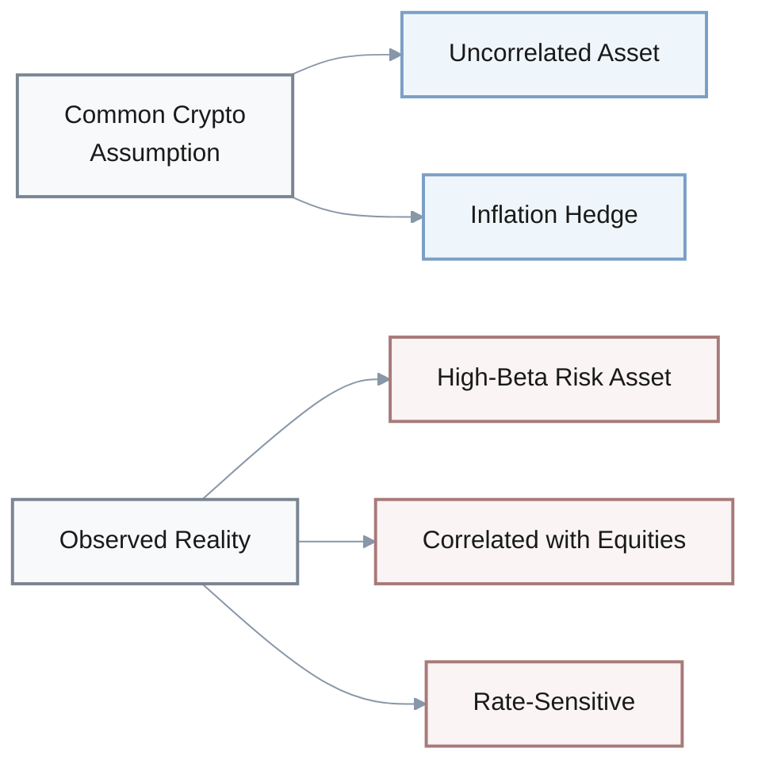
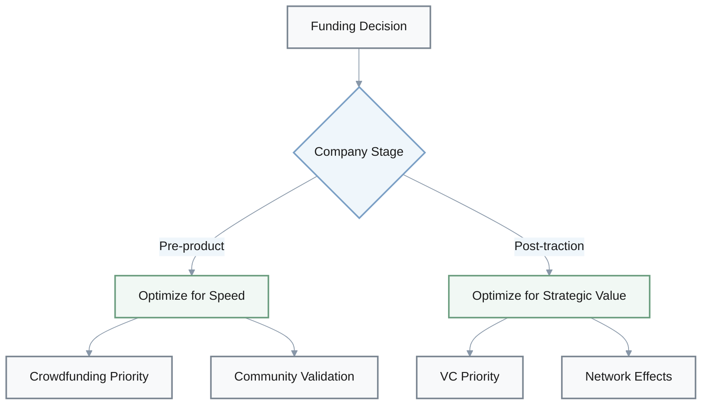
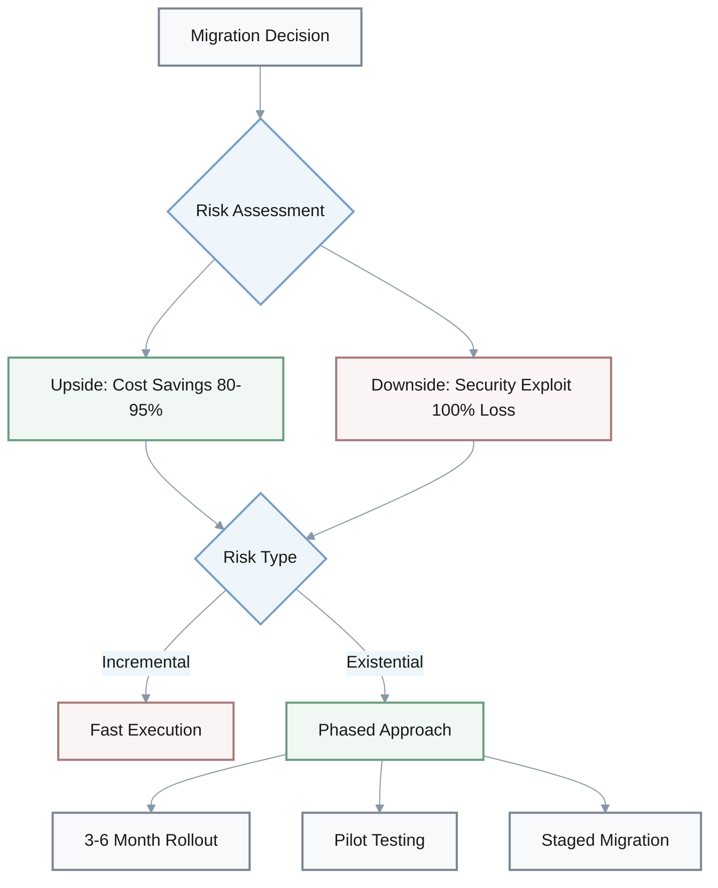
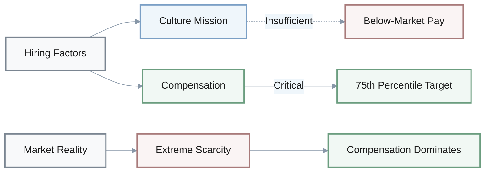
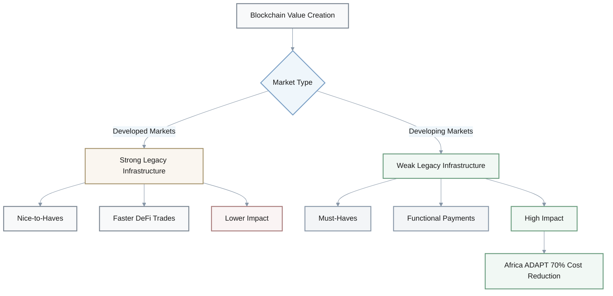
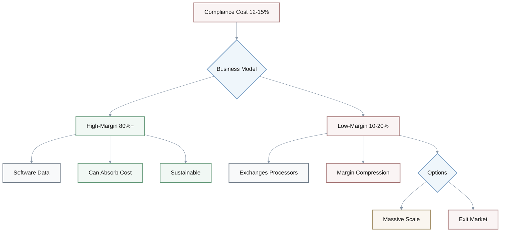

## 1. Bitcoin Volatility: Macro-Driven Asset or Technology Play?

**Q:** The analysis reveals Bitcoin experienced a 30%+ correction from $126K to <$86K within two weeks, yet the document characterizes this as "macro-driven" rather than "crypto-structural" and maintains that "long-term fundamentals remain intact." How does this framing challenge or reinforce your assumptions about cryptocurrency as an asset class?

### Market Correction Overview

| Metric | Value |
|--------|-------|
| Peak Price | $126K |
| Trough Price | <$86K |
| Correction Magnitude | 30%+ |
| Time Period | 2 weeks |
| Primary Driver | Macro sentiment |

**A:** 

### **Assumption to examine**
Many adopt crypto assuming it's an "uncorrelated" or "inflation hedge" asset, but macro-driven volatility suggests crypto increasingly trades like a **high-beta risk asset** correlated with equities and rate expectations—this challenges the diversification thesis.

### **Mental model shift**
If crypto's primary driver is **macro sentiment** rather than technology adoption or utility, valuation becomes more about **liquidity cycles** and less about fundamental progress—requires rethinking investment thesis from "technology disruption" to "risk-on/risk-off cyclical asset."

### **Belief update needed**
The claim that fundamentals are "intact" despite 30% moves implies separating price from value—but if market structure allows 30% moves on macro noise, perhaps "fundamentals" don't anchor price as strongly as believed, questioning long-term predictability.

### **Implication for decisions**
If you're allocating treasury or personal capital to crypto, macro correlation means you need:
- **Diversification across asset classes** (not just within crypto)
- **Timing/volatility management** becomes more critical than long-term holding assumptions

---

## 2. Crypto Crowdfunding vs Traditional VC: Speed vs Quality Trade-off

**Q:** Crowdfunding platforms like Bitstarter.ai reduce time-to-capital from 6-12 months to 1-3 months but potentially at the cost of "investor quality screening" and "dilution control." What assumptions about funding strategy does this trade-off reveal, and how might your priorities differ at different company stages?

### Funding Path Comparison

| Factor | Crowdfunding | Traditional VC |
|--------|--------------|----------------|
| Time to Capital | 1-3 months | 6-12 months |
| Investor Quality | Distributed | Tier-1 VCs |
| Dilution Control | Self-set terms | Negotiated |
| Strategic Value | Community validation | Network effects |
| Control Terms | Minimal restrictions | Board seats, preferences |

**A:**

### **Underlying assumption**
The statement assumes "investor quality" (tier-1 VCs) is always worth 6-12 months of time—but this privileges patient capital access over survival, which may be **luxury thinking** for founders with <6 months runway.

### **Stage-dependent values**
- **Pre-product founders**: May value speed and community validation (crowdfunding) over pedigree
- **Post-traction founders**: May value strategic VC networks over speed

This suggests optimal funding path is **context-dependent**, not universal.

### **Dilution control paradox**
Crowdfunding is framed as limiting "dilution control," but setting your own terms to a distributed crowd may offer **MORE control** than negotiating with a lead VC who demands:
- Board seats
- Preferences
- Protective provisions

This challenges assumption that **institutional funding = founder control**.

### **Reflection on risk tolerance**
Your choice between speed (crowdfunding) and validation (VC) reveals personal risk preferences:
- **Optimize for probability of survival?** → Speed priority
- **Optimize for probability of large outcome?** → Institutional validation and network priority

> Many founders don't explicitly articulate this trade-off.

---

## 3. Layer-2 Migration: Why Obvious ROI Doesn't Justify Immediate Action

**Q:** Layer-2 migration can reduce costs 80-95% and increase throughput 100x-1000x, yet the analysis recommends a "phased" 3-6 month approach rather than immediate full migration. What does this reveal about the relationship between obvious economic benefits and execution risk?

### Layer-2 Benefits vs Implementation Approach

| Metric | Improvement | Recommended Timeline |
|--------|-------------|---------------------|
| Cost Reduction | 80-95% | 3-6 months (phased) |
| Throughput Increase | 100x-1000x | Not immediate |
| Approach | High ROI | De-risked execution |

**A:**

### **False dichotomy awareness**
The recommendation challenges **"if ROI is obvious, move fast"** thinking—recognizing that even correct strategic directions have execution risk (security vulnerabilities, state migration bugs) that can erase gains or destroy the business.

### **Risk asymmetry insight**
The analysis implicitly weighs:
- **Upside**: 80-95% cost savings (incremental benefit)
- **Downside**: Potential security exploit losing 100% of user funds (existential risk)

$$
\text{Decision Rule: When downside is existential and upside is incremental, slow de-risked execution beats fast execution}
$$

### **Systems thinking**
Reveals that technology decisions aren't just math problems (cost/benefit) but **integration challenges** where interactions between components create non-obvious failure modes:
- Layer-1 contracts
- Layer-2 execution
- Bridge security
- User experience

### **Application to other decisions**
This caution applies beyond tech—any major operational change benefits from piloting and staged rollout:
- Moving jurisdictions
- Replacing core systems
- Restructuring teams

> **Critical question**: "What could go catastrophically wrong if we're 95% right but miss a critical edge case?"

---

## 4. Web3 Talent Market: Compensation Dominates in Scarcity

**Q:** The document states Web3 employment rebounded 47% with 66,494 new roles, and recommends targeting 75th percentile compensation for specialized roles. How does this data shift your understanding of talent market dynamics and the nature of competitive advantage in hiring?

### Web3 Employment Growth by Specialization

| Role Type | Growth Rate | Market Status |
|-----------|-------------|---------------|
| Overall Employment | +47% | 66,494 new roles |
| zk Engineers | +51% | Extreme scarcity |
| Solidity Developers | +32% | Commoditizing |
| Rust Developers | +40% | Moderate demand |
| Recommended Comp Target | 75th percentile | Premium positioning |

**A:**

### **Market-rate misconception**
Many assume competitive advantage in hiring comes from "culture" or "mission"—but **47% supply increase with 51% demand surge** in zk engineers suggests extreme scarcity where **compensation dominates** other factors.

> Challenges romanticized view that purpose compensates for below-market pay.

### **Specialization premium**
The differential growth reveals market segmentation:
- **zk cryptography**: +51% (cutting-edge, premium pricing)
- **Rust**: +40% (specialized demand)
- **Solidity**: +32% (commoditizing)
- **Generalist blockchain**: Baseline 47% (standard market)

**Key insight**: Generalist "blockchain developer" roles are **commoditizing** while cutting-edge specialization commands increasing premiums.

### Strategic implications:
- **As employee**: Stay at technical frontier to maintain negotiating leverage
- **As employer**: Build depth in specialized skills or pay premium

### **Wage stickiness risk**
Recommending 75th percentile now builds a **cost structure that's hard to reverse** if market cools.

Forces reflection on hiring philosophy:
1. **Win talent wars at any cost?** → Short-term competitive advantage
2. **Build sustainable cost structure?** → Bet on non-comp differentiation

### **What would change your mind**
If you believe culture/mission matter more than comp:
- What evidence would convince you otherwise?
- If **70% of departures cite compensation** in exit interviews, would you update your model?

---

## 5. Institutional Adoption: Validation or Co-option of Crypto?

**Q:** Major financial institutions (Visa, BlackRock, JPMorgan) are launching crypto products, which the analysis frames as both "validation" and "threat" to crypto-native firms. How does institutional adoption challenge or complicate your beliefs about crypto's original purpose and future trajectory?

### Institutional Players Entering Crypto

| Institution | Implication for Crypto-Native Firms |
|-------------|-------------------------------------|
| Visa | Payment infrastructure competition |
| BlackRock | Asset management legitimacy |
| JPMorgan | Banking rails integration |
| Framing | Both "validation" AND "threat" |

**A:**

### **Ideological tension**
If you entered crypto for **decentralization/sovereignty principles**, TradFi adoption creates cognitive dissonance:
- Is institutional participation **"success"** (mainstream adoption)?
- Or **"co-option"** (recreating centralized systems on crypto rails)?

> Forces articulation of what success actually means.

### **Mission drift risk**
As crypto-native firms partner with TradFi (recommended strategy), there's risk of gradually adopting TradFi assumptions until differentiation disappears:
- KYC/AML requirements
- Custodial models
- Permissioned access

**Reflection needed**: What are non-negotiable principles vs pragmatic concessions?

### **Two-crypto-worlds hypothesis**
Institutional adoption may **bifurcate crypto** into two distinct ecosystems:

```mermaid
%%{init: {
  "theme": "base",
  "themeVariables": {
    "primaryColor": "#f8f9fa",
    "primaryTextColor": "#1a1a1a",
    "primaryBorderColor": "#7a8591",
    "lineColor": "#8897a8",
    "secondaryColor": "#eff6fb",
    "tertiaryColor": "#f3f5f7"
  }
}}%%
graph TD
    A[Crypto Ecosystem] --> B[TradFi-Crypto Path]
    A --> C[DeFi-Crypto Path]
    
    B --> D[Visa, BlackRock Products]
    B --> E[Regulated Infrastructure]
    B --> F[Permissioned Access]
    B --> G[Scale Revenue]
    B --> H[Lower Margins]
    
    C --> I[Permissionless DeFi]
    C --> J[Sovereignty Focus]
    C --> K[Different User Base]
    C --> L[Values Alignment]
    C --> M[Smaller TAM]
    
    style A fill:#f8f9fa,stroke:#7a8591,stroke-width:2px,color:#1a1a1a
    style B fill:#eff6fb,stroke:#7a9fc5,stroke-width:2px,color:#1a1a1a
    style C fill:#f1f8f4,stroke:#6b9d7f,stroke-width:2px,color:#1a1a1a
    style D fill:#f8f9fa,stroke:#7a8591,stroke-width:2px,color:#1a1a1a
    style E fill:#f8f9fa,stroke:#7a8591,stroke-width:2px,color:#1a1a1a
    style F fill:#f8f9fa,stroke:#7a8591,stroke-width:2px,color:#1a1a1a
    style G fill:#f8f9fa,stroke:#7a8591,stroke-width:2px,color:#1a1a1a
    style H fill:#f8f9fa,stroke:#7a8591,stroke-width:2px,color:#1a1a1a
    style I fill:#f3f5f7,stroke:#8897a8,stroke-width:2px,color:#1a1a1a
    style J fill:#f3f5f7,stroke:#8897a8,stroke-width:2px,color:#1a1a1a
    style K fill:#f3f5f7,stroke:#8897a8,stroke-width:2px,color:#1a1a1a
    style L fill:#f3f5f7,stroke:#8897a8,stroke-width:2px,color:#1a1a1a
    style M fill:#f3f5f7,stroke:#8897a8,stroke-width:2px,color:#1a1a1a
```

**Key insight**: Questions your assumption that "crypto" is a unified category with shared trajectory.

### **Strategic identity**
As a founder/employee/investor, **which side of the bifurcation do you want to be on?**

| Path | Benefits | Trade-offs |
|------|----------|-----------|
| **Institutional Integration** | Scale, revenue, legitimacy | Lower margin, mission dilution |
| **DeFi/Sovereignty** | Differentiation, values alignment | Smaller TAM, regulatory risk |

> Many avoid explicitly choosing, leading to **strategic ambiguity**.

---

## 6. Africa ADAPT: Where Blockchain Creates Real-World Value

**Q:** The Africa ADAPT initiative deploys IOTA-based stablecoins to modernize $70B in trade, with potential 70%+ cost reduction compared to traditional banking. What does this use case reveal about where blockchain creates most value, and how does it compare to your prior assumptions about crypto's highest-impact applications?

### Africa ADAPT Impact Overview

| Metric | Value | Implication |
|--------|-------|-------------|
| Trade Volume | $70B | Large-scale infrastructure |
| Cost Reduction | 70%+ | vs traditional banking |
| Technology | IOTA stablecoins | Payment/trade focus |
| Annual Value Creation | $4-5B | Real economic activity |

**A:**

### **Utility vs speculation**
If you associate crypto primarily with trading/investment, ADAPT highlights that **highest-impact use case** may be **payments/trade infrastructure** in markets with broken legacy systems.

> Challenges assumption that crypto's value is primarily store-of-value or speculative vehicle.

### **Geographic arbitrage of innovation**
ADAPT targets **Africa**, not developed markets—suggests blockchain's comparative advantage is strongest where **legacy infrastructure is weakest**:
- Correspondent banking delays
- High fees
- Lack of trust

**Reflection**: Are you focusing innovation efforts on:
- **Developed market "nice-to-haves"** (faster DeFi trades)?
- **Developing market "must-haves"** (functional cross-border payments)?

### **Measurement of impact**

$$
\text{Annual Value Creation} = \$70B \times 70\% = \$4-5B \text{ (real economic activity)}
$$

**Comparison**:
- **ADAPT impact**: $4-5B annual value creation for actual economic activity
- **Crypto market cap movements**: Don't directly improve real-world transactions

**Critical question**: If impact matters to you, are you prioritizing:
- Applications with **measurable real-economy value**?
- Or **speculative/entertainment** use cases?

### **Risk vs reward for different stakeholders**
ADAPT's government/institutional backing reveals a fundamental trade-off:

| Approach | Benefits | Drawbacks |
|----------|----------|-----------|
| **Institutional Backing** | Reduced regulatory risk, scaled adoption | Potential centralization |
| **Permissionless Innovation** | True decentralization | Regulatory risk, harder to scale |

**Reflection**: Which do you prioritize, and why?

---

## 7. Regulatory Compliance: 12-15% Tax on Crypto Innovation

**Q:** The FSB's regulatory warnings and Switzerland's stablecoin consultation signal global regulatory tightening, with the recommendation to "budget 12-15% of opex for regulatory infrastructure." How does the rising cost of compliance change your understanding of which crypto business models are sustainable long-term?

### Regulatory Environment Shift

| Indicator | Impact |
|-----------|--------|
| FSB Warnings | Global regulatory tightening |
| Switzerland Consultation | Stablecoin regulations |
| Compliance Cost | 12-15% of opex |
| Market Effect | Consolidation pressure |

**A:**

### **Barrier to entry shift**
12-15% opex for compliance means only companies with **strong unit economics** or **deep funding** can afford regulatory overhead.

> Challenges assumption that crypto enables permissionless entrepreneurship. Market may consolidate toward larger, well-capitalized players.

### **Compliance as moat**
If regulatory cost is high, companies that build compliance infrastructure early create **competitive advantage**:
- New entrants face same cost without revenue to fund it
- Reframes compliance from "annoying overhead" to "strategic investment"

**Critical question**: Are you treating compliance as:
- Cost-minimization problem?
- Moat-building opportunity?

### **Business model filter**

| Business Type | Gross Margin | Can Absorb 12-15% Compliance? |
|---------------|--------------|-------------------------------|
| **Software/Data** | 80%+ | ✅ Yes |
| **Exchanges** | 10-20% | ❌ Need massive scale |
| **Payment Processors** | 10-20% | ❌ Margin compression |

**Reflection**: 
- Does your business model generate enough margin to sustainably fund compliance at scale?
- If not, is there a pivot to **higher-margin adjacencies**?

### **Philosophical question**
If crypto's promise was **"permissionless innovation"** but reality is **"12-15% compliance tax"**:

**Two interpretations**:
1. **Purist view**: Original vision has failed
2. **Pragmatist view**: Regulated crypto still superior to TradFi (which has even higher compliance costs)

$$
\text{Sustainability} = \begin{cases}
\text{Gross Margin} > 12-15\% + \text{Other Opex} & \text{Viable} \\
\text{Gross Margin} < 12-15\% + \text{Other Opex} & \text{Need Scale or Exit}
\end{cases}
$$

> Your answer reveals whether you're **pragmatist** or **purist**.

---
