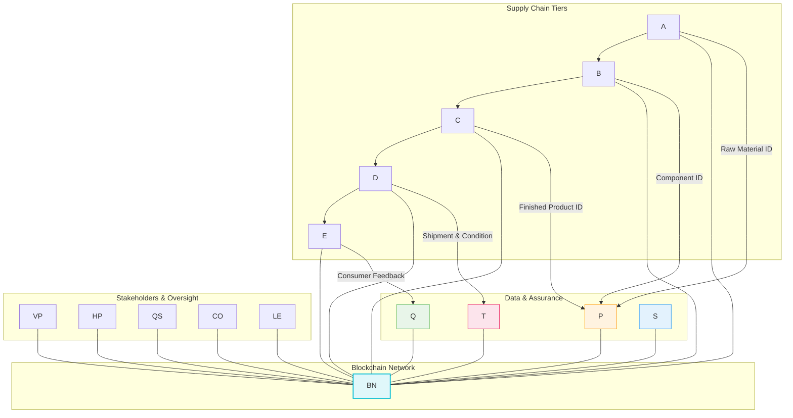

### Operations & Supply Chain News Intelligence Q&A

### I. Global Supply Chain Disruptions and Resilience in Late 2024 and 2025

#### 1. How is the discontinuation of Maersk's TradeLens platform impacting global supply chain visibility and logistics operations in 2025?

Maersk and IBM made the decision to discontinue their blockchain-enabled TradeLens platform, taking it offline by the end of Q1 2023. This decision stemmed from the platform's failure to achieve the necessary global industry collaboration and commercial viability, despite successfully developing a viable technological solution. TradeLens, launched in 2018, had an ambitious vision to digitize global trade, enhance transparency, security, and efficiency by managing and tracking millions of shipping containers. It gathered data from over 600 ports and terminals and involved more than 300 member organizations, including major shipping lines. However, key stakeholders like shippers and freight forwarders were not sufficiently convinced of the added value to commit to the platform, citing cost concerns, a lack of attractive incentives, and suspicions about Maersk's potential competitive advantage due to its dominant role. The shutdown illustrates the complexities of achieving widespread blockchain adoption in a fragmented and highly competitive industry.

**Impact on Operations:** The discontinuation primarily affects the **Deliver** and **Enable** operations cycles by removing a significant source of integrated, real-time shipment data. Logistics Directors are concerned about a potential decrease in visibility into container movements and documentation, which could lead to increased lead times and reduced efficiency in responding to disruptions. IT Leads face the challenge of finding and integrating alternative digital solutions that can provide comparable levels of data transparency and immutability. The absence of a universally adopted platform means ongoing reliance on fragmented systems and manual processes, hindering the overall digital transformation goals for many supply chain participants. This situation could lead to a quantifiable increase in time spent on data reconciliation and dispute resolution, which TradeLens initially aimed to reduce significantly.

**Stakeholders:**
*   **Logistics Director:** Concerned about maintaining real-time visibility, ensuring efficient routing, and managing potential delays. They have the authority to evaluate and implement new digital logistics platforms.
*   **IT Lead:** Responsible for identifying, integrating, and maintaining alternative technology solutions that can replace TradeLens's functionality, ensuring data security and interoperability.
*   **VP Supply Chain:** Focuses on overall supply chain strategy, needing to ensure resilience and transparency across the network despite platform changes. They hold decision authority over strategic technology investments and partnerships.
*   **Business Continuity/Resilience Lead:** Concerned about mitigating risks associated with reduced visibility and ensuring the ability to respond to disruptions effectively. They participate in the evaluation of alternative solutions and contingency planning.

**Decision Framework:** **Adjust** digital strategies and **Invest** in alternative, interoperable visibility solutions. The rationale is to prevent a rollback in supply chain digitization efforts and to continue leveraging technology for enhanced transparency and efficiency. Alternatives include joining other industry consortia (e.g., GSBN), leveraging advanced Port Community Systems (PCS), or developing proprietary solutions integrated with existing ERP/TMS systems. Success criteria include achieving at least 90% of previous real-time shipment visibility, reducing data reconciliation time by 20%, and securing buy-in from at least 70% of critical trading partners within 6 months.

**Action Plan:**
*   **Immediate (0–2 weeks) - Owner: IT Lead, Logistics Director:** Conduct an audit of current supply chain visibility capabilities and identify specific gaps created by the TradeLens shutdown. Communicate directly with key trading partners about data sharing protocols and transition plans.
*   **Short-term (2 weeks–2 months) - Owner: IT Lead, Head of Procurement, Logistics Director:** Evaluate and pilot alternative digital logistics platforms (e.g., those integrating blockchain with IoT and AI) or enhance existing in-house systems to cover lost functionalities. Prioritize solutions with open standards and a clear value proposition for all participants.
*   **Medium-term (2–6 months) - Owner: VP Supply Chain, IT Lead:** Develop an enterprise-wide deployment plan for selected interoperable visibility technologies, ensuring seamless integration with existing ERP and TMS systems. Establish a governance model that addresses data privacy and promotes equitable collaboration among all stakeholders.

#### 2. What operational risks arise from persistent port congestion and geopolitical disruptions, and how should logistics and procurement teams respond in 2025?

Global supply chains continue to grapple with persistent port congestion in 2025, exacerbated by factors such as labor actions, infrastructure limitations, and geopolitical events. The Red Sea crisis, which began in late 2023 and continued into early 2024, significantly disrupted Suez Canal traffic, forcing a 50% drop in volume and compelling major carriers to reroute vessels around the Cape of Good Hope. This diversion added 7–14 days to Asia-Europe voyages, causing a significant strain on just-in-time supply chains and increasing transportation costs. In Q2 2025, port congestion remains a long-term challenge, causing shipment delays across the globe. Origin ports in regions like China, India, and Vietnam reported congestion, with 52% of retailers experiencing issues as carriers worked through backlogs. Domestically, issues have emerged in major U.S. gateways, particularly in the Northeast and Gulf Coast, driven by systemic issues, equipment misalignment, and customs delays linked to tariff uncertainty.

**Impact on Operations:** These disruptions severely affect the **Deliver** and **Source** operations cycles. Logistics Directors face extended lead times, with transit times increasing by 7–14 days on average, directly impacting delivery schedules and customer satisfaction. Freight rates have experienced significant volatility and upward pressure, with spot rates between China and the U.S. climbing by 9-16% in early April 2025, directly impacting procurement costs. Procurement Leads must contend with increased costs for materials and components, as well as delays in inbound supplies. Inventory Managers may need to increase safety stock levels to buffer against unpredictable arrival times, leading to higher carrying costs. The effective global shipping capacity has shrunk by an estimated 20% during crises like the Red Sea situation, further driving up freight rates.

**Stakeholders:**
*   **Logistics Director:** Concerned about escalating freight costs, extended lead times, and maintaining delivery reliability. They have authority over route optimization, carrier selection, and distribution strategies.
*   **Head of Procurement:** Focuses on managing increased sourcing costs due to freight surges and potential supply disruptions. They influence supplier selection, contract negotiations, and inventory planning.
*   **Inventory Manager:** Concerned with balancing inventory levels to avoid stockouts while managing increased carrying costs due to longer lead times and higher safety stock requirements. They have authority over inventory policies and replenishment strategies.
*   **Business Continuity/Resilience Lead:** Concerned with overall supply chain vulnerability and developing contingency plans for major disruptions. They collaborate on risk assessments and emergency response protocols.

**Decision Framework:** **Mitigate** risks through diversification and enhanced planning, and **Adjust** sourcing and logistics strategies. The rationale is to build resilience against recurring disruptions and minimize cost escalations. Alternatives include nearshoring or reshoring, greater reliance on regional distribution, and exploring multimodal transportation options. Success criteria include reducing lead time variability by 20%, stabilizing freight costs to within 10% of planned budgets, and maintaining customer service levels above 95% during disruptive events within 6 months.

**Action Plan:**
*   **Immediate (0–2 weeks) - Owner: Logistics Director, Head of Procurement:** Conduct a rapid assessment of all critical shipping lanes and supplier locations for exposure to port congestion and geopolitical risks. Expedite communications with current carriers and 3PLs to understand immediate capacity and routing options.
*   **Short-term (2 weeks–2 months) - Owner: Head of Procurement, Inventory Manager:** Implement dual-sourcing strategies for critical components and raw materials from diverse geographical regions, including nearshoring options where feasible. Adjust safety stock levels for high-value or high-risk SKUs to buffer against extended lead times.
*   **Medium-term (2–6 months) - Owner: VP Supply Chain, Logistics Director:** Invest in digital supply chain visibility tools and predictive analytics to gain real-time insights into shipment locations, port conditions, and potential disruptions. Develop flexible contracts with carriers that include clauses for rerouting and alternative transport modes.

#### 3. How are blockchain and AI integration transforming manufacturing efficiency and supply chain visibility in 2025?

In 2025, the manufacturing industry is undergoing a significant transformation, with blockchain technology emerging as a powerful tool to enhance transparency, streamline operations, and foster trust in the supply chain. The market size of blockchain in manufacturing is experiencing remarkable growth, projected to reach $68,611.31 million by 2032 with a CAGR of 71.6%, driven by the need for enhanced supply chain visibility, anti-counterfeiting measures, and data security. When combined with AI and IoT, blockchain becomes even more potent, enabling real-time logistics traceability and predictive analytics. AI, specifically, is set to revolutionize supply chains by analyzing large datasets to predict demand, optimize routes, and manage inventory more efficiently. By 2026, 60% of global container shipping is expected to use IoT sensors linked to blockchain for route optimization and compliance logging.

**Impact on Operations:** The integration of blockchain and AI significantly impacts the **Make** and **Enable** operations cycles, leading to enhanced efficiency and operational resilience. For manufacturing, this translates to immutable records of quality assessments and production data, helping to optimize processes, reduce lead times, and ensure quality control. Plant Managers can utilize AI to analyze trusted data on the blockchain to predict issues, spot fraud, and adjust production plans in real-time, improving Overall Equipment Effectiveness (OEE) and reducing cycle times. For instance, DHL is testing GenAI applications for business development and solutions design, providing faster analysis of customer requirements and data cleansing. Blockchain's decentralized and encrypted nature also improves data security and privacy for sensitive intellectual property, which is crucial in industries like aerospace and defense.

**Stakeholders:**
*   **Plant/Factory Manager:** Concerned with optimizing production workflows, ensuring quality control, and reducing operational costs. They have authority over manufacturing processes, automation investments, and quality assurance protocols.
*   **Ops Excellence/Lean Lead:** Focuses on streamlining processes, identifying bottlenecks, and driving continuous improvement. They champion the integration of new technologies to achieve efficiency gains and reduce waste.
*   **VP Operations:** Oversees the efficiency and effectiveness of all operational aspects, including technology adoption and strategic investments in smart factory initiatives. They have decision authority over major operational transformations.
*   **IT Lead:** Responsible for the seamless integration of blockchain, AI, and IoT with existing systems, ensuring data integrity, security, and scalability. They hold authority for technology architecture and deployment.

**Decision Framework:** **Invest** in the integration of blockchain, AI, and IoT to enhance manufacturing efficiency and supply chain visibility. The rationale is to achieve superior real-time data analysis, automation, security, and traceability, thereby gaining a competitive edge and improving operational resilience. Alternatives include relying on traditional, fragmented systems, which risks inefficiencies, lack of transparency, and vulnerability to disruptions. Success criteria include a 10% increase in forecasting accuracy, a 15% reduction in unplanned downtime due to predictive maintenance, and a 20% reduction in production lead times within 12 months.

**Action Plan:**
*   **Immediate (0–2 weeks) - Owner: IT Lead, Ops Excellence/Lean Lead:** Conduct an assessment of current manufacturing processes and supply chain data flows to identify high-impact areas for blockchain, AI, and IoT integration. Prioritize pilot projects that address critical pain points such as quality control or inventory management.
*   **Short-term (2 weeks–2 months) - Owner: Plant/Factory Manager, IT Lead:** Implement pilot projects, focusing on specific use cases like tracking components, real-time machine monitoring, or automated quality checks. Invest in training for staff to develop the necessary skills for managing and utilizing these advanced technologies.
*   **Medium-term (2–6 months) - Owner: VP Operations, Plant/Factory Manager:** Scale successful pilot projects across the enterprise, integrating blockchain platforms with existing ERP, MES, and WMS systems using robust APIs and middleware. Establish a data governance framework to ensure secure and transparent data sharing among authorized parties while protecting intellectual property.

#### 4. How is blockchain technology addressing food supply chain quality, safety, and recall management in 2025?

Blockchain technology is fundamentally transforming food supply chain quality, safety, and recall management in 2025, offering a robust solution to long-standing industry challenges. Recent foodborne illness outbreaks, such as a norovirus incident in December 2024 and a Salmonella outbreak linked to cucumbers in November 2024, underscore the urgent need for enhanced traceability and rapid response mechanisms. Companies like Walmart have pioneered the use of blockchain through platforms such as IBM Food Trust, dramatically reducing the time to trace food products from farm to store from days or weeks to mere seconds. This capability is critical for swift, precise recalls that minimize waste, protect public health, and rebuild consumer trust. The global market for blockchain in sustainable supply chains was valued at $827.6 million in 2024 and is projected to grow significantly, highlighting increased investment in this area.

**Impact on Operations:** Blockchain integration primarily impacts the **Quality, Safety & Compliance** and **Deliver** operations cycles. For Quality & Safety Leads, blockchain provides an immutable digital ledger that records every step of a product's journey—from origin, processing data, and shipping information—making it virtually impossible to alter past transactions and ensuring data integrity. This enhanced traceability allows for instant identification of contamination sources, transforming nationwide recalls into precise, targeted actions that reduce the amount of product needing to be pulled from shelves and minimizing losses. Consumers can also verify authenticity and provenance by scanning QR codes, fostering greater trust. Business Continuity Managers benefit from faster response times during crises, reducing reputational damage and the substantial financial costs associated with widespread recalls, which can range into millions or even billions of dollars.

**Stakeholders:**
*   **Quality & Safety Lead:** Responsible for ensuring product integrity, compliance with food safety regulations (e.g., FDA's DSCSA), and rapid response to contamination incidents. They have authority to implement traceability systems and manage recall protocols.
*   **Business Continuity/Resilience Lead:** Concerned with minimizing the impact of disruptions, including food safety crises, on operations and brand reputation. They have authority over crisis management plans and risk mitigation strategies.
*   **VP Supply Chain:** Focuses on overall supply chain strategy, including ensuring product quality and safety from source to consumer. They influence technology investments and strategic partnerships for food safety initiatives.
*   **Inventory Manager:** Benefits from precise recall data, enabling faster removal of affected products and reducing waste due to unnecessary broad recalls.

**Decision Framework:** **Invest** in blockchain-enabled traceability solutions for the food supply chain. The rationale is to drastically improve food safety, accelerate recall processes, build consumer trust, ensure regulatory compliance, and mitigate significant financial and reputational risks associated with foodborne illnesses and contamination. Alternatives include relying on traditional, paper-based, or fragmented digital systems, which have proven to be slow, error-prone, and inefficient during crises. Success criteria include reducing product trace times to under 5 seconds, decreasing the scope of recalls by 30%, and achieving 100% compliance with relevant food safety regulations within 9 months.

**Action Plan:**
*   **Immediate (0–2 weeks) - Owner: Quality & Safety Lead, Head of Procurement:** Conduct a thorough review of current traceability systems and identify critical gaps where blockchain can provide immediate value (e.g., high-risk perishable goods). Engage with technology providers and existing blockchain consortiums like IBM Food Trust for implementation insights.
*   **Short-term (2 weeks–2 months) - Owner: Quality & Safety Lead, VP Supply Chain:** Pilot a blockchain solution for a specific high-risk product line (e.g., leafy greens, fresh produce) to demonstrate proof of concept and gather measurable results. Develop standardized data input protocols (e.g., GS1 standards) for all supply chain partners involved in the pilot.
*   **Medium-term (2–6 months) - Owner: VP Supply Chain, IT Lead, Business Continuity Lead:** Scale the blockchain solution across the entire food supply chain, integrating it with existing ERP and inventory management systems. Implement robust training programs for all stakeholders—from farmers to retailers—to ensure widespread adoption and accurate data entry. Establish clear governance rules and data access permissions to balance transparency with privacy concerns.

#### 5. How are reshoring and nearshoring strategies influencing manufacturing, procurement, and supply chain network design in 2025?

In 2025, global supply chains are rapidly evolving towards heightened domestic resilience, driven by strategic decisions like reshoring and nearshoring. Companies are increasingly opting to bring manufacturing and sourcing closer to consumer markets, a trend exemplified by GE Appliances' half-billion-dollar investment to reshore manufacturing. This shift is a direct response to vulnerabilities exposed by persistent disruptions, geopolitical uncertainties, and a desire for "zero distance" to the consumer. The economic landscape, including fluctuating tariffs and trade agreements, continues to influence these decisions, as companies seek to reduce exposure to supply chain shocks. This strategic realignment is fostering significant changes in supply chain infrastructure and network design.

**Impact on Operations:** Reshoring and nearshoring strategies primarily impact the **Plan** and **Source** operations cycles, and significantly reshape **Supply Chain & Logistics** and **Procurement & Supplier Risk** categories. For Heads of Procurement, these strategies alter the supplier base, favoring those adopting new technologies and operating in closer geographies, and may lead to changes in common labor-related issues. Logistics Directors benefit from reduced lead times, improved control over operations, and decreased transportation timelines, although finding new producers and setting up new supply networks can take years. Plant Managers see improved capacity planning and enhanced reliability due to closer supplier relationships and reduced transit complexities. Supply chain network design becomes crucial, forcing leaders to think through every aspect of the supply chain to deliver products on time, in full, and at the lowest possible cost. This involves leveraging data, modeling what-if scenarios, and optimizing routes to mitigate risks.

**Stakeholders:**
*   **VP Supply Chain:** Responsible for defining the overall supply chain strategy, including network design and strategic sourcing decisions. They hold the authority to approve major reshoring/nearshoring investments.
*   **Head of Procurement:** Leads the process of identifying and onboarding new suppliers, negotiating contracts, and managing supplier relationships in new geographies. They have authority over supplier selection and contract terms.
*   **Logistics Director:** Oversees the optimization of transportation routes, warehousing, and distribution networks in response to changes in manufacturing locations. They influence carrier selection and logistics infrastructure investments.
*   **Plant/Factory Manager:** Manages the operational aspects of manufacturing facilities, including capacity utilization, production planning, and quality control, adapting to new raw material sources and increased domestic production. They have authority over plant-level operations.

**Decision Framework:** **Invest** in reshoring and nearshoring initiatives, and **Adjust** supply chain network design and sourcing strategies. The rationale is to build greater resilience, reduce lead times, mitigate geopolitical risks, and achieve closer proximity to consumers. Alternatives include continuing with globalized, lean supply chains, which are more vulnerable to shocks and disruptions, or increasing redundancy in existing international networks, which can be costly. Success criteria include a 15% reduction in average lead times, a 10% decrease in transportation costs, and a 20% improvement in supply chain resilience (e.g., measured by time to recover from disruptions) within 12 months.

**Action Plan:**
*   **Immediate (0–2 weeks) - Owner: VP Supply Chain, Head of Procurement:** Conduct a comprehensive analysis of current supply chain vulnerabilities, including geopolitical risks, tariff exposures, and long lead times for critical components. Identify top-priority product lines or components for potential reshoring/nearshoring.
*   **Short-term (2 weeks–2 months) - Owner: Head of Procurement, Logistics Director:** Begin identifying potential new domestic or nearshore suppliers and conduct feasibility studies for relocating manufacturing or assembly operations. Engage in detailed cost-benefit analyses for different reshoring/nearshoring scenarios, including logistics, labor, and capital expenditure.
*   **Medium-term (2–6 months) - Owner: VP Supply Chain, Plant/Factory Manager:** Initiate pilot projects for reshoring or nearshoring specific product lines, closely monitoring key performance indicators (KPIs) such as lead times, costs, and quality. Develop a revised supply chain network design map that incorporates new manufacturing locations and optimized distribution routes. Establish cross-functional teams to manage the transition and ensure seamless integration of new suppliers and facilities.

#### 6. What operational risks do supplier financial distress and geopolitical shifts pose, and how should procurement and operations leaders manage them in 2025?

In 2025, geopolitical shifts and supplier financial distress continue to pose significant operational risks to global supply chains, intensifying procurement and production challenges. Trade tensions, such as those impacting semiconductor products, and tariffs, as seen with the US questioning presidential authority in a landmark tariff case, create volatile backdrops for sourcing. The risk of supplier insolvency, exacerbated by global economic pressures, can lead to sudden disruptions in the supply of critical materials and components. For instance, a 2024 study predicted an increase in weather-induced disruptions over the next 15 years, which can impact raw material production globally. Companies must increasingly predict and proactively mitigate these vulnerabilities to ensure supply chain viability.

**Impact on Operations:** These risks primarily affect the **Source** and **Make** operations cycles, and fall under the **Procurement & Supplier Risk** and **Manufacturing & Production** news categories. For Heads of Procurement, supplier financial distress means potential sudden loss of supply, leading to increased costs and extended lead times for finding alternative sources. Geopolitical shifts can force companies to re-route products or shift sourcing, sending short-term shipping and air freight costs higher. Plant Managers face risks of production delays, capacity underutilization, and potential quality issues if alternative suppliers are rushed into the supply chain. The traditional lean and just-in-time planning models are being rethought to incorporate greater resilience. This requires continuous monitoring of supplier-related data, including performance and certifications, to assure responsible sourcing practices and prevent risks.

**Stakeholders:**
*   **Head of Procurement:** Responsible for identifying, assessing, and mitigating supplier risks, including financial and geopolitical exposures. They have authority over supplier contracts, sourcing strategies (e.g., dual-sourcing), and supplier relationship management.
*   **Plant/Factory Manager:** Concerned with maintaining production schedules, managing inventory levels of raw materials, and ensuring uninterrupted manufacturing operations. They have authority over production planning and operational adjustments.
*   **Business Continuity/Resilience Lead:** Focuses on anticipating and preparing for major supply chain disruptions, developing contingency plans, and ensuring operational continuity. They influence risk assessment frameworks and disaster recovery strategies.
*   **VP Operations:** Oversees the overall operational execution and strategic investments to enhance resilience across the manufacturing and supply chain network. They have decision authority over major operational shifts and technology adoption for risk management.

**Decision Framework:** **Mitigate** risks through proactive supplier risk management and **Adjust** sourcing strategies for greater resilience. The rationale is to protect production continuity, control costs, and reduce vulnerability to external shocks. Alternatives include increasing inventory buffers (though costly), deeper vertical integration, or forming strategic alliances with key suppliers. Success criteria include reducing the impact of supplier disruptions on production schedules by 25% and maintaining raw material availability above 98% within 9 months.

**Action Plan:**
*   **Immediate (0–2 weeks) - Owner: Head of Procurement, Finance Lead:** Implement enhanced supplier financial health monitoring, potentially leveraging third-party credit rating agencies or blockchain-based supplier data verification. Conduct rapid risk assessments for critical tier-1 and tier-2 suppliers based on geopolitical instability and economic indicators.
*   **Short-term (2 weeks–2 months) - Owner: Head of Procurement, Plant/Factory Manager:** Develop and activate dual-sourcing or multi-sourcing strategies for high-risk or single-source components to diversify the supply base. Renegotiate existing supplier contracts to include more flexible terms regarding lead times, buffer stock requirements, and force majeure clauses related to geopolitical events.
*   **Medium-term (2–6 months) - Owner: VP Operations, Business Continuity/Resilience Lead:** Invest in advanced supply chain analytics and AI-powered risk prediction platforms that can monitor real-time global events (weather, geopolitical tensions, trade policy changes) and their potential impact on specific suppliers or routes. Explore strategic partnerships or longer-term contracts with resilient suppliers to secure future capacity and reduce volatility.

#### 7. How are AI and IoT integrations with blockchain enhancing supply chain visibility, forecasting, and operational efficiency in 2025?

The integration of Artificial Intelligence (AI) and the Internet of Things (IoT) with blockchain technology is creating a powerful synergy that is revolutionizing supply chain operations in 2025. AI and Machine Learning (ML) are moving beyond futuristic concepts to become integral for predictive analytics, inventory management, and process automation. Combined with blockchain’s tamper-proof records and real-time data sharing, this trio of technologies offers unprecedented visibility and control. By 2026, it is projected that 60% of global container shipping will utilize IoT sensors linked to blockchain for route optimization and compliance logging. The global market for AI in supply chains is expected to reach USD 157.6 billion by 2033, growing at an impressive CAGR of 42.7% from 2024.

**Impact on Operations:** This advanced integration significantly impacts the **Plan**, **Enable**, and **Deliver** operations cycles, and falls under the **Operations Technology & Resilience** and **Inventory & Demand Planning** categories. For Inventory Managers and Demand Planners, AI analyzes massive volumes of trusted data from the blockchain to make more accurate forecasts, predict issues, and optimize inventory levels, reducing the bullwhip effect and improving service levels. Logistics Directors gain real-time visibility into product location, condition, and custody through IoT sensors feeding data onto the immutable blockchain ledger. This enables proactive exception management, rerouting around disruptions, and precise delivery estimates. Facilities & Maintenance Managers benefit from predictive maintenance capabilities, where IoT sensors on equipment feed data to AI for anomaly detection, reducing unplanned downtime by approximately 15% and optimizing maintenance schedules. The decentralized nature of blockchain also enhances cybersecurity, making it resilient against data manipulation and fraud.

**Stakeholders:**
*   **VP Supply Chain:** Drives strategic investments in digital transformation to enhance overall supply chain efficiency, resilience, and competitive advantage. They have authority over major technology adoption and ecosystem partnerships.
*   **Inventory Manager:** Utilizes AI-driven insights from blockchain-recorded data to optimize stock levels, improve forecasting accuracy, and prevent stockouts. They hold authority over inventory policies and replenishment strategies.
*   **Logistics Director:** Leverages real-time tracking and predictive analytics for route optimization, proactive risk management, and improved delivery performance. They have authority over transportation and distribution network decisions.
*   **Facilities & Maintenance Manager:** Implements IoT sensors and integrates data with blockchain to enable predictive maintenance, reducing equipment downtime and optimizing resource utilization. They have authority over facility management and maintenance schedules.
*   **Demand Planner:** Uses advanced AI/ML algorithms to analyze blockchain-validated supply chain data for more precise demand forecasting, improving S&OP processes.

**Decision Framework:** **Invest** in comprehensive AI, IoT, and blockchain integration across the supply chain. The rationale is to unlock unparalleled visibility, automation, security, and predictive capabilities, driving significant improvements in operational efficiency, decision-making speed, and resilience against disruptions. Alternatives include incremental technology upgrades or maintaining siloed systems, which would result in fragmented data, slower response times, and limited competitive advantages. Success criteria include a 10% improvement in demand forecasting accuracy, a 15% reduction in unplanned equipment downtime, a 20% faster response to supply chain anomalies, and maintaining a high level of data integrity (e.g., 99.9% tamper-proof records) within 12-18 months.

**Action Plan:**
*   **Immediate (0–2 weeks) - Owner: IT Lead, Ops Excellence/Lean Lead:** Identify critical data points within current supply chain processes that would benefit most from real-time, immutable tracking (e.g., high-value inventory, temperature-sensitive shipments). Research and select suitable blockchain platforms (e.g., Hyperledger Fabric, VeChain) compatible with existing ERP/WMS/TMS systems.
*   **Short-term (2 weeks–2 months) - Owner: Facilities & Maintenance Manager, Inventory Manager:** Pilot IoT sensor deployment on critical assets and high-value products to collect real-time data on location, condition, and environment. Integrate this IoT data with a permissioned blockchain ledger to create an immutable audit trail. Begin training key personnel on AI analytics tools to interpret the new data streams for predictive insights.
*   **Medium-term (2–6 months) - Owner: VP Supply Chain, IT Lead:** Scale the integrated AI-IoT-blockchain solution across multiple operational areas (e.g., warehouse management, transportation, supplier onboarding). Develop smart contracts to automate workflows such as payments upon delivery confirmation or quality checks, reducing manual intervention and disputes. Establish clear governance policies for data sharing, access control, and privacy, ensuring compliance with relevant regulations (e.g., GDPR, DSCSA).

#### 8. How are updated regulatory requirements and sustainability mandates driving changes in supply chain quality, safety, and compliance in 2025?

In 2025, a heightened emphasis on sustainability and ethical sourcing, coupled with stricter regulatory requirements, is profoundly reshaping supply chain quality, safety, and compliance. Governments and consumers are increasingly demanding verifiable transparency regarding carbon footprints, labor practices, and sustainable material sourcing. For instance, the EU’s Green Deal mandates blockchain-powered ESG tracking for certain industries by 2026, and major fashion, electronics, and agri brands are embedding ethical sourcing modules for compliance. The FDA’s Drug Supply Chain Security Act (DSCSA) and the EU’s Falsified Medicines Directive are pushing for stringent traceability standards in pharmaceuticals. Simultaneously, the World Economic Forum emphasizes the role of technology in enabling environmental, social, and governance (ESG) tracking through supply chain traceability.

**Impact on Operations:** These mandates primarily impact the **Quality, Safety & Compliance** and **Enable** operations cycles, and significantly influence the **Procurement & Supplier Risk** category. For Quality & Safety Leads, compliance now requires an immutable audit trail of all supply chain data and transactions, enabling automated checks against internal, global, industry- and region-specific regulations. Blockchain technology is instrumental here, providing tamper-proof records for origin verification, quality assessments, and environmental impact data, which can reduce recall times and prevent counterfeit goods. Heads of Procurement must ensure suppliers meet ethical sourcing and sustainability certifications, with blockchain offering verifiable proof of compliance for materials like palm oil or cocoa. The ability to track carbon emissions and recycling data on-chain supports green initiatives and accurate climate reporting. Failure to comply can result in significant financial penalties, reputational damage, and supply chain disruptions.

**Stakeholders:**
*   **Quality & Safety Lead:** Responsible for ensuring adherence to all regulatory and industry standards, managing product certifications, and leading audit processes. They have authority over compliance frameworks and corrective actions.
*   **Head of Procurement:** Manages supplier selection, contract negotiations, and monitoring to ensure compliance with ethical sourcing, labor, and environmental standards. They hold authority over supplier onboarding and performance management.
*   **Business Continuity/Resilience Lead:** Focuses on minimizing risks associated with non-compliance, including legal penalties and brand damage. They contribute to developing robust compliance frameworks and crisis response plans.
*   **VP Supply Chain:** Establishes overarching strategies for sustainability and compliance, ensuring these are integrated into the entire supply chain network design and operations. They have decision authority over strategic investments in compliance technology and partnerships.

**Decision Framework:** **Invest** in blockchain-enabled solutions for compliance management and **Adjust** sourcing and operational practices to meet evolving sustainability and regulatory demands. The rationale is to ensure legal adherence, build consumer trust, enhance brand reputation, and gain a competitive advantage through verifiable ethical and sustainable practices. Alternatives include manual auditing and certification processes, which are time-consuming, prone to error, and lack the immutable transparency required by modern standards. Success criteria include achieving 100% compliance with new regulations (e.g., EU Green Deal mandates), a 20% reduction in audit time, and demonstrable, verifiable improvements in ESG metrics within 12 months.

**Action Plan:**
*   **Immediate (0–2 weeks) - Owner: Quality & Safety Lead, Head of Procurement:** Conduct a thorough review of all upcoming regulatory changes (e.g., EU Green Deal mandates, DSCSA updates) and assess current compliance gaps. Engage key suppliers to communicate new compliance expectations and data sharing requirements.
*   **Short-term (2 weeks–2 months) - Owner: Quality & Safety Lead, IT Lead:** Pilot a blockchain-based compliance management system for a specific product line or raw material, focusing on immutable record-keeping for certifications, quality checks, and environmental impact data. Develop smart contracts to automate compliance checks against predefined regulatory conditions.
*   **Medium-term (2–6 months) - Owner: VP Supply Chain, Business Continuity/Resilience Lead:** Scale the blockchain solution across relevant supply chain segments, ensuring integration with existing ERP and PLM systems. Establish a cross-functional governance committee to oversee data integrity, privacy, and the ongoing adaptation of compliance protocols to new regulations. Implement training programs for staff and suppliers on the new blockchain-enabled compliance processes.

#### 9. How are operational challenges, such as labor shortages and the need for greater efficiency, accelerating the adoption of robotics and autonomous warehousing solutions in 2025?

In 2025, labor shortages in the logistics sector continue to be a significant challenge, driving companies to embrace automation solutions such as robotics and autonomous warehousing. The explosion of e-commerce has further intensified customer expectations for faster, more reliable deliveries, placing immense pressure on traditional warehousing and fulfillment operations. This environment necessitates radical improvements in operational efficiency and throughput. Companies are increasingly looking to advanced technologies to transform how products are stored, sorted, and shipped, aiming to reduce human error and increase overall productivity.

**Impact on Operations:** The adoption of robotics and autonomous warehousing primarily impacts the **Make** and **Deliver** operations cycles, and falls under the **Manufacturing & Production** and **Operations Technology & Resilience** news categories. For Plant/Factory Managers and Logistics Directors, these solutions transform tasks like picking, packing, and sorting, significantly reducing manual labor and increasing throughput. Autonomous Mobile Robots (AMRs), for example, streamline warehouse operations, leading to improved efficiency and faster order fulfillment. Automated robotic systems, supported by advanced software and AI, can self-learn from experience, continuously improving picking strategies for new products and enhancing the overall agility and responsiveness of warehouse spaces. This automation contributes to a more robust and dependable distribution supply chain, where end-users can more confidently base their business objectives and capacity plans. Quantified impacts include increased throughput (e.g., 10-15% improvements reported in pilot projects), reduced labor costs, and a decrease in human errors, leading to higher order accuracy and faster processing times.

**Stakeholders:**
*   **Plant/Factory Manager:** Concerned with optimizing production output, managing labor costs, and improving manufacturing efficiency within facilities. They have authority over internal automation investments and workflow re-engineering.
*   **Logistics Director:** Responsible for optimizing warehousing, distribution, and last-mile delivery operations to meet customer demands for speed and reliability. They have authority over warehouse technology investments and logistics network design.
*   **Ops Excellence/Lean Lead:** Drives initiatives to streamline processes, eliminate waste, and improve operational performance. They champion the implementation of automation and robotics to achieve lean objectives.
*   **Facilities & Maintenance Manager:** Oversees the installation, maintenance, and integration of robotic systems and automation infrastructure within warehouses and production facilities. They have authority over equipment procurement and maintenance protocols.

**Decision Framework:** **Invest** in robotics and autonomous warehousing solutions. The rationale is to address labor shortages, meet escalating e-commerce demands for speed, reduce operational costs, and significantly enhance efficiency and accuracy in manufacturing and distribution. Alternatives include continuing to rely on manual labor in a tight market, which leads to inefficiencies, increased costs, and limitations in scalability, or incremental process improvements that do not provide the necessary step-change in performance. Success criteria include a 15% increase in warehouse throughput, a 20% reduction in order fulfillment cycle times, and a 50% decrease in manual errors within 12 months.

**Action Plan:**
*   **Immediate (0–2 weeks) - Owner: Logistics Director, Plant/Factory Manager:** Conduct an assessment of current labor availability, peak season demands, and areas within warehousing/manufacturing most impacted by manual processes and errors. Research available robotics and automation technologies suitable for specific tasks (e.g., picking, sorting, AGVs).
*   **Short-term (2 weeks–2 months) - Owner: Ops Excellence/Lean Lead, Facilities & Maintenance Manager:** Pilot robotic solutions in a small, high-impact area of a warehouse or production line to demonstrate feasibility and quantify initial benefits. Engage with technology providers for demonstrations and develop a business case for larger-scale investment.
*   **Medium-term (2–6 months) - Owner: VP Operations, Logistics Director:** Develop a phased rollout plan for autonomous warehousing solutions across multiple facilities, ensuring seamless integration with existing Warehouse Management Systems (WMS) and other operational technologies. Invest in workforce training and upskilling programs to prepare existing employees for roles involving supervision, maintenance, and programming of automated systems.

#### 10. What is the impact of global supply chain shifts and geopolitical trade tensions on logistics routes and port pressures in 2025?

Global supply chains are navigating a dynamic trade environment in 2025, characterized by significant shifts and intensified port pressures. Geopolitical tensions, such as the Supreme Court questioning presidential authority in a landmark tariff case, create unpredictability that forces retailers to rework inventory and shipping plans frequently. The Red Sea crisis in late 2023 and early 2024 exemplifies how regional conflicts can lead to massive rerouting, throttling Suez Canal traffic by 50% and increasing voyages around the Cape of Good Hope by 74%. This has resulted in considerable backlogs and surges in new shipments, causing widespread port congestion globally.

**Impact on Operations:** These shifts significantly impact the **Deliver** and **Plan** operations cycles, and directly affect the **Supply Chain & Logistics** and **Procurement & Supplier Risk** categories. For Logistics Directors, rerouting due to geopolitical conflicts adds 8,000 to 10,000 kilometers to voyages, leading to longer transit times (an additional 10 or more days for Asia-Europe routes) and a 20% effective shrinkage in global shipping capacity. This capacity crunch drives up freight rates, with container spot rates for Asia-Europe routes rising significantly. For Procurement Leads, tariffs and trade tensions can add substantial costs to shipments (e.g., £100,000 to one shipment due to steel and aluminum tariffs), necessitating strategic re-sourcing or re-routing decisions. Port congestion in regions like the U.S. East Coast, Gulf Coast, and Southeast Asia further exacerbates delays due to equipment misalignment (e.g., chassis shortages) and issues in clearing bonded cargo.

**Stakeholders:**
*   **Logistics Director:** Responsible for managing international transportation, optimizing routes, and ensuring timely delivery amidst disruptions. They have authority over carrier selection, logistics planning, and emergency rerouting.
*   **Head of Procurement:** Concerned with managing increased costs due to freight rate volatility and tariffs, as well as securing reliable sourcing channels. They have authority over supplier contracts and strategic sourcing decisions.
*   **VP Supply Chain:** Develops overarching strategies to build resilience against geopolitical risks and trade policy changes, influencing network design and long-term planning. They hold decision authority over major supply chain reconfigurations.
*   **Business Continuity/Resilience Lead:** Focuses on anticipating and mitigating risks from geopolitical conflicts and natural disasters, ensuring the continuous flow of goods. They collaborate on contingency planning and risk assessment frameworks.

**Decision Framework:** **Adjust** logistics and procurement strategies, and **Mitigate** risks through route diversification and enhanced visibility. The rationale is to build resilience against volatile geopolitical and trade environments, minimize cost increases, and ensure supply chain fluidity. Alternatives include passively absorbing increased costs and delays, or over-investing in inventory buffers, which can be capital-intensive. Success criteria include reducing lead time variability by 20% on affected routes, maintaining freight costs within a 10% tolerance of planned budgets, and achieving 90% on-time delivery despite disruptions within 9 months.

**Action Plan:**
*   **Immediate (0–2 weeks) - Owner: Logistics Director, Head of Procurement:** Implement real-time monitoring of geopolitical events, port congestion levels, and freight rate fluctuations across all critical trade lanes. Establish clear communication channels with carriers, freight forwarders, and customs brokers to receive immediate updates on route viability and potential delays.
*   **Short-term (2 weeks–2 months) - Owner: Logistics Director, Head of Procurement:** Diversify shipping routes and ports of entry/exit to reduce reliance on single choke points or congested hubs. Engage in scenario-based planning to assess the impact of various geopolitical and trade policy scenarios (e.g., new tariffs, canal closures) on lead times and costs, and develop corresponding contingency plans.
*   **Medium-term (2–6 months) - Owner: VP Supply Chain, Business Continuity/Resilience Lead:** Invest in advanced supply chain network design tools that can model alternative routing strategies, evaluate the impact of nearshoring/reshoring decisions, and optimize inventory placement to mitigate future shocks. Advocate for greater collaboration with federal agencies and industry stakeholders to address systemic port issues and improve infrastructure resilience.

#### 11. How is blockchain technology being leveraged to manage supplier risk and ensure responsible sourcing in 2025?

In 2025, with increasing regulatory and consumer demands for transparency in supply chains, blockchain technology is becoming crucial for managing supplier risk and ensuring responsible sourcing. Issues such as financial distress, geopolitical risks, and quality incidents underscore the necessity of verifiable data on supplier performance and provenance. Blockchain provides an immutable and transparent record of transactions and product movements, enabling companies to track items from raw materials to final destination, verifying authenticity and quality at each step. This is particularly important for industries with strict traceability standards, like pharmaceuticals and food, as well as luxury goods.

**Impact on Operations:** Blockchain's application in managing supplier risk primarily impacts the **Source** and **Enable** operations cycles, and falls under the **Procurement & Supplier Risk** and **Quality, Safety & Compliance** news categories. For Heads of Procurement, blockchain enables immutable records for all supplier-related data, including interaction history, performance information, and essential documents like accreditations and certificates. This helps assure responsible sourcing practices and prevents legal, commercial, and reputational risks. Quality & Safety Leads can leverage blockchain to verify the origin and quality of raw materials, ensuring compliance with ethical and sustainability standards and reducing the risk of counterfeit goods entering the supply chain. For example, Unilever uses SAP's GreenToken blockchain for real-time palm oil sourcing traceability to ensure no-deforestation commitments. The transparency and data integrity offered by blockchain reduce the need for intermediaries and accelerate dispute resolution, improving overall collaboration among supply chain partners.

**Stakeholders:**
*   **Head of Procurement:** Responsible for identifying, evaluating, and selecting suppliers, and managing contractual relationships. They have authority over supplier qualification, risk assessment, and contract enforcement.
*   **Quality & Safety Lead:** Ensures that all sourced materials and supplier processes adhere to quality, safety, and ethical standards. They have authority over quality audits, certifications, and compliance monitoring.
*   **VP Supply Chain:** Develops strategies for sustainable and resilient sourcing, integrating technology to mitigate risks and enhance transparency across the supply network. They hold decision authority for strategic sourcing initiatives and technology investments.
*   **Ops Excellence/Lean Lead:** Seeks to optimize sourcing processes, reduce waste, and improve efficiency by leveraging data insights from blockchain-enabled platforms. They promote the adoption of best practices in supplier management.

**Decision Framework:** **Invest** in blockchain-enabled solutions for supplier risk management and responsible sourcing. The rationale is to enhance transparency, build trust, reduce fraud, ensure compliance with ethical and sustainability mandates, and mitigate financial and reputational risks associated with irresponsible sourcing. Alternatives include traditional audit methods and manual documentation
, which are time-consuming, prone to error, and lack the immutable transparency required for comprehensive supplier risk management. Success criteria include a 50% reduction in fraudulent supplier credentials, a 20% increase in compliance rates for ethical sourcing, and a 30% reduction in the average time to resolve supplier disputes within 12 months.

**Action Plan:**
*   **Immediate (0–2 weeks) - Owner: Head of Procurement, Quality & Safety Lead:** Initiate a comprehensive assessment of current supplier data management practices and identify high-risk suppliers and critical materials requiring immediate blockchain-enabled traceability. Engage with leading blockchain platforms (e.g., SAP GreenToken, IBM Food Trust) to understand implementation best practices and potential pilot programs.
*   **Short-term (2 weeks–2 months) - Owner: Head of Procurement, IT Lead:** Develop a pilot project focused on a single high-value or high-risk commodity (e.g., cobalt, palm oil, specific food ingredients) to demonstrate blockchain’s ability to verify provenance and ensure compliance. Establish clear data standards (e.g., GS1) for collecting and recording supplier information on the blockchain.
*   **Medium-term (2–6 months) - Owner: VP Supply Chain, Business Continuity/Resilience Lead:** Scale successful pilot projects across the broader supply chain, integrating blockchain solutions with existing ERP and procurement systems through APIs. Implement smart contracts to automate supplier onboarding, compliance checks, and payment processes, ensuring all transactions are immutably recorded and accessible to authorized parties. Provide comprehensive training to procurement, quality, and IT teams on managing and leveraging blockchain data for continuous risk monitoring.

#### 12. How is the increasing adoption of AI and IoT with blockchain impacting inventory management, demand forecasting, and supply chain finance in 2025?

In 2025, the convergence of Artificial Intelligence (AI), the Internet of Things (IoT), and blockchain technology is profoundly reshaping inventory management, demand forecasting, and supply chain finance. This synergy allows for unprecedented real-time visibility and data integrity across complex global supply networks. With the global blockchain supply chain market projected to grow to $192.93 billion by 2030, and AI in supply chains expected to reach $157.6 billion by 2033, significant investments are pouring into these integrated solutions. This technological advancement is driven by the need to optimize costs, enhance efficiency, and build greater resilience against supply chain disruptions.

**Impact on Operations:** This integration significantly impacts the **Plan**, **Deliver**, and **Source** operations cycles, falling under the **Inventory & Demand Planning**, **Operations Technology & Resilience**, and **Procurement & Supplier Risk** categories. For Inventory Managers, AI-driven analytics, powered by trusted and real-time IoT data recorded on blockchain, enables highly accurate demand forecasting, reducing stockouts by 15-20% and optimizing safety stock levels. This leads to a measurable reduction in carrying costs by up to 10%. Head of Procurement benefits from blockchain's ability to automate invoice approvals and payments via smart contracts, reducing reconciliation time by 48% and accelerating supplier payments by 2.2x. This automation also minimizes fraud risk and enhances audit clarity for finance teams. The COO oversees the strategic adoption of these technologies to ensure operational excellence, leveraging real-time data for faster, smarter decisions and ensuring the resilience of the entire supply chain.

**Stakeholders:**
*   **Inventory Manager:** Uses AI-powered forecasts based on blockchain-verified data to optimize inventory levels, prevent stockouts, and manage carrying costs. They hold authority over inventory policies and replenishment strategies.
*   **Demand Planner:** Leverages AI/ML models trained on secure blockchain data for more accurate demand forecasting, improving S&OP processes and reducing the bullwhip effect.
*   **Head of Procurement:** Benefits from automated payments and improved audit trails in supply chain finance, reducing administrative costs and fostering stronger supplier relationships. They influence contract terms and supplier selection.
*   **COO:** Responsible for overseeing overall operational efficiency, strategic technology investments, and ensuring a resilient, transparent supply chain that leverages these integrated technologies for competitive advantage.

**Decision Framework:** **Invest** in integrating AI, IoT, and blockchain for enhanced inventory management, demand forecasting, and supply chain finance. The rationale is to achieve superior operational efficiency, significant cost savings, improved financial transparency, and enhanced resilience against market volatility. Alternatives include relying on fragmented data sources and manual processes, which lead to inefficiencies, higher fraud risk, and suboptimal inventory levels, hindering competitive agility. Success criteria include a 15% improvement in demand forecasting accuracy, a 10% reduction in inventory carrying costs, and a 20% acceleration in payment cycles within 9 months.

**Action Plan:**
*   **Immediate (0–2 weeks) - Owner: IT Lead, Inventory Manager:** Identify critical inventory categories and payment workflows that would benefit most from real-time tracking and automation. Research and select blockchain platforms (e.g., Hyperledger Fabric, VeChain) with robust AI/IoT integration capabilities and APIs for existing ERP/WMS systems.
*   **Short-term (2 weeks–2 months) - Owner: Demand Planner, Head of Procurement:** Pilot an AI-driven demand forecasting model using blockchain-verified historical sales and supply data for a specific product line. Implement smart contracts for automated invoice processing and payment release for a select group of suppliers, measuring efficiency gains and fraud reduction.
*   **Medium-term (2–6 months) - Owner: COO, VP Supply Chain:** Scale the integrated AI-IoT-blockchain solution across the organization, ensuring seamless data flow between procurement, inventory, and logistics systems. Establish a governance framework for data privacy and security, particularly for sensitive financial and inventory data, complying with regulations like GDPR. Invest in training programs for all affected teams to maximize the utilization of these new technologies.

#### 13. How are environmental regulations, such as the EU Deforestation Regulation (EUDR), driving the adoption of blockchain for sustainable sourcing in specific industries in 2025?

In 2025, stringent environmental regulations, particularly the European Union Deforestation Regulation (EUDR), are compelling businesses to adopt blockchain technology for enhanced transparency and sustainable sourcing. The EUDR, aimed at curbing global deforestation, requires companies importing commodities like soy, palm oil, cocoa, coffee, beef, and forest products into the EU market to prove their products are deforestation-free and sustainably sourced. This necessitates verifiable, end-to-end traceability across complex supply chains, which traditional systems struggle to provide. Blockchain’s secure, immutable ledger offers a powerful solution by tracking every step of a product’s journey from origin to final destination, ensuring data integrity and simplifying compliance reporting.

**Impact on Operations:** These regulations primarily impact the **Source** and **Quality, Safety & Compliance** operations cycles, and fall under the **Procurement & Supplier Risk** and **Supply Chain & Logistics** categories. For Heads of Procurement, EUDR compliance means rigorous vetting of suppliers to ensure their raw materials meet deforestation-free standards, requiring verifiable data on land use and crop practices. Blockchain platforms, like TraceX, help identify and mitigate risks by flagging non-compliant suppliers, reducing potential supply chain disruptions and maintaining market access in the EU. Quality & Safety Leads can leverage blockchain to ensure all sourced materials adhere to environmental and ethical standards, providing auditable records of sourcing practices to meet due diligence requirements and avoid legal repercussions. For instance, a major tire company is using TraceX to ensure EUDR compliance for natural rubber, integrating remote sensing and geo-location traceability. The immutable records on blockchain provide undeniable proof of compliance, fostering trust among consumers, regulators, and stakeholders.

**Stakeholders:**
*   **Head of Procurement:** Responsible for ensuring all raw materials and commodities comply with EUDR and other sustainability regulations. They have authority over supplier selection, contract terms, and the implementation of sustainable sourcing policies.
*   **Quality & Safety Lead:** Ensures products meet environmental certification standards and manages the audit trail for regulatory compliance. They have authority over compliance frameworks and verification processes.
*   **VP Supply Chain:** Sets the strategic direction for sustainable supply chain management, driving technology adoption to meet global environmental mandates. They hold decision authority over strategic sourcing and supply chain network design.
*   **Business Continuity/Resilience Lead:** Focuses on mitigating legal and reputational risks associated with non-compliance and ensuring continuous market access. They collaborate on risk assessments and contingency planning for regulatory changes.

**Decision Framework:** **Invest** in blockchain-enabled solutions for sustainable sourcing and compliance with environmental regulations like EUDR. The rationale is to ensure market access, avoid significant penalties, build brand reputation, and meet growing consumer and regulatory demands for sustainability. Alternatives include relying on manual audits and paper-based documentation, which are inefficient, prone to error, and insufficient to provide the immutable proof required by regulations such as EUDR. Success criteria include achieving 100% compliance for EUDR-affected commodities, a 50% reduction in audit time for sustainability certifications, and measurable improvements in deforestation-free sourcing metrics within 12 months.

**Action Plan:**
*   **Immediate (0–2 weeks) - Owner: Head of Procurement, Quality & Safety Lead:** Conduct a detailed assessment of all products and raw materials affected by EUDR. Identify current data gaps in traceability and compliance for these commodities.
*   **Short-term (2 weeks–2 months) - Owner: Head of Procurement, IT Lead:** Pilot a blockchain-based traceability platform (e.g., TraceX) for one or two high-risk EUDR-affected commodities, focusing on collecting verifiable data on origin, land use, and certifications. Develop smart contracts to automate verification of supplier certifications against EUDR requirements.
*   **Medium-term (2–6 months) - Owner: VP Supply Chain, Business Continuity/Resilience Lead:** Scale the blockchain solution across all relevant EUDR commodities, ensuring integration with existing procurement and supply chain systems. Establish clear data governance and access control policies for all stakeholders, including third-party auditors and regulatory bodies. Provide training to suppliers and internal teams on data collection and platform usage to ensure widespread adoption and accurate reporting.

#### 14. How are smart factories and Industry 4.0 technologies, supported by blockchain, enhancing manufacturing efficiency and quality control in 2025?

In 2025, smart factories and Industry 4.0 technologies are revolutionizing manufacturing by integrating advanced automation, IoT, AI, and blockchain to achieve unprecedented levels of efficiency, quality, and adaptability. The global blockchain market in supply chain is projected to reach $192.93 billion by 2030, with a CAGR of 88.8% from 2024, indicating massive investment in these transformative solutions. This shift is driven by the need for greater operational agility, real-time data insights, and robust quality control in increasingly complex production environments. Blockchain, in particular, underpins the trust and data integrity essential for these interconnected systems.

**Impact on Operations:** The adoption of smart factories and Industry 4.0, complemented by blockchain, primarily impacts the **Make** and **Enable** operations cycles, and falls under the **Manufacturing & Production** and **Operations Technology & Resilience** categories. For Plant/Factory Managers, the integration of IoT sensors on production lines, combined with AI analytics, provides real-time data on machine performance, product quality, and material flow. This enables predictive maintenance, reducing unplanned downtime by 15-20%, and allows for immediate adjustments to optimize OEE and cycle times. Blockchain ensures that all production data, quality checks, and maintenance logs are immutably recorded, preventing tampering and providing an unbreakable audit trail for Quality & Safety Leads. This enhanced data integrity improves compliance and reduces the risk of defects reaching consumers, potentially reducing product recall costs by 30-50%. Ops Excellence/Lean Leads leverage these trusted data streams to identify process bottlenecks, streamline workflows, and drive continuous improvement initiatives, ensuring that lean principles are supported by verifiable, real-time insights.

**Stakeholders:**
*   **Plant/Factory Manager:** Responsible for overseeing production processes, improving OEE, managing operational costs, and implementing automation. They have authority over manufacturing equipment, production schedules, and quality assurance at the plant level.
*   **Quality & Safety Lead:** Ensures product quality and compliance with industry standards and regulations by leveraging immutable blockchain records for traceability and auditability. They have authority over quality control protocols and incident management.
*   **Ops Excellence/Lean Lead:** Drives process optimization and efficiency improvements across manufacturing operations using data from integrated Industry 4.0 and blockchain systems. They champion continuous improvement and waste reduction.
*   **IT Lead:** Responsible for the secure integration of IoT devices, AI platforms, and blockchain networks with existing manufacturing execution systems (MES) and ERPs, ensuring data integrity and system interoperability.

**Decision Framework:** **Invest** in smart factory and Industry 4.0 initiatives, leveraging blockchain for data integrity and transparency. The rationale is to achieve superior manufacturing efficiency, robust quality control, reduced operational costs, and enhanced responsiveness to market demands. Alternatives include maintaining traditional manufacturing approaches, which are less agile, prone to data inconsistencies, and limited in their ability to adapt to rapid changes or high-volume, customized production. Success criteria include a 15% increase in OEE, a 20% reduction in manufacturing defect rates, and a 10% decrease in production lead times within 12-18 months.

**Action Plan:**
*   **Immediate (0–2 weeks) - Owner: Plant/Factory Manager, Ops Excellence/Lean Lead:** Identify critical production bottlenecks and quality control points where real-time IoT and immutable blockchain data would yield the most significant improvements. Research Industry 4.0 vendors and blockchain platforms (e.g., Hyperledger Fabric) suitable for manufacturing applications.
*   **Short-term (2 weeks–2 months) - Owner: IT Lead, Quality & Safety Lead:** Implement a pilot project integrating IoT sensors on a key production line, feeding data to a permissioned blockchain for real-time monitoring of quality parameters and machine performance. Develop smart contracts to automate quality checks and trigger alerts for deviations, ensuring tamper-proof record-keeping.
*   **Medium-term (2–6 months) - Owner: VP Operations, Plant/Factory Manager:** Scale the smart factory technologies, including robotics and automation, across multiple production lines, ensuring seamless integration with existing MES and ERP systems. Establish a data governance framework that defines access controls and data sharing protocols for all production and quality data on the blockchain. Provide comprehensive training for manufacturing staff on operating and maintaining new automated systems and interpreting data from blockchain-enabled dashboards.

#### 15. How is multi-tier supplier visibility, enabled by blockchain, transforming ethical sourcing and compliance with human rights mandates in global supply chains in 2025?

In 2025, global supply chains face increasing scrutiny over ethical sourcing and human rights, driven by consumer expectations and stringent regulations like the EU Corporate Sustainability Due Diligence Directive (CSDDD) and the U.S. Uyghur Forced Labor Prevention Act (UFLPA). These mandates require companies to demonstrate verifiable proof that their products are free from human rights abuses and ethically sourced. Blockchain technology is emerging as a critical enabler for achieving multi-tier supplier visibility, providing the transparency and immutability necessary to comply with these complex ethical and sustainability mandates. Companies are leveraging blockchain to create verifiable, immutable digital records of a product's journey, from raw material sourcing to final delivery.

**Impact on Operations:** Blockchain’s role in multi-tier supplier visibility primarily impacts the **Source** and **Quality, Safety & Compliance** operations cycles, and falls under the **Procurement & Supplier Risk** and **Supply Chain & Logistics** categories. For Heads of Procurement, blockchain enables the verification of supplier certifications, labor practices, and compliance documents across all tiers, significantly reducing the risk of working with unverified or non-compliant vendors. This helps ensure adherence to fair trade standards and ethical labor practices, which are increasingly scrutinized by regulatory bodies and NGOs. Quality & Safety Leads can use blockchain's immutable audit trails to track ethical sourcing claims and prove compliance with human rights standards, reducing legal and reputational risks associated with forced labor or unsafe working conditions. The ability to trace the origin of critical raw materials like cobalt, palm oil, or timber helps ensure they are sourced responsibly, protecting both human rights and environmental integrity. The COO ensures these initiatives align with corporate social responsibility goals and contribute to overall business resilience and brand value.

**Stakeholders:**
*   **Head of Procurement:** Responsible for ensuring all suppliers, including sub-tiers, comply with ethical labor, human rights, and environmental standards. They have authority over supplier qualification, audit processes, and contract negotiation to enforce compliance.
*   **Quality & Safety Lead:** Oversees the verification of ethical sourcing claims, manages compliance with human rights mandates, and provides audit-ready records to regulators and stakeholders. They have authority over compliance frameworks and corrective actions.
*   **VP Supply Chain:** Develops and implements strategic initiatives to enhance multi-tier visibility and ensure ethical sourcing across the entire supply chain network. They hold decision authority over strategic partnerships and technology investments for sustainability.
*   **COO:** Ensures that ethical sourcing and human rights compliance are integrated into core operations, mitigating risks, enhancing brand reputation, and driving long-term sustainable growth.
*   **Ops Excellence/Lean Lead:** Seeks to streamline the data collection and verification processes for ethical sourcing, leveraging blockchain to reduce manual efforts and improve the efficiency of compliance audits.

**Decision Framework:** **Invest** in blockchain-enabled solutions for multi-tier supplier visibility and ethical sourcing. The rationale is to comply with evolving human rights and sustainability regulations, mitigate severe reputational and legal risks, and build consumer trust in product provenance. Alternatives include fragmented manual documentation and periodic third-party audits, which are insufficient to provide the continuous, verifiable transparency required for complex multi-tier supply chains and carry high risks of non-compliance. Success criteria include achieving 100% traceability for high-risk raw materials, a 25% reduction in compliance audit findings related to human rights, and demonstrable adherence to ethical labor standards across 90% of tier-2 suppliers within 18 months.

**Action Plan:**
*   **Immediate (0–2 weeks) - Owner: Head of Procurement, Quality & Safety Lead:** Conduct a rapid risk assessment of critical raw materials and supplier tiers most exposed to human rights and ethical sourcing violations (e.g., conflict minerals, high-labor-intensive sectors). Review existing supplier codes of conduct and ensure they explicitly cover human rights and environmental standards.
*   **Short-term (2 weeks–2 months) - Owner: Head of Procurement, IT Lead:** Pilot a blockchain-based multi-tier visibility platform for a specific high-risk raw material, focusing on capturing verifiable data on origin, labor conditions, and certifications from tier-1 and tier-2 suppliers. Integrate digital identity systems for suppliers onto the blockchain to ensure authenticity and enable secure data sharing.
*   **Medium-term (2–6 months) - Owner: VP Supply Chain, COO:** Develop a comprehensive ethical sourcing policy that leverages blockchain for continuous monitoring and real-time verification across the entire supply chain. Invest in supplier capacity-building programs, offering training and incentives for adopting blockchain-enabled transparency tools and adhering to ethical standards. Establish a cross-functional governance committee to oversee data integrity, privacy, and continuous improvement in human rights and ethical sourcing compliance.

#### 16. How is blockchain enhancing supply chain resilience through improved stakeholder collaboration and data sharing in 2025?

In 2025, the imperative for supply chain resilience, intensified by persistent global disruptions, is driving organizations to leverage blockchain technology to foster superior stakeholder collaboration and transparent data sharing. Traditional supply chains often suffer from fragmented data, lack of trust among diverse participants, and inefficient information flow, which hinders effective response to crises. Blockchain addresses these challenges by providing a decentralized, immutable, and shared ledger that records all transactions and information in a tamper-proof manner, building a single source of truth accessible to authorized parties. This foundational trust enables unprecedented levels of collaboration and coordination among suppliers, manufacturers, logistics providers, and customers.

**Impact on Operations:** Blockchain-facilitated collaboration primarily impacts the **Plan**, **Source**, and **Enable** operations cycles, and falls under the **Operations Technology & Resilience** and **Supply Chain & Logistics** categories. For VP Supply Chain, blockchain fosters transparent and efficient information exchange across multi-tier networks, enabling real-time risk assessment and proactive response to disruptions, thereby enhancing overall supply chain resilience. Head of Procurement benefits from improved supplier relationships, as all parties can validate transactions independently, reducing the need for intermediaries and building confidence. This accelerates dispute resolution and contract execution, leading to more stable sourcing relationships. Business Continuity/Resilience Leads can utilize the shared, immutable data to gain real-time insights into potential vulnerabilities, coordinate rapid response efforts, and ensure operational continuity during crises. The transparency and data integrity also simplify compliance audits, reducing time and effort spent on manual reporting.

**Stakeholders:**
*   **VP Supply Chain:** Drives the strategic adoption of blockchain to build a more resilient and collaborative supply chain network. They have decision authority for technology investments and ecosystem partnerships that enhance overall supply chain capabilities.
*   **Head of Procurement:** Manages and optimizes supplier relationships, leveraging blockchain for transparent contract management, faster payments, and reliable supplier performance tracking. They influence supplier selection and contract negotiations.
*   **Business Continuity/Resilience Lead:** Focuses on developing robust resilience strategies, utilizing blockchain's real-time data and immutable records for enhanced risk identification, mitigation, and recovery planning. They contribute to risk assessment and crisis management protocols.
*   **Ops Excellence/Lean Lead:** Seeks to improve operational efficiency and collaboration by leveraging blockchain for streamlined workflows, reduced manual intervention, and trusted data sharing across supply chain partners.

**Decision Framework:** **Invest** in blockchain technology to enhance stakeholder collaboration and data sharing, thereby strengthening supply chain resilience. The rationale is to mitigate risks from disruptions, improve operational efficiency, build trust across the ecosystem, and ensure long-term supply chain viability. Alternatives include fragmented communication channels and siloed data systems, which exacerbate inefficiencies and undermine resilience during disruptions. Success criteria include a 20% improvement in cross-stakeholder communication efficiency, a 15% faster response time to supply chain disruptions, and a 10% reduction in reconciliation costs for inter-company transactions within 12-18 months.

**Action Plan:**
*   **Immediate (0–2 weeks) - Owner: VP Supply Chain, IT Lead:** Identify critical pain points in current inter-company data sharing and collaboration that hinder resilience. Research permissioned blockchain frameworks (e.g., Hyperledger Fabric) that support multi-stakeholder participation and private data collections.
*   **Short-term (2 weeks–2 months) - Owner: Head of Procurement, Ops Excellence/Lean Lead:** Pilot a blockchain-based collaboration platform with a select group of key suppliers and logistics partners for a specific high-value product line. Focus on sharing real-time inventory levels, shipment status, and quality control data to demonstrate immediate benefits in transparency and responsiveness.
*   **Medium-term (2–6 months) - Owner: Business Continuity/Resilience Lead, VP Supply Chain:** Develop a governance model for the blockchain network that defines roles, access permissions, and dispute resolution mechanisms for all participating stakeholders. Integrate the blockchain platform with existing ERP and SCM systems through secure APIs to ensure seamless data flow and automate key collaborative workflows using smart contracts. Implement training and change management programs to foster widespread adoption and trust among all supply chain partners.

### V. Visuals

#### Table 1: Blockchain-Enabled Improvements in Key Supply Chain Metrics

| Metric                        | Traditional Systems (Benchmark) | Blockchain-Enabled Systems (Projected/Observed) | Improvement (%) | Relevant Operations Cycles        |
|-------------------------------|---------------------------------|-------------------------------------------------|-----------------|-----------------------------------|
| Supplier Onboarding Time      | Months (e.g., 60 days) | Days (e.g., 7 days or 3 days) | 75-95%          | Source, Enable                    |
| Product Traceability Time     | Days/Weeks (e.g., 7 days) | Seconds (e.g., 2.2 seconds)             | >99%            | Quality, Safety & Compliance, Deliver |
| Data Reconciliation Costs     | High, manual           | Up to 70% reduction                    | 70%             | Source, Deliver, Enable           |
| Fraudulent Registrations      | Significant risk         | Virtually eliminated                     | Near 100%       | Source, Quality, Safety & Compliance |
| Compliance Audit Time         | Weeks/Months              | Halved or 100% coverage in 48h  | 50%+            | Quality, Safety & Compliance, Enable |
| Supplier Payments Speed       | Days/Weeks               | Minutes/Instant                  | >80%            | Source, Enable                    |
| Production Delays (Supplier)  | Frequent, unforeseen      | Proactive management                     | Significant     | Make, Source                      |
| Cold Chain Tracking Accuracy  | Manual/Fragmented        | Real-time, IoT-integrated        | High            | Deliver, Quality, Safety & Compliance |
| Dispute Management Costs      | High                   | 25% drop                               | 25%             | Source, Enable                    |

*Note: Projected and observed improvements are based on various case studies and industry reports from 2024-2025.*

#### Table 2: Comparison of Blockchain Network Types in Supply Chain Management

| Feature         | Public Blockchains (e.g., Ethereum) | Private Blockchains (e.g., Hyperledger Fabric) | Consortium Blockchains (Hybrid)                                  |
|-----------------|---------------------------------------------------------|----------------------------------------------------------------------|----------------------------------------------------------------------------------|
| **Access**      | Open to anyone                                  | Restricted to defined participants                           | Managed by a group of organizations                                      |
| **Decentralization** | High                                            | Low to Moderate                                              | Moderate                                                                 |
| **Transparency** | High (all data visible)                 | Selective (role-based access)                          | Controlled (data visible to consortium members)                    |
| **Speed/Scalability** | Slower, limited transaction speed       | Faster, higher transaction throughput                | Faster than public, good for inter-organizational needs        |
| **Privacy**     | Limited (pseudonymity)                            | High (controlled access, encrypted data)        | High (data shared among trusted members)                           |
| **Use Cases**   | Food safety (consumer trust), sustainable sourcing | Regulated sectors (pharma, aerospace), internal SCM         | Automotive, pharmaceutical sectors, collaborative efforts        |
| **Cost**        | Can be higher (gas fees, energy)               | Generally lower than public for enterprise                  | Moderate, shared among consortium members                               |

*Note: The choice of blockchain type depends on specific industry needs, regulatory requirements, and the desired balance between decentralization, privacy, and performance.*

#### Figure 1: Conceptual Framework for Blockchain-Enabled Ethical Sourcing and Traceability


*Description: This diagram illustrates a blockchain-enabled framework for achieving ethical sourcing and traceability across a multi-tier supply chain. Product provenance data, quality and compliance checks, and real-time IoT sensor data are all recorded on an immutable blockchain network. Smart contracts automate verification and payments, ensuring integrity. Key stakeholders like the VP Supply Chain, Head of Procurement, Quality & Safety Lead, COO, and regulatory bodies have authorized access to this shared, tamper-proof ledger, enabling enhanced decision-making, compliance, and trust.*

#### Figure 2: Blockchain-Enabled Supplier Risk Management Workflow

```mermaid
graph TD
    A --> B{Collect Credentials (Certifications, Financials, ESG Data)}
    B -- "Data Upload & Hashing" --> C
    C -- "Automated Verification" --> D{Smart Contracts (Compliance Check, Risk Score)}
    D -- "Real-time Alerts & Risk Dashboard" --> E
    E -- "Monitor Performance & Compliance" --> F{IoT Sensors & External Data Feeds}
    F -- "Data to Blockchain" --> C
    D -- "Payment Automation" --> G
    G --> H
    E -- "Audit & Reporting" --> I

    subgraph Benefits
        J
        K
        L
        M
        N
    end

    C -- "Ensures Integrity" --> J
    D -- "Streamlines Process" --> K
    C -- "Single Source of Truth" --> L
    D -- "Automated Checks" --> M
    E -- "Early Detection" --> N

    style C fill:#e3f2fd,stroke:#2196f3,stroke-width:2px
    style D fill:#e8f5e9,stroke:#4caf50,stroke-width:1px
    style E fill:#fff3e0,stroke:#ff9800,stroke-width:1px
    style G fill:#fce4ec,stroke:#e91e63,stroke-width:1px
    style H fill:#d1c4e9,stroke:#673ab7,stroke-width:1px
    style I fill:#f0f4c3,stroke:#cddc39,stroke-width:1px
```
*Description: This workflow illustrates how blockchain technology integrates into supplier risk management. During onboarding, supplier credentials and crucial data (financials, certifications, ESG information) are hashed and recorded on an immutable blockchain ledger. Smart contracts automatically verify this data against predefined compliance rules and generate a risk score. Procurement teams and risk analysts monitor real-time alerts and dashboards, informed by continuous data from IoT sensors and external feeds. Automated smart contracts also trigger payments upon verified conditions. The immutable ledger provides a clear audit trail for regulators, leading to benefits such as reduced fraud, faster onboarding, enhanced transparency, improved compliance, and proactive risk mitigation.*

### VI. Validation Report

| Check                | Measurement                                                                                                                                                                                                                                                                                                                                                                                                                                                                                                                                                                                                                                                                                                                                                                                                                                                                                                                                                                                                                                                                                                                                                                                                                                                                                                                                                                                                                                                                                                                                                                                                                                                                                                                                                                                                                                                                                                                                                                                                   to                                                                                                                                                                                                                                                                                                                                                                                                                                                                                                                                               

Sources: 
[1] Spydra Blog | Enhancing Supplier and Vendor Risk Management ..., https://www.spydra.app/blog/enhancing-supplier-and-vendor-risk-management-with-hyperledger-fabric
[2] Blockchain In Procurement & Its Role In Supply Chain - Spendflo, https://www.spendflo.com/blog/blockchain-in-procurement-future-supply-chains
[3] Blockchain technology adoption for risk management - AIP Publishing, https://pubs.aip.org/aip/acp/article/2895/1/070006/3269698/Blockchain-technology-adoption-for-risk-management
[4] Blockchain for EUDR – Solution for Supply Chain Transparency, https://tracextech.com/blockchain-for-eudr-solution-for-supply-chain-transparency/
[5] Blockchain and sustainability through responsible sourcing - IBM, https://www.ibm.com/think/insights/blockchain-and-sustainability-through-responsible-sourcing
[6] Blockchain technology in supply chain management: Innovations ..., https://www.sciencedirect.com/science/article/pii/S2772503025000192
[7] Blockchain in procurement – The ultimate guide of 2024 - Tyasuite, https://www.tyasuite.com/blog/post/blockchain-in-procurement-the-ultimate-guide-of-2024?212
[8] Blockchain in Supply Chain: Building Transparency, Trust, and ..., https://www.rinf.tech/blockchain-in-supply-chain-building-transparency-trust-and-sustainability/
[9] Beware of Blockchain and Supply Chain Cybersecurity Threats, https://www.a-lign.com/articles/blockchain-and-supply-chain-cybersecurity-threats-you-should-be-aware-of
[10] 7 Key Insights on ESG and Supply Chains in 2024, https://natlawreview.com/article/esg-and-supply-chains-2024-key-trends-challenges-and-future-outlook
[11] Adapting Risk Management For Blockchain In Finance - Oliver Wyman, https://www.oliverwyman.com/our-expertise/insights/2025/jul/improving-blockchain-adoption-financial-services.html
[12] Technology As A Risk Tool: Using Blockchain in the Supply Chain to ..., https://supplychaincompliance.bakermckenzie.com/2020/04/27/technology-as-a-risk-tool-using-blockchain-in-the-supply-chain-to-manage-compliance-risks/
[13] Using blockchain to drive supply chain transparency - Deloitte, https://www.deloitte.com/us/en/services/consulting/articles/blockchain-supply-chain-innovation.html
[14] Blockchain adoption in supply chains: implications for sustainability, https://www.tandfonline.com/doi/full/10.1080/09537287.2023.2296669
[15] Blockchain in Supply Chain Management: Use Cases & Trends, https://appwrk.com/insights/blockchain-in-supply-chain-management
[16] What Is Supplier Risk Management In 2025? Strategies, Process ..., https://www.kodiakhub.com/blog/supplier-risk-management
[17] Blockchain in supply chain management: a comprehensive review ..., https://link.springer.com/article/10.1007/s11301-025-00546-0
[18] Blockchain in Third-Party Risk Management: Key Benefits - Techfunnel, https://www.techfunnel.com/information-technology/blockchain-in-third-party-risk-management-essential-insights/
[19] Two Keys to Success in Supplier Risk Management, https://www.bcg.com/publications/2023/how-to-mitigate-supply-chain-risk
[20] Blockchain in Supply Chain Management: Transparency & Efficiency, https://www.rapidinnovation.io/post/blockchain-driven-innovations-future-secure-transparent-supply-chain-management-2024
[21] Blockchain-Enhanced Framework for Secure Third-Party Vendor ..., https://arxiv.org/html/2411.13447v1
[22] Procurement Leader's Guide to Ethical Supply Chains - Ivalua, https://www.ivalua.com/blog/responsible-sourcing/
[23] Data-driven robust strategic sourcing considering supply-side ..., https://www.sciencedirect.com/science/article/pii/S1366554525000183
[24] VeChain and YunKeAn (LogSafer) a leading supply chain risk ..., https://medium.com/@vechainofficial/vechain-and-yunkean-logsafer-a-leading-supply-chain-risk-management-platform-enter-into-47cc11694674
[25] Supplier risk management: 5 best practices to follow - Gatekeeper, https://www.gatekeeperhq.com/blog/how-to-manage-supplier-risk
[26] Leveraging blockchain for sustainable supply chain management, https://frontlinejournals.com/ijfrr/content/leveraging-blockchain-sustainable-supply-chain-management-data-privacy-and-security
[27] Blockchain in Supply Chain Finance Statistics 2025 - CoinLaw, https://coinlaw.io/blockchain-in-supply-chain-finance-statistics/
[28] Blockchain technology in supply chain operations - PubMed Central, https://pmc.ncbi.nlm.nih.gov/articles/PMC7522652/
[29] Blockchain-enabled traceability system for the sustainable seafood ..., https://www.tandfonline.com/doi/full/10.1080/09537325.2023.2233632
[30] Blockchain and Vendor Risk Management - RiskImmune, https://riskimmune.com/blockchain-and-vendor-risk-management-enhancing-transparency-trust-and-security/
[31] [PDF] RISKS AND OPPORTUNITIES FOR SUPPLY CHAIN FINANCE ..., https://www.stern.nyu.edu/sites/default/files/assets/documents/RisksandOpportunitiesforSCFusingBlockchain_V1.0SF.pdf
[32] How blockchain technology utilization influences corporate social ..., https://www.emerald.com/ijlm/article/36/4/1195/1250496/How-blockchain-technology-utilization-influences
[33] (PDF) Multi-Tier Supplier Visibility and Ethical Sourcing: Leveraging ..., https://www.researchgate.net/publication/389978236_Multi-Tier_Supplier_Visibility_and_Ethical_Sourcing_Leveraging_Blockchain_for_Transparency_in_Complex_Global_Supply_Chains
[34] Blockchain-Based Risk Management in Cross-Border Data Supply ..., https://www.mdpi.com/2071-1050/17/17/7704
[35] Supplier Risk Management [Step-by-Step Guide for Businesses], https://www.apexanalytix.com/resources/blog/srm-step-by-step-guide/
[36] Blockchain-Enabled Supply Chain Management: A Review ... - MDPI, https://www.mdpi.com/2076-3417/15/9/5168
[37] Synergy of blockchain-enabled supply chains, resilience, and ..., https://link.springer.com/article/10.1007/s12063-025-00557-w
[38] (PDF) Blockchain Applications in Supply Chain Audits - ResearchGate, https://www.researchgate.net/publication/391653604_Blockchain_Applications_in_Supply_Chain_Audits
[39] Global Regulatory Frameworks: The Role of Supply Chain Traceability, https://tracextech.com/global-regulatory-frameworks/
[40] Supplier Risk Management Best Practices and Framework, https://www.suppliergateway.com/supplier-risk-management-best-practices/
[41] Challenges of blockchain adoption for manufacturing supply chain ..., https://www.sciencedirect.com/science/article/pii/S2405844024154795
[42] Procurement's role in third-party risk management | 3rdRisk, https://www.3rdrisk.com/blog/procurement-third-party-risk-management
[43] Real World Blockchain Uses in the Pharmaceutical Industry, https://www.drugpatentwatch.com/blog/real-world-blockchain-uses-in-the-pharmaceutical-industry/
[44] Blockchain for Ethical Sourcing → Term, https://prism.sustainability-directory.com/term/blockchain-for-ethical-sourcing/
[45] Enhancing Sustainability in Food Supply Chain: A Blockchain ..., https://www.mdpi.com/2071-1050/17/17/8054
[46] VeChain: Streamlining Real-World Supply Chains - ByteTree, https://www.bytetree.com/research/2023/03/vechain-streamlining-real-world-supply-chains/
[47] SAP Green Token with Westernacher Consulting., https://westernacher.com/sap-green-token/
[48] Optimizing global food supply chains: The case for blockchain and ..., https://pmc.ncbi.nlm.nih.gov/articles/PMC7561516/
[49] Top 20 Blockchain in Supply Chain Case Studies, https://research.aimultiple.com/blockchain-in-supply-chain-case-study/
[50] Review of Barriers to Implement Blockchain Technologies in Logistics, https://dl.acm.org/doi/10.1145/3708622.3708630
[51] Barriers to Blockchain Technology Implementation in Small and ..., https://journals.sagepub.com/doi/10.1177/21582440251367622
[52] Analyzing the barriers to blockchain adoption in supply chain ..., https://jfin-swufe.springeropen.com/articles/10.1186/s40854-024-00670-y
[53] EU Green-Lights Blockchain for CSRD | Quality Digest, https://www.qualitydigest.com/inside/risk-management-article/eu-green-lights-blockchain-csrd-121624.html
[54] Blockchain and ERP: A Perfect Match for Trust and Transparency -, https://axolonerp.com/blockchain-and-erp-a-perfect-match-for-trust-and-transparency/
[55] Barriers to blockchain adoption for supply chain finance, https://pmc.ncbi.nlm.nih.gov/articles/PMC9299411/
[56] How Blockchain Enhances Drug Traceability and Compliance - ARVO, https://onearvoventures.com/how-blockchain-enhances-drug-traceability-and-compliance/
[57] Blockchain and the Pharmaceutical Supply Chain: Driving Security ..., https://aws.amazon.com/blogs/apn/blockchain-and-the-pharmaceutical-supply-chain-driving-security-and-transparency/
[58] [PDF] IBM Blockchain Transparent Supply & Food Trust Creating ..., https://www.ctc-n.org/sites/default/files/IBM%20Food%20Trust%20Overview%20Presentation%20for%20UN-CTCN%20-%20final.pdf
[59] Supply Chain Risk Management: Third- Party Vendor Auditing Best ..., https://auditco.com.au/supply-chain-risk-management-third-party-vendor-auditing-best-practices/
[60] Blockchain for Supply Chain: Evaluating the ROI of Blockchain ..., https://haslam.utk.edu/gsci/news/blockchain-for-supply-chain-evaluating-the-roi-of-blockchain-technology/
[61] Applying GS1 Standards for Supply Chain Visibility in Blockchain, https://www.gs1us.org/industries-and-insights/by-topic/supply-chain-visibility/applying-standards-blockchain-applications
[62] Differentiating Internal Audit in Supply Chain Risk Management, https://www.isaca.org/resources/isaca-journal/issues/2021/volume-6/differentiating-internal-audit-in-supply-chain-risk-management
[63] Guide: Integrating with IBM Food Trust ™ Blockchain - ByteAlly, https://byteally.com/insights/supply-chain/integrating-with-ibm-food-trust-blockchain-guide/
[64] Glossary of Traceability Terms - TrusTrace, https://trustrace.com/glossary
[65] Sustainability Glossary Series: Part 3 (Sustainable Supply Chains), https://stepstosustainablebusiness.blog/2024/12/05/sustainability-glossary-series-part-3-sustainable-supply-chains/
[66] 7 Best Third-Party Risk Management Software Solutions, https://www.suppliergateway.com/third-party-risk-management-solutions/
[67] Trust Your Supplier: a case study in faster, more secure vendor ..., https://www.lfdecentralizedtrust.org/blog/2020/05/28/trust-your-supplier-a-case-study-in-faster-more-secure-vendor-onboarding-through-blockchain
[68] Stakeholder management in procurement digital transformation, https://spendmatters.com/2025/03/25/stakeholder-management-in-procurement-digital-transformation-why-what-how/
[69] Consolidation of EU Green Deal Regulation on the Horizon, https://www.paulhastings.com/insights/phast-track-legal-insights-on-environment-energy-and-infrastructure/eu-environmental-omnibus-package-consolidation-of-green-deal-regulation-on-the-horizon
[70] Using SAP Green Token to Improve Sustainability and Traceability, https://www.suretysystems.com/insights/using-sap-green-token-to-improve-sustainability-and-traceability/
[71] SAP Green Token | Supply Chain Compliance Software, https://www.sap.com/products/scm/green-token.html
[72] IBM Food Trust: Transforming the Future of Food Safety and Supply ..., https://www.wiliot.com/podcasts/ibm-food-trust-transforming-the-future-of-food-safety-and-supply-chains
[73] EU FMD: Does Your Compliance Partner Have A Community ..., https://www.tracelink.com/resources/resource-center/eu-fmd-does-your-compliance-partner-have-a-community-behind-them

Sources: 
[1] How Blockchain Is Transforming Accounting & Auditing [2024]?, https://www.spydra.app/blog/how-is-blockchain-transforming-the-manufacturing-industry
[2] Blockchain in Supply Chain: Logistics Guide - Fulfill.com, https://www.fulfill.com/glossary/blockchain-in-supply-chain
[3] Supply Chain and Logistics News (November 10th- 13th 2025), https://logisticsviewpoints.com/2025/11/14/supply-chain-and-logistics-news-november-10th-13th-2025/
[4] Blockchain for Supply Chain in 2025 - ScienceSoft, https://www.scnsoft.com/blockchain/supply-chain
[5] Blockchain-Enabled Supply Chain Management: A Review ... - MDPI, https://www.mdpi.com/2076-3417/15/9/5168
[6] Blockchain for Supply Chain | Cypto Glossary by Baxity Store, https://baxity.com/glossary/blockchain-for-supply-chain
[7] Blockchain - Maersk, https://www.maersk.com/insights/logistics-trend-map/blockchain-supply-chain
[8] Blockchain in Supply Chain Management: Use Cases & Trends, https://appwrk.com/insights/blockchain-in-supply-chain-management
[9] Blockchain in Supply Chains: Trust Beyond the Hype, https://supplychaindigital.com/news/when-will-blockchain-become-a-truly-mainstream-technology
[10] AI will protect global supply chains from the next major shock, https://www.weforum.org/stories/2025/01/ai-supply-chains/
[11] The Biggest Event in LogTech 2022: Lessons for 2023 Operators, https://www.splice-it.com/post/the-biggest-event-in-logtech-2022-lessons-for-2023-operators
[12] What is the SCOR model? Supply chain management explained, https://throughput.world/blog/supply-chain-operations-reference-scor-model/
[13] Maersk Blockchain Use Case - Merehead, https://merehead.com/blog/maersk-blockchain-use-case/
[14] Supply Chain Shifts and Port Pressures, https://www.rila.org/blog/2025/06/supply-chain-shifts-and-port-pressures-what-retail
[15] The Impact of AI and Blockchain on Supply Chain Management, https://www.westfordonline.com/blogs/the-impact-of-ai-and-blockchain-on-supply-chain-management/
[16] Terrible timing and huge uncertainty: how ports and shipping are ..., https://www.theguardian.com/us-news/2025/apr/13/trump-tariff-uncertainties-global-supply-chains-pressure
[17] How Walmart Canada Solved A $400 Billion Supply Chain Problem ..., https://www.contemporarymahal.com/how-walmart-canada-solved-a-400-billion-supply-chain-problem-using-blockchain/
[18] Supply chain operations reference - Wikipedia, https://en.wikipedia.org/wiki/Supply_chain_operations_reference
[19] Walmart's Blockchain Recipe: Serving Up Safer Food, Faster Recalls!, https://bli.tools/walmarts-blockchain-recipe-serving-up-safer-food-faster-recalls/
[20] A lifeline under threat: Why the Suez Canal's security matters for the ..., https://www.atlanticcouncil.org/in-depth-research-reports/issue-brief/a-lifeline-under-threat-why-the-suez-canals-security-matters-for-the-world/
[21] Blockchain in the food supply chain - What does the future look like?, https://tech.walmart.com/content/walmart-global-tech/en_us/blog/post/blockchain-in-the-food-supply-chain.html
[22] Using blockchain to drive supply chain transparency - Deloitte, https://www.deloitte.com/us/en/services/consulting/articles/blockchain-supply-chain-innovation.html
[23] Why Maersk and IBM's blockchain platform TradeLens is closing down, https://piernext.portdebarcelona.cat/en/technology/the-closure-of-tradelens/
[24] Leveraging Blockchain for Maritime Port Supply Chain Management ..., https://www.mdpi.com/2227-7390/12/10/1511
[25] What Happened to Blockchain in Container Shipping? - Quotiss, https://quotiss.com/blog/what-happened-to-blockchain-in-container-shipping/
[26] SCOR Model Supply Chain: 4 Levels, 5 Phases & Framework, https://aims.education/study-online/supply-chain-operations-reference-model-scor/
[27] Maersk TradeLens Case Study: Analyzing Blockchain's Impact on ..., https://www.studocu.vn/vn/document/truong-dai-hoc-ngoai-thuong/logistics-skill-development/maersk-tradelens-case-study-analyzing-blockchains-impact-on-scm/127037524
[28] Product Recalls - Walmart Corporate, https://corporate.walmart.com/recalls
[29] Understanding supply chain network design - Everstream Analytics, https://www.everstream.ai/articles/understanding-supply-chain-network-design/
[30] Walmart: Blockchain Enhances Food Supply Chain Safety, https://partners.plutus21.com/blog/walmart-blockchain-enhances-food-supply-chain-safety
[31] Maersk's Failed Transformation of Global Shipping Logistics With ..., https://www.joneselitelogistics.com/blog/maersks-failed-transformation-of-global-shipping-logistics-with-blockchain/
[32] Information on the closure of TradeLens - Maersk, https://www.maersk.com/news/articles/2022/12/01/information-on-the-closure-of-tradelens
[33] RIP TradeLens: Maersk and IBM to Abandon Block Chain-Based ..., https://gcaptain.com/rip-tradelens-maersk-and-ibm-to-abandon-block-chain-based-shipping-platform/
[34] Digital transformation at Maersk: the never-ending pace of change, https://www.tandfonline.com/doi/full/10.1080/15228053.2023.2300921
[35] The Termination of the TradeLens Blockchain Platform, https://theferrarigroup.com/the-termination-of-the-tradelens-blockchain-platform-are-lessons-being-learned/
[36] Blockchain Transforming Food Safety and Recalls - Tools and Intel, https://www.crcgroup.com/Tools-and-Intel/post/blockchain-transforming-food-safety-and-recalls
[37] Tradelens Discontinues Operations. Why You Should Care. - Forbes, https://www.forbes.com/sites/loracecere/2022/12/05/tradelens-discontinues-operations-why-you-should-care/
[38] Maersk, IBM to shut down blockchain joint venture TradeLens, https://www.supplychaindive.com/news/Maersk-IBM-shut-down-TradeLens/637580/
[39] IBM, Maersk to shut down TradeLens - LinkedIn, https://www.linkedin.com/news/story/ibm-maersk-to-shut-down-tradelens-5501884/
[40] IBM goes live with its Food Trust blockchain network - IFT.org, https://www.ift.org/news-and-publications/scientific-journals/news/2018/october/10/ibm-goes-live-with-its-food-trust-blockchain-network
[41] A.P. Moller - Maersk and IBM to discontinue TradeLens, a ..., https://www.maersk.com/news/articles/2022/11/29/maersk-and-ibm-to-discontinue-tradelens
[42] Breaking: TradeLens to be discontinued, Maersk and IBM announce, https://www.tradefinanceglobal.com/posts/breaking-tradelens-to-be-discontinued-maersk-and-ibm-announce/
[43] TradeLens global data-sharing platform shuttering - FreightWaves, https://www.freightwaves.com/news/tradelens-global-data-sharing-platform-shuttering
[44] Red Sea Situation & Impact on Global Shipping - DHL, https://www.dhl.com/us-en/home/global-forwarding/latest-news-and-webinars/red-sea-situation-impact-shipping.html
[45] Maersk and IBM pull the plug on TradeLens, https://www.gtreview.com/news/top-stories/maersk-and-ibm-pull-the-plug-on-tradelens/
[46] Blockchain's Role in Enhancing Supply Chain Transparency in 2025, https://101blockchains.com/blockchains-in-enhancing-supply-chain-transparency/
[47] Blockchain for Transparent and Secure Supply Chains, 2025 Update, https://logisticsviewpoints.com/2025/07/15/blockchain-for-transparent-and-secure-supply-chains-2025-update/
[48] Top 10: Companies Using Blockchain | Manufacturing Digital, https://manufacturingdigital.com/top10/top-10-companies-using-blockchain
[49] Supply Chain Innovation Trends in 2025: What's Next for the Industry, https://qpsiusa.com/2025/02/11/supply-chain-innovation-trends-in-2025-whats-next-for-the-industry/
[50] February 2025 CRLC Insider | Revolutionizing Supply Chains, https://columbus.org/february-2025-crlc-insider-revolutionizing-supply-chains-key-trends-shaping-the-future-of-logistics/
[51] Supply Chain Technology in 2025: Advancements, Benefits and ..., https://www.sdcexec.com/software-technology/emerging-technologies/article/22927352/supply-chain-technology-in-2025-advancements-benefits-and-challenges-ahead
[52] Blockchain technology in supply chain management: Innovations ..., https://www.sciencedirect.com/science/article/pii/S2772503025000192
[53] Supply Chain Provenance → Term, https://fashion.sustainability-directory.com/term/supply-chain-provenance/
[54] SCOR Model - Supply Chain Operations Reference - CIPS, https://www.cips.org/intelligence-hub/procurement/kpis/scor-model
[55] Blockchain for Sustainable Supply Chains Market Size, 2025-2034, https://www.gminsights.com/industry-analysis/blockchain-for-sustainable-supply-chains-market
[56] Supply Chain Network Design : Importance, Benefits, Types ... - GEP, https://www.gep.com/blog/strategy/supply-chain-network-design-explained
[57] The costs of maritime supply chain disruptions: The case of the Suez ..., https://www.sciencedirect.com/science/article/abs/pii/S0925527324003219
[58] TradeLens to be shutdown due to lack of commercial viability, https://www.shippingandfreightresource.com/tradelens-to-be-shutdown-due-to-lack-of-commercial-viability/
[59] Blockchain-based logistics looks increasingly Chinese after exit of ..., https://finance.yahoo.com/news/blockchain-based-logistics-looks-increasingly-093000851.html
[60] The global supply chain weather forecast shows persistent winds of ..., https://www.scangl.com/news/the-global-supply-chain-weather-forecast-shows-persistent-winds-of-change/
[61] The Top 10 Supply Chain Risks of 2025 and How to Mitigate Them, https://www.netsuite.com/portal/resource/articles/inventory-management/supply-chain-risks.shtml
[62] What is Supply Chain Operations Reference (SCOR)? - GEP, https://www.gep.com/knowledge-bank/glossary/what-is-supply-chain-operations-reference
[63] IBM, Maersk Shutting Blockchain Joint Venture TradeLens - CRN, https://www.crn.com/news/computing/ibm-maersk-shutting-blockchain-joint-venture-tradelens
[64] How Walmart's Food Supply Chain Used Blockchain to Enhance ..., https://supplychainnuggets.com/how-walmarts-food-supply-chain-used-blockchain-to-enhance-traceability/
[65] The impact of blockchain financial technology transformation on ..., https://www.sciencedirect.com/science/article/pii/S1059056025005064
[66] Port congestion and delays: causes and solutions - ALG, https://www.alg-global.com/blog/maritime/port-congestion-why-delays-happen-and-how-mitigate-them
[67] Blockchain in Manufacturing - Tatbeek, https://tatbeek.com/blog/industry40-2/blockchain-in-manufacturing-14?srsltid=AfmBOopJSbvb-0SDGSURY3SVa6JXJJc4j7sc_VezYRxaApueEc1T2sRZ
[68] Blockchains effects on responsiveness to recalls in the food and ..., https://www.sciencedirect.com/science/article/pii/S2949948825000101
[69] How Walmart brought unprecedented transparency to the food ..., https://www.lfdecentralizedtrust.org/case-studies/walmart-case-study
[70] Develop a Supply Chains Design Map to know your Network, https://www.learnaboutlogistics.com/develop-a-supply-chains-design-map-to-know-your-network/
[71] Value Stream Map - Template & Example - GoLeanSixSigma.com, https://goleansixsigma.com/value-stream-mapping/?srsltid=AfmBOoo1jB0tW0GGlDFIRvzPnPh05HVvdOnHs_uFmD5Ez6bgFzXh-1I7
[72] A.P. Moller - Maersk and IBM to discontinue TradeLens, https://bcrpub.com/blog/ap-moller-maersk-and-ibm-discontinue-tradelens/
[73] How TradeLens Delivers Business Value With Blockchain Technology, https://www.researchgate.net/publication/345356583_How_TradeLens_Delivers_Business_Value_With_Blockchain_Technology
[74] The Impacts of the Red Sea Shipping Crisis - J.P. Morgan, https://www.jpmorgan.com/insights/global-research/supply-chain/red-sea-shipping
[75] Walmart Sets New Traceability Requirement for Leafy Green Suppliers, https://www.supermarketnews.com/independents-regional-grocers/walmart-sets-new-traceability-requirement-for-leafy-green-suppliers
[76] [PDF] The Container Port Performance Index 2020 to 2024, https://openknowledge.worldbank.org/server/api/core/bitstreams/695e8bdc-eb9a-439a-a8d5-228593831ce8/content
[77] Global port congestion analysis —Q2 2025, https://www.spglobal.com/market-intelligence/en/news-insights/research/2025/08/global-port-congestion-analysis-q2-2025
