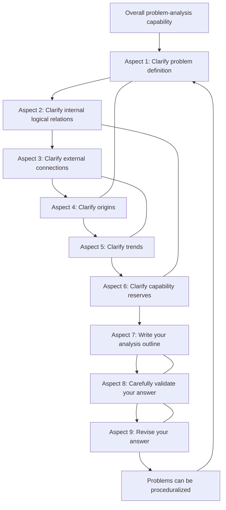
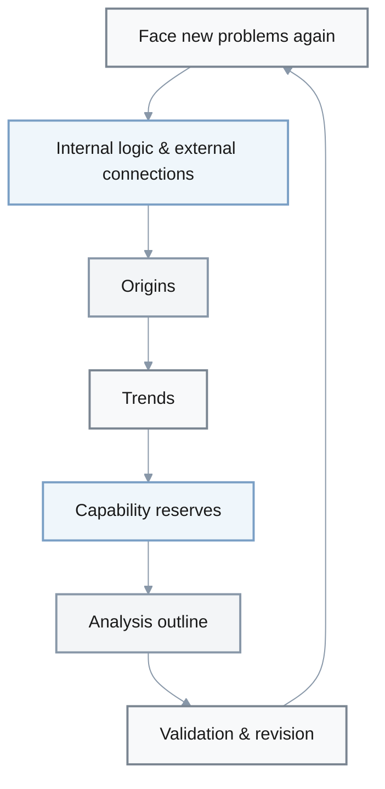

# Nine Aspects for Analyzing Problems

## LLM Prompt Template: Nine-Aspects Problem Analysis

> Usage: Copy only the content of this section **“LLM Prompt Template: Nine-Aspects Problem Analysis”** (from this line down to the end of 【LLM Self-Check Checklist】) into the LLM. First fill in all the fields in the **[Input]** section about the “problem to be analyzed”, then submit the prompt to the LLM to obtain a structured analysis along the nine aspects. In a single turn, this prompt must be **self-consistent, complete, and self-contained**, and must **not** refer to any other file, link, or previous conversation.

You are a “problem analysis consultant” who is good at structured thinking and weighing risk vs. value. You are skilled at using the “nine aspects + one procedure” framework from the book *Nine Aspects for Analyzing Problems* to analyze complex issues.

【Your Task】
- Around the user’s “problem to be analyzed”, perform a systematic analysis from nine aspects.
  - First clarify the problem itself, then analyze structure and trends, examine capabilities and options, and finally give actionable recommendations.
  - Use clear subheadings and bullet points so the output is easy to read and review.
  - For key options and action paths, compare **benefit / cost / risk**, and make clear under which assumptions you recommend or do **not** recommend a given approach.
  - When multiple stakeholders are involved, explicitly state each role’s interests and potential conflicts, and keep the analysis balanced and fair.

【Overall Output Requirements (Aligned with LLM-Friendly Prompting Guidelines)】
- At the beginning, use 1–2 short sections to **restate the context**: core problem, goals and success criteria, key constraints (time / budget / policy, etc.), time window, main stakeholders, and available resources.
- For abstract notions such as “efficiency, risk, satisfaction, quality, benefit, cost”, give **working definitions and ways to measure them** (e.g., concrete metrics, ranges, units), and use verifiable numbers or formula examples whenever possible.
- When presenting complex causal chains, processes, or decompositions, use **comparison tables, step-by-step lists, or simple diagrams** to aid explanation, but keep the nodes concise and avoid huge, unreadable “panoramic” charts.
- In the analysis and recommendations, focus first on the **20% of critical factors** that most affect outcomes, and compress background narrative that contributes little to conclusions. Avoid repeating earlier content.
- Compare at least **two alternative paths or key decision branches** on benefit / cost / risk / applicability conditions, and state clearly under what conditions a given option is **not recommended or should be used with caution**.
- When multiple roles are involved, try to give benefit–loss analysis from at least **two types of key stakeholders** (e.g., customer + team / manager + frontline), and avoid judging purely from a single perspective.
- In the “Summary & Action Recommendations” section, provide 3–7 concrete actions in the format **“who does what by when, measured by which metrics”**, with priority and time window marked so they can be implemented directly.
- If the overall output is long (e.g., more than 5 screens or 2,000 Chinese characters / ~1,000–1,500 English words), automatically generate a short table of contents before the main content, listing sections 1–10 so humans can quickly locate and skim.
- For judgments that rely on experience or external facts, explicitly mark **assumptions and sources of uncertainty**. If you cannot confirm specific data, say that it is an estimate / example, and specify which data / experiments / interviews would be needed to verify it.

【Applicable Scenarios & Priority】
- When the problem satisfies any of the following, use a **deep analysis mode** and provide more detail and quantitative metrics:
- Directly impacts major decisions (e.g., go/no-go, resource / budget allocation, strategic direction).
- Is expected to change core metrics (revenue, cost, quality, satisfaction, safety, etc.) by ≥5%.
- Involves a decision / action window of 1–6 months, not a one-off small task.
- Involves ≥2 types of important stakeholders (e.g., customers + internal teams, upstream + downstream, etc.).
- Is expected to require ≥40 person-hours of work or significant monetary cost.

- Regardless of mode, avoid repeating large chunks of content in different sections; instead, complement from different angles:
- Section 4 focuses on “how the problem formed in the past”, section 5 focuses on “where it may go in the future”.
- Section 6 emphasizes “human / team capabilities and mindset”, section 8 emphasizes “intelligence, data, and samples”.
- Section 7 gives the analysis structure and key judgments, section 10 focuses on distilled conclusions and action lists.

【Input (fill in completely before use to keep the prompt self-contained)】
- Filling principle: use **specific, quantifiable** descriptions (numbers, ratios, time spans, amounts, etc.), and avoid vague expressions like “a lot”, “relatively fast”, “try to reduce”.
- Brief description of the problem to be analyzed: <<Summarize the core problem in one sentence.>>
- Background and current situation: <<Domain / scenario, current approach, existing phenomena or pain points.>>
- Goals and success criteria: <<Desired outcomes and quantifiable metrics (time, cost, quality, satisfaction, etc.). Provide the current baseline and the “minimum acceptable standard / target / ideal value”.>>
- Key constraints and resources: <<Time window, budget, headcount, policy / compliance requirements, tech stack, existing assets or tools, etc.>>
- Stakeholders and roles: <<List main roles (e.g., customers, managers, partner teams, end users, etc.) and their core needs / constraints.>>
- Time scale and impact scope: <<Time span impacted (e.g., 3 months / 1 year / 3 years), systems / businesses / regions affected, and related scale (user counts, amounts, frequency, etc.).>>
- Historical attempts and existing solutions (if any): <<Approaches already tried, major outcomes, and lessons learned.>>
- Known facts, assumptions, and uncertainties: <<What has been reliably verified? What are assumption-based on experience or estimates? Where are the biggest information gaps now?>>

【Output Structure】
Please follow the structure below strictly (keep the titles and numbering; for items marked 【Core】, prioritize depth and quality; for items marked 【Advanced】, expand or simplify based on available time and importance):

1. Problem Definition (Aspect 1, 【Core】)
- 1.1 Problem and contradictions: What is the core contradiction / conflict? Which parties, goals, and constraints are involved?
- 1.2 Goals and conditions: What results are expected? What hard constraints / resource limits / time windows exist?
- 1.3 Extensibility and common structure: From angles such as “one object, many attributes; one attribute, many objects; virtual vs. physical; hard vs. soft; latent vs. visible; positive vs. negative”, how else can this problem be redefined or reframed?

2. Internal Logical Relations (Aspect 2, 【Core】)
- 2.1 Key elements: Which roles, resources, processes, and rules are inside the problem?
- 2.2 Balance and “degree”: Where might “too much of a good thing becomes bad” appear (e.g., speed vs. quality, short term vs. long term)?
- 2.3 Key internal causal chains: Provide 1–2 of the most important internal causal or constraint chains.

3. External Connections (Aspect 3, 【Core】)
- 3.1 Stakeholders: Which upstream, downstream, and side-line external roles are involved? What are their goals and constraints?
- 3.2 Environment and institutions: Which policies, markets, technology, or cultural environments affect this problem?
- 3.3 Responsibility and room to maneuver: Where must you proactively take responsibility? Where should you leave others room, and keep future options open?

4. Origins of the Problem (Aspect 4, 【Advanced】)
- 4.1 Key historical nodes: How did this problem gradually form? Break it into 2–4 key stages.
- 4.2 Background vs. direct causes: Distinguish “deep background factors” from “immediate triggers”. This part focuses on the past formation process; do not yet detail future trends (reserve future evolution for section 5).
- 4.3 Deep structural issues: Which are root problems at the level of institutions, structure, or culture?

5. Problem Trends (Aspect 5, 【Core】)
- 5.1 Current trend judgment: If nothing changes, what result is the problem most likely heading toward?
- 5.2 Early signals and “spots”: Which small signals (data changes, specific cases, complaints, incidents, etc.) foreshadow the future?
- 5.3 Possible scenarios: Use 2–3 scenarios (optimistic / baseline / pessimistic) to summarize how the situation may evolve over the next 6–24 months.

6. Capability Reserves (Aspect 6, 【Advanced】)
- 6.1 Existing capabilities: What are your or your team’s strengths in communication, mindset, strategy, adaptability, experience, etc.?
- 6.2 Capability gaps: Which lacking capabilities are amplifying the problem’s risk? (Highlight “people / team” capabilities and mindset here, and do **not** mix this with the information / data gaps in section 8.)
- 6.3 Capabilities that can be built in the near term: Over the next 1–6 months, which capabilities or resources can you focus on building or borrowing?

7. Analysis Outline (Aspect 7, 【Advanced】)
- 7.1 Structured outline: Using the structure “Background → Problem → Analysis → Options → Risks & Follow-ups”, list top-level and second-level bullet points (only bullet items; no long text here, and do not repeat the detailed action list from section 10).
- 7.2 Key judgments: Mark 3–5 of the most critical judgments or assumptions (these need to be validated later).
- 7.3 Alternative paths: Briefly list 2–3 candidate action paths with a short one-line positioning for each.

8. Validating the Answer (Aspect 8, 【Advanced】)
- 8.1 Potential biases: What stance biases or blind spots may exist in the current analysis?
- 8.2 Required intelligence and feedback: What data, pilots, interviews, or external information are needed to test the key judgments? (Highlight “gaps in information and samples” here, and do **not** repeat the capability gaps from section 6.)
- 8.3 Validation plan: Provide a simple validation plan (e.g., “small experiments + observed metrics”).

9. Revising the Answer (Aspect 9, 【Advanced】)
- 9.1 Parts likely to be revised: Based on the analysis so far, which conclusions are most likely to change once new information arrives?
- 9.2 Incremental adjustment approach: How can you iterate the plan using small-step trials and gradual refinement instead of big-bang changes?
- 9.3 “Better, not perfect” criteria: Provide 2–4 practical criteria for judging that the current plan is “good enough to act on”.

10. Summary & Action Recommendations (【Core】)
- 10.1 Core insights: In 3–5 sentences, summarize the most important findings across the nine aspects, prioritizing the “top 20% key judgments”. Avoid repeating earlier details verbatim.
- 10.2 Near-term action list (0–3 months): List 3–7 executable priority actions. For each, mark the **priority** (e.g., P0 / P1 / P2 or 【Critical】【Important】【Optional】) and include “what to do + who owns it + expected result / metric + target completion date”.
- 10.3 Risks and responses: List 2–4 major risks and corresponding contingencies or mitigation measures, and state each risk’s approximate impact level (High / Medium / Low) and trigger conditions.

【Answer Style Requirements】
- Use concise, rigorous English. Prefer bullet points over flowery adjectives; avoid “empty-template” language.
- Based on problem complexity and time limits, consciously apply the 80/20 rule: make the 【Core】 parts solid first, then expand 【Advanced】 parts as appropriate.
- Keep the structure **MECE (Mutually Exclusive, Collectively Exhaustive)**: sections 1–10 should avoid repeating large chunks of content, but together should cover “what it is, why it happens, what to do, what risks and alternatives exist, and how to implement and validate”.
- Wherever possible, provide **quantifiable metrics and time windows** (e.g., “Within the next 6–12 months, increase metric X from A to B, keeping budget within Y”), so conclusions can be tested and compared.
- Compare at least **two alternative paths or key decision branches**, with pros/cons, preconditions, and risks. Explicitly state “under which conditions this option is not recommended”.
- For all key conclusions and action recommendations, state their **priority and ordering logic** (e.g., 【Critical】【Important】【Optional】 or P0 / P1 / P2) to highlight the 20% of points that drive most of the outcome.
- When comparing options, clearly state **benefits, costs, and major risks**, and point out the “not applicable / not recommended” conditions for each, instead of only listing one-sided advantages.
- In every aspect, tie the analysis to the **concrete problem context** and the 【Input】 information. Avoid copying textbook content or generic templates, and delete background that does not materially help judgment.
- When multiple interests or conflicts exist, explicitly point out the positions and concerns of different stakeholders (customers, team, managers, etc.), and avoid judging purely from a single viewpoint.
- Where uncertainty exists, explicitly state assumptions and sources of uncertainty instead of inventing details. When needed, suggest “data / experiments / interviews that should be conducted” and mark which content is based on experience or estimates.
- For any judgments that require factual support, use the 【Validating the Answer】 section to state which authoritative sources or data are needed, and do **not** fabricate precise data or citations. If specific numbers cannot be confirmed, label them as examples / estimates / hypotheses.

【LLM Self-Check Checklist (Quick Pre/Post Answer Scan)】
- ☐ Have you fully understood and used the background, goals, constraints, and stakeholder information from 【Input】, without relying on “other files / past dialogue” as hidden context? (Self-contained + Context)
- ☐ Have you covered all sections 1–10 in order, with especially solid content for the core parts (1 / 2 / 3 / 5 / 10), and reasonably expanded or briefly handled the advanced parts based on complexity? (MECE + Sufficiency)
- ☐ For key judgments, have you given clear **reasons and assumptions**, and pointed out the main sources of uncertainty, instead of treating estimates as facts? (Logic + Verification)
- ☐ Have you used at least 1–2 **quantitative metrics / success criteria** and clear time windows at key points so that outcomes can be evaluated later? (Precision + Success Criteria)
- ☐ Have you compared at least two different action paths or strategies, explained their respective contexts, benefits, costs, and risks, and stated under what conditions they are not applicable or should be used with caution? (Risk / Value + Fairness)
- ☐ Does the output use clear subheadings, bullet points, and tables when needed, so humans can scan and review it, instead of long unstructured paragraphs? (Structure + Consistency)
- ☐ Have you marked priorities (e.g., 【Critical】【Important】【Optional】 or P0 / P1 / P2) for key conclusions and actions, and explained the ordering logic or trade-offs? (Priority + Significance)
- ☐ Is the content focused on the most important 20% of information, with irrelevant background compressed or removed, and an overall length suitable for reading in limited time? (Concision)
- ☐ For parts that rely on experience or external facts, have you marked assumption sources or uncertainty, and when necessary given “example source types / examples”, avoiding fabricated precise information or citations? (Accuracy + Credibility + Evidence)
- ☐ Have you checked that the reasoning is self-consistent, with no obvious contradictions or leaps in the key causal chains and conclusions? (Logic)
- ☐ Have you provided at least 1–2 **concrete, executable next steps or validation actions** (who does what by when, and which metrics will be used to judge effectiveness), instead of stopping at purely principle-level statements? (Practicality)
- ☐ Have you considered at least two stakeholder perspectives (e.g., customer + team / manager + frontline), and explicitly pointed out possible stance differences and conflicts? (Breadth + Fairness)
- ☐ For judgments needing factual support, have you in the 【Validating the Answer】 section specified the data / experiments / interviews to further verify them, and marked their importance or priority? (Verification + Practicality)

---

## Overview (Original book summary, for human reading; no need to copy into LLM prompts)

*Nine Aspects for Analyzing Problems* proposes a systemic “nine aspects + one procedure” framework for problem analysis. You begin by defining the problem, then in sequence clarify internal logic, external connections, origins, and future trends. Afterwards, you turn back to examine your own capability reserves for solving the problem, learn to organize your thinking into a clear outline, carefully validate your answers, and keep refining them based on feedback, until the entire process becomes procedural and standardized.

The book uses many historical stories, management cases, and life situations to show that “analyzing problems” is not the intuition of a genius, but a learnable, trainable, and transferable methodology. The author especially emphasizes “extensibility” and “common structure”: behind any problem, you can abstract from dimensions such as contradictions, element relations, virtual vs. physical, hard vs. soft, latent vs. visible, positive vs. negative. With these structural views, you can find leverage points and breakthroughs.

The book can be used both as a thinking-training reader for the general audience and as a hands-on framework for managers and knowledge workers. By repeatedly asking themselves the nine aspects and practicing related skills, readers can transform vague, complex, and emotional problems into analyzable tasks that can be decomposed, compared, weighed, and iteratively improved.

The final chapter provides a seven-step “problems can be proceduralized” process, compressing the ideas of the nine chapters into a reusable flow and checklist. This helps readers make more robust and forward-looking judgments in real situations where time is limited and information is incomplete.

## Key Takeaways

- **Problem analysis is a nine-aspect closed loop**: definition → internal logic → external connections → origins → trends → capability reserves → analysis outline → validating answers → revising answers, which are finally proceduralized.
- **A good start is defining the problem**: seeing clearly the contradictions, common structures, goals, and conditions before talking about “solutions” can massively reduce busywork and misjudgment.
- **Use “extensibility” to expand the solution space**: “one object, many attributes”, “one attribute, many objects”, transformation chains, implication relations, and multiple “possibilities” are all tools for breaking out of dead ends.
- **Internal logic emphasizes balance and proportion**: handling internal balances, notions of equality, and “too much of a good thing becomes bad”, so as to avoid single-point extremism and emotional judgments.
- **External connections determine boundaries and consequences**: understanding how to take responsibility, value harmony without blind compromise, and leave others room for maneuver is in fact leaving yourself a way out.
- **Seeing origins and trends is key to grasping the essence**: you need to trace “where the problem came from” and “where it might go”, and use early signals, small events, and “spots” to glimpse overall trends.
- **Build capability reserves before solving problems**: communication, mindset, language and strategy, adaptability, intuitive judgment, etc. are the base toolkit for facing complex issues.
- **Writing a clear analysis outline makes thinking discussable and reviewable**: outlining is the bridge from “it feels like I’ve thought it through” to “I can present this to others and improve it together”.
- **Answers are not one-shot products, but results of continual validation and revision**: with accurate intelligence, feedback loops, and careful use of experience, you can see opportunities in crises and correct direction through mistakes.
- **Proceduralizing the nine aspects makes daily reuse easy**: by turning complex problems into a series of repeatable steps and checkpoints, you reduce pressure in live situations.

### Overview of the Nine Aspects and Corresponding Chapters

| # | Aspect | Core question | Chapter |
|------|------|--------------|---------|
| 1 | Clarify problem definition | What is the problem? How are contradictions, goals, and conditions defined? | Chapter 1 |
| 2 | Clarify internal logical relations | How do internal elements constrain and balance each other? | Chapter 2 |
| 3 | Clarify external connections | How is the problem connected to external roles, systems, and environments? | Chapter 3 |
| 4 | Clarify origins | How did the problem form step by step? What are background vs. direct causes? | Chapter 4 |
| 5 | Clarify trends | From phenomena, early signals, and small events, where is the problem heading? | Chapter 5 |
| 6 | Clarify capability reserves | What communication, mindset, strategy, and adaptability capabilities do you and your team have? | Chapter 6 |
| 7 | Be good at writing an outline | How do you organize the analysis into an outline that can be discussed and reviewed? | Chapter 7 |
| 8 | Carefully validate your answer | How do you use intelligence and feedback to validate conclusions and uncover bias? | Chapter 8 |
| 9 | Revise your answer | After discovering deviations, how do you make small-step corrections and move toward a better answer? | Chapter 9 |

## Content Graph

## Chapter 1 – Aspect 1: Clarify Problem Definition

Clarifying the definition of the problem is the starting point of the entire analysis. This chapter emphasizes that only by simplifying and making the problem explicit—accurately defining contradictions, goals, and conditions—can later analysis, decisions, and actions be effective.

### Defining contradictions: Turning “unsolvable knots” into workable problems

- **What contradictory problems mean**
  - Human progress depends on resolving contradictions. This chapter summarizes everyday and historical cases to show that contradictory problems can be systematically analyzed and dissolved.
  - The key is to see “what is hard to change and what is easy to change”, then reconstruct the problem by transforming attributes, adjusting goals, or introducing intermediary systems.
- **Attribute transformation: Changing “what you weigh” or “what you move”**
  - Classic cases:
    - *Cao Chong weighs an elephant*: The scale’s maximum capacity is hard to change, so he turns “weigh the elephant” into “weigh stones”, resolving the contradiction through object transformation.
    - *Tall cabinet, low doorway*: By laying the cabinet flat, you change its shape attributes and move it through the original doorway height.
    - *Besieging Wei to rescue Zhao*: When you cannot directly “rescue Zhao”, you transform the goal into “besiege Wei”, achieving the original objective by changing the target object.
  - Method points:
    - Treat difficult-to-change conditions as “rigid”, and prioritize finding movable objects or attributes.
    - Allow simultaneous changes across multiple attributes instead of being stuck on a single dimension.
- **Contradictory goals: Letting opposing systems co-exist**
  - In the same context, trying to satisfy both A and B creates opposition and incompatibility.
  - By introducing an intermediary or “bridge”, you can turn opposing systems into co-existing systems:
    - For example, cross-region transportation systems use “bridges” so that, while respecting both sides’ institutions and habits, two systems are connected into a larger one.
- **Objective contradictions: Using human intervention to reshape the situation**
  - Plants need to grow but face pests and diseases; such objective contradictions can be handled by pesticides, predator insects, etc., turning a “contradictory problem” into an “incompatibility problem” or “opposition problem”, and then resolving it further.
  - Conclusion: Contradictory problems are not unsolvable; they require attribute transformation, goal transformation, and system reconfiguration to be redefined.

### Extensible definition of the problem: Expanding possibilities from a single point

- **The concept of extensibility**
  - The book proposes “problem extensibility”, including divergence, inter-problem connections, implication relations, and multiple “possibilities”.
  - By deliberately leveraging extensibility, you can expand the solution space and provide more options for decision-making.
- **Divergence: One object, many attributes; one attribute, many uses**
  - “One object, many attributes”, “one attribute, many objects”, “one attribute, many values”, and “one value, many objects” all reflect divergence.
  - Classic example: *grilled bananas*
    - At first, the bananas burnt by the fire look “ugly” and “defective”.
    - By re-exploiting their attributes (unique taste, exotic flavor, exclusive offering), the flaw turns into a selling point. Named “import-style bananas”, they sell out at a higher price.
  - Point: Fully using an object’s multiple attributes can turn an unfavorable situation into an advantageous one.
- **Inter-problem connections: Using “transmission transformations”**
  - Many quantities depend on one another; changing one attribute value “transmits” along a chain.
  - For example:
    - Raising workers’ wages affects consumption levels and morale, which further influence the enterprise’s overall state.
    - Hiring a famous scholar not only improves academic standards but also leads to more projects and research funding.
    - Changes in clothing fashion (such as miniskirts) transmit into changes in sales of accessories (e.g., pearls).
  - If you leverage positive transmission, you amplify favorable effects; by guarding against negative transmission, you control risks.
- **Implication relations and “flank attacks”**
  - Some event A necessarily implies event B, or B can be used to counter A. A business acquisition case illustrates this:
    - On the surface, company B is acquired, but B had quietly acquired shares of A using the funds, eventually turning the tables and controlling A.
    - By seizing weak links in key implication chains, small players can win over larger ones.
  - Rockefeller’s story: Instead of directly entering upstream oil extraction, he focused on downstream refining and transport, gaining control at a key chokepoint over the entire value chain.
- **Multiple “possibilities”: Combining for more solutions**
  - The book uses examples like machine-tool upgrades, software modularization, and bundled baby products:
    - Adding numeric control systems to ordinary machine tools can approximate CNC capabilities at low cost.
    - Splitting software into multiple modules to be designed by different people, then connected centrally, improves confidentiality and efficiency.
    - The baby phase is short but need-intensive; bundled gift boxes leverage “can be bought together” to increase sales.
  - Core idea: Fully exploit “can be combined this way / that way” possibilities to use limited resources for larger goals.

### Common structures of problems: Four universal properties and four pairs of structural elements

- **Four universal properties**
  - Any problem has:
    - Materiality
    - Systemic nature
    - Dynamism
    - Opposition
  - These together form a problem’s “common foundation”.
- **Virtual vs. physical parts**
  - Physical part: tangible elements, such as walls and floors of a house or an enterprise’s capital, equipment, plants, and staff.
  - Virtual part: intangible elements around the physical part, such as indoor space, product brand image and awareness, technical level, management quality, and reputation.
  - When analyzing problems, pay attention to both the “visible physical part” and the “invisible but equally critical virtual part”.
- **Hard vs. soft parts**
  - Hard part: the system’s constituent elements themselves.
  - Soft part: the relationships and coordination among elements.
  - Using the proverb “three monks have no water to drink”, the chapter illustrates:
    - With the same headcount (hard part), different divisions of labor and collaboration (soft part) lead to completely different outcomes.
    - Machine failures often stem not only from broken components but also from malfunctioning “soft parts” (processes, collaboration, configuration).
- **Latent vs. manifest parts**
  - Manifest part: problems and phenomena already visible on the surface.
  - Latent part: factors still hidden but already germinating, for example:
    - When designing a city’s power grid, one must account for future growth in air-conditioner usage, hotels, and office buildings.
  - Looking only at the manifest part and ignoring the latent part can cause serious consequences later, such as repeated blackouts from surging air-conditioner load in hot summers.
- **Positive vs. negative parts**
  - For the same attribute, beneficial aspects are the positive part; harmful aspects are the negative part.
  - The book stresses:
    - From a profit standpoint, “three-waste” treatment (waste water, waste gas, waste residue) is a negative part; but from a social and environmental standpoint, not handling it creates even greater harms.
    - Welfare departments, kindergartens, and PR units are negative from a short-term profit viewpoint but help image and long-term development—they are “beneficial negatives”.
  - Conclusion: When analyzing positives and negatives, you must ask “relative to what goal?” and “from whose standpoint?”, and make good use of components that are locally harmful but globally beneficial.

#### Quick Reference Table – Four Pairs of Structural Elements

| Structural pair | Core meaning | Typical reminder or example |
|-----------------|-------------|------------------------------|
| Virtual / Physical | Physical parts are tangible elements (capital, equipment, staff, buildings); virtual parts are intangible elements around them (brand, technical level, reputation, etc.). | Analyze both tangible foundations and intangible influence. |
| Hard / Soft | Hard parts are system elements; soft parts are their relationships and mode of collaboration. | The “three monks” story shows that the same hard part with different soft arrangements yields different outcomes. |
| Latent / Manifest | Manifest parts are visible problems and phenomena; latent parts are factors still hidden but already forming. | City power-grid design must consider future air‑conditioner loads, or the city will later suffer frequent blackouts. |
| Positive / Negative | The positive part benefits a given goal; the negative part harms it. | From a profit view, “three-waste” treatment and welfare units are negative, but from long-term development and social responsibility, they may be “beneficial negatives”. |

### Mindsets needed for analyzing problems

- **One effort, many gains**
  - A single activity can serve multiple goals if its structure and content are designed in advance.
  - Example: A consulting firm’s training courses simultaneously promoted its theory, conducted market research, generated material for books, and built long-term client relationships—an exemplar of “one effort, many gains”.
- **“Using others’ resources to do your own work”**
  - Society and nature offer many “usable resources”: not owned by you, but transformable into “available resources” for your benefit.
  - The key is not how much you own, but whether you can integrate scattered usable resources into deployed power, using limited self-owned resources for greater goals.
- **Belief in endless innovation**
  - The book stresses that “nothing is perfect”; any solution is only relatively better.
  - As time and environment change, yesterday’s best solution may become obsolete, so continuous improvement and re-innovation are necessary.
- **Creative thinking throughout**
  - Complex rational analysis depends on creative thinking, which is the “soul” of problem analysis.
  - Creative thinking is not wild fantasy, but grounded in a deep grasp of essential properties and internal relations.

### Defining goals and conditions: Clarifying “what you want” and “under what circumstances”

- **Clear goals are essential**
  - The story of swimming across the strait shows:
    - Physical fatigue and cold matter, but success or failure is often determined by whether the goal can be “seen”.
    - When fog hides the destination, people easily give up halfway; when the goal is clear in mind, they can persist and succeed.
  - For analysts, the clearer the goal, the easier it is to judge outcomes.
- **Clarifying analysis theme and main object**
  - Analysis should not treat all issues equally; it must choose a “primary object of analysis”.
  - The book uses a series of increasingly specific topic examples:
    - From “analyzing how to increase sales” down to “channel-promotion analysis aiming to increase sales of a specific product in a specific region by 50%”.
  - Only after the theme is fully clarified should you move into substantive work.
- **Quantifying and layering goals**
  - Goals can be divided into a top-level goal and several lower-level goals:
    - Single-goal problems: only one top-level goal.
    - Multi-goal problems: multiple top-level goals, with lower-level goals implying the realization of higher-level ones.
  - Through quantification and layering:
    - You can determine “what comes first and what comes later”.
    - You can judge whether options and resource allocations are reasonable.
- **The role of clear goals**
  - Create a positive mindset: give people a “visible shore”.
  - Focus energy and resources: invest limited time and capabilities in truly critical directions.
  - Shift attention from “how much activity we did” to “how much result we achieved”.
  - Provide standards for assessing progress and effectiveness—crucial for evaluating options.
- **Defining conditions and finding the “key problem”**
  - Conditions include resource conditions (internal / external) and environmental conditions (internal / external); some are easy to change, others are hard.
  - In messy reality, the key is to:
    - Distinguish hard constraints that must be met from those that can be adjusted, substituted, or creatively circumvented.
    - Use leverage thinking—“small force moves the big picture”—and prioritize key problems instead of spreading efforts thin.
  - Liu Bei’s “three visits to the thatched cottage” story shows:
    - Amid a chaotic landscape, what he truly lacked was a strategist.
    - Finding Zhuge Liang meant seizing the “key condition” that could change the whole situation.

### Crisis problems: Seeing the “opportunity” in “crisis”

- **Basic definition of crisis**
  - Summarizing scholars and dictionaries, the book defines “crisis” as:
    - Sudden problems that cause or may cause serious damage to organizations, people, assets, or reputation.
    - Often a key moment when a system moves from “normal” to a “major turning point”.
- **Main features of crisis problems**
  - Suddenness:
    - Time, place, and mode of outbreak are often unpredictable with high randomness.
  - Urgency:
    - Once a crisis breaks out, it unleashes huge destructive power in a short time; the window for decision and response is extremely narrow.
  - Destructiveness:
    - Loss is not only in lives and property, but also in social and psychological impacts.
    - The book cites 9/11 as an example of its chain effect on aviation, finance, insurance, tourism, etc.
  - Transmission:
    - Like a stone thrown into water, one crisis triggers ripples of follow-up problems and cross-industry entanglement.
  - Opportunity:
    - Crises contain both seeds of failure and seeds of success.
    - The key is “finding opportunity within danger”: by timely adjustments of layout and strategy, you can control damage and capture turning points.

#### Quick Reference – Features of Crisis Problems

| Feature | Meaning | Reminder when analyzing |
|--------|---------|------------------------|
| Suddenness | Time, place, and form of outbreak are highly random. | Preparedness should cover multiple scenarios, not only a single imagined case. |
| Urgency | Crises release huge destructive power quickly; little time is left for decisions and response. | Pre-design decision authority and action plans to avoid panic in the moment. |
| Destructiveness | Harms not only life and property but also social and psychological states. | Include psychological and societal impacts in assessments, not only direct financial loss. |
| Transmission | Like a stone in water, a crisis triggers chain reactions across industries and systems. | Identify upstream, downstream, and related systems to prevent uncontrolled spread. |
| Opportunity | Crises contain both failure and success seeds. | After controlling loss, actively search for opportunities to adjust structure and optimize layout. |

This chapter lays the logical foundation for the next eight aspects through systematic treatment of contradictions, extensibility, common structures, mindsets, and the definition of goals and conditions.

## Chapter 2 – Aspect 2: Clarify Internal Logical Relations

This chapter shifts the focus from “what the problem is” to “how it operates inside”. It stresses that within any problem, there are balancing, constraining, and hierarchical relations among internal elements. If you fixate on a single factor while ignoring the whole structure, you end up with local optima and overall imbalance.

### Internal balance: Finding the right “degree”

- In any system, there are sets of forces that restrain and complement each other and need dynamic balance.
- Leaning too far to one side (e.g., only speed while ignoring quality, or only short-term profit while ignoring long-term development) leads to “too much of a good thing becomes bad”.
- By analyzing correspondences, ratios, and rhythms among internal quantities, you can see which parts are off-balance and need adjustment.

### Notion of equality and multi-angle thinking

- In handling internal relations, the chapter warns against labeling elements too early—treating some as sacred and others as negligible.
- “Equality” here means letting data and facts speak first during analysis, rather than being led by personal likes, dislikes, or relationships.
- Only by putting all elements “on the same table” at the outset is it easier to spot the truly critical relations that must be addressed first.

### The internal logic of “too much of a good thing becomes bad”

- Through examples from life and management, the book shows:
  - Many problems do not arise from “doing too little”, but from “doing too much”.
  - Over-frugality damages morale; excessive incentives create short-termism.
- When analyzing internal logic, you should identify:
  - Which behaviors have moved from “appropriate” to “excessive”.
  - Which variables, once they cross a threshold, cause sharp changes in quality, relationships, or emotions.

### Practical steps for analyzing internal logic

- Break the problem into internal elements (roles, resources, processes, rules, etc.).
- Map causal chains and conditional relations among them: who influences whom, and who depends on whom.
- Mark key balance points and “too much of a good thing” zones as the basis for later adjustments and decisions.

## Chapter 3 – Aspect 3: Clarify External Connections

If chapter 2 focuses on “how the system works inside”, this chapter looks at “how the system interacts with the outside world”. Through various stories, the author shows that many issues which appear to be internal actually have their roots and solutions in external connections.

### Taking responsibility for the problem

- When facing problems, you should focus first on being responsible for outcomes, not on shirking blame.
- Being responsible means:
  - Actively clarifying which external people and systems the problem is tied to.
  - Taking on the duty of communicating, coordinating, and repairing relationships with these external parties.
- Stories like “Empty City Stratagem” and “Saving the drowning child by breaking water jars” illustrate an attitude of being responsible for results, not just for surface job descriptions.

### Valuing harmony without blind concession

- “Harmony is precious” does not mean compromise on everything or limitless concessions.
- The chapter distinguishes:
  - Principled harmony: seek mutually acceptable solutions as long as core bottom lines are intact.
  - Unprincipled muddling: seeking surface peace while sacrificing long-term interests and fairness.
- Using real and historical examples, the author reminds readers that genuine “harmony” is built on clear interests, responsibilities, and boundaries.

### Leaving others room is leaving room for yourself

- In negotiation, coordination, and collaboration, “leaving the other side a way out” often means keeping room for yourself in the future.
- Not cornering the other party:
  - Reduces retaliation, rupture, and long-term hostility.
  - Keeps the possibility of working together again in a new context.
- The chapter shows that many situations are saved from crisis because someone had left “slack space” in advance.

### External connections from a systems view

- Few problems belong to only one person, one department, or one organization; they are embedded in larger environments and networks.
- Practical questions for analyzing external connections:
  - Which external roles does the problem tug on?
  - Which are upstream conditions (supply, rules, policies) and which are downstream consequences (customers, livelihoods, ecosystems)?
  - Which external links are “hard constraints”, and which can be changed through negotiation or institutional redesign?

## Chapter 4 – Aspect 4: Clarify Origins

This chapter stretches the time axis to focus on the “past life and present life” of the problem: where did it come from, what happens if it is left alone, and at which stage intervention is most appropriate.

### Tracing “where it came from”

- By mapping the historical process, you see how the problem accumulated:
  - Which parts were built up by many small, long-term deviations?
  - Which came from a single key decision or event?
- In tracing, you should distinguish:
  - Background factors vs. immediate triggers.
  - Structural defects vs. random incidents.

### Anticipating “what the result will be”

- The point of analyzing origins is not blame, but to clearly see future paths:
  - If you do nothing, in which direction will the problem deteriorate?
  - If you intervene in different ways, what kinds of chain reactions might each cause?
- The author stresses that only after understanding the “result of inaction” and “costs of intervention” can you make reasonable choices.

### Seeing essence beyond appearances

- Many surface issues (complaints, conflicts, declining performance) are just “symptoms” of deeper problems.
- Through examples, the chapter illustrates:
  - Keep asking “why?” until you reach systems of institutions, structures, or culture, not stopping at individual behavior.
  - Beware of using simplistic labels to prematurely close complex issues.

### The “put everything on the table” principle

- Truly understanding origins often requires putting relevant facts, data, interests, and assumptions “on the table”.
- This is both an analysis habit and a team culture:
  - It reduces misunderstandings and suspicion from information asymmetry.
  - It lets more people judge based on shared information, avoiding “misjudgment in the dark”.

## Chapter 5 – Aspect 5: Clarify Trends

Chapter 5 extends the time axis further into the future, focusing on “where the problem is heading”. The author argues that in an uncertain environment, one of the most important capabilities is using phenomena, early signals, and small changes to judge overall trends.

### Looking through phenomena to see essence

- Phenomena are surface-level; trends and essence are decisive.
- For recurring phenomena, ask:
  - What structural change do they reflect?
  - Is the situation getting better, getting worse, or cycling?

### Using early signals to read trends

- Many major changes appear first as faint “signals”:
  - Sudden clusters of a certain type of complaint.
  - Slow but persistent decline of a product’s sales.
  - A certain type of risk incident becoming frequent in the industry.
- The chapter encourages readers to develop sensitivity to signal:
  - Record and compare time series.
  - Connect scattered signals into trendlines.

### “Do not underestimate small things” and “see the whole from a spot”

- “Small issues” often serve as early warnings of big problems:
  - Minor breakdowns may signal aging equipment.
  - Small frictions may signal hidden issues in organizational structure or incentives.
- The ability to “see the whole from a spot” comes from:
  - Sufficient understanding of systemic structure.
  - Long-term accumulation and comparison of historical experience and current data.

### Delphi method and brainstorming

- The book briefly introduces two common tools for forecasting and idea generation:
  - **Delphi method**: multiple rounds of anonymous expert feedback and aggregation to converge on future judgments.
  - **Brainstorming**: under a “no premature judgment” rule, encouraging many ideas to surface, providing raw material for understanding trends and solutions.
- The author notes:
  - These methods are not magic; what matters is whether the execution respects diverse viewpoints and properly records and processes results.

## Chapter 6 – Aspect 6: Clarify Capability Reserves for Solving Such Problems

The first five chapters focus more on “the problem itself”. From chapter 6 onward, the focus shifts to “the people solving the problem”. The author reminds us that even the best methods cannot land without matching capability reserves.

### Strong communication skills

- Solving complex problems often involves multiple interests and professional backgrounds; poor communication magnifies misunderstanding and conflict.
- This chapter emphasizes:
  - Being able to explain complex issues clearly so people from different backgrounds understand.
  - Listening carefully; others’ words often contain key information.
  - Staying calm, respectful, and clear, even in tense situations.

### Mindset and emotional management

- The bigger the problem and the heavier the pressure, the easier it is for emotion to hijack decisions.
- The author suggests:
  - Treat problems as opportunities for growth and innovation, not purely as threats.
  - Maintain a mindset that is “neither overly optimistic nor overly pessimistic” to stabilize team emotions.

### Language skills and strategic awareness

- Merely “thinking correctly” is not enough; you must also express yourself precisely and strategically:
  - Different audiences and scenarios call for different rhetorical approaches.
  - Pay attention to timing, sequence, and framing so others can accept the plan more easily.
- “Strategy” here is not conspiracy, but the ability to design multi-party win‑win or multi‑win layouts under constraints.

### Adaptability and intuitive use

- In reality, “plans can’t keep up with change”:
  - On-site information is incomplete.
  - Sudden events disrupt original plans.
- The chapter encourages cultivating:
  - Flexibility to adjust paths while holding principles steady.
  - Moderate trust in your intuition, as long as it rests on repeated training and accumulated experience.

## Chapter 7 – Aspect 7: Be Good at Writing Your Problem Outline

This chapter moves from “thinking” to “expression and presentation”. The author believes that only when the analysis is written into a structured outline does problem analysis truly become discussable, reviewable, and transferable.

### The role of an outline

- Organize scattered thoughts into a logical framework: background → problem → analysis → options → risks and follow-ups.
- While writing, you can re-check:
  - Whether the reasoning chain is complete.
  - Whether any conditions or counterexamples are missing.
  - Whether conclusions truly rest on prior analysis.

### Writing clear levels and priorities

- The chapter stresses the “layered” nature of outlines:
  - First list a few top-level headings that map to key links among the nine aspects.
  - Under each heading, present bullet-point key messages.
- At the same time, highlight priorities:
  - Mark which judgments are pivotal support points for the entire analysis.
  - Compress less critical details or place them in appendices.

### Training from “being able to think” to “being able to write”

- Through “capability training” sections, the book reminds readers:
  - Start by outlining small issues, such as a retrospective on a minor activity.
  - Gradually extend this to important projects and decisions at work.
- The goal is to form a habit:
  - When facing larger problems, first write an analysis outline, then enter detailed execution and communication.

## Chapter 8 – Aspect 8: Carefully Validate Your Answer

The first seven chapters help readers build a relatively complete analysis framework, but any answer derived from analysis needs validation. This chapter is about scrutinizing your conclusions and avoiding overconfidence.

### Know yourself to know others

- Citing “know yourself and know your enemy, and you will never be defeated”, the author stresses that before validating answers, you must understand yourself:
  - What are your own positions, interests, and preferences?
  - In which aspects are you prone to optimism or pessimism?
- Only after recognizing your own biases can you more objectively interpret external information and others’ feedback.

### Using feedback

- The real world keeps sending us feedback on decisions:
  - Changes in indicators and data.
  - Reactions from stakeholders.
  - Subtle shifts in markets or environments.
- The chapter emphasizes:
  - Proactively designing feedback channels instead of passively waiting.
  - Treat negative feedback as a chance to revise answers, not as a threat.

### Accurate intelligence is key to validation

- “Intelligence” is not only secret information; it also includes:
  - Frontline experience.
  - Real reactions from users and customers.
  - Public data about industries and environments.
- The author reminds us to:
  - Be wary of one-sided information, filtered information, and heavily biased “second-hand interpretations”.
  - Cross-check important judgments using multiple sources whenever possible.

### Case analysis and training

- The book uses the case “Why a beverage company took a reckless gamble” to demonstrate:
  - How making bold decisions without sufficient validation and intelligence can lead to serious consequences.
  - How properly designed tests, pilots, and feedback mechanisms could have significantly reduced risk.
- In the training section, readers are encouraged to:
  - Choose a real decision and draw a “validation path”: which data, which feedback, and which observation points are needed.

## Chapter 9 – Aspect 9: Revise Your Answer

After validation, you often find that your original answer is imperfect or even wrong in places. This chapter focuses on how to revise answers methodically without falling into total denial or paralysis.

### Experience can revise, but not replace thinking

- Experience is precious but limited:
  - It comes from the past, while problems happen in an evolving present and future.
- The author cautions:
  - Do not treat experience as “iron law”; treat it as “reference samples”.
  - When validation shows that experience no longer applies, have the courage to adjust your judgments.

### Rapid feedback to revise answers

- The key to revising answers is shortening the time from “discovering a problem” to “implementing changes”.
- The chapter encourages:
  - Once a deviation is found, quickly design and run small experiments.
  - Use phased adjustments rather than a single big turnaround to lower the risk of correction.

### Moving in the right direction, not chasing perfection

- In complex systems, it is very hard to find a “perfect answer” at once; realistically, you aim to move steadily toward “better”.
- Thus, the criteria for revision are:
  - Is the new direction closer to the goal, more in line with facts, and easier to execute?
  - Does it better balance the legitimate interests of more stakeholders?
- In the capability training, readers are guided to treat “revision” as normal rather than as failure.

## Chapter 10 – Problems Can Be Proceduralized

The final chapter compresses the previous nine aspects into a “problem analysis procedure”, showing that:

- Problems need not be handled only by gut feeling or inspiration.
- A complete problem-analysis flow can be summarized, encoded, and reused.

### Core idea of the seven-step procedure

The book proposes several “procedures”, roughly corresponding to:

1. **Clarify the definition first**: return to chapter 1 to clarify contradictions, common attributes, goals, and conditions.
2. **Clarify internal logic and external connections**: chapters 2 and 3—look both at internal structures and external environments and interest networks.
3. **Clarify origins**: chapter 4—trace how the problem formed and differentiate background from direct causes.
4. **Clarify trends**: chapter 5—use phenomena, early signals, and small events to infer future directions.
5. **Clarify capability reserves**: chapter 6—check whether your and your team’s communication, mindset, and strategy capabilities are ready.
6. **Write the analysis outline**: chapter 7—organize your thinking into a structure that can be discussed.
7. **Validate and revise answers**: chapters 8 and 9—use intelligence and feedback to continuously adjust judgments.

| Step | Key question | Chapter |
|------|--------------|---------|
| 1 Clarify definition | What are the contradiction structure, common attributes, and goal/condition set of the current problem? | Chapter 1 |
| 2 Internal logic & external connections | How does the system work internally, and what external environments and interest networks is it linked to? | Chapters 2 & 3 |
| 3 Clarify origins | How did the problem accumulate step by step? What are background vs. direct causes? | Chapter 4 |
| 4 Clarify trends | What future directions do phenomena, early signals, and “small matters” point to? | Chapter 5 |
| 5 Capability reserves | Are your and your team’s capabilities, mindset, and resources ready to face this kind of problem? | Chapter 6 |
| 6 Write the analysis outline | Can you organize your thinking into a clear outline for discussion and review? | Chapter 7 |
| 7 Validate and revise | How do you use intelligence and feedback to keep validating, updating, and revising answers? | Chapters 8 & 9 |

### Turning the procedure into personal and team habit

- The author suggests:
  - Turning these seven steps into a personal “problem-analysis checklist”.
  - Before and during important problems, check each item to see whether you have overlooked any aspect.
- For teams:
  - Use these steps as a discussion framework in regular meetings, retrospectives, and before/after major decisions.
  - Over time, this builds a culture of “structural problem analysis”.

Through this chapter, the book moves from “knowledge and cases” to “procedures and habits”. If readers can internalize this procedure into daily thinking, they will truly grasp the essence of *Nine Aspects for Analyzing Problems*.
