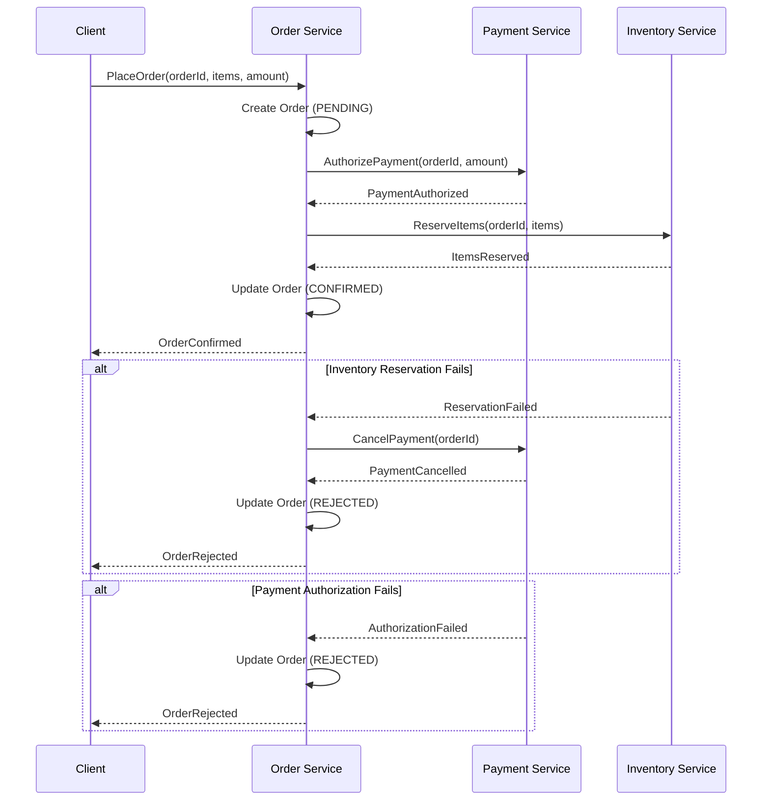

# Interview Q&A - Software Architecture for Development Guidance

> **Optimization Note**: This prompt has been optimized using guidelines from `Guidelines_for_LLM-Friendly_Prompts.md` to enhance clarity, precision, structure, and effectiveness. Key improvements include: explicit success criteria, MECE framework validation, quantitative metrics, balanced perspectives, comprehensive validation protocol, and detailed execution instructions.

## Purpose

Generate 25-30 high-quality Q&A pairs for senior/architect/expert roles that bridge architecture patterns with implementation code. The output must demonstrate practical mastery of translating architectural decisions into production-ready code.

## Context and Constraints

### Scope and Boundaries
- **Target Audience**: Senior developers, software architects, and technical experts
- **Primary Goal**: Bridge architecture theory with implementation practice through explicit pattern-to-code tracing
- **Coverage**: All 6 dimensions required (structural, behavioral, quality, data, integration, evolution)
- **Exclusions**: Avoid generic definitions, recall-only questions, and trivial implementation details

### Output Requirements
- **Format**: Markdown with clickable TOC, Mermaid diagrams, idiomatic code snippets, and comprehensive references
- **Quality Standard**: Production-ready, citable, measurable, actionable content
- **Success Criteria**: All 19 validation checks achieve PASS status (see Pre-Submission Validation)

---

# Part I: Specifications

## Specifications

### Scope and Structure

**Question Count**: 25-30 Q&A pairs total (precise target eliminates ambiguity)
- **Difficulty Distribution**: 20% Foundational (5-6 Q&As) / 40% Intermediate (10-12 Q&As) / 40% Advanced (10-12 Q&As)
- **Rationale**: Mirrors real-world senior/architect interview distribution where ~80% of questions test pattern application, trade-off analysis, and context-sensitive decisions rather than basic recall
- **Constraint**: Total must fall within 25-30 range; distributions allow ±5% tolerance

**Answer Requirements** (all mandatory):
- **Length**: 150-300 words (measured excluding code blocks; ensures depth without verbosity)
- **Required Components**: 
  1. Architecture pattern selection with justification
  2. Design rationale linking requirements to pattern choice
  3. Implementation code demonstrating pattern application
  4. Quality trade-offs with quantitative impact where possible
- **Evidence**: Minimum 1 citation [Ref: ID] per answer; 2+ for complex/controversial/performance-critical topics
- **Clarity**: Define technical terms on first use; maintain consistent terminology throughout answer

**Per Topic Cluster** (all 4 required for each of 5-6 clusters):
- ≥1 diagram (Mermaid format only; select type based on Analysis Type table; include caption)
- ≥1 code example (idiomatic, language-tagged with ```language; 10-30 lines; production-ready)
- ≥1 comparison table (alternatives, trade-offs, or metrics; markdown format with clear headers)
- ≥1 measurable metric with formula (define variables; state target value; use standard notation)

### Content Principles

**MECE Framework** (Mutually Exclusive, Collectively Exhaustive - ensures complete, non-overlapping coverage):
- **6 Required Dimensions**: 
  1. Structural (components, dependencies, modularity)
  2. Behavioral (communication, events, state)
  3. Quality (performance, scalability, reliability, security, maintainability)
  4. Data (persistence, caching, consistency)
  5. Integration (APIs, messaging, synchronization)
  6. Evolution (refactoring, migration, modernization)
- **Coverage Requirement**: Each dimension receives 4-6 Q&As; all 6 dimensions must be represented
- **Validation**: No topic should span multiple dimensions (mutually exclusive); union of all topics covers complete architecture scope (collectively exhaustive)
- **Rationale**: Prevents gaps in coverage and duplicate/overlapping questions

**Analysis Depth** (demonstrates expert-level thinking):
- **Pattern Selection**: Explain *why* a pattern fits using explicit reasoning chain: requirements → constraints → alternatives evaluation → pattern choice → justification
- **Quality Trade-offs**: State what you gain vs. sacrifice with quantitative impact where possible (e.g., "CQRS improves read scalability by 10x but adds 20-40ms write latency and increases codebase complexity by ~30%")
- **Context Sensitivity**: Specify when patterns apply vs. anti-patterns using concrete criteria (team size <10 vs. >50, throughput <100 vs. >10,000 rps, data volume <1TB vs. >100TB)
- **Architecture-to-Code Mapping**: Trace every architectural decision to concrete implementation with explicit line: pattern principle → design element → code construct → quality metric
- **Avoid**: Generic statements ("microservices are complex"), context-free recommendations ("always use CQRS"), unjustified choices

**Balanced Perspective** (avoids bias, presents multiple viewpoints):
- **Alternatives**: Present ≥2 viable options with comparative analysis (not just "best practice"); explain when each applies
- **Consensus vs. Debate**: 
  - Flag industry consensus with [Consensus] tag (e.g., "[Consensus] 12-factor app principles")
  - Flag context-dependent choices with [Context-dependent] tag (e.g., "[Context-dependent] Microservices vs. Modular Monolith")
  - Flag emerging/debated topics with [Emerging] or [Debated] tags
- **Trade-offs**: Make costs explicit with concrete examples ("Consistency vs. Availability: CP systems guarantee correctness but may reject writes during partition; AP systems remain available but risk stale reads")
- **Limitations**: Acknowledge anti-patterns, edge cases, and scenarios where pattern creates more problems than it solves
- **Assumptions**: Explicitly state all underlying assumptions (e.g., "Assumes: stateless services, horizontal scalability, eventual consistency acceptable, team familiar with event-driven patterns")
- **Counterarguments**: Present opposing views or alternative schools of thought where applicable

**Clarity Standards** (ensures understandable, precise communication):
- **Terminology Consistency**: 
  - Define all technical terms on first use (e.g., "CQRS (Command Query Responsibility Segregation)")
  - Maintain consistent terminology throughout (if you use "aggregate root", don't switch to "aggregate entity")
  - Add definitions to Glossary for complex/domain-specific terms
- **Precision Over Vagueness**: 
  - ✅ Use: "<300ms p95 latency", "≥99.5% availability", "10,000 requests/second"
  - ❌ Avoid: "fast response", "highly available", "handles many requests"
- **Measurable Criteria**: Provide concrete thresholds, formulas, and success metrics
- **Traceability**: Every pattern → principle → code → metric chain must be explicit and verifiable
- **Avoid Jargon**: Minimize unnecessary acronyms; expand on first use; prioritize clarity over brevity

### Topic Dimensions (MECE coverage required)

**Note**: This section defines the 6 mutually exclusive dimensions that collectively exhaust the architecture space.

- **Structural**: Components, dependencies, modularity, coupling/cohesion, layering, boundaries
- **Behavioral**: Communication patterns, data flow, events, state management, error handling, orchestration
- **Quality**: Performance, scalability, reliability, availability, security, maintainability, testability, observability
- **Data**: Persistence, caching, consistency models, transactions, replication, partitioning
- **Integration**: APIs, messaging, synchronization, service communication, external systems
- **Evolution**: Refactoring, migration, modernization, legacy systems, technical debt, versioning

**Coverage Validation**: Each Q&A must map to exactly one primary dimension; all 6 dimensions must receive 4-6 Q&As.

### Visual Element Standards

**Requirements**: Diagram + code + table + metric per topic cluster

#### Diagram Selection by Analysis Type

| Analysis Type | Primary Diagram | Standard | Code + Metrics |
|---------------|-----------------|----------|----------------|
| **Structural Patterns** | Class diagram, Component diagram | UML, C4 | Code snippet + `Cohesion = Related Methods / Total Methods` |
| **Behavioral Design** | Sequence diagram, State machine | UML | Event flow code + `Latency = Response Time - Processing Time` |
| **Quality Attributes** | Deployment diagram, Performance model | UML, Custom | Config code + `Throughput = Requests / Time`, `Error Rate = Errors / Total × 100%` |
| **Data Management** | ERD, Data flow diagram | ERD, DFD | Repository code + `Query Performance = Execution Time / Data Size` |
| **Integration** | Sequence diagram, API diagram | UML, OpenAPI | API code + `Response Time = Latency + Processing + Network` |
| **Evolution** | Migration diagram, Refactoring roadmap | Custom | Migration code + `Migration Risk = Changed LOC / Total LOC × Complexity` |

**Standards**: BPMN (process), DMN (decision), UML (structure/behavior), ArchiMate (enterprise), ERD/DFD (data), C4 (software)

#### Architecture Patterns

- **Hexagonal**: Core isolation → dependency inversion
- **Event-Driven**: Async → loose coupling → scalability
- **CQRS**: Read/write separation → performance
- **Microservices**: Decomposition → independent deployment
- **Layered**: Separation of concerns → maintainability
- **DDD**: Bounded contexts → aggregates

#### Visual Quality Standards

**Diagrams**: Mermaid only (GitHub-native)
**Code**: Idiomatic snippets (Go, Java, Python, TypeScript) with language tags
**Math**: Inline `$x$` or block `$$x$$`; define variables on first use
**Symbols**: ∑ (sum), ∏ (product), ∫ (integral), ∂ (rate), ≈ (approx), ≤/≥ (bounds)
**Legends**: 💡 Analogy, 📐 Formula, 🔍 Example, ⚠️ Note, 💻 Code
**Avoid**: Mega-diagrams, BPMN for code, mixed abstraction, >120 nodes, missing rationale

**Combinations**:
- **Full Doc**: Use Case → Class/Component → Sequence/Activity → Deployment
- **Process**: BPMN → DMN → ERD → Integration
- **Enterprise**: Strategy → Current → Target → Migration (ArchiMate)

**Quick Reference – Diagram & Code Guide**
| Need | Recommended Diagram(s) | Code Example | Standard |
|------|------------------------|--------------|----------|
| API design | Class + Sequence | Interface/Controller code | UML + OpenAPI |
| Event handling | Sequence + State machine | Event publisher/subscriber | UML |
| Data access | ERD + Class diagram | Repository pattern code | ERD + UML |
| Service communication | Sequence + Component | HTTP/gRPC client code | UML |
| State management | State machine + Class | State pattern implementation | UML |
| System structure | Component + Deployment | Module/package structure | UML + C4 |
| Performance optimization | Deployment + Flow | Caching/pooling code | Custom |

### Architecture Decision Matrices

**Pattern Selection Matrix** (choose architecture pattern based on requirements):
| Requirement | Modular Monolith | Microservices | Event‑Driven | Serverless |
|-------------|------------------|---------------|----------------|------------|
| Team Size | 1‑10 | 10+ | 5+ | 1‑5 |
| Deployment Frequency | Weekly | Daily/Continuous | Daily/Continuous | On‑demand |
| Scalability Needs | Moderate | High | High | Very High |
| Complexity Tolerance | Low‑Medium | High | High | Low |
| Operational Overhead | Low | High | Medium | Very Low |

**Quality Attribute Trade‑Off Matrix** (prioritize based on system requirements):
| Priority | Performance | Scalability | Reliability | Maintainability | Security |
|----------|-------------|-------------|-------------|-----------------|----------|
| **High‑Traffic System** | Critical | Critical | High | Medium | High |
| **Enterprise Application** | Medium | Medium | Critical | Critical | Critical |
| **Startup MVP** | Medium | Medium | Medium | Critical | High |
| **Real‑Time System** | Critical | High | Critical | Medium | High |
| **Data‑Intensive** | High | Critical | High | Medium | Critical |

### Citation Standards

**Source Credibility**:
- **Authoritative**: Prioritize peer-reviewed papers, industry-recognized books (Fowler, Evans, Richardson), official documentation
- **Avoid**: Unverified blog posts, outdated tutorials, marketing materials
- **Recency**: ≥50% sources from last 3 years; ≥70% for cloud/container/serverless topics
- **Cross-Reference**: Validate claims across multiple independent sources

**Language Distribution**:
- **Target**: 60% English / 30% Chinese / 10% other languages
- **Tagging**: Use [EN], [ZH], [JA], etc. on every citation
- **Rationale**: Reflects global software architecture literature distribution

**Source Categories** (minimum coverage):
1. **Patterns & Principles** (≥3 sources): Foundational architecture knowledge
2. **Performance & Scalability** (≥2 sources): Empirical data, benchmarks
3. **Case Studies** (≥2 sources): Real-world implementations at scale
4. **Frameworks & Tools** (≥2 sources): Practical implementation guidance

**Citation Format** (ensures credibility and traceability):
- **Style**: APA 7th Edition (author, year, title, publisher/journal)
- **Inline References**: Insert [Ref: ID] immediately after:
  - Factual claims requiring evidence
  - Pattern names or architectural concepts
  - Trade-off statements or performance metrics
  - Controversial or non-obvious assertions
- **Resolution**: Every inline [Ref: ID] must resolve to unique entry in References section; broken references fail validation
- **Uncertainty Flags**: 
  - [Consensus] = Industry-wide agreement (e.g., CAP theorem)
  - [Context-dependent] = Varies by situation (e.g., sync vs. async)
  - [Debated] = Active disagreement in community
  - [Emerging] = Recent development, limited long-term data
- **Avoid**: Unsubstantiated claims, "common knowledge" assertions without citations for non-trivial facts

### Reference Minimums

| Section | Min | Content |
|---------|-----|---------|
| Glossary | ≥10 | Hexagonal, CQRS, Event Sourcing, DDD, Bounded Context, Aggregate, Repository, Domain Event, Saga, Circuit Breaker, Service Mesh, API Gateway, Sidecar, Strangler Fig |
| Tools | ≥5 | Visualization (Mermaid), docs (Confluence, MkDocs), codegen (OpenAPI), observability (Prometheus, Grafana), testing (JMeter, k6) |
| Literature | ≥6 | Patterns (Fowler, Richards), DDD (Evans, Vernon), microservices (Richardson, Newman), distributed (Kleppmann), performance (Gregg) |
| Citations | ≥12 | 60% EN / 30% ZH / 10% other (APA 7th + tags) |

**If unmet**: State shortfall + rationale + plan.

### Usage Instructions (step-by-step execution guide)

**Execution Order** (sequential; complete each before proceeding):

1. **Apply MECE Structure**: 
   - Select 5-6 topic clusters covering all 6 dimensions (Structural, Behavioral, Quality, Data, Integration, Evolution)
   - Allocate 4-6 Q&As per cluster (total: 25-30)
   - Verify no dimension missing; no overlaps between clusters

2. **Validate Difficulty Distribution**:
   - Foundational: 20% (5-6 Q&As) - core concepts, basic patterns, standard implementations
   - Intermediate: 40% (10-12 Q&As) - pattern application, trade-off analysis, common scenarios
   - Advanced: 40% (10-12 Q&As) - complex systems, strategic decisions, optimization, edge cases

3. **Meet Reference Minimums**:
   - Glossary ≥10 | Tools ≥5 | Literature ≥6 | APA Citations ≥12
   - Language distribution: 60% EN / 30% ZH / 10% other (±10% tolerance)

4. **Ensure Per-Cluster Coverage** (validate after completing each cluster):
   - ≥1 diagram (Mermaid; type matches analysis from Diagram Selection table)
   - ≥1 code example (idiomatic; 10-30 lines; language-tagged)
   - ≥1 comparison table (markdown; clear headers)
   - ≥1 metric (formula + defined variables + target value)

5. **Validate Per-Topic Quality**:
   - Each topic: ≥2 authoritative sources cited in answers
   - Each topic: ≥1 tool referenced (visualization, testing, observability, etc.)

6. **Execute Pre-Submission Validation**:
   - Run all 19 validation checks (see Pre-Submission Validation section)
   - Document results in Validation Report table
   - If ANY check fails: STOP, fix root cause, re-run all checks
   - Proceed only when 19/19 checks show PASS

7. **Document Gaps + Remediation**:
   - If any minimum unmet or validation failed: document specific gap
   - Provide remediation plan with concrete actions
   - Re-validate after fixes applied

**Success Criteria**: All minimums exceeded AND all 19 validation checks PASS AND Validation Report shows 100% compliance.

### Quality Gates (comprehensive validation criteria)

**Source Quality Standards**:

| Criterion | Requirement | Measurement | Rationale |
|-----------|-------------|-------------|-----------||
| **Recency** | ≥50% published within last 3 years<br>≥70% for cloud/container/DevOps/serverless topics | Count sources by publication date; calculate percentage | Architecture practices evolve rapidly; recent sources reflect current industry standards |
| **Diversity** | ≥3 source types (books, papers, docs, case studies, official specs)<br>No single source >25% of total citations | Categorize each source; count by type; calculate max percentage | Prevents over-reliance on single perspective; validates claims across multiple authorities |
| **Credibility** | Prioritize: peer-reviewed papers, industry-recognized books (Fowler, Evans, Richardson, Kleppmann), official documentation, reputable conference proceedings<br>Avoid: unverified blogs, marketing materials, outdated tutorials, unattributed claims | Qualitative assessment of each source's authority and reputation | Ensures technical accuracy and industry acceptance |
| **Evidence Coverage** | ≥70% of Q&As have ≥1 citation<br>≥30% of Q&As have ≥2 citations | Count citations per Q&A; calculate percentages | Complex/controversial topics require multiple corroborating sources |
| **Tool Currency** | Tools actively maintained (last update ≤18 months)<br>Include: pricing model, adoption statistics, integration ecosystem | Check official repos/sites for last commit/release date | Outdated tools mislead candidates; active maintenance indicates production viability |

**Link Integrity Standards**:
- **Accessibility**: All URLs must resolve (HTTP 200); prefer DOIs for academic papers; use archive.org for permanence
- **Cross-Reference Completeness**: Every inline [Ref: ID] must resolve to exactly one entry in References section (1:1 mapping)
- **Validation Process**: Test all links programmatically or manually before submission; broken link = automatic FAIL

**Accuracy Validation Standards**:
- **Factual Correctness**: Cross-check all technical claims across ≥2 independent authoritative sources
- **Code Validity**: All code snippets must be syntactically correct, compile/parse without errors, follow language idioms, include necessary imports
- **Metric Accuracy**: All formulas mathematically sound; variables defined; units specified; industry-standard notation used

**Scaling Rule**: For >30 Q&As, multiply all minimums by 1.5× (e.g., Glossary: ≥15, Tools: ≥7-8, Literature: ≥9, Citations: ≥18)

### Pre-Submission Validation (mandatory quality checklist)

**Execution Protocol**: 
1. Execute ALL steps below sequentially
2. Present results in Validation Report table (see template)
3. If ANY check fails: STOP immediately, document failure, fix root cause, re-run COMPLETE validation from step 1
4. Proceed to submission ONLY when all 19 checks show PASS status

**Validation Checks** (all required):

**1. Reference Counts** (exact minimums):
- [ ] Glossary ≥10 terms
- [ ] Tools ≥5 tools with details (URL, update date, pricing, adoption)
- [ ] Literature ≥6 authoritative sources
- [ ] APA Citations ≥12 formatted references
- [ ] Q&As: 25-30 total with difficulty distribution: 20% Foundational / 40% Intermediate / 40% Advanced (±5% tolerance)

**2. Citation Coverage** (evidence density):
- [ ] ≥70% of Q&As have ≥1 citation
- [ ] ≥30% of Q&As have ≥2+ citations

**3. Language Distribution** (source diversity):
- [ ] English (EN): 50-70%
- [ ] Chinese (ZH): 20-40%
- [ ] Other languages: 5-15%

**4. Source Recency** (current knowledge):
- [ ] ≥50% of sources published within last 3 years
- [ ] ≥70% for cloud/container/serverless/DevOps topics

**5. Source Diversity** (balanced perspectives):
- [ ] ≥3 source types present (books, papers, docs, case studies)
- [ ] No single source exceeds 25% of total citations

**6. Link Integrity** (accessibility):
- [ ] All URLs accessible (HTTP 200 or valid DOI)
- [ ] Links archived where appropriate (archive.org)

**7. Cross-Reference Resolution** (internal consistency):
- [ ] 100% of inline [Ref: ID] citations resolve to References section
- [ ] No orphaned references (defined but never cited)
- [ ] No missing references (cited but not defined)

**8. Word Count Compliance** (answer depth):
- [ ] Sample 5 random answers: all fall within 150-300 words (excluding code blocks)
- [ ] No answer <150 words (insufficient depth)
- [ ] No answer >300 words (excessive verbosity)

**9. Key Insights Quality** (actionable takeaways):
- [ ] All Q&As include concrete, specific key insight
- [ ] Insights quantitative where possible ("20-40ms overhead", "10x scalability improvement")
- [ ] No vague insights ("microservices are complex" ❌; "microservices add 30% operational overhead but enable 5x faster deployment" ✅)

**10. Per-Topic Minimums** (resource depth):
- [ ] Each topic cluster references ≥2 authoritative sources
- [ ] Each topic cluster references ≥1 tool

**11. Architecture-to-Code Mapping** (practical demonstration):
- [ ] ≥80% of answers trace explicit path: architectural pattern → design decision → code implementation → quality metric
- [ ] Code snippets demonstrate pattern application (not generic boilerplate)

**12. Question Type Ratio** (judgment vs. recall):
- [ ] ≥70% of questions are judgment-based ("How would you...", "When should...", "Compare X vs. Y for scenario Z")
- [ ] ≤30% may be foundational/recall for basic concepts

**13. Visual Coverage** (complete artifacts per cluster):
- [ ] ≥90% of topic clusters include all 4 elements: diagram + code + table + metric
- [ ] Diagrams render correctly in Mermaid
- [ ] Tables formatted properly in markdown

**14. Pattern Application** (architecture focus):
- [ ] ≥80% of answers apply relevant architecture patterns (Hexagonal, CQRS, Event-Driven, DDD, Saga, etc.)
- [ ] Pattern selection justified with context and constraints

**15. Performance Analysis** (measurable quality):
- [ ] ≥60% of answers include metrics/formulas
- [ ] Formulas mathematically valid with defined variables
- [ ] Target values specified where applicable

**16. Code Quality** (production-ready examples):
- [ ] ≥80% of answers include code snippets
- [ ] All code idiomatic for chosen language
- [ ] All code syntactically correct (compiles/parses)
- [ ] All code blocks tagged with language (```typescript, ```java, etc.)

**17. Code Syntax** (correctness):
- [ ] Manual or automated syntax check on all code snippets
- [ ] 100% pass rate (no syntax errors)

**18. Formula Validity** (mathematical soundness):
- [ ] All formulas use correct notation
- [ ] All variables defined on first use
- [ ] All formulas align with industry standards

**19. Self-Review** (final quality check):
- [ ] **Clarity**: Questions unambiguous; answers logically structured; terminology consistent
- [ ] **Accuracy**: Claims verifiable; code correct; formulas valid; URLs accessible
- [ ] **Completeness**: All 6 dimensions covered; all minimums met; all validation checks passed
- [ ] **Balance**: Multiple perspectives presented; trade-offs explicit; limitations acknowledged; assumptions stated

**Validation Report Template** (fill after executing all checks):

```markdown
| Validation Check | Result | Status |
|------------------|--------|--------|
| Reference counts | G:__ (≥10), T:__ (≥5), L:__ (≥6), A:__ (≥12), Q:__ (25-30) [F:__ I:__ A:__] | PASS/FAIL |
| Citation coverage | __% have ≥1, __% have ≥2 (targets: ≥70%, ≥30%) | PASS/FAIL |
| Language distribution | EN:__% ZH:__% Other:__% (target: 60%/30%/10% ±10%) | PASS/FAIL |
| Source recency | __% last 3yr, __% cloud topics (targets: ≥50%, ≥70%) | PASS/FAIL |
| Source diversity | __ types, max __% single (targets: ≥3, <25%) | PASS/FAIL |
| Link integrity | __/__ URLs accessible | PASS/FAIL |
| Cross-ref resolution | __/__ [Ref: ID] resolved, __ orphaned, __ missing | PASS/FAIL |
| Word counts | __/5 sampled in range (150-300 words) | PASS/FAIL |
| Key insights | __/__ concrete and quantitative | PASS/FAIL |
| Per-topic minimums | __/__ topics meet ≥2 sources + ≥1 tool | PASS/FAIL |
| Arch-code mapping | __/__ (__%) explicit (target: ≥80%) | PASS/FAIL |
| Question types | __% judgment ("How/When") (target: ≥70%) | PASS/FAIL |
| Visual coverage | __/__ (__%) clusters complete (target: ≥90%) | PASS/FAIL |
| Pattern application | __/__ (__%) apply patterns (target: ≥80%) | PASS/FAIL |
| Performance analysis | __/__ (__%) include metrics (target: ≥60%) | PASS/FAIL |
| Code quality | __/__ (__%) include snippets (target: ≥80%) | PASS/FAIL |
| Code syntax | __/__ snippets valid (target: 100%) | PASS/FAIL |
| Formula validity | __/__ formulas valid (target: 100%) | PASS/FAIL |
| Self-review | Clarity/Accuracy/Completeness/Balance verified | PASS/FAIL |
| **OVERALL STATUS** | **__/19 PASS** | **PASS/FAIL** |
```

**MANDATORY GATE (failure protocol)**:
- **Stop Condition**: ANY single check shows FAIL status → STOP immediately
- **Documentation**: Record specific failure (e.g., "Citation coverage: 65% have ≥1 (target: 70%)")
- **Root Cause Analysis**: Identify why check failed (insufficient citations, missing sources, broken links, etc.)
- **Remediation**: Apply fixes (add citations, update references, fix links, revise content)
- **Re-validation**: Re-run COMPLETE validation from check #1 (not just failed check)
- **Iteration**: Repeat validate → fix → validate cycle until 19/19 PASS achieved
- **Proceed Condition**: ALL 19 checks must show PASS status before final submission
- **No Exceptions**: Partial pass (e.g., 18/19) is automatic FAIL; must achieve 100% pass rate

### Submission Checklist

**Required Before Submission**:
- [ ] **Validation Report**: All 19 validation checks show PASS status
- [ ] **Reference Minimums**: Glossary ≥10, Tools ≥5, Literature ≥6, Citations ≥12
- [ ] **Quality Gates**: Recency ≥50%, Diversity ≥3 types, Evidence ≥70%/30%
- [ ] **Content Standards**: All Q&As meet word count, citation, code, diagram requirements
- [ ] **Link Integrity**: All URLs accessible, all [Ref: ID] resolve
- [ ] **Code Quality**: All snippets syntactically correct, idiomatic, language-tagged
- [ ] **Metric Validity**: All formulas mathematically sound with defined variables
- [ ] **Self-Review**: Content reviewed for clarity, accuracy, completeness, bias

---

# Part II: Instructions

**Execution Model**: Execute steps sequentially; perform inline validation after each step; fix errors before proceeding.

**Success Criteria**: 
- All reference minimums met
- All quality gates passed
- All inline checks validated
- Validation report shows 100% PASS

### Step 1: Topic Planning (MECE structure with balanced difficulty)

**Objective**: Create MECE topic structure ensuring complete coverage without gaps or overlaps

**Actions** (complete all before proceeding to Step 2):

1. **Identify Topic Clusters** (select exactly 5-6 from the 6 required dimensions):
   - **Structural Patterns**: Layering, component design, modularity, coupling/cohesion
   - **Behavioral Design**: Event-driven, state management, communication patterns, orchestration
   - **Quality Attributes**: Performance optimization, scalability strategies, reliability patterns, security architecture
   - **Data Management**: Persistence strategies, caching architecture, consistency models, transactions
   - **Integration Patterns**: API design, messaging systems, service communication, external integration
   - **Evolution & Migration**: Refactoring strategies, modernization approaches, legacy migration, technical debt

2. **Allocate Q&As per Cluster** (total must equal 25-30):
   - **Recommended**: 6 clusters × 5 Q&As = 30 total
   - **Alternative**: 5 clusters × 5-6 Q&As = 25-30 total
   - **Per Cluster Difficulty Mix**: 
     - 1 Foundational (core concepts, definitions, basic patterns)
     - 2 Intermediate (pattern application, common scenarios, trade-offs)
     - 2 Advanced (complex systems, edge cases, optimization, strategic decisions)

3. **Validate Distribution** (must pass all checks):
   - [ ] Total count: 25-30 Q&As
   - [ ] Difficulty ratio: 20% Foundational / 40% Intermediate / 40% Advanced (±5% tolerance)
   - [ ] MECE coverage: All 6 dimensions represented; no dimension missing
   - [ ] No overlaps: Each Q&A maps to exactly one primary dimension

**Output**: Create topic plan table documenting clusters, Q&A allocation, difficulty distribution

**Inline Check**: Verify totals and percentages before proceeding to Step 2; fix any violations

### Step 2: Build Reference Foundation (authoritative, diverse, current sources)

**Objective**: Establish credible reference foundation meeting all minimum requirements

**Actions** (complete all sections before Step 3):

1. **Glossary** (≥10 terms with precise definitions):
   - **Required Terms**: Hexagonal Architecture, CQRS, Event Sourcing, Domain-Driven Design (DDD), Bounded Context, Aggregate, Repository, Domain Event, Saga, Circuit Breaker
   - **Recommended Additional**: Service Mesh, API Gateway, Sidecar, Strangler Fig, CAP Theorem, PACELC, Bulkhead, Anti-Corruption Layer
   - **Format per Term**: 
     - **Term Name** [Language Tag]
     - Definition: 1-2 concise sentences explaining concept
     - Related Concepts: Connected terms for cross-reference
     - Example: "**Circuit Breaker** [EN]: Prevents cascading failures by opening circuit after threshold of errors/timeouts; enables fail-fast behavior. Related: Bulkhead, Retry Pattern, Timeout"

2. **Tools** (≥5 with comprehensive details):
   - **Categories to Cover**:
     - Visualization: Mermaid, C4 Model, PlantUML
     - Documentation: Confluence, MkDocs, Docusaurus
     - Code Generation: OpenAPI Generator, JSON Schema, Protocol Buffers
     - Observability: Prometheus, Grafana, Jaeger, OpenTelemetry
     - Testing: JMeter, k6, Gatling, Locust
   - **Required Details per Tool**: 
     - Name and primary purpose
     - Official URL
     - Last update date (check GitHub/official site)
     - Pricing model (open-source, freemium, enterprise)
     - Adoption level (GitHub stars, industry usage)
     - Language tag

3. **Literature** (≥6 authoritative sources):
   - **Required Coverage**:
     - Patterns: Fowler (*Patterns of Enterprise Application Architecture*), Richards (*Software Architecture Patterns*)
     - DDD: Evans (*Domain-Driven Design*), Vernon (*Implementing Domain-Driven Design*)
     - Microservices: Richardson (*Microservices Patterns*), Newman (*Building Microservices*)
   - **Recommended Additional**:
     - Distributed Systems: Kleppmann (*Designing Data-Intensive Applications*)
     - Performance: Gregg (*Systems Performance*)
     - Chinese Sources: 周爱民 (*架构的本质*), 张逸 (*领域驱动设计实践*)
   - **Format**: Author(s), year, title, publisher + brief relevance statement

4. **APA Citations** (≥12 formatted references):
   - **Assignment**: Assign unique IDs sequentially (A1, A2, A3, ...)
   - **Required Elements**: Author(s), publication year, title, publisher/journal, [language tag]
   - **Distribution Target**: 60% [EN] / 30% [ZH] / 10% other (±10% tolerance)
   - **Categorization**: Tag by type (book, paper, case study, technical documentation, official specification)
   - **Recency Check**: Ensure ≥50% published within last 3 years (≥70% for cloud/DevOps topics)

5. **Validation Checks** (must pass all):
   - [ ] **Counts**: Glossary ≥10, Tools ≥5, Literature ≥6, APA Citations ≥12
   - [ ] **Language**: 60% EN / 30% ZH / 10% other (±10% tolerance)
   - [ ] **Recency**: ≥50% sources from last 3 years (≥70% for cloud/container/DevOps topics)
   - [ ] **Diversity**: ≥3 source types; no single source >25% of citations
   - [ ] **Credibility**: All sources authoritative (peer-reviewed, industry-recognized, official)
   - [ ] **Completeness**: All tools have URL + update date + pricing

**Output**: Generate reference summary table showing counts, percentages, source types

**Inline Check**: Verify all minimums met and quality gates passed before Step 3

### Step 3: Q&A Generation (judgment-based questions with comprehensive answers)

**Objective**: Create scenario-based questions testing architectural judgment with traceable, evidence-based answers

**Question Design Principles**:

**Format Requirements**:
- **Preferred**: Scenario-based judgment questions
  - ✅ "How would you design..."
  - ✅ "When should you choose X over Y for scenario Z..."
  - ✅ "Given constraints A, B, C, implement pattern X showing..."
- **Avoid**: Simple recall questions
  - ❌ "What is CQRS?"
  - ❌ "List the benefits of microservices"
  - ❌ "Define hexagonal architecture"
- **Target**: Senior/architect decision-making (pattern selection, trade-off analysis, context-sensitive design)
- **Validation**: ≥70% of questions must be judgment-based ("How/When/Compare"); ≤30% may test foundational concepts

**Answer Components** (all required per Q&A):

1. **Length**: 150-300 words (excluding code blocks)
   - **Measurement**: Count words in prose; exclude code, tables, diagrams
   - **Rationale**: 150 words minimum ensures sufficient depth; 300 words maximum prevents verbosity
   - **Structure**: Context (1-2 sentences) → Pattern Selection (2-3 sentences) → Trade-offs (2-3 sentences) → Implementation (reference code) → Metrics (quantitative targets)

2. **Citations**: ≥1 [Ref: ID] per answer; ≥2 for complex/controversial/performance topics
   - **Placement**: Insert [Ref: ID] immediately after:
     - Pattern name or architectural concept
     - Trade-off statement or design principle
     - Performance claim or quantitative metric
     - Non-obvious or debatable assertion
   - **Purpose**: Establish credibility; enable verification; demonstrate authoritative knowledge

3. **Pattern-to-Code Tracing** (explicit mapping required):
   - **Step 1**: State architectural pattern name (e.g., "CQRS with Event Sourcing")
   - **Step 2**: Explain why pattern fits requirements (link functional needs to pattern benefits)
   - **Step 3**: Show implementation code mapping pattern concepts to concrete constructs
   - **Step 4**: Connect code to quality attributes with metrics (e.g., "Event Sourcing enables audit trail; CQRS improves read scalability by 10x but adds 20-40ms write latency")

4. **Code Snippets** (production-ready examples):
   - **Languages**: Choose most appropriate from: Go, Java, Python, TypeScript
   - **Quality Standards**: 
     - Idiomatic (follows language conventions)
     - Production-ready (includes error handling, not just happy path)
     - Syntactically correct (compiles/parses without errors)
     - Properly tagged (```go, ```java, ```python, ```typescript)
   - **Scope**: 10-30 lines; focused on demonstrating pattern application
   - **Comments**: Explain non-obvious choices, pattern mapping, design decisions

5. **Key Insight** (mandatory; must be concrete and actionable):
   - **Type Options**: Trade-off, conflict, bottleneck, complexity factor, anti-pattern
   - **Format**: Quantitative where possible; specific and actionable
   - **Examples**:
     - ✅ "CQRS increases write latency by 20-40ms but improves read scalability by 10x; adds ~30% codebase complexity"
     - ✅ "Saga pattern enables eventual consistency across services but requires idempotent operations and comprehensive compensation logic"
     - ❌ "Microservices are complex" (vague, not actionable)
     - ❌ "Use caching for better performance" (generic, lacks specifics)
   - **Placement**: Prominently displayed before answer or after pattern introduction

6. **Balanced Perspective** (multiple viewpoints):
   - **Alternatives**: Present ≥2 viable approaches where applicable; explain when each applies
   - **Assumptions**: State explicitly (e.g., "Assumes: stateless services, horizontal scalability, eventual consistency acceptable")
   - **Limitations**: Acknowledge edge cases, anti-patterns, scenarios where approach fails
   - **Context Dependencies**: Specify applicability criteria (team size, throughput requirements, data volume, maturity level)

**Progressive Validation** (execute after every 5 Q&As):
- [ ] **Word Count**: All answers 150-300 words (excluding code)
- [ ] **Citations**: All have ≥1 [Ref: ID]; complex topics have ≥2
- [ ] **Code Quality**: All snippets syntactically correct, idiomatic, language-tagged
- [ ] **Pattern Tracing**: Explicit architecture → code → quality metric mapping
- [ ] **Question Type**: ≥70% judgment-based ("How/When/Compare") vs. ≤30% recall ("What/Define")
- [ ] **Key Insights**: All concrete, quantitative where possible, actionable

**Inline Check**: After each 5 Q&As, validate all 6 criteria; fix issues before continuing to next batch

### Step 4: Create Visual Artifacts (diagrams, code, tables, metrics per cluster)

**Objective**: Provide concrete, traceable artifacts demonstrating architecture-to-code mapping for each topic cluster

**Requirements per Cluster** (all 4 mandatory; validation fails if any missing):

1. **Diagram** (≥1 per cluster):
   - **Format**: Mermaid syntax only (GitHub-native rendering; portable; version-controllable)
   - **Type Selection**: Match diagram to analysis type (see Diagram Selection by Analysis Type table):
     - **Structural** → Class diagram, Component diagram, Package diagram
     - **Behavioral** → Sequence diagram, State machine, Activity diagram
     - **Quality** → Deployment diagram, Performance model
     - **Data** → ER diagram, Data flow diagram
     - **Integration** → Sequence diagram, API diagram
     - **Evolution** → Migration roadmap, Refactoring diagram
   - **Quality Standards**: 
     - Include descriptive caption explaining diagram purpose
     - Add legend if using non-standard notation
     - Avoid mega-diagrams (>120 nodes; split into multiple focused diagrams)
     - Ensure readable labels and clear relationships
   - **Example**: Sequence diagram for saga pattern showing both success flow and compensation flow

2. **Code Example** (≥1 per cluster):
   - **Format**: Fenced code block with language tag (```go, ```java, ```python, ```typescript)
   - **Quality Requirements**: 
     - **Idiomatic**: Follows language-specific conventions and best practices
     - **Production-ready**: Includes error handling, validation, not just happy path
     - **Syntactically correct**: Must compile/parse without errors (validate before submission)
     - **Self-contained**: Includes necessary imports, type definitions
   - **Scope**: 10-30 lines demonstrating pattern implementation
   - **Comments**: 
     - Explain how code maps to architectural pattern
     - Highlight non-obvious design decisions
     - Document why specific approach chosen over alternatives
   - **Example**: TypeScript saga orchestrator with try/catch compensation logic, idempotency keys, event emission

3. **Comparison Table** (≥1 per cluster):
   - **Purpose**: Compare alternatives, show trade-offs, present metrics, or analyze scenarios
   - **Format**: Markdown table with clear, descriptive headers
   - **Content Guidelines**: 
     - **Quantitative preferred**: Use specific numbers, percentages, thresholds where possible
     - **Qualitative when necessary**: Provide specific examples rather than vague descriptions
     - **Balanced**: Present pros and cons for each option
   - **Common Table Types**:
     - Pattern selection matrix (e.g., Monolith vs. Microservices vs. Event-Driven)
     - Trade-off analysis (e.g., Consistency vs. Availability vs. Partition Tolerance)
     - Performance comparison (e.g., latency, throughput, resource usage across approaches)
     - Context applicability (e.g., team size, scale, maturity requirements)
   - **Example**: Pattern selection matrix showing when to use different transaction patterns (Saga vs. 2PC vs. Local TX)

4. **Metric** (≥1 per cluster):
   - **Format**: Formula with defined variables + target value/threshold
   - **Notation**: 
     - Inline for simple: `Throughput = Requests / Time`
     - Block for complex: `$$Latency_{p95} = \sum_{i=1}^{n} ServiceLatency_i + NetworkLatency$$`
   - **Mathematical Symbols**: Use standard notation
     - ∑ (sum), ∏ (product), ∫ (integral), ∂ (partial derivative/rate)
     - ≈ (approximately), ≤/≥ (less/greater than or equal)
   - **Variable Definition**: Define all variables on first use
   - **Target Specification**: State acceptable range or threshold
     - ✅ "Throughput ≥ 200 requests/second"
     - ✅ "Latency_{p95} < 300ms"
     - ✅ "Error Rate ≤ 0.1%"
   - **Examples**: 
     - `Cohesion = Related Methods / Total Methods` (target: ≥0.7)
     - `Cache Hit Rate = Cache Hits / Total Requests × 100%` (target: ≥80%)

**Pattern-to-Code Mapping Examples** (demonstrates complete traceability):
- **Hexagonal Architecture**: Core domain isolation (pattern) → dependency inversion (design) → interface-based ports and adapters (code) → testability metric (quality)
- **Event-Driven**: Async communication (pattern) → loose coupling (design) → event publisher/subscriber code (implementation) → throughput and latency metrics (quality)
- **CQRS**: Read/write separation (pattern) → command/query handlers (design) → separate models code (implementation) → read scalability vs. write latency trade-off (quality)
- **Microservices**: Service decomposition (pattern) → bounded contexts (design) → API boundary code (implementation) → deployment independence metric (quality)
- **Layered**: Separation of concerns (pattern) → layer interfaces (design) → dependency direction code (implementation) → coupling metric (quality)
- **DDD**: Bounded contexts (pattern) → aggregates (design) → aggregate root code (implementation) → consistency boundary metric (quality)

**Validation Checks** (execute before proceeding to Step 5):
- [ ] **Coverage**: All topic clusters have diagram + code + table + metric (4/4 artifacts)
- [ ] **Alignment**: Diagram type matches analysis type from Diagram Selection table
- [ ] **Quality**: 
  - All diagrams render correctly in Mermaid
  - All code compiles/parses successfully
  - All tables formatted properly in markdown
  - All formulas mathematically valid
- [ ] **Traceability**: Clear, explicit chain: pattern → diagram → code → metric for each cluster
- [ ] **Completeness**: Each artifact serves clear purpose; no redundant or missing elements

**Inline Check**: Generate visual coverage matrix showing which clusters have which artifacts; ensure 100% coverage (all clusters have all 4 artifacts) before Step 5

### Step 5: Complete References (full resolution of inline citations)

**Objective**: Finalize all reference sections with complete cross-reference resolution and quality validation

**Actions** (complete all before Step 6):

1. **Populate Reference Sections** (meet all minimums):
   
   **Glossary** (≥10 terms):
   - Include: Term name + concise definition (1-2 sentences) + related concepts + [language tag]
   - Example: "**Saga** [EN]: Coordinates long-running transactions across microservices through local transactions with compensating actions. Related: CQRS, Event Sourcing, Distributed Transactions"
   - Ensure: All architectural patterns mentioned in Q&As are defined
   
   **Tools** (≥5 tools):
   - Include: Name + purpose + official URL + last update date + pricing model + adoption statistics
   - Example: "**Mermaid** [EN]: Text-based diagramming for flowcharts, sequence diagrams, class diagrams. https://mermaid.js.org | Last update: 2024-10 | Free/Open-source | 70k+ GitHub stars"
   - Verify: All URLs accessible; update dates current (≤18 months)
   
   **Literature** (≥6 authoritative sources):
   - Include: Author(s), year, title, publisher + relevance statement
   - Example: "**Evans, E. (2003). *Domain-Driven Design*. Addison-Wesley.** Foundational DDD patterns: ubiquitous language, bounded contexts, aggregates. Essential for strategic/tactical domain modeling."
   - Cover: Patterns, DDD, microservices, distributed systems, performance, cloud-native
   
   **APA Citations** (≥12 formatted references):
   - Format: Author(s). (Year). *Title*. Publisher/Journal. [Language Tag]
   - Example: "**A7. Richardson, C. (2018). *Microservices patterns: With examples in Java*. Manning Publications. [EN]**"
   - Distribute: 60% [EN] / 30% [ZH] / 10% other (±10% tolerance)

2. **Cross-Reference Validation** (ensure 100% resolution):
   
   **Extract Inline Citations**:
   - Scan all Q&As for [Ref: ID] patterns
   - Create list of all cited reference IDs
   - Sort and deduplicate
   
   **Verify Forward Resolution** (cited → defined):
   - For each inline [Ref: ID], verify corresponding entry exists in References section
   - Check ID matches exactly (case-sensitive)
   - Flag missing references as validation FAIL
   
   **Check Backward Resolution** (defined → cited):
   - For each reference in References section, check if cited in Q&As
   - Identify orphaned references (defined but never cited)
   - Decide: remove orphans OR add citations to Q&As
   
   **Document Mapping**:
   - Create cross-reference matrix: Reference ID → Q&A numbers where cited
   - Verify uniform citation distribution (no over-reliance on single source)

3. **Quality Checks** (all must pass):
   
   **Completeness**:
   - [ ] Glossary ≥10 terms with all required elements
   - [ ] Tools ≥5 with URL + update + pricing
   - [ ] Literature ≥6 authoritative sources
   - [ ] APA Citations ≥12 formatted references
   
   **Resolution**:
   - [ ] 100% of inline [Ref: ID] resolve to References section
   - [ ] 0 missing references (cited but not defined)
   - [ ] Document orphaned references (defined but never cited) with decision
   
   **Consistency**:
   - [ ] Terminology consistent across Q&As and Glossary
   - [ ] Pattern names match between answers and definitions
   - [ ] No conflicting definitions
   
   **Accuracy**:
   - [ ] All URLs accessible (HTTP 200 or valid DOI)
   - [ ] All citations properly formatted (APA 7th Edition)
   - [ ] All language tags present and correct
   - [ ] All tool update dates verified
   
   **Balance**:
   - [ ] Language distribution: 50-70% EN, 20-40% ZH, 5-15% other
   - [ ] Source diversity: ≥3 types (books, papers, docs, case studies)
   - [ ] Recency: ≥50% within last 3 years (≥70% for cloud topics)
   - [ ] No single source >25% of total citations

4. **Create Cross-Reference Matrix**:
   
   ```markdown
   | Ref ID | Source | Cited in Q&As | Citation Count |
   |--------|--------|---------------|----------------|
   | A1 | Osterwalder & Pigneur (2010) | Q5, Q12 | 2 |
   | A2 | Evans (2003) | Q3, Q7, Q15, Q18 | 4 |
   | ... | ... | ... | ... |
   ```

**Inline Check**: Generate cross-reference matrix showing:
- Total references: __
- Total inline citations: __
- Resolution rate: __% (target: 100%)
- Orphaned references: __
- Missing references: __ (must be 0)
- Language distribution: EN __%, ZH __%, Other __%
- Verification: ALL checks above must PASS before proceeding to Step 6

### Step 6: Execute Comprehensive Validation (achieve 100% PASS rate)

**Objective**: Run all 19 validation checks systematically; achieve 100% PASS before submission

**Validation Process** (mandatory; no exceptions):

1. **Run All 19 Validation Checks** (see Pre-Submission Validation section for complete checklist):
   
   **Reference & Structure Checks** (1-5):
   1. Reference counts (Glossary ≥10, Tools ≥5, Literature ≥6, Citations ≥12, Q&As 25-30)
   2. Citation coverage (≥70% have ≥1; ≥30% have ≥2)
   3. Language distribution (EN 50-70%, ZH 20-40%, Other 5-15%)
   4. Source recency (≥50% last 3yr; ≥70% for cloud topics)
   5. Source diversity (≥3 types; no source >25%)
   
   **Link & Cross-Reference Checks** (6-7):
   6. Link integrity (all URLs accessible; prefer DOIs)
   7. Cross-reference resolution (100% [Ref: ID] resolve; 0 orphans; 0 missing)
   
   **Content Quality Checks** (8-12):
   8. Word count compliance (sample 5 random; all 150-300 words excluding code)
   9. Key insights quality (all concrete and quantitative)
   10. Per-topic minimums (each cluster: ≥2 sources + ≥1 tool)
   11. Architecture-to-code mapping (≥80% explicit: pattern → design → code → metric)
   12. Question type ratio (≥70% judgment "How/When"; ≤30% recall "What/Define")
   
   **Visual & Technical Checks** (13-18):
   13. Visual coverage (≥90% clusters have all 4: diagram + code + table + metric)
   14. Pattern application (≥80% answers apply relevant architecture patterns)
   15. Performance analysis (≥60% include metrics/formulas)
   16. Code quality (≥80% include idiomatic code snippets)
   17. Code syntax (100% snippets compile/parse correctly)
   18. Formula validity (100% formulas mathematically sound)
   
   **Final Review Check** (19):
   19. Self-review (clarity, accuracy, completeness, balance verified)

2. **Document Results in Validation Report**:
   
   - Use Validation Report Template (see Pre-Submission Validation)
   - Fill each row with actual measured values
   - Mark each check PASS or FAIL based on criteria
   - Calculate overall status: __/19 PASS
   
   **Example**:
   ```markdown
   | Reference counts | G:15, T:8, L:9, A:18, Q:30 [F:6 I:12 A:12] | PASS |
   | Citation coverage | 85% have ≥1, 40% have ≥2 (targets: ≥70%, ≥30%) | PASS |
   | Language distribution | EN:62% ZH:28% Other:10% (target: 60%/30%/10% ±10%) | PASS |
   ```

3. **Iterative Remediation** (if ANY check fails):
   
   **Failure Protocol** (strict; no exceptions):
   - **STOP**: Immediately halt validation process
   - **Document**: Record specific failure details
     - Example: "Citation coverage: 65% have ≥1 (target: 70%); FAIL by 5%"
   - **Root Cause Analysis**: Identify why check failed
     - Insufficient citations? Missing code examples? Broken links? Vague insights?
   - **Remediation**: Apply targeted fixes
     - Add citations to under-cited Q&As
     - Update broken URLs or use archive.org
     - Replace vague insights with quantitative statements
     - Add missing diagrams, code, tables, or metrics
   - **Re-validate**: Re-run COMPLETE validation from check #1 (not just failed check)
   - **Iterate**: Repeat validate → analyze → fix → validate cycle until all PASS
   
   **Common Failure Patterns & Fixes**:
   
   | Failure Pattern | Root Cause | Fix |
   |-----------------|------------|-----|
   | Citation coverage <70% | Too few citations in answers | Add [Ref: ID] to pattern names, trade-offs, metrics |
   | Code syntax errors | Untested code snippets | Validate syntax; compile/parse all code before submission |
   | Visual coverage <90% | Missing artifacts in some clusters | Add missing diagrams, code, tables, or metrics |
   | Vague key insights | Generic statements without quantification | Replace with specific trade-offs and numerical impacts |
   | Question type <70% judgment | Too many "What is" questions | Rephrase as "How would you" or "When should you" |
   | Broken links | Outdated URLs | Update URLs; use DOIs; archive with archive.org |

4. **Success Criteria** (all required for PASS):
   
   - [ ] **Perfect Score**: 19/19 checks show PASS status (no FAIL allowed)
   - [ ] **All Minimums Exceeded**: Every minimum requirement met or exceeded
   - [ ] **All Quality Gates Met**: Recency, diversity, credibility standards satisfied
   - [ ] **No Outstanding Issues**: All failures remediated; no warnings or concerns
   - [ ] **Validation Report Complete**: Filled with actual measurements; all statuses marked

**Output**: Complete Validation Report table showing 19/19 PASS

**Inline Check**: 
- **Pre-Step 7 Gate**: Confirm 100% PASS rate (19/19) before proceeding to Step 7
- **If <100% PASS**: Return to remediation; DO NOT proceed
- **If 100% PASS**: Document final validation report; proceed to Step 7 for final review

### Step 7: Final Self-Review (quality assurance before submission)

**Objective**: Conduct thorough self-review ensuring clarity, accuracy, completeness, balance, and practicality; submit only when perfect

**Review Criteria** (all must be satisfied):

**1. Clarity** (understandable and unambiguous communication):
- [ ] **Questions**: 
  - Each question has single, clear intent (not multiple topics)
  - No ambiguous phrasing that could be interpreted multiple ways
  - Scenario context sufficient for candidate to understand requirements
- [ ] **Answers**: 
  - Logically structured: Context → Pattern Selection → Trade-offs → Implementation → Metrics
  - Each paragraph flows naturally to next
  - Reasoning chain explicit and traceable
- [ ] **Terminology**: 
  - All technical terms defined on first use (or in Glossary)
  - Consistent terminology throughout (no synonyms for same concept)
  - Acronyms expanded at least once
- [ ] **Simplicity**: 
  - Jargon minimized; used only when necessary
  - Complex concepts explained with examples or analogies
  - Sentences concise and direct (avoid unnecessary complexity)

**2. Accuracy** (factually correct and verifiable):
- [ ] **Technical Claims**: 
  - All claims verifiable through citations or self-evident
  - No unsubstantiated assertions
  - Performance numbers realistic and sourced
- [ ] **Code Correctness**: 
  - All code snippets syntactically correct (compiles/parses)
  - Code follows language idioms and best practices
  - No logical errors or anti-patterns in code
  - Imports and dependencies complete
- [ ] **Mathematical Validity**: 
  - All formulas mathematically sound
  - Variables defined with correct units
  - Calculations accurate
- [ ] **Link Verification**: 
  - All URLs accessible (HTTP 200)
  - DOIs resolve correctly
  - Archived links valid

**3. Completeness** (comprehensive coverage without gaps):
- [ ] **Dimensional Coverage**: 
  - All 6 dimensions represented (Structural, Behavioral, Quality, Data, Integration, Evolution)
  - Each dimension receives 4-6 Q&As
  - No missing dimension
- [ ] **Reference Requirements**: 
  - Glossary ≥10 | Tools ≥5 | Literature ≥6 | Citations ≥12
  - All minimums exceeded (not just met)
- [ ] **Quality Gates**: 
  - All 19 validation checks show PASS
  - Recency, diversity, credibility standards satisfied
  - Citation coverage, visual coverage, pattern application thresholds exceeded
- [ ] **Artifact Completeness**: 
  - Every cluster has all 4 artifacts (diagram + code + table + metric)
  - No missing or placeholder artifacts

**4. Balance** (multiple perspectives; avoid bias):
- [ ] **Multiple Perspectives**: 
  - ≥2 viable alternatives presented for major decisions
  - Not just "best practice" or single recommended approach
  - Different schools of thought acknowledged where applicable
- [ ] **Trade-offs Explicit**: 
  - Benefits AND costs stated for each approach
  - Quantitative impact where possible ("10x improvement but 30% complexity increase")
  - Context where trade-offs matter (team size, scale, maturity)
- [ ] **Limitations Acknowledged**: 
  - Edge cases and anti-patterns documented
  - Scenarios where pattern fails or creates more problems
  - Honest about challenges and risks
- [ ] **Assumptions Stated**: 
  - All underlying assumptions explicit ("Assumes: stateless services, eventual consistency acceptable")
  - Prerequisites and constraints clear
  - Context dependencies specified
- [ ] **Counterarguments Present**: 
  - Opposing viewpoints mentioned where relevant
  - Debates acknowledged (tag with [Debated])
  - No biased one-sided recommendations

**5. Practicality** (actionable and implementable guidance):
- [ ] **Actionable Guidance**: 
  - All recommendations concrete and specific
  - Steps clear enough to implement
  - No vague suggestions ("improve performance" → "implement Redis caching with 80% hit rate target")
- [ ] **Production-Ready Code**: 
  - Code examples include error handling
  - Not just happy-path scenarios
  - Realistic and deployable
- [ ] **Measurable Metrics**: 
  - All metrics quantifiable (not subjective)
  - Target values specified with units
  - Measurement methods clear
- [ ] **Concrete Success Criteria**: 
  - Outcomes specific and measurable
  - Thresholds defined ("<300ms p95 latency", "≥99.5% availability")
  - Verification methods stated

**6. Self-Correction** (quality improvement through review):
- [ ] **Redundancy Eliminated**: 
  - Checked for duplicate information
  - Removed repetitive explanations
  - Consolidated overlapping content
- [ ] **Inconsistency Resolved**: 
  - Terminology consistent across all Q&As
  - Pattern names match Glossary definitions
  - No conflicting statements or recommendations
- [ ] **Bias Removed**: 
  - Multiple viewpoints balanced
  - No vendor-specific recommendations without alternatives
  - Technology-agnostic where possible
- [ ] **Gaps Filled**: 
  - Missing dimensions added
  - Under-cited Q&As enhanced
  - Missing artifacts created

**Final Submission Checklist** (all required before submission):

- [ ] **Validation Report**: 19/19 checks show PASS status (no FAIL allowed)
- [ ] **Submission Checklist** (from Part I): All items checked and verified
- [ ] **Self-Review**: All 6 criteria above satisfied (clarity, accuracy, completeness, balance, practicality, self-correction)
- [ ] **Output Format**: Document includes:
  - Table of Contents with clickable links
  - Q&As with all required elements
  - Complete References (Glossary, Tools, Literature, Citations)
  - Validation Report showing 100% compliance
- [ ] **Final Read-Through**: Complete document read start-to-finish for flow and coherence
- [ ] **Stakeholder Perspective**: Reviewed from interviewer and candidate viewpoints

**Submit**: 
- **ONLY when**: All 6 review criteria satisfied AND all checklist items complete AND 19/19 validation PASS
- **NOT if**: Any criterion partially met OR any validation check FAIL OR any checklist item unchecked
- **Quality Standard**: Perfect is the only acceptable standard; "good enough" is insufficient

**Final Quality Gate**: This is the last checkpoint before submission. Take time to carefully review every aspect. Submitting incomplete or failed work is not acceptable. Better to iterate and improve than to submit mediocre content.

---

# Part III: Output Format

### Question Design

**Approach**: Guide candidates through complete architecture-to-code workflow:

1. **Pattern Selection**: Analyze requirements → identify constraints → select patterns → justify trade-offs
2. **Quality Attributes**: Map functional requirements to non-functional (performance, scalability, reliability, security, maintainability)
3. **Implementation**: Design components → define interfaces → establish data flow → handle errors
4. **Trace to Code**: Demonstrate explicit mapping from architectural patterns to concrete implementation

**Question Design Principles**:

1. **Clarity** - Single, unambiguous intent:
   - ✅ Good: "How would you translate a licensing-to-subscription business model change into architecture requirements?"
   - ❌ Poor: "Explain business models and microservices" (multiple topics, vague)
   - **Why**: Prevents confusion; enables focused, high-quality answers

2. **Signal** - Tests architecture-to-code translation, not trivia:
   - ✅ Good: "Implement saga pattern for distributed transactions; show sequence diagram and TypeScript code"
   - ❌ Poor: "List the components of hexagonal architecture" (recall-only)
   - **Why**: Demonstrates practical mastery, not memorization

3. **Depth** - Explores quality attributes, trade-offs, complexity:
   - ✅ Good: "Compare CQRS, Event Sourcing, and CRUD for high-traffic analytics with 1M writes/day, 10M reads/day. Show implementation code."
   - ❌ Poor: "Should you use microservices? Yes or No" (binary, shallow)
   - **Why**: Reveals understanding of context, constraints, trade-offs

4. **Realism** - Matches actual senior/architect/expert scenarios:
   - ✅ Good: "API latency increased from 50ms to 500ms after adding distributed tracing. Diagnose root cause and implement fix with code."
   - ❌ Poor: "Design a complete payment system from scratch" (unrealistic scope)
   - **Why**: Mirrors real interview/work situations

5. **Discriminative** - Requires judgment over recall:
   - ✅ Good: "When should you choose Repository pattern over Active Record? Show both implementations in Java."
   - ❌ Poor: "What is Repository pattern?" (definition lookup)
   - **Why**: Distinguishes senior/expert from junior developers

6. **Alignment** - Difficulty matches role level:
   - **Senior**: Pattern application within bounded context ("Implement CQRS for order processing")
   - **Architect**: System-level design across multiple contexts ("Design event-driven system spanning 5 services")
   - **Expert**: Strategic decisions with business/technical alignment ("Migrate monolith to microservices; ROI analysis")
   - **Why**: Calibrates expectations to role responsibilities

**Success Indicators**: Candidate demonstrates

1. **Current Understanding**:
   - Awareness of modern patterns (e.g., CQRS evolution, event sourcing trade-offs)
   - Knowledge of current tooling (Kubernetes, service mesh, observability)
   - Understanding of architecture documentation practices (ADRs, C4 model)
   - Recognition of refactoring patterns (Strangler Fig, Branch by Abstraction)

2. **Clear Communication**:
   - Explains patterns with concrete examples
   - Traces architecture decisions to implementation code
   - Justifies choices with measurable criteria
   - Acknowledges trade-offs and alternatives
   - Maintains "living architecture" mindset (documentation as code)

3. **Technical Excellence**:
   - Explicit tracing from requirements → patterns → code → metrics
   - Uses measurable quality attributes (latency <300ms, throughput ≥200 rps)
   - Applies optimization strategies (caching, pooling, batching) with code
   - Validates designs with evidence (benchmarks, case studies, citations)
   - Demonstrates systems thinking (performance, scalability, reliability, maintainability)

---

## Output Format

### Structure Requirements

**Table of Contents** (TOC):
- **Placement**: Start document with `## Contents` section
- **Linking**: All top-level headings and major sections must be linked
- **Depth**: Include 2-3 levels (Topics, Questions, Reference Sections)
- **Purpose**: Enable quick navigation in long documents

**Visual Elements**:
- **Diagrams**: Mermaid syntax only (GitHub-native rendering)
- **Code**: Fenced blocks with language tags (```go, ```java, ```python, ```typescript)
- **Tables**: Markdown format with clear headers and alignment
- **Formulas**: Inline `$x$` for simple; block `$$x$$` for complex; define variables
- **Lists**: Use for enumeration, comparison, step-by-step guidance

**Formatting Conventions**:
- **Headings**: Use semantic hierarchy (## Topic, ### Question, #### Sub-section)
- **Emphasis**: **Bold** for key terms; *italic* for emphasis; `code` for technical terms
- **Icons**: Optional legends (💡 Analogy, 📐 Formula, 🔍 Example, ⚠️ Note, 💻 Code)
- **Avoid**: Mixed abstraction levels, mega-diagrams (>120 nodes), BPMN for code structure

### Question Bank Structure

**Template**:

```markdown
## Contents

- [Topic Areas](#topic-areas-questions-1-n)
- [Topic 1: [Title]](#topic-1-title)
  - [Q1: [Text]](#q1-text)
  - [Q2: [Text]](#q2-text)
- [Topic 2: [Title]](#topic-2-title)
  - [Q3: [Text]](#q3-text)
- [References](#reference-sections)
  - [Glossary](#glossary-terminology--acronyms)
  - [Tools](#architecture--development-tools)
  - [Literature](#authoritative-literature--case-studies)
  - [Citations](#apa-style-source-citations)
- [Validation Report](#validation-report)

---

## Topic Areas: Questions 1-N

**Coverage and Difficulty Distribution**

| Topic Cluster | Question Range | Count | Difficulty Distribution |
|---------------|----------------|-------|-------------------------|
| Structural Patterns (Layering, Components, Modules) | Q1-Q5 | 5 | 1 Foundational, 2 Intermediate, 2 Advanced |
| Behavioral Design (Events, State, Communication) | Q6-Q10 | 5 | 1 Foundational, 2 Intermediate, 2 Advanced |
| Quality Attributes (Performance, Scalability, Reliability) | Q11-Q15 | 5 | 1 Foundational, 2 Intermediate, 2 Advanced |
| Data Management (Persistence, Caching, Consistency) | Q16-Q20 | 5 | 1 Foundational, 2 Intermediate, 2 Advanced |
| Integration Patterns (APIs, Messaging, Sync) | Q21-Q25 | 5 | 1 Foundational, 2 Intermediate, 2 Advanced |
| Evolution & Migration (Refactoring, Modernization) | Q26-Q30 | 5 | 1 Foundational, 2 Intermediate, 2 Advanced |
| **Total** | Q1-Q30 | **30** | **6 Foundational, 12 Intermediate, 12 Advanced** |

**Difficulty Legend**: 
- **Foundational (F)**: Core concepts, basic patterns, standard implementations
- **Intermediate (I)**: Pattern application, trade-off analysis, common scenarios
- **Advanced (A)**: Complex systems, strategic decisions, optimization, edge cases

---

## Topic 1: [Title]

**Overview**: [1-2 sentence cluster description]

### Q1: [Question Text]

**Difficulty**: [Foundational/Intermediate/Advanced]  
**Type**: [Structural/Behavioral/Quality/Data/Integration/Evolution]

**Key Insight**: [Specific trade-off, conflict, bottleneck, complexity, or anti-pattern with quantitative impact]

**Answer**:

[150-300 words structured as: Context → Pattern Selection → Trade-offs → Implementation → Quality Attributes]

[Minimum 1 inline citation: [Ref: ID]]

[Explicit architecture-to-code mapping]

**Implementation**:

```language
// Pattern demonstration code (10-30 lines)
// Idiomatic, production-ready, properly commented
```

**Diagram** (if applicable to this question):

```mermaid
[Sequence/Class/Component/State/ER/Flow diagram]
```

**Metrics**:

| Metric | Formula | Target Value |
|--------|---------|-------------|
| [Metric Name] | `[Formula]` | [Threshold] |

**Trade-off Analysis** (if applicable):

| Approach | Advantages | Disadvantages | Use When |
|----------|------------|---------------|----------|
| [Option 1] | [Benefits] | [Costs] | [Context] |
| [Option 2] | [Benefits] | [Costs] | [Context] |

---

[Repeat for each question]

---

## Reference Sections

### Glossary, Terminology & Acronyms

**G1. [Term]**  
[Concise definition (1-2 sentences)] Related: [Connected Concepts] [Language Tag]

[Minimum 10 entries]

---

### Architecture & Development Tools

**T1. [Tool Name]**  
[Purpose and use case]. [Key features]. Last updated: [Date]. [URL] [Language Tag]

[Minimum 5 entries with update status, pricing, adoption]

---

### Authoritative Literature & Case Studies

**L1. [Author(s)]. ([Year]). *[Title]*. [Publisher].**  
[Context and relevance to architecture practice]

[Minimum 6 entries covering patterns, DDD, microservices, distributed systems, performance]

---

### APA Style Source Citations

**A1. [Author(s)]. ([Year]). *[Title]*. [Publisher/Journal]. [Language Tag]**

[Minimum 12 entries with IDs matching inline [Ref: ID] citations]

[Distribution: 60% [EN] / 30% [ZH] / 10% other]

---

## Validation Report

[Execute all 19 validation checks; present results in table; ALL must show PASS]

| Validation Check | Result | Status |
|------------------|--------|--------|
| Reference counts | G:X, T:Y, L:Z, A:W, Q:N (F/I/A distribution) | PASS/FAIL |
| Citation coverage | X% have ≥1, Y% have ≥2 | PASS/FAIL |
| Language distribution | EN:X%, ZH:Y%, Other:Z% | PASS/FAIL |
| Source recency | X% from last 3 years | PASS/FAIL |
| Source diversity | N types, max P% single source | PASS/FAIL |
| Link integrity | Y/X URLs accessible | PASS/FAIL |
| Cross-reference resolution | Y/X [Ref: ID] resolved | PASS/FAIL |
| Word count compliance | Y/X answers 150-300 words | PASS/FAIL |
| Key insights quality | Y/X concrete (quantitative) | PASS/FAIL |
| Per-topic minimums | X/Y topics meet ≥2 sources + ≥1 tool | PASS/FAIL |
| Architecture-to-code mapping | X/Y answers explicit | PASS/FAIL |
| Question type ratio | X% judgment-based ("How/When") | PASS/FAIL |
| Visual coverage | X% clusters have diagram+code+table+metric | PASS/FAIL |
| Pattern application | X% answers apply architecture patterns | PASS/FAIL |
| Performance analysis | X% include metrics/formulas | PASS/FAIL |
| Code quality | X% include idiomatic snippets | PASS/FAIL |
| Code syntax | Y/X snippets compile/parse | PASS/FAIL |
| Formula validity | Y/X formulas mathematically sound | PASS/FAIL |
| Self-review | Clarity, accuracy, completeness, balance | PASS/FAIL |

**Status**: [19/19 PASS required for submission]

**Issues Identified**: [None if all PASS; otherwise list specific failures]

**Remediation**: [N/A if all PASS; otherwise list fixes applied]

---
```
**Per-Analysis-Type Artifact Requirements**:

| Analysis Type | Required Diagrams | Required Code | Required Metrics |
|---------------|-------------------|---------------|------------------|
| **Structural** | Class diagram, Component diagram, Package diagram | Interface definitions, Module organization, Dependency injection | `Cohesion = Related Methods / Total Methods`<br>`Coupling = Dependencies / Components` |
| **Behavioral** | Sequence diagram, State machine, Activity diagram | Event handlers, State pattern, Message passing | `Latency = Response Time - Processing Time`<br>`Throughput = Requests / Time` |
| **Quality** | Deployment diagram, Performance model, Reliability diagram | Configuration, Optimization, Resilience patterns | `Error Rate = Errors / Total × 100%`<br>`Availability = Uptime / Total × 100%` |
| **Data** | ERD, Data flow diagram, Caching architecture | Repository pattern, DAO, Caching logic, Query optimization | `Query Performance = Execution Time / Data Size`<br>`Cache Hit Rate = Cache Hits / Total Requests × 100%` |
| **Integration** | API diagram, Sequence diagram, Message flow | HTTP/gRPC clients, Message handlers, API contracts | `API Latency = Network Latency + Processing Time`<br>`Message Rate = Messages Processed / Time` |
| **Evolution** | Migration roadmap, Refactoring diagram, Dependency graph | Strangler Fig pattern, Feature toggles, Branch by Abstraction | `Migration Risk = (Changed LOC / Total LOC) × Complexity Factor`<br>`Test Coverage = Tests Passing / Total Tests × 100%` |

---

## Reference Sections

### Glossary, Terminology & Acronyms

**G1. Hexagonal (Ports & Adapters)**
Isolates core via ports (interfaces) + adapters (implementations). Enables testability, tech independence. Related: Dependency Inversion [EN]

**G2. CQRS**
Separates write (commands) from read (queries). Optimizes scalability, performance. Related: Event Sourcing [EN]

**G3. Event Sourcing**
Stores state as append-only event log. Enables audit, temporal queries. Related: CQRS [EN]

**G4. DDD**
Strategic/tactical patterns: ubiquitous language, bounded contexts, aggregates, repositories, events [EN]

**G5. Bounded Context**
Explicit boundary for model consistency. Drives decomposition, integration. Related: Context Map, ACL [EN]

**G6. Aggregate**
Consistency boundary (root + entities/VOs). Enforces invariants. Related: Repository [EN]

**G7. Repository**
Data access abstraction; persists aggregates without leaking persistence [EN]

**G8. Domain Event**
Immutable fact; decouples, enables eventual consistency [EN]

**G9. Saga**
Orchestrates local transactions for long-running processes across services [EN]

**G10. Circuit Breaker**
Prevents cascading failures; opens on errors/timeouts. Related: Bulkhead [EN]

**G11. Service Mesh**
Infrastructure for service-to-service communication (mTLS, retries, observability) via sidecars [EN]

**G12. API Gateway**
API entry: routing, auth, throttling, aggregation. Related: BFF [EN]

**G13. Sidecar**
Helper components for cross-cutting concerns (proxy, logging) [EN]

**G14. Strangler Fig**
Incrementally replace legacy by routing to new components [EN]

**G15. CAP**
With partition, choose Consistency or Availability. Related: PACELC [EN]

---

### Architecture & Development Tools

**T1. Mermaid**
GitHub-native text diagrams (flowchart, sequence, class, state, ER, gantt). Fenced code blocks. https://mermaid.js.org [EN]

**T2. OpenAPI**
Language-agnostic REST API spec (YAML/JSON). Client/server codegen, contract testing. https://www.openapis.org [EN]

**T3. JSON Schema**
JSON schema for validation, docs. Supports tooling, codegen. https://json-schema.org [EN]

**T4. Kubernetes**
Declarative YAML (Deployment/Service/Ingress). LLM-executable. https://kubernetes.io [EN]

**T5. ADR**
Markdown decision log (adr-tools). Traceability from arch to code. https://adr.github.io [EN]

---

### Authoritative Literature & Case Studies

**L1. Osterwalder, A., & Pigneur, Y. (2010). *Business Model Generation*. Wiley.**  
Business Model Canvas: 9 blocks for design, analysis, innovation. Business-technical alignment.

**L2. Evans, E. (2003). *Domain-Driven Design*. Addison-Wesley.**  
DDD patterns: ubiquitous language, bounded contexts, strategic design. Domain modeling.

**L3. Vernon, V. (2013). *Implementing DDD*. Addison-Wesley.**  
Practical DDD: context mapping, aggregates, event sourcing. Tactical patterns.

**L4. Conway, M. E. (1968). "How Do Committees Invent?" *Datamation*, 14(4), 28-31.**  
Conway's Law: org structure impacts system design. Team topology.

**L5. Hohpe, G., & Woolf, B. (2003). *Enterprise Integration Patterns*. Addison-Wesley.**  
Integration: messaging, routing, transformation. System integration.

**L6. Richardson, C. (2018). *Microservices Patterns*. Manning.**  
Decomposition, data, communication patterns. Practical architecture.

---

### APA Style Source Citations

**A1. Osterwalder, A., & Pigneur, Y. (2010). *Business model generation: A handbook for visionaries, game changers, and challengers*. Wiley. [EN]**

**A2. Evans, E. (2003). *Domain-driven design: Tackling complexity in the heart of software*. Addison-Wesley Professional. [EN]**

**A3. 周爱民. (2021). *架构的本质*. 电子工业出版社. [ZH]**
(Zhou, A. (2021). *The essence of architecture*. Publishing House of Electronics Industry.)

**A4. Vernon, V. (2013). *Implementing domain-driven design*. Addison-Wesley Professional. [EN]**

**A5. Conway, M. E. (1968). How do committees invent? *Datamation*, 14(4), 28-31. [EN]**

**A6. Hohpe, G., & Woolf, B. (2003). *Enterprise integration patterns: Designing, building, and deploying messaging solutions*. Addison-Wesley Professional. [EN]**

**A7. Richardson, C. (2018). *Microservices patterns: With examples in Java*. Manning Publications. [EN]**

**A8. Skelton, M., & Pais, M. (2019). *Team topologies: Organizing business and technology teams for fast flow*. IT Revolution Press. [EN]**

**A9. 张逸. (2019). *领域驱动设计实践*. 电子工业出版社. [ZH]**
(Zhang, Y. (2019). *DDD in practice*. Publishing House of Electronics Industry.)

**A10. Fowler, M. (2002). *Patterns of enterprise application architecture*. Addison-Wesley Professional. [EN]**

**A11. Humble, J., & Farley, D. (2010). *Continuous delivery: Reliable software releases through build, test, and deployment automation*. Addison-Wesley Professional. [EN]**

**A12. Kim, G., Humble, J., Debois, P., & Willis, J. (2016). *The DevOps handbook: How to create world-class agility, reliability, and security in technology organizations*. IT Revolution Press. [EN]**

**A13. 肖然. (2020). *企业级业务架构设计*. 机械工业出版社. [ZH]**
(Xiao, R. (2020). *Enterprise business architecture*. China Machine Press.)

**A14. Wardley, S. (2018). *Wardley maps: Topographical intelligence in business*. Medium. https://medium.com/wardleymaps [EN]**

**A15. Brown, S. (2018). *Software architecture for developers* (Vol. 2). Leanpub. [EN]**

**A16. Newman, S. (2021). *Building microservices: Designing fine-grained systems* (2nd ed.). O'Reilly Media. [EN]**

---

## Validation Report

**Objective**: Execute all validation checks from Pre-Submission Validation section; achieve 100% PASS rate.

**Instructions**: 
1. Run all 19 validation checks
2. Document results in table below
3. If ANY check fails: STOP, document failure, fix root cause, re-run validation
4. Proceed to submission ONLY when ALL checks show PASS

**Validation Results**:

| Validation Check | Result | Status |
|------------------|--------|--------|
| **Reference Counts** | G:X (≥10), T:Y (≥5), L:Z (≥6), A:W (≥12), Q:N (25-30) | PASS/FAIL |
| **Difficulty Distribution** | F:X (20%), I:Y (40%), A:Z (40%) | PASS/FAIL |
| **Citation Coverage** | X% have ≥1, Y% have ≥2 (targets: ≥70%, ≥30%) | PASS/FAIL |
| **Language Distribution** | EN:X%, ZH:Y%, Other:Z% (target: 60%/30%/10% ±10%) | PASS/FAIL |
| **Source Recency** | X% from last 3 years (target: ≥50%, ≥70% for cloud) | PASS/FAIL |
| **Source Diversity** | N types, max P% single source (targets: ≥3 types, <25%) | PASS/FAIL |
| **Link Integrity** | Y/X URLs accessible | PASS/FAIL |
| **Cross-Reference Resolution** | Y/X [Ref: ID] resolved | PASS/FAIL |
| **Word Count Compliance** | Y/X answers 150-300 words | PASS/FAIL |
| **Key Insights Quality** | Y/X concrete (quantitative, actionable) | PASS/FAIL |
| **Per-Topic Minimums** | X/Y topics meet ≥2 sources + ≥1 tool | PASS/FAIL |
| **Architecture-to-Code Mapping** | X/Y answers explicit (target: ≥80%) | PASS/FAIL |
| **Question Type Ratio** | X% judgment-based ("How/When") (target: ≥70%) | PASS/FAIL |
| **Visual Coverage** | X% clusters have diagram+code+table+metric (target: ≥90%) | PASS/FAIL |
| **Pattern Application** | X% answers apply architecture patterns (target: ≥80%) | PASS/FAIL |
| **Performance Analysis** | X% include metrics/formulas (target: ≥60%) | PASS/FAIL |
| **Code Quality** | X% include idiomatic snippets (target: ≥80%) | PASS/FAIL |
| **Code Syntax** | Y/X snippets compile/parse | PASS/FAIL |
| **Self-Review** | Clarity, accuracy, completeness, balance checked | PASS/FAIL |

**Overall Status**: [PASS/FAIL] (19/19 required for PASS)

**Issues Identified**: [None if all PASS; otherwise list specific failures with details]

**Remediation Actions**: [N/A if all PASS; otherwise list fixes applied before re-validation]

---

## Example Question

**Purpose**: Demonstrate complete execution of specifications with all required elements.

**Demonstrates**: Pattern Selection → Quality Attributes → Implementation Code → Metrics → Trade-offs

---

### Q1: Implement Saga pattern for distributed transactions across Order, Payment, and Inventory services. Show sequence diagram, TypeScript implementation, and performance metrics.

**Difficulty**: Advanced  
**Type**: Behavioral Design, Integration Patterns

**Key Insight**: Saga pattern trades consistency for availability; introduces 20-40ms orchestration overhead but enables eventual consistency across services without distributed locks. Requires idempotent operations and comprehensive compensation logic to handle partial failures [Ref: A7].

**Answer**:

The Saga pattern coordinates long-running transactions across microservices through a sequence of local transactions with compensating actions [Ref: A7]. For Order-Payment-Inventory flow, we use orchestration-based saga where the Order service coordinates the workflow.

**Pattern Selection Rationale**: 
- **Why Saga**: Distributed transactions (2PC) create tight coupling and blocking; saga enables loose coupling with eventual consistency
- **Why Orchestration vs. Choreography**: Order service has clear workflow ownership; orchestration simplifies debugging and monitoring
- **Trade-offs**: +Availability, +Scalability vs. -Immediate consistency, +Complexity (compensation logic)

**Implementation Considerations**:
1. **Idempotency**: All operations and compensations must be idempotent (retry-safe)
2. **Observability**: Emit events at each step for distributed tracing
3. **Compensation**: Store compensation data before executing forward steps
4. **Timeout Handling**: Use circuit breaker pattern for dependent services
5. **Partial Failures**: Handle scenarios where compensation itself fails

**Sequence Diagram**:



**Implementation**:

```typescript
// Order Service - Saga Orchestrator
import { EventEmitter } from 'events';

interface PlaceOrderCommand {
  orderId: string;
  customerId: string;
  items: Array<{ sku: string; quantity: number }>;
  amount: number;
}

class OrderSagaOrchestrator {
  constructor(
    private orderRepo: OrderRepository,
    private paymentService: PaymentServiceClient,
    private inventoryService: InventoryServiceClient,
    private eventBus: EventEmitter
  ) {}

  async placeOrder(cmd: PlaceOrderCommand): Promise<void> {
    const { orderId, customerId, items, amount } = cmd;
    
    // Step 1: Create order (local transaction)
    await this.orderRepo.create({
      orderId,
      customerId,
      items,
      amount,
      status: 'PENDING',
      createdAt: new Date()
    });
    this.eventBus.emit('OrderCreated', { orderId });

    try {
      // Step 2: Authorize payment
      await this.paymentService.authorize({
        orderId,
        customerId,
        amount,
        idempotencyKey: `payment-${orderId}`
      });
      this.eventBus.emit('PaymentAuthorized', { orderId, amount });

      // Step 3: Reserve inventory
      await this.inventoryService.reserve({
        orderId,
        items,
        idempotencyKey: `inventory-${orderId}`
      });
      this.eventBus.emit('InventoryReserved', { orderId, items });

      // Success: Confirm order
      await this.orderRepo.updateStatus(orderId, 'CONFIRMED');
      this.eventBus.emit('OrderConfirmed', { orderId });
      
    } catch (error) {
      // Compensation: Rollback in reverse order
      await this.compensate(orderId, error as Error);
      throw error;
    }
  }

  private async compensate(orderId: string, error: Error): Promise<void> {
    this.eventBus.emit('SagaCompensationStarted', { orderId, reason: error.message });

    // Compensate inventory reservation (if it was successful)
    try {
      await this.inventoryService.release({
        orderId,
        idempotencyKey: `inventory-compensation-${orderId}`
      });
    } catch (e) {
      // Log compensation failure; requires manual intervention
      this.eventBus.emit('CompensationFailed', { 
        orderId, 
        service: 'Inventory', 
        error: (e as Error).message 
      });
    }

    // Compensate payment authorization
    try {
      await this.paymentService.cancel({
        orderId,
        idempotencyKey: `payment-compensation-${orderId}`
      });
    } catch (e) {
      this.eventBus.emit('CompensationFailed', { 
        orderId, 
        service: 'Payment', 
        error: (e as Error).message 
      });
    }

    // Mark order as rejected
    await this.orderRepo.updateStatus(orderId, 'REJECTED', error.message);
    this.eventBus.emit('OrderRejected', { orderId, reason: error.message });
  }
}
```

**Performance Metrics**:

| Metric | Formula | Target Value | Rationale |
|--------|---------|--------------|----------|
| **Saga Latency (p95)** | `Sum(Service Latencies) + Orchestration Overhead` | <300 ms | Acceptable for async order processing |
| **Success Rate** | `(Successful Orders / Total Orders) × 100%` | ≥99.5% | Industry standard for e-commerce |
| **Compensation Rate** | `(Compensated Orders / Total Orders) × 100%` | <1% | Indicates healthy service dependencies |
| **Throughput** | `Orders Processed / Second` | ≥200 ops | Supports 17M orders/day |

**Trade-off Analysis**:

| Approach | Consistency | Latency | Complexity | Use When |
|----------|-------------|---------|------------|---------|
| **Saga (Orchestration)** | Eventual | Medium (200-300ms) | High (compensation logic) | Microservices, high availability |
| **Saga (Choreography)** | Eventual | Low (150-200ms) | Very High (distributed logic) | Event-driven, no clear owner |
| **2PC (Distributed TX)** | Immediate | High (500-1000ms) | Medium | Strong consistency required |
| **Local Transaction** | Immediate | Very Low (<50ms) | Low | Single service/database |

**Additional Considerations**:
- **Idempotency**: Use idempotency keys to prevent duplicate operations on retry
- **Circuit Breaker**: Implement Hystrix/Resilience4j for dependent service failures
- **Monitoring**: Track saga duration, compensation frequency, failure patterns
- **Testing**: Chaos engineering to validate compensation logic under partial failures
- **State Persistence**: Store saga state for crash recovery (event sourcing recommended)

---
