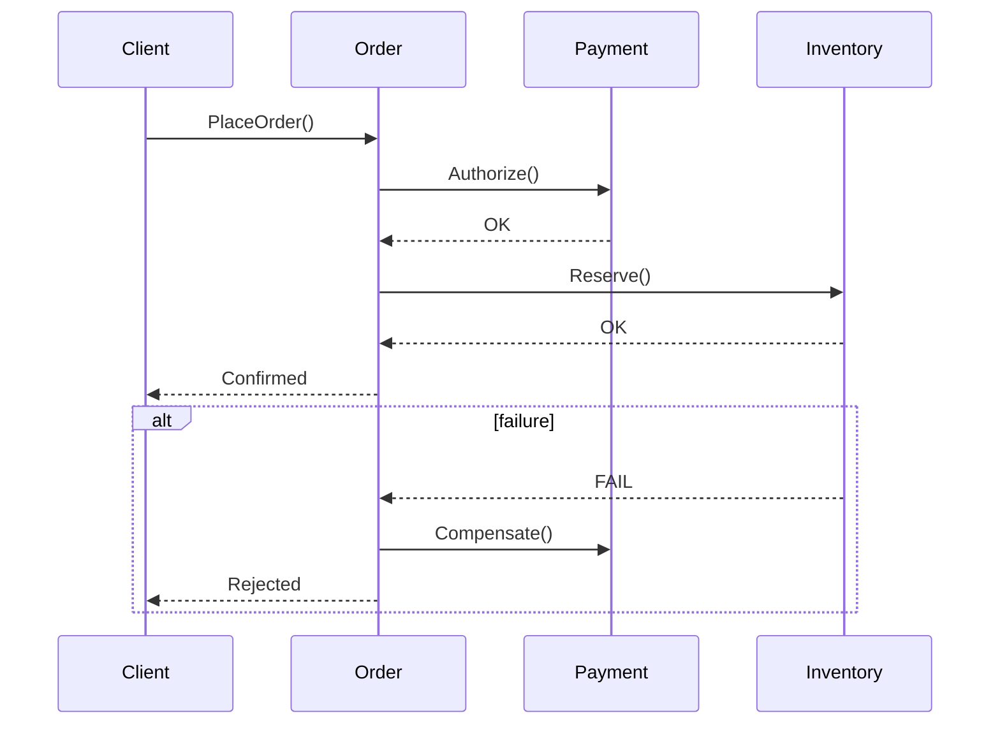

# Interview Q&A - Software Architecture for Development Guidance

Generate 25-30 senior/architect/expert Q&A pairs connecting architecture patterns to implementation code.

---

# Part I: Specifications

## Specifications

### Scope and Structure

- **Count**: 25-30 Q&A pairs (difficulty: 20% Foundational / 40% Intermediate / 40% Advanced)
- **Answer**: 150-300 words with architecture patterns, design principles, implementation code, quality attributes
- **Per Topic Cluster**: ≥1 diagram + ≥1 code example + ≥1 table + ≥1 metric

### Content Principles

- **MECE**: 4 dimensions (Structural, Behavioral, Quality, Deployment) × 4 perspectives (Design, Implementation, Operations, Evolution)
- **Analysis**: Pattern selection, quality trade-offs, scalability, reliability, architecture-to-code mapping
- **Pattern Handling**: Present alternatives (Hexagonal vs Layered, Event-Driven vs Request-Response); cite trade-offs; specify context (scale, team size, complexity)
- **Clarity**: Distinguish consensus vs debate; universal vs context-specific; trace patterns to code

### Evaluation Dimensions

- **Structural**: Components, dependencies, modularity, coupling/cohesion, layering
- **Behavioral**: Communication, data flow, events, state, error handling
- **Quality**: Performance, scalability, reliability, security, maintainability, testability
- **Deployment**: Infrastructure, containers, orchestration, CI/CD, monitoring

### Visual Element Standards

**Requirements**: Diagram + code + table + metric per topic cluster

#### Diagram Selection by Analysis Type

| Analysis Type | Primary Diagram | Standard | Code + Metrics |
|---------------|-----------------|----------|----------------|
| **Structural Patterns** | Class diagram, Component diagram | UML, C4 | Code snippet + `Cohesion = Related Methods / Total Methods` |
| **Behavioral Design** | Sequence diagram, State machine | UML | Event flow code + `Latency = Response Time - Processing Time` |
| **Quality Attributes** | Deployment diagram, Performance model | UML, Custom | Config code + `Throughput = Requests / Time`, `Error Rate = Errors / Total × 100%` |
| **Data Management** | ERD, Data flow diagram | ERD, DFD | Repository code + `Query Performance = Execution Time / Data Size` |
| **Integration** | Sequence diagram, API diagram | UML, OpenAPI | API code + `Response Time = Latency + Processing + Network` |
| **Evolution** | Migration diagram, Refactoring roadmap | Custom | Migration code + `Migration Risk = Changed LOC / Total LOC × Complexity` |

**Standards**: BPMN (process), DMN (decision), UML (structure/behavior), ArchiMate (enterprise), ERD/DFD (data), C4 (software)

#### Architecture Patterns

- **Hexagonal**: Core isolation → dependency inversion
- **Event-Driven**: Async → loose coupling → scalability
- **CQRS**: Read/write separation → performance
- **Microservices**: Decomposition → independent deployment
- **Layered**: Separation of concerns → maintainability
- **DDD**: Bounded contexts → aggregates

#### Visual Quality Standards

**Diagrams**: Mermaid only (GitHub-native)
**Code**: Idiomatic snippets (Go, Java, Python, TypeScript) with language tags
**Math**: Inline `$x$` or block `$$x$$`; define variables on first use
**Symbols**: ∑ (sum), ∏ (product), ∫ (integral), ∂ (rate), ≈ (approx), ≤/≥ (bounds)
**Legends**: 💡 Analogy, 📐 Formula, 🔍 Example, ⚠️ Note, 💻 Code
**Avoid**: Mega-diagrams, BPMN for code, mixed abstraction, >120 nodes, missing rationale

**Combinations**:
- **Full Doc**: Use Case → Class/Component → Sequence/Activity → Deployment
- **Process**: BPMN → DMN → ERD → Integration
- **Enterprise**: Strategy → Current → Target → Migration (ArchiMate)

**Quick Reference – Diagram & Code Guide**
| Need | Recommended Diagram(s) | Code Example | Standard |
|------|------------------------|--------------|----------|
| API design | Class + Sequence | Interface/Controller code | UML + OpenAPI |
| Event handling | Sequence + State machine | Event publisher/subscriber | UML |
| Data access | ERD + Class diagram | Repository pattern code | ERD + UML |
| Service communication | Sequence + Component | HTTP/gRPC client code | UML |
| State management | State machine + Class | State pattern implementation | UML |
| System structure | Component + Deployment | Module/package structure | UML + C4 |
| Performance optimization | Deployment + Flow | Caching/pooling code | Custom |

### Architecture Decision Matrices

**Pattern Selection Matrix** (choose architecture pattern based on requirements):
| Requirement | Modular Monolith | Microservices | Event‑Driven | Serverless |
|-------------|------------------|---------------|----------------|------------|
| Team Size | 1‑10 | 10+ | 5+ | 1‑5 |
| Deployment Frequency | Weekly | Daily/Continuous | Daily/Continuous | On‑demand |
| Scalability Needs | Moderate | High | High | Very High |
| Complexity Tolerance | Low‑Medium | High | High | Low |
| Operational Overhead | Low | High | Medium | Very Low |

**Quality Attribute Trade‑Off Matrix** (prioritize based on system requirements):
| Priority | Performance | Scalability | Reliability | Maintainability | Security |
|----------|-------------|-------------|-------------|-----------------|----------|
| **High‑Traffic System** | Critical | Critical | High | Medium | High |
| **Enterprise Application** | Medium | Medium | Critical | Critical | Critical |
| **Startup MVP** | Medium | Medium | Medium | Critical | High |
| **Real‑Time System** | Critical | High | Critical | Medium | High |
| **Data‑Intensive** | High | Critical | High | Medium | Critical |

### Citation Standards

- **Language**: 60% EN / 30% ZH / 10% other (tag [EN], [ZH])
- **Sources**: (1) Patterns/principles (2) Performance/scalability (3) Case studies (4) Frameworks/tools
- **Format**: APA 7th + language tags
- **Inline**: [Ref: ID] after claims, frameworks, patterns, trade-offs

### Reference Minimums

| Section | Min | Content |
|---------|-----|---------|
| Glossary | ≥10 | Hexagonal, CQRS, Event Sourcing, DDD, Bounded Context, Aggregate, Repository, Domain Event, Saga, Circuit Breaker, Service Mesh, API Gateway, Sidecar, Strangler Fig |
| Tools | ≥5 | Visualization (Mermaid), docs (Confluence, MkDocs), codegen (OpenAPI), observability (Prometheus, Grafana), testing (JMeter, k6) |
| Literature | ≥6 | Patterns (Fowler, Richards), DDD (Evans, Vernon), microservices (Richardson, Newman), distributed (Kleppmann), performance (Gregg) |
| Citations | ≥12 | 60% EN / 30% ZH / 10% other (APA 7th + tags) |

**If unmet**: State shortfall + rationale + plan.

### Usage

1. MECE structure; 20/40/40 difficulty
2. Meet reference minimums; cover all 4 dimensions
3. Per cluster: ≥1 diagram + ≥1 code + ≥1 table + ≥1 metric
4. Per topic: ≥2 sources + ≥1 tool
5. Document gaps + remediation

### Quality Gates

- **Recency**: ≥50% last 3yr (≥70% for digital/cloud)
- **Diversity**: ≥3 types; single source <25%
- **Evidence**: ≥70% have ≥1 citation; ≥30% have ≥2
- **Tools**: Pricing, adoption, update ≤18mo, integrations
- **Links**: Accessible; use DOIs/archives
- **Cross-refs**: All [Ref: ID] resolve

**Scaling**: >30 Q&A → increase minimums 1.5×

### Pre-Submission Validation

Execute all steps. Present results in table. Fix failures; re-run until all pass.

**Counts**: Glossary ≥10, Tools ≥5, Literature ≥6, APA ≥12, Q&As 25-30 (20/40/40)
**Citations**: ≥70% have ≥1; ≥30% have ≥2
**Language**: EN 50-70%, ZH 20-40%, Other 5-15%
**Recency**: ≥50% last 3yr (≥70% digital/cloud)
**Diversity**: ≥3 types; single <25%
**Links**: All accessible/archived
**Cross-refs**: All [Ref: ID] resolve
**Word Count**: Sample 5; all 150-300 words
**Key Insights**: All concrete (trade-offs/conflicts/bottlenecks/complexity)
**Per-Topic**: ≥2 sources + ≥1 tool
**Arch-Code**: ≥80% map patterns to code + citations
**Judgment**: ≥70% scenario-based ("How/When") vs recall ("What")
**Visuals**: ≥90% have diagram + code + table + metric
**Patterns**: ≥80% apply relevant patterns
**Performance**: ≥60% include metrics/formulas
**Code**: ≥80% include idiomatic snippets

**Validation Report Template:**
```
| Check | Result | Status |
|-------|--------|--------|
| Floors | G:X T:Y L:Z A:W Q:N (F/I/A) | PASS/FAIL |
| Citation coverage | X% ≥1, Y% ≥2 | PASS/FAIL |
| Language dist | EN:X% ZH:Y% Other:Z% | PASS/FAIL |
| Recency | X% last 3yr | PASS/FAIL |
| Source diversity | N types, max P% | PASS/FAIL |
| Links | Y/X accessible | PASS/FAIL |
| Cross-refs | Y/X resolved | PASS/FAIL |
| Word counts | 5/5 compliant | PASS/FAIL |
| Key Insights | Y/X concrete | PASS/FAIL |
| Per-topic mins | X/Y topics meet | PASS/FAIL |
| Arch-Code mapping | X/Y explicit | PASS/FAIL |
| Judgment vs Recall | X% judgment-based | PASS/FAIL |
| Visual coverage | X% have diagram+code+table+metric | PASS/FAIL |
| Pattern application | X% apply arch patterns | PASS/FAIL |
| Performance analysis | X% include metrics/formulas | PASS/FAIL |
| Code examples | X% include code snippets | PASS/FAIL |
```

**MANDATORY**: ANY fail → stop, fix, re-run. Proceed only when ALL pass.

### Submission Checklist

- [ ] All validation steps PASS
- [ ] All minimums + gates met

---

# Part II: Instructions

Execute steps sequentially with inline checks.

### Step 1: Topic Planning
1. Identify 5-6 clusters: Structural | Behavioral | Quality | Data | Integration | Evolution
2. Allocate 4-6 Q&As/cluster (total 25-30); difficulty 20/40/40 (F/I/A)
3. **Check**: Total 25-30, ratio ≈20/40/40

### Step 2: References
1. **Glossary (≥10)**: Hexagonal, CQRS, Event Sourcing, DDD, Bounded Context, Aggregate, Repository, Domain Event, Saga, Circuit Breaker, Service Mesh, API Gateway, Sidecar, Strangler Fig
2. **Tools (≥5)**: Mermaid/C4 (viz), Confluence/MkDocs (docs), OpenAPI (codegen), Prometheus/Grafana (observability), JMeter/k6 (test)
3. **Literature (≥6)**: Fowler/Richards (patterns), Evans/Vernon (DDD), Richardson/Newman (microservices), Kleppmann (distributed), Gregg (perf), 周爱民/张逸 (ZH)
4. **Citations (≥12)**: Tag lang, year, type; assign IDs
5. **Check**: Counts, lang 60/30/10%, recency ≥50% 3yr, ≥3 types

### Step 3: Q&A Generation
1. Scenario questions ("How/When"); 150-300 word answers
2. ≥1 [Ref: ID]/answer; trace patterns → code
3. Code snippets (Go, Java, Python, TypeScript)
4. Concrete Key Insight (trade-offs/conflicts/bottlenecks/complexity)
5. **Check**: Every 5 Q&As verify counts, citations, code, tracing, judgment

### Step 4: Visuals
1. Per cluster: diagram + code + table + metric
2. Mermaid diagrams; captions + legends
3. Idiomatic code with tags (```go, ```java, ```python, ```typescript)
4. Apply patterns (Hexagonal, CQRS, Event-Driven, DDD) + code
5. **Check**: All clusters covered; align with analysis type

### Step 5: References
1. Populate Glossary/Tools/Literature/APA
2. **Check**: All [Ref: ID] resolve

### Step 6: Validation
Execute all checks. Fix failures; re-run until all PASS.

### Step 7: Review
Apply criteria. Check list. Submit when all PASS.

---

# Part III: Output Format

### Question Design

**Approach**: Guide through architecture-to-code:
1. **Pattern Selection**: Requirements → patterns → trade-offs
2. **Quality Attributes**: Performance → scalability → reliability
3. **Implementation**: Components → interfaces → data flow
4. **Trace to Code**: Map patterns → implementation

**Criteria**:

- **Clarity**: Single unambiguous ask
  - ✅ "Translate licensing → subscription into arch requirements"
  - ❌ "Explain business models and microservices"
  
- **Signal**: Tests arch-code translation, not trivia
  - ✅ "Implement saga pattern; show code"
  - ❌ "List hexagonal components"
  
- **Depth**: Quality attributes, trade-offs, complexity
  - ✅ "CQRS/event sourcing/CRUD for high-traffic analytics? Show code"
  - ❌ "Use microservices? Y/N"
  
- **Realism**: Match senior/architect/expert roles
  - ✅ "API latency 50ms→500ms after tracing. Diagnose + fix with code"
  - ❌ "Design payment system from scratch"
  
- **Discriminative**: Judgment over recall
  - ✅ "When repository vs active record? Show both"
  - ❌ "What is repository pattern?"
  
- **Alignment**: Senior (pattern) | Architect (system) | Expert (strategy)

**Success**: Demonstrate
- Current understanding (pattern updates, docs, refactoring)
- Clear communication (patterns, code, living arch)
- Excellence (trace to code, measure metrics, optimize)

---

## Output Format

Structure for question banks:

```markdown
## Contents

- [Topic Areas](#topic-areas-questions-1-n)
- [Topic 1: [Title]](#topic-1-title)
  - [Q1: [Text]](#q1-text)
- [References](#reference-sections)
  - [Glossary](#glossary-terminology--acronyms)
  - [Tools](#business--architecture-tools)
  - [Literature](#authoritative-literature--case-studies)
  - [Citations](#apa-style-source-citations)

---

## Topic Areas: Questions 1-N

Coverage and difficulty distribution.

| Topic | Range | Count | Difficulty |
|-------|-------|-------|------------|
| Structural Patterns (Layering, Components, Modules) | Q1-Q5 | 5 | 1F, 2I, 2A |
| Behavioral Design (Events, State, Communication) | Q6-Q10 | 5 | 1F, 2I, 2A |
| Quality Attributes (Performance, Scalability, Reliability) | Q11-Q15 | 5 | 1F, 2I, 2A |
| Data Management (Persistence, Caching, Consistency) | Q16-Q20 | 5 | 1F, 2I, 2A |
| Integration Patterns (APIs, Messaging, Sync) | Q21-Q25 | 5 | 1F, 2I, 2A |
| Evolution & Migration (Refactoring, Modernization) | Q26-Q30 | 5 | 1F, 2I, 2A |
| **Total** | | **30** | **6F, 12I, 12A** |

**Legend**: F = Foundational, I = Intermediate, A = Advanced

---

## Topic 1: [Title]

### Q1: [Text]

**Difficulty**: [Foundational/Intermediate/Advanced]  
**Type**: [Structural/Behavioral/Quality/Data/Integration/Evolution]

**Key Insight**: [Pattern trade-offs/quality conflicts/bottlenecks/complexity]

**Answer**:

[150-300 words + [Ref: ID] + pattern-to-code mapping]

**Code**:
```language
// Pattern implementation
```

**Artifacts** (3+ per analysis type):

| Type | Diagrams | Code | Metrics |
|------|----------|------|---------|
| **Structural** | Class, Component, Package | Interface, Module | `Cohesion = Related/Total`, `Coupling = Deps/Components` |
| **Behavioral** | Sequence, State, Activity | Event handlers, State pattern | `Latency = Response - Processing`, `Throughput = Req/Time` |
| **Quality** | Deployment, Performance | Config, Optimization | `Error Rate = Errors/Total × 100%`, `Availability = Uptime/Total × 100%` |
| **Data** | ERD, Data flow | Repository, DAO, Caching | `Query Time = Exec/DataSize`, `Cache Hit = Hits/Total × 100%` |
| **Integration** | API, Sequence | HTTP/gRPC, Message handlers | `API Latency = Network + Processing`, `Msg Rate = Msgs/Time` |
| **Evolution** | Migration, Refactoring | Strangler, Feature toggles | `Migration Risk = Changed LOC/Total × Complexity` |

---

## Reference Sections

### Glossary, Terminology & Acronyms

**G1. Hexagonal (Ports & Adapters)**
Isolates core via ports (interfaces) + adapters (implementations). Enables testability, tech independence. Related: Dependency Inversion [EN]

**G2. CQRS**
Separates write (commands) from read (queries). Optimizes scalability, performance. Related: Event Sourcing [EN]

**G3. Event Sourcing**
Stores state as append-only event log. Enables audit, temporal queries. Related: CQRS [EN]

**G4. DDD**
Strategic/tactical patterns: ubiquitous language, bounded contexts, aggregates, repositories, events [EN]

**G5. Bounded Context**
Explicit boundary for model consistency. Drives decomposition, integration. Related: Context Map, ACL [EN]

**G6. Aggregate**
Consistency boundary (root + entities/VOs). Enforces invariants. Related: Repository [EN]

**G7. Repository**
Data access abstraction; persists aggregates without leaking persistence [EN]

**G8. Domain Event**
Immutable fact; decouples, enables eventual consistency [EN]

**G9. Saga**
Orchestrates local transactions for long-running processes across services [EN]

**G10. Circuit Breaker**
Prevents cascading failures; opens on errors/timeouts. Related: Bulkhead [EN]

**G11. Service Mesh**
Infrastructure for service-to-service communication (mTLS, retries, observability) via sidecars [EN]

**G12. API Gateway**
API entry: routing, auth, throttling, aggregation. Related: BFF [EN]

**G13. Sidecar**
Helper components for cross-cutting concerns (proxy, logging) [EN]

**G14. Strangler Fig**
Incrementally replace legacy by routing to new components [EN]

**G15. CAP**
With partition, choose Consistency or Availability. Related: PACELC [EN]

---

### Architecture & Development Tools

**T1. Mermaid**
GitHub-native text diagrams (flowchart, sequence, class, state, ER, gantt). Fenced code blocks. https://mermaid.js.org [EN]

**T2. OpenAPI**
Language-agnostic REST API spec (YAML/JSON). Client/server codegen, contract testing. https://www.openapis.org [EN]

**T3. JSON Schema**
JSON schema for validation, docs. Supports tooling, codegen. https://json-schema.org [EN]

**T4. Kubernetes**
Declarative YAML (Deployment/Service/Ingress). LLM-executable. https://kubernetes.io [EN]

**T5. ADR**
Markdown decision log (adr-tools). Traceability from arch to code. https://adr.github.io [EN]

---

### Authoritative Literature & Case Studies

**L1. Osterwalder, A., & Pigneur, Y. (2010). *Business Model Generation*. Wiley.**  
Business Model Canvas: 9 blocks for design, analysis, innovation. Business-technical alignment.

**L2. Evans, E. (2003). *Domain-Driven Design*. Addison-Wesley.**  
DDD patterns: ubiquitous language, bounded contexts, strategic design. Domain modeling.

**L3. Vernon, V. (2013). *Implementing DDD*. Addison-Wesley.**  
Practical DDD: context mapping, aggregates, event sourcing. Tactical patterns.

**L4. Conway, M. E. (1968). "How Do Committees Invent?" *Datamation*, 14(4), 28-31.**  
Conway's Law: org structure impacts system design. Team topology.

**L5. Hohpe, G., & Woolf, B. (2003). *Enterprise Integration Patterns*. Addison-Wesley.**  
Integration: messaging, routing, transformation. System integration.

**L6. Richardson, C. (2018). *Microservices Patterns*. Manning.**  
Decomposition, data, communication patterns. Practical architecture.

---

### APA Style Source Citations

**A1. Osterwalder, A., & Pigneur, Y. (2010). *Business model generation: A handbook for visionaries, game changers, and challengers*. Wiley. [EN]**

**A2. Evans, E. (2003). *Domain-driven design: Tackling complexity in the heart of software*. Addison-Wesley Professional. [EN]**

**A3. 周爱民. (2021). *架构的本质*. 电子工业出版社. [ZH]**
(Zhou, A. (2021). *The essence of architecture*. Publishing House of Electronics Industry.)

**A4. Vernon, V. (2013). *Implementing domain-driven design*. Addison-Wesley Professional. [EN]**

**A5. Conway, M. E. (1968). How do committees invent? *Datamation*, 14(4), 28-31. [EN]**

**A6. Hohpe, G., & Woolf, B. (2003). *Enterprise integration patterns: Designing, building, and deploying messaging solutions*. Addison-Wesley Professional. [EN]**

**A7. Richardson, C. (2018). *Microservices patterns: With examples in Java*. Manning Publications. [EN]**

**A8. Skelton, M., & Pais, M. (2019). *Team topologies: Organizing business and technology teams for fast flow*. IT Revolution Press. [EN]**

**A9. 张逸. (2019). *领域驱动设计实践*. 电子工业出版社. [ZH]**
(Zhang, Y. (2019). *DDD in practice*. Publishing House of Electronics Industry.)

**A10. Fowler, M. (2002). *Patterns of enterprise application architecture*. Addison-Wesley Professional. [EN]**

**A11. Humble, J., & Farley, D. (2010). *Continuous delivery: Reliable software releases through build, test, and deployment automation*. Addison-Wesley Professional. [EN]**

**A12. Kim, G., Humble, J., Debois, P., & Willis, J. (2016). *The DevOps handbook: How to create world-class agility, reliability, and security in technology organizations*. IT Revolution Press. [EN]**

**A13. 肖然. (2020). *企业级业务架构设计*. 机械工业出版社. [ZH]**
(Xiao, R. (2020). *Enterprise business architecture*. China Machine Press.)

**A14. Wardley, S. (2018). *Wardley maps: Topographical intelligence in business*. Medium. https://medium.com/wardleymaps [EN]**

**A15. Brown, S. (2018). *Software architecture for developers* (Vol. 2). Leanpub. [EN]**

**A16. Newman, S. (2021). *Building microservices: Designing fine-grained systems* (2nd ed.). O'Reilly Media. [EN]**

---

## Validation Report

Execute validation (Part I). Present table. All must PASS.

---

## Example Question

Demonstrates: Pattern → Quality → Implementation → Metrics.

### Q1: Implement Saga pattern for distributed transactions across Order, Payment, Inventory. Show sequence, code, metrics.

**Difficulty**: Advanced  
**Type**: Behavioral Design, Integration Patterns

**Key Insight**: Tests orchestration + compensations, failure modes, sequence-to-code-to-SLOs mapping.

**Answer**:



```typescript
// Saga orchestrator (simplified)
async function placeOrder(cmd: PlaceOrder) {
  const orderId = await orderRepo.create(cmd);
  try {
    await payment.authorize(orderId, cmd.amount);
    await inventory.reserve(orderId, cmd.items);
    await orderRepo.confirm(orderId);
  } catch (e) {
    await payment.compensate(orderId);
    await inventory.release(orderId);
    await orderRepo.reject(orderId, (e as Error).message);
    throw e;
  }
}
```

| Metric | Formula | Target |
|--------|---------|--------|
| Latency (p95) | `Response - Processing` | < 300 ms |
| Error Rate | `Errors / Total × 100%` | < 0.5% |
| Throughput | `Requests / Time` | ≥ 200 rps |

Notes: Idempotent ops + retries with exponential backoff; emit events for observability; record compensations for audit.

---
