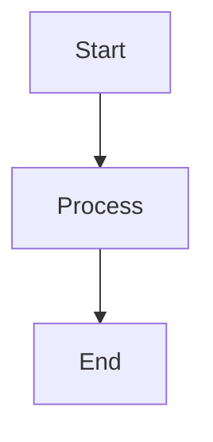
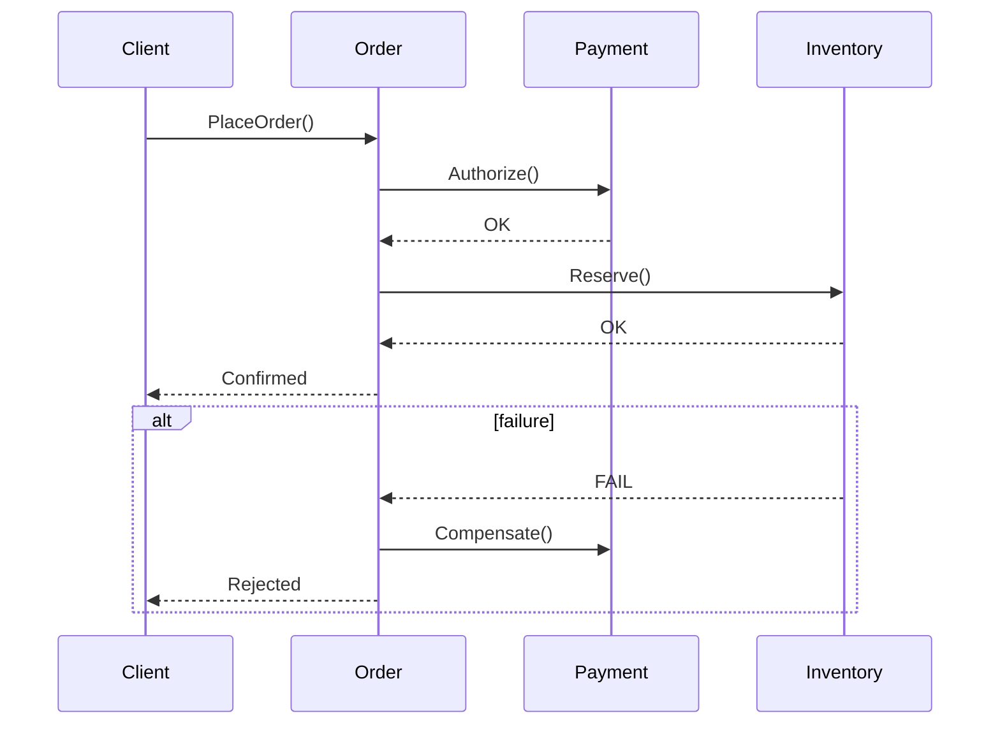

# Interview Q&A - Software Architecture for Development Guidance

Framework for generating high-quality interview question banks focused on comprehensive software architecture that guides development implementation.

---

# Part I: Specifications

Define quality requirements, standards, and constraints.

## Specifications

### Scope and Structure

- **Scope**: 25–30 Q&A pairs for senior/architect/expert level technical leaders
- **Answer Length**: 150–300 words covering architecture patterns, design principles, implementation guidance, quality attributes
- **Difficulty Distribution**: Maintain 20/40/40 balance (Foundational/Intermediate/Advanced)
- **Visual Requirements**: ≥1 primary diagram + ≥1 code example + ≥1 supporting table + ≥1 quantitative element per topic cluster
- **Architecture Analysis Depth**: Structural patterns, behavioral design, quality attributes, deployment strategies, implementation guidance

### Content Principles

- **MECE Coverage**: Four dimensions (Structural Patterns, Behavioral Design, Quality Attributes, Deployment) × Four perspectives (Design, Implementation, Operations, Evolution)
- **Analysis Required**: Pattern selection, quality attribute trade-offs, implementation strategies, scalability analysis, reliability design, evolution planning, architecture → code translation
- **Multi-Perspective**: Design (patterns, principles), Implementation (code structure, frameworks), Operations (deployment, monitoring), Evolution (migration, refactoring)
- **Pattern Handling**: Present competing patterns (Hexagonal vs Layered, Event-Driven vs Request-Response, Microservices vs Modular Monolith); cite trade-offs; acknowledge context (scale, team size, domain complexity)
- **Practitioner Clarity**: State where field agrees vs disagrees; distinguish universal principles vs context-specific practices; trace architecture to implementation code

### Evaluation Dimensions

- **Structural**: Component organization, dependency management, modularity, coupling/cohesion, layering strategies
- **Behavioral**: Communication patterns, data flow, event handling, state management, error handling
- **Quality Attributes**: Performance, scalability, reliability, security, maintainability, testability
- **Deployment**: Infrastructure patterns, containerization, orchestration, CI/CD, monitoring, observability

### Visual Element Standards

**Per Topic Cluster Requirements**: Primary diagram + code example + supporting table + quantitative element

#### Diagram Selection by Analysis Type

| Analysis Type | Primary Diagram | Standard | Code + Metrics |
|---------------|-----------------|----------|----------------|
| **Structural Patterns** | Class diagram, Component diagram | UML, C4 | Code snippet + `Cohesion = Related Methods / Total Methods` |
| **Behavioral Design** | Sequence diagram, State machine | UML | Event flow code + `Latency = Response Time - Processing Time` |
| **Quality Attributes** | Deployment diagram, Performance model | UML, Custom | Config code + `Throughput = Requests / Time`, `Error Rate = Errors / Total × 100%` |
| **Data Management** | ERD, Data flow diagram | ERD, DFD | Repository code + `Query Performance = Execution Time / Data Size` |
| **Integration** | Sequence diagram, API diagram | UML, OpenAPI | API code + `Response Time = Latency + Processing + Network` |
| **Evolution** | Migration diagram, Refactoring roadmap | Custom | Migration code + `Migration Risk = Changed LOC / Total LOC × Complexity` |

**Standards Reference**: BPMN (processes), DMN (decisions), UML (structure/behavior), ArchiMate (enterprise), SysML (requirements), ERD/DFD (data), C4 (software views)

#### Architecture Patterns (Apply Relevant Combination)

- **Hexagonal (Ports & Adapters)**: Core domain isolation → dependency inversion
- **Event-Driven Architecture**: Async communication → loose coupling → scalability
- **CQRS (Command Query Responsibility Segregation)**: Read/write separation → performance optimization
- **Microservices**: Service decomposition → independent deployment → team autonomy
- **Layered Architecture**: Separation of concerns → maintainability
- **Domain-Driven Design**: Strategic/tactical patterns → bounded contexts → aggregates

#### Visual Quality Standards

**Rendering**: Use Mermaid (GitHub-native); avoid external renderers. Syntax example:


**Code Examples**: Include idiomatic code snippets in relevant language (Go, Java, Python, TypeScript). Use fenced code blocks with language tags:
```go
type Repository interface {
    Save(ctx context.Context, entity Entity) error
}
```

**Math**: Inline `$formula$` or block `$$formula$$`. Define variables on first use.

**Common Math Symbols**: `∑` (sum), `∏` (product), `∫` (integral), `∂` (rate), `≈` (approx), `≤/≥` (bounds), `≠` (not equal), `∀` (for all)

**Legends**: Use consistent symbols for clarity: 💡 Analogy, 📐 Formula, 🔍 Example, ⚠️ Important Note, 💻 Code

**Anti-patterns**: Avoid single mega-diagram, BPMN for code flow, mixed abstraction levels, >120 nodes, missing rationale

**Combination Patterns**: For comprehensive analysis, combine multiple diagram types:
- **Full Documentation**: Requirements (Use Case) → Structure (Class/Component) → Behavior (Sequence/Activity) → Deployment
- **Process Automation**: BPMN Process → DMN Decision Table → ERD Data Model → Integration Diagram
- **Enterprise Architecture**: Strategy → Current State → Target State → Migration (all ArchiMate viewpoints)

**Quick Reference – Diagram & Code Guide**
| Need | Recommended Diagram(s) | Code Example | Standard |
|------|------------------------|--------------|----------|
| API design | Class + Sequence | Interface/Controller code | UML + OpenAPI |
| Event handling | Sequence + State machine | Event publisher/subscriber | UML |
| Data access | ERD + Class diagram | Repository pattern code | ERD + UML |
| Service communication | Sequence + Component | HTTP/gRPC client code | UML |
| State management | State machine + Class | State pattern implementation | UML |
| System structure | Component + Deployment | Module/package structure | UML + C4 |
| Performance optimization | Deployment + Flow | Caching/pooling code | Custom |

### Architecture Decision Matrices

**Pattern Selection Matrix** (choose architecture pattern based on requirements):
| Requirement | Modular Monolith | Microservices | Event‑Driven | Serverless |
|-------------|------------------|---------------|----------------|------------|
| Team Size | 1‑10 | 10+ | 5+ | 1‑5 |
| Deployment Frequency | Weekly | Daily/Continuous | Daily/Continuous | On‑demand |
| Scalability Needs | Moderate | High | High | Very High |
| Complexity Tolerance | Low‑Medium | High | High | Low |
| Operational Overhead | Low | High | Medium | Very Low |

**Quality Attribute Trade‑Off Matrix** (prioritize based on system requirements):
| Priority | Performance | Scalability | Reliability | Maintainability | Security |
|----------|-------------|-------------|-------------|-----------------|----------|
| **High‑Traffic System** | Critical | Critical | High | Medium | High |
| **Enterprise Application** | Medium | Medium | Critical | Critical | Critical |
| **Startup MVP** | Medium | Medium | Medium | Critical | High |
| **Real‑Time System** | Critical | High | Critical | Medium | High |
| **Data‑Intensive** | High | Critical | High | Medium | Critical |

### Citation Standards

- **Languages**: ~60% EN, ~30% ZH, ~10% other (tag: [EN], [ZH], etc.)
- **Source Types**: (1) Architecture patterns & design principles; (2) Performance & scalability practices; (3) Implementation case studies; (4) Frameworks & tools
- **Format**: APA 7th with language tags
- **Inline Citation**: Use [Ref: ID] after factual claims, frameworks, business models, architectural patterns, best practices, trade-off analyses

### Reference Minimum Requirements

| Section | Floor | Content |
|---------|-------|---------|
| Glossary | ≥10 | Hexagonal Architecture, CQRS, Event Sourcing, DDD, Bounded Context, Aggregate, Repository Pattern, Domain Event, Saga Pattern, Circuit Breaker, Service Mesh, API Gateway, Sidecar Pattern, Strangler Fig |
| Tools | ≥5 | Architecture visualization (C4-style Mermaid), documentation (Confluence, MkDocs), code generation (OpenAPI), observability (Prometheus, Grafana), testing (JMeter, k6) |
| Literature | ≥6 | Architecture patterns (Fowler, Richards), DDD (Evans, Vernon), microservices (Richardson, Newman), distributed systems (Kleppmann), performance (Gregg) |
| Citations | ≥12 | ~60% EN / ~30% ZH / ~10% other (APA 7th with tags) |

**Exception**: If floor unmet, state shortfall + rationale + sourcing plan.

### Usage Guidelines

1. Follow MECE structure; maintain 20/40/40 difficulty balance
2. Meet all reference floors; address Structural/Behavioral/Quality/Deployment dimensions
3. Include ≥1 primary diagram + ≥1 code example + ≥1 supporting table + ≥1 quantitative element per topic cluster
4. Per topic: ≥2 authoritative sources + ≥1 tool reference
5. Document any gaps with remediation plan

### Quality Gates

- **Recency**: ≥50% citations from last 3 years (≥70% for digital transformation/cloud-native domains)
- **Diversity**: ≥3 source types; no single source >25%
- **Evidence**: ≥70% answers have ≥1 citation; ≥30% have ≥2 citations
- **Tool Details**: Pricing, adoption metrics, last update ≤18 months, key integrations
- **Links**: Validate accessibility; use DOIs/archived URLs
- **Cross-refs**: All [Ref: ID] resolve to entries

> Scaling: For >30 Q&A, increase floors by ~1.5×. Prioritize gates before raising floors.

### Pre-Submission Validation

Execute ALL steps below. Present results in a validation report table. Fix any failures and re-run validation until all checks pass.

**Step 1 – Counts**: Glossary ≥10, Tools ≥5, Literature ≥6, APA ≥12, Q&As 25-30 (20/40/40)

**Step 2 – Citations**: ≥70% answers have ≥1; ≥30% have ≥2

**Step 3 – Language**: EN 50-70%, ZH 20-40%, Other 5-15%

**Step 4 – Recency**: ≥50% from last 3 years (≥70% for digital transformation/cloud-native)

**Step 5 – Diversity**: ≥3 source types; no single >25%

**Step 6 – Links**: All accessible or archived

**Step 7 – Cross-refs**: All [Ref: ID] resolve (G#/T#/L#/A#)

**Step 8 – Word Count**: Sample 5 answers; all 150-300 words

**Step 9 – Key Insights**: All concrete (pattern trade-offs/quality attribute conflicts/scalability bottlenecks/implementation complexity)

**Step 10 – Per-Topic**: Each has ≥2 authoritative + ≥1 tool

**Step 11 – Architecture-Code Mapping**: ≥80% of answers explicitly connect architecture patterns to implementation code with citations

**Step 12 – Judgment**: ≥70% scenario-based ("How would...", "When should...") vs recall ("What is...")

**Step 13 – Visual Element Coverage**: ≥90% of answers include primary diagram + code example + supporting table + performance/quantitative metric

**Step 14 – Architecture Pattern Application**: ≥80% answers apply relevant architecture patterns (Hexagonal, CQRS, Event-Driven, etc.)

**Step 15 – Performance Analysis**: ≥60% answers include performance metrics, formulas, or calculations where appropriate

**Step 16 – Code Example Coverage**: ≥80% of answers include idiomatic code snippets demonstrating patterns

**Validation Report Template:**
```
| Check | Result | Status |
|-------|--------|--------|
| Floors | G:X T:Y L:Z A:W Q:N (F/I/A) | PASS/FAIL |
| Citation coverage | X% ≥1, Y% ≥2 | PASS/FAIL |
| Language dist | EN:X% ZH:Y% Other:Z% | PASS/FAIL |
| Recency | X% last 3yr | PASS/FAIL |
| Source diversity | N types, max P% | PASS/FAIL |
| Links | Y/X accessible | PASS/FAIL |
| Cross-refs | Y/X resolved | PASS/FAIL |
| Word counts | 5/5 compliant | PASS/FAIL |
| Key Insights | Y/X concrete | PASS/FAIL |
| Per-topic mins | X/Y topics meet | PASS/FAIL |
| Arch-Code mapping | X/Y explicit | PASS/FAIL |
| Judgment vs Recall | X% judgment-based | PASS/FAIL |
| Visual coverage | X% have diagram+code+table+metric | PASS/FAIL |
| Pattern application | X% apply arch patterns | PASS/FAIL |
| Performance analysis | X% include metrics/formulas | PASS/FAIL |
| Code examples | X% include code snippets | PASS/FAIL |
```

> **MANDATORY:** If ANY check shows FAIL, stop, fix issues, regenerate, and re-run validation. Only proceed when ALL checks show PASS.

### Submission Checklist

- [ ] All 16 validation steps PASS (see report table above)
- [ ] ALL reference floors met + quality gates passed

---

# Part II: Instructions

Execute generation workflow with inline quality checks at each step.

## Instructions

Follow these steps in order. Execute inline quality checks at each step before proceeding.

### Step 1: Topic Identification & Planning
1. Identify 5-6 clusters aligned with framework: Structural Patterns | Behavioral Design | Quality Attributes | Data Management | Integration Patterns | Evolution & Migration
2. Allocate 4-6 Q&As per cluster (total 25-30); assign 20/40/40 difficulty (F/I/A)
3. **Check**: Total = 25-30, ratio ≈20/40/40

### Step 2: Reference Collection
1. **Glossary (≥10)**: Hexagonal Architecture, CQRS, Event Sourcing, DDD, Bounded Context, Aggregate, Repository Pattern, Domain Event, Saga Pattern, Circuit Breaker, Service Mesh, API Gateway, Sidecar Pattern, Strangler Fig
2. **Tools (≥5)**: C4/PlantUML (architecture visualization), Confluence/MkDocs (documentation), OpenAPI (code generation), Prometheus/Grafana (observability), JMeter/k6 (testing)
3. **Literature (≥6)**: Fowler/Richards (patterns), Evans/Vernon (DDD), Richardson/Newman (microservices), Kleppmann (distributed systems), Gregg (performance) + ZH sources (周爱民, 张逸)
4. **Citations (≥12)**: Tag language, year, type (1-4); assign IDs (G#/T#/L#/A#)
5. **Check**: Counts, language ~60/30/10%, recency ≥50% last 3yr, ≥3 types

### Step 3: Q&A Generation
1. Write scenario-based questions ("How would...", "When should..."); draft 150-300 word answers
2. Include ≥1 [Ref: ID] per answer; explicitly trace architecture patterns → implementation code
3. Include code snippets demonstrating patterns (Go, Java, Python, TypeScript)
4. State concrete Key Insight (pattern trade-offs/quality conflicts/scalability bottlenecks/complexity)
5. **Check**: Every 5 Q&As verify word counts, citations, code examples, architecture-to-code tracing, judgment focus

### Step 4: Visual Artifacts
1. Per topic cluster, create ≥4 elements: primary diagram + code example + supporting table + performance metric
2. Use Mermaid for diagrams; include captions and legends
3. Include idiomatic code snippets with language tags (```go, ```java, ```python, ```typescript)
4. Apply relevant architecture patterns (Hexagonal, CQRS, Event-Driven, DDD) with code implementation
5. **Check**: All clusters covered; visuals + code align with analysis type (see Diagram Selection table in Part I)

### Step 5: References
1. Populate Glossary/Tools/Literature/APA with required fields
2. **Check**: All [Ref: ID] resolve

### Step 6: Validation
Execute all 16 steps (Part I). Fix failures; re-validate until all PASS.

### Step 7: Final Review
Apply critique criteria. Check submission checklist. Submit when all PASS.

---

# Part III: Output Format

Template structure for generated question banks with quality criteria.

### Question Design & Critique

**Implementation Approach:**

Questions should guide candidates through the architecture-to-code framework:
1. **Start with Pattern Selection**: Identify requirements → select appropriate patterns → justify trade-offs
2. **Assess Quality Attributes**: Define performance goals → evaluate scalability needs → consider reliability requirements
3. **Design Implementation**: Create component structure → define interfaces → plan data flow
4. **Trace to Code**: Show explicit connection from architecture patterns to implementation code

**Quality Criteria:**

- **Clarity**: Single unambiguous ask
  - ✅ "How would you translate a shift from one-time licensing to subscription revenue into architectural requirements?"
  - ❌ "Explain business models and microservices architecture"
  
- **Signal**: Tests architecture-code translation, not trivia
  - ✅ "How would you implement a saga pattern for distributed transactions? Show the code structure."
  - ❌ "List the components of hexagonal architecture"
  
- **Depth**: Enables discussion of quality attributes, pattern trade-offs, implementation complexity
  - ✅ "Choose one: CQRS, event sourcing, or traditional CRUD for a high-traffic analytics platform. Show code examples for your choice."
  - ❌ "Should you use microservices? Yes/no"
  
- **Realism**: Scenarios matching senior/architect/expert roles bridging design and implementation
  - ✅ "Your API latency increased from 50ms to 500ms after adding distributed tracing. How would you diagnose and fix this? Show relevant code."
  - ❌ "Design a payment system from scratch"
  
- **Discriminative**: Tests judgment over recall
  - ✅ "When should you choose repository pattern over active record? Demonstrate both with code examples."
  - ❌ "What is the repository pattern?"
  
- **Alignment**: Match seniority (Senior: pattern implementation | Architect: system design | Expert: architecture strategy)

**Success Factors:**

Answers should demonstrate:
- Maintaining current understanding (regular pattern updates, architecture documentation, adaptive refactoring)
- Clear communication (documented patterns, code examples, living architecture)
- Implementation excellence (trace patterns to code, measure performance metrics, optimize based on profiling)

---

## Output Format

Use this structure when generating question banks:

```markdown
## Contents

- [Topic Areas](#topic-areas-questions-1-n)
- [Topic 1: [Topic title]](#topic-1-topic-title)
  - [Q1: [Question text]](#q1-question-text)
  - [Q2: [Question text]](#q2-question-text)
- [Topic 2: [Topic title]](#topic-2-topic-title)
  - [Q3: [Question text]](#q3-question-text)
- [Reference Sections](#reference-sections)
  - [Glossary, Terminology & Acronyms](#glossary-terminology--acronyms)
  - [Business & Architecture Tools](#business--architecture-tools)
  - [Authoritative Literature & Case Studies](#authoritative-literature--case-studies)
  - [APA Style Source Citations](#apa-style-source-citations)

---

## Topic Areas: Questions 1-N

Overview of coverage and difficulty distribution.

| Topic | Question Range | Count | Difficulty Mix |
|-------|---------------|-------|----------------|
| Structural Patterns (Layering, Components, Modules) | Q1-Q5 | 5 | 1F, 2I, 2A |
| Behavioral Design (Events, State, Communication) | Q6-Q10 | 5 | 1F, 2I, 2A |
| Quality Attributes (Performance, Scalability, Reliability) | Q11-Q15 | 5 | 1F, 2I, 2A |
| Data Management (Persistence, Caching, Consistency) | Q16-Q20 | 5 | 1F, 2I, 2A |
| Integration Patterns (APIs, Messaging, Sync) | Q21-Q25 | 5 | 1F, 2I, 2A |
| Evolution & Migration (Refactoring, Modernization) | Q26-Q30 | 5 | 1F, 2I, 2A |
| **Total** | | **30** | **6F, 12I, 12A** |

**Legend**: F = Foundational, I = Intermediate, A = Advanced

---

## Topic 1: [Topic Title]

### Q1: [Question Text]

**Difficulty**: [Foundational/Intermediate/Advanced]  
**Type**: [Structural Patterns/Behavioral Design/Quality Attributes/Data Management/Integration Patterns/Evolution & Migration]

**Key Insight**: [One sentence stating specific pattern trade-offs/quality attribute conflicts/scalability bottlenecks/implementation complexity this question exposes]

**Answer**:

[150-300 word answer with inline [Ref: ID] citations, explicitly connecting architecture patterns to implementation code]

**Code Example**:
```language
// Idiomatic code demonstrating the pattern
```

**Supporting Artifacts** (Select 3+ matching analysis type):

| Artifact Type | Diagrams | Code Examples | Metrics |
|---------------|----------|---------------|----------|
| **Structural** | Class, Component, Package diagrams | Interface definitions, Module structure | `Cohesion = Related Methods / Total`, `Coupling = Dependencies / Components` |
| **Behavioral** | Sequence, State machine, Activity diagrams | Event handlers, State pattern code | `Latency = Response - Processing`, `Throughput = Requests / Time` |
| **Quality** | Deployment, Performance model | Config code, Optimization patterns | `Error Rate = Errors / Total × 100%`, `Availability = Uptime / Total × 100%` |
| **Data** | ERD, Data flow diagrams | Repository, DAO, Caching code | `Query Time = Execution / Data Size`, `Cache Hit Rate = Hits / Total × 100%` |
| **Integration** | API, Sequence diagrams | HTTP/gRPC client, Message handlers | `API Latency = Network + Processing`, `Message Rate = Messages / Time` |
| **Evolution** | Migration, Refactoring diagrams | Strangler pattern, Feature toggles | `Migration Risk = Changed LOC / Total × Complexity` |

---

## Reference Sections

### Glossary, Terminology & Acronyms

**G1. Hexagonal Architecture (Ports & Adapters)**
Architecture pattern isolating core domain from external systems via ports (interfaces) and adapters (implementations). Enables testability and technology independence. Related: Dependency Inversion [EN]

**G2. CQRS (Command Query Responsibility Segregation)**
Separates write (commands) from read (queries) models to optimize scalability and performance. Related: Event Sourcing [EN]

**G3. Event Sourcing**
Stores state as an append-only log of events; rebuilds current state by replaying events. Enables auditability and temporal queries. Related: CQRS [EN]

**G4. Domain-Driven Design (DDD)**
Strategic and tactical patterns for complex domains: ubiquitous language, bounded contexts, aggregates, repositories, domain events. [EN]

**G5. Bounded Context**
Explicit boundary within which a model is consistent. Drives service decomposition and integration design. Related: Context Map, ACL [EN]

**G6. Aggregate**
Consistency boundary composed of an aggregate root and related entities/value objects. Enforces invariants. Related: Repository [EN]

**G7. Repository Pattern**
Abstraction for data access that persists aggregates/entities without leaking persistence concerns. [EN]

**G8. Domain Event**
Immutable fact capturing something that happened in the domain; used for decoupling and eventual consistency. [EN]

**G9. Saga Pattern**
Orchestrates/coordinates a set of local transactions to implement a long-running business process across services. [EN]

**G10. Circuit Breaker**
Prevents cascading failures by opening on repeated errors/timeouts; retries with backoff. Related: Bulkhead [EN]

**G11. Service Mesh**
Infrastructure layer handling service-to-service communication (mTLS, retries, observability) via sidecars. [EN]

**G12. API Gateway**
Entry point for APIs handling routing, auth, throttling, and aggregation. Related: BFF [EN]

**G13. Sidecar Pattern**
Deploy helper components alongside the main service for cross-cutting concerns (proxy, logging). [EN]

**G14. Strangler Fig Pattern**
Incrementally replace legacy system by routing traffic to new components until full cutover. [EN]

**G15. CAP Theorem**
In presence of partition, a distributed system must choose between Consistency or Availability. Related: PACELC [EN]

---

### Architecture & Development Tools

**T1. Mermaid** (Text‑based Diagrams)
GitHub‑native rendering for flowchart, sequence, class, state, ER, and gantt diagrams. Use fenced code blocks in Markdown. https://mermaid.js.org [EN]

**T2. OpenAPI** (API Specification)
Language‑agnostic interface definition for REST APIs (YAML/JSON). Enables client/server code generation and contract testing. https://www.openapis.org [EN]

**T3. JSON Schema** (Data Contracts)
JSON‑based schema for validating and documenting JSON data structures; supports tooling and codegen. https://json-schema.org [EN]

**T4. Kubernetes Manifests** (YAML)
Declarative deployment specs (Deployment/Service/Ingress). LLM‑executable YAML for ops automation. https://kubernetes.io [EN]

**T5. ADR (Architecture Decision Records)**
Markdown‑based decision log (adr‑tools). Encourages traceability from architecture to implementation. https://adr.github.io [EN]

---

### Authoritative Literature & Case Studies

**L1. Osterwalder, A., & Pigneur, Y. (2010). *Business Model Generation*. Wiley.**  
Business Model Canvas framework; 9 building blocks for designing, analyzing, innovating business models. Foundational for business-technical alignment.

**L2. Evans, E. (2003). *Domain-Driven Design: Tackling Complexity in the Heart of Software*. Addison-Wesley.**  
DDD patterns and practices; ubiquitous language, bounded contexts, strategic design. Core reference for domain modeling.

**L3. Vernon, V. (2013). *Implementing Domain-Driven Design*. Addison-Wesley.**  
Practical DDD implementation; context mapping, aggregates, event sourcing. Tactical patterns for complex domains.

**L4. Conway, M. E. (1968). "How Do Committees Invent?" *Datamation*, 14(4), 28-31.**  
Original Conway's Law paper; organizational structure impacts system design. Foundational for team topology.

**L5. Hohpe, G., & Woolf, B. (2003). *Enterprise Integration Patterns*. Addison-Wesley.**  
Integration patterns for distributed systems; messaging, routing, transformation. Reference for system integration.

**L6. Richardson, C. (2018). *Microservices Patterns*. Manning.**  
Microservices decomposition, data management, communication patterns. Practical architecture patterns.

---

### APA Style Source Citations

**A1. Osterwalder, A., & Pigneur, Y. (2010). *Business model generation: A handbook for visionaries, game changers, and challengers*. Wiley. [EN]**

**A2. Evans, E. (2003). *Domain-driven design: Tackling complexity in the heart of software*. Addison-Wesley Professional. [EN]**

**A3. 周爱民. (2021). *架构的本质*. 电子工业出版社. [ZH]**
(Zhou, A. (2021). *The essence of architecture*. Publishing House of Electronics Industry.)

**A4. Vernon, V. (2013). *Implementing domain-driven design*. Addison-Wesley Professional. [EN]**

**A5. Conway, M. E. (1968). How do committees invent? *Datamation*, 14(4), 28-31. [EN]**

**A6. Hohpe, G., & Woolf, B. (2003). *Enterprise integration patterns: Designing, building, and deploying messaging solutions*. Addison-Wesley Professional. [EN]**

**A7. Richardson, C. (2018). *Microservices patterns: With examples in Java*. Manning Publications. [EN]**

**A8. Skelton, M., & Pais, M. (2019). *Team topologies: Organizing business and technology teams for fast flow*. IT Revolution Press. [EN]**

**A9. 张逸. (2019). *领域驱动设计实践*. 电子工业出版社. [ZH]**
(Zhang, Y. (2019). *Domain-driven design in practice*. Publishing House of Electronics Industry.)

**A10. Fowler, M. (2002). *Patterns of enterprise application architecture*. Addison-Wesley Professional. [EN]**

**A11. Humble, J., & Farley, D. (2010). *Continuous delivery: Reliable software releases through build, test, and deployment automation*. Addison-Wesley Professional. [EN]**

**A12. Kim, G., Humble, J., Debois, P., & Willis, J. (2016). *The DevOps handbook: How to create world-class agility, reliability, and security in technology organizations*. IT Revolution Press. [EN]**

**A13. 肖然. (2020). *企业级业务架构设计*. 机械工业出版社. [ZH]**
(Xiao, R. (2020). *Enterprise business architecture design*. China Machine Press.)

**A14. Wardley, S. (2018). *Wardley maps: Topographical intelligence in business*. Medium. https://medium.com/wardleymaps [EN]**

**A15. Brown, S. (2018). *Software architecture for developers* (Vol. 2). Leanpub. [EN]**

**A16. Newman, S. (2021). *Building microservices: Designing fine-grained systems* (2nd ed.). O'Reilly Media. [EN]**

---

## Validation Report

Execute 16-step validation (Part I). Present results in table format upon completion. All checks must show PASS before submission.

---

## Example Question

Demonstrates the architecture→code framework: Pattern Selection → Quality Attributes → Implementation → Metrics.

### Q1: How would you implement a Saga pattern for distributed transactions across Order, Payment, and Inventory services? Show the sequence, code structure, and key metrics.

**Difficulty**: Advanced  
**Type**: Behavioral Design, Integration Patterns

**Key Insight**: Tests ability to apply orchestration with compensations, reason about failure modes, and connect sequence flows to concrete code and SLOs.

**Answer**:



```typescript
// Saga orchestrator (simplified)
async function placeOrder(cmd: PlaceOrder) {
  const orderId = await orderRepo.create(cmd);
  try {
    await payment.authorize(orderId, cmd.amount);
    await inventory.reserve(orderId, cmd.items);
    await orderRepo.confirm(orderId);
  } catch (e) {
    await payment.compensate(orderId);
    await inventory.release(orderId);
    await orderRepo.reject(orderId, (e as Error).message);
    throw e;
  }
}
```

| Metric | Formula | Target |
|--------|---------|--------|
| Latency (p95) | `Response - Processing` | < 300 ms |
| Error Rate | `Errors / Total × 100%` | < 0.5% |
| Throughput | `Requests / Time` | ≥ 200 rps |

Notes: Use idempotent operations and retries with exponential backoff; emit domain events for observability; record compensations for auditability.

---
