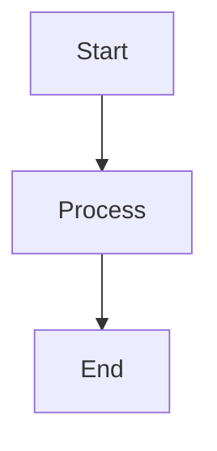

# Interview Q&A - Business Understanding for Software Architecture

Framework for generating interview question banks that assess business-to-architecture translation capabilities.

---

# Part I: Specifications

## Specifications

### Scope and Structure

- **Scope**: 25–30 Q&A pairs targeting senior/architect/expert technical leaders
- **Answer Length**: 150–300 words
- **Difficulty**: 20% Foundational / 40% Intermediate / 40% Advanced
- **Visual Requirements**: Per topic cluster: ≥1 diagram + ≥1 table + ≥1 quantitative element
- **Coverage**: Strategic modeling, value/risk analysis, organizational dynamics, architectural translation

### Content Principles

- **MECE Coverage**: 4 dimensions (Strategic Modeling, Documentation, Visualization, Analysis) × 4 perspectives (Strategic, Operational, Organizational, Architectural)
- **Required Analysis**: Value mapping (propositions → features), risk assessment (business/operational/regulatory), constraint analysis, evolution planning
- **Framework Handling**: Present competing frameworks (Business Model Canvas vs Lean Canvas); cite counter-evidence; acknowledge context (B2B vs B2C, regulated vs unregulated)
- **Clarity**: State consensus vs debate; distinguish universal principles vs context-specific practices; trace decisions to business value

### Evaluation Dimensions

- **Business**: Value propositions, revenue models, customer segments, competitive dynamics
- **Strategic**: Business model evolution, risk mitigation, regulatory compliance, investment priorities
- **Organizational**: Team structure, communication patterns, capability gaps, change management
- **Architectural**: Business-technical mapping, constraint translation, scalability drivers, technical debt

### Visual Element Standards

**Per Topic Cluster**: Diagram + table + quantitative element

#### Diagram Selection by Analysis Type

| Analysis Type | Primary Diagram | Standard | Supporting Elements |
|---------------|-----------------|----------|---------------------|
| **Strategic Modeling** | Business Model Canvas, Value Stream Map | BPMN, ArchiMate | ROI: `(Revenue - Investment) / Investment × 100%` |
| **Value & Risk Analysis** | Risk matrix, Decision tree | DMN | Risk: `Probability × Impact × Exposure` |
| **Documentation** | C4 Context/Container, Component diagram | UML, C4 | Performance: `Availability = Uptime / Total Time × 100%` |
| **Organizational** | Team topology, Conway's Law map | Custom | Communication overhead metrics |
| **Architecture Translation** | Value→Architecture mapping | UML, DDD | Debt: `Remediation Cost / Dev Cost × 100%` |
| **Evolution** | Migration roadmap, Timeline | Gantt | NPV: `Σ(Cash Flow / (1 + r)^n) - Investment` |

**Standards**: BPMN (processes), DMN (decisions), UML (structure/behavior), ArchiMate (enterprise), SysML (requirements), ERD/DFD (data), C4 (software)

#### Business Frameworks

- **Business Model Canvas**: 9-block analysis → architectural implications
- **Value Proposition**: Customer segments → technical requirements
- **SWOT/Porter's Five Forces**: Strategic positioning → architecture priorities
- **Lean Canvas**: Problem-solution fit → validation strategy

#### Visual Quality Standards

**Rendering**: Use Mermaid. Syntax:


**Math**: Inline `$formula$` or block `$$formula$$`. Define variables on first use.

**Symbols**: `∑` (sum), `∏` (product), `∂` (rate), `≈` (approx), `≤/≥` (bounds), `≠` (not equal)

**Legends**: 💡 Analogy, 📐 Formula, 🔍 Example, ⚠️ Note

**Avoid**: Single mega-diagram, BPMN for code flow, mixed abstraction levels, >120 nodes, missing rationale

**Combination Patterns**:
- **Full Documentation**: Requirements → Structure → Behavior → Deployment
- **Process Automation**: BPMN → DMN → ERD → Integration
- **Enterprise Architecture**: Strategy → Current State → Target State → Migration

**Quick Reference – Diagram Shortcut Guide**
| Need | Recommended Diagram(s) | Standard |
|------|-----------------------|----------|
| API design | Class + Sequence | UML |
| Workflow logic | Activity (UML) / Process (BPMN) | UML / BPMN |
| Decision logic | Decision Table + Requirements | DMN / SysML |
| Business process | Process / Collaboration with Pools & Lanes | BPMN |
| Database design | ERD + Data Flow | ERD / DFD |
| System architecture | Component + Deployment | UML |
| Enterprise strategy | Strategy + Migration viewpoints | ArchiMate |

### Decision & Cost Tables

**Risk‑Based Tool Selection**:
| Risk Factor | Low‑Risk Approach | Medium‑Risk Approach | High‑Risk Approach |
|------------|-------------------|----------------------|-------------------|
| Budget Constraints | Open‑source (PlantUML, Archi) | Mixed (Free + Limited paid) | Full commercial suite |
| Timeline Pressure | Familiar tools only | Quick‑learning tools | Comprehensive training |
| Integration Needs | Stand‑alone tools | API‑connected tools | Fully integrated platform |
| Compliance Requirements | Basic standards compliance | Industry‑specific compliance | Regulatory‑grade compliance |

**Tool ROI Estimation**:
| Investment Level | Tool Cost | Training Cost | ROI Timeline | Total Value |
|----------------|----------|--------------|--------------|------------|
| Starter | $0‑5K | $1‑2K | 3‑6 months | Quick wins, limited scale |
| Professional | $10‑50K | $5‑15K | 6‑12 months | Balanced investment, good ROI |
| Enterprise | $100K+ | $25K+ | 12‑24 months | Long‑term value, high impact |

### Citation Standards

- **Languages**: 60% EN / 30% ZH / 10% other (tagged: [EN], [ZH])
- **Types**: (1) Business frameworks; (2) Architecture patterns; (3) Case studies; (4) Tools
- **Format**: APA 7th with language tags
- **Inline**: Use [Ref: ID] for claims, frameworks, patterns, best practices, trade-offs

### Reference Minimums

| Section | Minimum | Content |
|---------|---------|---------|
| Glossary | ≥10 | Business Model Canvas, Value Proposition, Customer Segment, DDD, Bounded Context, Conway's Law, Technical Debt, ADR, Wardley Mapping, Value Stream Mapping |
| Tools | ≥5 | Miro (business modeling), ArchiMate/C4 (architecture), Confluence (documentation), LucidChart (diagramming) |
| Literature | ≥6 | Osterwalder (business), Evans/Vernon (DDD), Conway/Skelton (organizational), Hohpe (integration), Richardson (microservices) |
| Citations | ≥12 | 60% EN / 30% ZH / 10% other (APA 7th) |

**If unmet**: State shortfall + rationale + sourcing plan.

### Usage Guidelines

1. Follow MECE structure; maintain 20/40/40 difficulty
2. Meet reference minimums; cover Business/Strategic/Organizational/Architectural dimensions
3. Per topic cluster: ≥1 diagram + ≥1 table + ≥1 quantitative element
4. Per topic: ≥2 authoritative sources + ≥1 tool
5. Document gaps with remediation plan

### Quality Gates

- **Recency**: ≥50% from last 3 years (≥70% for digital transformation/cloud-native)
- **Diversity**: ≥3 source types; no single source >25%
- **Evidence**: ≥70% answers with ≥1 citation; ≥30% with ≥2 citations
- **Tool Details**: Pricing, adoption, last update ≤18 months, integrations
- **Links**: Validate accessibility; use DOIs/archived URLs
- **Cross-refs**: All [Ref: ID] resolve

> For >30 Q&A: increase minimums by 1.5×. Prioritize gates before raising minimums.

### Pre-Submission Validation

Execute all steps. Present results in validation report. Fix failures; re-run until all pass.

1. **Counts**: Glossary ≥10, Tools ≥5, Literature ≥6, APA ≥12, Q&As 25-30 (20/40/40)
2. **Citations**: ≥70% answers with ≥1; ≥30% with ≥2
3. **Language**: EN 50-70%, ZH 20-40%, Other 5-15%
4. **Recency**: ≥50% from last 3 years (≥70% for digital/cloud)
5. **Diversity**: ≥3 source types; no single >25%
6. **Links**: All accessible or archived
7. **Cross-refs**: All [Ref: ID] resolve (G#/T#/L#/A#)
8. **Word Count**: Sample 5 answers; all 150-300 words
9. **Key Insights**: All concrete (misalignment/trade-off/mapping failure/impedance)
10. **Per-Topic**: ≥2 authoritative + ≥1 tool
11. **Business-Technical Mapping**: ≥80% connect business to architecture with citations
12. **Judgment**: ≥70% scenario-based ("How would...") vs recall ("What is...")
13. **Visual Coverage**: ≥90% include diagram + table + quantitative element
14. **Framework Application**: ≥80% apply business frameworks (BMC, Value Prop, SWOT)
15. **Mathematical Analysis**: ≥60% include formulas where appropriate

**Validation Report Template:**
```
| Check | Result | Status |
|-------|--------|--------|
| Floors | G:X T:Y L:Z A:W Q:N (F/I/A) | PASS/FAIL |
| Citation coverage | X% ≥1, Y% ≥2 | PASS/FAIL |
| Language dist | EN:X% ZH:Y% Other:Z% | PASS/FAIL |
| Recency | X% last 3yr | PASS/FAIL |
| Source diversity | N types, max P% | PASS/FAIL |
| Links | Y/X accessible | PASS/FAIL |
| Cross-refs | Y/X resolved | PASS/FAIL |
| Word counts | 5/5 compliant | PASS/FAIL |
| Key Insights | Y/X concrete | PASS/FAIL |
| Per-topic mins | X/Y topics meet | PASS/FAIL |
| Biz-Tech mapping | X/Y explicit | PASS/FAIL |
| Judgment vs Recall | X% judgment-based | PASS/FAIL |
| Visual coverage | X% have diagram+table+formula | PASS/FAIL |
| Framework application | X% apply biz frameworks | PASS/FAIL |
| Mathematical analysis | X% include quantitative elements | PASS/FAIL |
```

> **MANDATORY**: If any check fails, fix and re-run. Proceed only when all pass.

### Submission Checklist

- [ ] All 15 validation steps pass
- [ ] Reference minimums met + quality gates passed

---

# Part II: Instructions

## Instructions

Follow steps sequentially. Execute quality checks before proceeding.

### Step 1: Topic Identification
1. Identify 5-6 clusters: Strategic Modeling | Value & Risk Analysis | Documentation & Visualization | Organizational Dynamics | Architectural Translation | Evolution & Adaptation
2. Allocate 4-6 Q&As per cluster (total 25-30); assign 20/40/40 difficulty
3. **Check**: Total = 25-30, ratio ≈20/40/40

### Step 2: Reference Collection
1. **Glossary (≥10)**: Business Model Canvas, Value Proposition, DDD, Bounded Context, Conway's Law, Technical Debt, ADR, Wardley Mapping, Value Stream Mapping
2. **Tools (≥5)**: Miro, ArchiMate/C4, Confluence, LucidChart, Wardley Maps
3. **Literature (≥6)**: Osterwalder, Evans/Vernon, Conway, Hohpe, Richardson + ZH sources (周爱民, 张逸, 肖然)
4. **Citations (≥12)**: Tag language, year, type; assign IDs (G#/T#/L#/A#)
5. **Check**: Counts, language 60/30/10%, recency ≥50% last 3yr, ≥3 types

### Step 3: Q&A Generation
1. Write scenario-based questions ("How would..."); draft 150-300 word answers
2. Include ≥1 [Ref: ID] per answer; trace business → architecture
3. State concrete Key Insight (misalignment/constraint/mapping failure/impedance)
4. **Check**: Every 5 Q&As verify word counts, citations, tracing, judgment focus

### Step 4: Visual Artifacts
1. Per cluster: diagram + table + formula
2. Use Mermaid; include captions and legends
3. Apply business frameworks (BMC, Value Prop, SWOT) with architectural mapping
4. **Check**: All clusters covered; visuals align with analysis type

### Step 5: References
1. Populate Glossary/Tools/Literature/APA with required fields
2. **Check**: All [Ref: ID] resolve

### Step 6: Validation
Execute all 15 steps. Fix failures; re-validate until all pass.

### Step 7: Final Review
Apply critique criteria. Verify checklist. Submit when all pass.

---

# Part III: Output Format

### Question Design & Critique

**Implementation Approach:**

Guide candidates through:
1. **Value Mapping**: Value propositions → technical requirements → prioritize by impact
2. **Risk Assessment**: Business risks → operational constraints → regulatory requirements
3. **Organizational Factors**: Team structure → communication patterns → future changes
4. **Architectural Tracing**: Business drivers → architectural decisions

**Quality Criteria:**

- **Clarity**: Single unambiguous ask
  - ✅ "How would you translate subscription revenue shift into architectural requirements?"
  - ❌ "Explain business models and microservices"
  
- **Signal**: Tests business-technical translation
  - ✅ "CEO wants regulated market entry. How does this change architecture strategy?"
  - ❌ "List Business Model Canvas components"
  
- **Depth**: Enables constraint, trade-off, impact discussion
  - ✅ "Choose: monolith refactor, strangler pattern, or greenfield for B2B to B2C pivot. How?"
  - ❌ "Use microservices? Yes/no"
  
- **Realism**: Senior/architect/expert scenarios
  - ✅ "Sales promises real-time analytics for $10M deal. Engineering needs 6-month rebuild. Navigate?"
  - ❌ "Design payment system"
  
- **Discriminative**: Tests judgment vs recall
  - ✅ "When does Conway's Law suggest org restructuring before refactoring?"
  - ❌ "What is Conway's Law?"
  
- **Alignment**: Match seniority (Senior: tactical | Architect: strategic | Expert: business-technical)

**Success Factors:**

Demonstrate:
- Current understanding (business review, documentation updates, adaptive decisions)
- Clear communication (documented decisions, knowledge sharing, living documentation)
- Value alignment (trace to business value, measure impact, adjust based on feedback)

---

## Output Format

Start the output with a TOC (e.g., '## Contents') linking to all top-level headings and list items.

- Use lists tables diagrams formulas code blocks; diagrams in Mermaid; code with language-tagged fences.

```markdown
## Contents

- [Topic Areas](#topic-areas-questions-1-n)
- [Topic 1: [Topic title]](#topic-1-topic-title)
  - [Q1: [Question text]](#q1-question-text)
  - [Q2: [Question text]](#q2-question-text)
- [Topic 2: [Topic title]](#topic-2-topic-title)
  - [Q3: [Question text]](#q3-question-text)
- [Reference Sections](#reference-sections)
  - [Glossary, Terminology & Acronyms](#glossary-terminology--acronyms)
  - [Business & Architecture Tools](#business--architecture-tools)
  - [Authoritative Literature & Case Studies](#authoritative-literature--case-studies)
  - [APA Style Source Citations](#apa-style-source-citations)

---

## Topic Areas: Questions 1-N

| Topic | Question Range | Count | Difficulty Mix |
|-------|---------------|-------|----------------|
| Strategic Modeling (Business Model, Domain) | Q1-Q5 | 5 | 1F, 2I, 2A |
| Value & Risk Analysis | Q6-Q10 | 5 | 1F, 2I, 2A |
| Documentation & Visualization | Q11-Q15 | 5 | 1F, 2I, 2A |
| Organizational Dynamics | Q16-Q20 | 5 | 1F, 2I, 2A |
| Architectural Translation | Q21-Q25 | 5 | 1F, 2I, 2A |
| Evolution & Adaptation | Q26-Q30 | 5 | 1F, 2I, 2A |
| **Total** | | **30** | **6F, 12I, 12A** |

**Legend**: F = Foundational, I = Intermediate, A = Advanced

---

## Topic 1: [Topic Title]

### Q1: [Question Text]

**Difficulty**: [Foundational/Intermediate/Advanced]  
**Type**: [Strategic Modeling/Value & Risk Analysis/Documentation & Visualization/Organizational Dynamics/Architectural Translation/Evolution & Adaptation]

**Key Insight**: [Specific misalignment/trade-off/mapping failure/impedance]

**Answer**:

[150-300 words with [Ref: ID] citations connecting business to architecture]

**Supporting Artifacts**:

| Artifact Type | Examples | Key Formulas |
|---------------|----------|--------------|
| **Strategic** | BMC, Value proposition map, Competitive matrix, Roadmap | `ROI = (Revenue - Investment) / Investment × 100%` |
| **Risk & Financial** | Risk matrix, Decision tree, Cost-benefit table, TCO | `Risk = Probability × Impact × Exposure`<br>`NPV = Σ(Cash Flow / (1 + r)^n) - Investment` |
| **Technical** | C4 diagrams, System boundary, Data flow, Component graph | `Availability = (Total Time - Downtime) / Total Time × 100%` |
| **Organizational** | Team topology, Communication map, Stakeholder diagram | Conway's Law analysis, efficiency metrics |
| **Evolution** | Migration roadmap, Timeline, Debt assessment, Impact table | `Debt Ratio = Remediation Cost / Dev Cost × 100%` |

---

## Reference Sections

### Glossary, Terminology & Acronyms

**G1. Business Model Canvas (BMC)**  
9-block template: Customer Segments, Value Propositions, Channels, Relationships, Revenue Streams, Resources, Activities, Partnerships, Cost Structure. Used for design, validation, innovation. Related: Lean Canvas, Value Proposition Canvas [EN]

**G2. Value Proposition**  
Bundle of products/services creating customer value. Maps to technical features and quality attributes (performance, reliability, usability). Used for product-market fit, differentiation, prioritization. Related: Jobs-to-be-Done, Quality Attributes [EN]

**G3. Customer Segment**  
Distinct groups with common needs, behaviors, or attributes. Maps to system design (interfaces, workflows, data models). Used for targeting, personalization, allocation. Related: Persona, Market Segmentation, ICP [EN]

**G4. Domain-Driven Design (DDD)**  
Approach focusing on domain modeling through technical-domain collaboration; emphasizes ubiquitous language, bounded contexts, aggregates. Used for complex logic, microservices boundaries, team organization. Related: Event Storming, Context Mapping [EN]

**G5. Bounded Context**  
Explicit boundaries for domain model validity; contexts can have different models of same concept. Used for microservices decomposition, team autonomy, integration. Related: Context Map, Anti-Corruption Layer [EN]

**G6. Conway's Law**  
"Organizations design systems mirroring their communication structure." Used for team topology, architecture alignment, change planning. Related: Inverse Conway Maneuver, Team Topologies [EN]

**G7. Technical Debt**  
Cost of rework from choosing quick solutions over better long-term approaches; includes code, architectural, knowledge debt. Used for refactoring prioritization, risk assessment, investment planning. Related: Architectural Erosion, Entropy [EN]

**G8. Capability Mapping**  
Identifying business capabilities (what) independent of how; used for strategic planning, gap analysis, transformation. Related: Business Capability Model, Value Stream Mapping [EN]

**G9. Process Mapping**  
Visual documentation of workflows, activities, decision points, flows; used for optimization, automation, current state understanding. Related: Value Stream Mapping, BPMN, Swimlanes [EN]

**G10. Wardley Mapping**  
Value chain visualization by visibility (y-axis) and evolution (x-axis); used for strategic decisions, identifying opportunities, anticipating change. Related: Value Chain Analysis, Strategic Positioning [EN]

**G11. Living Documentation**  
Documentation evolving with system through automation and updates; captures current state and history. Used for knowledge sharing, onboarding, understanding. Related: Documentation as Code, ADR [EN]

**G12. Architecture Decision Records (ADR)**  
Lightweight documentation of decisions, context, consequences, trade-offs; immutable log. Used for transparency, knowledge preservation, reference. Related: Decision Log, Design Rationale [EN]

**G13. Value Stream Mapping**  
Visualizing value delivery steps, identifying waste, bottlenecks, improvements. Used for optimization, lead time reduction, efficiency. Related: Process Mapping, Flow Analysis [EN]

**G14. Revenue Stream**  
Income generation methods (one-time, subscription, usage-based, freemium, licensing). Impacts architecture (metering, billing, multi-tenancy). Used for business model, pricing, technical planning. Related: Monetization Model, Pricing Strategy [EN]

**G15. System Boundaries**  
Explicit scope (inside vs outside); determines interfaces, integration points, responsibilities. Used for context diagrams, scope management, interface design. Related: Context Diagram, Bounded Context, Integration Points [EN]

---

### Business & Architecture Tools

**T1. Miro**  
Infinite canvas for BMC, Value Proposition Canvas, journey mapping, process flows, architecture diagrams. Freemium-Enterprise. 80M+ users. Updated Q4 2024 (AI). Integrates: Jira, Slack, Teams, Zoom, Figma, Confluence. Use: workshops, modeling, design, alignment. https://miro.com [EN]

**T2. ArchiMate**  
Enterprise architecture standard covering business, application, technology, motivation, implementation. Tools: Archi (free), Sparx EA, BiZZdesign. ISO/IEC/IEEE 42010. Use: business-IT alignment, impact analysis, transformation. https://www.opengroup.org/archimate-forum [EN]

**T3. C4 Model**  
4-level diagrams (Context, Container, Component, Code) for architecture visualization. Free, tool-agnostic (Structurizr, PlantUML, Draw.io). By Simon Brown. Use: documentation, communication, onboarding. https://c4model.com [EN]

**T4. Confluence**  
Workspace for documentation, ADRs, diagrams, processes. Free-Enterprise ($5.75-$11/user/mo). 75K+ companies. Updated Q3 2024 (AI search). Integrates: Jira, Slack, Miro, Lucidchart, Draw.io. Use: ADRs, living docs, context sharing. https://www.atlassian.com/software/confluence [EN]

**T5. LucidChart**  
Cloud diagramming: flowcharts, process maps, org charts, architecture, ERDs. $7.95/mo-Enterprise. 60M+ users. Updated Q4 2024 (AI). Integrates: Google Workspace, Microsoft 365, Slack, Confluence, Jira. Use: mapping, modeling, visualization, presentations. https://www.lucidchart.com [EN]

---

### Authoritative Literature & Case Studies

**L1. Osterwalder, A., & Pigneur, Y. (2010). *Business Model Generation*. Wiley.**  
BMC framework; 9 blocks for designing, analyzing, innovating business models. Foundational for business-technical alignment.

**L2. Evans, E. (2003). *Domain-Driven Design: Tackling Complexity in the Heart of Software*. Addison-Wesley.**  
DDD patterns: ubiquitous language, bounded contexts, strategic design. Core for domain modeling.

**L3. Vernon, V. (2013). *Implementing Domain-Driven Design*. Addison-Wesley.**  
Practical DDD: context mapping, aggregates, event sourcing. Tactical patterns for complex domains.

**L4. Conway, M. E. (1968). "How Do Committees Invent?" *Datamation*, 14(4), 28-31.**  
Conway's Law: organizational structure impacts system design. Foundational for team topology.

**L5. Hohpe, G., & Woolf, B. (2003). *Enterprise Integration Patterns*. Addison-Wesley.**  
Distributed system patterns: messaging, routing, transformation. Reference for integration.

**L6. Richardson, C. (2018). *Microservices Patterns*. Manning.**  
Microservices: decomposition, data management, communication. Practical patterns.

---

### APA Style Source Citations

**A1. Osterwalder, A., & Pigneur, Y. (2010). *Business model generation: A handbook for visionaries, game changers, and challengers*. Wiley. [EN]**

**A2. Evans, E. (2003). *Domain-driven design: Tackling complexity in the heart of software*. Addison-Wesley Professional. [EN]**

**A3. 周爱民. (2021). *架构的本质*. 电子工业出版社. [ZH]**
(Zhou, A. (2021). *The essence of architecture*. Publishing House of Electronics Industry.)

**A4. Vernon, V. (2013). *Implementing domain-driven design*. Addison-Wesley Professional. [EN]**

**A5. Conway, M. E. (1968). How do committees invent? *Datamation*, 14(4), 28-31. [EN]**

**A6. Hohpe, G., & Woolf, B. (2003). *Enterprise integration patterns: Designing, building, and deploying messaging solutions*. Addison-Wesley Professional. [EN]**

**A7. Richardson, C. (2018). *Microservices patterns: With examples in Java*. Manning Publications. [EN]**

**A8. Skelton, M., & Pais, M. (2019). *Team topologies: Organizing business and technology teams for fast flow*. IT Revolution Press. [EN]**

**A9. 张逸. (2019). *领域驱动设计实践*. 电子工业出版社. [ZH]**
(Zhang, Y. (2019). *Domain-driven design in practice*. Publishing House of Electronics Industry.)

**A10. Fowler, M. (2002). *Patterns of enterprise application architecture*. Addison-Wesley Professional. [EN]**

**A11. Humble, J., & Farley, D. (2010). *Continuous delivery: Reliable software releases through build, test, and deployment automation*. Addison-Wesley Professional. [EN]**

**A12. Kim, G., Humble, J., Debois, P., & Willis, J. (2016). *The DevOps handbook: How to create world-class agility, reliability, and security in technology organizations*. IT Revolution Press. [EN]**

**A13. 肖然. (2020). *企业级业务架构设计*. 机械工业出版社. [ZH]**
(Xiao, R. (2020). *Enterprise business architecture design*. China Machine Press.)

**A14. Wardley, S. (2018). *Wardley maps: Topographical intelligence in business*. Medium. https://medium.com/wardleymaps [EN]**

**A15. Brown, S. (2018). *Software architecture for developers* (Vol. 2). Leanpub. [EN]**

**A16. Newman, S. (2021). *Building microservices: Designing fine-grained systems* (2nd ed.). O'Reilly Media. [EN]**

---

## Validation Report

Execute 15-step validation. Present results in table. All must pass before submission.

---

## Example Question

Demonstrates: Business Understanding → Value/Risk Models → Architectural Decisions.

### Q1: How would you translate a company's shift from one-time perpetual licensing to subscription-based SaaS revenue into architectural requirements and constraints?

**Difficulty**: Advanced  
**Type**: Strategic Modeling, Architectural Translation

**Key Insight**: Tests tracing business model changes through value/risk models to architecture; distinguishes systematic business-architecture translation from isolated technical thinking.

**Answer**:

**Strategic Modeling** [Ref: G1]: BMC reveals Revenue Streams (upfront → recurring), Customer Relationships (transactional → continuous), Key Activities (+customer success/retention) [Ref: L1, A1].

**Value Model** [Ref: G2]: Value propositions shift to continuous delivery, uptime guarantees, feature velocity. Customer segments expand to multi-tier (freemium/pro/enterprise). Technical features: real-time analytics, self-service onboarding, usage-based billing [Ref: A7].

**Risk Model**: Business (churn, downtime revenue), operational (SLA 99.9%+), regulatory (data residency, SOC2/GDPR) [Ref: A12, A13].

**Architectural Translation** [Ref: A16]: (1) Multi-tenancy with tenant isolation [Ref: L6]; (2) Usage metering via event streaming [Ref: A6]; (3) Feature flagging for tier management [Ref: A11]; (4) HA/DR for SLA; (5) Regional deployment for data residency.

**Technical Debt** [Ref: G7]: Legacy assumptions (licensing checks, offline, customer-hosted) require migration. Use Strangler pattern [Ref: A10] for incremental multi-tenant service extraction.

**Organizational Dynamics** [Ref: G6]: Conway's Law—add Customer Success, DevOps, SRE; architecture enables workflows [Ref: A8, L4]. Document via ADR [Ref: G12].

**Supporting Artifact**:

```
Transition Framework: Business Understanding → Architectural Decisions

┌─────────────────────────────────────────────────────────────────────────┐
│ BUSINESS MODEL CANVAS CHANGES                                           │
├─────────────────────────────────────────────────────────────────────────┤
│ Revenue Streams: Upfront → Recurring                                    │
│ Customer Relationships: Transactional → Continuous                      │
│ Key Activities: +Customer Success, +Retention                           │
└─────────────────────────────────────────────────────────────────────────┘
                              ↓
┌─────────────────────────────────────────────────────────────────────────┐
│ VALUE MODEL                    │ RISK MODEL                             │
├────────────────────────────────┼────────────────────────────────────────┤
│ • Continuous delivery          │ • Business: Churn, downtime revenue    │
│ • Uptime guarantees            │ • Operational: SLA 99.9%+              │
│ • Feature velocity             │ • Regulatory: Data residency, SOC2     │
│ • Multi-tier segments          │                                        │
└────────────────────────────────┴────────────────────────────────────────┘
                              ↓
┌─────────────────────────────────────────────────────────────────────────┐
│ ARCHITECTURAL DECISIONS                                                 │
├──────────────────────────┬──────────────────────────┬──────────────────┤
│ Requirement              │ Technical Solution       │ Priority         │
├──────────────────────────┼──────────────────────────┼──────────────────┤
│ Multi-tenant efficiency  │ Tenant isolation, quotas │ Critical         │
│ Usage metering           │ Event streaming          │ High             │
│ Tier management          │ Feature flags            │ High             │
│ SLA compliance           │ HA/DR, monitoring        │ Critical         │
│ Data residency           │ Regional deployment      │ High             │
│ Continuous delivery      │ CI/CD, blue-green        │ High             │
└──────────────────────────┴──────────────────────────┴──────────────────┘

Evolution Strategy (Strangler Pattern):
Phase 1 (M1-3): Multi-tenancy foundation, basic metering
Phase 2 (M4-6): Feature flags, CI/CD pipeline  
Phase 3 (M7-9): HA/DR, regional deployment
Phase 4 (M10-12): Analytics, customer success integrations
```

---
