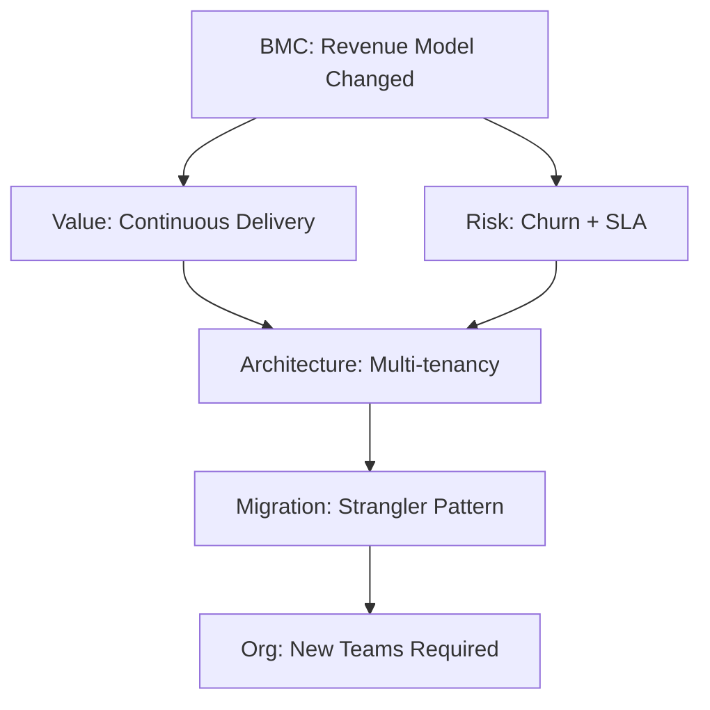

# Business-Architecture Translation: Interview Assessment Generator

Generate scenario-based interview questions with cited answers assessing how technical leaders translate business strategy into architectural decisions.

## Objective

**Task**: Generate 25-30 interview questions (150-300 words each) evaluating senior technical leaders' ability to map business models, value propositions, and constraints to architectural decisions.

**Scope & Constraints**:
- **Focus**: Business-to-architecture translation only; excludes algorithmic coding, trivia, junior technical assessments
- **Depth**: Senior engineer to architect level (5-15 years experience)
- **Time**: Each question designed for 10-15 minute discussion in interviews
- **Format**: Text or JSON output; non-interactive assessment tool
- **Quality bar**: ≥70% citation coverage, ≥80% business-architecture traceability, 100% scenario-based (no recall questions)

**Assessment Coverage** (MECE - Mutually Exclusive, Collectively Exhaustive):
1. **Strategic Modeling**: Business model → architectural implications
2. **Value & Risk**: ROI calculations, trade-offs analysis, constraint mapping
3. **Documentation**: Communication patterns, Architecture Decision Records (ADRs)
4. **Organization**: Team topology alignment, Conway's Law implications
5. **Translation**: Business driver → technical decision with explicit mapping
6. **Evolution**: Technical debt management, migration strategies, roadmap planning

**Target Audience**: Senior engineers, architects, technical leads evaluating business-architecture alignment capabilities.

**Assumptions**: 
- LLM has knowledge of business frameworks: Business Model Canvas (BMC), Value Proposition Canvas, Domain-Driven Design (DDD), Conway's Law, Technical Debt, ADR, Wardley Mapping, Value Stream Mapping
- User provides specific business context or explicitly accepts generic scenarios
- Output format is text/JSON (non-interactive)

## Required Input

**`business_context`** (string): Industry, business model, key constraints
- Example: "SaaS B2B, subscription revenue, healthcare regulatory compliance, legacy migration"
- Must specify: industry sector, revenue model (B2B/B2C), primary constraints (regulatory/scale/technical)

**Optional Configuration**:
- `focus_area` (default: all): Limit to specific dimension(s) from Assessment Coverage
- `complexity` (default: architect): senior (5-8 yrs) | architect (8-12 yrs) | expert (12+ yrs)
- `output_format` (default: text): text | json | markdown
- `confidence_threshold` (default: medium): 
  - high (≥2 authoritative sources, established consensus)
  - medium (≥1 source, emerging practice)
  - low (limited/conflicting sources, flag explicitly)

## Output Structure

**Text Format Requirements**: Generate 25-30 questions, each must include:
- **Question**: Scenario-based format ("How would you..." or "Given... what would you...") requiring judgment, not recall
- **Difficulty**: Tag as foundational (20% ±5%) | intermediate (40% ±5%) | advanced (40% ±5%)
- **Answer**: 150-300 words with inline citations [Ref: ID], covering business analysis → architecture translation → trade-offs
- **Key Insight**: One concrete, specific insight (e.g., "subscription revenue requires usage metering but legacy assumes one-time delivery") - avoid vague statements
- **Visual Artifacts**: Mermaid diagram + comparison table + quantitative formula per dimension cluster
- **Traceability**: Explicit Business→Architecture mapping with citations showing how each business driver translates to technical decision

**JSON Format**:
```json
{
  "questions": [{
    "id": "Q1",
    "difficulty": "foundational|intermediate|advanced",
    "dimension": "strategic_modeling|value_risk|documentation|organization|translation|evolution",
    "question": "How would you...",
    "answer": "150-300 words with [Ref: ID]",
    "key_insight": "Concrete misalignment/trade-off/impedance",
    "artifacts": {"diagram": "mermaid", "table": "markdown", "formula": "$$ROI = ...$$"},
    "citations": ["Ref: A1", "Ref: G3"],
    "confidence": "low|medium|high"
  }],
  "validation": {
    "total": 27,
    "difficulty_distribution": {"foundational": 5, "intermediate": 11, "advanced": 11},
    "citation_coverage": "82%",
    "business_architecture_mapping": "89%"
  }
}
```

## Generation Procedure

Follow these steps sequentially. Each step builds on the previous.

**Step 1: Parse Context** (Apply MECE)

Extract from `business_context`:
- **Business model**: customer segments, value propositions, revenue streams, channels, partnerships, resources, activities, relationships, cost structure
- **Constraints**: Regulatory (SOC2/GDPR/HIPAA/PCI), technical (legacy/platforms), organizational (teams/skills), market (competition/time/budget)
- **Risks**: Business (churn/competition), operational (SLA/scale), regulatory (compliance/sovereignty)

**Step 2: Distribute Questions** (Balanced coverage)

Allocate 25-30 questions:
- **6 Dimensions**: 4-6 per dimension
- **3 Difficulty Levels**:
  - Foundational 20% (±5%): Single framework (BMC only or Conway's Law only)
  - Intermediate 40% (±5%): Multi-framework (BMC + Risk + organizational)
  - Advanced 40% (±5%): Complex trade-offs with migration paths, quantitative analysis, multi-constraint optimization

**Step 3: Generate Each Question** (Consistent structure)

- **Question**: "How would you [action] given [context] considering [constraints]?"
  - Example: "How would you design multi-region deployment given SaaS B2B subscription with GDPR and 99.95% SLA?"

- **Answer** (150-300 words):
  1. **Business Analysis** (50-70w): Apply framework (BMC/Value Prop/DDD), cite [Ref: ID], identify drivers
  2. **Architecture Translation** (70-100w): Map driver→requirement→decision with citations, explicit trace
  3. **Trade-offs & Risks** (50-80w): Alternatives, pros/cons, limitations, mitigations with [Ref: ID]

- **Traceability**: "Business driver X → Technical requirement Y → Architectural decision Z [Ref: ID]"

- **Insight**: One concrete misalignment/trade-off/impedance
  - ✅ "Subscription revenue requires real-time metering, legacy assumes batch billing"
  - ❌ "Alignment is important" (vague)

**Step 4: Create Artifacts** (One set per dimension)
- **Diagram** (Mermaid): Strategic→BMC/Value Stream | Risk→Decision Tree | Documentation→C4 | Organization→Team Topology | Translation→Business-Arch Map | Evolution→Migration Roadmap
- **Table** (4+ rows): Business driver | Technical requirement | Architectural decision | Priority
- **Formula** (LaTeX): ROI, Risk (P×I×E), Tech Debt %, NPV, Availability %

**Step 5: Validate Quality**

| Criterion | Target | Method |
|-----------|--------|--------|
| Count | 25-30 questions | Total |
| Difficulty | 20%/40%/40% (±5%) | Distribution |
| Length | 150-300 words/answer | Sample 5 |
| Citations | ≥70% (≥1 source), ≥30% (≥2) | All answers |
| Traceability | ≥80% explicit business→arch | Audit |
| Scenario | ≥70% judgment (not recall) | Type check |
| Visuals | ≥90% with diagram+table+formula | Per dimension |
| Insights | 100% concrete (not vague) | All |

**Step 6: Compile References**
- **Glossary** (≥10): See Key Terms Reference
- **Tools** (≥5): Miro, ArchiMate, C4, Confluence, LucidChart (with pricing, adoption, integrations)
- **Literature** (≥6): Osterwalder, Evans, Vernon, Conway, Hohpe, Richardson, Zhou, Zhang, Xiao
- **Citations** (≥12 APA 7th): EN/ZH, ≥50% recent (<3yr) for digital/cloud

## Quality Standards

**MECE Coverage**: 6 dimensions × 4 perspectives (strategic, operational, organizational, architectural) = complete, non-overlapping

**Answer Requirements**:
- ✅ Framework analysis [Ref: ID] | Business→arch trace | Concrete insight | Trade-offs with alternatives
- ❌ Recall questions | Vague insights | Missing connections

**Confidence**:
- **High** (≥2 sources, consensus): Cite authorities
- **Medium** (≥1 source, emerging): State reasoning + assumptions  
- **Low** (limited/conflicting): Flag explicitly

**Citations**: Inline [Ref: ID] → APA 7th with [EN]/[ZH]
- Example: [Ref: A1] Osterwalder, A., & Pigneur, Y. (2010). *Business model generation*. Wiley. [EN]

## Example Output

**Q1: How would you translate perpetual licensing → subscription SaaS architecturally?**

**Difficulty**: Advanced | **Dimension**: Strategic Modeling + Translation

**Answer** (248 words):

BMC analysis [Ref: A1]: Revenue Streams (upfront→recurring), Customer Relationships (transactional→continuous), Key Activities (+customer success), Value Propositions (+continuous delivery/uptime/velocity), Customer Segments (→multi-tier) [Ref: A7].

Risks [Ref: A12]: Business (churn, downtime revenue loss), operational (SLA 99.9%+), regulatory (data residency, SOC2/GDPR).

Architecture [Ref: A16]: (1) Multi-tenancy with isolation [Ref: A7], (2) Usage metering via event streaming [Ref: A6], (3) Feature flags for tier control [Ref: A11], (4) HA/DR for SLA, (5) Multi-region for compliance.

Tech debt: Legacy licensing/offline/on-prem → Strangler pattern [Ref: A10] to cloud multi-tenant.

Organization (Conway's Law [Ref: A5]): Add Customer Success, DevOps, SRE; document via ADR [Ref: G7].

**Key Insight**: Subscription's continuous delivery conflicts with legacy one-time deployment—requires redesign, not incremental change.



| Business Driver | Technical Requirement | Architectural Decision | Priority |
|----------------|----------------------|------------------------|----------|
| Recurring revenue | Usage tracking + billing | Event streaming + billing API | High |
| Multi-tier segments | Feature differentiation | Feature flags + quota engine | High |
| SLA 99.9%+ | High availability | HA/DR + real-time monitoring | Critical |
| Data residency | Regional compliance | Multi-region deployment | High |

**Formula**: $$ROI = \frac{Recurring\_Revenue - Migration\_Cost}{Migration\_Cost} \times 100\%$$

**Citations**: [Ref: A1] Osterwalder BMC, [Ref: A5] Conway's Law, [Ref: A6] Hohpe Integration, [Ref: A7] Richardson Microservices, [Ref: A10] Fowler Patterns, [Ref: A11] Humble CD, [Ref: A12] Kim DevOps, [Ref: A16] Newman Microservices, [Ref: G7] ADR

**Confidence**: High

---

## Edge Cases

**Missing Context**: 
- No `business_context` → Request: "Specify: (1) Industry, (2) Model (B2B/B2C, revenue), (3) Constraints. Use generic SaaS B2B?"
- Partial → Proceed with assumptions, document limits

**Adjustments**:
- Speed → 15-20 questions, simple visuals, medium confidence
- Depth → 30 questions, full artifacts, high confidence
- Cost → Generic reusable, no customization
- Quality → Custom, unique, validated

**Validation Failures** (fix then re-validate):
- <70% citations → Add references
- <80% traceability → Explicit business→arch with [Ref: ID]
- <70% scenario → Rewrite recall as judgment

## Key Terms Reference

**Business Model Canvas (BMC)**: 9-block framework (Customer Segments, Value Propositions, Channels, Customer Relationships, Revenue Streams, Key Resources, Key Activities, Key Partnerships, Cost Structure) mapping strategy to operations.

**Value Proposition**: Customer value bundle → technical features, quality attributes, architectural priorities.

**Domain-Driven Design (DDD)**: Ubiquitous language, bounded contexts, aggregates → guides microservices decomposition and team organization.

**Bounded Context**: Explicit model boundary → defines microservice boundaries and integration contracts.

**Conway's Law**: "Organizations design systems mirroring their communication structure" → team topology affects architecture.

**Technical Debt**: Future rework cost from quick solutions. Types: code, architectural, knowledge. Quantified as % capacity or cost.

**Architecture Decision Record (ADR)**: Immutable log of context, decision, consequences, trade-offs → ensures transparency.

**Wardley Mapping**: Value chain by visibility × evolution stage (genesis→custom→product→commodity) → identifies opportunities.

**Value Stream Mapping**: Lean technique visualizing delivery steps → highlights waste, optimizes lead time.