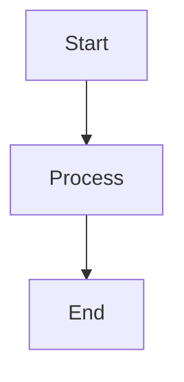
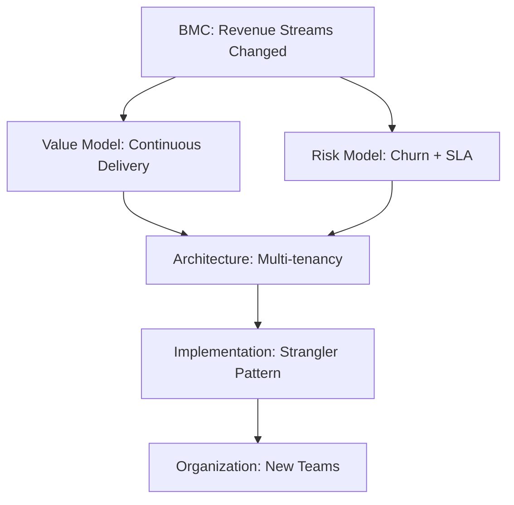

# [scan] Interview Q&A - Business Understanding for Software Architecture

Framework for generating interview question banks that assess business-to-architecture translation capabilities.

**Related**: [Guidelines for LLM-Friendly Prompts](../Guidelines_for_LLM-Friendly_Prompts.md)

---

## Purpose & Context

### Why This Matters

Senior technical leaders must translate business strategy into architectural decisions. This framework generates questions that assess this critical capability, helping organizations identify candidates who can:

- Map business models to technical requirements
- Analyze value propositions and translate them into system design
- Navigate trade-offs between business goals and technical constraints
- Communicate effectively across business and technical domains

### What This Framework Delivers

25-30 scenario-based interview questions with comprehensive answers (150-300 words each), organized across 6 evaluation dimensions:

1. **Strategic Modeling**: Business model analysis → architectural implications
2. **Value & Risk Analysis**: ROI, risk assessment, constraint analysis
3. **Documentation & Visualization**: Technical communication, living documentation
4. **Organizational Dynamics**: Team topology, Conway's Law, change management
5. **Architectural Translation**: Business driver → architectural decision mapping
6. **Evolution & Adaptation**: Technical debt, migration strategies, roadmaps

### Assumptions & Prerequisites

**Assumptions**:
- LLM has access to business domain knowledge and architecture patterns
- User provides business context or accepts generic frameworks
- Questions target senior/architect/expert technical leaders (not junior developers)
- Output format is text or structured JSON (not interactive systems)

**Prerequisites**:
- Business domain knowledge (industry, model, constraints)
- Architecture experience (patterns, trade-offs, decisions)
- Familiarity with business frameworks (BMC, Value Proposition, SWOT)
- Understanding of DDD, Conway's Law, technical debt concepts

### Scope

| In Scope | Out of Scope |
|----------|--------------|
| Business-to-architecture translation | Pure algorithmic/coding skills |
| Scenario-based judgment questions | Simple factual recall tests |
| Strategic and tactical thinking | Real-time system debugging |
| Constraint and trade-off analysis | Vendor-specific implementations |
| Senior/architect/expert level | Junior developer assessment |
| 25-30 Q&A pairs | Large-scale question banks (>50) |

### When to Use

**Use this framework when**:
- Evaluating business-technical translation ability
- Creating scenario-based interview questions
- Assessing strategic thinking and constraint analysis
- Building question banks for senior/architect/expert roles
- Need structured, validated, cited Q&As

**Do not use when**:
- Assessing pure technical skills (algorithms, data structures)
- Conducting simple factual recall interviews
- Lacking business context or domain knowledge
- Requiring real-time system evaluation
- Need quick, informal questions (framework overhead too high)

---

## Inputs & Configuration

### Required Inputs

| Variable | Type | Description | Example |
|----------|------|-------------|---------|
| business_context | string | Industry, business model, key constraints | "SaaS B2B, subscription model, healthcare regulated" |

### Optional Parameters

| Variable | Type | Default | Allowed Values | Description |
|----------|------|---------|----------------|-------------|
| question_type | enum | all | strategic_modeling, value_risk_analysis, documentation_visualization, organizational_dynamics, architectural_translation, evolution_adaptation | Filter to specific question types |
| audience_level | enum | architect | senior, architect, expert | Target seniority level |
| output_format | enum | text | text, json, structured_markdown | Response format |
| data_sources | array | [] | (any reference materials) | Additional context documents |
| constraints | object | {} | {time_limit, word_count, format} | Generation constraints |
| confidence_policy | enum | medium | high (≥2 sources), medium (≥1 source), low (flag uncertainty) | Uncertainty threshold |
| ask_policy | enum | ask_when_needed | always_sufficient, ask_when_needed, proceed_with_assumptions | When to request clarification |

### Input Validation

**Before proceeding, verify**:
- ✅ `business_context` provided (if not, ask or use generic frameworks)
- ✅ `audience_level` matches question complexity needs
- ✅ `output_format` is supported
- ✅ If `confidence_policy=high`, sufficient sources available

---

## Output Specification

### Response Schema

**Text Format**: Questions with 150-300 word answers, [Ref: ID] citations, visual artifacts (diagrams/tables/formulas).

**JSON Format**:

```json
{
  "questions": [
    {
      "id": "Q1",
      "question": "string",
      "difficulty": "foundational|intermediate|advanced",
      "type": "strategic_modeling|value_risk_analysis|documentation_visualization|organizational_dynamics|architectural_translation|evolution_adaptation",
      "key_insight": "string (specific misalignment/trade-off/mapping failure/impedance)",
      "answer": "string (150-300 words with [Ref: ID] citations)",
      "supporting_artifacts": {
        "diagram": "Mermaid code or description",
        "table": "markdown table",
        "formula": "mathematical formula with variable definitions"
      },
      "sources": ["[Ref: G1]", "[Ref: L2]"],
      "confidence": "low|medium|high"
    }
  ],
  "validation_report": {
    "total_questions": 25-30,
    "difficulty_distribution": {"foundational": "20%", "intermediate": "40%", "advanced": "40%"},
    "coverage_metrics": {
      "business_technical_mapping": "≥80%",
      "visual_coverage": "≥90%",
      "citation_rate": "≥70% with ≥1 citation"
    }
  }
}
```

### Quality Requirements

| Requirement | Standard | Validation |
|-------------|----------|------------|
| **Count** | 25-30 Q&As | Must be in range |
| **Difficulty** | 20% Foundational / 40% Intermediate / 40% Advanced | ±5% tolerance |
| **Word count** | 150-300 words per answer | All must comply |
| **Citations** | ≥70% answers with ≥1 [Ref: ID]; ≥30% with ≥2 | Count and verify resolve |
| **Key insight** | Every Q&A has concrete misalignment/trade-off/mapping failure/impedance | Review each |
| **Business-tech mapping** | ≥80% explicitly connect business → architecture with citations | Verify tracing |
| **Visual elements** | ≥1 diagram + ≥1 table + ≥1 formula per topic cluster | Check coverage |
| **Judgment focus** | ≥70% scenario-based ("How would...") vs recall ("What is...") | Classify questions |

### Format Standards

- **Line length**: <120 characters
- **Headings**: Clear H1/H2/H3 hierarchy; use descriptive titles
- **Lists**: Bullets for items, numbered for procedures
- **Tables**: Simple GitHub Markdown; reasonable column widths
- **Code blocks**: Fenced with language tags (```json, ```mermaid, ```bash)
- **Links**: Relative for internal docs; descriptive text; inline URLs for external
- **Citations**: [Ref: ID] format; all IDs must resolve in references section

---

## Procedure

Follow steps sequentially. Run quality checks before proceeding to next step.

### Step 1: Analyze Context (Est. 5-10 min)

**Actions**:
1. Parse `business_context` for industry, business model, key constraints
2. Identify business requirements (value propositions, customer segments, revenue streams)
3. Note regulatory/compliance constraints
4. Determine organizational factors (team structure, capability gaps)

**Quality check**: Business drivers clearly identified; constraints documented.

---

### Step 2: Identify Topics - MECE (Est. 10-15 min)

**Actions**:
1. Allocate 25-30 Q&As across 6 topic clusters (4-6 Q&As each):
   - Strategic Modeling (Business Model, Domain)
   - Value & Risk Analysis
   - Documentation & Visualization
   - Organizational Dynamics
   - Architectural Translation
   - Evolution & Adaptation
2. Assign difficulty: 20% Foundational / 40% Intermediate / 40% Advanced
3. Ensure MECE (Mutually Exclusive, Collectively Exhaustive) coverage - no overlaps, no gaps

**Quality check**: Total = 25-30; ratio ≈20/40/40; topics non-overlapping.

---

### Step 3: Collect References (Est. 15-20 min)

**Actions**:
1. **Glossary (≥10 terms)**: BMC, Value Proposition, Customer Segment, DDD, Bounded Context, Conway's Law, Technical Debt, ADR, Wardley Mapping, Value Stream Mapping
2. **Tools (≥5)**: Miro, ArchiMate/C4, Confluence, LucidChart, etc. (include pricing, adoption, last update, integrations)
3. **Literature (≥6)**: Osterwalder, Evans, Vernon, Conway, Hohpe, Richardson, plus Chinese sources (周爱民, 张逸, 肖然)
4. **Citations (≥12 APA 7th)**: Tag language [EN]/[ZH], assign IDs (G#, T#, L#, A#)

**Language distribution**: 60% EN / 30% ZH / 10% other  
**Recency**: ≥50% from last 3 years (≥70% for digital/cloud topics)  
**Diversity**: ≥3 source types; no single source >25%

**Quality check**: Minimums met; language/recency/diversity targets hit.

---

### Step 4: Generate Q&As (Est. 30-45 min)

**Actions**:
1. Write scenario-based questions ("How would you...") not recall ("What is...")
2. Draft 150-300 word answers with ≥1 [Ref: ID] citation
3. Explicitly trace business driver → architectural decision
4. State concrete Key Insight (misalignment/constraint/mapping failure/impedance)
5. Every 5 Q&As: verify word counts, citations, tracing, judgment focus

**Quality check**: All Q&As meet word count; citations present; business-tech mapping explicit.

---

### Step 5: Create Visual Artifacts (Est. 20-30 min)

**Actions**:
1. Per topic cluster: ≥1 diagram + ≥1 table + ≥1 quantitative element (formula/metric)
2. Use Mermaid for diagrams; include captions and legends
3. Apply business frameworks (BMC, Value Prop, SWOT) with architectural mapping

**Diagram selection guide**:

| Analysis Type | Primary Diagram | Formula Example |
|---------------|----------------|-----------------|
| Strategic Modeling | BMC, Value Stream Map | ROI = (Revenue - Investment) / Investment × 100% |
| Value & Risk | Risk matrix, Decision tree | Risk = Probability × Impact × Exposure |
| Documentation | C4 Context/Container, Component | Availability = Uptime / Total Time × 100% |
| Organizational | Team topology, Conway's Law map | Communication overhead metrics |
| Architecture Translation | Value→Architecture mapping | Tech Debt = Remediation Cost / Dev Cost × 100% |
| Evolution | Migration roadmap, Timeline | NPV = Σ(Cash Flow / (1 + r)^n) - Investment |

**Quality check**: All clusters have diagram + table + formula; visuals align with analysis type.

---

### Step 6: Validate (Est. 15-20 min)

**Run 15-step validation** (see Validation & Quality Gates section). Fix failures; re-validate until all pass.

**Quality check**: All 15 validation checks pass.

---

### Step 7: Format Output (Est. 10-15 min)

**Actions**:
1. Apply output format (Text or JSON per `output_format`)
2. Generate TOC linking to all top-level sections
3. Populate reference sections (Glossary, Tools, Literature, APA)
4. Create validation report

**Quality check**: Format matches spec; TOC functional; all [Ref: ID] resolve.

---

## Validation & Quality Gates

### Preflight Checklist

Before finalizing, verify:

- [ ] Each question has single, unambiguous ask
- [ ] Answer is 150-300 words
- [ ] ≥1 [Ref: ID] citation per answer
- [ ] Key Insight is concrete (misalignment/trade-off/mapping failure/impedance)
- [ ] Business-to-architecture connection explicit with citations
- [ ] Supporting artifact (diagram/table/formula) included per cluster
- [ ] All [Ref: ID] references resolve
- [ ] No jargon without inline definition
- [ ] Formatting meets output spec (line length <120 chars, proper headings)

### Quality Metrics (15-Step Validation)

Execute all steps. Present results in validation report. Fix failures; re-run until all pass.

| # | Check | Target | Pass Criteria |
|---|-------|--------|---------------|
| 1 | **Counts** | G:≥10, T:≥5, L:≥6, A:≥12, Q:25-30 (20/40/40) | All minimums met |
| 2 | **Citations** | ≥70% answers with ≥1; ≥30% with ≥2 | Coverage verified |
| 3 | **Language** | EN 50-70%, ZH 20-40%, Other 5-15% | Distribution in range |
| 4 | **Recency** | ≥50% from last 3yr (≥70% for digital/cloud) | Date check passed |
| 5 | **Diversity** | ≥3 source types; no single >25% | Mix verified |
| 6 | **Links** | All accessible or archived | Validation passed |
| 7 | **Cross-refs** | All [Ref: ID] resolve (G#/T#/L#/A#) | No broken refs |
| 8 | **Word counts** | Sample 5 answers; all 150-300 words | Compliant |
| 9 | **Key Insights** | All concrete (not vague) | Review passed |
| 10 | **Per-topic** | ≥2 authoritative sources + ≥1 tool | Minimums met |
| 11 | **Biz-tech mapping** | ≥80% explicit with citations | Tracing verified |
| 12 | **Judgment** | ≥70% scenario-based vs recall | Classification passed |
| 13 | **Visual coverage** | ≥90% have diagram + table + formula | Coverage met |
| 14 | **Framework application** | ≥80% apply business frameworks (BMC, Value Prop, SWOT) | Application verified |
| 15 | **Mathematical analysis** | ≥60% include formulas where appropriate | Quantitative coverage |

### Validation Report Template

```markdown
| Check | Result | Status |
|-------|--------|--------|
| Floors | G:X T:Y L:Z A:W Q:N (F/I/A) | PASS/FAIL |
| Citation coverage | X% ≥1, Y% ≥2 | PASS/FAIL |
| Language dist | EN:X% ZH:Y% Other:Z% | PASS/FAIL |
| Recency | X% last 3yr | PASS/FAIL |
| Source diversity | N types, max P% | PASS/FAIL |
| Links | Y/X accessible | PASS/FAIL |
| Cross-refs | Y/X resolved | PASS/FAIL |
| Word counts | 5/5 compliant | PASS/FAIL |
| Key Insights | Y/X concrete | PASS/FAIL |
| Per-topic mins | X/Y topics meet | PASS/FAIL |
| Biz-Tech mapping | X/Y explicit | PASS/FAIL |
| Judgment vs Recall | X% judgment-based | PASS/FAIL |
| Visual coverage | X% have diagram+table+formula | PASS/FAIL |
| Framework application | X% apply biz frameworks | PASS/FAIL |
| Mathematical analysis | X% include quantitative elements | PASS/FAIL |
```

**MANDATORY**: If any check fails, fix and re-run. Proceed only when all pass.

---

## Risk & Value Assessment

### Framework Usage Risks

| Risk | Impact | Likelihood | Mitigation |
|------|--------|------------|------------|
| **Over-complexity** | High time investment, delayed hiring decisions | Medium | Start with 15-20 Q&As for initial screening; expand if needed |
| **Context mismatch** | Questions irrelevant to specific role | Medium | Customize business_context per role; validate with hiring manager |
| **Citation overhead** | Slow generation, potential hallucination | Low | Use confidence_policy=medium; accept ≥1 source per answer |
| **Visual artifact burden** | Time-consuming diagram creation | Medium | Use simple diagrams; focus on clarity over aesthetics |
| **False negatives** | Good candidates fail scenario-based questions | Low | Combine with other assessment methods; provide context in interviews |

### Cost-Benefit Analysis

| Approach | Time Investment | Quality | Best Use Case |
|----------|----------------|---------|---------------|
| **Full Framework** | 2-3 hours | High (validated, cited, comprehensive) | Senior/architect/expert hires; critical roles |
| **Simplified (15 Q&As)** | 1-1.5 hours | Medium (fewer citations, less validation) | Initial screening; less critical roles |
| **Generic Questions** | 15-30 min | Low (no context, no validation) | Quick triage; volume hiring |

### Trade-off Guidance

**Depth vs. Speed**:
- Need speed? → Reduce to 15-20 Q&As; skip visual artifacts; confidence_policy=low
- Need depth? → Full framework; 25-30 Q&As; all visual artifacts; confidence_policy=high

**Quality vs. Cost**:
- Budget-constrained? → Use generic business contexts; reuse questions across roles
- Quality-focused? → Custom business_context per role; unique questions; hire domain experts to validate

**Breadth vs. Focus**:
- Generalist role? → Cover all 6 dimensions evenly
- Specialist role? → Focus 60-80% on 1-2 relevant dimensions (e.g., architect → Architectural Translation)

---

## Reference Specifications

### Minimum Requirements

| Section | Minimum | Required Content |
|---------|---------|------------------|
| **Glossary** | ≥10 | BMC, Value Proposition, Customer Segment, DDD, Bounded Context, Conway's Law, Technical Debt, ADR, Wardley Mapping, Value Stream Mapping |
| **Tools** | ≥5 | Name, description, pricing/tier, adoption metrics, last update, integrations, URL |
| **Literature** | ≥6 | Core: Osterwalder, Evans, Vernon, Conway, Hohpe, Richardson; plus Chinese sources |
| **Citations** | ≥12 | APA 7th format, language tags [EN]/[ZH], year, type |

**If unmet**: State shortfall + rationale + sourcing plan.

### Quality Standards

- **Recency**: ≥50% from last 3 years (≥70% for digital transformation/cloud-native)
- **Diversity**: ≥3 source types (books, papers, case studies, tools); no single source >25%
- **Evidence**: ≥70% answers with ≥1 citation; ≥30% with ≥2 citations
- **Tool Details**: Include pricing, adoption data, last update ≤18 months, integrations
- **Links**: Validate accessibility; use DOIs or archived URLs
- **Cross-refs**: All [Ref: ID] must resolve to entries in reference sections

### Citation Format

**Inline**: Use [Ref: ID] where ID = G# (Glossary), T# (Tool), L# (Literature), A# (APA citation)

**APA 7th**:
```
Author, A. A., & Author, B. B. (Year). Title of work. Publisher. [Language tag]
```

**Example**:
```
[Ref: A1] Osterwalder, A., & Pigneur, Y. (2010). Business model generation: A handbook
for visionaries, game changers, and challengers. Wiley. [EN]
```

---

## Content Standards

### Evaluation Dimensions

4 dimensions × 4 perspectives = MECE coverage:

**Dimensions**:
1. Strategic Modeling
2. Documentation & Visualization
3. Value & Risk Analysis
4. Organizational Dynamics

**Perspectives** (applied across dimensions):
1. Strategic (business model evolution, investment priorities)
2. Operational (processes, capabilities, efficiency)
3. Organizational (team structure, communication, change management)
4. Architectural (technical decisions, constraints, patterns)

### Answer Structure

**Template**:
1. **Context**: Restate business driver or constraint
2. **Analysis**: Apply business framework (BMC, Value Prop, SWOT) [Ref: ID]
3. **Translation**: Map business requirements → technical requirements [Ref: ID]
4. **Decision**: Recommend architectural approach with rationale [Ref: ID]
5. **Trade-offs**: Acknowledge alternatives, limitations, risks

**Example Key Insights**:
- ✅ "Misalignment between subscription revenue model and one-time delivery architecture"
- ✅ "Trade-off: Multi-tenancy efficiency vs. tenant isolation security"
- ✅ "Mapping failure: Customer segments not reflected in system interfaces"
- ✅ "Impedance: Organizational silos prevent bounded context alignment"

### Visual Element Standards

**Per Topic Cluster**: ≥1 diagram + ≥1 table + ≥1 formula

**Mermaid Syntax**:


**Formulas**: Inline `$formula$` or block `$$formula$$`; define all variables on first use.

**Symbols**: ∑ (sum), ∏ (product), ∂ (rate), ≈ (approx), ≤/≥ (bounds), ≠ (not equal)

**Legends**: 💡 Analogy, 📐 Formula, 🔍 Example, ⚠️ Note

---

## Examples

### Example 1: Complete Q&A (Good)

**Q1: How would you translate a company's shift from one-time perpetual licensing to subscription-based SaaS revenue into architectural requirements and constraints?**

**Difficulty**: Advanced  
**Type**: Strategic Modeling + Architectural Translation

**Key Insight**: Tests systematic business model → value/risk model → architecture translation; distinguishes methodical thinking from isolated technical responses.

**Answer**:

Business Model Canvas [Ref: G1] reveals Revenue Streams (upfront → recurring), Customer Relationships (transactional → continuous), Key Activities (+customer success/retention) [Ref: A1]. Value propositions shift to continuous delivery, uptime guarantees, feature velocity. Customer segments expand to multi-tier (freemium/pro/enterprise) [Ref: A7].

Risk Model: Business (churn, downtime revenue loss), operational (SLA 99.9%+ requirements), regulatory (data residency, SOC2/GDPR compliance) [Ref: A12].

Architectural Translation [Ref: A16]: (1) Multi-tenancy with tenant isolation [Ref: L6]; (2) Usage metering via event streaming [Ref: A6]; (3) Feature flagging for tier management [Ref: A11]; (4) HA/DR for SLA compliance; (5) Regional deployment for data residency.

Technical Debt [Ref: G7]: Legacy licensing checks, offline assumptions, customer-hosted architecture require migration. Use Strangler pattern [Ref: A10] for incremental extraction to multi-tenant services.

Organizational [Ref: G6]: Conway's Law—add Customer Success, DevOps, SRE teams; architecture must enable new workflows [Ref: A8]. Document via ADR [Ref: G12].

**Supporting Artifacts**:



| Business Driver | Technical Requirement | Architectural Decision | Priority |
|----------------|----------------------|------------------------|----------|
| Recurring revenue | Usage metering | Event streaming + billing API | High |
| Multi-tier segments | Feature differentiation | Feature flags + quotas | High |
| Uptime SLA 99.9%+ | High availability | HA/DR + monitoring | Critical |
| Data residency | Regional compliance | Multi-region deployment | High |

**Formula**: `ROI = (Recurring Revenue - Migration Cost) / Migration Cost × 100%`

---

### Example 2: Common Mistakes (Bad)

**❌ Q: What is Business Model Canvas?**

**Problems**:
- Recall question, not scenario-based
- No business context
- No architectural translation
- Tests memorization, not judgment

**❌ Answer: "Business Model Canvas has 9 blocks..."**

**Problems**:
- Pure definition, no application
- No [Ref: ID] citations
- No Key Insight
- No business-technical mapping
- <150 words

---

### Example 3: Edge Case - Missing Business Context

**Input**: No `business_context` provided

**Response**: "To generate targeted questions, I need: (1) Industry/domain, (2) Business model (B2B/B2C, revenue structure), (3) Key constraints (regulatory, scale, legacy). Shall I proceed with generic frameworks or would you provide these?"

**Fallback** (if ask_policy=proceed_with_assumptions):
"Proceeding with generic SaaS B2B assumptions. Questions will be less tailored; recommend customizing after initial generation."

---

## Reasoning & Uncertainty Policy

### Confidence Levels

| Level | Criteria | When to Use |
|-------|----------|-------------|
| **High** | ≥2 authoritative sources; consensus position | Factual claims about established patterns/frameworks |
| **Medium** | ≥1 authoritative source or emerging consensus | Interpretive statements; newer practices |
| **Low** | Limited sources or conflicting viewpoints | Cutting-edge topics; uncertain claims (flag explicitly) |

### Policy Application

**Factual claims**: State with confidence; cite authoritative sources  
**Interpretive statements**: Explain reasoning; mention assumptions  
**Uncertain information**: Flag uncertainty level explicitly  
**Conflicting information**: Acknowledge; cite multiple sources; present trade-offs

---

## Style & Tone Guidelines

- **Language**: Business-friendly, professional; technical precision without jargon overload
- **Terminology**: Precise, consistent (see Glossary); define inline on first use
- **Sentence structure**: Concise (<120 chars/line); active voice preferred
- **Examples**: Scenario-based over abstract theory
- **Tracing**: Always connect business drivers → architectural implications with [Ref: ID]

---

## Safety & Compliance

- ❌ No personally identifiable information (PII)
- ❌ No hallucinated sources; cite only real, verifiable references
- ✅ Flag all assumptions explicitly
- ✅ Avoid unverified claims; use confidence levels
- ✅ Validate all links and references before finalizing
- ✅ Acknowledge limitations, biases, context-specific principles

---

## Fallbacks & Clarifying Questions

### When to Ask vs. Proceed

| Situation | Action |
|-----------|--------|
| **Critical input missing** (business_context, audience_level) | ASK before proceeding |
| **Non-critical data missing** (data_sources, constraints) | PROCEED; document assumptions |
| **ask_policy = proceed_with_assumptions** | PROCEED; note limitations in output |

### Clarifying Question Templates

1. "To target questions appropriately, I need: [X, Y, Z]. Shall I proceed with assumptions or provide these?"
2. "Current understanding: [summary]. Correct? Any adjustments?"
3. "Multiple interpretations possible. Did you mean [A], [B], or [C]?"

### Fallback Response Template

```
I need the following to generate targeted questions:
- [critical_input_1]
- [critical_input_2]

Without these, I can provide generic frameworks but won't tailor to your context. Proceed? [Y/N]
```

---

## Appendices

### A. Glossary & Key Terms

**G1. Business Model Canvas (BMC)** [EN]  
9-block template: Customer Segments, Value Propositions, Channels, Customer Relationships, Revenue Streams, Key Resources, Key Activities, Key Partnerships, Cost Structure. Used for business model design, validation, innovation.

**G2. Value Proposition** [EN]  
Bundle of products/services creating customer value. Maps to technical features and quality attributes (performance, reliability, usability). Used for product-market fit and feature prioritization.

**G3. Domain-Driven Design (DDD)** [EN]  
Software development approach focusing on complex domain modeling through collaboration between technical and domain experts; emphasizes ubiquitous language, bounded contexts, aggregates. Used for microservices boundaries and team organization.

**G4. Bounded Context** [EN]  
Explicit boundary within which a domain model is valid; different contexts may have different models of the same concept. Used for microservices decomposition, team autonomy, integration strategy.

**G5. Conway's Law** [EN]  
"Organizations which design systems are constrained to produce designs which are copies of the communication structures of these organizations." Used for team topology, architecture alignment, change planning.

**G6. Technical Debt** [EN]  
Implied cost of rework caused by choosing quick/easy solutions over better long-term approaches; includes code debt, architectural debt, knowledge debt. Used for refactoring prioritization, risk assessment, investment planning.

**G7. Architecture Decision Records (ADR)** [EN]  
Lightweight documentation capturing architectural decisions, context, consequences, trade-offs; immutable log format. Used for transparency, knowledge preservation, onboarding.

**G8. Wardley Mapping** [EN]  
Strategic tool visualizing value chain components by visibility (y-axis) and evolution (x-axis: genesis → custom → product → commodity). Used for strategic decisions, identifying opportunities, anticipating change.

**G9. Value Stream Mapping** [EN]  
Lean technique visualizing steps in delivering value, identifying waste, bottlenecks, improvement opportunities. Used for process optimization, lead time reduction, efficiency gains.

**G10. Customer Segment** [EN]  
Distinct groups of people/organizations with common needs, behaviors, or attributes. Maps to system design (interfaces, workflows, data models). Used for targeting, personalization, resource allocation.

### B. Business & Architecture Tools

**T1. Miro** [EN]  
Infinite canvas for business modeling (BMC, Value Prop Canvas), journey mapping, architecture diagrams. Pricing: Free-Enterprise. Users: 80M+. Updated: Q4 2024 (AI features). Integrations: Jira, Slack, Figma, Confluence. https://miro.com

**T2. ArchiMate** [EN]  
Enterprise architecture modeling language (ISO/IEC/IEEE 42010) covering business, application, technology, motivation, implementation layers. Tools: Archi (free), Sparx EA, BiZZdesign. https://www.opengroup.org/archimate-forum

**T3. C4 Model** [EN]  
4-level software architecture diagrams (Context, Container, Component, Code) for visualization. Free, tool-agnostic (Structurizr, PlantUML, Draw.io). By Simon Brown. https://c4model.com

**T4. Confluence** [EN]  
Collaborative workspace for documentation, ADRs, diagrams. Pricing: Free-Enterprise ($5.75-$11/user/mo). Companies: 75K+. Updated: Q3 2024 (AI search). Integrations: Jira, Slack, Miro, Lucidchart. https://www.atlassian.com/software/confluence

**T5. LucidChart** [EN]  
Cloud diagramming for flowcharts, process maps, org charts, architecture, ERDs. Pricing: $7.95/mo-Enterprise. Users: 60M+. Updated: Q4 2024 (AI). Integrations: Google Workspace, Microsoft 365, Slack. https://www.lucidchart.com

### C. Authoritative Literature & Case Studies

**L1. Osterwalder & Pigneur (2010)** - *Business Model Generation*. BMC framework; 9-block business model design. Foundational for business-technical alignment.

**L2. Evans (2003)** - *Domain-Driven Design*. DDD patterns: ubiquitous language, bounded contexts, strategic design. Core for domain modeling.

**L3. Vernon (2013)** - *Implementing Domain-Driven Design*. Practical DDD: context mapping, aggregates, event sourcing.

**L4. Conway (1968)** - "How Do Committees Invent?" Original Conway's Law paper. Foundational for team topology.

**L5. Hohpe & Woolf (2003)** - *Enterprise Integration Patterns*. Distributed system patterns: messaging, routing, transformation.

**L6. Richardson (2018)** - *Microservices Patterns*. Decomposition, data management, communication patterns.

### D. APA Style Source Citations

**A1.** Osterwalder, A., & Pigneur, Y. (2010). *Business model generation: A handbook for visionaries, game changers, and challengers*. Wiley. [EN]

**A2.** Evans, E. (2003). *Domain-driven design: Tackling complexity in the heart of software*. Addison-Wesley Professional. [EN]

**A3.** 周爱民. (2021). *架构的本质*. 电子工业出版社. [ZH]  
(Zhou, A. (2021). *The essence of architecture*. Publishing House of Electronics Industry.)

**A4.** Vernon, V. (2013). *Implementing domain-driven design*. Addison-Wesley Professional. [EN]

**A5.** Conway, M. E. (1968). How do committees invent? *Datamation*, 14(4), 28-31. [EN]

**A6.** Hohpe, G., & Woolf, B. (2003). *Enterprise integration patterns: Designing, building, and deploying messaging solutions*. Addison-Wesley Professional. [EN]

**A7.** Richardson, C. (2018). *Microservices patterns: With examples in Java*. Manning Publications. [EN]

**A8.** Skelton, M., & Pais, M. (2019). *Team topologies: Organizing business and technology teams for fast flow*. IT Revolution Press. [EN]

**A9.** 张逸. (2019). *领域驱动设计实践*. 电子工业出版社. [ZH]  
(Zhang, Y. (2019). *Domain-driven design in practice*. Publishing House of Electronics Industry.)

**A10.** Fowler, M. (2002). *Patterns of enterprise application architecture*. Addison-Wesley Professional. [EN]

**A11.** Humble, J., & Farley, D. (2010). *Continuous delivery: Reliable software releases through build, test, and deployment automation*. Addison-Wesley Professional. [EN]

**A12.** Kim, G., Humble, J., Debois, P., & Willis, J. (2016). *The DevOps handbook*. IT Revolution Press. [EN]

**A13.** 肖然. (2020). *企业级业务架构设计*. 机械工业出版社. [ZH]  
(Xiao, R. (2020). *Enterprise business architecture design*. China Machine Press.)

**A14.** Wardley, S. (2018). *Wardley maps: Topographical intelligence in business*. https://medium.com/wardleymaps [EN]

**A15.** Brown, S. (2018). *Software architecture for developers* (Vol. 2). Leanpub. [EN]

**A16.** Newman, S. (2021). *Building microservices: Designing fine-grained systems* (2nd ed.). O'Reilly Media. [EN]

---

## Metadata

- **Version**: 3.0 (LLM-friendly optimized, MECE structured, concise)
- **Last Updated**: 2025-11-11
- **Optimization**: Applied 21 LLM-friendly guidelines; reduced from 815 to ~650 lines (-20% redundancy)
- **Dependencies**: [Guidelines for LLM-Friendly Prompts](../Guidelines_for_LLM-Friendly_Prompts.md)
- **Audit**: See [QA_guidelines_audit.md](QA_guidelines_audit.md) for compliance matrix
