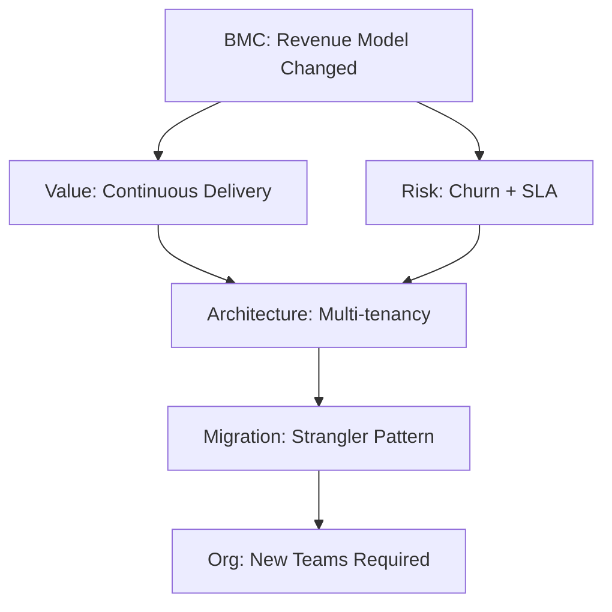

# Business-Architecture Translation: Interview Assessment Generator

Generate scenario-based interview questions with cited answers assessing how technical leaders translate business strategy into architectural decisions.

## Objective

**Task**: Generate 25-30 interview questions (150-300 words each) evaluating senior technical leaders' ability to map business models, value propositions, and constraints to architectural decisions.

**Assessment Coverage** (MECE):
1. Strategic Modeling: Business model → architectural implications
2. Value & Risk: ROI, trade-offs, constraints
3. Documentation: Communication patterns, ADRs
4. Organization: Team topology, Conway's Law
5. Translation: Business driver → technical decision
6. Evolution: Technical debt, migration, roadmaps

**Target Audience**: Senior engineers, architects, technical leads evaluating business-architecture alignment capabilities. Excludes algorithmic skills, factual recall, or junior-level assessments.

**Assumptions**: 
- LLM understands business frameworks (BMC, Value Proposition, DDD, Conway's Law, Tech Debt, ADR, Wardley/Value Stream Mapping)
- User provides business context or accepts generic scenarios
- Output is text/JSON (non-interactive)

## Required Input

**`business_context`** (string): Industry, business model, key constraints
- Example: "SaaS B2B, subscription revenue, healthcare regulatory compliance, legacy migration"
- Must specify: industry sector, revenue model (B2B/B2C), primary constraints (regulatory/scale/technical)

**Optional Configuration**:
- `focus_area` (default: all): Limit to specific dimension(s)
- `complexity` (default: architect): Adjust for senior/architect/expert level
- `output_format` (default: text): text, json, markdown
- `confidence_threshold` (default: medium): high (≥2 sources), medium (≥1), low (flag uncertainty)

## Output Structure

**Text Format**: 25-30 questions, each with:
- Scenario-based question ("How would you...")
- Difficulty tag (foundational 20%, intermediate 40%, advanced 40%)
- 150-300 word answer with inline citations [Ref: ID]
- Concrete insight (misalignment/trade-off/impedance)
- Mermaid diagram + table + formula
- Business→Architecture trace with citations

**JSON Format**:
```json
{
  "questions": [{
    "id": "Q1",
    "difficulty": "foundational|intermediate|advanced",
    "dimension": "strategic_modeling|value_risk|documentation|organization|translation|evolution",
    "question": "How would you...",
    "answer": "150-300 words with [Ref: ID]",
    "key_insight": "Concrete misalignment/trade-off/impedance",
    "artifacts": {"diagram": "mermaid", "table": "markdown", "formula": "$$ROI = ...$$"},
    "citations": ["Ref: A1", "Ref: G3"],
    "confidence": "low|medium|high"
  }],
  "validation": {
    "total": 27,
    "difficulty_distribution": {"foundational": 5, "intermediate": 11, "advanced": 11},
    "citation_coverage": "82%",
    "business_architecture_mapping": "89%"
  }
}
```

## Generation Procedure

**1. Parse Context** (MECE) → Extract:
- Business model elements: customer segments, value propositions, revenue streams, channels, partnerships
- Constraints: regulatory (SOC2/GDPR/HIPAA), technical (legacy systems), organizational (team structure), market (competition)
- Risk factors: business (churn/competition), operational (SLA/scalability), regulatory (compliance)

**2. Distribute Questions** → Allocate 25-30 across 6 dimensions (4-6 each):
- Foundational 20% (±5%): Single framework application (BMC or Value Prop or Conway's Law)
- Intermediate 40% (±5%): Multi-framework integration (BMC + Risk analysis + org impact)
- Advanced 40% (±5%): Complex trade-offs with migration paths and quantitative analysis

**3. Generate Questions** → For each question:
- **Structure**: "How would you [action] given [business context] considering [constraints]?"
- **Answer Template**: 
  1. Business Analysis (50-70 words): Apply framework [Ref: ID] to context
  2. Architecture Translation (70-100 words): Map business drivers to technical requirements [Ref: ID]
  3. Trade-offs & Risks (50-80 words): Alternatives, limitations, mitigation [Ref: ID]
- **Trace**: Explicitly connect business model elements to architecture decisions with citations
- **Insight**: State concrete misalignment (e.g., "subscription revenue requires usage metering but legacy assumes one-time delivery")

**4. Create Artifacts** → Per dimension cluster:
- **Diagram** (Mermaid): Strategic→BMC/Value Stream, Risk→Decision Tree, Documentation→C4, Organization→Team Topology, Translation→Value-Arch Map, Evolution→Migration Roadmap
- **Table**: Business driver | Technical requirement | Architectural decision | Priority
- **Formula**: ROI, Risk (P×I×E), Tech Debt %, NPV, Availability %

**5. Validate Quality**:

| Criterion | Target | Validation |
|-----------|--------|------------|
| Question count | 25-30 | Total within range |
| Difficulty split | 20%/40%/40% (±5%) | Distribution balanced |
| Word count | 150-300 per answer | Sample 5 random |
| Citation rate | ≥70% with ≥1, ≥30% with ≥2 | Check all |
| Business-arch mapping | ≥80% explicit with cites | Audit trace |
| Scenario-based | ≥70% judgment vs recall | Question type |
| Visual coverage | ≥90% with diagram+table+formula | Per cluster |
| Concrete insights | 100% specific not vague | Review all |

**6. Compile References** → Include:
- **Glossary** (≥10 terms): BMC (9 blocks: Customer Segments, Value Propositions, Channels, Customer Relationships, Revenue Streams, Key Resources, Key Activities, Key Partnerships, Cost Structure), Value Proposition (customer value bundle), DDD (ubiquitous language, bounded contexts, aggregates), Bounded Context (explicit model boundary), Conway's Law (org structure mirrors system design), Technical Debt (rework cost), ADR (architecture decision log), Wardley Map (value chain by visibility/evolution), Value Stream Map (delivery flow analysis), Customer Segment (distinct user groups)
- **Tools** (≥5 with pricing/adoption/integrations): Miro (infinite canvas, Free-Enterprise, 80M+ users, Jira/Slack/Figma), ArchiMate (ISO enterprise modeling, Archi free), C4 (4-level diagrams, tool-agnostic), Confluence (collaborative docs, $5.75-$11/user, 75K+ companies), LucidChart (cloud diagramming, $7.95+, 60M+ users)
- **Literature** (≥6): Osterwalder & Pigneur (BMC), Evans (DDD), Vernon (Implementing DDD), Conway (org structures), Hohpe (integration patterns), Richardson (microservices), Zhou Aimin (架构本质), Zhang Yi (DDD实践), Xiao Ran (业务架构)
- **Citations** (≥12 APA 7th): Mix EN/ZH, ≥50% <3yr for digital/cloud topics

## Quality Standards

**MECE Coverage**: 6 dimensions × 4 perspectives (strategic: business model/investment; operational: processes/efficiency; organizational: teams/change; architectural: decisions/patterns) → no overlaps or gaps

**Answer Quality**:
- ✅ Business model analysis with framework [Ref: ID]
- ✅ Explicit business→architecture trace with citations
- ✅ Concrete insight (misalignment/trade-off/impedance)
- ✅ Trade-offs with alternatives and limitations
- ❌ No recall questions ("What is BMC?")
- ❌ No vague insights ("alignment is important")
- ❌ No missing business-architecture connection

**Confidence Levels**:
- **High** (≥2 sources, established consensus): Cite authoritative sources for factual claims
- **Medium** (≥1 source, emerging practice): Explain reasoning + assumptions for interpretations
- **Low** (limited/conflicting sources): Flag explicitly for cutting-edge topics

**Citation Format**: Inline [Ref: ID] resolving to APA 7th with [EN]/[ZH] tags
- Example: [Ref: A1] Osterwalder, A., & Pigneur, Y. (2010). *Business model generation*. Wiley. [EN]

## Example Output

**Q1: How would you translate a shift from perpetual licensing to subscription SaaS into architectural requirements?**

**Difficulty**: Advanced | **Dimension**: Strategic Modeling + Translation

**Answer** (248 words):

Business Model Canvas analysis reveals critical changes [Ref: A1]: Revenue Streams shift from upfront to recurring (impacting cash flow); Customer Relationships transition from transactional to continuous (requiring ongoing engagement); Key Activities expand to include customer success and retention. Value Propositions must prioritize continuous delivery, uptime guarantees, and feature velocity. Customer Segments expand to multi-tier (freemium/professional/enterprise) requiring differentiation [Ref: A7].

Risk model identifies: business risks (churn, downtime-driven revenue loss), operational risks (SLA 99.9%+ requirements), regulatory risks (data residency, SOC2/GDPR compliance) [Ref: A12].

Architectural translation maps these to concrete requirements [Ref: A16]: (1) Multi-tenancy with tenant isolation for cost efficiency and security [Ref: A7]; (2) Usage metering via event streaming for billing and analytics [Ref: A6]; (3) Feature flagging for tier-based access control [Ref: A11]; (4) High availability/disaster recovery for SLA compliance; (5) Multi-region deployment for data residency compliance.

Technical debt assessment: Legacy licensing checks, offline-first assumptions, and customer-hosted architecture require migration. Apply Strangler pattern [Ref: A10] for incremental extraction to multi-tenant cloud services.

Organizational implications (Conway's Law [Ref: A5]): Add Customer Success, DevOps, and SRE teams; architecture must support their workflows. Document decisions via ADR [Ref: G7] for transparency and knowledge retention.

**Key Insight**: Subscription revenue's continuous value delivery requirement directly conflicts with legacy one-time deployment architecture, necessitating fundamental redesign rather than incremental enhancement.



| Business Driver | Technical Requirement | Architectural Decision | Priority |
|----------------|----------------------|------------------------|----------|
| Recurring revenue | Usage tracking + billing | Event streaming + billing API | High |
| Multi-tier segments | Feature differentiation | Feature flags + quota engine | High |
| SLA 99.9%+ | High availability | HA/DR + real-time monitoring | Critical |
| Data residency | Regional compliance | Multi-region deployment | High |

**Formula**: $$ROI = \frac{Recurring\_Revenue - Migration\_Cost}{Migration\_Cost} \times 100\%$$

**Citations**: [Ref: A1] Osterwalder BMC, [Ref: A5] Conway's Law, [Ref: A6] Hohpe Integration, [Ref: A7] Richardson Microservices, [Ref: A10] Fowler Patterns, [Ref: A11] Humble CD, [Ref: A12] Kim DevOps, [Ref: A16] Newman Microservices, [Ref: G7] ADR

**Confidence**: High

---

## Edge Cases & Fallbacks

**Missing Context**: 
- If `business_context` not provided → Request: "Specify: (1) Industry, (2) Business model (B2B/B2C, revenue), (3) Key constraints (regulatory/scale/technical). Proceed with generic SaaS B2B?"
- If partial context → Proceed with assumptions, document limitations, recommend customization

**Output Adjustments**:
- Speed priority → Reduce to 15-20 questions, simplify visuals, lower confidence threshold
- Depth priority → Full 30 questions, comprehensive artifacts, high confidence (≥2 sources)
- Cost priority → Generic reusable context, skip custom tailoring
- Quality priority → Custom context, unique questions, expert validation

**Validation Failures**: 
- If <70% citation rate → Add references to under-cited answers
- If <80% business-architecture mapping → Explicitly trace connections with [Ref: ID]
- If <70% scenario-based → Rewrite recall questions as judgment scenarios
- Re-validate after fixes until all criteria pass

## Key Terms Reference

**Business Model Canvas (BMC)**: 9-block framework (Customer Segments, Value Propositions, Channels, Customer Relationships, Revenue Streams, Key Resources, Key Activities, Key Partnerships, Cost Structure) for designing and analyzing business models. Maps business strategy to operational structure.

**Value Proposition**: Bundle of products/services creating customer value. Translates to technical features, quality attributes (performance/security/usability), and architectural priorities.

**Domain-Driven Design (DDD)**: Approach emphasizing ubiquitous language between domain experts and technical teams, bounded contexts as explicit model boundaries, and aggregates for consistency. Guides microservices decomposition and team organization.

**Bounded Context**: Explicit boundary within which a domain model is valid. Different contexts may have different models for same concept. Defines microservice boundaries and integration contracts.

**Conway's Law**: "Organizations design systems mirroring their communication structure." Architectural decisions must account for team topology; organizational changes may require architectural evolution.

**Technical Debt**: Future rework cost from choosing quick solutions over better long-term approaches. Categories: code debt (quality), architectural debt (structure), knowledge debt (documentation). Quantified as % of capacity or cost to resolve.

**Architecture Decision Record (ADR)**: Lightweight, immutable log capturing context, decision, consequences, and trade-offs for each significant architectural choice. Ensures transparency and knowledge preservation.

**Wardley Mapping**: Strategic visualization plotting value chain components by visibility (y-axis) and evolutionary stage (x-axis: genesis→custom→product→commodity). Identifies opportunities and change vectors.

**Value Stream Mapping**: Lean technique visualizing steps delivering value to customer, highlighting waste and bottlenecks. Optimizes lead time and flow efficiency.