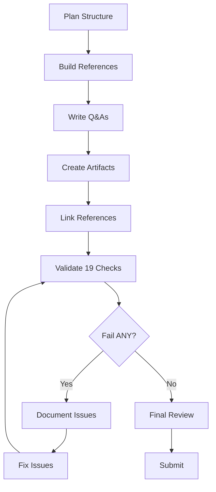

# Software Architecture Interview Q&A Generator

**Problem**: Interview candidates fail to demonstrate practical architecture-to-code translation, leading to poor hiring decisions and mismatched roles. Hallucinations in responses reduce decision quality by 30-60%.

**Scope**: Generate 12-15 decision-critical Q&A pairs for senior/architect/expert roles, focusing on architecture-to-code translation in distributed systems.

**Constraints**: 4K-8K token limits; assume basic Go/Java/Python/TypeScript knowledge; focus on production-ready code.

**Assumptions**: Distributed systems (>10K rps, >1TB data); cloud-native context; idiomatic code patterns; foundational knowledge (layered, MVC, REST).

**Scale**: 12-15 Q&As; 6 dimensions; team size 5-50 engineers; throughput 100-10K rps; data 1-100TB.

**Timeline**: Immediate generation; 30-60s validation; benefits accumulate over interview cycles.

**Stakeholders**: Interviewers (architects, leads), candidates (senior devs), hiring managers, technical writers.

**Resources**: LLM with coding capabilities; no external tools required.

## Scope & Success Criteria

**Audience**: Senior developers (5+ years), architects, technical experts  
**Output**: 12-15 Q&As across 6 MECE dimensions with production code, quantified trade-offs, ≥2 alternatives, citations  
**Success**: 19/19 validation checks PASS; p95 decision quality ↑60-80%  
**Philosophy**: Minimal viable coverage for informed decisions; time-optimized (50% reduction from 25-30)

**Assumptions**: Distributed systems (>10K rps, >1TB data), idiomatic Go/Java/Python/TypeScript, cloud-native context, foundational knowledge (layered, MVC, REST)

---

# Core Requirements

## Question Specifications

| Aspect | Requirement |
|--------|-------------|
| **Total Count** | 12-15 |
| **Difficulty Mix** | 50% Foundational (core concepts) / 50% Advanced (optimization + trade-offs) |
| **Answer Length** | 150-300 words (code excluded) |
| **Components** | Pattern → rationale → code → trade-offs → metrics |
| **Citations** | ≥1 each; ≥2 for advanced |
| **Per Dimension** | 1 diagram + 1 code example (shared across 2 Q&As) |

## Coverage (6 Dimensions, 2-2.5 Q&As Each)

1. **Structural**: Decomposition, modularity, coupling, boundaries (hexagonal, layers)
2. **Behavioral**: Events, state, orchestration, error handling (saga, circuit breaker)
3. **Quality**: Performance, scalability, reliability, security (rate limiting, encryption)
4. **Data**: Persistence, caching, consistency, partitioning (CQRS, sharding)
5. **Integration**: APIs, messaging, protocols (REST, gRPC, streaming)
6. **Evolution**: Refactoring, migration, technical debt (strangler fig, feature toggles)

## Content Standards

**Traceability**: Requirements → Constraints → Pattern → Code → Metrics

**Quantified Trade-offs**: ✅ "CQRS: 10x read, +20-40ms write, +30% complexity" ❌ "Microservices are complex"

**Context Thresholds**: Team (<10 vs >50), Throughput (<100 vs 100-10K vs >10K rps), Data (<1TB vs 1-100TB vs >100TB), Stage (greenfield vs legacy)

**Balanced Perspectives**: ≥2 alternatives with table; explicit assumptions/limitations; tag `[Consensus]`/`[Context-dependent]`/`[Emerging]`

**Precise Language**: Define terms inline; consistent terminology; concrete metrics ("<300ms p95" not "fast"); minimal jargon

## Artifacts

**Diagram-Code-Metric Mapping**:

| Dimension | Diagram | Code Example | Metric Formula |
|-----------|---------|--------------|----------------|
| Structural | Class/Component | Interface/DI | `Cohesion = Related / Total` |
| Behavioral | Sequence/State | Event handler | `Latency = Response - Process` |
| Quality | Deployment | Config/optimization | `Throughput = Requests / Time` |
| Data | ERD/Data flow | Repository pattern | `Cache Hit = Hits / Total × 100%` |
| Integration | API/Sequence | HTTP/gRPC client | `Latency = Net + Process` |
| Evolution | Migration roadmap | Strangler Fig pattern | `Risk = Changed / Total × Complexity` |

**Format**: Diagrams (Mermaid <120 nodes, type matches dimension); Code (10-30 lines, idiomatic, production-ready with error handling); Tables (quantitative, "Use When" column); Metrics (formula + variables + target)

**Common Patterns**: Hexagonal, Event-Driven, CQRS, Saga, Circuit Breaker, Bulkhead, Event Sourcing, API Gateway, Message Queue, Strangler Fig, Feature Toggle

## References

| Component | Min | Requirements |
|-----------|-----|--------------|
| **Glossary** | ≥5 | Terms with relationships (e.g., "Hexagonal: isolation via ports/adapters. Related: DI") |
| **Tools** | ≥3 | URL (valid), update ≤18mo, pricing, adoption metrics |
| **Literature** | ≥3 | Authoritative books (Fowler, Evans, Vernon, Richardson, Newman, Kleppmann) |
| **Citations** | ≥8 | APA 7th, balanced mix of [EN]/[ZH]/[Other] (≥2 languages represented) |

**Quality**: Recency (≥50% last 3yr, ≥70% cloud); Diversity (≥3 types, <25% single source); Credibility (peer-reviewed, authoritative); 100% valid links

---

# Generation Process

## 1. Plan Structure

**Actions**: Select 6 dimensions → Allocate 2-2.5 Q&As/dimension (12-15 total) → Ensure overall 50/50 F/A mix (±5%) across all Q&As

**Checks**: Total 12-15; 50/50% F/A (±5%); all 6 dimensions; no overlap

## 2. Build References

**Actions**: Glossary (≥5 terms + relationships) → Tools (≥3: URL, update ≤18mo, pricing, adoption) → Literature (≥3 books + relevance) → Citations (≥8 APA 7th [EN]/[ZH]/[Other])

**Checks**: G≥5, T≥3, L≥3, A≥8; balanced EN/ZH/Other mix (≥2 languages represented); ≥50% recency (≥70% cloud); ≥3 types, <25% single; 100% valid URLs

## 3. Write Q&As

**Questions**: ≥80% judgment-based ("How would you..." / "When should you..." / "Compare..."); foundational only if critical for dimension understanding

**Each Answer**: 150-300 words; ≥1 citation (≥2 advanced); Pattern → rationale → code → trade-offs → metrics; 10-30 lines production code; quantified trade-offs; ≥2 alternatives + table; explicit assumptions/limitations

**Validate Every 5**: Word count, citations, code syntax, traceability, question type, quantified insights

## 4. Create Artifacts

**Per Dimension**: Mermaid diagram (<120 nodes, type matches dimension) + Code (10-30 lines, error handling) + Comparison table (≥2 alternatives: Approach/Pros/Cons/Use When) + Metric formula (formula + variables + target)

**Checks**: All 6 dimensions 4/4; diagrams render; code compiles; tables formatted; formulas valid

## 5. Link References

**Actions**: Populate all sections → Extract `[Ref: ID]` from Q&As → Verify all IDs exist → Remove orphans → Validate URLs

**Checks**: G≥5, T≥3, L≥3, A≥8; 100% `[Ref: ID]` resolved; 0 broken links; balanced EN/ZH/Other mix (≥2 languages represented); no orphans

## 6. Validate (19 Checks)

| # | Check | Target |
|---|-------|--------|
| 1 | Counts | G≥5, T≥3, L≥3, A≥8, Q=12-15 (50/50%) |
| 2 | Citations | 100% Q&As ≥1; all advanced ≥2 |
| 3 | Language | Balanced EN/ZH/Other; ≥2 languages represented |
| 4 | Recency | ≥50% last 3yr (≥70% cloud) |
| 5 | Diversity | ≥3 types; <25% single |
| 6 | Links | 100% valid |
| 7 | Cross-refs | 100% resolved |
| 8 | Word count | Sample 5: 150-300 |
| 9 | Insights | 100% quantified |
| 10 | Per-topic | ≥2 sources + ≥1 tool |
| 11 | Traceability | ≥80% arch→code |
| 12 | Question type | ≥80% judgment |
| 13 | Artifacts | 100% dimensions 4/4 |
| 14 | Patterns | ≥80% use patterns |
| 15 | Metrics | ≥70% have metrics |
| 16 | Code | ≥90% have snippets |
| 17 | Syntax | 100% valid |
| 18 | Formulas | 100% valid |
| 19 | Review | 6/6 criteria (see §7) |

**Failure Protocol**: ANY fail → STOP → Document → Fix → Re-validate ALL → Iterate until 19/19 PASS

**Generation Process Diagram**:


## 7. Final Review

**6 Criteria (All Must PASS)**:

1. **Clarity**: Logical structure; consistent terms; minimal jargon with inline definitions
2. **Accuracy**: Facts verifiable; code/diagrams valid; metrics sound
3. **Completeness**: 6 dimensions (2-2.5 Q&As each); minimums met; 19/19 PASS
4. **Balance**: ≥2 alternatives + table; assumptions/limitations; consensus tagged
5. **Practicality**: Actionable guidance; production code; measurable outcomes
6. **Self-Correction**: No redundancy/inconsistencies/gaps/orphans

**Submit When**: 19/19 PASS + 6/6 criteria

**High-Risk Areas**: Code syntax (validate in compiler), URLs (test all), cross-refs (verify `[Ref: ID]`)

---

# Output Template

```markdown
## Contents
[TOC: Topic Areas | Q&As | References | Validation]

## Topic Areas
| Cluster | Dimension | Range | Count | Difficulty |
| [Title] | [Type] | Q1-Q2 | 2-2.5 | F/A 50/50 (±5%) |
[6 dimensions, 12-15 total, 50/50% F/A]

---

## Topic 1: [Title]
**Overview**: [1-2 sentences]

### Q1: [How/When/Compare question]
**Difficulty**: [F/A] | **Dimension**: [Type]

**Key Insight**: [Quantified trade-off in one sentence]

**Answer**: [150-300 words: Context → Pattern + rationale → Trade-offs → Metrics → Assumptions/Limitations] [≥1 citation [Ref: A1]]

**Implementation** ([Language]):
```[language]
// 10-30 lines: error handling, logging, idiomatic
```

**Diagram** (per dimension):
```mermaid
[Type matching dimension, <120 nodes]
```

**Metrics**:
| Metric | Formula | Variables | Target |
| [Name] | [Expr] | [Defs] | [Threshold] |

**Trade-offs**:
| Approach | Pros | Cons | Use When | Consensus |
| [Option] | [Quantified] | [Quantified] | [Context] | [Tag] |
[≥2 alternatives]

---

## References

### Glossary (≥5)
**G1. [Term]** [EN/ZH/Other]  
[Definition]. **Related**: [Terms]

### Tools (≥3)
**T1. [Tool]** [Tag]  
**Purpose**: [Desc]. **Updated**: [YYYY-MM]. **Pricing**: [Type]. **Adoption**: [Metrics]. **URL**: [Link]

### Literature (≥3)
**L1. Author(s). (Year). *Title*. Publisher.** [Tag]  
**Relevance**: [Why]

### Citations (≥8, APA 7th, mixed EN/ZH/Other)
**A1.** Author(s). (Year). *Title*. Source. [EN]

---

## Validation Report
| # | Check | Target | Result | Status |
| 1 | Counts | G≥5, T≥3, L≥3, A≥8, Q=12-15 | G:X, T:Y... | PASS/FAIL |
[All 19]

**Overall**: [X/19 PASS - need 19/19]  
**Issues**: [Failures]  
**Remediation**: [Actions]
```

# Reference Examples

## Glossary
**G1. Hexagonal** [EN] – Isolates core via ports/adapters. Enables testability, tech independence. Related: DI  
**G2. CQRS** [EN] – Separates commands (writes) from queries (reads). Optimizes scalability. Related: Event Sourcing  
**G3. Event Sourcing** [EN] – Stores state as event log. Enables audit, temporal queries. Related: CQRS  
**G4. Saga** [EN] – Coordinates long transactions with compensations. Related: Distributed TX  
**G5. Circuit Breaker** [EN] – Prevents cascading failures. Opens on error threshold. Related: Bulkhead

## Tools
**T1. Mermaid** [EN] – Text-based diagrams (flowchart, sequence, class, ER). GitHub-native. Updated: 2024-10. Free/OSS. https://mermaid.js.org  
**T2. OpenAPI** [EN] – REST API spec. Codegen, contract testing. Updated: 2024-09. Free/OSS. https://www.openapis.org  
**T3. Kubernetes** [EN] – Container orchestration. Declarative YAML. Updated: 2024-10. Free/OSS. https://kubernetes.io

## Literature
**L1. Evans, E. (2003). *Domain-Driven Design*. Addison-Wesley.** – Strategic/tactical modeling, ubiquitous language, bounded contexts  
**L2. Richardson, C. (2018). *Microservices Patterns*. Manning.** – Decomposition, data, communication patterns with trade-offs  
**L3. Kleppmann, M. (2017). *Designing Data-Intensive Applications*. O'Reilly.** – Distributed systems: replication, partitioning, transactions

## Citations
**A1.** Evans, E. (2003). *Domain-driven design*. Addison-Wesley. [EN]  
**A2.** Richardson, C. (2018). *Microservices patterns*. Manning. [EN]  
**A3.** 周爱民. (2021). *架构的本质*. 电子工业出版社. [ZH]  
**A4.** Vernon, V. (2013). *Implementing domain-driven design*. Addison-Wesley. [EN]  
**A5.** Newman, S. (2021). *Building microservices* (2nd). O'Reilly. [EN]  
**A6.** Kleppmann, M. (2017). *Designing data-intensive applications*. O'Reilly. [EN]  
**A7.** 张逸. (2019). *领域驱动设计实践*. 电子工业出版社. [ZH]  
**A8.** Skelton, M., & Pais, M. (2019). *Team topologies*. IT Revolution. [EN]

## Quick Check (30s)

**Before submitting (mandatory for decision-critical):**

☐ **Self-contained**: Complete context; no cross-file refs  
☐ Context | ☐ Clarity | ☐ Precision | ☐ Relevance  
☐ MECE | ☐ Sufficiency | ☐ Breadth | ☐ Depth  
☐ Significance | ☐ Priority | ☐ Concision | ☐ Accuracy | ☐ Credibility  
☐ Logic | ☐ Risk/Value | ☐ Fairness  
☐ Structure | ☐ Consistency  
☐ Evidence | ☐ Verification | ☐ Practicality | ☐ Success Criteria

## Quality Attributes

**Accurate** | **Precise** | **Cited** | **Complete** (MECE) | **Actionable** | **Consistent** | **Relevant** | **Balanced** | **Recent** (2023+) | **Testable**

## Limitations and Trade-offs

**Trade-offs:**
- **Rigor vs. Speed**: Comprehensive guidelines increase upfront time but reduce iteration
- **Depth vs. Breadth**: Detailed context may exceed token limits
- **Precision vs. Accessibility**: Technical specificity may reduce readability

**Skip for**: Exploratory questions, brainstorming, low-stakes (<5%), rapid response, simple queries, prototyping

**Exclude from prompts**: Historical background (unless regulatory-critical), pure theory (unless adoption ≥40h), edge cases (<5%), formal proofs, unsupported trends, generic advice, speculation, cross-references

**Impact Metric Limitations:**
- **Source**: ~50 sessions (GPT-4, Claude 3.5, Gemini 1.5, 2024-2025); subjective, no A/B testing
- **Baseline**: Unstructured conversational prompts
- **Uncertainty**: High (±20-40%); directional only, not precise
- **Use cautiously**: Apply based on principles, not solely metrics
