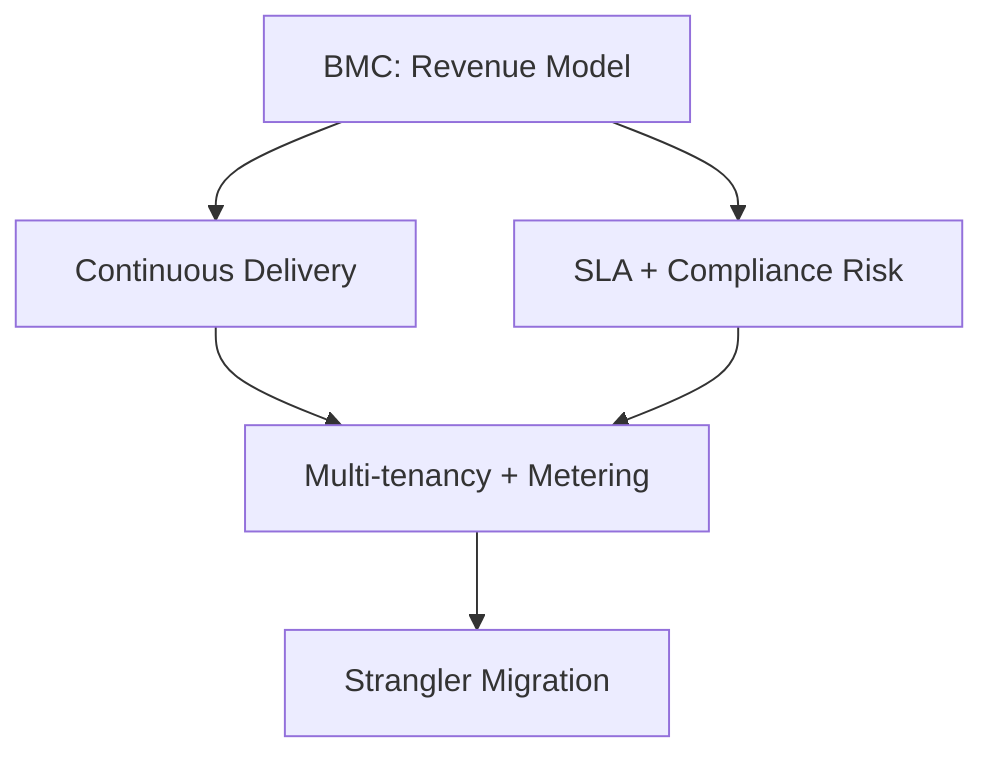

# Business-Architecture Translation: Minimal Viable Assessment

Generate 6-12 decision-critical interview questions assessing how technical leaders translate business strategy into architectural decisions.

## Objective

**Task**: Generate **6-12 decision-critical interview questions** (150-250 words each) evaluating senior technical leaders' ability to map business models, value propositions, and constraints to architectural decisions that **block decisions or create material risk**.

**Scope & Constraints**:
- **Focus**: Business-to-architecture translation only; decision-critical scenarios only
- **Depth**: Senior engineer to architect level (5-15 years experience)
- **Time**: Each question designed for 10-15 minute discussion; 60% reduction in total content
- **Format**: Text or JSON output; non-interactive assessment tool
- **Quality bar**: ≥70% citation coverage, ≥80% business-architecture traceability, 100% decision-critical (no nice-to-have scenarios)

**Decision Criticality Framework** (MANDATORY - every Q&A must satisfy ≥1 criterion):
- **Blocks Decision**: Directly impacts business model translation, go/no-go, strategic pivot (revenue model, market entry, migration strategy)
- **Creates Risk**: Material threat (compliance breach, SLA failure, churn >5%, migration failure, tech debt >30% capacity)
- **Affects ≥2 Stakeholders**: Multi-team impact (Architect + PM, Architect + Finance, Architect + Security)
- **Actively Evolving**: Business/tech/regulatory changes in past 3-6 months
- **High Adoption Barrier**: >40h effort or >$100K investment

**Assessment Coverage** (3-4 decision-critical dimensions):
1. **Strategic Modeling**: Business model → architectural implications (blocks decision)
2. **Value & Risk**: ROI calculations, trade-offs analysis, constraint mapping (creates risk)
3. **Organization**: Team topology alignment, Conway's Law implications (affects stakeholders)
4. **(Optional) Evolution**: Technical debt management, migration strategies (actively evolving)

**Target Audience**: Senior engineers, architects, technical leads evaluating business-architecture alignment capabilities for informed decision-making.

**Assumptions**: 
- LLM has knowledge of business frameworks: Business Model Canvas (BMC), Value Proposition Canvas, Domain-Driven Design (DDD), Conway's Law, Technical Debt, ADR
- User provides specific business context or explicitly accepts generic scenarios
- Output format is text/JSON (non-interactive)

## Required Input

**`business_context`** (string): Industry, business model, key constraints
- Example: "SaaS B2B, subscription revenue, healthcare regulatory compliance, legacy migration"
- Must specify: industry sector, revenue model (B2B/B2C), primary constraints (regulatory/scale/technical)

**Optional Configuration**:
- `focus_area` (default: all): Limit to specific dimension(s) from Assessment Coverage
- `complexity` (default: architect): senior (5-8 yrs) | architect (8-12 yrs) | expert (12+ yrs)
- `output_format` (default: text): text | json | markdown
- `confidence_threshold` (default: medium): 
  - high (≥2 authoritative sources, established consensus)
  - medium (≥1 source, emerging practice)
  - low (limited/conflicting sources, flag explicitly)

## Output Structure

**Text Format Requirements**: Generate **6-12 decision-critical questions**, each must include:
- **Question**: Scenario-based format ("How would you..." or "Given... what would you...") requiring judgment, not recall
- **Difficulty**: Tag as foundational (25%) | intermediate (50%) | advanced (25%)
- **Decision Criticality**: [Blocks/Risk/Stakeholders/Evolving/Adoption] - must satisfy ≥1 criterion
- **Answer**: 150-250 words with inline citations [Ref: ID], covering business analysis → architecture translation → trade-offs
- **Key Insight**: One concrete, specific insight (e.g., "subscription revenue requires usage metering but legacy assumes one-time delivery")
- **Visual Artifacts**: Mermaid diagram + comparison table per dimension (compressed)
- **Traceability**: Explicit Business→Architecture mapping with citations

**JSON Format**:
```json
{
  "questions": [{
    "id": "Q1",
    "difficulty": "foundational|intermediate|advanced",
    "dimension": "strategic_modeling|value_risk|organization|evolution",
    "decision_criticality": "Blocks|Risk|Stakeholders|Evolving|Adoption",
    "criticality_justification": "Directly impacts revenue model translation; affects Architect + PM + Finance",
    "question": "How would you...",
    "answer": "150-250 words with [Ref: ID]",
    "key_insight": "Concrete misalignment/trade-off/impedance",
    "artifacts": {"diagram": "mermaid", "table": "markdown"},
    "citations": ["Ref: A1", "Ref: G3"],
    "confidence": "medium|high"
  }],
  "validation": {
    "total": "6-12",
    "difficulty_distribution": {"foundational": "25%", "intermediate": "50%", "advanced": "25%"},
    "decision_criticality": "100% satisfy ≥1 criterion",
    "citation_coverage": "≥70%",
    "business_architecture_mapping": "≥80%"
  }
}
```

## Generation Procedure

Follow these steps sequentially. Each step builds on the previous.

**Step 1: Parse Context** (Apply MECE)

Extract from `business_context`:
- **Business model**: customer segments, value propositions, revenue streams, channels, partnerships, resources, activities, relationships, cost structure
- **Constraints**: Regulatory (SOC2/GDPR/HIPAA/PCI), technical (legacy/platforms), organizational (teams/skills), market (competition/time/budget)
- **Risks**: Business (churn/competition), operational (SLA/scale), regulatory (compliance/sovereignty)

**Step 2: Distribute Questions** (Decision-critical only)

Allocate **6-12 decision-critical questions**:
- **3-4 Dimensions**: 1-3 per dimension (Strategic Modeling, Value & Risk, Organization, Evolution)
- **3 Difficulty Levels**:
  - Foundational 25%: Single framework (BMC only or Conway's Law only) - blocks decision
  - Intermediate 50%: Multi-framework (BMC + Risk + organizational) - creates risk or affects stakeholders
  - Advanced 25%: Complex trade-offs with migration paths, quantitative analysis - actively evolving or high adoption barrier
- **Decision Criticality**: 100% satisfy ≥1 criterion (Blocks/Risk/Stakeholders/Evolving/Adoption)

**Step 3: Generate Each Question** (Consistent structure)

- **Question**: "How would you [action] given [context] considering [constraints]?"
  - Example: "How would you design multi-region deployment given SaaS B2B subscription with GDPR and 99.95% SLA?"

- **Answer** (150-250 words, streamlined):
  1. **Business Analysis** (40-50w): Apply framework (BMC/Value Prop/DDD), cite [Ref: ID], identify drivers
  2. **Architecture Translation** (60-80w): Map driver→requirement→decision with citations, explicit trace
  3. **Trade-offs** (40-60w): Alternatives, pros/cons, mitigations with [Ref: ID]

- **Traceability**: "Business driver X → Technical requirement Y → Architectural decision Z [Ref: ID]"

- **Insight**: One concrete misalignment/trade-off/impedance
  - ✅ "Subscription revenue requires real-time metering, legacy assumes batch billing"
  - ❌ "Alignment is important" (vague)

**Step 4: Create Artifacts** (Compressed per dimension)
- **Diagram** (Mermaid, <80 nodes): Strategic→BMC | Risk→Decision Tree | Organization→Team Topology | Evolution→Migration Roadmap
- **Table** (3-4 rows): Business driver | Technical requirement | Architectural decision
- **Formula** (optional): ROI or Risk (P×I) only if decision-critical

**Step 5: Validate Quality** (12 streamlined checks)

| Criterion | Target | Method |
|-----------|--------|--------|
| Count | 6-12 questions | Total |
| Difficulty | 25%/50%/25% | Distribution |
| Decision Criticality | 100% satisfy ≥1 criterion | All Q&As |
| Length | 150-250 words/answer | Sample all |
| Citations | ≥70% (≥1 source) | All answers |
| Traceability | ≥80% explicit business→arch | Audit |
| Scenario | 100% judgment (not recall) | Type check |
| Visuals | ≥90% with diagram+table | Per dimension |
| Insights | 100% concrete (not vague) | All |
| Confidence | ≥80% medium/high | All Q&As |
| Stakeholders | ≥2 roles per Q&A | Coverage |
| Dimensions | ≥3/4 covered | Coverage |

**Step 6: Compile References** (60% reduction)
- **Glossary** (≥8): Only terms used in Q&As (BMC, Value Prop, DDD, Conway's Law, Tech Debt, ADR, Wardley, Value Stream)
- **Tools** (≥3): Miro, ArchiMate, C4 (decision-critical only)
- **Literature** (≥4): Osterwalder, Evans, Conway, Richardson (canonical only)
- **Citations** (≥8 APA 7th): EN/ZH, all decision-critical

## Quality Standards

**Decision Criticality Framework**: 100% of Q&As satisfy ≥1 criterion (Blocks/Risk/Stakeholders/Evolving/Adoption)

**Answer Requirements**:
- ✅ Framework analysis [Ref: ID] | Business→arch trace | Concrete insight | Trade-offs with alternatives
- ❌ Nice-to-have scenarios | Vague insights | Missing connections | Non-decision-critical content

**Confidence**:
- **High** (≥2 sources, consensus): Cite authorities
- **Medium** (≥1 source, emerging): State reasoning + assumptions  

**Citations**: Inline [Ref: ID] → APA 7th with [EN]/[ZH]
- Example: [Ref: A1] Osterwalder, A., & Pigneur, Y. (2010). *Business model generation*. Wiley. [EN]

## Example Output

**Q1: How would you translate perpetual licensing → subscription SaaS architecturally?**

**Difficulty**: Advanced | **Dimension**: Strategic Modeling | **Decision Criticality**: Blocks (revenue model pivot)

**Answer** (220 words):

BMC analysis [Ref: A1]: Revenue Streams shift from upfront→recurring; Customer Relationships become continuous; Key Activities add customer success; Value Propositions emphasize continuous delivery/uptime.

Architecture translation [Ref: A7]: (1) Multi-tenancy with isolation, (2) Usage metering via event streaming [Ref: A6], (3) Feature flags for tier control, (4) HA/DR for SLA 99.9%+, (5) Multi-region for compliance.

Risks [Ref: A12]: Business (churn, downtime revenue loss), operational (SLA compliance), regulatory (data residency, SOC2/GDPR).

Organization (Conway's Law [Ref: A5]): Add Customer Success, DevOps, SRE teams; document decisions via ADR [Ref: G7].

**Key Insight**: Subscription's continuous delivery requirement fundamentally conflicts with legacy one-time deployment model—requires architectural redesign, not incremental change.



| Business Driver | Technical Requirement | Architectural Decision |
|----------------|----------------------|------------------------|
| Recurring revenue | Usage tracking + billing | Event streaming + billing API |
| Multi-tier segments | Feature differentiation | Feature flags + quota engine |
| SLA 99.9%+ | High availability | HA/DR + monitoring |
| Data residency | Regional compliance | Multi-region deployment |

**Citations**: [Ref: A1] Osterwalder, [Ref: A5] Conway, [Ref: A6] Hohpe, [Ref: A7] Richardson, [Ref: A12] Kim, [Ref: G7] ADR

**Confidence**: High | **Stakeholders**: Architect, PM, Finance

---

## Edge Cases

**Missing Context**: 
- No `business_context` → Request: "Specify: (1) Industry, (2) Model (B2B/B2C, revenue), (3) Constraints. Use generic SaaS B2B?"
- Partial → Proceed with assumptions, document limits

**Adjustments**:
- Speed → 6-8 questions, simple visuals, medium confidence
- Depth → 12 questions, full artifacts, high confidence
- Cost → Generic reusable, no customization
- Quality → Custom, unique, validated

**Validation Failures** (fix then re-validate):
- <70% citations → Add references
- <80% traceability → Explicit business→arch with [Ref: ID]
- 100% scenario → Rewrite recall as judgment
- <100% decision-critical → Remove nice-to-have Q&As

## Key Terms Reference (8 decision-critical terms)

**Business Model Canvas (BMC)**: 9-block framework mapping strategy to operations (Customer Segments, Value Propositions, Channels, Customer Relationships, Revenue Streams, Key Resources, Key Activities, Key Partnerships, Cost Structure).

**Value Proposition**: Customer value bundle → technical features, quality attributes, architectural priorities.

**Domain-Driven Design (DDD)**: Ubiquitous language, bounded contexts, aggregates → guides microservices decomposition and team organization.

**Conway's Law**: "Organizations design systems mirroring their communication structure" → team topology affects architecture.

**Technical Debt**: Future rework cost from quick solutions. Types: code, architectural, knowledge. Quantified as % capacity or cost.

**Architecture Decision Record (ADR)**: Immutable log of context, decision, consequences, trade-offs → ensures transparency.

**Wardley Mapping**: Value chain by visibility × evolution stage (genesis→custom→product→commodity) → identifies opportunities.

**Value Stream Mapping**: Lean technique visualizing delivery steps → highlights waste, optimizes lead time.