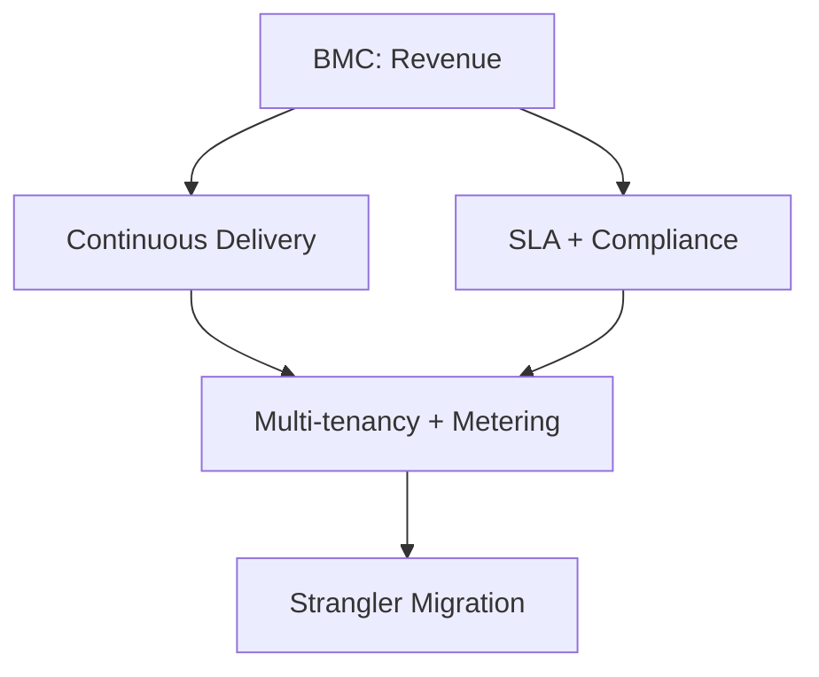

# Business-Architecture Translation: Minimal Viable Assessment

## Objective

Generate 4-8 decision-critical interview questions evaluating senior technical leaders' ability to translate business models into architectural decisions.

**Scope**: Business-to-architecture translation in critical scenarios (revenue model pivots, market entry, compliance gaps).

**Depth**: Senior engineer to architect level (5-15 years experience).

**Timeline**: 5-10 min/question; 45-60min interview total.

**Stakeholders**: Architect, PM, Finance, Leadership, Compliance.

**Difficulty**: 20% F / 40% I / 40% A — **F**=Foundational (execution), **I**=Intermediate (strategy/trade-offs), **A**=Advanced (portfolio/vision)

**Decision-Criticality** (every Q&A must satisfy ≥1):
- **Blocks Decision**: Revenue model choice, market entry, migration strategy
- **Creates Risk**: Material threat (compliance gaps, SLA failure, high churn, tech debt)
- **Affects ≥2 Stakeholder Roles**: Multi-team impact
- **Requires Action**: 1-6mo window (recent business/tech changes, not speculative)
- **Quantified Impact**: Measurable metrics (>40h effort or >$100K investment, revenue impact)

**Assessment Dimensions** (cover 3-4 unless focused):
1. Strategic Modeling: Business model → architecture
2. Value & Risk: ROI, trade-offs, constraints
3. Organization: Team structure, Conway's Law
4. Evolution: Technical debt, migrations

**Assumptions**:
- Basic familiarity with common frameworks (BMC, DDD, etc.)
- User provides context or accepts generic scenarios

## Input

**Required**: `business_context` (string): Industry, business model, key constraints
- Example: "SaaS B2B, subscription revenue, healthcare compliance, legacy migration"

**Optional**:
- `focus_area` (default: all)
- `complexity` (default: architect): senior | architect | expert
- `output_format` (default: text): text | json
- `confidence_threshold` (default: medium): high | medium | low

**Difficulty Levels**: **F**=Foundational (execution), **I**=Intermediate (strategy/trade-offs), **A**=Advanced (portfolio/vision)

## Output Structure

**Text Format**:
- **Question**: Scenario-based requiring judgment
- **Difficulty**: F | I | A (Foundational | Intermediate | Advanced)
- **Dimension**: Strategic Modeling | Value & Risk | Organization | Evolution
- **Decision Criticality**: Specify criteria satisfied (e.g., Blocks decisions)
- **Answer**: 150-250 words with citations; business analysis → architecture → trade-offs
- **Key Insight**: One concrete insight
- **Artifacts**: Optional Mermaid diagram and table
- **Traceability**: Business→Architecture mapping

**JSON Format** (optional):
```json
{
  "questions": [{
    "id": "Q1",
    "difficulty": "foundational|intermediate|advanced",
    "dimension": "Strategic Modeling|Value & Risk|Organization|Evolution",
    "decision_criticality": "Criteria satisfied (e.g., Blocks decisions)",
    "question": "How would you...",
    "answer": "150-250 words",
    "key_insight": "Insight",
    "artifacts": {"diagram": "mermaid", "table": "markdown"},
    "traceability": "Business→Architecture mapping",
    "citations": ["Ref: A1"],
    "confidence": "high|medium|low"
  }]
}
```

## Procedure & Standards

1. Parse context: Extract business model, constraints, risks.

2. Distribute: 1-2 questions per dimension; mix difficulties; ensure all decision-critical.

3. Generate each Q&A:
   - Question: Scenario-based
   - Answer: Business analysis → architecture → trade-offs
   - Insight: Concrete point
   - Artifacts: Optional diagram/table

4. Validate: Check count, criticality, citations, traceability; ensure answers include business analysis, architecture translation, trade-offs; flag low confidence.

5. Compile references: 6-8 citations in APA format.

## Example Output

**Q1: How would you translate perpetual licensing → subscription SaaS architecturally?**

**Difficulty**: Advanced | **Dimension**: Strategic Modeling | **Decision Criticality**: Blocks (revenue model pivot)

**Answer** (220 words):

BMC analysis [Ref: A1]: Revenue shifts upfront→recurring; relationships continuous; activities add customer success; value propositions emphasize delivery/uptime.

Architecture [Ref: A7]: Multi-tenancy, usage metering via event streaming [Ref: A6], feature flags, HA/DR for SLA, multi-region compliance.

Risks [Ref: A12]: Churn, downtime loss, SLA/regulatory compliance.

Organization (Conway's Law [Ref: A5]): Add Customer Success, DevOps, SRE; document via ADR [Ref: G7].

**Key Insight**: Subscription's continuous delivery conflicts with legacy one-time model—requires redesign, not incremental change.



| Business Driver | Technical Requirement | Architectural Decision |
|----------------|----------------------|------------------------|
| Recurring revenue | Usage tracking | Event streaming + billing API |
| Multi-tier | Feature differentiation | Feature flags + quota |
| SLA 99.9%+ | High availability | HA/DR + monitoring |
| Data residency | Regional compliance | Multi-region |

**Traceability**: Business model (BMC) → architectural patterns (multi-tenancy, metering, compliance)

**Citations**: [Ref: A1] Vaughan Broderick (2023) [EN]; [Ref: A5] Oliveira (2023) [EN]; [Ref: A6] Hohpe (2003) [EN]; [Ref: A7] Richardson (2018) [EN]; [Ref: A12] Kim et al. (2016) [EN]; [Ref: G7] Nygard (2011) [EN]

**Confidence**: High | **Stakeholders**: Architect, PM, Finance

## Edge Cases

- Missing context: Use generic scenarios
- Adjustments: 4-6 for speed, up to 8 for depth
- Validation issues: Add citations, ensure criticality

## Key Terms (8)

- **Business Model Canvas (BMC)**: 9-block framework mapping strategy to operations
- **Value Proposition**: Customer value delivered via technical features/attributes
- **Domain-Driven Design (DDD)**: Uses ubiquitous language and bounded contexts for microservices/team organization
- **Conway's Law**: Organization structure mirrors system communication patterns
- **Technical Debt**: Accumulated future rework cost, often quantified as % capacity
- **Architecture Decision Record (ADR)**: Document logging context, decision, and consequences
- **Wardley Mapping**: Maps value chain by visibility/evolution to identify opportunities
- **Value Stream Mapping**: Visualizes delivery process steps to identify waste

