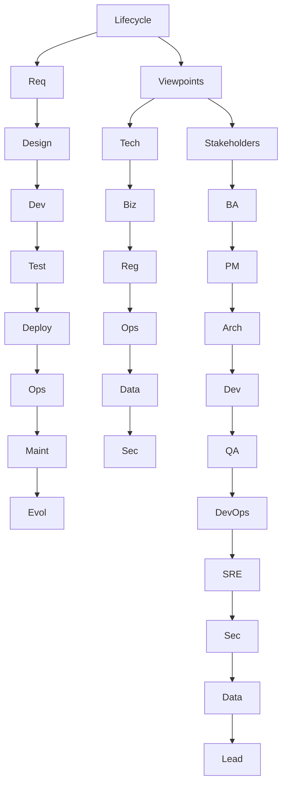
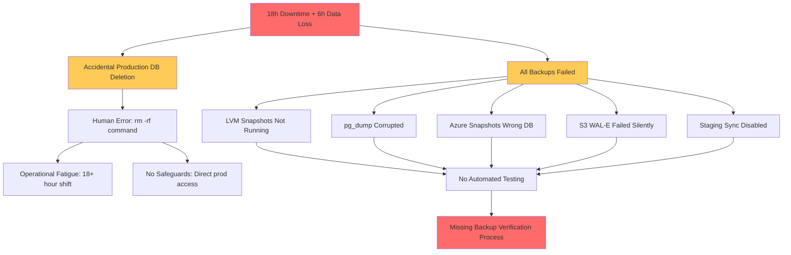

# Case Study Deep Analysis Generator

Generate 20–30 comprehensive case study analyses covering success and failure across the software lifecycle (8 phases), focusing on technical, business, regulatory, operational, data, and security viewpoints.

## I. Context & Scope

**Problem:** Insufficient real-world case studies; reliance on hypotheticals leads to hallucinations; analyses lack depth and multi-viewpoint insights.

**Purpose:** Extract actionable lessons from documented successes/failures via multi-viewpoint analysis for pattern recognition and decision-making.

**Scope:** Public documented cases across 8 phases, 10 roles, 6 viewpoints. Exclude hypotheticals, unverified, marketing.

**Constraints:** Use public sources with accessible URLs; focus on measurable outcomes.

**Assumptions:** LLMs possess software engineering knowledge; outputs will be iterated.

**Scale:** 20-30 cases in 7 categories; 50/50 success/failure; 30/40/30 simple/moderate/complex.

**Timeline:** Generate immediately; review outputs promptly; refine iteratively.

**Stakeholders:** BA, PM, Architect, Dev, QA, DevOps, Security, Data, SRE, Leadership.

**Resources:** LLMs; public URLs from postmortems, audits, filings, papers.

**Key Terms:** Success (achieved goals/outcomes), Failure (missed/incidents), Lifecycle (Req→Design→Dev→Test→Deploy→Ops→Maint→Evol), Stakeholders (as above), Pattern (reusable lesson), Anti-Pattern (failure mode).

**Relationships Diagram**:

## II. Requirements

### Quantitative Floors

**Cases**: 20–30 | 50/50 success/failure (±10%) | 30/40/30 Simple/Moderate/Complex (±5%) | 400-700 words | ≥90% ≥2 cites (≥50% ≥3) | ≥85% ≥3 viewpoints

**7 Categories (MECE)**: Architecture & Design (4-5) | Business & Market (3-4) | Regulatory & Compliance (3-4) | Operational Excellence (3-4) | Security & Privacy (3-4) | Data & AI (2-3) | Organizational & Team (2-3)

**References**: G≥20 | S≥8 | T≥10 | L≥15 (≥40% domain-specific) | A≥30 (APA 7th+tags) | Scale proportionally for >25 cases.

**Visuals**: ≥2/case | ≥1 diagram+1 table/category | ≥4 Mermaid

### Citation & Quality Standards

**Format**: Books: `Author. (Year). *Title*. Publisher. [EN]` | Standards: `Org. (Year). *Standard*. [Standard]` | Postmortems: `Company. (Year). *Title*. URL [Postmortem]` | Inline: `[Ref: ID]`

**Distribution**: EN 50-70% | ZH 15-30% | Std 10-20% | Postmortem 15-25% | ≥5 source types (none >25%)

**Quality Gates**: ≥60% <3yrs | 100% real-world+accessible URLs | 100% cross-refs resolve | Per-category: ≥2 auth+≥1 post+≥1 metric | Cases: ≥85% ≥3 viewpoints | ≥70% ≥3 stakeholders | ≥80% map to phases

## III. Execution

### Step 1: Plan Allocation

Distribute 20–30 cases across 7 categories: 30/40/30 Simple/Moderate/Complex, 50/50 success/failure. Each category ≥1 success and ≥1 failure.

**Complexity**: Simple (1-2 phases, <3 stakeholders) | Moderate (3-5 phases, 3-6) | Complex (6-8 phases, >6).

### Step 2: Build References (Before Cases)

G≥20 (patterns), S≥8 (standards), T≥10 (tools), L≥15 (literature, ≥40% domain-specific), A≥30 (citations, ≥60% <3yrs).

### Step 3: Generate Case Studies (3 at a time)

Select public documented cases; balance outcomes; multi-phase/stakeholder; quantitative. Avoid hypotheticals.

Structure per Section VI.C (400–700 words).

Check: Documented, balanced, ≥3 viewpoints, word count, lifecycle, quantitative, citations, ≥2 artifacts, complexity, actionable.

### Step 4: Create Visuals (≥2/case; ≥1 diagram+1 table/category)

Types: Timeline (Gantt), Architecture, Metrics (table), Decision Matrix, Impact Map, Root Cause Tree.

Best: ≥4 Mermaid, cite refs, <25 nodes, show causality.

### Step 5: Populate References

Complete all fields/tags/URLs; alphabetize/group; verify 100% resolve.

### Step 6: Run Validations (19 checks; fix if any fail)

See Section IV table.

### Step 7: Final Review

Sample ≥5 cases: Verified, balanced, ≥3 viewpoints, mapped, quantitative, root causes, patterns, actionable, ≥2 artifacts, ≥2 cites.

Submit: All pass, TOC linked, no placeholders, consistent, URLs verified.

## IV. Validation Report (fill all; any fail = fix and re-run all)

| # | Check           | Measurement                     | Criteria                          | Result | Status    |
|---|-----------------|---------------------------------|-----------------------------------|--------|-----------|
| 1 | Floors          | G:__ S:__ T:__ L:__ A:__ Cases:__ (__S/__M/__C) (__Suc/__Fail)| G≥20, S≥8, T≥10, L≥15, A≥30, Cases:20-30, 30/40/30%, 50/50 | | PASS/FAIL |
| 2 | Citations       | __%≥2, __%≥3                    | ≥90%≥2, ≥50%≥3                    | | PASS/FAIL |
| 3 | Lang/Type       | EN:__%, ZH:__%, Std:__%, Post:__% | EN:50-70%, ZH:15-30%, Std:10-20%, Post:15-25% | | PASS/FAIL |
| 4 | Recency         | __% <3yrs                       | ≥60%                              | | PASS/FAIL |
| 5 | Source Types    | __ types; max __%               | ≥5 types, max 25%                 | | PASS/FAIL |
| 6 | Real-World      | __/__ documented with URL       | 100%                              | | PASS/FAIL |
| 7 | Links           | __/__ accessible                | 100%                              | | PASS/FAIL |
| 8 | Cross-Refs      | __/__ resolved                  | 100%                              | | PASS/FAIL |
| 9 | Word Count      | __ sampled: __ compliant        | 100% (400-700)                    | | PASS/FAIL |
| 10| Success/Failure | __/7 categories balanced        | Each: ≥1 success AND ≥1 failure   | | PASS/FAIL |
| 11| Category Evidence| __/7 (≥2 auth+≥1 post+≥1 metric)| 7/7                               | | PASS/FAIL |
| 12| Viewpoints      | __%≥3                           | ≥85%                              | | PASS/FAIL |
| 13| Stakeholders    | __%≥3 roles                     | ≥70%                              | | PASS/FAIL |
| 14| Lifecycle       | __%≥1 phase; __%≥3 phases       | ≥80%; ≥50%                        | | PASS/FAIL |
| 15| Quantitative    | __% with metrics                | ≥90%                              | | PASS/FAIL |
| 16| Root Cause      | Failures:__/__ Successes:__/__  | 100% both                         | | PASS/FAIL |
| 17| Lessons         | __/__ with patterns+actions     | 100%                              | | PASS/FAIL |
| 18| Visuals         | M:__, D:__, T:__, Artifacts:__  | ≥4, ≥7, ≥7, ≥2/case               | | PASS/FAIL |
| 19| Authenticity    | __/__ real-world public         | 100%                              | | PASS/FAIL |

## V. Quality Checklist (≥3 fails = rewrite)

1. Verified: Public docs ✓ | Hypothetical ✗
2. Balanced: Both outcomes per category ✓ | One-sided ✗
3. Multi-View: ≥3 viewpoints ✓ | Single ✗
4. Lifecycle: Phase-mapped ✓ | Vague ✗
5. Quantitative: Measurable metrics ✓ | Vague ✗
6. Causal: Clear chain ✓ | Ambiguous ✗
7. Actionable: Transferable practices ✓ | Generic ✗
8. Stakeholders: Multi-role impact ✓ | General ✗
9. Complexity: Aligned with definition ✓ | Mismatched ✗

## VI. Output Format

### A. TOC
1. Category Overview | 2. Case Studies by Category (7 categories) | 3. References (G/S/T/L/A) | 4. Validation Report

### B. Category Overview
**Total**: 24 cases (example) | **Complexity**: 7 Simple (29%) / 9 Moderate (37.5%) / 8 Complex (33%) | **Balance**: 13 success (54%) / 11 failure (46%) | **Coverage**: 7 categories (MECE)

| # | Category               | Range   | Count | Mix      | Success/Fail | Artifacts |
|---|------------------------|---------|-------|----------|--------------|-----------|
| 1 | Architecture & Design  | C1–C4   | 4     | 1S/1M/2C | 2 Suc/2 Fail | 1D+1T     |
| 2 | Business & Market      | C5–C8   | 4     | 1S/2M/1C | 2 Suc/2 Fail | 1D+1T     |
| 3 | Regulatory & Compliance| C9–C11  | 3     | 1S/1M/1C | 2 Suc/1 Fail | 1D+1T     |
| 4 | Operational Excellence | C12–C15 | 4     | 1S/2M/1C | 2 Suc/2 Fail | 1D+1T     |
| 5 | Security & Privacy     | C16–C18 | 3     | 1S/1M/1C | 2 Suc/1 Fail | 1D+1T     |
| 6 | Data & AI              | C19–C21 | 3     | 1S/1M/1C | 2 Suc/1 Fail | 1D+1T     |
| 7 | Organizational & Team  | C22–C24 | 3     | 1S/1M/1C | 1 Suc/2 Fail | 1D+1T     |
|   | **Total**              |         | **24**| **7S/9M/8C** | **13/11** | **7+7** |

Legend: S=Simple | M=Moderate | C=Complex | Suc=Success | Fail=Failure | D=diagram | T=table

### C. Case Study Format

**Case Study #: [Company/Project] – [Success/Failure]**

**Classification**: [Outcome] | [Category] | [Complexity] | [Year] | **Phases**: [List]

**1. Context** (100-150w) [Ref: A#]: Domain, scale, stack, timeline, goals, constraints.

**2. Lifecycle** (50-80w): Phases → right/wrong, transitions, decisions.

**3. Multi-Viewpoint** (≥3; 150-250w):
- **Technical** [G#/T#]: Arch, choices, scaling, debt, modes.
- **Business** [A#]: Revenue, market, ROI, costs.
- **Regulatory** [S#/A#]: Compliance, audits, legal.
- **Operational** [L#]: Deploy, response, monitoring.
- **Data** [T#]: Quality, pipelines, backup.
- **Security** [S#/L#]: Threats, breach, detection.

**4. Stakeholders** (50-80w): Impact on roles, decision makers, dynamics.

**5. Quantitative** (40-60w) [Ref: A#]: Metrics before/after.

**6. Root Causes/Enablers** (50-80w): Success enablers/markers; Failure cause/contributing/preventability.

**7. Lessons** (80-120w) [Ref: G#]: Patterns, practices, signs, trade-offs.

**8. Recommendations** (50-80w): Technical, process, org, detection, prevention.

**9. Citations**: ≥2 (≥3 for Moderate/Complex)

**10. Artifacts** (≥2): Timeline (Gantt), Arch, Metrics (table), etc.

**11. URL**: [Link]

### D. Reference Formats

**G#. Term (Acronym)**: Definition, context, patterns, case IDs, limitations. Alphabetize.

**S#. Name (Body)**: Purpose, scope, version, adoption, URL, relevance, compliance. Group by category.

**T#. Name (Category)**: Description, maturity, update, case use, integrations, docs, lessons. Group by category.

**L#. Author/Company, Title, Year**: Summary, type, lessons, credibility, relevance. Group by type, alphabetize.

**A#. [Citation] [Tag]**: Formats as above. Sort by ID.

## VII. Example Case Study

**Category: Operational Excellence**

**Case Study 12: GitLab Database Incident – Failure**

**Classification**: Failure | Operational Excellence | Moderate | 2017 | **Phases**: Operations, Maintenance

**1. Context** (100w) [Ref: A1]: DevOps SaaS platform. Scale: 100K users, 5M projects, 300GB DB, 150 engineers. Stack: Rails, PostgreSQL, Azure/AWS. Timeline: Jan 31, 2017, 18h outage. Goals: Migrate Azure→AWS, fix replication lag. Constraints: Zero-downtime, small SRE team.

**2. Lifecycle** (50w): Operations: Spam→load→lag→intervention→deletion→6h data loss. Maintenance: All backups failed.

**3. Multi-Viewpoint** (150w):
- **Technical** [G1,T1]: 6h lag from spam; 5 failed backups; accidental `rm -rf` on prod DB; old PG version, poor monitoring.
- **Operational** [L1]: Fatigue from 18h on-call; no runbooks; public livestream; 18h MTTR, 6h data loss.
- **Business** [A2]: Rep risk mitigated by transparency; no major churn; reinforced open brand.

**4. Stakeholders** (50w): SRE: Burden/confidence loss. Eng: Paused dev. Leadership: Apology/transparency. Customers: Loss/downtime but praised transparency.

**5. Quantitative** (40w) [Ref: A1]: Downtime 18h, data loss 6h, lag 6h→<1min, backups 0/5→5/5, 100K users affected, minimal churn.

**6. Root Causes** (50w): Failed backup verification + human error under fatigue. Contributing: Spam load, no testing, missing safeguards, poor observability, silent failures. Preventable with regular tests and safeguards.

**7. Lessons** (80w) [G1-G4]: Avoid untested backups, single points, fatigue, missing safeguards. Adopt transparency, automated verification, restricted commands.

**8. Recommendations** (50w): Tech: Auto backup tests, confirm destructive cmds, immutable backups, lag alerts. Process: Drills, 8h shifts, runbooks. Org: Blameless reviews, transparency.

**9. Citations**: [A1,L1,G1-G3,T1] (6)

**10. Artifacts**:

**Timeline** (Mermaid Gantt):

```mermaid
gantt
    title GitLab Database Incident Timeline (Jan 31-Feb 1, 2017)
    dateFormat HH:mm
    section Crisis
    Spam Attack Begins           :crit, 00:00, 6h
    Replication Lag Grows        :crit, 00:00, 18h
    Manual Intervention Attempted:crit, 18:00, 1h
    Accidental DB Deletion       :milestone, 19:00, 0h
    section Recovery
    Assess Backup Options        :active, 19:00, 2h
    LVM Snapshots Failed         :crit, 20:00, 1h
    pg_dump Failed               :crit, 21:00, 1h
    Azure Snapshots Wrong DB     :crit, 22:00, 1h
    S3 WAL-E Failed              :crit, 23:00, 1h
    Restore Old Snapshot         :active, 00:00, 6h
    Rebuild Indexes              :active, 06:00, 8h
    Production Online            :milestone, 14:00, 0h
```

**Metrics Dashboard**:
| Metric | Before Incident | During Incident | After Recovery | Target |
|--------|----------------|-----------------|----------------|--------|
| Uptime | 99.95% | 0% (18h) | 99.95% | 99.95% |
| Replication Lag | 6+ hours | N/A | <1 min | <5 min |
| Data Loss | 0 | 6 hours | 0 | 0 |
| Backup Success | 0/5 working | 0/5 | 5/5 tested | 5/5 |
| MTTR | N/A | 18 hours | <2h (tested) | <1h |

**Root Cause Tree**:

**11. Documentation URL**: https://about.gitlab.com/blog/2017/02/01/gitlab-dot-com-database-incident/ [Postmortem]

---

**Key Takeaways from Example**: Real-world verified case with public documentation, multi-viewpoint analysis, clear quantitative outcomes, root cause analysis, actionable recommendations, and multiple artifacts (timeline, metrics, root cause diagram).
