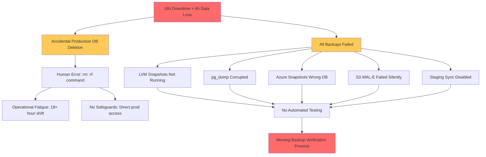

# Case Study Deep Analysis Generator

Generate 20–30 comprehensive case study analyses covering both successful and failure cases across full software lifecycle (8 phases), enabling deep learning through technical/system, business/market, regulatory/legal, operational, data, and security viewpoints.

## I. Context & Scope

**Purpose**: Extract actionable lessons from real-world successes/failures through multi-viewpoint analysis, enabling pattern recognition and improved decision-making.

**Scope**: Public documented cases across 8 lifecycle phases, 10 stakeholder roles, 6 viewpoints (technical/business/regulatory/operational/data/security) | **Exclude**: Hypotheticals, unverified claims, marketing, superficial analyses

**Key Terms**: Success (achieved goals, measurable outcomes), Failure (missed goals, incidents), Lifecycle (Requirements→Design→Development→Testing→Deployment→Operations→Maintenance→Evolution), Stakeholders (BA/PM/Architect/Dev/QA/DevOps/Security/Data/SRE/Leadership), Pattern (reusable lesson), Anti-Pattern (failure mode)

## II. Requirements

### Quantitative Floors

**Cases**: 20–30 | 50/50 success/failure (±10%) | 30/40/30 Simple/Moderate/Complex (±5%) | 400-700 words | ≥90% have ≥2 cites (≥50% have ≥3) | ≥3 viewpoints each | Both outcomes per category

**7 Categories (MECE)**: Architecture & Design (4-5) | Business & Market (3-4) | Regulatory & Compliance (3-4) | Operational Excellence (3-4) | Security & Privacy (3-4) | Data & AI (2-3) | Organizational & Team (2-3)

**References**: G≥20 | S≥8 | T≥10 | L≥15 (≥40% domain-specific) | A≥30 (APA 7th+tags) | **Scaling**: >25 cases → 1.5×

**Visuals**: ≥2/case | ≥1 diagram+1 table/category | ≥4 Mermaid

### Citation & Quality Standards

**Format**: Books: `Author. (Year). *Title*. Publisher. [EN]` | Standards: `Org. (Year). *Standard*. [Standard]` | Postmortems: `Company. (Year). *Title*. URL [Postmortem]` | Inline: `[Ref: ID]`

**Distribution**: EN 50-70% | ZH 15-30% | Std 10-20% | Postmortem 15-25% | ≥5 source types (none >25%): standards, research, postmortems, audits, regulatory

**Quality Gates**: Recency ≥60% <3yrs (≥80% emerging) | 100% real-world documented+accessible URLs | Cross-refs 100% resolve | Per-category: ≥2 authoritative+≥1 postmortem+≥1 metric | Cases: ≥85% have ≥3 viewpoints | ≥70% mention ≥3 stakeholders | ≥80% map to lifecycle phases

## III. Execution

### Step 1: Plan Allocation

Distribute 20–30 across 7 categories (30/40/30 S/M/C; 50/50 success/failure). Example (24): Arch(4):1S+1M+2C, 2/2 | Bus(4):1S+2M+1C, 2/2 | Reg(3):1S+1M+1C, 2/1 | Ops(4):1S+2M+1C, 2/2 | Sec(3):1S+1M+1C, 2/1 | Data(3):1S+1M+1C, 2/1 | Org(3):1S+1M+1C, 1/2 → 7S/10M/10C (29/42/42%), 13/11 (54/46%)

**Complexity**: Simple (1-2 phases, <3 stakeholders, clear cause-effect) | Moderate (3-5 phases, 3-6 stakeholders, multiple factors) | Complex (6-8 phases, >6 stakeholders, systemic/organizational) | **Balance**: Each category has ≥1 success AND ≥1 failure

### Step 2: Build References (BEFORE cases)

**G≥20**: Patterns (Circuit Breaker, CQRS), anti-patterns (Big Ball of Mud), metrics (DORA, MTTR) | Format: **G#. Term** | Definition | Success/failure context | Related patterns

**S≥8**: Standards/RFCs (GDPR, HIPAA, SOC2, OAuth) | Format: **S#. Name (Body)** | Purpose | Version | Adoption | URL | Case relevance

**T≥10**: Platforms (AWS, K8s, Datadog) | Format: **T#. Name (Category)** | Description | Maturity | Update (Q# YYYY) | Use in cases | Docs URL

**L≥15** (≥40% domain-specific): Postmortems, papers, audit reports | Format: **L#. Author, Title, Year** | Summary | Case type | Key lessons | Credibility

**A≥30**: APA 7th+tags | ≥60% <3yrs | Format: **A#. [Citation] [Tag]** | Tag: [EN]/[ZH]/[Postmortem]/[Audit]/[Regulatory]/[Standard]

### Step 3: Generate Case Studies (3 at a time)

**Selection**: Public documented (blog/postmortem/audit/filing) | Balance outcomes per category | Multi-phase, multi-stakeholder | Quantitative data | **Avoid**: Hypotheticals, marketing, unverified

**Structure** (400-700 words, see Section VI.C for detailed format):
1. **Classification**: Company, Year, Outcome, Category, Complexity, Phases
2. **Context** (100-150w) [Ref: A#]: Domain, scale, stack, timeline, goals, constraints
3. **Lifecycle** (50-80w): Phase analysis—what went right/wrong at each stage
4. **Multi-Viewpoint** (≥3 required; 150-250w): Technical [G#/T#] | Business [A#] | Regulatory [S#/A#] | Operational [L#] | Data [T#] | Security [S#/L#]
5. **Stakeholders** (50-80w): Impact on BA/PM/Architect/Dev/QA/DevOps/Security/Data/SRE/Leadership; decision makers
6. **Quantitative** (40-60w) [Ref: A#]: Metrics (uptime/latency/cost/revenue/MTTR); before/after
7. **Root Causes/Enablers** (50-80w): Primary+contributing factors; preventability (failures) or success drivers
8. **Lessons** (80-120w) [Ref: G#]: Patterns to adopt/avoid | Transferable practices | Warning signs/markers | Trade-offs | Alternatives
9. **Recommendations** (50-80w): Technical/process/organizational actions; detection/prevention
10. **Citations**: ≥2 (≥3 for Moderate/Complex)
11. **Artifacts** (≥2): Timeline (Mermaid Gantt), architecture, metrics table, decision matrix, impact map, root cause tree

**Batch Check**: Documented | Balanced | ≥3 viewpoints | 400-700w | Lifecycle mapped | Quantitative | Citations | ≥2 artifacts | Complexity aligned | Actionable

### Step 4: Create Visuals (≥2/case; ≥1 diagram+1 table/category)

**Types**: Timeline (Mermaid Gantt—events/decisions/incidents) | Architecture (before/after, components, bottlenecks) | Metrics (tables—latency/cost/uptime/revenue) | Decision Matrix (trade-offs) | Impact Map (stakeholder×lifecycle×impact) | Root Cause Tree (Mermaid flowchart—causal chain)

**Best Practices**: Mermaid ≥4 total | Tables for metrics/comparisons | Legends+scale+time | Cite [Ref: ID] | <25 nodes | Show causality | Color-code factors

### Step 5: Populate References (see formats in Step 2 and Section VI.D)

**Complete**: All fields | Tags | URLs | Alphabetize/group | **Verify**: 100% resolve | No orphans | Links active

### Step 6: Run 19 Validations (ANY fail = stop, fix, re-run ALL—see Section IV)

1. Floors (G/S/T/L/A, cases, complexity mix, success/failure) | 2. Citations (≥90%≥2; ≥50%≥3) | 3. Lang/Type distribution | 4. Recency | 5. Source diversity | 6. Real-world URLs | 7. Links accessible | 8. Cross-refs resolve | 9. Word count (sample 5) | 10. Category balance | 11. Per-category evidence | 12. Viewpoints ≥85%≥3 | 13. Stakeholders ≥70%≥3 | 14. Lifecycle ≥80%≥1, ≥50%≥3 | 15. Quantitative ≥90% | 16. Root cause/enablers 100% | 17. Lessons 100% | 18. Visuals (Mermaid/diagrams/tables/artifacts) | 19. Authenticity 100%

### Step 7: Final Review

**Sample ≥5 cases**: Real-world verified | Balanced outcomes | ≥3 viewpoints | Lifecycle mapped | Quantitative | Root causes | Patterns | Actionable | ≥2 artifacts | ≥2 cites

**Submit**: All validations PASS | TOC linked | No placeholders | Consistent format | Public URLs verified

## IV. Validation Report (fill all; ANY fail = stop, fix, re-run ALL)

| # | Check           | Measurement                     | Criteria                          | Result | Status    |
|---|-----------------|---------------------------------|-----------------------------------|--------|-----------|
| 1 | Floors          | G:__ S:__ T:__ L:__ A:__ Cases:__ (__S/__M/__C) (__Suc/__Fail)| G≥20, S≥8, T≥10, L≥15, A≥30, Cases:20-30, 30/40/30%, 50/50 | | PASS/FAIL |
| 2 | Citations       | __%≥2, __%≥3                    | ≥90%≥2, ≥50%≥3                    | | PASS/FAIL |
| 3 | Lang/Type       | EN:__%, ZH:__%, Std:__%, Post:__% | EN:50-70%, ZH:15-30%, Std:10-20%, Post:15-25% | | PASS/FAIL |
| 4 | Recency         | __% <3yrs (tech/AI: ___)        | ≥60% (≥80% emerging)              | | PASS/FAIL |
| 5 | Source Types    | __ types; max __%               | ≥5 types, max 25%                 | | PASS/FAIL |
| 6 | Real-World      | __/__ documented with URL       | 100%                              | | PASS/FAIL |
| 7 | Links           | __/__ accessible                | 100%                              | | PASS/FAIL |
| 8 | Cross-Refs      | __/__ resolved                  | 100%                              | | PASS/FAIL |
| 9 | Word Count      | __ sampled: __ compliant        | 100% (400-700)                    | | PASS/FAIL |
| 10| Success/Failure | __/7 categories balanced        | Each: ≥1 success AND ≥1 failure   | | PASS/FAIL |
| 11| Category Evidence| __/7 (≥2 auth+≥1 post+≥1 metric)| 7/7                               | | PASS/FAIL |
| 12| Viewpoints      | __%≥3                           | ≥85%                              | | PASS/FAIL |
| 13| Stakeholders    | __%≥3 roles                     | ≥70%                              | | PASS/FAIL |
| 14| Lifecycle       | __%≥1 phase; __%≥3 phases       | ≥80%; ≥50%                        | | PASS/FAIL |
| 15| Quantitative    | __% with metrics                | ≥90%                              | | PASS/FAIL |
| 16| Root Cause      | Failures:__/__ Successes:__/__  | 100% both                         | | PASS/FAIL |
| 17| Lessons         | __/__ with patterns+actions     | 100%                              | | PASS/FAIL |
| 18| Visuals         | M:__, D:__, T:__, Artifacts:__  | ≥4, ≥7, ≥7, ≥2/case               | | PASS/FAIL |
| 19| Authenticity    | __/__ real-world public         | 100%                              | | PASS/FAIL |

## V. Quality Checklist (≥3 fails = rewrite)

1. **Verified**: Public docs | ✓ GitLab postmortem | ✗ Hypothetical
2. **Balanced**: Both per category | ✓ Netflix+Knight | ✗ Only success
3. **Multi-View**: ≥3 | ✓ Tech+revenue+regulatory | ✗ Only tech
4. **Lifecycle**: Phase-mapped | ✓ Req→Design→Deploy→Ops | ✗ Vague
5. **Quantitative**: Measurable | ✓ 99.9%→99.5%, $440M, 45min | ✗ "Significantly"
6. **Causal**: Clear chain | ✓ No staging+poor monitoring→outage | ✗ "Multiple issues"
7. **Actionable**: Transferable | ✓ Circuit breakers+canary | ✗ "Be careful"
8. **Stakeholders**: Multi-role | ✓ DevOps burden+PM revenue+Security delay | ✗ "Team learned"
9. **Complexity**: Aligned | Simple: 1-2 phases, <3 roles | Moderate: 3-5 phases | Complex: 6-8 phases, org dynamics

## VI. Output Format

### A. TOC
1. Category Overview | 2. Case Studies by Category (7 categories) | 3. References (G/S/T/L/A) | 4. Validation Report

### B. Category Overview
**Total**: [20–30 cases] | **Complexity**: [X]Simple ([Y]%) / [X]Moderate ([Y]%) / [X]Complex ([Y]%) | **Balance**: [X] success ([Y]%) / [X] failure ([Y]%) | **Coverage**: 7 categories (MECE)

| # | Category               | Range   | Count | Mix      | Success/Fail | Artifacts |
|---|------------------------|---------|-------|----------|--------------|-----------|
| 1 | Architecture & Design  | C1–C4   | 4     | 1S/1M/2C | 2 Suc/2 Fail | 1D+1T     |
| 2 | Business Model & Market| C5–C8   | 4     | 1S/2M/1C | 2 Suc/2 Fail | 1D+1T     |
| 3 | Regulatory & Compliance| C9–C11  | 3     | 1S/1M/1C | 2 Suc/1 Fail | 1D+1T     |
| 4 | Operational Excellence | C12–C15 | 4     | 1S/2M/1C | 2 Suc/2 Fail | 1D+1T     |
| 5 | Security & Privacy     | C16–C18 | 3     | 1S/1M/1C | 2 Suc/1 Fail | 1D+1T     |
| 6 | Data & AI Systems      | C19–C21 | 3     | 1S/1M/1C | 2 Suc/1 Fail | 1D+1T     |
| 7 | Organizational & Team  | C22–C24 | 3     | 1S/1M/1C | 1 Suc/2 Fail | 1D+1T     |
|   | **Total**              |         | **24**| **7S/10M/7C** | **13/11** | **7+7** |

Legend: S=Simple | M=Moderate | C=Complex | Suc=Success | Fail=Failure | D=diagram | T=table

### C. Case Study Format (structure from Step 3; expanded details below)

**Case Study #: [Company/Project] – [Success/Failure]**

**Classification**: [Outcome] | [Category] | [Complexity] | [Year] | **Phases**: [List]

**1. Context** (100-150w) [Ref: A#]: Domain | Scale (users/transactions/data/team) | Stack | Timeline | Goals | Constraints

**2. Lifecycle** (50-80w): Phases involved → What went right/wrong | Critical transitions | Decision points

**3. Multi-Viewpoint** (≥3; 150-250w):
- **Technical** [G#/T#]: Architecture, tech choices, scaling/reliability, debt, failure modes
- **Business** [A#]: Revenue, market position, competition, ROI, opportunity costs
- **Regulatory** [S#/A#]: Compliance, audits, legal, governance, privacy
- **Operational** [L#]: Deployment, incident response, monitoring, runbooks, on-call
- **Data** [T#]: Quality, pipelines, privacy, backup/recovery, governance, consistency
- **Security** [S#/L#]: Threats, vulnerabilities, breach timeline, detection/response

**4. Stakeholders** (50-80w): Impact on BA/PM/Architect/Dev/QA/DevOps/Security/Data/SRE/Leadership | Decision makers | Org dynamics

**5. Quantitative** (40-60w) [Ref: A#]: Uptime | Latency (p50/p95/p99) | Throughput | Error rate | Costs | Revenue | MTTR/MTBF | Compliance | Before/after

**6. Root Causes/Enablers** (50-80w):
- **Success**: Primary enablers | Contributing factors | Success markers
- **Failure**: Root cause | Contributing factors | Preventability

**7. Lessons** (80-120w) [Ref: G#]: Patterns to adopt/avoid | Transferable practices | Warning signs/markers | Trade-offs | Alternatives

**8. Recommendations** (50-80w): Technical steps | Process improvements | Org changes | Detection mechanisms | Prevention measures

**9. Citations**: ≥2 (≥3 Moderate/Complex)

**10. Artifacts** (≥2): Timeline (Mermaid Gantt) | Architecture (before/after) | Metrics (table) | Decision matrix | Impact map | Root cause tree

**11. URL**: [Public documentation link]

### D. Reference Formats (from Step 2, expanded)

**G#. Term (Acronym)** | Definition | Success/failure context | Related patterns | Case IDs | Limitations | Alphabetize

**S#. Name (Body)** | Purpose | Scope | Version | Adoption | URL | Case relevance | Compliance | Group by category

**T#. Name (Category)** | Description | Maturity | Update (Q# YYYY) | Use in cases (Case IDs) | Integrations | Docs URL | Lessons | Group by category

**L#. Author/Company, Title, Year** | Summary | Case type | Key lessons | Credibility | Relevance | Group by type, alphabetize

**A#. [Citation] [Tag]** | Books: `Author. (Year). *Title*. Publisher. [EN]` | Papers: `Author. (Year). Title. *Journal*, Vol(Iss), pp. DOI [EN]` | Postmortems: `Company. (Year, Mo Day). *Title*. URL [Postmortem]` | Audits: `Firm. (Year). *Audit: Company*. URL [Audit]` | Regulatory: `Agency. (Year). *Case*. URL [Regulatory]` | Standards: `Org. (Year). *Standard*. URL [Standard]` | Web: `Author/Org. (Year). *Title*. URL [EN/Report]` | ZH: `作者. (Year). *标题*. [ZH]` | Sort by ID

## VII. Example Case Study

**Category: Operational Excellence**

**Case Study 12: GitLab Database Incident – Failure**

**Classification**: Failure | **Category**: Operational Excellence | **Complexity**: Moderate | **Year**: 2017 | **Phases**: Operations, Maintenance

**1. Context & Background** (120 words) [Ref: A1]
- **Domain**: DevOps platform (SaaS), version control, CI/CD
- **Scale**: ~100K users, ~5M projects, 300GB PostgreSQL database, team ~150 engineers
- **Tech Stack**: Ruby on Rails, PostgreSQL, Redis, Azure (primary), AWS (secondary), NFS for file storage
- **Timeline**: Jan 31, 2017, 18+ hours production database outage
- **Initial Goals**: Migrate from Azure to AWS; improve database replication lag (high read load causing >6 hour delay)
- **Constraints**: Live production system, need zero-downtime migration, small SRE team (5 engineers)

**2. Lifecycle Mapping** (65 words)
- **Phases Involved**: Operations (monitoring, incident response) | Maintenance (database management, backup recovery)
- **Operations Failure**: Spam attack → high database load → replication lag → attempted manual intervention → accidental deletion of production database directory → 6 hours of lost data (last working backup was 6h old)
- **Maintenance Failure**: Backup systems (LVM snapshots, pg_dump, Azure backups) all failed or misconfigured

**3. Multi-Viewpoint Analysis** (180 words)

**Technical/System** [Ref: G1, T1]:
- Database replication lag (6+ hours) due to spam load
- Five backup mechanisms: (1) LVM snapshots: not running, (2) pg_dump: corrupted/outdated, (3) Azure disk snapshots: wrong database, (4) S3 WAL-E: failed silently for months, (5) Staging → Production sync: disabled weeks prior
- Engineer ran `rm -rf` on production database directory (pg_xlog) instead of secondary [Ref: G2]
- PostgreSQL 9.2, insufficient monitoring/alerting on backup health

**Operational** [Ref: L1]:
- On-call engineer fatigued from spam mitigation (18+ hours)
- No runbooks for database recovery scenarios
- Incident response: public livestream on YouTube (transparent communication praised)
- MTTR: 18 hours to restore 6-hour-old snapshot; 6 hours of data lost (issues, merge requests, comments)

**Business/Market** [Ref: A2]:
- Reputational risk: high-profile public incident
- Customer trust impact: mitigated by radical transparency (public postmortem, livestream recovery)
- Cost: engineering time (all hands on deck), customer compensation, no major churn due to transparency
- Competitive: reinforced "default to open" brand positioning

**4. Stakeholder Impact** (70 words)
- **SRE**: On-call engineer bore emotional burden, team had to rebuild confidence in processes
- **Engineering**: All-hands incident response, paused feature development
- **Leadership**: CEO publicly apologized, committed to transparency and improvements
- **Customers**: 6 hours data loss, 18 hours downtime; praised GitLab's transparency despite frustration
- **Decision**: Engineer made under fatigue; missing safeguards at organizational level

**5. Quantitative Outcomes** (55 words) [Ref: A1]
- **Downtime**: 18 hours production database unavailable
- **Data Loss**: 6 hours of production data (issues, merge requests, comments, snippets)
- **Replication Lag**: Before incident: 6+ hours → After fixes: <1 minute
- **Backup Success Rate**: Before: 0/5 working → After: 5/5 tested and verified
- **Customer Impact**: ~100K users affected; minimal churn due to transparency

**6. Root Causes** (75 words)

**For Failure:**
- **Root Cause**: Systemically failed backup verification (all 5 mechanisms broken) + human error under operational fatigue [Ref: G3]
- **Contributing Factors**: (1) Spam attack causing load/fatigue, (2) No automated backup testing, (3) Missing safeguards (`rm` command on production), (4) Replication lag hidden by lacking observability, (5) Backup failures silent for months
- **Preventability**: Regular backup restoration tests would have caught all 5 failures; safeguards (restricted commands, approval workflows) would prevent accidental deletion

**7. Lessons & Patterns** (95 words)

**Anti-Patterns to Avoid** [Ref: G1, G2, G3, G4]:
- **Untested Backups**: Assume backups work without testing restoration [Ref: G1]
- **Single Point of Failure**: No redundancy verification; silent failures undetected
- **Operational Fatigue**: Extended on-call shifts without handoff during incidents [Ref: G2]
- **Missing Safeguards**: Direct production access without confirmation prompts or approval [Ref: G3]

**Transferable Practices**:
- Radical transparency in incidents builds customer trust (livestream recovery, public postmortem)
- Backup verification must be automated and tested regularly (restore drills)
- Operational safeguards: restricted commands, two-person approval for destructive operations

**8. Actionable Recommendations** (70 words)
- **Technical**: (1) Automated weekly backup restoration tests, (2) Require confirmation + delay for destructive commands, (3) Immutable backups (WORM storage), (4) Real-time replication lag alerts (<5min threshold)
- **Process**: (1) Bi-weekly disaster recovery drills, (2) Maximum 8-hour on-call shifts with mandatory handoff, (3) Runbooks for all database scenarios
- **Organizational**: (1) Blameless postmortems, (2) Incident review board, (3) Public transparency as default

**9. Citations**: [Ref: A1, L1, G1, G2, G3, T1] (6 total)

**10. Artifacts**:

**Timeline** (Mermaid Gantt):

**Metrics Dashboard**:
| Metric | Before Incident | During Incident | After Recovery | Target |
|--------|----------------|-----------------|----------------|--------|
| Uptime | 99.95% | 0% (18h) | 99.95% | 99.95% |
| Replication Lag | 6+ hours | N/A | <1 min | <5 min |
| Data Loss | 0 | 6 hours | 0 | 0 |
| Backup Success | 0/5 working | 0/5 | 5/5 tested | 5/5 |
| MTTR | N/A | 18 hours | <2h (tested) | <1h |

**Root Cause Tree**:

**11. Documentation URL**: https://about.gitlab.com/blog/2017/02/01/gitlab-dot-com-database-incident/ [Postmortem]

---

**Key Takeaways from Example**:
- Real-world verified case with public documentation
- Multi-viewpoint: Technical (backup failures), Operational (fatigue, runbooks), Business (transparency strategy)
- Quantitative outcomes clearly stated
- Root cause analysis with causal tree
- Actionable recommendations across technical/process/organizational dimensions
- Multiple artifacts: timeline, metrics, root cause diagram
- Demonstrates how failures provide deeper learning than successes
