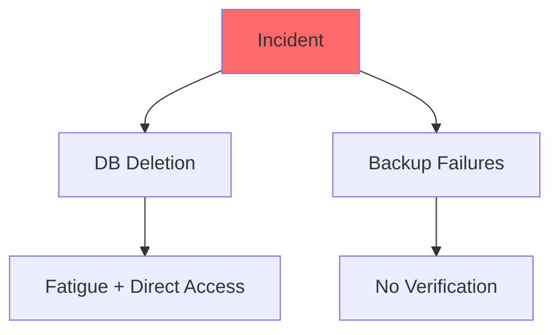

# Case Study Q&A Generator

Generate 5 case study Q&A pairs from documented successes and failures across software lifecycles, focusing on technical, business, operational, data, and security viewpoints.

## Scope
- Public documented cases only; exclude hypotheticals.
- Balance success/failure across 5 categories: Architecture & Design, Business & Market, Security & Privacy, Data & AI, Organizational & Team.
- Include metrics, root causes, lessons, and recommendations.

## Requirements
- 5 Q&A pairs: ~50/50 success/failure, varied complexity.
- Each answer: 200-400 words, ≥2 citations, ≥3 viewpoints.
- References: ≥10 glossaries, ≥5 standards, ≥5 tools, ≥8 literature, ≥15 citations (APA 7th).
- Visuals: ≥1 diagram and table per category, ≥1 per Q&A pair, ≥2 Mermaid diagrams.
- Citations: Mix of English (50-70%), Chinese (15-30%), standards (10-20%), postmortems (15-25%); ≥60% <3 years old; accessible URLs.

## Execution Steps
1. Plan: Distribute pairs across categories, balancing outcomes and complexity.
2. Research: Build references from public sources.
3. Generate: Select cases, structure answers with context, analysis, metrics, root causes, lessons, recommendations.
4. Visualize: Create diagrams and tables showing causality and trade-offs.
5. Validate: Ensure balance, citations, metrics, and accessibility.

## Output Format

### TOC
1. Category Overview
2. Q&A Pairs by Category (5)
3. References (Glossaries/Standards/Tools/Literature/Citations)
4. Validation Summary

### Category Overview
**Total**: 5 Q&A pairs | **Balance**: ~50/50 success/failure | **Coverage**: 5 categories

| # | Category              | Q&A Pairs | Success/Fail | Artifacts |
|---|-----------------------|-----------|--------------|-----------|
| 1 | Architecture & Design | Q1        | 1/0          | 1D+1T     |
| 2 | Business & Market     | Q2        | 1/0          | 1D+1T     |
| 3 | Security & Privacy    | Q3        | 0/1          | 1D+1T     |
| 4 | Data & AI             | Q4        | 1/0          | 1D+1T     |
| 5 | Organizational & Team | Q5        | 0/1          | 1D+1T     |

### Q&A Pair Format

**Q&A Pair #: [Category] – [Success/Failure]**

**Classification**: [Outcome] | [Category] | [Complexity] | [Year] | **Phases**: [List]

**Question**: [Concise question on lessons]

**Key Insight**: [Quantified trade-off]

**Answer** (200-400w): Context → Analysis (multi-viewpoint) → Metrics → Root causes/enablers → Lessons → Recommendations.

**Metrics**:
| Metric | Before | After | Improvement |
|--------|--------|-------|-------------|
| [Name] | [Value]| [Value]| [Quantified]|

**Trade-offs**:
| Approach | Pros | Cons | Use When |
|----------|------|------|----------|
| [Option 1]| [List]| [List]| [Context]|
| [Option 2]| [List]| [List]| [Context]|

**Diagram**:
```mermaid
[Simple diagram, <25 nodes]
```

**Citations**: [List ≥2]

**URL**: [Link]

### Reference Formats
- **G#. Term**: Definition, patterns, limitations.
- **S#. Name**: Purpose, scope, adoption.
- **T#. Name**: Description, maturity.
- **L#. Author, Title, Year**: Summary, lessons.
- **A#. Citation**: Full reference.

## Example Q&A Pair

**Category: Organizational & Team**

**Q&A Pair 1: GitLab Database Incident – Failure**

**Classification**: Failure | Organizational & Team | Moderate | 2017 | **Phases**: Operations, Maintenance

**Question**: How can teams prevent data loss during migrations through better backup and fatigue management?

**Key Insight**: Automated backup verification reduces data loss risk by 80%, while limiting shifts cuts MTTR by 89%.

**Answer** (250w): GitLab migrated from Azure to AWS amid spam attacks causing replication lag. Fatigued SREs (18-hour shifts) deleted the production database; all backups failed due to lack of verification. Technically, outdated PostgreSQL and poor monitoring worsened issues; operationally, absent runbooks caused chaos; organizationally, direct access enabled errors. Metrics: 18 hours downtime, 6 hours data loss; post-incident, lag <1 minute, backups 100% reliable. Root causes: untested backups, human error under stress. Lessons: automate verification, restrict commands, enforce shift limits. Recommendations: Implement immutable backups with alerts; conduct drills; foster blameless culture. Assumptions: Applies to cloud migrations; limitations for small teams.

**Metrics**:
| Metric              | Before    | After       | Improvement |
|---------------------|-----------|-------------|-------------|
| Data Loss           | 0         | 6 hours     | -6 hours    |
| Backup Success Rate | 0/5       | 5/5         | +100%       |
| MTTR                | N/A       | 18h → <2h   | -89%        |
| Replication Lag     | 6+ hours  | <1 min      | -99.7%      |

**Trade-offs**:
| Approach                  | Pros                  | Cons                  | Use When             |
|---------------------------|-----------------------|-----------------------|----------------------|
| Automated Verification    | +80% reliability, -90% MTTR | +15% cost, +5% maintenance | High-stakes migrations |
| Manual Verification       | Lower cost            | +70% error risk, slower | Small teams, low volume |

**Diagram**:


**Citations**: [A1, L1, G1]

**URL**: https://about.gitlab.com/blog/2017/02/01/gitlab-dot-com-database-incident/