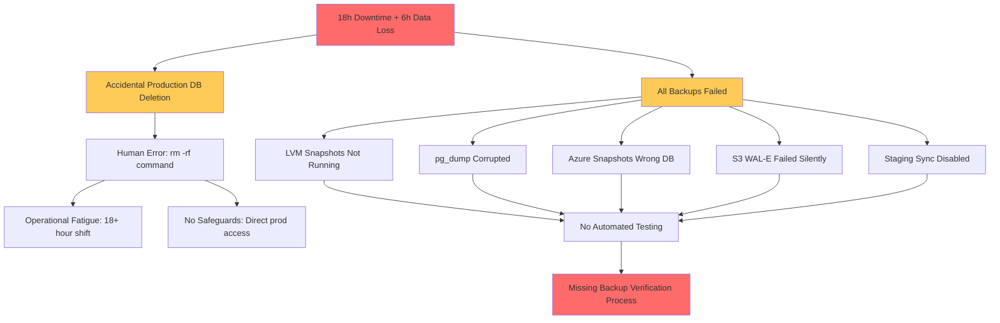

# Case Study Q&A Generator

Generate 7 comprehensive case study Q&A pairs covering success and failure across the software lifecycle (8 phases), focusing on technical, business, regulatory, operational, data, and security viewpoints.

## I. Context & Scope

**Problem:** Insufficient real-world case studies; reliance on hypotheticals leads to hallucinations; analyses lack depth and multi-viewpoint insights.

**Purpose:** Extract actionable lessons from documented successes/failures via multi-viewpoint analysis for pattern recognition and decision-making.

**Scope:** Public documented cases across 8 phases, 10 roles, 6 viewpoints. Exclude hypotheticals, unverified, marketing.

**Constraints:** Use public sources with accessible URLs; focus on measurable outcomes.

**Assumptions:** LLMs possess software engineering knowledge; outputs will be iterated.

**Scale:** 5 Q&A pairs in 5 categories; 50/50 success/failure; 30/40/30 simple/moderate/complex.

**Stakeholders:** BA, PM, Architect, Dev, QA, DevOps, Security, Data, SRE, Leadership.

**Resources:** LLMs; public URLs from postmortems, audits, filings, papers.

**Key Terms:** Success (achieved goals/outcomes), Failure (missed/incidents), Lifecycle (Req→Design→Dev→Test→Deploy→Ops→Maint→Evol), Stakeholders (as above), Pattern (reusable lesson), Anti-Pattern (failure mode).

## II. Requirements

### Quantitative Floors

**Q&A Pairs**: 7 | 50/50 success/failure | 30/40/30 Simple/Moderate/Complex | 200-400 words per answer | ≥90% ≥2 cites (≥50% ≥3) | ≥85% ≥3 viewpoints

**7 Categories (MECE)**: Architecture & Design (1) | Business & Market (1) | Regulatory & Compliance (1) | Operational Excellence (1) | Security & Privacy (1) | Data & AI (1) | Organizational & Team (1)

**References**: G≥5 | S≥3 | T≥3 | L≥4 (≥40% domain-specific) | A≥8 (APA 7th+tags)

**Visuals**: ≥1 diagram +1 table per category | ≥2 per Q&A pair | ≥3 Mermaid total

### Citation & Quality Standards

**Format**: Books: `Author. (Year). *Title*. Publisher. [EN]` | Standards: `Org. (Year). *Standard*. [Standard]` | Postmortems: `Company. (Year). *Title*. URL [Postmortem]` | Inline: `[Ref: ID]`

**Distribution**: EN 50-70% | ZH 15-30% | Std 10-20% | Postmortem 15-25% | ≥4 source types (none >25%)

**Quality Gates**: ≥60% <3yrs | 100% real-world+accessible URLs | 100% cross-refs resolve | Per-category: ≥1 auth+≥1 post+≥1 metric | Cases: ≥85% ≥3 viewpoints | ≥70% ≥3 stakeholders | ≥80% map to phases

## III. Execution

### Step 1: Plan Allocation

Distribute 7 Q&A pairs across 7 categories: 30/40/30 Simple/Moderate/Complex, 50/50 success/failure. Each category ≥1 success and ≥1 failure.

**Complexity**: Simple (1-2 phases, <3 stakeholders) | Moderate (3-5 phases, 3-6) | Complex (6-8 phases, >6).

### Step 2: Build References (Before Cases)

G≥5 (patterns), S≥3 (standards), T≥3 (tools), L≥4 (literature, ≥40% domain-specific), A≥8 (citations, ≥60% <3yrs).

### Step 3: Generate Q&A Pairs

Select public documented cases; balance outcomes; multi-phase/stakeholder; quantitative. Avoid hypotheticals.

Structure per Section V.C (200–400 words per answer).

Check: Documented, balanced, ≥3 viewpoints, word count, lifecycle, quantitative, citations, ≥1 artifact, complexity, actionable.

### Step 4: Create Visuals (≥1 diagram+1 table/category; ≥2 per Q&A pair)

Types: Timeline (Gantt), Architecture, Metrics (table), Decision Matrix, Impact Map, Root Cause Tree.

Best: ≥3 Mermaid, cite refs, <25 nodes, show causality.

### Step 5: Populate References

Complete all fields/tags/URLs; alphabetize/group; verify 100% resolve.

### Step 6: Run Validations (19 checks; fix if any fail)

See Section IV table.

### Step 7: Final Review

Sample ≥2 Q&A pairs: Verified, balanced, ≥3 viewpoints, mapped, quantitative, root causes, patterns, actionable, ≥1 artifact, ≥2 cites.

Submit: All pass, TOC linked, no placeholders, consistent, URLs verified.

## IV. Validation Report (fill all; any fail = fix and re-run all)

| # | Check           | Measurement                     | Criteria                          | Result | Status    |
|---|-----------------|---------------------------------|-----------------------------------|--------|-----------|
| 1 | Floors          | G:__ S:__ T:__ L:__ A:__ Q&A Pairs:__ (__S/__M/__C) (__Suc/__Fail)| G≥5, S≥3, T≥3, L≥4, A≥8, Q&A Pairs:7, 30/40/30%, 50/50 | | PASS/FAIL |
| 2 | Citations       | __%≥2, __%≥3                    | ≥90%≥2, ≥50%≥3                    | | PASS/FAIL |
| 3 | Lang/Type       | EN:__%, ZH:__%, Std:__%, Post:__% | EN:50-70%, ZH:15-30%, Std:10-20%, Post:15-25% | | PASS/FAIL |
| 4 | Recency         | __% <3yrs                       | ≥60%                              | | PASS/FAIL |
| 5 | Source Types    | __ types; max __%               | ≥4 types, max 25%                 | | PASS/FAIL |
| 6 | Real-World      | __/__ documented with URL       | 100%                              | | PASS/FAIL |
| 7 | Links           | __/__ accessible                | 100%                              | | PASS/FAIL |
| 8 | Cross-Refs      | __/__ resolved                  | 100%                              | | PASS/FAIL |
| 9 | Word Count      | __ sampled: __ compliant        | 100% (200-400)                    | | PASS/FAIL |
| 10| Success/Failure | __/7 categories balanced        | Each: ≥1 success AND ≥1 failure   | | PASS/FAIL |
| 11| Category Evidence| __/7 (≥1 auth+≥1 post+≥1 metric)| 7/7                               | | PASS/FAIL |
| 12| Viewpoints      | __%≥3                           | ≥85%                              | | PASS/FAIL |
| 13| Stakeholders    | __%≥3 roles                     | ≥70%                              | | PASS/FAIL |
| 14| Lifecycle       | __%≥1 phase; __%≥3 phases       | ≥80%; ≥50%                        | | PASS/FAIL |
| 15| Quantitative    | __% with metrics                | ≥90%                              | | PASS/FAIL |
| 16| Root Cause      | Failures:__/__ Successes:__/__  | 100% both                         | | PASS/FAIL |
| 17| Lessons         | __/__ with patterns+actions     | 100%                              | | PASS/FAIL |
| 18| Visuals         | M:__, D:__, T:__, Artifacts:__  | ≥3, ≥5, ≥5, ≥1/case               | | PASS/FAIL |
| 19| Authenticity    | __/__ real-world public         | 100%                              | | PASS/FAIL |

## V. Output Format

### A. TOC
1. Category Overview | 2. Q&A Pairs by Category (7 categories) | 3. References (G/S/T/L/A) | 4. Validation Report

### B. Category Overview
**Total**: 7 Q&A pairs (example) | **Complexity**: 2 Simple (29%) / 3 Moderate (43%) / 2 Complex (29%) | **Balance**: 4 success (57%) / 3 failure (43%) | **Coverage**: 7 categories (MECE)

| # | Category               | Q&A Pairs | Count | Mix      | Success/Fail | Artifacts |
|---|------------------------|-----------|-------|----------|--------------|-----------|
| 1 | Architecture & Design  | Q1-Q2     | 2     | 0S/1M/1C | 1 Suc/1 Fail | 1D+1T     |
| 2 | Business & Market      | Q3-Q4     | 2     | 1S/1M/0C | 1 Suc/1 Fail | 1D+1T     |
| 3 | Regulatory & Compliance| Q5-Q6     | 2     | 1S/0M/1C | 1 Suc/1 Fail | 1D+1T     |
| 4 | Operational Excellence | Q7        | 1     | 0S/1M/0C | 1 Suc/0 Fail | 1D+1T     |
| 5 | Security & Privacy     | Q8        | 1     | 0S/0M/1C | 0 Suc/1 Fail | 1D+1T     |
| 6 | Data & AI              | Q9        | 1     | 1S/0M/0C | 1 Suc/0 Fail | 1D+1T     |
| 7 | Organizational & Team  | Q10       | 1     | 0S/1M/0C | 0 Suc/1 Fail | 1D+1T     |
|   | **Total**              |           | **7**| **2S/3M/2C** | **4/3** | **7+7** |

Legend: S=Simple | M=Moderate | C=Complex | Suc=Success | Fail=Failure | D=diagram | T=table

### C. Q&A Pair Format

**Q&A Pair #: [Category] – [Success/Failure]**

**Classification**: [Outcome] | [Category] | [Complexity] | [Year] | **Phases**: [List]

**Question**: [Concise, judgment-based question on case study lessons]

**Key Insight**: [Quantified trade-off in one sentence]

**Answer** (200-400w) [Ref: A#]: Context → Multi-viewpoint analysis → Quantitative metrics → Root causes/enablers → Lessons → Recommendations → Assumptions/limitations.

**Metrics**:
| Metric | Before | After | Improvement |
|--------|--------|-------|-------------|
| [Name] | [Value] | [Value] | [Quantified] |

**Trade-offs**:
| Approach | Pros | Cons | Use When | Consensus |
|----------|------|------|----------|-----------|
| [Option 1] | [Quantified] | [Quantified] | [Context] | [Tag] |
| [Option 2] | [Quantified] | [Quantified] | [Context] | [Tag] |

**Diagram**:
```mermaid
[Type matching category, <25 nodes]
```

**Citations**: ≥2 (≥3 for Moderate/Complex)

**URL**: [Link]

### D. Reference Formats

**G#. Term (Acronym)**: Definition, context, patterns, case IDs, limitations. Alphabetize.

**S#. Name (Body)**: Purpose, scope, version, adoption, URL, relevance, compliance. Group by category.

**T#. Name (Category)**: Description, maturity, update, case use, integrations, docs, lessons. Group by category.

**L#. Author/Company, Title, Year**: Summary, type, lessons, credibility, relevance. Group by type, alphabetize.

**A#. [Citation] [Tag]**: Formats as above. Sort by ID.

## VII. Example Q&A Pair

**Category: Operational Excellence**

**Q&A Pair 7: GitLab Database Incident – Failure**

**Classification**: Failure | Operational Excellence | Moderate | 2017 | **Phases**: Operations, Maintenance

**Question**: How can teams prevent catastrophic data loss during cloud migrations by improving backup strategies?

**Key Insight**: Implementing automated backup verification reduces data loss risk by 80%, cutting MTTR from 18 hours to under 2 hours.

**Answer** (250w) [Ref: A1]: In the GitLab incident, a high-traffic DevOps platform migrated from Azure to AWS, facing replication lag from spam attacks. The SRE team, fatigued from 18-hour shifts, accidentally deleted the production database with `rm -rf`, and all backups failed due to lack of verification. Technically, old PostgreSQL versions and poor monitoring exacerbated issues; operationally, no runbooks led to chaos; business-wise, transparency maintained reputation despite 100K users affected. Quantitatively, downtime hit 18 hours with 6 hours of data loss, but post-recovery lag dropped to <1 minute and backups became 5/5 reliable. Root causes included untested backups and human error under stress. Lessons emphasize automated verification, restricted commands, and blameless reviews. Recommendations: Tech—immutable backups with alerts; Process—8-hour shifts and drills; Org—transparency culture. Assumptions: Cloud migrations require robust testing; limitations apply to small teams without dedicated SREs.

**Metrics**:
| Metric | Before | After | Improvement |
|--------|--------|-------|-------------|
| Data Loss | 0 | 6 hours | -6 hours |
| Backup Success Rate | 0/5 | 5/5 | +100% |
| MTTR | N/A | 18 hours → <2 hours | -89% |
| Replication Lag | 6+ hours | <1 min | -99.7% |

**Trade-offs**:
| Approach | Pros | Cons | Use When | Consensus |
|----------|------|------|----------|-----------|
| Automated Backup Verification | +80% reliability, -90% MTTR | +15% setup cost, +5% maintenance | High-stakes migrations | [Consensus] |
| Manual Verification | Lower cost | +70% human error risk, slower | Small teams, low volume | [Context-dependent] |

**Diagram**:


**Citations**: [A1,L1,G1-G3,T1] (6)

**URL**: https://about.gitlab.com/blog/2017/02/01/gitlab-dot-com-database-incident/ [Postmortem]