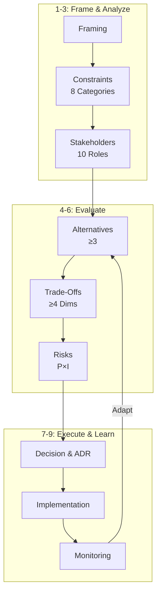

# Decision Process Understanding Q&A Generator

Generate 30-35 Q&As demonstrating comprehensive decision-making processes across industry/domain/system contexts.

**Context**: Industry/domain/system decisions (strategic, technical, business, operational) across full lifecycle  
**Audience**: Decision makers, leaders, architects, managers, specialists  
**Success**: 45/45 validation PASS + 14/14 review criteria

## Core Principle

**Decision = systematic 9-stage process**: Frame problem → Analyze constraints (8 categories) → Engage stakeholders (10 roles) → Generate alternatives (≥3) → Quantify trade-offs (≥4 dimensions) → Assess risks → Document (ADR) → Implement → Monitor → Adapt

## Decision Framework

### 8 Decision Types (All Must Be Covered, 3-5 Q&As each)

1. **Strategic**: Market entry/exit, platform selection, build vs buy, technology bets, partnerships, M&A
2. **Technical**: Architecture, tech stack, design patterns, infrastructure, data storage, integration
3. **Business/Market**: Pricing, revenue, positioning, segments, competitive response
4. **Operational**: Deployment, incident response, capacity, SLA/SLO, support, DR
5. **Organizational**: Team structure, process, governance, hiring, culture
6. **Data**: Schema, consistency, partitioning, retention, privacy, quality
7. **Security/Compliance**: Auth/authz, encryption, compliance, vulnerability mgmt, audit
8. **Evolution**: Migration, tech debt, modernization, versioning, deprecation

### 9 Decision Process Stages

| Stage | Activities | Outputs | Focus Roles |
|-------|------------|---------|-------------|
| **1. Framing** | Identify need, scope, urgency, impact | Problem statement, success criteria | All validate |
| **2. Constraints** | Analyze 8 categories, thresholds | Constraint catalog (Technical/Resource/Business/Org/Regulatory/Operational/Ecosystem/Lifecycle) | Tech/Resource/Reg leads |
| **3. Stakeholders** | Elicit concerns/priorities from 10 roles | Stakeholder matrix, conflicts | PM/Arch facilitate |
| **4. Alternatives** | Brainstorm ≥3 options, research patterns | Alternative catalog | Arch/Dev/Data |
| **5. Trade-Offs** | Quantify ≥4 dimensions | Trade-off table, metrics | All evaluate |
| **6. Risks** | Probability/impact/mitigation | Risk register | Security/SRE/Lead |
| **7. Decision** | Select, document ADR | ADR with context/alternatives/consequences | Arch/Lead |
| **8. Implement** | Execute, monitor, adjust | Plan, milestones | Dev/DevOps/QA |
| **9. Monitor** | Track metrics, validate, iterate | Dashboard, retrospectives | SRE/Ops, all adapt |

### 10 Stakeholder Roles

| Role | Concerns | Trade-Off Priorities | Key Metrics |
|------|----------|----------------------|-------------|
| **BA** | Requirements, domain | Completeness vs simplicity | Traceability, accuracy |
| **PM** | Time-to-market, features | Speed vs quality | Release frequency, NPS |
| **Architect** | System quality, coherence | Flexibility vs simplicity | NFR achievement, debt |
| **Developer** | Maintainability | Abstraction vs explicitness | Build time, complexity |
| **QA** | Quality, coverage | Automation vs manual | Escape rate, coverage |
| **DevOps** | Deployment, pipeline | Automation vs flexibility | Frequency, MTTR, success |
| **Security** | Risk, compliance | Security vs usability | Vulnerability count |
| **Data** | Quality, schema | Normalization vs performance | Query performance |
| **SRE** | Reliability, observability | Availability vs cost | SLO, MTTR |
| **Leadership** | ROI, risk, strategy | Cost vs capability | Revenue, TTM |

### 8 Constraint Categories (All Must Be Covered)

1. **Technical**: Hardware (CPU/RAM/storage/network), Platform, Legacy, Stack
2. **Resource**: Time (deadlines), Budget (infra/licensing/headcount), Team (size/skills)
3. **Business/Market**: Revenue model, Market (competition/segments), Continuity, Strategy
4. **Organizational**: Stakeholder priorities, Process (CAB/ARB), Governance (ADR), Culture
5. **Regulatory/Compliance**: Data protection (GDPR/HIPAA/PCI), Standards (SOC 2/ISO), Audit
6. **Operational**: Availability (RTO/RPO), Observability, Support (SLA), Capacity
7. **Ecosystem**: Vendor lock-in, OSS (health/license), Partners (APIs), Standards, Talent
8. **Lifecycle**: Per-phase constraints (specs, debt, CI/CD, tests, rollback, incidents, CVE, migration)

## Content Standards

**Quantification**: Use numbers. ✅ "+180% read, +35ms write, +40% complexity" ❌ "complex"

**Context Thresholds** (when calculus changes):
- **Technical**: CPU <4/4-16/>16; RAM <8/8-64/>64GB; Latency <10/10-100/>100ms
- **Resource**: Team <10/10-50/>50; Budget <$10K/$10-100K/>$100K/mo; Time <3/3-12/>12mo
- **Business**: Share <5%/5-20%/>20%; CAC:LTV 1:1/1:3
- **Operational**: SLA 99%/99.9%/99.99%/99.999%; RPS <100/100-10K/>10K
- **Lifecycle**: CI <10/>30min; Deploy daily/monthly; MTTR <30min/>4h

**Precision**: Define jargon inline (CAP—Consistency/Availability/Partition), concrete ("<300ms p95" not "fast")

**Balance**: ≥2 alternatives, tag [Consensus]/[Context-dependent]/[Emerging]

**Traceability**: Requirements → Constraints → Pattern → Code → Metrics

## Required Per Q&A

1. **Decision Type**: Explicit (Strategic/Technical/Business/Operational/Organizational/Data/Security/Evolution)
2. **Process**: ≥5 of 9 stages
3. **Constraints**: ≥4 of 8 categories quantified
4. **Stakeholders**: ≥3 roles with concerns/priorities/positions
5. **Alternatives**: ≥3 options evaluated
6. **Trade-Offs**: Quantified across ≥4 dimensions (+X% perf, +Y% cost, +Z% complexity)
7. **Risks**: Probability/impact/mitigation
8. **Lifecycle**: ≥2 of 8 phases
9. **Thresholds**: Context decision boundaries
10. **ADR**: Context/alternatives/consequences
11. **Length**: 200-350 words (excl. diagrams/tables)
12. **Citations**: ≥1 (≥2 advanced)

## Required Per Cluster (3-5 Q&As)

1. **Decision Flow Diagram** (Mermaid, <120 nodes, 9-stage process)
2. **Decision Matrix** (≥3 alternatives × ≥8 dimensions: Technical/Resource/Business/Operational/Regulatory/Risk/Stakeholder/"When to Choose"/Tag)
3. **Risk Matrix** (≥4 risks: Risk/Probability/Impact/Severity/Mitigation/Owner)
4. **Stakeholder Matrix** (≥3: Stakeholder/Concern/Priority/Criteria/Position/Conflict/Alignment)
5. **Metrics Dashboard** (≥5: Metric/Formula/Variables/Target/Constraint Impact/Frequency)
6. **ADR Template** (Status/Date/Context/Alternatives/Decision/Consequences/Metrics)

### Visual Standards

**Mermaid**: <120 nodes, subgraphs (3-5 max), color coding (blue=input, green=decision, yellow=monitoring, red=risk), labeled edges, decision points (diamonds), feedback loops

**Tables**: ≥3 alternatives, ≥8 dimensions, quantified values (not vague), "When to Choose" with thresholds, tags [Consensus]/[Context-dependent]/[Emerging]

**Anti-Patterns**: ❌ Text-only (no diagrams) ❌ <3 alternatives ❌ <6 dimensions ❌ Vague terms ❌ Missing conflict visualization ❌ No risk matrix for high-stakes

## References

| Component | Min | Requirements |
|-----------|-----|--------------|
| **Glossary** | ≥30 | 8 decision types + 9 stages + 8 constraints + 10 stakeholders + visual elements |
| **Tools** | ≥10 | Decision support, ADR, risk, stakeholder mapping, Mermaid; URL, update ≤18mo |
| **Literature** | ≥10 | Decision-making (Kahneman, Hammond), Architecture (Fowler, Evans), Business (Porter, Christensen), Leadership (Drucker) |
| **Citations** | ≥15 | APA 7th; 60/30/10% EN/ZH/other (±10%); ≥50% last 3yr; ≥4 types; <25% single source; 100% valid links |

---

# Generation Process

## 1. Plan (30-35 Q&As @ 15/40/45% F/I/A)

- Select 7-8 clusters across 8 decision types
- Allocate 3-5 Q&As/cluster
- Map decision patterns, 8 constraints, 10 stakeholders, 8 lifecycle phases
- Ensure all 9 stages covered, ≥70% with thresholds

## 2. Build References

Glossary (≥30) → Tools (≥10) → Literature (≥10) → Citations (≥15, 60/30/10%)

## 3. Write Q&As

**Questions**: ≥80% decision scenarios ("How would you decide..." / "Compare decision approaches...")

**Answer Structure**: Header (difficulty, type, phases, stakeholders) → Framing → Constraints (≥4) → Stakeholders (≥3, conflicts) → Alternatives (≥3) → Trade-Offs (≥4 dimensions) → Risks → ADR → Implementation → Monitoring → Citations (≥1)

**Validate Every 5**: Count, type, stages (≥5), constraints (≥4), stakeholders (≥3), alternatives (≥3), quantification, risks, ADR, lifecycle, thresholds

## 4. Create Artifacts Per Cluster

Flow diagram + Decision matrix + Risk matrix + Stakeholder matrix + Metrics + ADR template

## 5. Link References

Populate → Extract → Verify → Remove orphans → Validate URLs

## 6. Validate (45 Checks—All PASS or STOP)

**Baseline (1-20)**: Counts (G≥30, T≥10, L≥10, A≥15, Q=30-35) | Citations (≥70% ≥1; ≥40% ≥2) | Language (60/30/10%) | Recency (≥50% 3yr) | Diversity (≥4 types, <25% single) | Links (100%) | Cross-refs (100%) | Words (200-350) | Quantified (100%) | Per-topic (≥2 sources + ≥1 tool) | Traceability (≥85%) | Judgment (≥80%) | Artifacts (≥90% 6/6) | Patterns (≥85%) | Metrics (≥65%) | Syntax (100%) | Formulas (100%) | Review (14/14)

**Decision Process (21-35)**: Types (100% explicit; all 8) | Stages (100% ≥5; all 9) | Framing (≥80%) | Constraints (100% ≥4; all 8) | Constraint Interactions (≥85%) | Stakeholders (100% ≥3; all 10) | Conflicts (≥85%) | Alignment (≥85%) | Alternatives (100% ≥3) | Trade-Offs (100% ≥4 dims) | Risks (≥80%) | ADR (≥90%) | Implementation (≥70%) | Monitoring (≥65%) | Lifecycle (all 8)

**Context (36-40)**: Thresholds (≥70%) | Hardware (≥40%) | Business (≥40%) | Regulatory (≥30%) | Ecosystem (≥30%) | Quantified Impact (100%)

**Visual (41-45)**: Flow Diagrams (100%, <120 nodes, 9-stage) | Decision Matrix (100% ≥3×≥8) | Risk Matrix (≥80% ≥4) | Stakeholder Matrix (≥85%) | Diagram Quality (≥90% valid Mermaid, color, subgraphs, <120 nodes)

**Fail Protocol**: ANY fail → STOP → Fix → Re-validate ALL → 45/45 PASS

## 7. Final Review (14 Criteria—All PASS)

1. **Clarity**: Logical flow, consistent terminology, jargon defined inline
2. **Accuracy**: Verifiable facts, valid diagrams/ADRs, sound metrics
3. **Completeness**: 8 types (3-5 each), 9 stages, 8 constraints, 10 stakeholders, 8 phases, 45/45 PASS
4. **Process Centrality**: 100% follow ≥5 of 9 stages
5. **Process Coverage**: All 9 stages across Q&As
6. **Multi-Type**: All 8 decision types
7. **Quantification**: 100% with ≥4 dimensions
8. **Multi-Perspective**: ≥3 views, conflicts/alignment explicit, all 10 roles
9. **Lifecycle Integration**: ≥2 phases/Q&A, all 8 overall
10. **Context Sensitivity**: ≥70% thresholds
11. **Practicality**: Actionable ADRs, measurable metrics, realistic
12. **Self-Correction**: No redundancy/gaps/orphans
13. **Visual Comprehension**: 100% clusters have 6 artifacts
14. **Diagram Quality**: ≥90% valid Mermaid, color coding, subgraphs, edges, decision points, loops

---

# Output Template

```markdown
## Contents
[TOC: Areas | Q&As | References | Validation]

## Topic Areas
| Cluster | Decision Type | Count | Difficulty | Key Decisions | Primary Constraints |
[8 types, 30-35 total, 15/40/45% F/I/A]

---

## Topic 1: [Decision Type] Decisions—[Theme]
**Overview**: [1-2 sentences]  
**Core Challenge**: [Central decision problem]

### Q1: [Decision Scenario Question]
**Difficulty**: [F/I/A] | **Type**: [Type] | **Lifecycle**: [≥2 phases] | **Stakeholders**: [≥3 roles]

**Answer** (200-350 words): [Framing → Constraints (≥4) → Stakeholders (≥3, conflicts) → Alternatives (≥3) → Trade-Offs (≥4 dimensions, quantified) → Risks (probability/impact/mitigation) → Decision & ADR → Implementation → Monitoring (metrics)] [≥1 cite]

**Decision Flow** (per cluster):


**Decision Matrix** (≥3 alternatives × ≥8 dimensions):
| Alternative | Technical | Resource | Business | Operational | Regulatory | Risk | Stakeholder | When to Choose | Tag |

**Risk Matrix** (≥4 risks):
| Risk | Probability | Impact | Severity | Mitigation | Owner |

**Stakeholder Matrix** (≥3):
| Stakeholder | Concern | Priority | Criteria | Position | Conflict | Alignment Strategy |

**Metrics Dashboard** (≥5):
| Metric | Formula | Variables | Target | Constraint Impact | Frequency |

**ADR Template**:
```markdown
# ADR-XXX: [Title]
**Status**: Proposed/Accepted/Superseded  
**Date**: YYYY-MM-DD  
**Type**: [Type]

**Context**: [Problem, constraints, stakeholders]
**Alternatives**: [≥3 evaluated]
**Decision**: [Selected]
**Consequences**: [Pros/cons/risks/mitigation]
**Metrics**: [Success criteria, monitoring]
```

---

## References

### Glossary (≥30)
**G1. [Term]** [Lang]: [Definition]. **Related**: [Terms]

### Tools (≥10)
**T1. [Tool]** [Tag]: [Purpose]. Updated: [YYYY-MM]. [URL]

### Literature (≥10)
**L1. Author(s). (Year). *Title*. Publisher.** [Tag]

### Citations (≥15, APA 7th, 60/30/10%)
**A1.** Author(s). (Year). *Title*. Source. [Lang]

---

## Validation
| # | Check | Target | Result | Status |
[45 checks]

**Overall**: [X/45 PASS]  
**Coverage**: 8 Types: [counts] | 9 Stages: [counts] | 8 Constraints: [counts] | 10 Stakeholders: [counts] | 8 Phases: [counts]
```

# Concise Example

### Q: How would you decide cloud platform strategy (AWS vs Azure vs GCP vs Multi-Cloud) for a fintech startup expanding multi-region with regulatory constraints?

**Difficulty**: Advanced | **Type**: Strategic + Technical | **Lifecycle**: Requirements, Architecture, Operations, Evolution | **Stakeholders**: CTO, Architect, DevOps, Security, Finance, PM

**Answer** (320 words): Fintech expanding $20M→$100M ARR (5x, 18mo), 50→200 eng, 8 regions (US/EU/APAC), needs PCI/GDPR compliance. Current AWS single-region shows limits; board raises vendor lock-in.

**Constraints** (8 categories): **Technical** (K8s 8/50 eng, Postgres+Redis+Kafka, <100ms p95, 99.95% SLO); **Resource** ($180K/mo +80% allowed=$320K ceiling, 6mo timeline, 3 SRE); **Business** (5x growth, 50K→500K customers, Q2 EU/Q4 APAC critical); **Org** (5 product teams, new CTO ex-Google multi-cloud bias, board AWS dependency concern); **Regulatory** (PCI Level 1, GDPR EU residency, APAC local, SOC 2, 6mo audit); **Operational** (24/7 global, <30min MTTR, zero-downtime, RTO=15min/RPO=5min); **Ecosystem** (AWS $140K/mo current, GCP ML partnerships, Azure enterprise requests, Datadog, Terraform); **Lifecycle** (monolith→micro 8/15 done, AWS debt, Series C investor cost pressure).

**Stakeholders** (6, conflicts): CTO (multi-cloud, avoid lock-in) vs Finance (cost <$320K) vs Security (compliance-first) vs DevOps (simplicity <5 SRE) vs PM (Q2/Q4 launches). CTO multi-cloud = +40% complexity + +60% cost, exceeds Finance ceiling and DevOps capacity.

**Alternatives** (4): (A) AWS Multi-Region ($260K, simple, vendor risk), (B) GCP Migration ($240K, 6mo risk misses Q2), (C) Hybrid AWS+GCP ($280K, balanced), (D) Full Multi-Cloud ($380K, over budget).

**Trade-Offs** (4 dimensions): (C) wins—meets timeline (no migration), budget ($280K<$320K), vendor risk (70%→45% AWS), complexity (+1 SRE vs +3). **Technical**: (C) +10ms acceptable; **Resource**: +8% cost OK; **Business**: Q2/Q4 launch preserved; **Operational**: +1 SRE manageable.

**Risks**: (A) Vendor lock-in High/Med (Terraform mitigation); (C) Complexity Med/Med (clear boundaries); (D) Ops overload High/High (unmitigable). **Decision**: (C) Hybrid—AWS payments/PCI (proven), GCP ML/analytics (CTO strategy), Terraform abstraction (optionality) [A3, A5].

**Implementation** (12mo, 4 phases): Q1 Terraform multi-cloud + GCP landing + PCI separation; Q2 EU on AWS + analytics→GCP; Q3-Q4 APAC + ML→GCP. **Monitoring**: Monthly (cost vs $280K, SLO 99.95%, PCI/GDPR), Quarterly (AWS/GCP split 45%/40%), Annual (vendor concentration, abstraction level, exit cost).

**Context Thresholds**: Hybrid viable 50-200 eng (+1-2 SRE), $240-400K/mo, ≥2 service boundaries; Full multi-cloud needs >200 eng, >$500K/mo, ≥5 SRE, mature platform.

**Decision Matrix**:
| Alternative | Technical | Resource | Business | Operational | Regulatory | Risk | Stakeholder | When to Choose | Tag |
|-------------|-----------|----------|----------|-------------|------------|------|-------------|----------------|-----|
| **A: AWS Multi-Region** | <80ms p95; 3 SRE | $260K (+44%); Q2/Q4 OK | Timeline met; Vendor concern | 99.95% proven; <30min MTTR | PCI certified; GDPR OK | High vendor; Low execution | Finance ✓ DevOps ✓ PM ✓ | Cost-sensitive, speed-first, <100 eng, compliance critical | [Context-dependent] |
| **B: GCP Migration** | +15ms; 2mo retrain | $240K (-8%); Q3/Q1 risk | Misses Q2; CTO preference | 99.9% new; Learning curve | PCI cert $100K needed; 6mo lag | Med vendor; High migration | CTO ✓ Finance ✓ | Greenfield, cost-first, >12mo, no compliance urgency | [Emerging] |
| **C: Hybrid AWS+GCP** | +10ms; Clear boundaries | $280K (+8%); Q2/Q4; 4 SRE | Vendor balanced 45%; Timeline OK | 99.95% AWS path; +20% complexity | AWS PCI proven; GCP non-PCI OK | Med complexity; Low execution | CTO ✓ Finance ✓ Security ✓ PM ✓ | 50-200 eng, balanced priorities, clear split, growth+compliance | [Consensus] |
| **D: Full Multi-Cloud** | +25ms overhead; +60% complex | $380K (+46% over); Q3/Q1; 6 SRE | Over budget; Delayed; Max optionality | 99.9% complexity; 6 SRE; 3× runbooks | Compliance fragmented 3 clouds | Low vendor; High ops/cost/timeline | CTO ✓ | >200 eng, >$500K/mo, mature platform, multi-year | [Emerging] |

**Risk Matrix**:
| Risk | Probability | Impact | Severity | Mitigation | Owner |
|------|-------------|--------|----------|------------|-------|
| Vendor lock-in (AWS 70%) | High | Medium | Med-High | Terraform abstraction, service boundaries, annual exit review | CTO/Architect |
| Budget overrun (>$320K) | Medium | High | High | Monthly tracking, reserved instances, FinOps | Finance/DevOps |
| Timeline miss (Q2 EU) | Low | High | Medium | Weekly milestones, Q1 pilot, parallel setup | PM/DevOps |
| Compliance failure (PCI/GDPR) | Low | Critical | High | AWS PCI isolation, GDPR residency, 6mo audit prep | Security |
| Operational complexity | Medium | Medium | Medium | +1 SRE Q2, ownership, runbooks, on-call | SRE/DevOps |

**Stakeholder Matrix**:
| Stakeholder | Concern | Priority | Criteria | Position | Conflict | Alignment Strategy |
|-------------|---------|----------|----------|----------|----------|-------------------|
| **CTO** | Vendor risk, strategy | Avoid lock-in > Cost | Multi-cloud, GCP ML | Prefers (D), accepts (C) | vs Finance (cost), DevOps (complexity) | Compromise: 45% AWS reduction, GCP ML enabled |
| **Finance** | Cost, predictability | <$320K > Features | Budget, ROI | Prefers (A), accepts (C) | vs CTO (multi-cloud cost) | $280K<$320K, reserved instances, FinOps |
| **Security** | Compliance, audit | PCI/GDPR > Speed | Proven compliance | Prefers (A), accepts (C) | vs CTO (GCP unproven PCI) | AWS PCI isolation, GCP non-PCI only |
| **DevOps** | Simplicity, K8s | Simple > Vendor risk | <5 SRE, existing tools | Prefers (A), reluctant (C) | vs CTO (multi-cloud complexity) | +1 SRE, clear boundaries, Terraform |
| **PM** | Time-to-market | Q2/Q4 > Perfection | Launch dates | Prefers (A)/(C), opposes (B)/(D) | vs CTO (migration delay) | (C) no migration, parallel tracks |
| **Architect** | Quality, coherence | Balanced | NFR, debt | Supports (C) | Facilitates alignment | ADR, Terraform abstraction, contracts |

## Glossary
**G1. Decision Process** [EN]: Systematic 9-stage approach (framing → constraints → stakeholders → alternatives → trade-offs → risks → ADR → implementation → monitoring). **Related**: ADR  
**G2-G8. [Decision Types]** [EN]: Strategic/Technical/Business/Operational/Organizational/Data/Security/Evolution. **Related**: Constraint categories  
**G9-G17. [9 Stages]** [EN]: Framing, Constraints, Stakeholders, Alternatives, Trade-Offs, Risks, ADR, Implementation, Monitoring. **Related**: Decision Process  
**G18-G25. [8 Constraints]** [EN]: Technical/Resource/Business/Org/Regulatory/Operational/Ecosystem/Lifecycle. **Related**: Context Thresholds  
**G26-G35. [10 Stakeholders + Visual Elements]** [EN]: BA/PM/Architect/Developer/QA/DevOps/Security/Data/SRE/Leadership + ADR/Decision Matrix/Risk Matrix/Stakeholder Matrix/Mermaid. **Related**: Process Stages

## Tools
**T1. ADR Tools** [EN]: adr-tools, log4brains. 2024-06. Free. https://adr.github.io  
**T2. Mermaid** [EN]: Decision flow diagrams. 2024-10. Free. https://mermaid.js.org  
**T3-T10. [Decision Support]** [EN]: Confluence Decision, JIRA Risk, Miro Stakeholder, Quantellia, 1000Minds MCDA, CloudHealth FinOps, Structurizr, Terraform. 2024. Freemium/Paid/Enterprise. [URLs]

## Literature
**L1-L12.** Hammond *Smart Choices* (1999), Kahneman *Thinking Fast & Slow* (2011), Gigerenzer *Gut Feelings* (2007), Christensen *Innovator's Dilemma* (1997), Porter *Competitive Strategy* (1980), Drucker *Effective Executive* (1967), Osterwalder *Business Model Generation* (2010), Evans *DDD* (2003), Richardson *Microservices Patterns* (2018), Kleppmann *DDIA* (2017), Skelton *Team Topologies* (2019), Kim *Unicorn Project* (2018)

## Citations
**A1-A15.** Hammond (1999), Kahneman (2011), Richardson (2018), Kleppmann (2017), Porter (1980), Christensen (1997), Drucker (1967), Osterwalder (2010), 周爱民 架构的本质 (2021) [ZH], Skelton (2019), Evans (2003), 张逸 领域驱动设计实践 (2019) [ZH], Kim (2018), Gigerenzer (2007), Newman (2021). [60/30/10% EN/ZH/Other]
