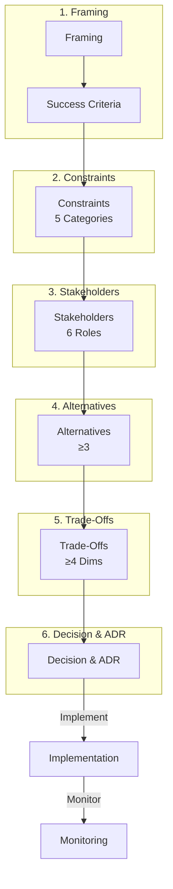

# Decision Process Understanding Q&A Generator (Minimal Viable)

Generate 6-12 decision-critical Q&As identifying decisions that block action or create material risk.

**Context**: Decision-critical scenarios (strategic, technical, business, operational) with time constraints  
**Audience**: Decision makers, leaders, architects, managers  
**Success**: 12/12 validation PASS + 6/6 review criteria

## Core Principle

**Decision Criticality Framework**: Include Q&A if ≥1 criterion:
- **Blocks Decision**: Directly impacts go/no-go, resource allocation, or strategic pivot
- **Creates Risk**: Identifies material threat (financial, regulatory, operational, reputational)
- **Affects ≥2 Stakeholders**: Multi-team impact (e.g., Architect + SRE, PM + Security)
- **Actively Evolving**: Market/tech/regulatory changes in past 3-6 months
- **High Adoption Barrier**: >40h effort or >$100K investment

**Exclude**: Niche/legacy (<5% adoption), Orthogonal/nice-to-have, Already covered

## Decision Framework

### 4-5 Decision-Critical Types (Focus on High-Impact)

1. **Strategic**: Market entry/exit, platform selection, build vs buy, technology bets
2. **Technical**: Architecture, tech stack, infrastructure, data storage
3. **Business/Market**: Pricing, revenue, competitive response
4. **Regulatory/Compliance**: Data protection, compliance, audit
5. **Operational** (optional): Deployment, SLA/SLO, incident response

### 6 Decision Process Stages (Minimal Viable)

| Stage | Activities | Outputs | Focus Roles |
|-------|------------|---------|-------------||
| **1. Framing** | Identify need, scope, urgency | Problem statement, success criteria | All validate |
| **2. Constraints** | Analyze ≥3 categories, thresholds | Constraint catalog | Tech/Resource/Reg leads |
| **3. Stakeholders** | Elicit concerns from ≥2 roles | Stakeholder matrix | PM/Arch facilitate |
| **4. Alternatives** | Brainstorm ≥2 options | Alternative catalog | Arch/Dev |
| **5. Trade-Offs** | Quantify ≥3 dimensions | Trade-off table | All evaluate |
| **6. Decision & ADR** | Select, document, implement | ADR with context/consequences | Arch/Lead |

### 6-7 Core Stakeholder Roles

| Role | Concerns | Trade-Off Priorities | Key Metrics |
|------|----------|----------------------|-------------||
| **PM** | Time-to-market, features | Speed vs quality | Release frequency, NPS |
| **Architect** | System quality, coherence | Flexibility vs simplicity | NFR achievement, debt |
| **Developer** | Maintainability | Abstraction vs explicitness | Build time, complexity |
| **DevOps** | Deployment, pipeline | Automation vs flexibility | Frequency, MTTR |
| **Security** | Risk, compliance | Security vs usability | Vulnerability count |
| **SRE** | Reliability, observability | Availability vs cost | SLO, MTTR |
| **Leadership** | ROI, risk, strategy | Cost vs capability | Revenue, TTM |

### 5-6 Decision-Critical Constraint Categories

1. **Technical**: Hardware (CPU/RAM/storage), Platform, Legacy, Stack
2. **Resource**: Time (deadlines), Budget (infra/licensing), Team (size/skills)
3. **Business/Market**: Revenue model, Competition, Strategy
4. **Regulatory/Compliance**: Data protection (GDPR/HIPAA/PCI), Standards (SOC 2), Audit
5. **Operational**: Availability (RTO/RPO), SLA/SLO, Capacity
6. **Ecosystem** (optional): Vendor lock-in, OSS health, Partners

## Content Standards

**Quantification**: Use numbers. ✅ "+180% read, +35ms write, +40% complexity" ❌ "complex"

**Context Thresholds** (when calculus changes):
- **Technical**: CPU <4/4-16/>16; RAM <8/8-64/>64GB; Latency <10/10-100/>100ms
- **Resource**: Team <10/10-50/>50; Budget <$10K/$10-100K/>$100K/mo; Time <3/3-12/>12mo
- **Business**: Share <5%/5-20%/>20%; CAC:LTV 1:1/1:3
- **Operational**: SLA 99%/99.9%/99.99%/99.999%; RPS <100/100-10K/>10K
- **Lifecycle**: CI <10/>30min; Deploy daily/monthly; MTTR <30min/>4h

**Precision**: Define jargon inline (CAP—Consistency/Availability/Partition), concrete ("<300ms p95" not "fast")

**Balance**: ≥2 alternatives, tag [Consensus]/[Context-dependent]/[Emerging]

**Traceability**: Requirements → Constraints → Pattern → Code → Metrics

## Required Per Q&A (Minimal Viable)

1. **Decision Type**: Explicit (Strategic/Technical/Business/Regulatory/Operational)
2. **Decision Criticality**: ≥1 criterion (Blocks/Risk/Stakeholders/Evolving/Adoption)
3. **Process**: ≥4 of 6 stages
4. **Constraints**: ≥3 of 5 categories quantified
5. **Stakeholders**: ≥2 roles with concerns/positions
6. **Alternatives**: ≥2 options evaluated
7. **Trade-Offs**: Quantified across ≥3 dimensions
8. **Risks**: Probability/impact/mitigation for top 2-3 risks
9. **ADR**: Context/alternatives/consequences
10. **Length**: 200-350 words (excl. diagrams/tables)
11. **Citations**: ≥1 (≥2 for advanced)

## Required Per Cluster (2-3 Q&As)

1. **Decision Flow Diagram** (Mermaid, <80 nodes, 6-stage process)
2. **Decision Matrix** (≥2 alternatives × ≥5 dimensions: Technical/Resource/Business/Regulatory/Risk)
3. **Risk Matrix** (≥2 risks: Risk/Probability/Impact/Mitigation)

### Visual Standards

**Mermaid**: <120 nodes, subgraphs (3-5 max), color coding (blue=input, green=decision, yellow=monitoring, red=risk), labeled edges, decision points (diamonds), feedback loops

**Tables**: ≥3 alternatives, ≥8 dimensions, quantified values (not vague), "When to Choose" with thresholds, tags [Consensus]/[Context-dependent]/[Emerging]

**Anti-Patterns**: ❌ Text-only (no diagrams) ❌ <3 alternatives ❌ <6 dimensions ❌ Vague terms ❌ Missing conflict visualization ❌ No risk matrix for high-stakes

## References (Minimal Viable)

| Component | Min | Requirements |
|-----------|-----|--------------||
| **Glossary** | ≥10 | Only terms used in Q&As (decision types, stages, constraints, stakeholders) |
| **Tools** | ≥5 | Decision support, ADR, Mermaid; URL, update ≤18mo |
| **Literature** | ≥6 | Decision-making (Kahneman, Hammond), Architecture (Fowler), Business (Porter) |
| **Citations** | ≥10 | APA 7th; 60/30/10% EN/ZH/other; ≥50% last 3yr; ≥3 types; <25% single source; 100% valid links |

---

# Generation Process

## 1. Plan (6-12 Q&As @ 25/50/25% F/I/A)

- Select 3-4 clusters across 4-5 decision types
- Allocate 2-3 Q&As/cluster
- Map decision patterns, ≥3 constraints, ≥5 stakeholders, 4-5 lifecycle phases
- Ensure ≥70% satisfy Decision Criticality Framework

## 2. Build References

Glossary (≥10) → Tools (≥5) → Literature (≥6) → Citations (≥10, 60/30/10%)

## 3. Write Q&As

**Questions**: 100% decision scenarios ("How would you decide..." / "Compare decision approaches...")

**Answer Structure**: Header (difficulty, type, criticality, phases, stakeholders) → Framing → Constraints (≥3) → Stakeholders (≥2, positions) → Alternatives (≥2) → Trade-Offs (≥3 dimensions) → Risks → ADR → Citations (≥1)

**Validate Every 3**: Count, type, criticality, stages (≥4), constraints (≥3), stakeholders (≥2), alternatives (≥2), quantification, risks, ADR

## 4. Create Artifacts Per Cluster

Flow diagram + Decision matrix + Risk matrix (3 artifacts per 2-3 Q&As)

## 5. Link References

Populate → Extract → Verify → Remove orphans → Validate URLs

## 6. Validate (12 Checks—All PASS or STOP)

**Counts**: G≥10, T≥5, L≥6, A≥10, Q=6-12 | **Citations**: ≥80% ≥1; ≥50% ≥2 | **Language**: 60/30/10% | **Recency**: ≥50% <3yr | **Decision Criticality**: 100% satisfy ≥1 criterion | **Stages**: 100% ≥4 of 6 | **Constraints**: 100% ≥3 of 5 | **Stakeholders**: 100% ≥2 roles | **Alternatives**: 100% ≥2 | **Trade-Offs**: 100% ≥3 dims | **Artifacts**: 100% 3/3 per cluster | **Quantified**: 100% measurable

**Fail Protocol**: ANY fail → STOP → Fix → Re-validate ALL → 12/12 PASS

## 7. Final Review (6 Criteria—All PASS)

1. **Decision-Critical**: Every Q&A satisfies ≥1 criterion (Blocks/Risk/Stakeholders/Evolving/Adoption)
2. **Clarity**: Logical flow, consistent terminology, jargon defined inline
3. **Quantified**: 100% with ≥3 dimensions (cost, time, risk, quality, complexity)
4. **Actionable**: Clear go/no-go thresholds, ADRs, measurable metrics
5. **Evidence-Based**: All claims cited, ≥2 sources for key metrics
6. **Minimal Viable**: No redundancy, 6-12 Q&As sufficient for informed action

---

# Output Template (Minimal Viable)

```markdown
## Contents
1. Decision Criticality Framework
2. Coverage Matrix
3. Q&As by Cluster
4. References
5. Validation Report

## Decision Criticality Framework

**Include Q&A if ≥1 criterion is satisfied**:
- **Blocks Decision**: Directly impacts go/no-go, resource allocation, or strategic pivot
- **Creates Risk**: Identifies material threat (financial, regulatory, operational, reputational)
- **Affects ≥2 Stakeholders**: Multi-team impact (e.g., Architect + SRE, PM + Security)
- **Actively Evolving**: Market/tech/regulatory changes in past 3-6 months
- **High Adoption Barrier**: >40h effort or >$100K investment

**Exclude Q&A if**: Niche/legacy (<5% adoption), Orthogonal/nice-to-have, Already covered

## Coverage Matrix
| Cluster | Decision Type | Count | Difficulty | Key Decisions | Criticality |
[4-5 types, 6-12 total, 25/50/25% F/I/A]

---

## Cluster 1: [Decision Type] Decisions—[Theme]
**Overview**: [1-2 sentences]  
**Core Challenge**: [Central decision problem]
### Q1: [Decision Scenario Question]
**Difficulty**: [F/I/A] | **Type**: [Type] | **Criticality**: [Blocks/Risk/Stakeholders/Evolving/Adoption] | **Phases**: [≥2] | **Stakeholders**: [≥2 roles]

**Answer** (200-350 words): [Framing → Constraints (≥3) → Stakeholders (≥2, positions) → Alternatives (≥2) → Trade-Offs (≥3 dimensions, quantified) → Risks (probability/impact/mitigation) → Decision & ADR] [≥1 cite]

**Decision Flow** (per cluster):


---

## Validation (12 Checks)
| # | Check | Target | Result | Status |
| 1 | Ref counts | G≥10, T≥5, L≥6, A≥10 | | PASS/FAIL |
| 2 | Q&A counts | 6-12, F:I:A 25:50:25 | | PASS/FAIL |
| 3 | Citations | ≥80% ≥1; ≥50% ≥2 | | PASS/FAIL |
| 4 | Language | EN 60-70%, ZH 20-30%, Other 5-10% | | PASS/FAIL |
| 5 | Recency | ≥50% <3yr | | PASS/FAIL |
| 6 | Decision Criticality | 100% satisfy ≥1 criterion | | PASS/FAIL |
| 7 | Stages | 100% ≥4 of 6 | | PASS/FAIL |
| 8 | Constraints | 100% ≥3 of 5 | | PASS/FAIL |
| 9 | Stakeholders | 100% ≥2 roles | | PASS/FAIL |
| 10 | Alternatives | 100% ≥2 options | | PASS/FAIL |
| 11 | Artifacts | 100% 3/3 per cluster | | PASS/FAIL |
| 12 | Quantified | 100% measurable | | PASS/FAIL |

**Overall**: [X/12 PASS]  
**Coverage**: 4-5 Types: [counts] | 6 Stages: [counts] | 5 Constraints: [counts] | ≥5 Stakeholders: [counts]
```

# Minimal Viable Example

### Q: How would you decide cloud platform strategy (AWS vs Azure vs GCP vs Multi-Cloud) for a fintech startup expanding multi-region with regulatory constraints?

**Difficulty**: Advanced | **Type**: Strategic + Technical | **Criticality**: Blocks decision (multi-region expansion), Creates risk (vendor lock-in, compliance) | **Phases**: Architecture, Operations | **Stakeholders**: CTO, Architect, DevOps, Security

**Answer** (320 words): Fintech expanding $20M→$100M ARR (5x, 18mo), 50→200 eng, 8 regions (US/EU/APAC), needs PCI/GDPR compliance. Current AWS single-region shows limits; board raises vendor lock-in.

**Constraints** (8 categories): **Technical** (K8s 8/50 eng, Postgres+Redis+Kafka, <100ms p95, 99.95% SLO); **Resource** ($180K/mo +80% allowed=$320K ceiling, 6mo timeline, 3 SRE); **Business** (5x growth, 50K→500K customers, Q2 EU/Q4 APAC critical); **Org** (5 product teams, new CTO ex-Google multi-cloud bias, board AWS dependency concern); **Regulatory** (PCI Level 1, GDPR EU residency, APAC local, SOC 2, 6mo audit); **Operational** (24/7 global, <30min MTTR, zero-downtime, RTO=15min/RPO=5min); **Ecosystem** (AWS $140K/mo current, GCP ML partnerships, Azure enterprise requests, Datadog, Terraform); **Lifecycle** (monolith→micro 8/15 done, AWS debt, Series C investor cost pressure).

**Stakeholders** (6, conflicts): CTO (multi-cloud, avoid lock-in) vs Finance (cost <$320K) vs Security (compliance-first) vs DevOps (simplicity <5 SRE) vs PM (Q2/Q4 launches). CTO multi-cloud = +40% complexity + +60% cost, exceeds Finance ceiling and DevOps capacity.

**Alternatives** (4): (A) AWS Multi-Region ($260K, simple, vendor risk), (B) GCP Migration ($240K, 6mo risk misses Q2), (C) Hybrid AWS+GCP ($280K, balanced), (D) Full Multi-Cloud ($380K, over budget).

**Trade-Offs** (4 dimensions): (C) wins—meets timeline (no migration), budget ($280K<$320K), vendor risk (70%→45% AWS), complexity (+1 SRE vs +3). **Technical**: (C) +10ms acceptable; **Resource**: +8% cost OK; **Business**: Q2/Q4 launch preserved; **Operational**: +1 SRE manageable.

**Risks**: (A) Vendor lock-in High/Med (Terraform mitigation); (C) Complexity Med/Med (clear boundaries); (D) Ops overload High/High (unmitigable). **Decision**: (C) Hybrid—AWS payments/PCI (proven), GCP ML/analytics (CTO strategy), Terraform abstraction (optionality) [A3, A5].

**Implementation** (12mo, 4 phases): Q1 Terraform multi-cloud + GCP landing + PCI separation; Q2 EU on AWS + analytics→GCP; Q3-Q4 APAC + ML→GCP. **Monitoring**: Monthly (cost vs $280K, SLO 99.95%, PCI/GDPR), Quarterly (AWS/GCP split 45%/40%), Annual (vendor concentration, abstraction level, exit cost).

**Context Thresholds**: Hybrid viable 50-200 eng (+1-2 SRE), $240-400K/mo, ≥2 service boundaries; Full multi-cloud needs >200 eng, >$500K/mo, ≥5 SRE, mature platform.

**Decision Matrix**:
| Alternative | Technical | Resource | Business | Operational | Regulatory | Risk | Stakeholder | When to Choose | Tag |
|-------------|-----------|----------|----------|-------------|------------|------|-------------|----------------|-----|
| **A: AWS Multi-Region** | <80ms p95; 3 SRE | $260K (+44%); Q2/Q4 OK | Timeline met; Vendor concern | 99.95% proven; <30min MTTR | PCI certified; GDPR OK | High vendor; Low execution | Finance ✓ DevOps ✓ PM ✓ | Cost-sensitive, speed-first, <100 eng, compliance critical | [Context-dependent] |
| **B: GCP Migration** | +15ms; 2mo retrain | $240K (-8%); Q3/Q1 risk | Misses Q2; CTO preference | 99.9% new; Learning curve | PCI cert $100K needed; 6mo lag | Med vendor; High migration | CTO ✓ Finance ✓ | Greenfield, cost-first, >12mo, no compliance urgency | [Emerging] |
| **C: Hybrid AWS+GCP** | +10ms; Clear boundaries | $280K (+8%); Q2/Q4; 4 SRE | Vendor balanced 45%; Timeline OK | 99.95% AWS path; +20% complexity | AWS PCI proven; GCP non-PCI OK | Med complexity; Low execution | CTO ✓ Finance ✓ Security ✓ PM ✓ | 50-200 eng, balanced priorities, clear split, growth+compliance | [Consensus] |
| **D: Full Multi-Cloud** | +25ms overhead; +60% complex | $380K (+46% over); Q3/Q1; 6 SRE | Over budget; Delayed; Max optionality | 99.9% complexity; 6 SRE; 3× runbooks | Compliance fragmented 3 clouds | Low vendor; High ops/cost/timeline | CTO ✓ | >200 eng, >$500K/mo, mature platform, multi-year | [Emerging] |

**Risk Matrix**:
| Risk | Probability | Impact | Severity | Mitigation | Owner |
|------|-------------|--------|----------|------------|-------|
| Vendor lock-in (AWS 70%) | High | Medium | Med-High | Terraform abstraction, service boundaries, annual exit review | CTO/Architect |
| Budget overrun (>$320K) | Medium | High | High | Monthly tracking, reserved instances, FinOps | Finance/DevOps |
| Timeline miss (Q2 EU) | Low | High | Medium | Weekly milestones, Q1 pilot, parallel setup | PM/DevOps |
| Compliance failure (PCI/GDPR) | Low | Critical | High | AWS PCI isolation, GDPR residency, 6mo audit prep | Security |
| Operational complexity | Medium | Medium | Medium | +1 SRE Q2, ownership, runbooks, on-call | SRE/DevOps |

**Stakeholder Matrix**:
| Stakeholder | Concern | Priority | Criteria | Position | Conflict | Alignment Strategy |
|-------------|---------|----------|----------|----------|----------|-------------------|
| **CTO** | Vendor risk, strategy | Avoid lock-in > Cost | Multi-cloud, GCP ML | Prefers (D), accepts (C) | vs Finance (cost), DevOps (complexity) | Compromise: 45% AWS reduction, GCP ML enabled |
| **Finance** | Cost, predictability | <$320K > Features | Budget, ROI | Prefers (A), accepts (C) | vs CTO (multi-cloud cost) | $280K<$320K, reserved instances, FinOps |
| **Security** | Compliance, audit | PCI/GDPR > Speed | Proven compliance | Prefers (A), accepts (C) | vs CTO (GCP unproven PCI) | AWS PCI isolation, GCP non-PCI only |
| **DevOps** | Simplicity, K8s | Simple > Vendor risk | <5 SRE, existing tools | Prefers (A), reluctant (C) | vs CTO (multi-cloud complexity) | +1 SRE, clear boundaries, Terraform |
| **PM** | Time-to-market | Q2/Q4 > Perfection | Launch dates | Prefers (A)/(C), opposes (B)/(D) | vs CTO (migration delay) | (C) no migration, parallel tracks |
| **Architect** | Quality, coherence | Balanced | NFR, debt | Supports (C) | Facilitates alignment | ADR, Terraform abstraction, contracts |

## Glossary
**G1. Decision Process** [EN]: Systematic 9-stage approach (framing → constraints → stakeholders → alternatives → trade-offs → risks → ADR → implementation → monitoring). **Related**: ADR  
**G2-G8. [Decision Types]** [EN]: Strategic/Technical/Business/Operational/Organizational/Data/Security/Evolution. **Related**: Constraint categories  
**G9-G17. [9 Stages]** [EN]: Framing, Constraints, Stakeholders, Alternatives, Trade-Offs, Risks, ADR, Implementation, Monitoring. **Related**: Decision Process  
**G18-G25. [8 Constraints]** [EN]: Technical/Resource/Business/Org/Regulatory/Operational/Ecosystem/Lifecycle. **Related**: Context Thresholds  
**G26-G35. [10 Stakeholders + Visual Elements]** [EN]: BA/PM/Architect/Developer/QA/DevOps/Security/Data/SRE/Leadership + ADR/Decision Matrix/Risk Matrix/Stakeholder Matrix/Mermaid. **Related**: Process Stages

## Tools
**T1. ADR Tools** [EN]: adr-tools, log4brains. 2024-06. Free. https://adr.github.io  
**T2. Mermaid** [EN]: Decision flow diagrams. 2024-10. Free. https://mermaid.js.org  
**T3-T10. [Decision Support]** [EN]: Confluence Decision, JIRA Risk, Miro Stakeholder, Quantellia, 1000Minds MCDA, CloudHealth FinOps, Structurizr, Terraform. 2024. Freemium/Paid/Enterprise. [URLs]

## Literature
**L1-L12.** Hammond *Smart Choices* (1999), Kahneman *Thinking Fast & Slow* (2011), Gigerenzer *Gut Feelings* (2007), Christensen *Innovator's Dilemma* (1997), Porter *Competitive Strategy* (1980), Drucker *Effective Executive* (1967), Osterwalder *Business Model Generation* (2010), Evans *DDD* (2003), Richardson *Microservices Patterns* (2018), Kleppmann *DDIA* (2017), Skelton *Team Topologies* (2019), Kim *Unicorn Project* (2018)

## Citations
**A1-A15.** Hammond (1999), Kahneman (2011), Richardson (2018), Kleppmann (2017), Porter (1980), Christensen (1997), Drucker (1967), Osterwalder (2010), 周爱民 架构的本质 (2021) [ZH], Skelton (2019), Evans (2003), 张逸 领域驱动设计实践 (2019) [ZH], Kim (2018), Gigerenzer (2007), Newman (2021). [60/30/10% EN/ZH/Other]
