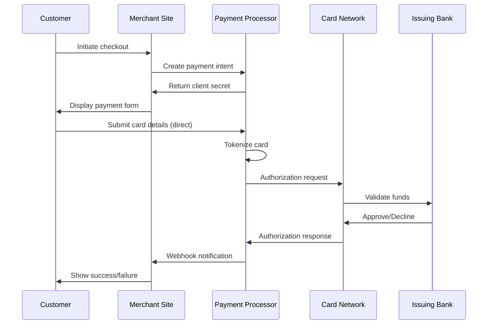

# Ecosystem Understanding Q&A Generator

Generate 30–40 questions enabling newcomers to gain holistic ecosystem understanding through technical/business/regulatory viewpoints, lifecycle phases, and stakeholder perspectives.

## I. Context & Scope

**Purpose**: Comprehensive ecosystem understanding: value chains, interaction patterns, stakeholder roles, technical architectures, business models, regulatory frameworks.

**Scope**: Ecosystem structure, value flows, integration patterns, multi-stakeholder views, lifecycle, market dynamics, compliance | **Exclude**: Generic programming, isolated tutorials, overly technical details, interview scenarios

**Constraints**: 200-400 words/answer | ≥80% have ≥1 cite (≥40% have ≥2) | 100% ecosystem-focused | Newcomer-appropriate

**Key Terms**: Ecosystem (interconnected parties/systems), Viewpoint (technical/business/regulatory/operational), Integration Pattern (interaction/communication), Stakeholder (10 roles: Business/PM/Architect/Developer/QA/DevOps/Security/Data/SRE/Leadership), Floor (≥ = minimum), Quality gate (mandatory—fail = stop/fix)

**Decision-Criticality** (include if ≥1 criterion satisfied):
- **Blocks Decision**: Understanding needed for integration choices, platform selection, or architectural approach
- **Creates Risk**: Missing knowledge leads to material threats (vendor lock-in, integration failures, compliance issues)
- **Affects ≥2 Stakeholder Roles**: Multi-team dependency (e.g., DevOps + Security, Architect + Business)
- **Requires Action**: 1-6mo learning/implementation window for ecosystem adoption
- **Quantified Impact**: Measurable ecosystem metrics (integration costs, vendor fees, adoption timelines, market share %)

## II. Requirements

### Quantitative Floors

**Q&A**: 30–40 total | 30%Foundational/40%Integration/30%Advanced (±5%) | 200–400 words | ≥80% have ≥1 cite (≥40% have ≥2) | Each answer addresses ≥2 viewpoints

**Topic Coverage (MECE)**: 
1. **Ecosystem Structure** (5–6): Parties, organizations, systems, platforms, roles
2. **Value Chains & Business** (5–6): Value creation/capture/delivery, revenue models, economic flows
3. **Integration Patterns** (6–7): Protocols, data flows, APIs, interoperability
4. **Technical Architecture** (5–6): Tech stacks, patterns, scalability, reliability
5. **Regulatory & Compliance** (4–5): Legal requirements, standards, governance, risk
6. **Market Dynamics** (4–5): Structure, competitive forces, trends, evolution
7. **Lifecycle & Stakeholders** (3–4): Cross-cutting views across 8 phases, 10 roles

**References** (build before Q&A): G≥15 | S≥6 | T≥8 | L≥10 (≥30% domain-specific) | A≥20 APA 7th+tags [EN]/[ZH]/[Standard]

**Visuals**: ≥1 diagram + ≥1 table per topic (7+7) | ≥2 Mermaid diagrams | **Scaling**: >40 Q&A → 1.5× references

### Citation Standards

**Format**: `Author, A. (Year). *Title*. Publisher. [EN]` | `Organization. (Year). *Standard*. [Standard]` | Inline: `[Ref: ID]` (G/S/T/L/A)

**Distribution**: EN 50–70% | ZH/domain 20–40% | Standards 10–20% | **Source Types** (≥4): Standards/protocols, Research/whitepapers, Case studies, Platforms/tools, Market analysis

### Quality Requirements

**Gates** (integrated into validation): Recency (≥50% <3yrs, ≥70% for emerging) | Source diversity (≥4 types, none >30%) | Per-topic evidence (≥2 authoritative + ≥1 standard + ≥1 example) | Platform completeness (docs URL, maturity, update ≤18mo, integrations) | Links (100% accessible) | Cross-refs (100% resolve) | Viewpoint coverage (≥2 per Q&A) | Stakeholder representation (≥60% Q&As)

**Mitigation**: Dated info → flag with caveats | Diversity fail → expand research | Dead links → Web Archive/replace | Insufficient viewpoints → enhance multi-perspective analysis

## III. Execution

### Step 1: Plan Allocation

Distribute 30–40 across 7 dimensions (30/40/30% F/I/A). Example (35 total): Structure(5):2F/2I/1A | Value/Business(6):2F/2I/2A | Integration(7):2F/3I/2A | Architecture(6):2F/2I/2A | Regulatory(5):2F/2I/1A | Market(4):1F/2I/1A | Lifecycle(3):0F/1I/2A → Total:11F/14I/11A

**Complexity**: F=foundational (core concepts, components, patterns) | I=integration (interactions, cross-cutting, trade-offs) | A=advanced (strategic, evolution, deep analysis)

### Step 2: Build References (BEFORE Q&A → run Gates 1–8 after)

**Glossary (≥15)**: Cover parties/components, interaction patterns, business models, technical/regulatory/market concepts | Format: term, definition (1-2 sentences), context, related terms, limitations | Assign G1, G2...

**Standards/Protocols (≥6)**: Industry standards, RFCs, specs (OAuth, OpenAPI, FHIR, PCI DSS, ISO 27001, GDPR) | Include: issuing body, purpose, adoption, version, URL | Assign S1, S2...

**Tools/Platforms (≥8)**: Key platforms/infrastructure/tools by category (core, integration, monitoring, dev, compliance) | Include: description, maturity/adoption, update (≤18mo), integrations, docs URL | Assign T1, T2...

**Literature (≥10)**: Ecosystem books/whitepapers/research (≥30% domain-specific) | Include: author, title, year, summary, relevance | Sources: academic papers, industry whitepapers (CNCF, IEEE, W3C), market reports (Gartner, Forrester), case studies | Assign L1, L2...

**Citations (≥20)**: APA 7th + tags | ≥50% <3yrs | Classify: standards/research/case studies/tools/market | Assign A1, A2...

### Step 3: Generate Q&A (5 at a time → self-check each batch)

**Question**: Ecosystem understanding ("How X integrates with Y?", "Z's role in value chain?", "How regulatory affects architecture?") | Multi-viewpoint (technical/business/regulatory) | Tests ≥2 aspects (structure/interactions/flows/constraints) | Clear, specific | **Avoid**: Trivia, isolated tutorials, overly narrow details

**Answer** (200–400 words):
1. **Key Insight** (1-2 sentences): Core concept/pattern/relationship in ecosystem
2. **Ecosystem Context** [Ref: G#/S#/A#]: Position, standards/protocols
3. **Multi-Viewpoint** (≥2): Technical (architecture, protocols, integration) | Business (value flows, revenue, economics) | Regulatory (compliance, governance, risk) | Operational (lifecycle, stakeholder roles)
4. **Interaction Patterns**: Integration, communication, value exchange
5. **Real-World Examples** [Ref: A#]: Implementations, case studies
6. **Trade-offs & Constraints**: Design choices, limitations, alternatives
7. **Stakeholder Perspectives**: How BA/PM/Architect/Developer/Security view this
8. **Evolution & Trends**: Changes, future directions
9. **Citations**: ≥1 [Ref: ID] (≥2 for I/A)
10. **Artifact** (encouraged): Diagram/sequence/matrix

**Batch Self-Check** (per 5): Ecosystem-focused | ≥2 viewpoints | 200–400 words | Clear context | ≥2 aspects | ≥4/5 have ≥1 cite (≥2/5 have ≥2) | Complexity aligned | Stakeholder perspective

### Step 4: Create Visuals (≥1 diagram + ≥1 table per topic; reference from ≥60% answers)

**By Topic**: Structure (component/party/layered diagram) | Value Chains (flow/canvas/revenue) | Integration (sequence/API/data flow) | Architecture (C4/deployment/comparison/patterns) | Regulatory (compliance matrix/governance/risk) | Market (competitive landscape/evolution/adoption) | Lifecycle (RACI/deliverables/stakeholders)

**Best Practices**: Mermaid for architecture/sequence/flow (≥2 total) | Tables for comparisons/matrices/quantitative | Include legends/scale/time | Cite sources [Ref: ID] | Keep readable (<20 nodes) | Show directionality (arrows, protocols) | Label integration points (APIs, protocols, formats)

### Step 5: Populate References

**Glossary**: **G#. Term (Acronym)** | Definition | Context | Related terms | Examples | Limitations | Alphabetize

**Standards/Protocols**: **S#. Name (Body)** | Purpose | Scope | Version | Adoption | URL | Relevance | Group by category

**Tools/Platforms**: **T#. Name (Category)** | Description | Maturity/adoption | Update (Q# YYYY) | Integrations | Docs URL | Role | Group by category

**Literature**: **L#. Author, Title, Year** | Summary | Relevance | Type | Group by type, alphabetize

**Citations**: **A#. [Citation] [Tag]** | Books: `Author, A. (Year). *Title*. Publisher. [EN]` | Papers: `Author, A. (Year). Title. *Journal*, Vol(Issue), pages. DOI [EN]` | Standards: `Org. (Year). *Standard*. URL [Standard]` | Web: `Author/Org. (Year). *Title*. Site. URL [EN/Report]` | ZH: `作者. (Year). *标题*. 出版社. [ZH]` | Sort by ID

**Check**: 100% refs resolve | No orphans | All fields complete | Tags present | URLs active | Docs linked

### Step 6: Run 15 Validations (fail ANY = stop, fix, re-run ALL)

1. **Floors**: G≥15, S≥6, T≥8, L≥10, A≥20, Q=30–40, 30/40/30% F/I/A (±5%)
2. **Citations**: ≥80%≥1; ≥40%≥2
3. **Language/Type**: EN 50–70%, ZH 20–40%, Std 10–20%
4. **Recency**: ≥50% <3yrs (≥70% emerging)
5. **Source Types**: ≥4 types; none >30%
6. **Links**: 100% accessible
7. **Cross-Refs**: 100% resolve; no orphans
8. **Word Count**: Sample 5; 100% in 200–400
9. **Key Insights**: 100% concrete ecosystem context
10. **Per-Topic Evidence**: 7/7 have ≥2 authoritative + ≥1 standard + ≥1 example
11. **Viewpoint Coverage**: ≥80% address ≥2 viewpoints
12. **Stakeholder Rep**: ≥60% mention stakeholders
13. **Integration Patterns**: ≥50% include interactions
14. **Visual Coverage**: ≥2 Mermaid; ≥7 diagrams; ≥7 tables
15. **Ecosystem Focus**: 100% ecosystem-related (not generic)

### Step 7: Final Review

**Questions**: Clear, specific | Ecosystem-relevant | Interaction depth | Newcomer-friendly | Multi-viewpoint | Complexity aligned

**Answers** (sample ≥5): ≥2 viewpoints | Context with cites | Patterns explained | Real examples | Stakeholder views | Trade-offs | Evolution/trends

**Visuals**: ≥2 Mermaid | ≥7 diagrams | ≥7 tables | Legends/labels | Cited | Readable

**Submission**: All validations PASS | All floors met | TOC linked | No placeholders | Consistent format | Balanced viewpoints | Clear lifecycle/stakeholder integration

## IV. Validation Report (fill all; ANY fail = stop, fix, re-run ALL)

| # | Check           | Measurement                     | Criteria                          | Result | Status    |
|---|-----------------|---------------------------------|-----------------------------------|--------|-----------|
| 1 | Floors          | G:__ S:__ T:__ L:__ A:__ Q:__ (__F/__I/__A)| G≥15, S≥6, T≥8, L≥10, A≥20, Q:30-40, 30/40/30% | | PASS/FAIL |
| 2 | Citations       | __%≥1, __%≥2                    | ≥80%≥1, ≥40%≥2                    | | PASS/FAIL |
| 3 | Lang/Type       | EN:__%, ZH:__%, Std:__%         | EN:50-70%, ZH:20-40%, Std:10-20%  | | PASS/FAIL |
| 4 | Recency         | __% <3yrs (ecosystem: ___)      | ≥50% (≥70% emerging)              | | PASS/FAIL |
| 5 | Source Types    | __ types; max __%               | ≥4 types, max 30%                 | | PASS/FAIL |
| 6 | Links           | __/__ accessible                | 100%                              | | PASS/FAIL |
| 7 | Cross-Refs      | __/__ resolved                  | 100%                              | | PASS/FAIL |
| 8 | Word Count      | __ sampled: __ compliant        | 100% (200-400)                    | | PASS/FAIL |
| 9 | Key Insights    | __/__ with context              | 100%                              | | PASS/FAIL |
| 10| Topic Evidence  | __/7 (≥2 auth+≥1 std+≥1 ex)     | 7/7                               | | PASS/FAIL |
| 11| Viewpoints      | __%≥2                           | ≥80%                              | | PASS/FAIL |
| 12| Stakeholders    | __%                             | ≥60%                              | | PASS/FAIL |
| 13| Integration     | __%                             | ≥50%                              | | PASS/FAIL |
| 14| Visuals         | M:__, D:__, T:__                | ≥2, ≥7, ≥7                        | | PASS/FAIL |
| 15| Ecosystem Focus | __/__                           | 100%                              | | PASS/FAIL |

## V. Question Quality (review each; ≥2 fails = rewrite)

1. **Clarity**: Specific ask | ✓ "How processors integrate with platforms?" | ✗ "Explain payments, security, APIs"
2. **Ecosystem Relevance**: Tests understanding | ✓ "Identity providers' role in SaaS?" | ✗ "What is OAuth?"
3. **Depth**: Enables interaction analysis | ✓ "GDPR's effect on EU-US data flows?" | ✗ "Is GDPR important?"
4. **Accessibility**: Newcomer-friendly | ✓ "Main healthcare parties and info exchange?" | ✗ "Implement HL7 FHIR"
5. **Multi-viewpoint**: Not single perspective | ✓ "Regulatory impact on architecture?" | ✗ "Stripe's database?"
6. **Alignment**: Complexity matches content | F: foundational | I: integration | A: strategic

## VI. Output Format

### A. TOC
1. Topic Areas | 2. Questions by Topic (7 dimensions) | 3. References (G/S/T/L/A) | 4. Validation Report

### B. Topic Overview
**Total**: [30–40] | **Complexity**: [X]F ([Y]%) / [X]I ([Y]%) / [X]A ([Y]%) | **Coverage**: 7 dimensions (MECE)

| # | Topic                  | Range   | Count | Mix      | Artifacts |
|---|------------------------|---------|-------|----------|-----------|
| 1 | Ecosystem Structure    | Q1–Q5   | 5     | 2F/2I/1A | 1D+1T     |
| 2 | Value Chains/Business  | Q6–Q11  | 6     | 2F/2I/2A | 1D+1T     |
| 3 | Integration Patterns   | Q12–Q18 | 7     | 2F/3I/2A | 1D+1T     |
| 4 | Technical Architecture | Q19–Q24 | 6     | 2F/2I/2A | 1D+1T     |
| 5 | Regulatory/Compliance  | Q25–Q29 | 5     | 2F/2I/1A | 1D+1T     |
| 6 | Market Dynamics        | Q30–Q33 | 4     | 1F/2I/1A | 1D+1T     |
| 7 | Lifecycle/Stakeholders | Q34–Q36 | 3     | 0F/1I/2A | 1D+1T     |
|   | **Total**              |         | **36**| **11F/14I/11A** | **7+7** |

Legend: F=foundational | I=integration | A=advanced | D=diagram | T=table

### C. Q&A Format

**Topic 1: [Dimension Title]**

**Q1: [Question]**

**Complexity**: [F/I/A] | **Topic**: [Dimension] | **Viewpoints**: [Tech/Business/Regulatory/Operational]

**Key Insight** (1-2 sentences): [Core concept/pattern/relationship]

**Answer** (200–400 words): 
- **Context** [Ref: G#/S#/A#]: Position, standards/protocols
- **Multi-Viewpoint** (≥2): Technical (architecture, protocols) | Business (value, revenue, economics) | Regulatory (compliance, governance, risk) | Operational (lifecycle, stakeholders)
- **Interaction Patterns**: Integration, communication, value exchange
- **Real-World Examples** [Ref: A#]: Implementations, case studies
- **Trade-offs & Constraints**: Choices, limitations, alternatives
- **Stakeholder Perspectives**: How BA/PM/Architect/Developer/Security view this
- **Evolution & Trends**: Changes, future
- **Citations**: ≥1 [Ref: ID] (≥2 for I/A)

**Artifact** *(encouraged)*: Diagram (Mermaid), sequence, matrix

### D. Reference Formats

**Glossary**: **G#. Term (Acronym)** | Definition | Context | Related terms | Examples | Limitations | Alphabetize

**Standards/Protocols**: **S#. Name (Body)** | Purpose | Scope | Version | Adoption | URL | Relevance | Group by category

**Tools/Platforms**: **T#. Name (Category)** | Description | Maturity/adoption | Update (Q# YYYY) | Integrations | Docs URL | Role | Group by category

**Literature**: **L#. Author, Title, Year** | Summary | Relevance | Type | Group by type, alphabetize

**Citations**: **A#. [Citation] [Tag]** | Books: `Author, A. (Year). *Title*. Publisher. [EN]` | Papers: `Author, A. (Year). Title. *Journal*, Vol(Issue), pages. DOI [EN]` | Standards: `Org. (Year). *Standard*. URL [Standard]` | Web: `Author/Org. (Year). *Title*. Site. URL [EN/Report]` | ZH: `作者. (Year). *标题*. 出版社. [ZH]` | Sort by ID

## VII. Example

**Q1: How do payment processors integrate with e-commerce platforms in the digital payments ecosystem?**

**Complexity**: I | **Topic**: Integration Patterns | **Viewpoints**: Technical, Business

**Key Insight**: Payment processors act as intermediaries enabling secure transaction flows between merchants, customers, and banks through standardized APIs and protocols, balancing security, user experience, and compliance requirements.

**Answer** (280 words):

**Context**: Processors (Stripe, PayPal, Adyen) sit between e-commerce and financial networks (card networks, banks) [Ref: G1], abstracting payment regulations [Ref: S2], card rules, and bank integrations [Ref: A3].

**Technical**: REST APIs [Ref: S1] with OAuth 2.0 [Ref: S3]. Flow: (1) Merchant embeds form/SDK; (2) Customer card details → processor (PCI DSS [Ref: S4]); (3) Processor tokenizes, routes to card network; (4) Bank authorizes/declines; (5) Processor returns via webhook [Ref: T1]. Payment intents support SCA per PSD2 [Ref: S5, A5].

**Business**: Transaction fees (1.5-3.5% + fixed) [Ref: A4]. Value: fast integration (days vs months), reduced compliance burden, global reach, fraud detection. Trade-off: premium vs direct bank rates (viable >$10M volume) [Ref: A6].

**Examples**: Shopify uses Stripe [Ref: A7]; WooCommerce supports 100+ gateways [Ref: T2]; Amazon Pay enables cross-site checkout [Ref: A8].

**Stakeholders**: Developer (APIs, SDKs, sandbox) | Architect (99.99% uptime, webhooks, idempotency) | Security (PCI DSS L1, tokenization) | Business (fees, methods, settlement T+2 to T+7)

**Evolution**: Embedded finance (platforms→processors [Ref: A9]), instant payments (FedNow, PIX), crypto rails [Ref: A10].

**Artifact**:

**Confidence**: High [Ref: S1, S3, S4, A3, A5]
