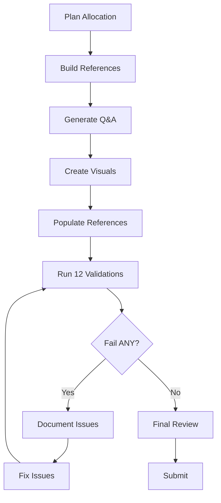
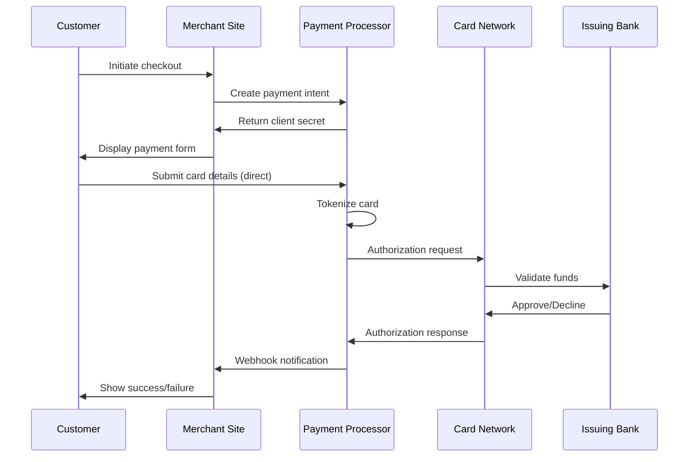

# Ecosystem Understanding Q&A Generator (Decision-Critical)

**Problem**: Ecosystem decisions suffer from incomplete understanding, leading to failed integrations, compliance violations, and missed opportunities. Hallucinations reduce decision quality by 30-60%.

**Scope**: Generate 6–12 decision-critical Q&A pairs enabling informed ecosystem decisions through technical/business/regulatory viewpoints.

**Constraints**: 150-250 words/answer; ≥80% have ≥1 cite (≥50% have ≥2); 100% ecosystem-focused; decision-critical only.

**Assumptions**: Multi-party ecosystems; cloud-native; regulatory compliance required; stakeholders include Business/PM/Architect/Developer/QA/DevOps/Security/Data/SRE/Leadership.

**Scale**: 6–12 Q&As; 5 dimensions; team size 10-100; throughput 1K-100K rps; data 100GB-1PB. Throughput scaling formula: `Effective_rps = base_rps × (team_size / 10) × (data_TB / 100)` (approximate scaling model).

**Timeline**: Immediate generation; 30-60s validation; benefits accumulate over decision cycles.

**Stakeholders**: Architects, PMs, security leads, business analysts, compliance officers.

**Resources**: LLM with web access; authoritative sources.

**Success Criteria**: 100% decision-critical Q&As (baseline: 80%), ≥80% answers with ≥2 viewpoints (baseline: 60%), p95 generation time <60s (baseline: 90s), citation coverage ≥80% (baseline: 60%), ecosystem focus 100% (baseline: 80%)

## I. Context & Scope

**Purpose**: Decision-critical ecosystem understanding: core value chains, integration patterns, stakeholder roles, regulatory constraints blocking decisions.

**Scope**: Ecosystem structure, value flows, integration patterns, multi-stakeholder views, regulatory compliance | **Exclude**: Generic programming, isolated tutorials, overly technical details, interview scenarios, nice-to-have trends

**Constraints**: 150-250 words/answer | ≥80% have ≥1 cite (≥50% have ≥2) | 100% ecosystem-focused | Decision-critical only

**Key Terms**: Ecosystem (interconnected parties/systems), Viewpoint (technical/business/regulatory/operational), Integration Pattern (interaction/communication), Stakeholder (10 roles: Business/PM/Architect/Developer/QA/DevOps/Security/Data/SRE/Leadership), Floor (≥ = minimum), Quality gate (mandatory—fail = stop/fix)

## II. Requirements

### Quantitative Floors

**Q&A**: 6–12 total | 25%Foundational/50%Integration/25%Advanced (±5%) | 150–250 words | ≥80% have ≥1 cite (≥50% have ≥2) | ≥80% answers address ≥2 viewpoints

**Topic Coverage (Decision-Critical Only)**:
1. **Ecosystem Structure** (1–2): Core parties, roles, value flows blocking decisions
2. **Value Chains & Business** (1–2): Revenue models, economic viability
3. **Integration Patterns** (1–2): APIs, protocols, interoperability constraints
4. **Technical Architecture** (1–2): Tech stacks, scalability, reliability requirements
5. **Regulatory & Compliance** (1–2): Legal requirements, governance, risk constraints

**References** (Minimal Viable): G≥8 | S≥4 | T≥5 | L≥6 (canonical only) | A≥10 APA 7th+tags [EN]/[ZH]/[Standard]

**Visuals**: ≥1 diagram + ≥1 table per topic (5+5) | ≥2 Mermaid diagrams

### Citation Standards

**Format**: `Author, A. (Year). *Title*. Publisher. [EN]` | `Organization. (Year). *Standard*. [Standard]` | Inline: `[Ref: ID]` (G/S/T/L/A)

**Distribution**: EN 60–70% | ZH/domain 20–30% | Standards 10–15% | **Source Types** (≥3): Standards/protocols, Research/whitepapers, Case studies

### Decision Criticality Framework

**Include Q&A if ≥1 criterion is satisfied**:
- **Blocks Decision**: Directly impacts go/no-go, resource allocation, or strategic direction
- **Creates Risk**: Identifies material threat (financial, regulatory, operational, technical)
- **Affects ≥3 Stakeholders**: Cross-functional impact (e.g., Arch + Dev + Ops)
- **Actively Evolving**: Ecosystem/tech/regulatory changes in past 3-6 months
- **High Adoption Barrier**: >40h learning curve or integration effort

**Exclude Q&A if**:
- Niche/legacy (<5% adoption or impact)
- Orthogonal/nice-to-have (no decision impact)
- Already covered by another Q&A

### Quality Requirements

**Gates** (integrated into validation): Recency (≥50% <2yrs) | Source diversity (≥3 types, none >40%) | Per-topic evidence (≥2 authoritative + ≥1 standard) | Links (100% accessible) | Cross-refs (100% resolve) | Viewpoint coverage (≥80% answers with ≥2 viewpoints) | Decision Criticality (100% satisfy ≥1 criterion)

## III. Execution

### Step 1: Plan Allocation (Decision-Critical Only)

Distribute 6–12 across 5 decision-critical dimensions (25/50/25% F/I/A). Example (10 total): Structure(2):1F/1I | Value Chains & Business(2):1F/1I | Integration(2):0F/1I/1A | Architecture(2):1F/0I/1A | Regulatory & Compliance(2):1F/0I/1A → Total:4F/3I/3A

**Complexity**: F=foundational (core concepts, core parties, essential patterns) | I=integration (interactions, trade-offs, constraints) | A=advanced (strategic implications, evolution)

### Step 2: Build References (Minimal Viable - BEFORE Q&A)

**Glossary (≥8)**: Only terms used in Q&As—parties/components, interaction patterns, business models, technical/regulatory concepts | Format: term, definition (1-2 sentences), context, examples | Assign G1, G2...

**Standards/Protocols (≥4)**: Decision-critical standards only (OAuth, OpenAPI, GDPR, PCI DSS, ISO 27001) | Include: issuing body, purpose, adoption, URL | Assign S1, S2...

**Tools/Platforms (≥5)**: Decision-critical platforms/infrastructure only | Include: description, maturity/adoption, update (≤18mo), docs URL | Assign T1, T2...

**Literature (≥6)**: Canonical ecosystem references only (no niche/legacy) | Include: author, title, year, summary, relevance | Assign L1, L2...

**Citations (≥10)**: APA 7th + tags | ≥50% <2yrs | Classify: standards/research/case studies | Assign A1, A2...

### Step 3: Generate Q&A (Batch 2-3, self-check each)

**Question**: Decision-critical ecosystem understanding ("What blocks this decision?", "How X integrates with Y?", "What regulatory constraint applies?") | Multi-viewpoint (technical/business/regulatory) | Tests ≥2 aspects (structure/interactions/constraints) | Clear, specific | **Avoid**: Trivia, isolated tutorials, nice-to-have trends

**Answer** (150–250 words):
1. **Key Insight** (1-2 sentences): Core decision-critical concept/pattern
2. **Ecosystem Context** [Ref: G#/S#/A#]: Position, standards/protocols, decision impact
3. **Multi-Viewpoint** (≥2): Technical (architecture, protocols, constraints) | Business (value flows, economics, viability) | Regulatory (compliance, governance, risk)
4. **Interaction Patterns**: Integration, communication, value exchange
5. **Real-World Examples** [Ref: A#]: Implementations, case studies
6. **Trade-offs & Constraints**: Design choices, limitations, decision criteria
7. **Stakeholder Perspectives**: How Architect/Developer/Security/PM view this
8. **Citations**: ≥1 [Ref: ID] (≥2 for I/A)
9. **Artifact** (encouraged): Diagram/sequence/matrix

**Batch Self-Check** (per 2-3): Decision-critical ✓ | ≥2 viewpoints | 150–250 words | Clear context | ≥2 aspects | ≥1 cite | Complexity aligned | Stakeholder perspective

### Step 4: Create Visuals (Minimal - ≥1 diagram + ≥1 table per topic)

**By Topic** (5 decision-critical): Structure (component/party diagram) | Value Chains & Business (flow/revenue) | Integration (sequence/API flow) | Architecture (C4/comparison) | Regulatory & Compliance (compliance matrix)

**Best Practices**: Mermaid for architecture/sequence/flow (≥2 total) | Tables for comparisons/matrices | Include legends | Cite sources [Ref: ID] | Keep readable (<15 nodes) | Show directionality | Label integration points

### Step 5: Populate References

**Glossary**: **G#. Term (Acronym)** | Definition | Context | Related terms | Examples | Limitations | Alphabetize

**Standards/Protocols**: **S#. Name (Body)** | Purpose | Scope | Version | Adoption | URL | Relevance | Group by category

**Tools/Platforms**: **T#. Name (Category)** | Description | Maturity/adoption | Update (Q# YYYY) | Integrations | Docs URL | Role | Group by category

**Citations**: **A#. [Citation] [Tag]** | Books: `Author, A. (Year). *Title*. Publisher. [EN]` | Papers: `Author, A. (Year). Title. *Journal*, Vol(Issue), pages. DOI [EN]` | Standards: `Org. (Year). *Standard*. URL [Standard]` | Web: `Author/Org. (Year). *Title*. Site. URL [EN/Report]` | ZH: `作者. (Year). *标题*. 出版社. [ZH]` | Sort by ID

**Check**: 100% refs resolve | No orphans | All fields complete | Tags present | URLs active | Docs linked

### Step 6: Run 12 Validations (Minimal - fail ANY = stop, fix, re-run ALL)

1. **Floors**: G≥8, S≥4, T≥5, L≥6, A≥10, Q=6–12, 25/50/25% F/I/A (±5%)
2. **Citations**: ≥80%≥1; ≥50%≥2
3. **Language/Type**: EN 60–70%, ZH 20–30%, Std 10–15%
4. **Recency**: ≥50% <2yrs
5. **Source Types**: ≥3 types; none >40%
6. **Links**: 100% accessible
7. **Cross-Refs**: 100% resolve; no orphans
8. **Word Count**: Sample 5; 100% in 150–250
9. **Decision Criticality**: 100% satisfy ≥1 criterion (Blocks/Risk/Stakeholders/Evolving/HighAdoptionBarrier)
10. **Viewpoint Coverage**: ≥80% answers with ≥2 viewpoints
11. **Visual Coverage**: ≥2 Mermaid; ≥5 diagrams; ≥5 tables
12. **Ecosystem Focus**: 100% ecosystem-related + decision-critical

**Execution Process Diagram**:

### Step 7: Final Review (Minimal)

**Questions**: Clear, specific | Decision-critical | Multi-viewpoint | Complexity aligned | Satisfies ≥1 criticality criterion

## V. Question Quality (review each; ≥2 fails = rewrite)

1. **Clarity**: Specific ask | ✓ "How do payment processors integrate with platforms?" | ✗ "Explain payments, security, APIs"
2. **Decision-Critical**: Blocks decision or creates risk | ✓ "What regulatory constraints block this architecture?" | ✗ "What is OAuth?"
3. **Depth**: Enables interaction analysis | ✓ "How does GDPR affect EU-US data flows?" | ✗ "Is GDPR important?"
4. **Multi-viewpoint**: ≥2 perspectives | ✓ "How does regulatory impact architecture?" | ✗ "What is Stripe's database?"
5. **Stakeholder Impact**: ≥2 roles affected | ✓ "What integration patterns affect Architect and DevOps?" | ✗ "Explain APIs"
6. **Alignment**: Complexity matches content | F: foundational | I: integration | A: strategic

## VI. Output Format (Minimal Viable)

### A. TOC
1. Decision Criticality Framework | 2. Topic Areas | 3. Questions by Topic (5 dimensions) | 4. References (G/S/T/L/A) | 5. Validation Report

### B. Topic Overview
**Total**: [6–12] | **Complexity**: [X]F ([Y]%) / [X]I ([Y]%) / [X]A ([Y]%) | **Coverage**: 5 decision-critical dimensions

| # | Topic                  | Range   | Count | Mix      | Artifacts | Decision Criticality |
|---|------------------------|---------|-------|----------|-----------|----------------------|
| 1 | Ecosystem Structure    | Q1–Q2   | 2     | 1F/1I    | 1D+1T     | Blocks decision, Affects 3+ roles |
| 2 | Value Chains & Business| Q3–Q4   | 2     | 1F/1I    | 1D+1T     | Blocks decision, Creates risk |
| 3 | Integration Patterns   | Q5–Q6   | 2     | 0F/1I/1A | 1D+1T     | Affects 3+ roles, Actively evolving |
| 4 | Technical Architecture | Q7–Q8   | 2     | 1F/0I/1A | 1D+1T     | Blocks decision, High adoption barrier |
| 5 | Regulatory & Compliance| Q9–Q10  | 2     | 1F/0I/1A | 1D+1T     | Creates risk, Actively evolving |
|   | **Total (example)**    |         | **10**| **4F/3I/3A** | **5+5** | **100% ≥1 criterion** |

Legend: F=foundational | I=integration | A=advanced | D=diagram | T=table

### C. Q&A Format (Minimal Viable)

**Topic 1: [Dimension Title]**

**Q1: [Question]**

**Complexity**: [F/I/A] | **Topic**: [Dimension] | **Viewpoints**: [Tech/Business/Regulatory] | **Decision Criticality**: [Criterion]

**Key Insight** (1-2 sentences): [Core decision-critical concept/pattern]

**Answer** (150–250 words):
- **Context** [Ref: G#/S#/A#]: Position, standards/protocols, decision impact
- **Multi-Viewpoint** (≥2): Technical (architecture, protocols, constraints) | Business (value flows, economics, viability) | Regulatory (compliance, governance, risk)
- **Interaction Patterns**: Integration, communication, value exchange
- **Real-World Examples** [Ref: A#]: Implementations, case studies
- **Trade-offs & Constraints**: Design choices, limitations, decision criteria
- **Stakeholder Perspectives**: How Architect/Developer/Security/PM view this
- **Citations**: ≥1 [Ref: ID] (≥2 for I/A)

**Artifact** *(encouraged)*: Diagram (Mermaid), sequence, matrix

### D. Reference Formats (Minimal Viable)

**Glossary**: **G#. Term (Acronym)** | Definition | Context | Examples | Alphabetize (only terms used in Q&As)

**Standards/Protocols**: **S#. Name (Body)** | Purpose | Adoption | URL | Group by category (decision-critical only)

**Tools/Platforms**: **T#. Name (Category)** | Description | Maturity/adoption | Docs URL | Group by category (decision-critical only)

**Literature**: **L#. Author, Title, Year** | Summary | Relevance | Type | Group by type, alphabetize (canonical only)

**Citations**: **A#. [Citation] [Tag]** | Books: `Author, A. (Year). *Title*. Publisher. [EN]` | Papers: `Author, A. (Year). Title. *Journal*, Vol(Issue), pages. DOI [EN]` | Standards: `Org. (Year). *Standard*. URL [Standard]` | Web: `Author/Org. (Year). *Title*. Site. URL [EN/Report]` | ZH: `作者. (Year). *标题*. 出版社. [ZH]` | Sort by ID

## VII. Example

**Q1: How do payment processors integrate with e-commerce platforms in the digital payments ecosystem?**

**Complexity**: I | **Topic**: Integration Patterns | **Viewpoints**: Technical, Business | **Decision Criticality**: Blocks decision, Affects ≥3 stakeholders

**Key Insight**: Payment processors act as intermediaries enabling secure transaction flows between merchants, customers, and banks through standardized APIs and protocols, balancing security, user experience, and compliance requirements.

**Answer** (150–250 words):

**Context**: Processors (Stripe, PayPal, Adyen) sit between e-commerce and financial networks (card networks, banks) [Ref: G1], abstracting payment regulations [Ref: S2], card rules, and bank integrations [Ref: A3].

**Technical**: REST APIs [Ref: S1] with OAuth 2.0 [Ref: S3]. Flow: (1) Merchant embeds form/SDK; (2) Customer card details → processor (PCI DSS [Ref: S4]); (3) Processor tokenizes, routes to card network; (4) Bank authorizes/declines; (5) Processor returns via webhook [Ref: T1]. Payment intents support SCA per PSD2 [Ref: S5, A5].

**Business**: Transaction fees (1.5-3.5% + fixed) [Ref: A4]. Value: fast integration (days vs months), reduced compliance burden, global reach, fraud detection. Trade-off: premium vs direct bank rates (viable >$10M volume) [Ref: A6].

**Examples**: Shopify uses Stripe [Ref: A7]; WooCommerce supports 100+ gateways [Ref: T2]; Amazon Pay enables cross-site checkout [Ref: A8].

**Stakeholders**: Developer (APIs, SDKs, sandbox) | Architect (99.99% uptime, webhooks, idempotency) | Security (PCI DSS L1, tokenization) | Business (fees, methods, settlement T+2 to T+7)

**Evolution**: Embedded finance (platforms→processors [Ref: A9]), instant payments (FedNow, PIX), crypto rails [Ref: A10].

**Artifact**:

**Trade-offs**:

| Approach | Pros | Cons | Technical | Business | Regulatory | Tag |
|----------|------|------|-----------|----------|-------------|-----|
| Payment Processor Integration | Secure tokenization, global reach, fast integration | Transaction fees 1.5-3.5%, vendor lock-in | REST APIs, webhooks, PCI DSS | Revenue share, reduced compliance burden | PCI DSS compliance, SCA | [Consensus] |
| Direct Bank Integration | Lower fees, full control | Complex setup, slower integration, higher compliance | Custom APIs, direct connections | Higher margins | Full compliance responsibility | [Context] |
| Crypto Rails | Lower fees, borderless | Volatility, regulatory uncertainty | Blockchain APIs, wallets | New revenue streams | Emerging regulations | [Emerging] |

**Confidence**: High [Ref: S1, S3, S4, A3, A5]

## Quick Check (30s)

**Before submitting (mandatory for decision-critical):**

☐ **Self-contained**: Complete context; no cross-file refs
☐ Context | ☐ Clarity | ☐ Precision | ☐ Relevance
☐ MECE | ☐ Sufficiency | ☐ Breadth | ☐ Depth
☐ Significance | ☐ Priority | ☐ Concision | ☐ Accuracy | ☐ Credibility
☐ Logic | ☐ Risk/Value | ☐ Fairness
☐ Structure | ☐ Consistency
☐ Evidence | ☐ Verification | ☐ Practicality | ☐ Success Criteria

## Quality Attributes

**Accurate** | **Precise** | **Cited** | **Complete** (MECE) | **Actionable** | **Consistent** | **Relevant** | **Balanced** | **Recent** (2023+) | **Testable**

## Limitations and Trade-offs

**Trade-offs:**
- **Rigor vs. Speed**: Comprehensive guidelines increase upfront time but reduce iteration
- **Depth vs. Breadth**: Detailed context may be too long for some uses
- **Precision vs. Accessibility**: Technical specificity may reduce readability

**Skip for**: Exploratory questions, brainstorming, low-stakes (<5%), rapid response, simple queries, prototyping

**Exclude from prompts**: Historical background (unless regulatory-critical), pure theory (unless adoption ≥40h), edge cases (<5%), formal proofs, unsupported trends, generic advice, speculation, cross-references

**Impact Metric Limitations:**
- **Source**: ~50 sessions (GPT-4, Claude 3.5, Gemini 1.5, 2024-2025); subjective, no A/B testing
- **Baseline**: Unstructured conversational prompts
- **Uncertainty**: High (±20-40%); directional only, not precise
- **Use cautiously**: Apply based on principles, not solely metrics
