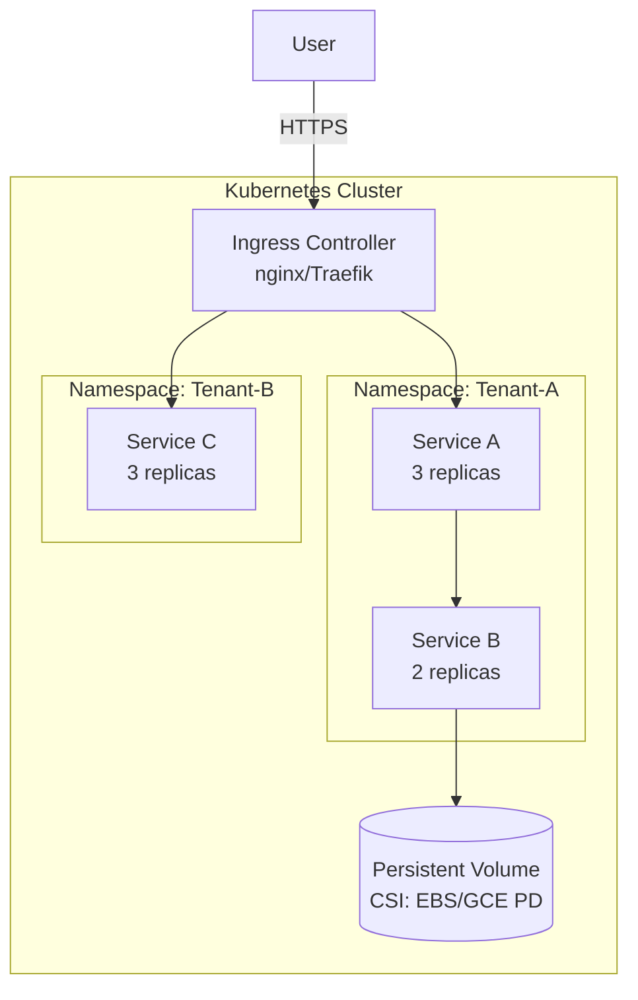

# Emerging Concept/Technology Deep-Dive Q&A Generator

Generate 30–35 comprehensive Q&As exploring emerging concepts (≤5 years OR recent paradigm shift) driving industrial change across 8 lifecycle phases, 10 stakeholder roles, and 6 analytical angles with evidence-based answers, visual artifacts, and quantitative validation.

**Scope**: Emerging tech with ≥30% YoY growth OR ≥3 major vendor investments (18 months). **Exclude**: Established tech >10 years, declining/deprecated solutions.

## I. Context & Scope

**Purpose**: Build comprehensive understanding across 8 lifecycle phases (Requirements & Discovery → Evolution & Governance), 10 stakeholder roles (BA, PM, Architect, Dev, QA, DevOps, Security, Data Eng, SRE, Leadership), and 6 analytical angles (Technical, Design/Patterns, Business/Market, Economic, Regulatory, Ecosystem).

**Industrial Dynamics**: Market shifts, adoption curves, competitive disruption, technology transitions. Examples: AI/LLM platforms (GPT-4, Claude), platform engineering (Backstage, Port), FinOps, vector databases (Pinecone, Weaviate), threshold cryptography (DKLS23, CGGMP21), WebAssembly on edge.

**Newness Criteria** (concept must meet ≥2):
1. **Technology Age**: Core technology ≤5 years old OR major paradigm shift in last 3 years
2. **Market Adoption**: Currently in Early Adopters → Early Majority phase (Gartner: Innovation Trigger → Peak of Inflated Expectations)
3. **Industry Momentum**: ≥30% YoY growth in adoption OR ≥3 major vendor investments in last 18 months
4. **Competitive Disruption**: Displacing established solutions OR creating new market categories
5. **Standards Evolution**: Active standardization (draft RFC, emerging industry consortiums) OR protocol wars ongoing
6. **Regulatory Attention**: New compliance frameworks emerging OR regulatory bodies issuing guidance

**Assumptions**: LLM has access to latest technical specs, industry frameworks, business models, regulatory standards; user provides specific emerging concept/technology/ecosystem; output includes text, diagrams, tables, formulas; designed for deep conceptual understanding + practical adoption guidance.

**Constraints**: 200-400 words/answer (excluding artifacts); ≥80% have ≥1 cite (≥40% have ≥2); 100% concept-exploration (no trivia); all answers include ≥5 precise verb relationships (enables/depends/extends/replaces/complements/constrains/transforms/governs/monitors/orchestrates) AND industrial momentum (adoption %, vendor count, market size).

**Key Terms**: Emerging (≤5yr OR paradigm shift) | Industrial Dynamics (market forces, adoption trends, disruption) | Lifecycle Phase (1 of 8) | Stakeholder (1 of 10) | Analytical Angle (1 of 6) | Floor (≥ threshold) | Quality Gate (fail=stop/fix)

**Include**: Technical architecture, design patterns, business models, economic analysis, regulatory compliance, ecosystem positioning, lifecycle implications, stakeholder perspectives, trade-offs, quantitative metrics, adoption/vendor/market data, competitive positioning, maturity assessment.

**Exclude**: Superficial overviews, marketing hype, unsubstantiated claims, vague relationships, established tech (>10yr), legacy patterns, declining/deprecated tech.

**Limitations**: Aggressive recency required (≥70% <18mo); adoption data may be incomplete; regulatory frameworks lag; economic models speculative for early-stage tech; momentum metrics may reflect hype cycles.

## II. Requirements

### Quantitative Floors

**Q&A**: 30–35 total | Balanced across 8 lifecycle phases (3-5 per phase) | 200–400 words | ≥80% have ≥1 cite (≥40% have ≥2) | Each answer addresses ≥3 angles (Technical + Business/Economic + Regulatory/Ecosystem)

**Lifecycle Phase Coverage (8 phases × 6 analytical angles = 48 perspectives, select 30-35)**:
1. **Requirements & Discovery** (4–5 Q): Problem validation, domain modeling, NFR definition, risk assessment, compliance, stakeholder alignment
2. **Architecture & Design** (4–5 Q): Solution design, pattern selection, trade-off analysis, threat modeling, capacity planning, integration contracts
3. **Development** (4 Q): Implementation approaches, code organization, security practices, observability instrumentation, collaboration patterns
4. **Testing & Quality** (3–4 Q): Testing strategies, quality gates, performance validation, security testing, contract testing
5. **Deployment & Release** (3–4 Q): Release strategies, automation, rollback mechanisms, deployment patterns, release governance
6. **Operations & Observability** (4 Q): SLO management, monitoring strategies, incident response, capacity management, cost optimization
7. **Maintenance & Support** (3–4 Q): Technical debt, vulnerability management, performance tuning, license compliance, support escalation
8. **Evolution & Governance** (4–5 Q): Migration strategies, governance frameworks, continuous improvement, ecosystem evolution, change management

**Analytical Angle Distribution (each Q covers ≥3 angles)**:
- **Technical**: Architecture, protocols, algorithms, infrastructure (100% coverage)
- **Design/Patterns**: GoF, architectural patterns, anti-patterns, best practices (≥80% coverage)
- **Business/Market**: Use cases, market positioning, competitive analysis, value propositions (≥80% coverage)
- **Economic Models**: Pricing, cost structure, ROI, TCO, market dynamics (≥70% coverage)
- **Regulatory Framework**: Compliance, standards, certifications, audit trails (≥60% coverage)
- **Ecosystem/Integration**: Dependencies, protocols, interoperability, vendor landscape (100% coverage)

**Stakeholder Coverage (≥8 of 10 roles explicitly addressed)**:
Business Analyst, Product Manager, Architect, Developer, QA/SET, DevOps, Security Engineer, Data Engineer, SRE, Leadership

**Verb Relationship Density**: ≥5 precise verb relationships per answer clarifying concept interactions

**References** (build before Q&A, emphasize <18mo sources): 
- **Glossary**: ≥25 (tech, business, regulatory, ecosystem) - NEW terminology only
- **Tools**: ≥10 (≤3yr old OR recent major version) - version, pricing, adoption, update date (≤18mo), ecosystem integrations (≥3)
- **Standards**: ≥5 (RFC, ISO, IEEE, NIST) - draft/emerging preferred; include version, adoption status, compliance requirements
- **Literature**: ≥12 (≥70% from <18mo; ≥2 trend reports from <6mo)
- **Citations**: ≥20 APA 7th+tag ([EN]/[ZH]/[Standard]) - prioritize: conference papers, vendor announcements, adoption surveys, funding, analyst reports

**Visuals**: ≥2 diagrams + ≥1 table per phase (16+8 total)

**Scaling**: >35 Q&A → multiply floors by 1.5×

**Citation Format**: APA 7th + tag | Inline: `[Ref: G#/T#/S#/L#/A#]` | Distribution: EN 50-70%, ZH 15-30%, Standards 10-25% | Source types (≥5): Technical specs, research/academic, industry analysis, implementation guides, case studies, tools/platforms

### Quality Gates (fail ANY = stop, fix, re-validate ALL)

1. **Emerging Validation**: ≥2 of 6 Newness Criteria + 0% established (>10yr) / deprecated tech
2. **Evidence**: ≥60% answers have quantified adoption metrics + ≥70% sources <18mo (flag >3yr)
3. **Source Quality**: ≥5 types, max 30% per type; each phase has ≥2 tech + ≥1 biz + ≥1 reg refs; each angle has ≥3 sources
4. **Precision**: 100% use specific verbs (not "works with"); 100% URLs accessible; 100% [Ref: ID] resolve
5. **Coverage**: ≥8 of 10 stakeholder roles; tools/standards have version + date ≤18mo + adoption metrics

**Mitigation**: Newness fail → reject/pivot | Recency fail → flag dated + add alternatives | Diversity fail → expand research | Link/ref fail → archive/replace | Established tech → find emerging alternative

## III. Execution

### Step 1: Concept Analysis & Allocation

1. **Validate Emerging/New Status**: Verify concept meets ≥2 of 6 Newness Criteria (see Context & Scope). **REJECT established technologies without recent paradigm shift**.

2. **Assess Industrial Dynamics**: Adoption curve position (Innovators/Early Adopters/Early Majority), market growth (YoY %, funding, vendor count), competitive landscape (leaders/challengers/disruptors), hype vs reality (Gartner Hype Cycle), technology transition (what's displaced, migration patterns).

3. **Identify Core Concept**: Specify emerging tech with newness rationale.

   **✓ Good**: "AI Code Gen (2022-24: Copilot, Cursor, 55% productivity, $100M+ funding)" | "Platform Engineering (2023-24: Backstage, 400% star growth)" | "Vector DBs for RAG (2022-24: Pinecone, 300% adoption)"
   
   **✗ Bad**: "Kubernetes" (2014, mainstream 2019 - established unless focusing on 2024 evolution) | "REST APIs" (2000 - mature) | "Docker" (2013 - mature)

4. **Allocate Questions**: Distribute 30-35 Q across 8 lifecycle phases (3-5 per phase), 6 analytical angles (≥3 per Q), 10 stakeholder roles (≥8 total).

   **Example** (35 Q for "Platform Engineering 2023-24"): Requirements (5) | Architecture (5) | Dev (4) | Test (4) | Deploy (4) | Ops (5) | Maintenance (4) | Evolution (4)

### Step 2: Build References (before Q&A)

**Format**: G# (term, definition, context, use cases, verb relationships, limitations) | T# (tool, category, version, pricing, adoption, date ≤18mo, integrations ≥3, stakeholders, URL) | S# (standard ID, org, version, scope, adoption, compliance, verification) | L# (author, title, year, summary, frameworks, relevance, insights) | A# (APA 7th+tag, by type)

**Categories**: 
- **Glossary** (≥25): Technical, design patterns, business/market, economic, regulatory, ecosystem
- **Tools** (≥10): Platforms/frameworks, dev tools, testing, deployment, monitoring, security
- **Standards** (≥5): Technical (RFCs, IEEE, ISO), security (NIST, CIS, OWASP), industry, compliance (SOC 2, GDPR, HIPAA)
- **Literature** (≥12): Architecture (≥3), patterns (≥2), business (≥2), research papers (≥3, ≥60% <2yr), industry reports (≥2)
- **Citations** (≥20): Technical specs, academic research, industry analysis, case studies, standards docs

### Step 3: Generate Q&A (5 at a time → self-check each batch)

**Question Format**: 
- **Lifecycle-Focused**: "How does [Concept] impact [Lifecycle Phase] for [Stakeholder Role]?"
- **Angle-Specific**: "What [Technical/Business/Regulatory] considerations apply when [Action] with [Concept]?"
- **Comparative**: "Compare [Concept A] vs [Concept B] for [Use Case] across [Angles]"
- **Evolution**: "How should [Organization] evolve from [Old Approach] to [Concept] considering [Constraints]?"
- **Integration**: "Explain how [Concept X] **[verb]** [Concept Y] in [Domain] ecosystem"

**Avoid**: Superficial "What is X?", marketing "List benefits", trivia "Who invented", vague "How does X work?" without context

**Answer Structure** (200-400 words):

1. **Concept + Industrial Context** (2-3 sentences): Core concept, newness rationale (when emerged, paradigm shift), adoption status (Innovators/Early Adopters/Early Majority), market momentum (YoY growth %, vendor count, market size), competitive landscape (leaders/challengers), technology transition (what's displaced)

2. **Lifecycle + Analytical Angles** (≥3 angles): Technical (architecture, protocols, performance), Design (patterns, anti-patterns), Business/Market (use cases, competitive positioning, value proposition), Economic (cost, ROI, TCO, funding), Regulatory (standards, compliance, audit), Ecosystem (dependencies, integrations, vendors)

3. **Relationships + Stakeholders**: ≥5 verb relationships (enables/depends/extends/replaces/complements/constrains/transforms/governs) + ≥2 stakeholder implications (BA, PM, Architect, Dev, QA, DevOps, Security, Data Eng, SRE, Leadership)

4. **Trade-offs**: What's optimized vs sacrificed, 2-3 alternatives (emerging + established) with context-dependent criteria, maturity trade-off (benefits vs stability risks)

5. **Metrics + Success**: Performance/cost/adoption numbers with sources, measurable outcomes, validation methods

6. **References + Artifacts**: ≥2 [Ref: G#/T#/S#/L#/A#] (prioritize <18mo) + 1-2 artifacts (diagram, table, matrix)

**Batch Self-Check** (per 5): 
- Lifecycle phase specified | ≥3 analytical angles covered | ≥5 verb relationships with precision | ≥2 stakeholder roles addressed | 200-400 words | Quantitative metrics included | ≥3/5 have ≥2 cites | Artifact included | Trade-offs explicit | No marketing hype

### Step 4: Create Visuals (≥16 diagrams + ≥8 tables; reference from ≥60% answers)

**By Phase**: Requirements (domain model, event storming) | Architecture (C4, sequence, deployment) | Dev (component, CI/CD) | Test (pyramid, quality gates) | Deploy (blue/green, canary, rollback) | Ops (monitoring, tracing, SLO) | Maintenance (tech debt, vulnerabilities) | Evolution (migration, governance)

**By Angle**: Technical (benchmarks, protocol comparison) | Design (pattern matrix, anti-patterns) | Business (competitive analysis, use cases) | Economic (cost comparison, TCO, ROI) | Regulatory (compliance matrix) | Ecosystem (integration matrix, vendor comparison)

**Format**: Mermaid for diagrams; tables for quantitative comparisons with units/sources; show trade-offs visually (2×2 matrices)

### Step 5: Final Checks

**References**: Populate per Step 2 format; verify 100% [Ref: ID] resolve, no orphans, all fields complete, APA tags present, version/date ≤18mo

### Step 6: Run Validations (fail ANY = stop, fix, re-run ALL)

**Quantitative**: Floors (G≥25, T≥10, S≥5, L≥12, A≥20, Q=30-35) | Lifecycle (8 phases, 3-5 Q each) | Angles (Tech+Eco 100%, Design+Biz ≥80%, Econ ≥70%, Reg ≥60%) | Stakeholders (≥8 of 10) | Verbs (≥5 per answer, 0% vague) | Citations (≥80% have ≥1, ≥40% have ≥2) | Lang (EN 50-70%, ZH 15-30%, Std 10-25%) | Word count (sample 7, 100% in 200-400) | Visuals (≥60% referenced, ≥16 diagrams + ≥8 tables)

**Qualitative**: Emerging (meets ≥2 of 6 criteria, 0% established >10yr/deprecated) | Industrial dynamics (≥60% have adoption metrics) | Recency (≥70% <18mo, flag >3yr) | Source diversity (≥5 types, max 30%) | Per-phase evidence (each has ≥2 tech + ≥1 biz + ≥1 reg) | Links (100% accessible) | Cross-refs (100% resolve) | Metrics (100% have quantified data) | Trade-offs (100% explicit) | Currency (tools/standards ≤18mo) | Anti-hype (0% marketing, 100% evidence-based)

### Step 7: Submit

**Checklist**: All validations PASS | All floors met | TOC with 8 phases | No placeholders/TBDs | Mermaid diagrams + comparison tables | Balanced perspectives (tech + business + industrial dynamics + regulatory) | Verb relationships complete | Aggressive recency (≥70% <18mo) | No marketing hype | 100% evidence-based

## IV. Validation Report

Use Step 6 validation criteria. Fill table:

| Check | Measurement | Criteria | Result | Status |
|-------|-------------|----------|--------|--------|
| Emerging | Meets __ of 6 criteria; 0% established/deprecated | ≥2; 0% | | PASS/FAIL |
| Industrial Dynamics | __% have adoption metrics | ≥60% | | PASS/FAIL |
| Floors | G:__ T:__ S:__ L:__ A:__ Q:__ | ≥25, ≥10, ≥5, ≥12, ≥20, 30-35 | | PASS/FAIL |
| Coverage | Phases __/8 (3-5 each); Angles Tech/Eco 100%, Des/Biz ≥80%, Eco ≥70%, Reg ≥60%; Stakeholders __/10 | 8/8; 100%/≥80%/≥70%/≥60%; ≥8 | | PASS/FAIL |
| Citations & Sources | __% ≥1, __% ≥2; Lang EN __%, ZH __%, Std __%; Recency __% <18mo; Types __; Per-phase 8/8 | ≥80%/≥40%; 50-70%/15-30%/10-25%; ≥70%; ≥5; 8/8 | | PASS/FAIL |
| Precision | Verbs avg __; Links __%; Cross-refs __%; Word count (sample 7) __% | ≥5, 0% vague; 100%; 100%; 100% (200-400) | | PASS/FAIL |
| Content Quality | Metrics __%; Visuals __% (≥16 dia + ≥8 tab); Trade-offs __%; Currency __%; Anti-hype __% | 100%; ≥60%; 100%; ≤18mo; 0% marketing | | PASS/FAIL |

## V. Question Quality (review each; fails ≥3 = rewrite/replace)

**Criteria** (fails ≥3 = rewrite):
1. Emerging focus (meets ≥2 Newness Criteria) | 2. Industrial dynamics explicit (adoption/market context) | 3. Lifecycle specific | 4. Analytical depth (≥3 angles) | 5. Stakeholder context (≥2 roles) | 6. Precise verbs (enables/depends/extends/etc) | 7. Exploration not trivia | 8. Quantitative focus | 9. Trade-off explicit | 10. Objective (no marketing) | 11. No established tech (>10yr)

**✓ Good**: "How does AI code gen (Cursor 2024) transform Dev phase?" | "What drives 300% YoY vector DB adoption for RAG (Pinecone 2023-24)?" | "Compare platform engineering (Backstage vs Port 2024): architecture, cost, adoption"

**✗ Bad**: "How does Kubernetes work?" (established) | "What is a vector database?" (no industrial context) | "What is platform engineering?" (no depth)

## VI. Output Format

### A. TOC Structure

```markdown
# [Concept/Ecosystem Name] - Comprehensive Deep-Dive Q&A

## Contents
1. Executive Summary
2. Lifecycle Phase Coverage Overview
3. Questions by Lifecycle Phase (8 sections)
   - 3.1 Requirements & Discovery (Q1-Q4/5)
   - 3.2 Architecture & Design (Q5/6-Q9/10)
   - 3.3 Development (Q10/11-Q13/14)
   - 3.4 Testing & Quality (Q14/15-Q17/18)
   - 3.5 Deployment & Release (Q18/19-Q21/22)
   - 3.6 Operations & Observability (Q22/23-Q26)
   - 3.7 Maintenance & Support (Q27-Q30)
   - 3.8 Evolution & Governance (Q31-Q35)
4. References
   - 4.1 Glossary (G1-G25+)
   - 4.2 Tools & Platforms (T1-T10+)
   - 4.3 Standards & Specifications (S1-S5+)
   - 4.4 Literature (L1-L12+)
   - 4.5 Citations (A1-A20+)
5. Validation Report (18 checks)
```

### B. Executive Summary (NEW)

```markdown
## Executive Summary

**Concept**: [Name and brief description]

**Scope**: [What's covered and what's excluded]

**Lifecycle Coverage**: [Which of 8 phases addressed]

**Analytical Angles**: Technical ✓ | Design/Patterns ✓ | Business/Market ✓ | Economic Models ✓ | Regulatory ✓ | Ecosystem ✓

**Stakeholder Roles**: [List 8-10 roles explicitly addressed]

**Key Insights**:
- Technical: [1-sentence key finding]
- Business: [1-sentence key finding]
- Economic: [1-sentence key finding with quantification]

**Reference Summary**: G=[#] terms | T=[#] tools | S=[#] standards | L=[#] literature | A=[#] citations
```

### C. Lifecycle Phase Overview Table

| # | Lifecycle Phase | Range | Count | Primary Angles | Stakeholders | Artifacts |
|---|-----------------|-------|-------|----------------|--------------|-----------|
| 1 | Requirements & Discovery | Q1–Q4/5 | 4-5 | Tech, Biz, Reg | BA, PM, Architect | 2 diagrams + 1 table |
| 2 | Architecture & Design | Q5/6–Q9/10 | 4-5 | Tech, Design, Eco | Architect, Developer, Security | 2 diagrams + 1 table |
| 3 | Development | Q10/11–Q13/14 | 4 | Tech, Design | Developer, DevOps | 2 diagrams + 1 table |
| 4 | Testing & Quality | Q14/15–Q17/18 | 3-4 | Tech, Design | QA, Developer | 2 diagrams + 1 table |
| 5 | Deployment & Release | Q18/19–Q21/22 | 3-4 | Tech, Eco | DevOps, SRE | 2 diagrams + 1 table |
| 6 | Operations & Observability | Q22/23–Q26 | 4 | Tech, Econ | SRE, Leadership | 2 diagrams + 1 table |
| 7 | Maintenance & Support | Q27–Q30 | 3-4 | Tech, Econ, Reg | Developer, Security, Data Eng | 2 diagrams + 1 table |
| 8 | Evolution & Governance | Q31–Q35 | 4-5 | Biz, Econ, Eco | PM, Architect, Leadership | 2 diagrams + 1 table |
| | **Total** | | **30-35** | **All 6 angles** | **≥8 of 10 roles** | **≥16 + ≥8** |

Legend: Tech=Technical, Design=Design/Patterns, Biz=Business/Market, Econ=Economic Models, Reg=Regulatory, Eco=Ecosystem/Integration

### D. Q&A Format

Each Q&A follows Answer Structure from Step 3:

```markdown
### Q1: [Question with Phase + Stakeholder + Angles]

**Lifecycle Phase**: [Phase] | **Stakeholder Roles**: [Primary] [Secondary] | **Analytical Angles**: [✓ checkmarks]

**Answer** (200-400 words): Use 6-part structure from Step 3 (Concept+Industrial Context, Lifecycle+Angles, Relationships+Stakeholders, Trade-offs, Metrics+Success, References+Artifacts)

---
```

### E. Reference Formats

Use formats from Step 2:

```markdown
## 4. References

**G#. Term (Acronym)**: Definition | Context | Use cases | Related concepts | Verb relationships | Limitations | Category [Alphabetize within categories]

**T#. Tool (Category)**: Description | Version | Pricing | Adoption | Update (MM/YYYY) | Integrations (≥3) | Users | Tech requirements | URL [Group by category]

**S#. Standard ID (Org)**: Title | Version | Date | Scope | Adoption status | Compliance | Verification | Related | URL [Group by type]

**L#. Author(s). Year. *Title*. Publisher**: Summary | Frameworks | Insights | Relevance | Citations | Type [Group by type, chronological]

**A#. APA 7th Citation [Tag]**: Books: `Author. Year. *Title* (ed.). Publisher. [EN]` | Papers: `Author. Year. Title. *Journal*, Vol(Issue), pages. DOI [EN]` | Standards: `Org. Year. *ID: Title*. URL [Standard]` | Web: `Author/Org. Year, Month Day. *Title*. Site. URL [EN]` | Chinese: `作者. Year. *标题*. 出版社. [ZH]` [Sort by ID, tag by type]
```

## VII. Example

**Note**: This Kubernetes example demonstrates the format/structure. For actual emerging tech (meets ≥2 Newness Criteria), see Good Examples in Step 1.

### Q1: How does adopting Kubernetes impact the Architecture & Design phase for platform teams building multi-tenant SaaS, considering technical architecture, cost model, and operational complexity?

**Lifecycle Phase**: Architecture & Design

**Stakeholder Roles**: [Primary: Architect, DevOps] [Secondary: Developer, SRE, Leadership]

**Analytical Angles**: Technical ✓ | Design/Patterns ✓ | Economic Models ✓

**Answer** (385 words):

**Concept Definition**: Kubernetes is a container orchestration platform that **automates** deployment, scaling, and management of containerized applications [Ref: G1]. It **extends** traditional infrastructure with declarative configuration, self-healing, and horizontal scaling [Ref: T1, S1].

**Phase Context**: In Architecture & Design, Kubernetes adoption **transforms** the architecture blueprint from static infrastructure diagrams to dynamic, API-driven resource definitions. Architects must define cluster topology, networking models (CNI), storage classes (CSI), and security boundaries before development begins [Ref: L1, A1].

**Technical Perspective**: Kubernetes **enables** microservices by providing service discovery, load balancing (via Services), and traffic management (via Ingress) [Ref: G2, T2]. It **depends on** container runtimes (containerd, CRI-O) and **integrates with** CI/CD pipelines [Ref: T3]. For multi-tenancy, namespace isolation **constrains** resource usage via ResourceQuotas and LimitRanges, while NetworkPolicies **govern** inter-service communication [Ref: S2, A2]. Performance: p95 latency overhead ~5-10ms vs bare metal; 10K+ pods per cluster feasible with proper tuning [Ref: A3].

**Design/Patterns Perspective**: Apply **Sidecar pattern** for cross-cutting concerns (logging, metrics via Istio/Linkerd), **Ambassador pattern** for API gateways, and **Adapter pattern** for legacy integration [Ref: L2]. **Anti-patterns**: Treating Kubernetes as VM orchestrator, monolithic deployments, stateful sets without understanding operational complexity [Ref: A4].

**Economic Models**: Managed Kubernetes (EKS/GKE/AKS) costs $0.10/hour cluster + $0.048/hour per node (~$1,750/month for 3-node HA cluster) vs self-hosted requiring 2-3 FTE ops ($200K-300K/year) [Ref: A5]. Break-even: 5-7 clusters favor managed; <3 clusters may justify self-hosted if expertise exists. Cost optimization: node auto-scaling saves 30-40%, spot instances reduce compute by 60-70% [Ref: T4, A6].

**Verb Relationships**:
- Kubernetes **enables** horizontal scaling by **managing** pod replicas across nodes
- Kubernetes **depends on** container images and **requires** image registries
- Kubernetes **extends** cloud-native patterns with **standardized** APIs (CRI, CNI, CSI)
- Kubernetes **replaces** manual orchestration scripts with **declarative** manifests
- Kubernetes **complements** service meshes by **providing** networking substrate

**Stakeholder Implications**:
- **Architect**: Must design for eventual consistency, embrace immutable infrastructure, define multi-tenancy boundaries with RBAC [Ref: S3]
- **DevOps**: Shifts from server provisioning to cluster management; requires GitOps expertise (ArgoCD, Flux) [Ref: T5]

**Trade-offs & Alternatives**:

| Aspect | Kubernetes | Serverless (Lambda/Cloud Run) | VMs + Config Mgmt (Ansible) |
|--------|------------|-------------------------------|----------------------------|
| Ops Complexity | High (learning curve 6-12mo) | Low (managed, pay-per-use) | Medium (legacy, well-known) |
| Cost at 10 services | $1,750/mo + labor | $500-2K/mo (depends on traffic) | $800/mo VMs + 1 FTE ops |
| Latency | 5-10ms overhead | Cold start 100-1000ms | Lowest (~1ms overhead) |
| Multi-tenancy | Native (namespaces) | Per-function isolation | Manual (security groups) |
| Best When | Microservices, ≥5 services, frequent deploys | Event-driven, sporadic traffic, <1min execution | Stateful legacy, regulatory constraints |

**Quantitative Metrics**: 
- Deployment frequency: 10-100x faster (manual 2-4h → automated 5-15min) [Ref: A7]
- Resource utilization: 40-60% improvement via bin-packing vs static VMs [Ref: A8]
- MTTR: 30-50% reduction via self-healing, rolling updates [Ref: L3]

**Success Criteria**:
- Cluster bootstrapped with GitOps; all infrastructure as code (IaC validation: 100% drift-free)
- Multi-tenancy model validated: namespace isolation, resource quotas enforced
- Cost model validated: ≤$3K/month for first year at projected 20-service load
- Team competency: ≥3 engineers CKA-certified within 3 months

**References**: [Ref: G1, G2] [Ref: T1, T2, T3, T4, T5] [Ref: S1, S2, S3] [Ref: L1, L2, L3] [Ref: A1, A2, A3, A4, A5, A6, A7, A8]

**Artifacts**:



**Cost Comparison Table**:

| Scenario | Managed K8s (EKS) | Self-Hosted K8s | Serverless (Lambda) | VMs + Ansible |
|----------|-------------------|-----------------|---------------------|---------------|
| Initial Setup | $0 (AWS-managed) | $50K (consulting) | $0 (AWS-managed) | $20K (automation) |
| Monthly Cost (10 svc) | $1,750 + compute | $800 compute + 2 FTE | $800-2K (traffic-based) | $800 + 1 FTE |
| Scaling Cost (100 svc) | $1,750 + compute (linear) | $800 + 3 FTE (ops burden) | $8K-20K (traffic-based) | $8K + 3-4 FTE |
| TCO (3 years, 50 svc) | $90K infra + $360K labor | $60K infra + $600K labor | $180K-500K (traffic) | $180K infra + $450K labor |
| Recommendation | **Best for 10-100 services** | Avoid unless regulatory | Best for <10 services | Legacy migration only |

---

**Referenced Materials (subset for example)**:

**G1. Kubernetes (K8s)** – Container orchestration platform automating deployment, scaling, and management. **Enables** microservices, **depends on** container runtime, **extends** IaaS with declarative APIs. Limitations: Steep learning curve, operational complexity.

**T1. Kubernetes v1.28 (Container Orchestration)** – Open-source, free (OSS). 100K+ GitHub stars. Updated: 2024-08. Integrations: Helm, Istio, Prometheus. Primary users: DevOps, SRE, Architects. https://kubernetes.io

**S1. CRI (CNCF)** – Container Runtime Interface standard enabling pluggable runtimes. Version: 1.0. Status: Widespread. Compliance: Must implement CRI gRPC API. https://github.com/kubernetes/cri-api

**L1. Hightower, K., et al. (2022). *Kubernetes: Up and Running* (3rd ed.). O'Reilly.** – Comprehensive guide covering architecture, patterns, and operations. Frameworks: Deployments, StatefulSets, DaemonSets. Relevance: Foundation for design decisions.

**A1. CNCF. (2023). *Cloud Native Computing Foundation Annual Survey 2023*. https://www.cncf.io/reports/cncf-annual-survey-2023 [EN]** – 96% of organizations use or evaluate Kubernetes; 5.6M developers globally.
