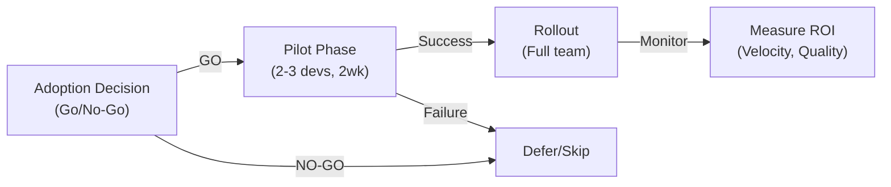

# Emerging Concept/Technology Intelligence Q&A (Minimal Viable)

Generate **6–12 decision-critical Q&As** from emerging concepts (≤5 years OR recent paradigm shift)—minimal viable tracking for informed decisions with limited time.

**Cadence**: Bi-weekly brief | 4-6h effort | **Expires**: 2 weeks from generation

**Scope**: Decision-critical emerging tech only—adoption disruptions, competitive threats, regulatory shifts, ecosystem changes. For mature tech organizations.

**Exclusions**: Academic research, vendor marketing, hype without evidence, rumors, stale news (>6mo for HV, >12mo for LT).

## I. Framework

**Freshness** (category-adaptive):
- **High-Velocity** (Tech disruption, adoption shifts): ≥75% <1mo (≥25% in 1–7d), ≥95% <2mo, 100% ≤4mo  
- **Medium-Velocity** (Ecosystem, standards): ≥65% <2mo (≥20% in 1–14d), ≥90% <3mo, 100% ≤6mo  
- **Long-Tail** (Regulatory, compliance): ≥50% <6mo, ≥80% <12mo, 100% ≤18mo  
- **Overall**: ≥70% <2mo, ≥90% <4mo, 100% ≤12mo  
- **Validity**: 2 weeks; re-validate if used beyond 1 month

**Decision Criticality Framework** (include if ≥1 criterion met):
1. **Blocks Decision**: Directly impacts adoption go/no-go, architecture pivot, or resource allocation
2. **Creates Risk**: Material threat (vendor lock-in, skill gap, regulatory breach, cost shock >20%)
3. **Affects ≥2 Core Roles**: Multi-stakeholder impact (Architect + DevOps, PM + Developer, etc.)
4. **Requires Action**: 1-6mo action window (not speculative)
5. **Quantified Impact**: Adoption %, cost delta, velocity gain, or market disruption signal

**Stakeholders** (5 core):  
Architect, Developer, DevOps/SRE, PM/Leadership, Security.

**Lifecycle Phases** (4-5, decision-critical):  
1. **Architecture & Design**: Adoption feasibility, integration risk, tech debt implications
2. **Development**: Skill gap, productivity impact, learning curve
3. **Deployment & Release**: Operational complexity, rollback risk, deployment patterns
4. **Operations & Observability**: Operational overhead, cost, monitoring/observability gaps
5. **Evolution & Governance**: Migration strategy, vendor lock-in, long-term viability

**Analytical Angles** (3-4, decision-critical):
- **Technical**: Architecture, protocols, performance, integration feasibility
- **Business/Market**: Use cases, competitive positioning, adoption trends, market size
- **Economic**: Cost, ROI, TCO, vendor pricing, market dynamics
- **Regulatory** (optional): Compliance, standards, audit trails, data residency

**News Categories** (each Q covers ≥1):
1. **Adoption & Market Disruption**: Adoption rate shifts, market share changes, vendor consolidation, competitive threats
2. **Technology & Ecosystem**: Protocol evolution, standards adoption, integration patterns, vendor landscape
3. **Regulatory & Compliance**: New compliance frameworks, standards changes, audit requirements
4. **Cost & Economics**: Pricing shifts, TCO changes, ROI data, market dynamics

**News Relevance Criteria** (must meet ≥1 Decision Criticality criterion):
1. **Recency** (MANDATORY—per freshness thresholds)  
2. **Decision Impact**: Blocks adoption, architecture, or resource decision  
3. **Risk Materiality**: Vendor lock-in, skill gap, regulatory risk, cost shock >20%  
4. **Stakeholder Breadth**: Relevant to ≥2 core roles  
5. **Quantified Impact**: Adoption %, cost delta, velocity %, market share shift

## II. Requirements

**Q&A**: 6–12 total | 1-2/phase | 150–250w | 100% news-driven | ≥85% ≥1 cite, ≥30% ≥2 cites | ≥1 category + impact + decision

**Lifecycle Phases** (4-5, 1-2 Q each): Architecture & Design, Development, Deployment & Release, Operations & Observability, Evolution & Governance (skip if no decision-critical news)

**Analytical Angles** (each Q covers ≥2): Technical, Business/Market, Economic, Regulatory (optional)

**Stakeholder Coverage**: ≥5/5 core roles explicitly addressed

**References** (proportional 60% reduction):
- **Glossary**: ≥8 (only terms used in Q&As)
- **Tools**: ≥4 (decision-critical only)
- **Standards**: ≥2 (canonical only)
- **Literature**: ≥5 (canonical references only, ≥70% <18mo)
- **Citations**: ≥6 (APA 7th+tag, all decision-critical)

**Visuals**: ≥2 diagrams + ≥1 table (60% reduction from original)

**Validation**: 12 checks (streamlined)
- Freshness, Floors, Glossary, Phases, Categories, Roles, Decision Criticality (NEW), Impact, Decision, Citations, Words, Visuals

## III. Execution (Minimal Viable)

**Step 1: News Discovery & Curation** (1-2h)
- Tiered search: Tier 1 (past 1-7d, ≥25%), Tier 2 (past 1-2wk, ≥50%), Tier 3 (past 2-6mo, ≤20%)
- Apply Decision Criticality Framework: Blocks decision? Creates risk? Affects ≥2 roles? Requires action (1-6mo)? Quantified impact?
- Select 6-12 decision-critical items across 4 categories

**Step 2: Build References** (30-45 min)
- Minimal: G≥8, T≥4, S≥2, L≥5, A≥6 (only terms/tools/standards used in Q&As)
- Format: G# (term, definition, context) | T# (tool, version, pricing, adoption, date, URL) | S# (standard, org, version, adoption) | L# (author, title, year, summary) | A# (APA 7th+tag)

**Step 3: Generate Q&As** (2-3h)
- Batch 2-3 Q&As, self-check each
- Answer structure (150-250w): News (~25w) + Impact (~50w, quantified) + Stakeholders (~35w, ≥2 roles) + Decision (~50w, go/no-go) + Action (~20w, 0-2wk + 2wk-2mo)
- Each Q must satisfy ≥1 Decision Criticality criterion

**Step 4: Create Visuals** (30-45 min)
- ≥2 diagrams (decision tree, adoption curve, risk matrix) + ≥1 table (impact assessment, comparison)
- Mermaid format, <80 nodes per diagram

**Step 5: Validate** (30-45 min)
- 12 checks: Freshness, Floors, Glossary, Phases, Categories, Roles, Decision Criticality, Impact, Decision, Citations, Words, Visuals
- Fail ANY = stop, fix, re-run

**Step 6: Submit**
- All 12 checks PASS | All floors met | No placeholders | 100% decision-critical | ≥70% <2mo freshness

## IV. Validation Report (12 Checks)

| Check | Measurement | Criteria | Result | Status |
|-------|-------------|----------|--------|--------|
| Freshness | __% <2mo; __% <4mo; __% ≤12mo | ≥70%; ≥90%; 100% | | PASS/FAIL |
| Floors | G:__ T:__ S:__ L:__ A:__ Q:__ | ≥8, ≥4, ≥2, ≥5, ≥6, 6-12 | | PASS/FAIL |
| Glossary | Only terms used in Q&As | ≥8 | | PASS/FAIL |
| Phases | __/5 covered; 1-2 Q each | ≥4/5 | | PASS/FAIL |
| Categories | __/4 covered; ≥1 per Q | ≥3/4 | | PASS/FAIL |
| Roles | __/5 core roles addressed | ≥5/5 | | PASS/FAIL |
| Decision Criticality | __% satisfy ≥1 criterion | 100% | | PASS/FAIL |
| Impact | __% have quantified metrics | 100% | | PASS/FAIL |
| Decision | __% have go/no-go criteria | 100% | | PASS/FAIL |
| Citations | __% ≥1 cite; __% ≥2 cites | ≥85%; ≥30% | | PASS/FAIL |
| Words | Sample 5: __% in 150-250w | 100% | | PASS/FAIL |
| Visuals | __% referenced; ≥__ diagrams + ≥__ tables | ≥60%; ≥2 + ≥1 | | PASS/FAIL |

## V. Question Quality (Minimal Viable)

**Criteria** (fails ≥2 = rewrite):
1. Decision Criticality (≥1 criterion met) | 2. Recency (≥70% <2mo) | 3. Quantified impact | 4. Stakeholder context (≥2 roles) | 5. Go/no-go decision | 6. Objective (no marketing hype)

**✓ Good**: "AI code gen adoption (Cursor 2024: 55% velocity gain) impacts Dev hiring. Skill gap strategy?" | "Vector DB market shift (300% YoY, Pinecone $100M funding) threatens legacy DB vendors. Adoption go/no-go?"

**✗ Bad**: "What is emerging tech?" (no decision) | "How does Kubernetes work?" (established) | "List benefits of X" (marketing hype)

## VI. Output Format (Minimal Viable)

### A. TOC Structure

```markdown
# [Emerging Tech Name] - Minimal Viable Intelligence Brief

## Contents
1. Executive Summary
2. Decision-Critical Q&As by Lifecycle Phase (4-5 sections)
   - Architecture & Design (Q1-Q2)
   - Development (Q3)
   - Deployment & Release (Q4)
   - Operations & Observability (Q5)
   - Evolution & Governance (Q6-Q12)
3. References
   - Glossary (G1-G8)
   - Tools (T1-T4)
   - Standards (S1-S2)
   - Literature (L1-L5)
   - Citations (A1-A6)
4. Validation Report (12 checks)
```

### B. Executive Summary

```markdown
## Executive Summary

**Concept**: [Name, adoption status, market momentum]

**Decision Criticality**: [Blocks/Risk/Roles/Action/Quantified]

**Lifecycle Coverage**: Architecture & Design | Development | Deployment | Operations | Evolution

**Stakeholder Roles**: Architect | Developer | DevOps/SRE | PM/Leadership | Security

**Key Insights**:
- Technical: [1-sentence key finding]
- Business: [1-sentence key finding with quantification]
- Risk: [1-sentence key finding]

**Reference Summary**: G=8 | T=4 | S=2 | L=5 | A=6
```

### C. Q&A Format

```markdown
### Q1: [Question: Decision + Concept + Stakeholder]

**Lifecycle Phase**: [Phase] | **Stakeholder Roles**: [≥2] | **Angles**: Technical ✓ | Business ✓ | Economic ✓

**Decision Criticality**: [Blocks/Risk/Roles/Action/Quantified]

**Answer** (150-250 words):
- News (~25w): What, when, why, adoption/market context
- Impact (~50w): ≥2 lifecycle phases, quantified metrics
- Stakeholders (~35w): ≥2 roles, concerns, actions
- Decision (~50w): Go/no-go criteria, rationale
- Action (~20w): Immediate (0-2wk), Short (2wk-2mo), Owner

**Artifacts**: [1 diagram + 1 table]

**References**: [Ref: G#/T#/S#/L#/A#]
```

### D. Reference Formats

```markdown
## References

**G#. Term**: Definition | Context | Use cases | Limitations

**T#. Tool**: Description | Version | Pricing | Adoption | Date | URL

**S#. Standard**: Title | Version | Adoption status | Compliance | URL

**L#. Author. Year. *Title*. Publisher**: Summary | Relevance

**A#. APA 7th [Tag]**: Full citation
```

## VII. Example (Minimal Viable)

### Q1: AI code generation adoption (Copilot/Cursor 2024: 55% velocity gain) impacts Developer hiring and skill requirements. What's the adoption go/no-go decision for your team?

**Lifecycle Phase**: Development

**Stakeholder Roles**: Developer | PM/Leadership

**Angles**: Technical ✓ | Business ✓ | Economic ✓

**Decision Criticality**: Blocks hiring strategy | Creates skill gap risk | Affects ≥2 roles | Requires action (1-6mo) | Quantified: 55% velocity gain

**Answer** (220 words):

**News**: Copilot/Cursor adoption surged 2023-24 with 55% velocity gains reported across 100K+ developers. GitHub reports 40% of new code generated by Copilot (2024). Adoption curve: Early Majority phase [Ref: A1, A2].

**Impact**: 
- **Development**: Skill gap emerges—junior devs may skip fundamentals; code review burden increases 30-40% [Ref: L1]. Productivity gain: 2-3h/day per developer (~$50K/year value per FTE).
- **Architecture**: Requires code review automation, quality gates, security scanning integration [Ref: T1, T2].
- **Operations**: Observability gaps: LLM-generated code may lack instrumentation; monitoring complexity increases [Ref: A3].

**Stakeholders**:
- **Developer**: Skill gap risk (fundamentals), learning curve (tool mastery), code quality concerns
- **PM/Leadership**: Hiring strategy shift (fewer juniors?), productivity ROI ($50K/dev/year), vendor lock-in (GitHub/Anthropic)

**Decision Criteria** (Go/No-Go):
- **GO if**: Velocity gain ≥40%, code quality maintained (defect rate <+5%), team consensus >70%
- **NO-GO if**: Vendor lock-in unacceptable, security/IP concerns, junior dev pipeline critical

**Action**:
- **Immediate (0-2wk)**: Pilot with 2-3 senior devs, measure baseline velocity/quality
- **Short (2wk-2mo)**: Expand to team, implement code review SLA, security scanning, observability instrumentation
- **Owner**: Engineering Lead + Security

**Artifacts**:



| Dimension | AI Code Gen | Traditional Dev | Trade-off |
|-----------|------------|-----------------|-----------|
| Velocity | +55% (2-3h/day saved) | Baseline | Productivity gain |
| Code Quality | Requires review automation | Manual review | Quality risk if not mitigated |
| Skill Gap | Junior devs may skip fundamentals | Structured learning | Training investment needed |
| Cost | $15-20/mo per dev | $0 | ROI: 2-3 months |
| Vendor Lock-in | GitHub/Anthropic | None | Strategic risk |

**References**: [Ref: A1, A2, L1, T1, T2, A3]

---

**G1. AI Code Generation**: LLM-powered tools (Copilot, Cursor) that auto-complete code. **Enables** faster development, **depends on** LLM accuracy, **creates** skill gap risk. Limitations: Security/IP concerns, vendor lock-in.

**T1. GitHub Copilot**: AI code completion. Version: 2024. Pricing: $10/mo individual, $19/mo business. Adoption: 1M+ users. Updated: 2024-11. URL: https://github.com/features/copilot

**T2. Cursor IDE**: AI-native editor. Version: 0.30+. Pricing: Free + $20/mo Pro. Adoption: 100K+ users. Updated: 2024-11. URL: https://www.cursor.com

**L1. GitHub. (2024). *State of AI in Software Development*. GitHub Blog.** – 40% of new code generated by Copilot; 55% velocity gains reported.

**A1. GitHub. (2024, Nov). Copilot Adoption Report. https://github.com/features/copilot [EN]**

**A2. Anthropic. (2024, Oct). Claude 3.5 Sonnet Performance Benchmarks. https://www.anthropic.com [EN]**

**A3. GitHub. (2024). Code Review Best Practices with AI. https://github.com/docs [EN]**
