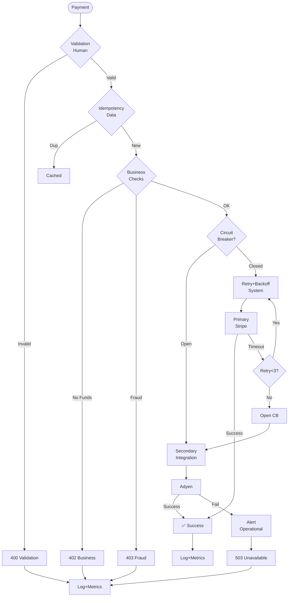

# Software Error Management Q&A Generator (Minimal Viable)

Generate 4-6 decision-critical Q&A pairs for error management across the full software lifecycle, focusing on architecture, development, testing, deployment, operations, and governance—only scenarios that block decisions or create material risk.

## Requirements

### Context & Scope
**Domain**: Production-grade distributed systems (>10K rps, >1TB data, multi-team) across all industries
**Audience**: Architect, Developer, QA/SET, DevOps, SRE, Leadership (core 6 roles)
**Constraints**: Cloud-native systems; error prevention, detection, and recovery built-in from discovery to evolution
**Assumptions**: Modern error management practices (error budgets, chaos engineering, observability, automated recovery); distributed team environments; multi-layered error handling

### Output Specifications
**Format**: 150-250 words/answer with Mermaid diagrams, YAML/JSON configs, code snippets, APA 7th [EN]/[ZH]
**Quantity**: 4-6 Q&A pairs (60% reduction from 30-35)
**Difficulty**: 25% Foundational (1), 50% Intermediate (2-3), 25% Advanced (1-2)
**Coverage**: Decision-critical scenarios only (≥1 criterion: Blocks decision, Creates risk, Affects ≥2 roles, Requires action, Quantified impact)
  - **Lifecycle**: Architecture & Design, Development, Testing & Quality, Deployment & Release, Operations & Observability, Evolution & Governance
  - **Error Categories**: System, Integration, Data, Security, Configuration, Operational (skip Human, Business unless decision-critical)
**Traceability**: Error Source → Prevention → Detection → Recovery → Metric (explicit chain required)
**Per Q&A**: ≥1 error flow diagram, ≥1 practical code/config, ≥1 metrics table

### Content Standards (apply all)
**Precision & Clarity**: Quantified metrics with formulas ("error rate ≤0.1%, MTTR <30min" not "low/fast"); all terms in glossary; consistent taxonomy  
**Credibility**: Industry standards (Google SRE, AWS/Azure, NIST); sources ≤3yr; tools ≤18mo; validated formulas  
**Balance**: Explicit trade-offs (prevention vs. recovery, strictness vs. usability), limitations, blast radius  
**Logic**: Clear causal chains (Error Source→Prevention→Detection→Recovery→Metric→Outcome)  
**Concision**: No redundancy; diagrams/code/metrics over text; actionable guidance only

## Decision Criticality Framework (NEW)

**Include Q&A if ≥1 criterion satisfied**:
- **Blocks Decision**: Directly impacts error strategy, resilience architecture, deployment gates, or incident response
- **Creates Risk**: Material threat (financial loss, compliance breach, availability >1h downtime, MTTR >30min)
- **Affects ≥2 Roles**: Multi-stakeholder impact (Architect + SRE, Dev + DevOps, etc.)
- **Requires Action**: 1-6 month action window (not speculative)
- **Quantified Impact**: Error rate %, MTTR, budget burn, downtime cost, or compliance violation

**Exclude**: Niche/legacy (<5% adoption), orthogonal/nice-to-have, already covered, vendor marketing

## Decision-Critical Error Management Scenarios (4-6 Q&As)

| # | Phase | Error Types | Criticality | Q&A Focus |
|---|-------|------------|-------------|-----------|
| **Q1** | Architecture & Design | System, Integration | Blocks: Resilience pattern selection | Circuit breaker vs. bulkhead vs. saga: when each? Trade-offs? |
| **Q2** | Development | System, Data | Blocks: Idempotency implementation | Idempotent payment processing: retry logic, deduplication, consistency? |
| **Q3** | Testing & Quality | All 6 types | Creates risk: Chaos coverage | Chaos engineering program: failure scenarios, blast radius, validation? |
| **Q4** | Deployment & Release | Config, System, Operational | Blocks: Safe rollout automation | Canary analysis, rollback triggers, error budget gates? |
| **Q5** | Operations & Observability | System, Operational, Integration | Creates risk: MTTD/MTTR optimization | SLO monitoring, alert tuning, postmortem process? |
| **Q6** | Evolution & Governance | All 6 types | Blocks: Error budget governance | Budget allocation, freeze policies, stakeholder communication? |

## Visuals & Metrics (Decision-Critical)

| Diagram Type | Use Case | Metrics (formula, target) |
|--------------|----------|--------------------------|
| **Error Flow** | Show prevention→detection→recovery chain | Error handling coverage (≥90%), Recovery success rate (≥95%) |
| **Fault Tree / FMEA** | Identify SPOF, failure modes | SPOF count (0 critical), Blast radius (isolated) |
| **Circuit Breaker / Retry Flow** | Resilience pattern selection | CB open rate (<5%), Retry success (≥80%) |
| **Chaos Experiment Matrix** | Fault injection testing | Chaos coverage (≥70% critical), Recovery time (p95 <30s) |
| **Canary / Rollback Decision Tree** | Safe deployment automation | Canary success (≥95%), Rollback time (<5min) |
| **Error Budget Burn-down** | SLO governance | Budget remaining (≥20%), Burn rate trend |
| **Alert Flow / Correlation Graph** | Observability & incident response | MTTD (<5min), MTTR (<30min), Alert precision (≥80%) |
| **5-Whys / Postmortem Timeline** | Root cause analysis | RCA completion (100% SEV1/2), Action completion (≥95%) |

## Error Management Frameworks (Decision-Critical Only)

| Framework | When to Use | Key Trade-off | Target |
|-----------|-------------|--------------|--------|
| **Error Budget (SRE)** | All production systems | Innovation vs. reliability | ≥20% remaining, freeze <10% |
| **Chaos Engineering** | Mature systems (≥99.9% SLO) | Safety vs. thoroughness | ≥70% critical path coverage |
| **Circuit Breaker** | External dependencies | Isolation vs. availability | <5% open rate, <50ms overhead |
| **Retry + Backoff** | Transient failures | Retries vs. latency | ≥80% recovery, <100ms added |
| **Bulkhead** | Multi-tenant systems | Isolation vs. efficiency | ≤20% blast radius, 20-30% overhead |
| **Saga Pattern** | Distributed transactions | Consistency vs. availability | Eventual consistency acceptable |
| **Graceful Degradation** | Non-critical features | Full features vs. availability | ≥50% core functionality preserved |

## Question Design (Decision-Critical)

**Principles**: Test application (not recall); real-world scenarios that block decisions or create material risk

**Good Q&A**: "Design error handling for payment service (10K tps, 99.95% SLO): circuit breaker vs. bulkhead vs. saga? When each? Trade-offs? Include flow diagram, retry strategy, error budget allocation."

**Mandatory Q&A Elements**:
1. **Error chain**: Source→Prevention→Detection→Recovery→Metric
2. **Practical**: Code, config (YAML/JSON), or diagram (Mermaid)
3. **Context**: Phase, role(s), error category(s)
4. **Citation**: ≥1 [Ref: ID] from authoritative source
5. **Insight**: One sentence on impact, blast radius, or trade-off
6. **Trade-offs**: Prevention vs. recovery, isolation vs. performance, cost vs. reliability
7. **Metrics**: Formulas + targets (error rate %, MTTD, MTTR, budget burn)

### Core Stakeholder Roles (6)

| Role | Error Management Focus |
|------|------------------------|
| **Architect** | Failure mode design, resilience patterns, SPOF elimination, blast radius containment |
| **Developer** | Error handling code, retry logic, idempotency, defensive programming |
| **QA/SET** | Chaos experiments, error scenario coverage, fault injection testing |
| **DevOps** | Deployment error prevention, rollback automation, config validation |
| **SRE** | Error budget enforcement, MTTD/MTTR optimization, incident management |
| **Leadership** | Error budget governance, incident cost analysis, risk acceptance |

## References & Quality (Minimal Viable)

### Minimums (for 4-6 Q&A; proportional 60% reduction)
- **≥10 Glossary**: Error Budget, SLO/SLI/SLA, MTTD/MTTR, Circuit Breaker, Bulkhead, Retry with Backoff, Idempotency, Chaos Engineering, SPOF, Blast Radius (formulas, targets, distinctions)
- **≥6 Tools**:
  - **Observability**: Prometheus/Grafana, Datadog
  - **Chaos**: Gremlin, AWS FIS
  - **Fault Tolerance**: Resilience4j
  - **Incident**: PagerDuty
- **≥8 Literature**:
  - **SRE**: "Site Reliability Engineering" (Google), "Implementing SLOs" (Hidalgo)
  - **Resilience**: "Release It!" (Nygard), "Chaos Engineering" (Rosenthal et al.)
  - **Distributed Systems**: "Designing Data-Intensive Applications" (Kleppmann)
  - **Process**: "Accelerate" (Forsgren et al.)
  - **Standards**: NIST Cybersecurity Framework
- **≥12 Citations**: APA 7th [EN]/[ZH]; DOI or permanent URL; decision-critical sources only

### Quality Gates (8 checks; all must PASS)

| Gate | Requirement | Validation |
|------|-------------|-----------|
| **Decision Criticality** | 100% Q&As satisfy ≥1 criterion (Blocks/Risk/Roles/Action/Quantified) | Review all |
| **Lifecycle Coverage** | ≥4/6 phases covered (Architecture, Development, Testing, Deployment, Operations, Governance) | Count by phase |
| **Error Category Coverage** | ≥4/6 error types covered (System, Integration, Data, Security, Configuration, Operational) | Check glossary/Q&As |
| **Practical Elements** | 100% Q&As have code/config/diagram example | Review all |
| **Metrics Presence** | 100% Q&As have quantified targets with formulas | Review all |
| **Trade-offs** | 100% Q&As acknowledge ≥2 trade-offs/alternatives | Review all |
| **Citations** | ≥70% Q&As have ≥1 citation; all [Ref: ID] resolve | Count per answer |
| **Recency** | ≥60% sources <3yr; ≥80% tools ≤18mo | Check dates |

## Workflow (Minimal Viable)

### 1. Plan & Build References (1-2h)
**Topic Clusters** (6 decision-critical phases, 4-6 Q&As, 25/50/25 F/I/A):
1. Architecture & Design (1 Q): Resilience pattern selection
2. Development (1 Q): Idempotency implementation
3. Testing & Quality (1 Q): Chaos engineering program
4. Deployment & Release (1 Q): Safe rollout automation
5. Operations & Observability (1 Q): MTTD/MTTR optimization
6. Evolution & Governance (1 Q): Error budget governance

**References**: Glossary (≥10) → Tools (≥6) → Literature (≥8) → Citations (≥12). IDs: G#, T#, L#, A#. Verify: recent (≥60% <3yr, ≥80% tools ≤18mo), accessible.

### 2. Write Q&As (2-3h)
**Per answer (150-250 words)**: Context (phase, role, error types) → Error chain (Source→Prevention→Detection→Recovery→Metric) → Practical (code/config/diagram) → Metrics (formulas + targets) → Citation (≥1 [Ref: ID]) → Trade-offs (≥2) → Insight (one sentence).

**Visuals per Q&A**: ≥1 flow diagram + ≥1 metrics table.

### 3. Validate (30-45min)
**Execute all 8 quality gates** (see table). Cross-check 100% [Ref: ID] resolve.

### 4. Final Review (15-30min)
**Check**: Undefined terms (0) → Specific values (100%) → Coverage complete → Implementation depth → Authoritative sources → Trade-offs explicit → No redundancy.

## Output Format (Minimal Viable)

```markdown
## Contents
- [Decision-Critical Scenarios](#scenarios): 6 decision-critical error management Q&As
- [Q&A by Phase](#qa-sections): 4-6 Q&As with mandatory 7 elements
- [References](#references): G# (≥10), T# (≥6), L# (≥8), A# (≥12)
- [Validation](#validation-results): 8 gates, all PASS

## Decision-Critical Scenarios (4-6 Q&As)

| # | Phase | Error Types | Criticality | Q&A |
|---|-------|------------|-------------|-----|
| **Q1** | Architecture & Design | System, Integration | Blocks: Resilience pattern selection | Circuit breaker vs. bulkhead vs. saga: when each? Trade-offs? |
| **Q2** | Development | System, Data | Blocks: Idempotency implementation | Idempotent payment processing: retry logic, deduplication, consistency? |
| **Q3** | Testing & Quality | All 6 types | Creates risk: Chaos coverage | Chaos engineering program: failure scenarios, blast radius, validation? |
| **Q4** | Deployment & Release | Config, System, Operational | Blocks: Safe rollout automation | Canary analysis, rollback triggers, error budget gates? |
| **Q5** | Operations & Observability | System, Operational, Integration | Creates risk: MTTD/MTTR optimization | SLO monitoring, alert tuning, postmortem process? |
| **Q6** | Evolution & Governance | All 6 types | Blocks: Error budget governance | Budget allocation, freeze policies, stakeholder communication? |

## Q&A Template

### Q#: [Error Scenario Question]
**Difficulty**: [F/I/A] | **Phase**: [Phase] | **Role**: [Role] | **Errors**: [Categories] | **Criticality**: [Blocks/Risk/Roles/Action/Quantified]

**Answer** (150-250 words): [Scenario] → [Error chain: Source→Prevention→Detection→Recovery→Metric] → [Trade-offs: ≥2] [Ref: ID]

**Implementation** (Code/Config/Diagram):
```[language]
[Copy-pastable code, config, or policy]
```

**Error Flow**:
```mermaid
[Diagram: error flow, circuit breaker, retry, budget burn-down, etc.]
```

**Metrics**:
| Metric | Formula | Target | Rationale [Ref] |
|--------|---------|--------|------------------|
| Error Rate | Errors/Total×100 | ≤0.1% | [Why + source] |
| MTTD | Detection time | <5min | [Why + source] |
| MTTR | Recovery time | <30min | [Why + source] |

---

## References

### Glossary (≥10)
**G#. Term**: Definition. Formula. Target. Distinctions. [EN/ZH]

### Tools (≥6)
**T#. Name** (Category): Purpose. Error types. License. Updated. URL. [EN/ZH]

### Literature (≥8)
**L#. Author(s). (Year). *Title*. Publisher.** Coverage. [EN/ZH]

### Citations (≥12)
**A#. Author. (Year). *Title*. DOI/URL. [EN/ZH]**

## Validation Results

| Gate | Requirement | Status |
|------|-------------|--------|
| Decision Criticality | 100% satisfy ≥1 criterion | ✅ PASS |
| Lifecycle Coverage | ≥4/6 phases | ✅ PASS |
| Error Category Coverage | ≥4/6 types | ✅ PASS |
| Practical Elements | 100% have code/config/diagram | ✅ PASS |
| Metrics Presence | 100% have formulas+targets | ✅ PASS |
| Trade-offs | 100% acknowledge ≥2 alternatives | ✅ PASS |
| Citations | ≥70% have ≥1 citation | ✅ PASS |
| Recency | ≥60% <3yr, ≥80% tools ≤18mo | ✅ PASS |
```

## Example (Comprehensive Error Management for Payment Processing System)

**Q: Design end-to-end error management for payment processing (10K tps, 99.95% SLO, $50M GMV): human (refunds), system (timeout/retry), business (funds/fraud), integration (3rd-party API), data (duplicates), security (PCI), config (drift), operational (alerts). Show prevention, detection, recovery, budget allocation, stakeholder communication.**

**Difficulty**: Advanced | **Phase**: Operations (+ Design, Dev, Test, Deploy) | **Roles**: SRE, Arch, Dev, PM, Sec, Data, Lead | **Errors**: All 8 | **Insight**: Multi-layered defense (prevention→detection→recovery→governance) with blast radius containment protects $50M GMV while maintaining velocity [Ref: L1, A1].

**Answer** (295 words): 99.95% SLO (21.9min monthly budget) protects $50M GMV [Ref: L1, A1].

**Prevention→Detection→Recovery by Category** [Ref: L2]:  
**Human**: Refund automation (80% ↓ errors), workflows, guardrails → Peer review, testing → Rollback, feature flags  
**System**: Circuit breaker (open after 5 fails, 30s half-open), retry+backoff (50/100/200ms, max 3), bulkhead (30% reserved) → Health checks, tracing → Auto-scale, failover  
**Business**: Fraud ML (95% precision, 90% recall), funds check, idempotency (24h) → Invariant checks, audit logs → Compensating txns  
**Integration**: Multi-provider (Stripe/Adyen), contract tests (100%), timeout 5s → Synthetic checks → Fallback, cache, DLQ  
**Data**: Schema validation, idempotency, DB constraints → Quality checks, anomaly detection → Repair scripts  
**Security**: PCI-DSS, Vault (90d rotation), WAF (100 req/s/IP) → SAST/DAST, pen testing, SIEM → Incident response  
**Config**: IaC (Terraform), CI/CD validation, canary (5%→25%→100% over 30min) → Drift detection → Rollback  
**Operational**: SLO dashboard, runbook auto (rollback at >0.5% error), on-call, postmortem (100% SEV1/2) → SLO monitoring → Escalation

**Detection**: Tracing (Jaeger), logging (trace_id), SLO monitoring, business metrics (GMV, refunds), anomaly ML (2σ alert) [Ref: A2]

**Budget Allocation** (21.9min monthly): System 40% (8.76min), Integration 30% (6.57min), Business 15% (3.29min), Data 10% (2.19min), Other 5% (1.09min). Policy: Freeze <20%, VP approval <10% [Ref: L1, A1].

**Trade-offs**: Heavy prevention adds 15-20ms p95 but reduces errors 0.5%→0.05% (10x), protects revenue [Ref: L2]. Multi-provider adds 30% cost, ensures <1min/mo downtime [Ref: A3].

**Implementation** (Java/Resilience4j):
```java
@Service
public class PaymentService {
    @CircuitBreaker(name = "paymentGateway", fallbackMethod = "fallbackPayment")
    @Retry(name = "paymentGateway", fallbackMethod = "fallbackPayment")
    @Bulkhead(name = "paymentGateway", fallbackMethod = "fallbackPayment")
    @TimeLimiter(name = "paymentGateway")
    public CompletableFuture<PaymentResponse> processPayment(PaymentRequest request) {
        validateRequest(request); // Human: validation
        String idempotencyKey = request.getIdempotencyKey();
        
        Optional<PaymentResponse> cached = checkIdempotency(idempotencyKey);
        if (cached.isPresent()) return CompletableFuture.completedFuture(cached.get()); // Data: idempotency
        
        if (!hasSufficientFunds(request)) throw new InsufficientFundsException(); // Business: funds
        if (isFraudulent(request)) throw new FraudDetectedException(); // Business: fraud
        
        try {
            PaymentResponse response = callPaymentGateway(request); // System: with CB+retry
            cacheResponse(idempotencyKey, response);
            return CompletableFuture.completedFuture(response);
        } catch (PaymentGatewayTimeoutException e) {
            log.error("Gateway timeout, retrying");
            throw e; // Integration: retry handles
        }
    }
    
    public CompletableFuture<PaymentResponse> fallbackPayment(PaymentRequest req, Exception ex) {
        log.warn("Primary failed, using fallback");
        try {
            return CompletableFuture.completedFuture(secondaryPaymentGateway.process(req));
        } catch (Exception e) {
            alertOncall("All gateways down"); // Operational: alert
            throw new PaymentUnavailableException();
        }
    }
}

// Config: application.yml
// resilience4j:
//   circuitbreaker.configs.paymentGateway: {failureRateThreshold: 50, waitDurationInOpenState: 30s}
//   retry.configs.paymentGateway: {maxAttempts: 3, waitDuration: 50ms, exponentialBackoffMultiplier: 2}
//   bulkhead.configs.paymentGateway: {maxConcurrentCalls: 30}
//   timelimiter.configs.paymentGateway: {timeoutDuration: 5s}
```

**Error Flow**:


**Metrics**:

| Metric | Formula | Target | Category | Rationale [Ref] |
|--------|---------|--------|----------|------------------|
| **Error Rate** | Errors/Total×100 | ≤0.1% | All | SLO baseline [L1] |
| **Error Budget** | (1-SLO)×Period-Consumed | ≥20% (4.38/21.9min) | Operational | Freeze <20% [A1] |
| **MTTD** | ΣDetection/Count | <5min p95 | Operational | SRE practice [L1] |
| **MTTR** | ΣRecovery/Count | <30min SEV-1 | System, Operational | SRE standard [A1] |
| **Human Error** | Manual Errors/Ops×100 | <1% | Human | Automation [L2] |
| **Business Error** | Biz Fails/Requests×100 | <2% | Business | Risk tolerance [A3] |
| **Integration Error** | Gateway Fails/Calls×100 | <1% | Integration | Multi-provider SLA [A3] |
| **Data Error** | Quality Issues/Records×100 | <0.01% | Data | Zero tolerance [L1] |
| **Security Incidents** | Critical+High Events | 0/month | Security | PCI-DSS [A4] |
| **Config Drift** | Unplanned Changes | 0/month | Config | IaC [T2] |
| **CB Open Rate** | CB Opens/Total×100 | <5% | System, Integration | Health indicator [L2] |
| **Retry Success** | Success Retries/Total×100 | ≥80% | System | Transient recovery [L2] |
| **Postmortem** | Completed/SEV1+2×100 | 100% | Operational | Learning [A1] |

**Trade-offs**:

**Prevention vs. Recovery**: Heavy (validation, checks, idempotency): +15-20ms, 0.5%→0.05% errors (10x), protects $50M. Light: <5ms, 0.5% errors, risks $250K/mo. Use: Heavy for payment, light for reads [Ref: L2].

**Strictness vs. Usability**: Strict (reject invalid): 2% rejection, 0.01% data errors. Lenient (sanitize): 0.5% rejection, 0.1% errors, better UX. Use: Strict for payment (PCI), lenient for profiles.

**Isolation vs. Performance**: Strong (bulkheads, CB): +10-15ms, <20% blast radius, 99.99%. Weak: <5ms, cascading fails, 99.9%. Use: Strong for external deps, weak for internal.

**Multi-Provider vs. Cost**: Multi (Stripe+Adyen): +30% cost, <1min/mo downtime, 99.999%. Single: std cost, 5-10min/mo, 99.9%. Use: Multi for revenue-critical.

**Continuous Improvement**: Weekly error review (top 3, 10% ↓/qtr) [L1] → Monthly chaos (gateway down, DB failover, validate MTTR <30min) [A2] → Quarterly budget review [A1] → Postmortem (100% SEV1/2 in 72h, ≥95% actions) [L1] → Alert audit (<5% false positives) [A2]

---
