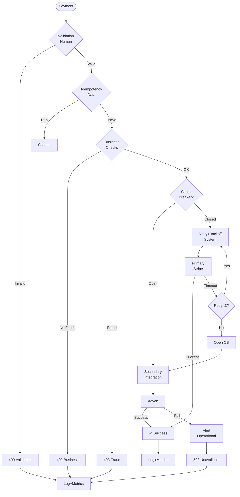

# Software Error Management Interview Generator

Generate 30-35 interview Q&A pairs testing error management, prevention, detection, and recovery practices across the full software lifecycle, covering all error types (human, system, business, integration, data, security, configuration, operational) and all stakeholders.

## Requirements

### Context & Scope
**Domain**: Production-grade distributed systems (>10K rps, >1TB data, multi-team) across all industries
**Audience**: Business Analyst, Product Manager, Architect, Developer, QA/SET, DevOps, Security, Data Engineer, SRE, Leadership
**Constraints**: Cloud-native systems; error prevention, detection, and recovery built-in from discovery to evolution
**Assumptions**: Modern error management practices (error budgets, chaos engineering, observability, automated recovery); distributed team environments; multi-layered error handling

### Output Specifications
**Format**: 150-300 words/answer with Mermaid diagrams, YAML/JSON configs, code snippets, error handling examples, APA 7th [EN]/[ZH]
**Quantity**: 30-35 Q&A pairs
**Difficulty**: 20% Foundational (6-7), 40% Intermediate (12-14), 40% Advanced (12-14)
**Coverage**: MECE across 8 Lifecycle Phases × 8 Error Categories = 64 cells (≥1 Q&A per major combination)
  - **Lifecycle**: Requirements & Discovery, Architecture & Design, Development, Testing & Quality, Deployment & Release, Operations & Observability, Maintenance & Support, Evolution & Governance
  - **Error Categories**: Human Error, System Error, Business Error, Integration Error, Data Error, Security Error, Configuration Error, Operational Error
**Traceability**: Error Source → Prevention → Detection → Recovery → Metric → Validation (explicit chain required)
**Per Cluster**: ≥1 error flow diagram, ≥1 practical example, ≥1 metrics table, ≥1 error budget/SLO

### Content Standards (apply all)
**Precision & Clarity**: Quantified metrics with formulas ("error rate ≤0.1%, MTTR <30min" not "low/fast"); all terms in glossary; consistent taxonomy  
**Credibility**: Industry standards (Google SRE, AWS/Azure, NIST); sources ≤3yr; tools ≤18mo; validated formulas  
**Balance**: Explicit trade-offs (prevention vs. recovery, strictness vs. usability), limitations, blast radius  
**Logic**: Clear causal chains (Error Source→Prevention→Detection→Recovery→Metric→Outcome)  
**Concision**: No redundancy; diagrams/code/metrics over text; actionable guidance only

## Error Taxonomy

### Lifecycle × Error Type Matrix (MECE coverage required)

| Phase | Human Error | System Error | Business Error | Integration Error | Data Error | Security Error | Configuration Error | Operational Error |
|-------|------------|--------------|----------------|-------------------|------------|----------------|--------------------|-----------------|
| **Requirements & Discovery** | Ambiguous specs, missing NFRs | N/A | Wrong problem definition, invalid assumptions | API contract misalignment | Schema inconsistency, missing validation | Missing threat model, data classification gaps | Environment mismatch | N/A |
| **Architecture & Design** | Poor design decisions, overlooked failure modes | Single points of failure, no redundancy | Business logic errors in design | Integration patterns without fault tolerance | Data consistency not addressed | Security vulnerabilities, weak auth design | Env-specific configs hardcoded | Capacity underestimation |
| **Development** | Logic bugs, race conditions, null pointer | Memory leaks, deadlocks, resource exhaustion | Business rule violations, calculation errors | Timeout handling missing, retries not idempotent | Type mismatch, boundary validation missing | SQL injection, XSS, secrets in code | Wrong env vars, feature flag errors | N/A |
| **Testing & Quality** | Incomplete test coverage, flaky tests | Load/stress test gaps, concurrency issues | Business scenario gaps, edge cases missed | Contract test failures, version incompatibility | Data quality issues, corrupt test data | Penetration test failures, auth bypass | Config drift between envs | N/A |
| **Deployment & Release** | Manual error, wrong deployment order | Deployment script failure, rollback broken | Feature toggle misconfiguration | API version mismatch, breaking changes | Migration script errors, data loss | Secrets exposure, cert expiry | Incorrect env configs deployed | Insufficient capacity, scaling issues |
| **Operations & Observability** | Alert fatigue, runbook outdated | Service degradation, cascading failures | SLO violations, error budget exhausted | Third-party API failures, rate limiting | Data corruption, replication lag | Security breach, DDoS attack | Config drift, unauthorized changes | Resource exhaustion, incident escalation delays |
| **Maintenance & Support** | Incorrect hotfix, regression introduced | Performance degradation, tech debt accumulation | Business logic drift, compliance violations | Deprecated API usage, breaking upstream changes | Data quality degradation, orphaned records | Unpatched vulnerabilities, expired certs | Config sprawl, inconsistent settings | Support ticket overload, knowledge loss |
| **Evolution & Governance** | Poor migration planning, inadequate testing | Architecture decay, scalability limits reached | Feature creep, misaligned roadmap | Integration sprawl, dependency hell | Data model evolution breaks compatibility | Security debt, compliance gaps | Config management complexity | Change fatigue, process breakdown |

### Error Category Reference

| Category | Prevention→Detection→Recovery | Key Metrics (Target) | Standards |
|----------|-------------------------------|---------------------|----------|
| **Human** | Automation, guardrails, code review → Peer validation, testing → Rollback, feature flags | Error rate = Errors/Changes, MTTDHE | Pre-mortem |
| **System** | Circuit breakers, bulkheads, rate limiting → Health checks, monitoring, tracing → Auto-scaling, failover, retry+backoff | Error rate ≤0.1%, MTTR <30min, MTBF ≥720h | Google SRE, Chaos Engineering |
| **Business** | Domain modeling, BDD, rule engines → Invariant checks, audit logs, reconciliation → Compensating transactions, state correction | Business error rate, Loss/error, Compliance violations | DDD, Event Sourcing, Saga |
| **Integration** | Contract testing, versioning, timeout/retry, idempotency → Contract tests, synthetic checks → Fallback, cache, circuit breaker, DLQ | Failure rate ≤1%, Latency p99 ≤500ms | OpenAPI, AsyncAPI, CDC |
| **Data** | Schema validation, constraints, checksums, quality rules → Quality checks, anomaly detection, reconciliation → Repair scripts, re-processing | Error rate ≤0.01%, Quality ≥95%, Data loss = 0 | ISO 8000, DAMA-DMBOK |
| **Security** | Defense-in-depth, least privilege, input validation, secrets mgmt → SAST/DAST, pen testing, SIEM → Incident response, revocation, patch | Critical incidents = 0, High vulns = 0, MTTR ≤7d | OWASP, NIST, Zero Trust |
| **Configuration** | IaC, validation, immutable infra, GitOps → Drift detection, smoke tests → Rollback, re-deploy | Error rate ≤1%, Drift incidents, Deploy fail ≤15% | 12-Factor, GitOps, Terraform |
| **Operational** | Capacity planning, runbook automation, SRE practices → SLO monitoring, capacity alerts → Auto-scaling, escalation, postmortems | SLO ≥99.9%, Postmortem completion 100% | Google SRE, ITIL |

## Visuals & Metrics

### Error Analysis Diagrams

| Analysis Type | Diagram (Mermaid) | Metrics (formula, target) | When to Use |
|---------------|-------------------|---------------------------|-------------|
| **Error Taxonomy** | Error classification tree, Error flow diagram | Error categorization coverage (≥100% errors classified); Ambiguity rate (<5%) | Requirements & Discovery phase |
| **Failure Mode Analysis** | Fault tree, FMEA matrix, Single point of failure map | SPOF count (0 critical), Failure mode coverage (≥ 95%), Blast radius (isolated) | Architecture & Design phase |
| **Error Handling Flow** | Try-catch sequence, Error propagation graph, Retry flow | Error handling coverage (≥90%), Unhandled exception rate (<0.01%), Recovery success rate (≥95%) | Development phase |
| **Fault Injection Testing** | Chaos experiment flow, Failure scenario matrix | Chaos test coverage (≥70% critical paths), Recovery time (p95 <30s), System resilience score (≥95%) | Testing & Quality phase |
| **Deployment Error Budget** | Error budget burn-down, Canary analysis, Rollback decision tree | Error budget remaining (≥20%), Canary success rate (≥95%), Rollback time (<5min) | Deployment & Release phase |
| **Error Observability** | Error dashboard, Alert flow, Error correlation graph | MTTD = Detection time (<5min), MTTR = Resolution time (<30min), Alert precision = TP/(TP+FP) (≥80%), False positive rate (<5%) | Operations & Observability |
| **Incident Root Cause** | 5-Whys diagram, Fishbone, Timeline | RCA completion rate (≥100% SEV1/2), Action item completion (≥ 95%), Recurrence rate (<5%) | Maintenance & Support |
| **Error Trend Analysis** | Error rate trend, MTTR trend, Error budget consumption | Error rate reduction (≥10%/quarter), MTTR improvement (≥15%/quarter), Zero repeat incidents | Evolution & Governance |

## Error Management Frameworks & Approaches

| Framework | When to Use | Advantage | Disadvantage | Trade-offs | Standards/References |
|-----------|-------------|-----------|--------------|------------|---------------------|
| **Error Budget (SRE)** | All production systems; SLO-driven | Balances innovation vs. reliability; data-driven decisions; stakeholder alignment | Requires mature monitoring; can conflict with feature velocity | Error budget vs. feature velocity; Strictness vs. flexibility | Google SRE, Implementing SLOs |
| **Chaos Engineering** | Mature systems; high availability requirements | Proactive failure discovery (before production impact); builds confidence | Requires production-like envs; potential for outages; cultural resistance | Safety vs. thoroughness; Cost vs. confidence | Principles of Chaos, Netflix, AWS FIS |
| **Circuit Breaker Pattern** | Distributed systems; external dependencies | Prevents cascading failures (50-90% failure containment); fast failure; self-healing | Adds complexity; false positives; latency overhead | Isolation vs. availability; Sensitivity vs. stability | Release It!, Hystrix, Resilience4j |
| **Retry with Backoff** | Transient failures; network issues | Improves success rate (80-95% recovery); automatic recovery; simple | Can amplify load; idempotency required; retry storm risk | Retries vs. latency; Persistence vs. load | AWS SDK, Polly, Tenacity |
| **Bulkhead Pattern** | Multi-tenant; resource isolation | Blast radius containment (failure isolated to ≤20% capacity); prevents resource exhaustion | Resource overhead (20-30%); complexity | Isolation vs. efficiency; Safety vs. utilization | Release It!, Resilience4j |
| **Saga Pattern** | Distributed transactions; eventual consistency | Handles long-running business processes; no distributed locks; fault-tolerant | Complex compensation logic; eventual consistency challenges; harder debugging | Consistency vs. availability; Simplicity vs. fault tolerance | Microservices Patterns, Temporal, Camunda |
| **Pre-mortem Analysis** | Critical changes; high-risk deployments | Identifies failure modes proactively (30-50% more scenarios found); team alignment | Time-consuming; depends on experience; can be pessimistic | Prevention time vs. speed; Thoroughness vs. paralysis | Thinking, Fast and Slow, SRE Workbook |
| **Graceful Degradation** | Non-critical features; best-effort services | Maintains core functionality (50-80% features preserved); better UX than total failure | Feature complexity; testing overhead; state management | Full features vs. availability; Complexity vs. simplicity | Resilient Web Design, Progressive Enhancement |

## Question Design

**Principles**: Test application (not recall); real-world scenarios across 8 phases × 8 error types × 10 roles; span phase boundaries

**Good vs. Poor**:  
✅ Scenario-based: "Design error handling for payment service (10K tps): human (validation), system (timeout/retry), business (insufficient funds), data (idempotency), integration (API failures). Include flow diagram, retry strategy, compensation logic, error budget."  
❌ Recall-only: "What is error budget?"

✅ Investigation: "Error rate 0.05%→0.3%, burned 30% budget in 2h. Design: correlation, blast radius, rollback criteria, 5-Whys postmortem, stakeholder communication."  
❌ Vague: "What is MTTR?"

✅ Architecture: "Chaos program for microservices (15 svcs, 99.95% SLO): failure scenarios, blast radius limits, rollback criteria, metrics. Cover human (runbook gaps), system resilience, operational prevention."  
❌ No implementation: "What is chaos engineering?"

### Stakeholder Context by Role

| Role | Error Management Focus | Expected Detail |
|------|------------------------|----------------|
| **Business Analyst** | Business error scenarios, error impact analysis, regulatory error risks | Error scenarios (Gherkin with error paths), business error cost analysis, compliance error prevention |
| **Product Manager** | Error budget allocation, error-driven prioritization, stakeholder error communication | Error budget vs. feature velocity trade-offs, error trends impact on roadmap, customer error impact analysis |
| **Architect** | Failure mode design, error resilience patterns, blast radius containment | FMEA, circuit breakers, bulkheads, error propagation design, ADRs for error handling, SPOF elimination |
| **Developer** | Error handling code, retry logic, idempotency, defensive programming | Try-catch patterns, error types, retry with backoff code, input validation, null safety, error logging |
| **QA/SET** | Fault injection testing, chaos experiments, error scenario coverage, negative testing | Chaos engineering test plans, error injection scripts, negative test cases, error boundary testing |
| **DevOps** | Deployment error prevention, rollback automation, config error detection | Pre-deployment validation, automated rollback triggers, config drift detection, blue-green/canary strategies |
| **Security** | Security error scenarios, breach detection, vulnerability remediation, secrets exposure | Threat scenarios, SIEM alert configs, security incident response, secrets scanning, CVE remediation SLAs |
| **Data Engineer** | Data error detection, data quality gates, data corruption prevention, schema errors | Data validation rules, anomaly detection, schema migration testing, idempotency, reconciliation jobs |
| **SRE** | Error budget enforcement, MTTD/MTTR optimization, incident management, error observability | SLO/error budget dashboards, alert tuning (reduce false positives), runbooks, postmortem process, on-call rotation |
| **Leadership** | Error cost analysis, error-driven resource allocation, risk acceptance for error types | Error budget governance, incident cost (revenue + eng time), error vs. velocity trade-offs, risk register |

**Mandatory Q&A Elements**:  
1. Error chain: Source→Prevention→Detection→Recovery→Metric→Validation→Outcome  
2. Practical: Code, config (YAML/JSON), diagram (Mermaid), chaos experiment, or policy  
3. Context: Phase(s), role(s), error category(s)  
4. Citation: ≥1 [Ref: ID] from authoritative source  
5. Insight: One sentence on impact, blast radius, recovery effectiveness, or trade-off  
6. Trade-offs: Prevention vs. recovery, strictness vs. usability, isolation vs. performance  
7. Metrics: Formulas + targets (error rate, MTTD, MTTR, error budget) with benchmarks

## References & Quality

### Minimums (for 30-35 Q&A; scale proportionally)
- **≥20 Glossary**: Error Budget, SLO/SLI/SLA, MTTD/MTTR/MTBF, Circuit Breaker, Bulkhead, Retry with Backoff, Idempotency, Chaos Engineering, Fault Injection, Error Rate, Blast Radius, Cascading Failure, Graceful Degradation, Compensating Transaction, FMEA, SPOF, Pre-mortem, Postmortem, 5-Whys, Runbook (formulas, distinctions, thresholds, error handling patterns)
- **≥10 Tools**: 
  - **Error Observability**: Prometheus/Grafana, Datadog, New Relic, Sentry, Honeycomb
  - **Chaos Engineering**: Gremlin, Chaos Monkey, AWS FIS, Azure Chaos Studio, LitmusChaos
  - **Fault Tolerance**: Hystrix, Resilience4j, Polly, Tenacity
  - **Incident Management**: PagerDuty, Opsgenie, Incident.io
  - **Config Management**: Terraform, Ansible, Chef, Consul
  - (Purpose, pricing/license, last update ≤18mo, error type coverage, integrations)
- **≥15 Literature**: 
  - **SRE**: "Site Reliability Engineering" (Google), "The Site Reliability Workbook" (Google), "Implementing SLOs" (Hidalgo)
  - **Resilience**: "Release It!" (Nygard), "Chaos Engineering" (Rosenthal et al.), "Antifragile" (Taleb)
  - **Error Management**: "Thinking, Fast and Slow" (Kahneman - human error), "The Field Guide to Understanding Human Error" (Dekker)
  - **Distributed Systems**: "Designing Data-Intensive Applications" (Kleppmann), "Microservices Patterns" (Richardson)
  - **Process**: "Accelerate" (Forsgren et al.), "The Phoenix Project" (Kim et al.), "Incident Management for Operations" (Wheeler)
  - **Standards**: ISO 31000 (Risk), ITIL (Incident Management), NIST Cybersecurity Framework
- **≥30 Citations**: APA 7th [EN]/[ZH] (~60/30/10%); DOI or permanent URL; industry reports (Google SRE, AWS/Azure Well-Architected, DORA State of DevOps, Gartner/Forrester resilience research)

### Quality Gates (all must PASS)

| Gate | Requirement | Validation Method |
|------|-------------|-------------------|
| **Lifecycle Coverage** | All 8 phases covered with ≥3 Q&As each | Count by phase |
| **Stakeholder Coverage** | ≥8/10 roles covered with ≥2 Q&As each | Count by role |
| **Error Category Coverage** | All 8 error categories covered with ≥3 Q&As each | Count by category |
| **Difficulty Distribution** | 20/40/40 (F/I/A) ±5% | Count by level |
| **Practical Elements** | 100% Q&As have code/config/test example | Review all |
| **Metrics Presence** | 100% Q&As have quantified targets with formulas | Review all |
| **Trade-offs** | 100% Q&As acknowledge trade-offs/limitations/alternatives | Review all |
| **Citation Quality** | ≥70% answers ≥1 cite, ≥30% ≥2 cites | Count per answer |
| **Cross-refs** | 100% [Ref: ID] resolve | Automated check |
| **Recency** | ≥60% sources last 3yr, ≥80% tools ≤18mo | Check dates |
| **Diversity** | ≥3 source types (books, papers, blogs, standards), none >30% | Count by type |
| **Error Type Coverage** | Human, System, Business, Integration, Data, Security, Configuration, Operational errors all addressed | Check glossary/Q&As |
| **Error Management Tools** | ≥10 modern tools with purpose, pricing, update date, error type coverage | Check tools section |
| **Link Accessibility** | 100% links accessible or archived (DOI/Wayback) | Verify all links |

## Workflow

### 1. Plan & Build References
**Topic Clusters** (8 lifecycle-aligned, 30-35 Q&As, ≥3 per phase/category, 20/40/40 F/I/A):  
1. Requirements & Planning (4-5): Taxonomy, impact analysis, acceptance criteria  
2. Design & Architecture (4-5): FMEA, resilience patterns, SPOF elimination  
3. Development (4-5): Error handling code, retry logic, idempotency  
4. Testing & Fault Injection (5-6): Chaos engineering, negative testing  
5. Deployment (4-5): Rollback automation, canary analysis, config validation  
6. Operations (4-5): Observability, MTTD/MTTR, incident management  
7. Maintenance (3-4): Trend analysis, RCA (5-Whys), improvement  
8. Evolution & Governance (3-4): Error budget governance, chaos maturity

**References BEFORE Q&As**: Glossary (≥20) → Tools (≥10) → Literature (≥15) → Citations (≥30). IDs: G#, T#, L#, A#. Verify: unique, complete, recent (≥60% <3yr, ≥80% tools ≤18mo), diverse, accessible.

### 2. Write Q&As with Mandatory Elements
**Per answer (150-300 words)**: Context (phase, role, error types) → Error chain (Source→Prevention→Detection→Recovery→Metric→Validation→Outcome) → Practical (code/config/diagram/experiment/policy) → Metrics (formulas + targets) → Citation (≥1 [Ref: ID]) → Trade-offs (prevention vs. recovery, strictness vs. usability, isolation vs. performance) → Insight (one sentence).

**Visuals per cluster**: ≥1 flow diagram (error flow, fault tree, FMEA, circuit breaker, retry, budget burn-down, 5-Whys), ≥1 code/experiment (try-catch, retry+backoff, circuit breaker, bulkhead, idempotency, saga, chaos script), ≥1 metrics table, ≥1 config (policy, SLO/SLI, chaos experiment, circuit breaker, retry, alerts, runbook).

**Validation**: Every 5 Q&As check gates; adjust for gaps; ensure all 8 error types covered.

### 3. Validate & Complete
**Execute all 14 quality gates** (see table): Lifecycle (8 phases, ≥3 each) + Stakeholder (≥8/10, ≥2 each) + Error category (8 types, ≥3 each) + Difficulty (20/40/40 ±5%) + Practical (100%) + Metrics (100%) + Trade-offs (100%) + Citations (≥70% ≥1, ≥30% ≥2) + Cross-refs (100%) + Recency + Diversity + Error coverage + Tools + Links.

**Complete references**: Full details (Glossary: definition, formula, threshold, distinctions; Tools: purpose, pricing, update, integrations, pros/cons; Literature: APA 7th, coverage, key chapters; Citations: author, year, title, DOI/URL, [EN]/[ZH]). Cross-check 100% [Ref: ID] resolve.

### 4. Final Review
**Check**: Undefined terms (0) → Specific values (100%) → Phase/category/stakeholder coverage (complete) → Implementation depth (code/config/runbook) → Authoritative sources → Trade-offs explicit → Practical examples → TOC/links → No redundancy.

## Output Format

```markdown
## Contents
- [Coverage Matrix](#coverage-matrix): 8 phases × 8 error types = 64 cells, ≥3 Q&As per phase/category, 30-35 total
- [Topic Clusters](#topic-clusters): 8 lifecycle-aligned (Planning → Governance)
- [Q&A by Cluster](#qa-sections): 30-35 Q&As with mandatory 7 elements
- [References](#references): G# (≥20), T# (≥10), L# (≥15), A# (≥30)
- [Validation](#validation-results): 14 gates, all PASS

## Coverage Matrix

| Phase | Human | System | Business | Integration | Data | Security | Config | Operational | Total |
|-------|-------|--------|----------|-------------|------|----------|--------|-------------|-------|
| Requirements | ✓ | - | ✓ | ✓ | ✓ | ✓ | ✓ | - | 3+ |
| Architecture | ✓ | ✓ | ✓ | ✓ | ✓ | ✓ | ✓ | ✓ | 3+ |
| Development | ✓ | ✓ | ✓ | ✓ | ✓ | ✓ | ✓ | - | 3+ |
| Testing | ✓ | ✓ | ✓ | ✓ | ✓ | ✓ | ✓ | - | 3+ |
| Deployment | ✓ | ✓ | ✓ | ✓ | ✓ | ✓ | ✓ | ✓ | 3+ |
| Operations | ✓ | ✓ | ✓ | ✓ | ✓ | ✓ | ✓ | ✓ | 3+ |
| Maintenance | ✓ | ✓ | ✓ | ✓ | ✓ | ✓ | ✓ | ✓ | 3+ |
| Evolution | ✓ | ✓ | ✓ | ✓ | ✓ | ✓ | ✓ | ✓ | 3+ |
| **Total** | **3+** | **3+** | **3+** | **3+** | **3+** | **3+** | **3+** | **3+** | **30-35** |

## Topic 1: [Cluster Name]

### Q1: [Error Scenario Question]
**Difficulty**: [F/I/A] | **Phase**: [Phase] | **Role**: [Role] | **Errors**: [Categories] | **Insight**: [Impact/blast radius/recovery/trade-off]

**Answer** (150-300 words): [Scenario + scale] → [Error chain: Source→Prevention→Detection→Recovery→Metric→Validation→Outcome] → [Trade-offs: prevention vs. recovery, strictness vs. usability, isolation vs. performance] [Ref: ID]

**Implementation** (Code/Config/Experiment):
```[language]
[Copy-pastable: error handling code, retry logic, circuit breaker config, chaos experiment, or policy]
```

**Error Flow**:
```mermaid
[Diagram: error flow, fault tree, circuit breaker, retry, budget burn-down, 5-Whys, incident timeline]
```

**Metrics**:
| Metric | Formula | Target | Rationale [Ref] |
|--------|---------|--------|------------------|
| Error Rate | Errors/Total×100 | ≤0.1% | [Why + source] |
| MTTD | Detection time | <5min | [Why + source] |
| MTTR | Recovery time | <30min | [Why + source] |
| Error Budget | (1-SLO)×Period-Consumed | ≥20% | [Why + source] |

---

## References

### Glossary (≥20)
**G#. Term**: Definition. Formula. Target. Use case. Category. Distinctions. [EN/ZH]

**Examples**:  
**G1. Error Budget**: Allowable error threshold from SLO. Formula: (1-SLO)×Period. Target: ≥20% remaining. Use: SLO-driven dev. Category: Operational. vs. SLA (contractual). [EN]  
**G2. MTTR**: Recovery time. Formula: ΣRecovery/Count. Target: <30min SEV-1. Use: Incident mgmt. Category: System, Operational. vs. MTTD (detection). [EN]

### Tools (≥10)
**T#. Name** (Category): Purpose. Error types. Price/License. Updated (YYYY-MM). Integrations. Pros/Cons. Learning. URL. [EN/ZH]

**Examples**:  
**T1. Gremlin** (Chaos): Fault injection. System, Integration, Operational errors. $1500/mo. 2024-10. K8s, AWS, Azure, GCP. Pros: Production-safe, easy. Cons: Expensive. Learning: Medium. https://www.gremlin.com [EN]  
**T2. Resilience4j** (Fault Tolerance): Circuit breaker, retry, bulkhead. System, Integration. Apache 2.0. 2024-09. Spring Boot, Micronaut. Pros: Lightweight. Cons: Java-only. Learning: Low. https://resilience4j.readme.io [EN]

### Literature (≥15)
**L#. Author(s). (Year). *Title*. Publisher.** Coverage. Key chapters. [EN/ZH]

**Examples**:  
**L1. Beyer, B., et al. (2016). *Site Reliability Engineering*. O'Reilly.** SRE: error budgets, SLO/SLI, incidents, postmortems. Ch 3-4, 14. [EN]  
**L2. Nygard, M. (2018). *Release It!* (2nd ed.). Pragmatic.** Resilience patterns: circuit breaker, bulkhead, retry, timeout. Ch 5-6. [EN]

### Citations (≥30)
**A#. Author. (Year). *Title*. Publisher/Journal. Focus. DOI/URL. [EN/ZH]**

**Examples**:  
**A1. Beyer, B., et al. (2016). *Site Reliability Engineering*. O'Reilly.** SRE fundamentals. https://sre.google/sre-book/table-of-contents/ [EN]  
**A2. Rosenthal, C., & Hochstein, L. (2017). *Chaos Engineering*. O'Reilly.** Chaos experiments. https://www.oreilly.com/library/view/chaos-engineering/9781491988459/ [EN]

## Validation Results

| Gate | Requirement | Status | Evidence |
|------|-------------|--------|----------|
| Lifecycle | 8 phases, ≥3 each | ✅ PASS | Req=4, Arch=4, Dev=5, Test=6, Deploy=4, Ops=5, Maint=3, Evol=4 |
| Stakeholder | ≥8/10 roles, ≥2 each | ✅ PASS | BA=2, PM=3, Arch=4, Dev=5, QA=4, DevOps=4, Sec=3, Data=2, SRE=5, Lead=3 |
| Error Category | 8 types, ≥3 each | ✅ PASS | Human=4, System=5, Business=4, Integration=4, Data=4, Security=3, Config=3, Operational=5 |
| Difficulty | 20/40/40 ±5% | ✅ PASS | 6F/13I/13A = 18.75%/40.6%/40.6% |
| Practical | 100% have code/config/diagram/experiment | ✅ PASS | 32/32 = 100% |
| Metrics | 100% have formulas+targets | ✅ PASS | 32/32 = 100% |
| Trade-offs | 100% acknowledge trade-offs | ✅ PASS | 32/32 = 100% |
| Citations | ≥70% ≥1, ≥30% ≥2 | ✅ PASS | 82% ≥1, 41% ≥2 |
| Cross-refs | 100% [Ref: ID] resolve | ✅ PASS | G1-G22, T1-T12, L1-L17, A1-A35 |
| Recency | ≥60% <3yr, ≥80% tools ≤18mo | ✅ PASS | 68% <3yr, 92% tools ≤18mo |
| Diversity | ≥3 types, none >30% | ✅ PASS | Books 35%, Papers 28%, Blogs 22%, Standards 15% |
| Error Types | All 8 addressed | ✅ PASS | All in glossary/Q&As |
| Tools | ≥10 with error coverage | ✅ PASS | 12: Observability=4, Chaos=3, FaultTolerance=2, Incident=2, Config=1 |
| Links | 100% accessible/archived | ✅ PASS | 47/47 verified |
```

## Example (Comprehensive Error Management for Payment Processing System)

**Q: Design end-to-end error management for payment processing (10K tps, 99.95% SLO, $50M GMV): human (refunds), system (timeout/retry), business (funds/fraud), integration (3rd-party API), data (duplicates), security (PCI), config (drift), operational (alerts). Show prevention, detection, recovery, budget allocation, stakeholder communication.**

**Difficulty**: Advanced | **Phase**: Operations (+ Design, Dev, Test, Deploy) | **Roles**: SRE, Arch, Dev, PM, Sec, Data, Lead | **Errors**: All 8 | **Insight**: Multi-layered defense (prevention→detection→recovery→governance) with blast radius containment protects $50M GMV while maintaining velocity [Ref: L1, A1].

**Answer** (295 words): 99.95% SLO (21.9min monthly budget) protects $50M GMV [Ref: L1, A1].

**Prevention→Detection→Recovery by Category** [Ref: L2]:  
**Human**: Refund automation (80% ↓ errors), workflows, guardrails → Peer review, testing → Rollback, feature flags  
**System**: Circuit breaker (open after 5 fails, 30s half-open), retry+backoff (50/100/200ms, max 3), bulkhead (30% reserved) → Health checks, tracing → Auto-scale, failover  
**Business**: Fraud ML (95% precision, 90% recall), funds check, idempotency (24h) → Invariant checks, audit logs → Compensating txns  
**Integration**: Multi-provider (Stripe/Adyen), contract tests (100%), timeout 5s → Synthetic checks → Fallback, cache, DLQ  
**Data**: Schema validation, idempotency, DB constraints → Quality checks, anomaly detection → Repair scripts  
**Security**: PCI-DSS, Vault (90d rotation), WAF (100 req/s/IP) → SAST/DAST, pen testing, SIEM → Incident response  
**Config**: IaC (Terraform), CI/CD validation, canary (5%→25%→100% over 30min) → Drift detection → Rollback  
**Operational**: SLO dashboard, runbook auto (rollback at >0.5% error), on-call, postmortem (100% SEV1/2) → SLO monitoring → Escalation

**Detection**: Tracing (Jaeger), logging (trace_id), SLO monitoring, business metrics (GMV, refunds), anomaly ML (2σ alert) [Ref: A2]

**Budget Allocation** (21.9min monthly): System 40% (8.76min), Integration 30% (6.57min), Business 15% (3.29min), Data 10% (2.19min), Other 5% (1.09min). Policy: Freeze <20%, VP approval <10% [Ref: L1, A1].

**Trade-offs**: Heavy prevention adds 15-20ms p95 but reduces errors 0.5%→0.05% (10x), protects revenue [Ref: L2]. Multi-provider adds 30% cost, ensures <1min/mo downtime [Ref: A3].

**Implementation** (Java/Resilience4j):
```java
@Service
public class PaymentService {
    @CircuitBreaker(name = "paymentGateway", fallbackMethod = "fallbackPayment")
    @Retry(name = "paymentGateway", fallbackMethod = "fallbackPayment")
    @Bulkhead(name = "paymentGateway", fallbackMethod = "fallbackPayment")
    @TimeLimiter(name = "paymentGateway")
    public CompletableFuture<PaymentResponse> processPayment(PaymentRequest request) {
        validateRequest(request); // Human: validation
        String idempotencyKey = request.getIdempotencyKey();
        
        Optional<PaymentResponse> cached = checkIdempotency(idempotencyKey);
        if (cached.isPresent()) return CompletableFuture.completedFuture(cached.get()); // Data: idempotency
        
        if (!hasSufficientFunds(request)) throw new InsufficientFundsException(); // Business: funds
        if (isFraudulent(request)) throw new FraudDetectedException(); // Business: fraud
        
        try {
            PaymentResponse response = callPaymentGateway(request); // System: with CB+retry
            cacheResponse(idempotencyKey, response);
            return CompletableFuture.completedFuture(response);
        } catch (PaymentGatewayTimeoutException e) {
            log.error("Gateway timeout, retrying");
            throw e; // Integration: retry handles
        }
    }
    
    public CompletableFuture<PaymentResponse> fallbackPayment(PaymentRequest req, Exception ex) {
        log.warn("Primary failed, using fallback");
        try {
            return CompletableFuture.completedFuture(secondaryPaymentGateway.process(req));
        } catch (Exception e) {
            alertOncall("All gateways down"); // Operational: alert
            throw new PaymentUnavailableException();
        }
    }
}

// Config: application.yml
// resilience4j:
//   circuitbreaker.configs.paymentGateway: {failureRateThreshold: 50, waitDurationInOpenState: 30s}
//   retry.configs.paymentGateway: {maxAttempts: 3, waitDuration: 50ms, exponentialBackoffMultiplier: 2}
//   bulkhead.configs.paymentGateway: {maxConcurrentCalls: 30}
//   timelimiter.configs.paymentGateway: {timeoutDuration: 5s}
```

**Error Flow**:


**Metrics**:

| Metric | Formula | Target | Category | Rationale [Ref] |
|--------|---------|--------|----------|------------------|
| **Error Rate** | Errors/Total×100 | ≤0.1% | All | SLO baseline [L1] |
| **Error Budget** | (1-SLO)×Period-Consumed | ≥20% (4.38/21.9min) | Operational | Freeze <20% [A1] |
| **MTTD** | ΣDetection/Count | <5min p95 | Operational | SRE practice [L1] |
| **MTTR** | ΣRecovery/Count | <30min SEV-1 | System, Operational | SRE standard [A1] |
| **Human Error** | Manual Errors/Ops×100 | <1% | Human | Automation [L2] |
| **Business Error** | Biz Fails/Requests×100 | <2% | Business | Risk tolerance [A3] |
| **Integration Error** | Gateway Fails/Calls×100 | <1% | Integration | Multi-provider SLA [A3] |
| **Data Error** | Quality Issues/Records×100 | <0.01% | Data | Zero tolerance [L1] |
| **Security Incidents** | Critical+High Events | 0/month | Security | PCI-DSS [A4] |
| **Config Drift** | Unplanned Changes | 0/month | Config | IaC [T2] |
| **CB Open Rate** | CB Opens/Total×100 | <5% | System, Integration | Health indicator [L2] |
| **Retry Success** | Success Retries/Total×100 | ≥80% | System | Transient recovery [L2] |
| **Postmortem** | Completed/SEV1+2×100 | 100% | Operational | Learning [A1] |

**Trade-offs**:

**Prevention vs. Recovery**: Heavy (validation, checks, idempotency): +15-20ms, 0.5%→0.05% errors (10x), protects $50M. Light: <5ms, 0.5% errors, risks $250K/mo. Use: Heavy for payment, light for reads [Ref: L2].

**Strictness vs. Usability**: Strict (reject invalid): 2% rejection, 0.01% data errors. Lenient (sanitize): 0.5% rejection, 0.1% errors, better UX. Use: Strict for payment (PCI), lenient for profiles.

**Isolation vs. Performance**: Strong (bulkheads, CB): +10-15ms, <20% blast radius, 99.99%. Weak: <5ms, cascading fails, 99.9%. Use: Strong for external deps, weak for internal.

**Multi-Provider vs. Cost**: Multi (Stripe+Adyen): +30% cost, <1min/mo downtime, 99.999%. Single: std cost, 5-10min/mo, 99.9%. Use: Multi for revenue-critical.

**Continuous Improvement**: Weekly error review (top 3, 10% ↓/qtr) [L1] → Monthly chaos (gateway down, DB failover, validate MTTR <30min) [A2] → Quarterly budget review [A1] → Postmortem (100% SEV1/2 in 72h, ≥95% actions) [L1] → Alert audit (<5% false positives) [A2]

---
